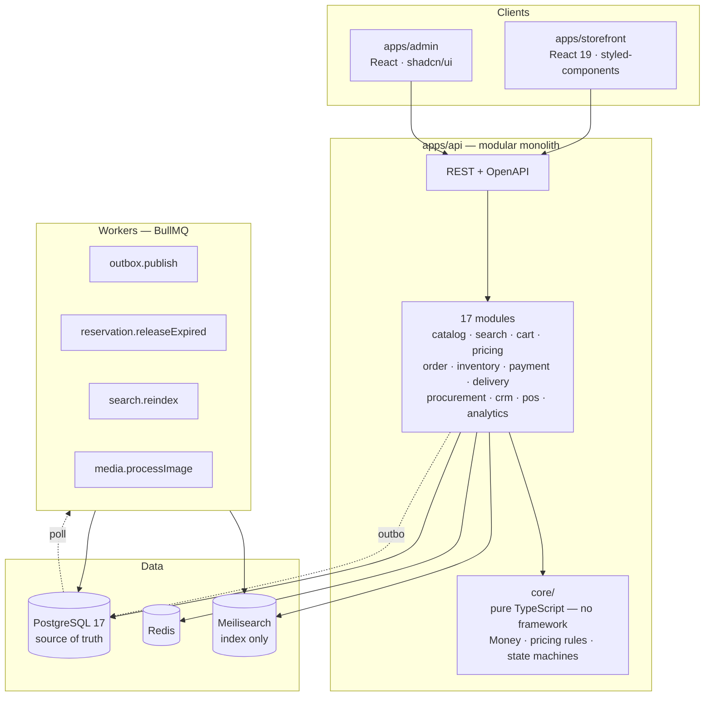

<div align="center">

# Kelvin

**Lighting commerce, end to end**

Storefront · Inventory · Order operations · CRM, POS and analytics — one system for one lighting store.

[](./docs/15-roadmap.md)
[](./docs/)
[](https://nestjs.com/)
[](https://react.dev/)
[](https://www.typescriptlang.org/)
[](https://www.postgresql.org/)
[](./LICENSE)

[Technical spec](./docs/) · [Architecture](./docs/02-architecture.md) · [Decisions](./docs/adr/) · [Roadmap](./docs/15-roadmap.md)

</div>

---

> ### ⚠️ Project status: specification and scaffold
>
> **This is not a working store yet.** What exists today:
>
> - A complete technical specification (~25,000 lines) covering all four scopes
> - A data model (40+ Prisma models), architecture decision records, and a NestJS scaffold
> - An existing React storefront that is **a design shell, not a working shop** — see below
>
> The business logic is **specified in full but not implemented**. Read
> [`docs/15-roadmap.md`](./docs/15-roadmap.md) for what exists and what does not.
> I'd rather say this plainly than have you find out on line three of a controller.

---

## What this is

A lighting store sells chandeliers, spots, track systems, wall sconces, LED strips. Kelvin is the
system that runs such a store end to end: the online shop customers browse, the warehouse behind it,
the delivery and installation crews, the cash register in the showroom, and the reports the owner
reads on Monday morning.

**One store. Not a marketplace, not a SaaS.** Multi-tenancy is explicitly out of scope.

## Why lighting is an interesting domain

E-commerce looks easy from the outside. It isn't — and lighting makes it harder in useful ways.

A furniture product has colour, size, material. A luminaire has **luminous flux (lm), colour
temperature (K), CRI (Ra), IP rating, socket type, wattage, voltage, dimmability, beam angle** — 15+
filterable attributes, several with awkward semantics:

- **IP rating is a partial order** — and this one is a trap. A customer filtering "for a bathroom"
  picks IP44, so IP65 must match too; `WHERE ip_rating = 'IP44'` is wrong. But treating it as a
  simple rank is _also_ wrong: IPx7 (immersion) does **not** cover IPx5 (water jets) — they are
  different tests. That's exactly why `IP65/IP67` dual markings exist. A numeric `rank >= N` filter
  returns wrong results **silently**. See [data model §3.3](./docs/03-data-model.md).
- **Track systems have a compatibility graph.** Track + connector + spot must fit each other.
- **Colour temperature is the brand.** 2700K warm → 6500K cool. That gradient is the logo.

## The hard parts

| Problem                                                             | Why it's difficult                                                                                                                                                                                                                                                                                                 |
| ------------------------------------------------------------------- | ------------------------------------------------------------------------------------------------------------------------------------------------------------------------------------------------------------------------------------------------------------------------------------------------------------------ |
| **[Oversell](./docs/06-inventory-and-reservations.md)**             | Two customers buy the last chandelier at the same instant. Solved with an atomic conditional `UPDATE`, which works _only_ because of PostgreSQL's `EvalPlanQual` under `READ COMMITTED` — raise the isolation level and it breaks **silently**. See [ADR-0007](./docs/adr/0007-atomic-conditional-reservation.md). |
| **[Money](./docs/adr/0003-money-as-bigint-tiyin.md)**               | `BigInt` in tiyin, never float. Split 5,000,000 UZS into 3 instalments and one tiyin goes missing — the customer's debt then never closes. `allocate()` is proven by property test over 500 random amount × term combinations.                                                                                     |
| **[Order saga](./docs/07-order-and-checkout.md)**                   | Payment ↔ reservation ↔ delivery. No distributed transaction, so: compensation. "Paid, but stock ran out" goes to **manual review** — never an automatic refund.                                                                                                                                                   |
| **[Faceted search](./docs/05-catalog-and-search.md)**               | 15+ attributes with live result counts per filter value. Meilisearch returns IDs only; price and stock are always re-read from PostgreSQL, so a stale index causes inconvenience — never overselling.                                                                                                              |
| **[Transactional outbox](./docs/adr/0004-transactional-outbox.md)** | `payment.status = PAID` committed, then the process dies before the event fires. Customer paid, got nothing, no error in the log.                                                                                                                                                                                  |

## Architecture

Modular monolith. Boundaries enforced by CI, not by intention ([ADR-0001](./docs/adr/0001-modular-monolith.md)).



**The central rule:** `core/` — `Money`, pricing rules, state machines — imports neither NestJS nor
Prisma. Plain TypeScript. That code is the most valuable part of the system and testing it should
not require a database. `pnpm --filter @kelvin/api arch:check` fails the build if anything violates
this.

**Two UI stacks on purpose** ([ADR-0005](./docs/adr/0005-two-ui-stacks.md)): the storefront's design
came from a Figma and is already written in styled-components — rewriting 8,700 lines for
consistency buys nothing. The admin panel has no design and needs speed, so it uses shadcn/ui.

## Honest state of the storefront

The React app in `apps/storefront` was measured, not assumed:

|                             |                                                     |
| --------------------------- | --------------------------------------------------- |
| Lines                       | 8,729 — of which **6,313 (72%) are `.styled.js`**   |
| Components with React state | **1 of 48** (`ProductDetail`)                       |
| `fetch` / `axios` calls     | **0**                                               |
| Working cart                | **No** — hardcoded image, no state, no localStorage |
| Backend                     | **None** (until now)                                |

It is a **design shell**. Making it work — state, API, cart, auth, i18n — is the actual project.

Reading it surfaced concrete bugs now documented in [`docs/13-frontend-spec.md`](./docs/13-frontend-spec.md):
`MainLayout` never renders an `Outlet`, so every page mounts its own `Navbar` and `Footer` and cart
state would be lost on navigation; `/product-detail` has no `:slug` param; the product attribute
table still contains **bicycle specs** (Rock Shox fork, carbon frame, 27.5" wheels) under a luminaire
heading — the template was adapted from another domain.

## Documentation

The spec is the deliverable. Written to be implementable, not to impress.

|                                                 |                                                     |
| ----------------------------------------------- | --------------------------------------------------- |
| **[Start here](./docs/)**                       | Index and reading order                             |
| [Vision & scope](./docs/00-vision-and-scope.md) | What this is and is **not**. Honest project history |
| [Architecture](./docs/02-architecture.md)       | Modules, layers, event flow                         |
| [Data model](./docs/03-data-model.md)           | 40+ entities, critical design decisions             |
| [ADRs](./docs/adr/)                             | 7 decisions — what, why, **at what cost**           |
| [Roadmap](./docs/15-roadmap.md)                 | 11 phases, risk register, honest estimates          |

Docs are in **Uzbek** — working documents for whoever builds this. Code and comments in English.

### On honesty

Every doc has an _open questions_ section. Unverified numbers are marked. Every ADR has a mandatory
_negative consequences_ section. Legal questions are flagged as **blockers for a lawyer**, never
answered as advice.

[ADR-0006](./docs/adr/0006-meilisearch-for-faceted-search.md) is marked **conditional**: it assumes
the catalogue is large, and nobody has counted the SKUs. If it turns out to be under 500, PostgreSQL
is enough and that ADR gets revoked — which is the correct outcome for a decision made without
measurement.

## Tech stack

**Backend** — NestJS 11 · TypeScript 5.7 (strict, `exactOptionalPropertyTypes`) · PostgreSQL 17 · Prisma 6 · Redis 7 · BullMQ · Meilisearch · Argon2id · Pino

**Frontend** — React 19 · Vite 7 · styled-components (storefront) · shadcn/ui + Tailwind 4 (admin) · TanStack Query · Zustand · zod

**Testing** — Jest · Testcontainers (real Postgres, not mocks) · fast-check (property-based) · Playwright · k6

**Uzbekistan** — Click · Payme · Uzum · UzCard/Humo · instalments · Eskiz SMS · Telegram

**Monorepo** — pnpm workspaces + Turborepo

## Getting started

```bash
# Requirements: Node 22+, pnpm 9+, Docker

git clone https://github.com/Sarvarbek0704/kelvin.git
cd kelvin
pnpm install

cp .env.example .env        # then fill it in — see the comments
docker compose up -d        # postgres, redis, meilisearch, minio, mailpit

pnpm db:generate
pnpm db:migrate
pnpm db:seed
pnpm dev                    # storefront :5173 · api :3000/api/docs
```

```bash
pnpm test:unit                              # fast — pure logic
pnpm test:integration                       # real Postgres via Testcontainers
pnpm --filter @kelvin/api arch:check        # module boundaries (ADR-0001)
pnpm lint && pnpm typecheck && pnpm build
```

## Credits

**Design** — the storefront UI is built from a Figma provided as course material by the author's
instructor. The original brand in that design was _NORNLIGHT_; only the name and logo were changed
to Kelvin. The layout, grid, colours and typography are the designer's work, not mine. Implementing
a designer's Figma is a frontend developer's job — but the design is theirs and is credited here.

**Repository history** — this repo was previously named `furniture`, which was simply wrong: the
design is a lighting store, not furniture. The earlier commits contain the original coursework
(`lesson17`).

## License

MIT — see [LICENSE](./LICENSE).

## Author

**Sarvarbek Sodiqov** — [sarvarbek-sodiqov.uz](https://sarvarbek-sodiqov.uz) · [GitHub](https://github.com/Sarvarbek0704)
