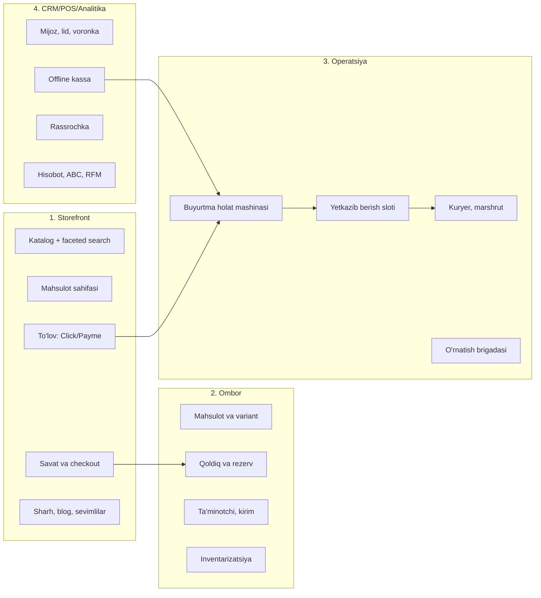

# 00 — Vizyon va qamrov

> **Hujjat maqomi:** Tasdiqlangan · **Oxirgi yangilanish:** 2026-07-15
> **Egasi:** Sarvarbek Sodiqov

---

## 1. Bir gapda

**Kelvin** — yoritish texnikasi do'koni uchun to'liq biznes tizimi: onlayn do'kon, ombor, buyurtma va yetkazib berish operatsiyasi, CRM, kassa va analitika.

## 2. Bu nima EMAS

Bu bo'lim birinchi keladi, chunki chalkashlik xavfi yuqori:

| Emas | Nega bu muhim |
|---|---|
| **Marketplace emas** | Bitta do'kon. Ko'p sotuvchi yo'q |
| **SaaS emas** | Boshqa do'konlarga sotilmaydi. **Multi-tenant arxitektura KERAK EMAS** |
| **Mebel do'koni emas** | Bu **yoritish texnikasi**: qandil, spot, LED lenta, bra, torsher |
| **Uzum Market raqibi emas** | Umumiy e-commerce'da raqobatlashmaydi |

**Repo avval `furniture` deb nomlangan edi — bu xato edi.** Dizayn footer'idagi kategoriyalar buni ochiq ko'rsatadi: Люстры, Споты, Светильники, Трековые светильники, Бра, Уличные светильники, Торшеры, Технические светильники, Комплектующие, Светодиодные ленты, Настольные лампы. Mebel emas, yoritgich.

## 3. Loyihaning kelib chiqishi — halol tarix

Bu bo'lim ataylab ochiq yozilgan.

**Dizayn** — loyiha egasining ustozi bergan Figma (kurs topshirig'i). Asl brend: **NORNLIGHT**. Faqat brend nomi va logotip o'zgardi → **Kelvin**. Layout, grid, ranglar, tipografika, komponent tuzilishi — **hammasi dizaynerniki va o'zgarmaydi**.

Bu uyaladigan narsa emas: **dizaynerning Figma'sini kodga aylantirish — frontend dasturchining aynan ishi.** Yagona qoida — dizaynni "o'zimniki" deb ko'rsatmaslik. README'da muallif ko'rsatiladi.

**Hozirgi kodning haqiqati** — bu ham ochiq yozilishi kerak:

| | |
|---|---|
| Hajm | ~8 700 qator, deyarli hammasi `.styled.js` (CSS-in-JS) |
| Sahifa | 12 ta |
| **React state** | **40 komponentdan faqat 1 tasida** (`ProductDetail`) |
| **Savat** | **Ishlamaydi** — qattiq yozilgan rasm, holat yo'q |
| **Ma'lumot** | **Yo'q** — bironta `fetch`/`axios` yo'q |
| **Backend** | **Yo'q** |

Ya'ni bu **dizayn qobig'i**, ishlaydigan do'kon emas. Loyihaning mohiyati — uni jonlantirish.

## 4. Nima uchun bu loyiha portfolioda

Halol savol: yoritgich do'koni nima uchun qiziq?

**Javob: e-commerce oson ko'rinadi, lekin ichida haqiqiy muhandislik masalalari bor.**

| Masala | Nega qiyin |
|---|---|
| **Oversell** ([06](./06-inventory-and-reservations.md)) | Oxirgi qandilni ikki mijoz bir vaqtda sotib olsa? Race condition, atomik rezerv, TTL, deadlock. Bu **eng nozik qism** |
| **Faceted search** ([05](./05-catalog-and-search.md)) | 15+ atribut bo'yicha filtr + har filtr yonida natija soni. Yoritgichda atributlar ayniqsa boy |
| **Buyurtma saga** ([07](./07-order-and-checkout.md)) | To'lov ↔ rezerv ↔ yetkazib berish. Distributed tranzaksiya yo'q → kompensatsiya |
| **Rassrochka** ([08](./08-payments-and-installments.md)) | Pul matematikasi. 5 mln so'mni 3 oyga bo'lsak, tiyin qayerga ketadi? |
| **Double-entry ledger** ([08](./08-payments-and-installments.md)) | Onlayn va offline sotuv bir xil ledger'ga. `SUM(debit) == SUM(credit)` |
| **Variant matritsasi** ([05](./05-catalog-and-search.md)) | 1 qandil × 4 rang × 3 o'lcham × 2 lampa = 24 SKU |

Bu ro'yxatning birinchisi — **oversell** — Kelvin'ning "og'ir masalasi". Uni to'g'ri yechish uchun concurrency, tranzaksiya izolyatsiyasi va property-based testni tushunish kerak.

## 5. Nega yoritgich domeni boy

Mebel do'konida mahsulot atributi: rang, o'lcham, material. Yoritgichda:

| Atribut | Birlik | Filtrda |
|---|---|---|
| Yorug'lik oqimi | lyumen (lm) | Diapazon |
| **Rang harorati** | **K** (2700/3000/4000/5000/6500) | Aniq qiymatlar — **brend nomi shundan** |
| Rang uzatish (CRI) | Ra | Diapazon |
| Himoya darajasi | IP20…IP67 | **Ierarxik** — IP65 IP44 talabini ham qoplaydi |
| Tsokol | E27, E14, GU10, G9, GU5.3 | Ko'p tanlov |
| Quvvat | W | Diapazon |
| Kuchlanish | 220V / 12V / 24V | 12V → transformator kerak |
| Dimmable | ha/yo'q | Boolean |
| Nur burchagi | ° | Diapazon |
| Lampa komplektda | ha/yo'q | Boolean |

Bundan tashqari:
- **Trek tizimi mosligi** — trek + konnektor + spot bir-biriga mos kelishi kerak (compatibility graph)
- **Xona kalkulyatori** — "20 m² yotoqxonaga qancha lyumen kerak?"
- **Mo'rtlik** — shisha qandil. Qadoqlash, yetkazib berish, sinish bo'yicha qaytarish
- **O'rnatish** — elektrik kerak. Upsell va alohida operatsion oqim

## 6. Bozor — halol baho

⚠️ **Bu loyiha real do'kon uchun emas.** Talablar farazga asoslangan. Bu eng katta xavf va uni yashirmaymiz.

Nima **ma'lum** (tekshirilgan):

| Fakt | Manba |
|---|---|
| O'zbekistonda **6 094 ta** mebel/yoritish korxonasi (2022-yil yanvar) | stat.uz |
| Mebel e-commerce: $76M (2023) → **$124M (2027)**, +12.85%/yil | Statista |
| Soha "mehnat talab qiladigan qo'lda ishlab chiqarish va yuqori moslashtirish talabi" bilan tavsiflanadi | akademik tadqiqot |

Nima **noma'lum** (ochiq savol):

- Real do'konda kuniga nechta buyurtma? → yetkazib berish va marshrut arxitekturasiga ta'sir qiladi
- Nechta SKU? → qidiruv strategiyasiga ta'sir qiladi (PostgreSQL yetarlimi yoki Meilisearch kerakmi)
- Rassrochka ulushi qancha? → bu modulning ustuvorligini belgilaydi
- 1C integratsiyasi kerakmi? → **katta arxitektura ta'siri**

Bu raqamlar to'qib chiqarilmaydi. Ular real do'kon bilan gaplashilganda aniqlanadi.

## 7. Qamrov (loyiha egasi tanladi — to'rttasi ham)

## 8. Muvaffaqiyat mezonlari

⚠️ Bu **bitta do'kon**. "Millionlab foydalanuvchi" bu yerda ma'nosiz.

| Mezon | Maqsad | Qachon |
|---|---|---|
| Storefront statik emas, API'dan ishlaydi | Ha | Faza 2 |
| Oversell concurrency testi o'tadi | 100 parallel → aniq 1 muvaffaqiyat | Faza 3 |
| Buyurtma uchdan-uchgacha ishlaydi | Qidiruv → savat → to'lov → yetkazib berish | Faza 4 |
| Ledger balansi mos | `SUM(debit) == SUM(credit)` har doim | Faza 4 |
| Rassrochka grafigida tiyin yo'qolmaydi | Property test o'tadi | Faza 5 |

**Eng muhim mezon — ikkinchisi.** Agar oversell himoyasi ishlamasa, do'kon yo'q tovarni sotadi va bu real pul yo'qotish.

## 9. Bloklovchi ochiq savollar

| Savol | Kimga | Bloklaydi |
|---|---|---|
| Do'konning o'z rassrochkasi litsenziya talab qiladimi? | **Yurist** | `installment` moduli |
| Fiskal chek / soliq organiga ma'lumot yuborish talabi | **Yurist / buxgalter** | `payment`, `pos` |
| Shaxsiy ma'lumot: lokalizatsiya talabi bormi? | **Yurist** | Hosting tanlovi |
| **SEO: Vite SPA yetarlimi yoki Next.js kerakmi?** | **Loyiha egasi** | Frontend arxitekturasi |
| 1C integratsiyasi kerakmi? | Do'kon | `analytics`, `procurement` |
| Kuniga nechta buyurtma? | Do'kon | Marshrut, slot sig'imi |

**SEO savoli — eng qimmati.** E-commerce trafikning katta qismi Google'dan keladi. Hozirgi Vite SPA client-side render qiladi. Next.js'ga ko'chirish = 8 700 qator styled-components'ni ko'chirish, va styled-components + Next.js App Router muammoli. Bu qaror **qanchalik kech qabul qilinsa, shunchalik qimmat**. Batafsil: [13-frontend-spec.md](./13-frontend-spec.md).

## 10. Non-goals

- Multi-tenant / SaaS (bu bitta do'kon)
- Boshqa do'konlarga sotish
- Umumiy marketplace bo'lish
- Xalqaro bozor (dastlab O'zbekiston)
- Mobil ilova (dastlab responsive web)
- O'z to'lov protsessingi (Click/Payme orqali)

## 11. Keyingi hujjatlar

| Hujjat | Nima haqida |
|---|---|
| [01-product-spec.md](./01-product-spec.md) | Personalar, user story, RBAC |
| [02-architecture.md](./02-architecture.md) | Monorepo, modullar, qatlamlar |
| [03-data-model.md](./03-data-model.md) | Ma'lumotlar modeli |
| [15-roadmap.md](./15-roadmap.md) | Yo'l xaritasi va xavflar |
