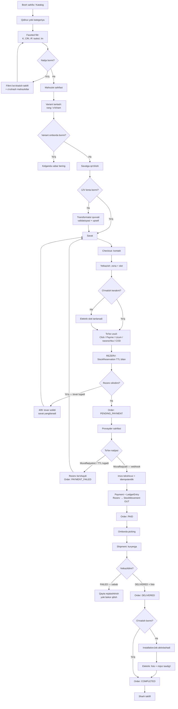
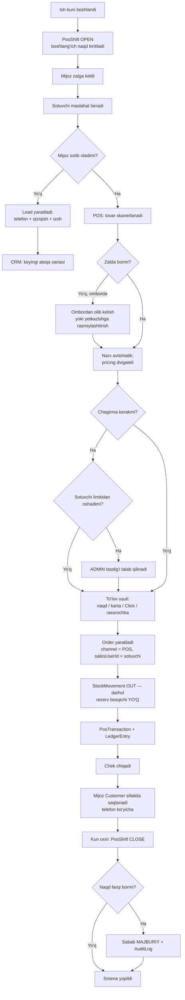
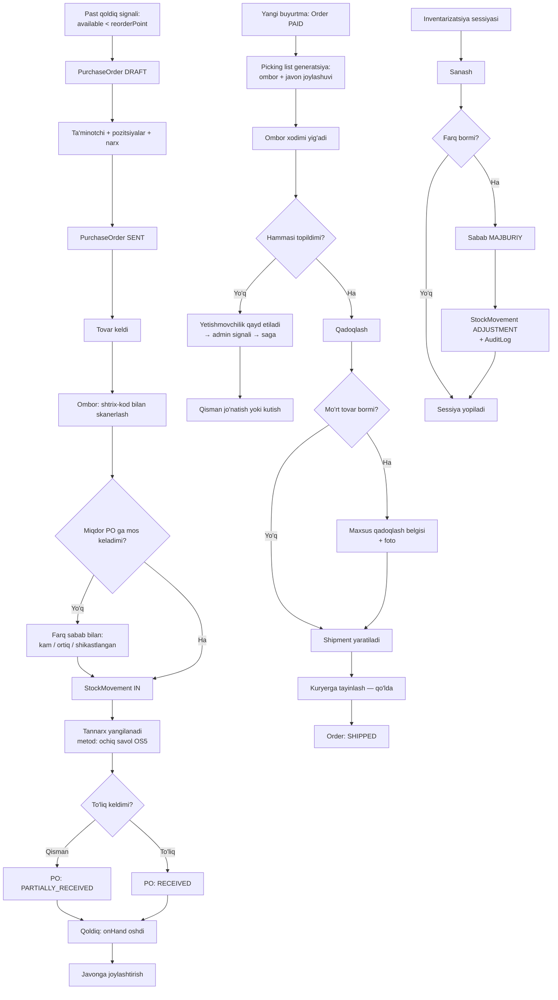

# Kelvin — Mahsulot spetsifikatsiyasi (Product Spec)

> **Loyiha:** Kelvin — yoritish texnikasi do'koni uchun to'liq biznes tizimi.
> **Bozor:** O'zbekiston. **Model:** bitta do'kon (single-tenant), marketplace emas.
> **Kanon:** `KELVIN_CANON.md`. Ziddiyat bo'lsa — kanon g'olib.

**Bog'liq hujjatlar:**
- [`docs/02-architecture.md`](./02-architecture.md) — tizim arxitekturasi, modul chegaralari
- [`docs/04-api-spec.md`](./04-api-spec.md) — API konvensiyalari va endpoint'lar
- [`docs/05-catalog-and-search.md`](./05-catalog-and-search.md) — katalog modeli, faceted search
- [`docs/11-security.md`](./11-security.md) — auth, token rotatsiya, RBAC amalga oshirilishi

---

## 0. Bu hujjat nima uchun

Bu hujjat **nima quriladi** va **kim uchun** degan savolga javob beradi. **Qanday quriladi**
— `02-architecture.md` da.

Hujjat ataylab **halol**: bugun mavjud narsa — Figma dizaynidan ko'chirilgan statik React
frontend (~8 700 qator, backend yo'q, savat ishlamaydi). Qolgan hamma narsa —
rejalashtirilgan ish. Quyida "bor" deb yozilgan yagona narsa — 12 ta sahifaning
vizual qobig'i.

**Nima aniq emas** (raqam to'qib chiqarilmaydi):
- Do'konning real aylanmasi, mijozlar soni, SKU soni — NOMA'LUM.
- Click/Payme/rassrochka provayderlarining API detallari — rasmiy hujjat kerak.
- 1C integratsiyasi talab qilinadimi — tasdiqlanmagan.

Bularning har biri §11 "Ochiq savollar" da qayd etilgan.

---

## 1. Personalar

Har persona uchun: **kim** → **og'rig'i** → **Kelvin nima beradi** → **muvaffaqiyat mezoni**.

Personalar tasavvurdan emas, **yoritish do'konining real operatsion oqimidan** olindi:
zalda sotuvchi bor, omborda qoldiq bor, kuryer mo'rt qandil olib boradi, elektrik
o'rnatadi. Har biri tizimga tegadi.

---

### P1 — Xaridor: kvartira ta'mirlayotgan oila

**Kim.** 28–45 yosh, Toshkent yoki viloyat markazi. Kvartira ta'mirlash bosqichida.
Bir vaqtning o'zida 5–15 ta yoritgich kerak: zalga qandil, oshxonaga spot,
vannaxonaga IP44 li chiroq, koridorga LED lenta. Texnik atamalarni bilmaydi.
Telefon orqali qidiradi. Rus yoki o'zbek tilida.

**Og'rig'i.**
- "2700K bilan 4000K farqi nima?" — bilmaydi, lekin noto'g'ri tanlasa xona sovuq ko'rinadi.
- "Bu chiroq vannaxonaga bo'ladimi?" — IP reytingini tushunmaydi, lekin xato qilsa xavfli.
- "20 m² zalga qancha yorug'lik kerak?" — tasavvuri yo'q, sotuvchining so'ziga ishonadi.
- Rasmda oltin rangda ko'rinadi, kelgani xrom bo'lib chiqadi (variant chalkashligi).
- Qandil shisha — yetkazib berishda sinishidan qo'rqadi.
- O'rnatishni kim qiladi? Elektrik alohida topilishi kerak.

**Kelvin nima beradi.**
- Rang haroratini **vizual** ko'rsatish (2700K/4000K/6500K — bir xil xonaning uch varianti).
- Filtrni **savol tilida** berish: "Qayerga?" (vannaxona → IP44+ avtomatik).
- **Xona kalkulyatori**: m² + xona turi → tavsiya etilgan lyumen diapazoni.
  ⚠️ Normalar QMQ/ShNQ yoki xalqaro standartdan tekshirilishi kerak (§11-OS3).
- Variantni rasm bilan bog'lash: rang tanlansa — rasm o'zgaradi.
- Mo'rt tovar uchun alohida qadoqlash belgisi va sinish bo'yicha qaytarish siyosati.
- Checkout'da **o'rnatish xizmatini** qo'shish (upsell, alohida slot).
- Click/Payme/Uzum + **rassrochka** — O'zbekistonda bu ko'pincha asosiy to'lov usuli.

**Muvaffaqiyat mezoni.**
- Buyurtmani sotuvchiga qo'ng'iroq qilmasdan yakunlay oldi.
- Qaytarish sababi "kutganimdek emas / rang boshqa" bo'lgan holatlar ulushi pasaydi.
  ⚠️ Bazaviy qiymat NOMA'LUM — tizim ishga tushgach 3 oy o'lchanadi, keyin target qo'yiladi.

---

### P2 — Xaridor: dizayner / arxitektor

**Kim.** Interyer dizayneri yoki arxitektor. Loyiha uchun bir vaqtda 30–200 yoritgich
tanlaydi. **Texnik parametr birinchi o'rinda**: CRI, rang harorati bir xilligi, beam angle,
dimmable. Sotuvchidan ko'ra ko'proq biladi. Vaqti qimmat.

**Og'rig'i.**
- Katalogda CRI yozilmagan — har mahsulot uchun ta'minotchining PDF datasheet'ini qidirishi kerak.
- "Bu 40 ta spot bir partiyadan bo'ladimi?" — rang harorati partiyadan partiyaga farq qiladi.
- Loyiha uchun tanlangan 60 ta pozitsiyani ro'yxat qilib saqlash joyi yo'q — Excel'da yuritadi.
- Trek tizimi: trek + konnektor + spot mos keladimi — qo'lda tekshiradi, xato qiladi.
- 12V lenta uchun transformator quvvati — o'zi hisoblaydi, xato qilsa lenta kuyadi.
- Miqdorda chegirma bormi? Har safar telefon qilishi kerak.
- Qoldiq real bormi? "Bor" deyishadi, keyin "ta'minotchidan 3 haftada keladi" chiqadi.

**Kelvin nima beradi.**
- **To'liq texnik atributlar** har mahsulotda (kanon §4 dagi 15+ atribut) va ularning
  hammasi **filtrlanadi va taqqoslanadi**.
- **Taqqoslash jadvali** — 4 tagacha mahsulot yonma-yon, atribut bo'yicha.
- **Loyiha ro'yxati** (favorites'ning kengaytmasi): nomlangan ro'yxat, miqdor bilan,
  eksport (PDF/CSV) va bir tugma bilan savatga.
- **Trek mosligi grafi**: trek tanlansa — faqat mos konnektor va spotlar ko'rsatiladi
  (kanon §9.7).
- **12V yuklama validatsiyasi**: lenta uzunligi × W/m → kerakli transformator quvvati,
  savatga qo'shishda ogohlantirish (kanon §9.4).
- **Real qoldiq** ombor bo'yicha + "ta'minotchidan kelish muddati" (agar `PurchaseOrder` bor bo'lsa).
- **B2B narx**: `PriceList` orqali dizayner segmenti uchun alohida narx (kanon §8).
- Lead sifatida CRM ga tushadi — katta loyiha bo'lsa menejer bog'lanadi.

**Muvaffaqiyat mezoni.**
- Loyiha ro'yxatini Excel'siz yig'a oldi va bir tugma bilan so'rovga aylantirdi.
- Texnik xato (noto'g'ri IP, yetmagan transformator) tizim tomonidan checkout'gacha ushlandi.
- Takroriy xarid: bir dizayner ikkinchi loyihasi bilan qaytdi.

---

### P3 — Xaridor: qurilish brigadasi / elektrik

**Kim.** Ob'ektda ishlayotgan usta yoki brigadir. Ko'p miqdorda, arzon, **tez** kerak.
Brend muhim emas — parametr va narx muhim. Ko'pincha telefondan, ba'zan zalga o'zi keladi.
Naqd pul yoki o'tkazma. Hisob-faktura kerak bo'lishi mumkin.

**Og'rig'i.**
- 50 ta bir xil spot kerak — bittalab savatga qo'shish azob.
- "Hozir bormi?" — javob 5 daqiqada kerak, ertaga emas.
- Kecha 12 000 edi, bugun 13 500 — narx o'zgarishi haqida ogohlantirilmaydi.
- Ob'ektga yetkazib berish kerak, uyga emas — manzil noaniq, koordinata kerak.
- Ortiqcha qolgan 7 ta spotni qaytarish — "chekingiz yo'q" deyishadi.

**Kelvin nima beradi.**
- **SKU / shtrix-kod bo'yicha tez qidiruv** va bevosita miqdor kiritish.
- **Real-time qoldiq** ombor kesimida, "bor/yo'q" emas — aniq son (yoki
  `>10` ko'rinishida, agar aniq son biznes uchun sezgir bo'lsa — §11-OS7).
- **Takroriy buyurtma**: oldingi buyurtmani bir tugma bilan qaytarish.
- **Miqdor chegirmasi** `pricing` modulida qoida sifatida — telefon qilish shart emas.
- **Ob'ekt manzili** koordinata bilan (xarita nuqtasi), zona/slot orqali yetkazish.
- Har buyurtma tizimda — qaytarish uchun qog'oz chek shart emas.

**Muvaffaqiyat mezoni.**
- 50 pozitsiyali buyurtma 3 daqiqada rasmiylashtirildi.
- "Bormi?" savoli uchun qo'ng'iroq soni pasaydi (o'lchov: `search` → `order` konversiyasi
  bu segmentda). ⚠️ Bazaviy qiymat yo'q.

---

### P4 — Do'kon sotuvchisi (zal)

**Kim.** Zalda ishlaydi. Mijoz bilan yuzma-yuz. Kompyuter yoki planshet oldida.
Kuniga o'nlab mijoz. Komissiya oladi → sotuv unga tegishli bo'lishi muhim.

**Og'rig'i.**
- Mijoz "shu qandil boshqa rangda bormi?" deydi — omborga qo'ng'iroq qiladi, kutadi.
- Narx va chegirmani kalkulyatorda hisoblaydi — xato qiladi.
- Chek yozish qo'lda — navbat yig'iladi.
- Onlayn buyurtma va zal savdosi ikki xil daftar — qoldiq chalkashadi.
- Oyning oxirida "mening sotuvim qancha edi?" — javob yo'q.
- Mijoz "keyin kelaman" deydi va yo'qoladi — kuzatuv yo'q.

**Kelvin nima beradi.**
- **POS** (`pos` moduli): smena ochish/yopish, naqd/karta, chek chiqarish.
  Onlayn va offline **bitta `Order`** modeliga tushadi → qoldiq bitta.
- Zaldan turib **real qoldiq** va variantlar (rang/o'lcham) ko'rinadi.
- Narx va chegirma **avtomatik** (`pricing` dvigateli, determinizm majburiy — kanon §9.5).
- **Lead** yaratish: mijoz ketsa ham telefon raqami bilan CRM ga tushadi.
- **Komissiya hisobi**: har `Order` da `salesUserId` → oy oxirida hisobot.

**Muvaffaqiyat mezoni.**
- Zal savdosi qog'ozsiz, chek POS'dan chiqadi.
- Sotuvchi o'z sotuvini va komissiyasini istalgan vaqtda ko'radi.
- Zaldagi qoldiq bilan tizimdagi qoldiq farqi inventarizatsiyada minimal.
  ⚠️ Maqbul farq foizi — do'kon egasi bilan kelishiladi.

---

### P5 — Ombor xodimi

**Kim.** Kirim qabul qiladi, joylashtiradi, buyurtma yig'adi (picking), jo'natishga beradi,
inventarizatsiya qiladi. Qo'lida skaner yoki telefon. Kompyuter oldida kam o'tiradi.

**Og'rig'i.**
- Ta'minotchi 200 ta quti keltirdi — hujjatga qarab qo'lda sanaydi, xato qiladi.
- Buyurtmani yig'ishda "qaysi javonda?" — eslab qoladi yoki qidiradi.
- Qandil sindi — kim aybdor, qachon sindi, hisobdan qanday chiqariladi?
- Sotildi deb yozilgan, lekin javonda turibdi (yoki teskarisi).
- Ikki ombor bor — qaysi birida bor, bilmaydi.

**Kelvin nima beradi.**
- **Shtrix-kod** bilan kirim (`PurchaseOrder` → `StockMovement` `IN`).
- **Picking list**: buyurtma bo'yicha ro'yxat, ombor/javon joylashuvi bilan.
- Har harakat `StockMovement` sifatida yozib boriladi — **kim, qachon, nima, nechta, nega**.
  Hech qanday qoldiq "shunchaki o'zgarmaydi".
- **Ko'p ombor** (`Warehouse`) — qoldiq har ombor bo'yicha alohida.
- **Inventarizatsiya** rejimi: sanash → farqni ko'rsatish → tasdiqlash → `StockMovement`
  `ADJUSTMENT` (sabab majburiy).
- **Rezerv ko'rinadi**: 3 ta bor, 2 tasi rezervda → yig'ishga 1 ta.

**Muvaffaqiyat mezoni.**
- Kirim skaner bilan, qo'lda kiritish istisno holat.
- Inventarizatsiya farqi har safar sababi bilan tushuntiriladi (`ADJUSTMENT` sababsiz yo'q).
- Picking'da "topilmadi" holatlari kamayadi.

---

### P6 — Kuryer

**Kim.** Kunlik marshrut bilan yuradi. Telefon — yagona asbob. Mo'rt tovar tashiydi.
Ba'zan naqd pul oladi (COD). Ba'zan mijoz uyda bo'lmaydi.

**Og'rig'i.**
- Marshrut qog'ozda yoki menejer telefon qilib aytadi.
- Manzil "Chilonzor, 5-kvartal, oldida do'kon bor" — koordinata yo'q.
- Mijoz javob bermaydi — nima qilish kerak, qayerga yozish kerak?
- Qandil sindi — foto qayerga yuboriladi?
- Naqd oldi — kimga topshiradi, qanday hisoblanadi?

**Kelvin nima beradi.**
- **Kuryer PWA** (mobil brauzer, alohida app emas — §11-OS8): kunlik marshrut,
  har to'xtash uchun manzil + koordinata + telefon.
- Holat o'zgartirish bir tugmada: `PICKED_UP` → `IN_TRANSIT` → `DELIVERED` / `FAILED`.
  `FAILED` uchun **sabab majburiy** (enum: mijoz javob bermadi, manzil noto'g'ri,
  rad etdi, tovar shikastlangan).
- Yetkazishda **foto va imzo** (mo'rt tovar uchun — sinish nizosida dalil).
- **COD**: olingan summa `Payment` sifatida yoziladi, smena yopilganda kassaga topshiriladi.
- Marshrut boshida **oddiy: qo'lda tayinlash**. Optimizatsiya keyin (kanon §9.8 — VRP
  NP-qiyin, boshida avtomatlashtirilmaydi).

**Muvaffaqiyat mezoni.**
- Har yetkazish holati va vaqti tizimda — "qayerda?" savoliga javob mijozning o'zida.
- Sinish nizolari fotoli dalil bilan hal bo'ladi.

---

### P7 — O'rnatuvchi elektrik

**Kim.** Qandil/trek/lenta o'rnatadi. Do'kon xodimi yoki shartnomali usta.
Buyurtma bo'yicha manzilga boradi. Ish uchun haq oladi.

**Og'rig'i.**
- "Ertaga soat 10 da bo'l" — qayerda, nima, qancha vaqt oladi, bilmaydi.
- Yetib boradi — qandil hali yetkazilmagan yoki mijoz uyda yo'q.
- Shift beton, perforator kerak edi — bilmagan, qaytib ketadi.
- Qo'shimcha ish chiqdi (eski chiroqni olish) — pulini kim to'laydi?

**Kelvin nima beradi.**
- **`InstallationJob`** — alohida entity, `Order` ga bog'langan, o'z slot'i bilan.
- **Bog'liqlik qoidasi**: o'rnatish sloti faqat `Shipment` `DELIVERED` bo'lgandan keyin
  aktivlashadi. Tizim ikkalasini bir kunga qo'ymaydi (yoki qo'ysa — ketma-ketlik bilan).
- Ish kartasida: mahsulot ro'yxati, mount type, og'irlik, shift turi (mijozdan
  checkout'da so'raladi), mijoz telefoni.
- **Qo'shimcha ish** — jobga qo'shimcha pozitsiya sifatida, mijoz tasdig'i bilan.
- Yakunlash: foto + mijoz tasdig'i → `InstallationJob` `COMPLETED` → haq hisoblanadi.

**Muvaffaqiyat mezoni.**
- Bekor safar (tovar yetmagan / mijoz yo'q) holatlari kamayadi.
- Har o'rnatish yozib boriladi, haq avtomatik hisoblanadi.

---

### P8 — Kontent menejer

**Kim.** Mahsulot kartochkasini to'ldiradi. Ta'minotchidan Excel yoki PDF keladi.
Rasm, tavsif, atribut, narx kiritadi. Kuniga o'nlab SKU.

**Og'rig'i.**
- **Variant portlashi**: 1 qandil × 4 rang × 3 o'lcham × 2 lampa soni = 24 SKU
  (kanon §9.1). Har birini qo'lda kiritish — bir kun ketadi.
- Ta'minotchining Excel'i har safar boshqa formatda.
- Rasm 4 MB, 20 ta — qo'lda siqadi.
- Rus tilida yozdi, o'zbekcha tarjima kim qiladi?
- Atributni "2700" deb yozdi, boshqa joyda "2700K", uchinchisida "теплый" — filtr buziladi.
- Qaysi mahsulotda tavsif yo'q — bilmaydi.

**Kelvin nima beradi.**
- **Variant generatori**: atribut o'qlarini tanlaydi (rang × o'lcham) → matritsa
  avtomatik yaratiladi, narx bazadan meros, faqat farqlar qo'lda tuzatiladi (kanon §9.4).
- **Atribut lug'ati**: `Attribute` + `AttributeValue` — erkin matn EMAS, ro'yxatdan.
  Bu filtrni buzilishdan saqlaydi (`05-catalog-and-search.md`).
- **CSV/Excel import** — mapping profili ta'minotchi bo'yicha saqlanadi, dry-run bilan.
- **Rasm quvuri**: yuklaydi → BullMQ job → resize/webp/thumbnail (kanon §6).
- **Kontent to'liqligi ko'rsatkichi**: kartochkada nima yetishmayotgani ro'yxati
  (tavsif yo'q, CRI yo'q, rasm 1 ta). Nashr qilishdan oldin majburiy maydonlar tekshiriladi.
- **i18n redaktori**: uz-latn / uz-cyrl / ru yonma-yon.

**Muvaffaqiyat mezoni.**
- 24 SKU li variant matritsasi 10 daqiqadan kam vaqtda yaratiladi.
- Nashr qilingan mahsulotlarda majburiy atributlar 100% to'liq (tizim ruxsat bermaydi).
- Filtr atribut qiymatining yozilishi tufayli buzilmaydi.

---

### P9 — Do'kon egasi / direktor

**Kim.** Biznesni boshqaradi. Kod ko'rmaydi. Raqam ko'radi. Telefondan.
Savoli: nima sotilyapti, pul qayerda, kim ishlayapti, nima o'g'irlanyapti.

**Og'rig'i.**
- Oy oxirida hisobot 1C dan yoki buxgalterdan 3 kunda keladi.
- Qaysi mahsulot omborda o'lik yotibdi — bilmaydi.
- Qaysi sotuvchi qancha sotdi — daftardan sanaladi.
- Rassrochka bergan mijoz to'lamadi — qachon bilinadi?
- Kim narxni o'zgartirdi? Kim chegirma berdi? — iz yo'q.

**Kelvin nima beradi.**
- **Dashboard**: bugungi sotuv, buyurtmalar, kutilayotgan to'lovlar, past qoldiq.
- **ABC tahlil** — qaysi SKU aylanmaning asosini beradi, qaysi biri o'lik zaxira.
- **Sotuvchi bo'yicha hisobot** + komissiya.
- **Rassrochka grafigi** (`InstallmentSchedule`) — kechikkanlar ro'yxati avtomatik.
- **`AuditLog`** — narx o'zgarishi, chegirma, qoldiq tuzatishi: kim, qachon, nimadan nimaga.
- **`LedgerEntry`** — pul harakati double-entry mantiqida, `BigInt` tiyinda (kanon §8).

**Muvaffaqiyat mezoni.**
- Asosiy savollarga javob **kutmasdan** olinadi.
- Har pul va qoldiq harakatining muallifi bor.
- ⚠️ "Aylanma X% oshadi" tipidagi va'da bu hujjatda **berilmaydi** — bazaviy raqam
  noma'lum, bunday da'vo to'qima bo'lardi (§10).

---

### Personalar va modullar bog'lanishi

| Persona | Asosiy modullar |
|---|---|
| P1 Oila | `catalog`, `search`, `cart`, `order`, `payment`, `delivery`, `review` |
| P2 Dizayner | `catalog`, `search`, `pricing`, `inventory`, `crm` |
| P3 Brigada | `search`, `cart`, `order`, `pricing`, `inventory`, `delivery` |
| P4 Sotuvchi | `pos`, `crm`, `inventory`, `pricing`, `order` |
| P5 Ombor | `inventory`, `procurement`, `delivery` |
| P6 Kuryer | `delivery`, `order`, `payment` (COD) |
| P7 Elektrik | `delivery` (`InstallationJob`), `order` |
| P8 Kontent | `catalog`, `content`, `pricing`, `admin` |
| P9 Ega | `analytics`, `admin`, `payment`, `inventory` |

---

## 2. User story'lar (17 modul bo'yicha)

Format: **Men `<persona>` sifatida, `<maqsad>` uchun, `<harakat>` qilmoqchiman.**
Har biriga Given/When/Then acceptance criteria.

Bu **to'liq backlog emas** — har modulning eng nozik yoki eng ko'p qiymat beruvchi
story'lari. To'liq backlog implementatsiya bosqichida ochiladi.

---

### 2.1 `identity` — auth, RBAC, sessiya, token rotatsiya

**US-ID-01.** Men **mehmon xaridor** sifatida, buyurtmani yakunlash uchun,
**telefon raqami va SMS kod bilan ro'yxatdan o'tmoqchiman**.

> O'zbekistonda telefon — asosiy identifikator. Email ikkilamchi.

- **Given** ro'yxatdan o'tmagan foydalanuvchi checkout sahifasida
- **When** `+998XXXXXXXXX` kiritadi va "Kod yuborish" bosadi
- **Then** Eskiz.uz orqali 6 xonali kod yuboriladi, kod TTL 5 daqiqa, Redis'da saqlanadi
- **And** bir raqamga kod yuborish rate-limit ostida (`04-api-spec.md` §8)
- **Given** to'g'ri kod kiritildi
- **When** tasdiqlanadi
- **Then** `User` + `Customer` yaratiladi, access token (~15 min) body'da, refresh (~30 kun)
  httpOnly cookie'da qaytariladi
- **And** mehmon `Cart` foydalanuvchi savatiga birlashtiriladi (§2.4 US-CART-03)
- **Given** noto'g'ri kod 5 marta kiritildi
- **When** 6-urinish bo'ladi
- **Then** `429` qaytadi, raqam 15 daqiqaga bloklanadi

**US-ID-02.** Men **xaridor** sifatida, sessiyam uzilmasligi uchun,
**token avtomatik yangilanishini xohlayman**.

- **Given** access token muddati tugagan, refresh amal qiladi
- **When** mijoz `POST /api/v1/auth/refresh` chaqiradi
- **Then** yangi access + **yangi refresh** qaytadi, eski refresh bekor qilinadi (rotation)
- **Given** allaqachon ishlatilgan refresh token qayta yuborildi (reuse detection)
- **When** server buni aniqlaydi
- **Then** **butun token oilasi** bekor qilinadi, `401`, `AuditLog` yoziladi
- **And** detallar → [`docs/11-security.md`](./11-security.md)

**US-ID-03.** Men **do'kon egasi** sifatida, xavfsizlik uchun,
**xodimga rolni tayinlamoqchiman**.

- **Given** `OWNER` roli bilan tizimga kirganman
- **When** xodimga `WAREHOUSE` rolini beraman
- **Then** rol darhol kuchga kiradi, `AuditLog` ga yoziladi (kim, kimga, qachon)
- **Given** `ADMIN` roli
- **When** kimgadir `OWNER` rolini bermoqchi bo'ladi
- **Then** `403` — `OWNER` faqat `OWNER` tomonidan beriladi (§4)

---

### 2.2 `catalog` — mahsulot, kategoriya, atribut, variant, media

**US-CAT-01.** Men **kontent menejer** sifatida, 24 ta SKU ni qo'lda kiritmaslik uchun,
**variant matritsasini avtomatik generatsiya qilmoqchiman**.

- **Given** bazaviy `Product` ("Zamonaviy qandil") yaratildi
- **When** variant o'qlarini tanlayman: rang [xrom, oltin, qora, nikel] × o'lcham [S, M, L]
  × lampa soni [5, 8]
- **Then** tizim 4 × 3 × 2 = 24 ta `ProductVariant` preview ko'rsatadi
- **And** har biriga SKU shabloni bo'yicha kod beriladi
- **And** narx bazaviy mahsulotdan meros, farqi qo'lda kiritiladi
- **And** men mumkin bo'lmagan kombinatsiyalarni (masalan, S o'lcham × 8 lampa) o'chiraman
- **When** tasdiqlayman
- **Then** faqat qolgan variantlar bitta tranzaksiyada yaratiladi
- **And** batafsil → [`docs/05-catalog-and-search.md`](./05-catalog-and-search.md)

**US-CAT-02.** Men **kontent menejer** sifatida, filtr buzilmasligi uchun,
**atributni erkin matn emas, lug'atdan tanlamoqchiman**.

- **Given** mahsulotga `color_temperature` qo'shyapman
- **When** maydonni ochaman
- **Then** faqat ruxsat etilgan `AttributeValue` lar ko'rinadi: 2700K, 3000K, 4000K, 5000K, 6500K
- **And** erkin matn kiritish imkoni YO'Q
- **Given** ta'minotchi yangi qiymat berdi (masalan 3500K)
- **When** lug'atga qo'shmoqchi bo'laman
- **Then** bu alohida amal (`catalog:attribute:write` ruxsati) va `AuditLog` ga tushadi

**US-CAT-03.** Men **xaridor** sifatida, xato qilmaslik uchun,
**rang tanlaganimda rasm o'zgarishini xohlayman**.

- **Given** mahsulot sahifasidaman, 4 ta rang varianti bor
- **When** "oltin" ni tanlayman
- **Then** galereya oltin variantining `Media` siga almashadi
- **And** narx, qoldiq, SKU shu variantga yangilanadi
- **And** URL variant bilan yangilanadi (deep link ishlaydi)
- **Given** oltin variant omborda yo'q
- **When** uni tanlayman
- **Then** "Savatga" o'rniga "Kelganda xabar bering" ko'rinadi

**US-CAT-04.** Men **do'kon egasi** sifatida, obro'ni saqlash uchun,
**to'liqsiz kartochka nashr qilinmasligini xohlayman**.

- **Given** mahsulotda CRI va asosiy rasm yo'q
- **When** kontent menejer "Nashr qilish" bosadi
- **Then** `422` — yetishmayotgan majburiy maydonlar ro'yxati maydon darajasida qaytadi
- **And** mahsulot `DRAFT` holatida qoladi

---

### 2.3 `search` — faceted qidiruv, filtr, saralash, tavsiya

**US-SRC-01.** Men **dizayner** sifatida, kerakli spotni topish uchun,
**bir vaqtda bir necha texnik atribut bo'yicha filtrlamoqchiman**.

- **Given** "Споты" kategoriyasidaman
- **When** filtrlayman: `color_temperature = 4000K`, `cri >= 90`, `ip_rating in [IP44, IP54]`,
  `dimmable = true`, `beam_angle <= 36`
- **Then** natijalar 300 ms ichida qaytadi (p95, ⚠️ o'lchov bilan tasdiqlanadi)
- **And** **har filtr qiymati yonida natija soni** ko'rinadi (facet count)
- **And** natija bermaydigan qiymatlar `disabled` (yashirilmaydi — foydalanuvchi
  nima borligini ko'rishi kerak)
- **And** filtr URL ga yoziladi — havolani nusxalash mumkin
- **And** engine tanlovi (PostgreSQL GIN vs Meilisearch) → o'lchov bilan,
  [`docs/05-catalog-and-search.md`](./05-catalog-and-search.md)

**US-SRC-02.** Men **oila xaridori** sifatida, texnik atamani bilmaganim uchun,
**"qayerga kerak" savoli orqali filtrlamoqchiman**.

- **Given** katalogdaman, IP reyting nima ekanini bilmayman
- **When** "Vannaxona" presetini tanlayman
- **Then** `ip_rating >= IP44` avtomatik qo'llanadi
- **And** UI da tushuntirish: "Vannaxona uchun namlikdan himoya IP44 va yuqori kerak"
- **And** preset oddiy filtrlarga aylanadi — men uni ochib o'zgartira olaman
- **And** presetlar ro'yxati konfiguratsiyadan (`admin`), kodda qattiq yozilmagan

**US-SRC-03.** Men **brigadir** sifatida, tez topish uchun,
**SKU yoki shtrix-kod bo'yicha qidirmoqchiman**.

- **Given** qidiruv maydonidaman
- **When** to'liq SKU kiritaman
- **Then** aynan mos variant birinchi natija, "aniq mos" belgisi bilan
- **When** matn kiritaman ("qandil xrom")
- **Then** typo bardoshli qidiruv (`qanil` → `qandil`) ishlaydi
- **And** o'zbek lotin/kirill va rus tilida qidiruv ishlaydi (§7)

---

### 2.4 `cart` — savat, mehmon savati, birlashtirish

**US-CART-01.** Men **xaridor** sifatida, keyin qaytish uchun,
**savatim saqlanib qolishini xohlayman**.

- **Given** mehmonman, savatga 3 ta tovar qo'shdim
- **When** brauzerni yopib, ertaga qaytaman
- **Then** savat joyida (`Cart` server tomonda, anonim ID cookie'da)
- **And** savat TTL — 30 kun (⚠️ aniq muddat biznes qarori, §11-OS9)

**US-CART-02.** Men **xaridor** sifatida, xato qilmaslik uchun,
**savatdagi narx yoki qoldiq o'zgarganini bilishni xohlayman**.

- **Given** savatda 2 hafta oldingi tovar bor, narxi o'zgardi
- **When** savatni ochaman
- **Then** o'zgargan pozitsiya belgilanadi: eski narx → yangi narx
- **And** savatdagi narx **kafolat emas** — narx checkout paytida qayta hisoblanadi
- **Given** tovar qoldig'i savatdagi miqdordan kam
- **When** savatni ochaman
- **Then** ogohlantirish, miqdorni kamaytirish yoki o'chirish taklif qilinadi
- **And** savatda tovar **rezervlanmaydi** — rezerv faqat checkout'da (§2.8)

**US-CART-03.** Men **xaridor** sifatida, ishimni yo'qotmaslik uchun,
**kirganimda mehmon savati birlashishini xohlayman**.

- **Given** mehmon savatimda A va B bor, akkauntimdagi eski savatda B va C bor
- **When** tizimga kiraman
- **Then** natija: A, B, C. B ning miqdori — **maksimum** (qo'shilmaydi;
  qo'shilsa foydalanuvchi kutmagan miqdor chiqadi)
- **And** birlashtirish **idempotent** — takroriy login savatni ikkilantirmaydi

**US-CART-04.** Men **dizayner** sifatida, lenta kuymasligi uchun,
**12V tizimda transformator yetishmasligi haqida ogohlantirilishni xohlayman**.

- **Given** savatda 10 m LED lenta (14.4 W/m → 144 W jami)
- **When** savatda 100 W transformator bor yoki umuman yo'q
- **Then** ogohlantirish: "Kerakli quvvat ≥ 144 W (+20% zaxira → ~173 W). Joriy: 100 W"
- **And** mos transformatorlar taklif qilinadi (upsell)
- **And** bu **blokirovka emas, ogohlantirish** — mijozda o'z transformatori bo'lishi mumkin
- **And** hisob mantiqi (kanon §9.4): `jami W = Σ(uzunlik × W/m)`, zaxira koeffitsienti
  ⚠️ sanoat amaliyoti 20–30% — aniq qiymat elektrik bilan tasdiqlanadi (§11-OS4)

---

### 2.5 `order` — checkout, holat mashinasi, saga

**US-ORD-01.** Men **xaridor** sifatida, buyurtmani rasmiylashtirish uchun,
**checkout'dan bosqichma-bosqich o'tmoqchiman**.

- **Given** savatda tovar bor
- **When** checkout'ni boshlayman
- **Then** bosqichlar: kontakt → yetkazish (zona/slot) → o'rnatish (ixtiyoriy) → to'lov → tasdiq
- **And** har bosqich server tomonda validatsiya qilinadi (mijoz validatsiyasi — UX uchun,
  haqiqat manbai emas)
- **And** yakuniy summa **serverda** hisoblanadi, mijozdan kelgan narxga hech qachon ishonilmaydi
- **Given** buyurtma yaratildi
- **When** tarmoq uzilib, mijoz so'rovni takrorlaydi
- **Then** `Idempotency-Key` tufayli **bitta** buyurtma yaratiladi
  ([`docs/04-api-spec.md`](./04-api-spec.md) §7)

**US-ORD-02.** Men **do'kon egasi** sifatida, chalkashlik bo'lmasligi uchun,
**buyurtma holati faqat ruxsat etilgan yo'l bilan o'zgarishini xohlayman**.

- **Given** buyurtma `PENDING_PAYMENT` holatida
- **When** kimdir uni to'g'ridan-to'g'ri `DELIVERED` qilmoqchi bo'ladi
- **Then** `409` — bu o'tish ruxsat etilmagan
- **And** har o'tish `OrderStatusHistory` ga yoziladi: kim, qachon, nimadan nimaga, sabab
- **And** holat mashinasi — kodda deklarativ jadval, tarqoq `if` lar emas

**US-ORD-03.** Men **xaridor** sifatida, pulim yo'qolmasligi uchun,
**to'lov o'tib tovar tugab qolsa, tizim buni to'g'ri hal qilishini kutaman**.

> Bu kanon §9.3 dagi eng nozik joy. Distributed tranzaksiya emas — **saga**.

- **Given** to'lov muvaffaqiyatli, lekin rezerv TTL tugab, tovar boshqaga sotilgan
- **When** saga rezerv bosqichida muvaffaqiyatsiz bo'ladi
- **Then** **kompensatsiya** ishga tushadi: avtomatik refund boshlanadi
- **And** buyurtma `CANCELLED_OUT_OF_STOCK` holatiga o'tadi
- **And** mijozga SMS/Telegram xabar (sabab bilan)
- **And** `admin` ga ogohlantirish — bu holat **hech qachon jim o'tmasligi kerak**
- **And** har saga qadami `OutboxEvent` orqali (kanon §8)

**US-ORD-04.** Men **xaridor** sifatida, fikrim o'zgargani uchun,
**buyurtmani bekor qilmoqchiman**.

- **Given** buyurtma `PENDING_PAYMENT` yoki `PAID` va hali yig'ilmagan
- **When** bekor qilaman
- **Then** rezerv bo'shatiladi, `PAID` bo'lsa refund boshlanadi
- **Given** buyurtma `SHIPPED`
- **When** bekor qilmoqchi bo'laman
- **Then** o'z-o'zidan bekor qilib bo'lmaydi → qaytarish oqimiga yo'naltiriladi

---

### 2.6 `payment` — Click/Payme/Uzum, rassrochka, ledger, refund

**US-PAY-01.** Men **xaridor** sifatida, qulaylik uchun,
**Click yoki Payme bilan to'lamoqchiman**.

- **Given** checkout'ning to'lov bosqichidaman
- **When** Click ni tanlayman
- **Then** `PaymentAttempt` yaratiladi, provayder sahifasiga yo'naltiriladi
- **And** buyurtma `PENDING_PAYMENT`, rezerv TTL ishlayapti
- **Given** to'lov o'tdi
- **When** provayder webhook yuboradi
- **Then** **imzo tekshiriladi** (webhook'da `Authorization` yo'q — `04-api-spec.md` §11)
- **And** webhook **idempotent** — takroriy chaqiruv ikkinchi to'lovni yaratmaydi
- **And** `Payment` + `LedgerEntry` yoziladi, `BigInt` tiyinda
- **And** ⚠️ Click/Payme protokol detallari NOMA'LUM — rasmiy hujjatdan olinadi (§11-OS1)

**US-PAY-02.** Men **xaridor** sifatida, bir vaqtda to'liq to'lay olmaganim uchun,
**rassrochka olmoqchiman**.

> O'zbekistonda rassrochka — hashamat emas, ko'pincha asosiy usul (kanon §5.4).

- **Given** buyurtma summasi provayder minimumidan yuqori
- **When** rassrochkani tanlayman (3 / 6 / 12 oy)
- **Then** **grafik ko'rsatiladi** to'lashdan oldin: oylik to'lov, jami, ustama
- **And** `Installment` + `InstallmentSchedule` yaratiladi
- **And** har summa `BigInt` tiyinda, yaxlitlash qoidasi aniq: oxirgi to'lov qoldiqni yutadi
  (Σ jadval == jami summa — property test bilan tekshiriladi)
- **And** ⚠️ provayder (Uzum Nasiya / Alif / Intend) API si NOMA'LUM (§11-OS1)

**US-PAY-03.** Men **do'kon egasi** sifatida, pulni nazorat qilish uchun,
**har tiyinning izini ko'rmoqchiman**.

- **Given** to'lov, refund, COD yoki POS naqd operatsiyasi bo'ldi
- **When** hisobotni ochaman
- **Then** har harakat `LedgerEntry` sifatida ko'rinadi
- **And** balans hisoblanadi, qo'lda yozilmaydi
- **And** `Payment` yozuvi **hech qachon o'chirilmaydi va o'zgartirilmaydi** — faqat
  kompensatsion yozuv qo'shiladi (append-only)

---

### 2.7 `delivery` — zona, slot, kuryer, marshrut, o'rnatish

**US-DLV-01.** Men **xaridor** sifatida, uyda bo'lishim uchun,
**yetkazish kunini va vaqt oralig'ini tanlamoqchiman**.

- **Given** manzil kiritildi va `DeliveryZone` aniqlandi
- **When** yetkazish bosqichiga o'taman
- **Then** faqat shu zona uchun **bo'sh** `DeliverySlot` lar ko'rinadi (sig'im hisobga olinadi)
- **And** narx zonaga bog'liq, checkout'da ko'rinadi
- **Given** manzil hech qaysi zonaga tushmaydi
- **When** slot so'rayman
- **Then** "Bu manzilga yetkazib berilmaydi" + menejer bilan bog'lanish varianti

**US-DLV-02.** Men **kuryer** sifatida, ishlashim uchun,
**telefonda kunlik marshrutimni ko'rmoqchiman**.

- **Given** menga bugunga 8 ta yetkazish tayinlangan
- **When** kuryer PWA ni ochaman
- **Then** to'xtashlar ro'yxati: manzil, koordinata, telefon, tovar, COD summasi
- **And** har birida bir tugmali holat o'zgartirish
- **And** `FAILED` uchun sabab majburiy (enum)
- **And** yetkazishda foto majburiy (mo'rt tovar bo'lsa — kanon §9.5)
- **And** offline'da holat navbatga tushadi, tarmoq qaytganda yuboriladi (PWA — §11-OS8)
- **And** marshrut tartibi boshida **qo'lda** tayinlanadi; VRP optimizatsiyasi — keyingi
  bosqich (kanon §9.8)

**US-DLV-03.** Men **elektrik** sifatida, bekor safar qilmaslik uchun,
**tovar yetkazilganidan keyingina o'rnatish tayinlanishini xohlayman**.

- **Given** buyurtmada o'rnatish xizmati bor
- **When** menejer o'rnatish slotini tayinlamoqchi bo'ladi
- **Then** faqat `Shipment` `DELIVERED` bo'lgandan keyin (yoki keyingi kunga) mumkin
- **Given** `InstallationJob` ni yakunlayman
- **When** foto va mijoz tasdig'ini yuklayman
- **Then** job `COMPLETED`, mening haqqim hisoblanadi

**US-DLV-04.** Men **xaridor** sifatida, xotirjam bo'lish uchun,
**buyurtmam qayerdaligini bilishni xohlayman**.

- **Given** buyurtmam `SHIPPED`
- **When** "Buyurtmalarim" ni ochaman
- **Then** holat, kuryer ismi va telefoni, kutilayotgan vaqt oralig'i ko'rinadi
- **And** har holat o'zgarishida SMS yoki Telegram xabar (`notification`)
- **And** ⚠️ real-time xarita kuzatuvi (kuryer nuqtasi) — **birinchi versiyada YO'Q** (§9)

---

### 2.8 `inventory` — qoldiq, rezerv, ko'p ombor, inventarizatsiya

**US-INV-01.** Men **do'kon egasi** sifatida, obro'ni yo'qotmaslik uchun,
**bitta tovar ikki mijozga sotilmasligini xohlayman**.

> Kanon §9.2 — **loyihaning eng nozik joyi**.

- **Given** omborda 1 ta qandil qoldi
- **When** ikki mijoz bir vaqtda checkout'ni boshlaydi
- **Then** faqat bittasi rezervni oladi
- **And** ikkinchisi `409` oladi: "Afsuski, tovar hozirgina sotildi"
- **And** rezerv `StockReservation` sifatida **TTL bilan** (⚠️ TTL — to'lov oynasidan
  uzunroq bo'lishi kerak; aniq qiymat provayder timeout'i ma'lum bo'lgach, §11-OS2)
- **And** TTL tugasa rezerv avtomatik bo'shaydi (BullMQ job)
- **And** to'lov o'tsa rezerv `StockMovement` `OUT` ga aylanadi
- **And** bu **property test** (fast-check) bilan tekshiriladi: N parallel checkout →
  sotilgan miqdor hech qachon qoldiqdan oshmaydi
- **And** lock strategiyasi (optimistic vs pessimistic vs Redis) → `02-architecture.md`

**US-INV-02.** Men **ombor xodimi** sifatida, tez ishlash uchun,
**kirimni skaner bilan qabul qilmoqchiman**.

- **Given** `PurchaseOrder` bo'yicha tovar keldi
- **When** har qutini skanerlayman
- **Then** miqdor oshadi, `PurchaseOrder` bilan taqqoslanadi
- **Given** kelgan miqdor buyurtmadan farq qiladi
- **When** kirimni yopaman
- **Then** farq **sabab bilan** qayd etiladi (kam keldi / ortiq / shikastlangan)
- **And** `StockMovement` `IN` yoziladi

**US-INV-03.** Men **ombor xodimi** sifatida, haqiqatni tiklash uchun,
**inventarizatsiya o'tkazmoqchiman**.

- **Given** inventarizatsiya sessiyasi ochildi
- **When** javondagi tovarlarni sanayman
- **Then** tizim farqni ko'rsatadi: hisobda 12, faktda 10
- **And** farqni tasdiqlash uchun **sabab majburiy**
- **And** `StockMovement` `ADJUSTMENT` yoziladi + `AuditLog`
- **And** ⚠️ ma'lum summadan yuqori tuzatish `OWNER` tasdig'ini talab qiladimi? (§11-OS10)

**US-INV-04.** Men **dizayner** sifatida, kutmaslik uchun,
**qaysi omborda borligini ko'rmoqchiman**.

- **Given** mahsulot bir necha omborda
- **When** kartochkani ochaman
- **Then** qoldiq ombor kesimida ko'rinadi
- **And** rezervlangan miqdor mavjuddan chiqarilgan (`available = onHand − reserved`)

---

### 2.9 `procurement` — ta'minotchi, xarid buyurtmasi, kirim

**US-PRC-01.** Men **do'kon egasi** sifatida, tovar tugab qolmasligi uchun,
**past qoldiq haqida ogohlantirilishni xohlayman**.

- **Given** SKU uchun `reorderPoint` belgilangan
- **When** mavjud qoldiq shu darajadan pasayadi
- **Then** past qoldiq ro'yxatida paydo bo'ladi + `notification`
- **And** ⚠️ avtomatik `PurchaseOrder` yaratish — birinchi versiyada YO'Q, faqat signal

**US-PRC-02.** Men **do'kon egasi** sifatida, xaridni boshqarish uchun,
**ta'minotchiga xarid buyurtmasi yubormoqchiman**.

- **Given** `Supplier` va tanlangan pozitsiyalar bor
- **When** `PurchaseOrder` yarataman
- **Then** holat: `DRAFT` → `SENT` → `PARTIALLY_RECEIVED` → `RECEIVED` / `CANCELLED`
- **And** kirim qilinganda qoldiq oshadi va **tannarx yangilanadi**
- **And** ⚠️ tannarx metodi (o'rtacha, FIFO) — buxgalteriya qarori (§11-OS5)

---

### 2.10 `crm` — mijoz, lid, voronka, segment

**US-CRM-01.** Men **sotuvchi** sifatida, mijozni yo'qotmaslik uchun,
**zaldan chiqib ketgan mijozni lid sifatida saqlamoqchiman**.

- **Given** mijoz qiziqdi, lekin sotib olmadi
- **When** `Lead` yarataman (telefon + qiziqqan mahsulotlar + izoh)
- **Then** lid menga biriktiriladi, keyingi aloqa sanasi bilan
- **And** lid `Customer` ga aylansa — sotuv menga hisoblanadi

**US-CRM-02.** Men **do'kon egasi** sifatida, marketing uchun,
**mijozlarni segmentlashtirmoqchiman**.

- **Given** buyurtma tarixi bor
- **When** segment yarataman (masalan: dizaynerlar, 3+ buyurtma)
- **Then** `CustomerSegment` hisoblanadi va `pricing` (B2B narx) hamda
  `notification` (maqsadli xabar) da ishlatiladi
- **And** ⚠️ ommaviy SMS — reklama qonunchiligiga bo'ysunadi (§11-OS6, yurist savoli)

---

### 2.11 `pos` — offline kassa, smena, naqd

**US-POS-01.** Men **sotuvchi** sifatida, ishni boshlash uchun,
**smena ochmoqchiman**.

- **Given** ish kunining boshi
- **When** boshlang'ich naqd summani kiritib smena ochaman
- **Then** `PosShift` `OPEN`, barcha `PosTransaction` unga bog'lanadi
- **Given** smenani yopaman
- **When** yakuniy naqdni kiritaman
- **Then** kutilgan va fakt farqi ko'rsatiladi
- **And** farq bo'lsa **sabab majburiy** + `AuditLog`

**US-POS-02.** Men **sotuvchi** sifatida, tez xizmat qilish uchun,
**zal savdosini POS'da rasmiylashtirmoqchiman**.

- **Given** smena ochiq, mijoz oldimda
- **When** tovarlarni skanerlab, to'lov usulini tanlayman
- **Then** **`Order`** yaratiladi (`channel = POS`) — onlayn bilan **bir xil model**
- **And** qoldiq darhol kamayadi (rezerv bosqichi yo'q — tovar qo'lda)
- **And** chek chiqadi, `salesUserId` = men
- **And** ⚠️ fiskal chek talabi (soliq organi bilan integratsiya) — **NOMA'LUM**,
  yurist/buxgalter savoli (§11-OS6)

---

### 2.12 `pricing` — narx, chegirma, aksiya, bundle

**US-PRI-01.** Men **do'kon egasi** sifatida, zararga sotmaslik uchun,
**chegirmalar ustma-ust tushmasligini xohlayman**.

- **Given** aksiya (−20%) va mijoz segmenti chegirmasi (−10%) bir vaqtda
- **When** narx hisoblanadi
- **Then** natija **determinlashgan**: qoidalar aniq tartibda, `stackable` bayrog'i bilan
- **And** `minPrice` chegarasidan pastga tushmaydi
- **And** hisob **izohlanadi**: qaysi qoida qancha chegirma berdi (admin ko'radi)
- **And** determinizm snapshot test bilan tekshiriladi (kanon §9.5)

**US-PRI-02.** Men **dizayner** sifatida, arzonroq olish uchun,
**miqdor chegirmasini avtomatik olishni xohlayman**.

- **Given** miqdor chegirmasi qoidasi (≥20 dona → −7%)
- **When** savatga 25 ta spot qo'shaman
- **Then** chegirma avtomatik, savatda ko'rinadi
- **And** telefon qilish yoki menejer tasdig'i shart emas

**US-PRI-03.** Men **do'kon egasi** sifatida, o'rtacha chekni oshirish uchun,
**bundle sotmoqchiman** (trek + konnektor + 4 spot).

- **Given** `Bundle` yaratildi
- **When** mijoz uni savatga qo'shadi
- **Then** bundle narxi qo'llanadi, komponentlar alohida `CartItem` sifatida ko'rinadi
- **And** qoldiq har komponent bo'yicha alohida tekshiriladi (bittasi yo'q → bundle yo'q)

---

### 2.13 `review` — sharh, reyting, savol-javob, moderatsiya

**US-REV-01.** Men **xaridor** sifatida, boshqalarga yordam berish uchun,
**sotib olgan tovarimga sharh yozmoqchiman**.

- **Given** buyurtmam `DELIVERED`
- **When** sharh yozaman (reyting + matn + foto)
- **Then** `Review` `PENDING_MODERATION` holatida yaratiladi
- **And** "Tasdiqlangan xarid" belgisi bo'ladi
- **Given** bu tovarni sotib olmaganman
- **When** sharh yozmoqchi bo'laman
- **Then** `403` — faqat sotib olganlar
- **And** ⚠️ bu cheklov sharh sonini kamaytiradi — biznes qarori (§11-OS11)

**US-REV-02.** Men **xaridor** sifatida, aniqlik uchun,
**mahsulot haqida savol bermoqchiman**.

- **Given** mahsulot sahifasidaman
- **When** savol beraman ("bu 3 metrli shiftga bo'ladimi?")
- **Then** `Question` yaratiladi, sotuvchiga xabar
- **And** javob `Answer` sifatida sahifada ko'rinadi — bu boshqa xaridorlarga ham foyda

---

### 2.14 `content` — blog, statik sahifa, banner

**US-CNT-01.** Men **kontent menejer** sifatida, dasturchiga murojaat qilmaslik uchun,
**bosh sahifa bannerini o'zim almashtirmoqchiman**.

- **Given** admin panelidaman
- **When** `Banner` ni yangilayman (rasm, havola, faollik davri)
- **Then** o'zgarish saytda kesh TTL ichida ko'rinadi
- **And** har til uchun alohida rasm (matn rasm ichida bo'lishi mumkin)

**US-CNT-02.** Men **kontent menejer** sifatida, statik sahifalarni yangilash uchun,
**"Yetkazib berish va to'lov" matnini tahrirlamoqchiman**.

- **Given** mavjud 12 sahifadan `DeliveryPayment`, `Garant`, `Return`, `AboutUs`,
  `Contacts` — matni kodda qattiq yozilgan
- **When** ularni `Page` entity'siga ko'chiramiz
- **Then** kontent menejer deploysiz tahrirlaydi
- **And** layout va dizayn **o'zgarmaydi** (kanon §1: dizayn Figma'dan)

---

### 2.15 `analytics` — hisobot, voronka, ABC tahlil

**US-ANL-01.** Men **do'kon egasi** sifatida, tez qaror qilish uchun,
**bugungi holatni bitta ekranda ko'rmoqchiman**.

- **Given** dashboard'ni ochaman
- **When** yuklanadi
- **Then** ko'rinadi: bugungi sotuv (UZS), buyurtmalar soni, kutilayotgan to'lovlar,
  past qoldiq, kechikkan rassrochka
- **And** og'ir hisoblar BullMQ orqali oldindan hisoblanadi (dashboard so'rovda emas)

**US-ANL-02.** Men **do'kon egasi** sifatida, omborni tozalash uchun,
**qaysi tovar o'lik zaxira ekanini bilmoqchiman**.

- **Given** sotuv tarixi bor
- **When** ABC tahlilni ochaman
- **Then** SKU lar A/B/C guruhlariga ajratiladi (aylanmadagi ulush bo'yicha)
- **And** "N kundan beri sotilmagan" filtri bor
- **And** ⚠️ A/B/C chegaralari (80/15/5 klassik) — do'kon egasi bilan sozlanadi

---

### 2.16 `notification` — SMS (Eskiz), Telegram, email

**US-NTF-01.** Men **xaridor** sifatida, xabardor bo'lish uchun,
**buyurtma holati o'zgarganda xabar olmoqchiman**.

- **Given** buyurtmam holati o'zgardi
- **When** o'tish sodir bo'ladi
- **Then** `OutboxEvent` yoziladi → BullMQ job → SMS (Eskiz) yoki Telegram
- **And** kanal tanlovi: Telegram ulangan bo'lsa — Telegram (arzonroq), aks holda SMS
- **And** yuborish **idempotent** — bitta o'tish uchun bitta xabar
- **And** har xabar tili — mijozning `preferredLocale` iga qarab (§7)
- **And** provayder ishlamasa — retry (backoff), 3 urinishdan keyin `admin` ga signal

**US-NTF-02.** Men **do'kon egasi** sifatida, tez javob berish uchun,
**yangi buyurtma haqida Telegramda bilmoqchiman**.

- **Given** yangi buyurtma keldi
- **When** `Order` yaratiladi
- **Then** do'kon Telegram guruhiga xabar: raqam, summa, mijoz, pozitsiyalar

---

### 2.17 `admin` — back-office, audit log, feature flag

**US-ADM-01.** Men **do'kon egasi** sifatida, ishonch uchun,
**kim nimani o'zgartirganini ko'rmoqchiman**.

- **Given** sezgir amal bajarildi (narx, chegirma, qoldiq tuzatish, rol, refund)
- **When** `AuditLog` ni ochaman
- **Then** ko'rinadi: kim, qachon, qaysi resurs, eski qiymat → yangi qiymat, IP
- **And** `AuditLog` **append-only** — admin ham o'chira olmaydi
- **And** filtr: foydalanuvchi, resurs turi, sana oralig'i

**US-ADM-02.** Men **do'kon egasi** sifatida, xavfsiz ishga tushirish uchun,
**yangi funksiyani bosqichma-bosqich yoqmoqchiman**.

- **Given** yangi funksiya tayyor (masalan, xona kalkulyatori)
- **When** `FeatureFlag` ni yoqaman
- **Then** funksiya deploysiz faollashadi
- **And** muammo bo'lsa — darhol o'chiraman

---

## 3. Asosiy oqimlar

### 3.1 Xaridor: qidiruvdan o'rnatishgacha



**Nozik joylar:**
- **Rezerv to'lovdan OLDIN** (K qadam). Aks holda mijoz to'laydi, keyin tovar yo'qligi
  ma'lum bo'ladi. Rezerv TTL to'lov oynasidan uzun (§11-OS2).
- Rezerv **baribir** yetmasligi mumkin (TTL tugab qolsa) → saga kompensatsiyasi
  (US-ORD-03).
- O'rnatish **yetkazishdan keyin** (V→W). Bu qattiq bog'liqlik.

---

### 3.2 Sotuvchi: zal mijozi → POS → chek



**Nozik joylar:**
- POS `Order` — onlayn bilan **bir xil model**. Ikki xil model ikki xil qoldiq
  demakdir, bu esa xatoning manbai.
- POS'da **rezerv yo'q**: tovar mijozning qo'lida, darhol `OUT`.
- Chegirma limiti roldan kelib chiqadi (§4).

---

### 3.3 Ombor: xarid buyurtmasidan jo'natishgacha



**Nozik joylar:**
- Qoldiq **hech qachon to'g'ridan-to'g'ri o'zgartirilmaydi**. Har o'zgarish —
  `StockMovement` (`IN` / `OUT` / `TRANSFER` / `ADJUSTMENT`), sababi bilan.
  `StockItem.onHand` — bu harakatlar natijasi.
- Picking'da yetishmovchilik — saga kompensatsiyasining kirish nuqtasi (US-ORD-03).

---

## 4. RBAC matritsasi

### 4.1 Rollar

| Rol | Kim | Qamrov |
|---|---|---|
| `OWNER` | Do'kon egasi / direktor | Hamma narsa. Rol berish. Moliya. |
| `ADMIN` | Boshqaruvchi | `OWNER` dan tashqari deyarli hamma narsa |
| `CONTENT_MANAGER` | Kontent menejer (P8) | Katalog, kontent, media |
| `SALES` | Zal sotuvchisi (P4) | POS, CRM, o'z sotuvi |
| `WAREHOUSE` | Ombor xodimi (P5) | Qoldiq, kirim, picking, inventarizatsiya |
| `COURIER` | Kuryer (P6) | Faqat o'z marshruti |
| `INSTALLER` | O'rnatuvchi (P7) | Faqat o'z ishlari |
| `ACCOUNTANT` | Buxgalter | Moliya — **faqat o'qish** |
| `CUSTOMER` | Ro'yxatdan o'tgan xaridor | Faqat o'z ma'lumoti |
| `GUEST` | Anonim tashrifchi | Ommaviy o'qish + mehmon savati |

**Prinsip:** rol — **lavozim**, ruxsat — **amal**. Rol ruxsatlar to'plamini beradi.
Tekshiruv har doim **ruxsat** darajasida, rol darajasida emas. Bu kelajakda rolni
o'zgartirishni arzon qiladi.

### 4.2 Matritsa

Belgilar: **C** = create, **R** = read (barchasi), **U** = update, **D** = delete,
**Ro** = read own (faqat o'ziniki), **Uo** = update own, **—** = ruxsat yo'q.

| Resurs | OWNER | ADMIN | CONTENT_MGR | SALES | WAREHOUSE | COURIER | INSTALLER | ACCOUNTANT | CUSTOMER | GUEST |
|---|---|---|---|---|---|---|---|---|---|---|
| `product` (nashr etilgan) | CRUD | CRUD | CRUD | R | R | — | R | R | R | R |
| `product` (draft) | CRUD | CRUD | CRUD | — | — | — | — | — | — | — |
| `product:publish` | ✓ | ✓ | ✓ | — | — | — | — | — | — | — |
| `category` | CRUD | CRUD | CRUD | R | R | — | — | R | R | R |
| `attribute` (lug'at) | CRUD | CRUD | CU | R | R | — | — | — | R | R |
| `media` | CRUD | CRUD | CRUD | R | R | — | — | — | R | R |
| `price` | CRUD | CRUD | R | R | — | — | — | R | R | R |
| `discount` / `promotion` | CRUD | CRUD | — | R | — | — | — | R | R | R |
| `discount:manual` (chekda) | ✓ cheksiz | ✓ cheksiz | — | ✓ limitli | — | — | — | — | — | — |
| `cart` | — | — | — | C R U (mijoz uchun) | — | — | — | — | CRUD own | CRUD own |
| `order` | CRUD | CRUD | — | C R U | R (picking) | Ro | Ro | R | Ro | — |
| `order:cancel` | ✓ | ✓ | — | ✓ | — | — | — | — | ✓ own (shartli) | — |
| `order:status` | ✓ | ✓ | — | ✓ qisman | ✓ qisman | ✓ qisman | ✓ qisman | — | — | — |
| `payment` | R | R | — | R (o'z chekida) | — | R (COD) | — | R | Ro | — |
| `payment:refund` | ✓ | ✓ | — | — | — | — | — | — | — | — |
| `installment` | CRUD | CRUD | — | C R | — | — | — | R | Ro | — |
| `ledger` | R | R | — | — | — | — | — | R | — | — |
| `stock` | R | R | — | R | R | — | — | R | — | — |
| `stock:movement` | CR | CR | — | — | CR | — | — | R | — | — |
| `stock:adjustment` | ✓ | ✓ | — | — | ✓ (limitli, OS10) | — | — | — | — | — |
| `reservation` | R | R | — | R | R | — | — | — | — | — |
| `warehouse` | CRUD | CRUD | — | R | R | — | — | R | — | — |
| `supplier` | CRUD | CRUD | — | — | R | — | — | R | — | — |
| `purchase-order` | CRUD | CRUD | — | — | R U (kirim) | — | — | R | — | — |
| `shipment` | CRUD | CRUD | — | R | CRU | Ro Uo | — | — | Ro | — |
| `delivery-zone` / `slot` | CRUD | CRUD | — | R | R | R | R | — | R | R |
| `courier` | CRUD | CRUD | — | R | R | Ro | — | — | — | — |
| `installation-job` | CRUD | CRUD | — | CR | — | — | Ro Uo | — | Ro | — |
| `customer` | CRUD | CRUD | — | CRU | — | Ro (yetkazish uchun) | Ro (ish uchun) | R | Ro Uo | — |
| `lead` | CRUD | CRUD | — | CRU own | — | — | — | — | — | — |
| `segment` | CRUD | CRUD | — | R | — | — | — | R | — | — |
| `pos:shift` | CRUD | CRUD | — | C Ro Uo | — | — | — | R | — | — |
| `pos:transaction` | R | R | — | C Ro | — | — | — | R | — | — |
| `review` | CRUD | CRUD | RU (moderatsiya) | R | — | — | — | — | C Ro Uo D own | R |
| `review:moderate` | ✓ | ✓ | ✓ | — | — | — | — | — | — | — |
| `question` / `answer` | CRUD | CRUD | CRUD | CR (javob) | — | — | — | — | C own | R |
| `blog-post` / `page` / `banner` | CRUD | CRUD | CRUD | R | — | — | — | — | R | R |
| `report` | R | R | — | Ro (o'z sotuvi) | R (ombor) | — | — | R | — | — |
| `user` (xodim) | CRUD | CRU | — | — | — | — | — | — | — | — |
| `user:role` | ✓ | ✓ (`OWNER` dan tashqari) | — | — | — | — | — | — | — | — |
| `audit-log` | R | R | — | — | — | — | — | R | — | — |
| `feature-flag` | CRUD | RU | — | — | — | — | — | — | — | — |
| `settings` | CRUD | RU | — | — | — | — | — | — | — | — |

### 4.3 Qat'iy qoidalar

1. **`OWNER` yagona eskalatsiya nuqtasi.** `ADMIN` `OWNER` rolini bera olmaydi va
   `OWNER` ni o'chira olmaydi. Aks holda `ADMIN` o'zini `OWNER` qilib, nazoratni oladi.
2. **`ACCOUNTANT` — faqat o'qish.** Buxgalter ko'radi, o'zgartirmaydi. Tuzatish
   kerak bo'lsa — `OWNER` orqali, izi bilan.
3. **`COURIER` va `INSTALLER` — faqat o'ziniki.** Kuryer boshqa kuryerning marshrutini
   ko'ra olmaydi. Bu ma'lumot sizib chiqishining oldini oladi.
4. **`CUSTOMER` — faqat o'ziniki.** Boshqaning buyurtmasiga murojaat → **`404`**,
   `403` emas ([`docs/04-api-spec.md`](./04-api-spec.md) §4: `403` resurs
   mavjudligini oshkor qiladi).
5. **`SALES` chegirma limiti** — konfiguratsiyadan. Limitdan oshsa `ADMIN` tasdig'i.
6. **Har sezgir amal `AuditLog` ga tushadi.** Ro'yxat: rol, narx, chegirma, qoldiq
   tuzatishi, refund, buyurtma bekor qilish, feature flag, sozlama.
7. **`GUEST` yozish huquqiga faqat bitta joyda ega** — o'z mehmon savati.

### 4.4 TypeScript policy registry

Ruxsatlar **bitta joyda** e'lon qilinadi. Kontrollerlarda tarqoq `if (role === 'ADMIN')`
tekshiruvi **taqiqlanadi** — u tekshirilmaydi, unutiladi va vaqt o'tishi bilan matritsadan
uzoqlashadi.

```ts
// packages/contracts/src/rbac/permissions.ts

/** Barcha ruxsatlar — yagona manba. `resource:action` formati. */
export const PERMISSIONS = [
  'product:read',
  'product:read_draft',
  'product:write',
  'product:publish',
  'product:delete',
  'category:read',
  'category:write',
  'attribute:read',
  'attribute:write',
  'media:write',
  'price:read',
  'price:write',
  'discount:read',
  'discount:write',
  'discount:manual_unlimited',
  'discount:manual_limited',
  'cart:manage_own',
  'cart:manage_for_customer',
  'order:read',
  'order:read_own',
  'order:read_assigned',
  'order:create',
  'order:update',
  'order:cancel',
  'order:transition',
  'payment:read',
  'payment:read_own',
  'payment:refund',
  'installment:read',
  'installment:write',
  'ledger:read',
  'stock:read',
  'stock:movement_write',
  'stock:adjust',
  'reservation:read',
  'warehouse:write',
  'supplier:write',
  'purchase_order:read',
  'purchase_order:write',
  'purchase_order:receive',
  'shipment:read',
  'shipment:read_assigned',
  'shipment:write',
  'shipment:update_assigned',
  'delivery:config_write',
  'installation:read_assigned',
  'installation:update_assigned',
  'installation:write',
  'customer:read',
  'customer:read_own',
  'customer:write',
  'lead:write_own',
  'lead:read_all',
  'segment:write',
  'pos:shift_manage_own',
  'pos:transaction_create',
  'pos:read_all',
  'review:create_own',
  'review:moderate',
  'content:write',
  'report:read_all',
  'report:read_own',
  'report:read_warehouse',
  'user:read',
  'user:write',
  'user:assign_role',
  'user:assign_owner_role',
  'audit_log:read',
  'feature_flag:read',
  'feature_flag:write',
  'settings:read',
  'settings:write',
] as const;

export type Permission = (typeof PERMISSIONS)[number];

export const ROLES = [
  'OWNER',
  'ADMIN',
  'CONTENT_MANAGER',
  'SALES',
  'WAREHOUSE',
  'COURIER',
  'INSTALLER',
  'ACCOUNTANT',
  'CUSTOMER',
  'GUEST',
] as const;

export type Role = (typeof ROLES)[number];

/**
 * Rol → ruxsatlar. Bu §4.2 matritsasining mashina o'qiy oladigan shakli.
 * Matritsa o'zgarsa — SHU YER o'zgaradi, boshqa hech qayer emas.
 */
export const ROLE_PERMISSIONS: Readonly<Record<Role, readonly Permission[]>> = {
  OWNER: PERMISSIONS, // yagona rol: hamma narsa
  ADMIN: PERMISSIONS.filter(
    (p): p is Permission => p !== 'user:assign_owner_role',
  ),
  CONTENT_MANAGER: [
    'product:read',
    'product:read_draft',
    'product:write',
    'product:publish',
    'product:delete',
    'category:read',
    'category:write',
    'attribute:read',
    'attribute:write',
    'media:write',
    'price:read',
    'review:moderate',
    'content:write',
  ],
  SALES: [
    'product:read',
    'category:read',
    'attribute:read',
    'price:read',
    'discount:read',
    'discount:manual_limited',
    'cart:manage_for_customer',
    'order:read',
    'order:create',
    'order:update',
    'order:cancel',
    'order:transition',
    'payment:read',
    'installment:read',
    'installment:write',
    'stock:read',
    'reservation:read',
    'shipment:read',
    'installation:write',
    'customer:read',
    'customer:write',
    'lead:write_own',
    'pos:shift_manage_own',
    'pos:transaction_create',
    'report:read_own',
  ],
  WAREHOUSE: [
    'product:read',
    'category:read',
    'attribute:read',
    'stock:read',
    'stock:movement_write',
    'stock:adjust',
    'reservation:read',
    'purchase_order:read',
    'purchase_order:receive',
    'shipment:read',
    'shipment:write',
    'order:read',
    'order:transition',
    'report:read_warehouse',
  ],
  COURIER: [
    'order:read_assigned',
    'order:transition',
    'shipment:read_assigned',
    'shipment:update_assigned',
    'customer:read_own', // faqat tayinlangan yetkazish doirasida — §4.5
    'payment:read_own', // COD
  ],
  INSTALLER: [
    'order:read_assigned',
    'product:read',
    'installation:read_assigned',
    'installation:update_assigned',
  ],
  ACCOUNTANT: [
    'product:read',
    'price:read',
    'discount:read',
    'order:read',
    'payment:read',
    'installment:read',
    'ledger:read',
    'stock:read',
    'purchase_order:read',
    'customer:read',
    'pos:read_all',
    'report:read_all',
    'audit_log:read',
  ],
  CUSTOMER: [
    'product:read',
    'category:read',
    'attribute:read',
    'price:read',
    'discount:read',
    'cart:manage_own',
    'order:read_own',
    'order:cancel', // shartli — §4.5 ownership guard
    'payment:read_own',
    'installment:read',
    'customer:read_own',
    'review:create_own',
  ],
  GUEST: [
    'product:read',
    'category:read',
    'attribute:read',
    'price:read',
    'discount:read',
    'cart:manage_own',
  ],
} as const;

export function hasPermission(role: Role, permission: Permission): boolean {
  return ROLE_PERMISSIONS[role].includes(permission);
}
```

### 4.5 Ruxsat yetarli emas: ownership guard

`hasPermission` faqat **"bu rol umuman shunday qila oladimi"** degan savolga javob beradi.
**"Aynan shu obyektga qila oladimi"** — alohida tekshiruv. Bu ikkisini aralashtirish —
klassik IDOR zaifligi.

```ts
// apps/api/src/common/authz/order-access.ts
import type { Permission, Role } from '@kelvin/contracts/rbac';
import { hasPermission } from '@kelvin/contracts/rbac';

export interface Actor {
  readonly userId: string;
  readonly role: Role;
  readonly customerId?: string | undefined;
  readonly courierId?: string | undefined;
  readonly installerId?: string | undefined;
}

export interface OrderRef {
  readonly id: string;
  readonly customerId: string;
  readonly assignedCourierId?: string | undefined;
  readonly assignedInstallerId?: string | undefined;
}

export type AccessDecision =
  | { readonly allowed: true }
  /** `notFound: true` → `403` emas, `404` qaytariladi (04-api-spec.md §4). */
  | { readonly allowed: false; readonly notFound: boolean };

export function canReadOrder(actor: Actor, order: OrderRef): AccessDecision {
  if (hasPermission(actor.role, 'order:read')) {
    return { allowed: true };
  }

  if (
    hasPermission(actor.role, 'order:read_own') &&
    actor.customerId === order.customerId
  ) {
    return { allowed: true };
  }

  if (hasPermission(actor.role, 'order:read_assigned')) {
    const assigned =
      (actor.courierId !== undefined &&
        actor.courierId === order.assignedCourierId) ||
      (actor.installerId !== undefined &&
        actor.installerId === order.assignedInstallerId);
    if (assigned) return { allowed: true };
  }

  // Resurs bor, lekin bu actor uchun u mavjud emas — mavjudligini oshkor qilmaymiz.
  return { allowed: false, notFound: true };
}
```

**Amalga oshirish qoidalari** ([`docs/11-security.md`](./11-security.md) da batafsil):
- Har endpoint **deklarativ** `@RequirePermission('order:read_own')` bilan belgilanadi.
- Belgisiz endpoint — **deny by default**. Buni test tekshiradi: barcha route'lar
  bo'ylab yurib, ruxsat metadata'si yo'q bo'lsa test yiqiladi.
- Ownership guard resurs yuklangandan **keyin**, javob qaytishidan **oldin**.
- `§4.2` matritsasi va `ROLE_PERMISSIONS` — bitta test bilan solishtiriladi
  (matritsa hujjatda o'zgarsa, kod ham o'zgarishi shart).

---

## 5. Sahifalar ro'yxati (storefront)

### 5.1 Mavjud 12 sahifa (Figma dizayni — layout O'ZGARMAYDI)

Bu sahifalar **allaqachon kodda bor** (kanon §3), lekin **statik**: ma'lumot qo'lda
yozilgan, `fetch` yo'q. Ish — **layout va dizaynga tegmasdan** ularni API ga ulash.

| # | Sahifa | Maqsad | Kim ko'radi | Asosiy element | Hozirgi holat → kerak |
|---|---|---|---|---|---|
| 1 | `Catalog` (bosh) | Kirish nuqtasi, kategoriyalar, aksiya | Hamma | Banner slider, kategoriya gridi, tavsiya | Statik → `content` + `catalog` API |
| 2 | `AllProducts` | Barcha mahsulotlar + filtr | Hamma | Facet paneli, grid, saralash, pagination | Qo'lda yozilgan ro'yxat → `search` API, cursor pagination |
| 3 | `ProductDetail` | Mahsulot kartochkasi | Hamma | Galereya, variant tanlash, atribut jadvali, savatga, sharh | Yagona `useState` bor → variant, qoldiq, narx, `review` |
| 4 | `Basket` | Savat | Hamma | Pozitsiyalar, miqdor, jami, checkout tugmasi | **Ishlamaydi** (qattiq yozilgan rasm) → `cart` API + Zustand |
| 5 | `Favorites` | Saqlangan mahsulotlar | Hamma | Grid, o'chirish, savatga | Statik → mehmon: localStorage, user: server |
| 6 | `Blog` | Kontent, SEO | Hamma | Post ro'yxati, kategoriya | Statik → `content` API |
| 7 | `AboutUs` | Do'kon haqida | Hamma | Matn, foto | Kodda matn → `Page` entity |
| 8 | `Contacts` | Aloqa | Hamma | Manzil, telefon, **xarita** | ⚠️ Xarita **Moskvani** ko'rsatadi (Figma placeholder) → O'zbekiston |
| 9 | `DeliveryPayment` | Yetkazish/to'lov shartlari | Hamma | Matn, zona jadvali | Kodda matn → `Page` + real `DeliveryZone` |
| 10 | `Garant` | Kafolat | Hamma | Matn | Kodda matn → `Page`. ⚠️ Yuridik matn — yurist tekshiradi |
| 11 | `Return` | Qaytarish | Hamma | Matn, ariza | Kodda matn → `Page` + qaytarish formasi |
| 12 | `NotFoundPage` | 404 | Hamma | Xabar, qidiruv | Ishlaydi → o'zgarish shart emas |

**Butun storefront bo'yicha global o'zgarishlar** (kanon §3):
- Narxlar `₽` → **`UZS`**, formatlash `uz-UZ` locale bilan
- `index.html`: `<title>lesson17</title>` → **Kelvin**
- Brend nomi va logotip: NORNLIGHT → **Kelvin** (faqat shu; qolgan dizayn tegilmaydi)
- Xarita: Moskva → O'zbekiston

### 5.2 Qo'shiladigan yangi sahifalar

| # | Sahifa | Route | Maqsad | Kim ko'radi | Asosiy element |
|---|---|---|---|---|---|
| 13 | Kirish / Ro'yxatdan o'tish | `/auth` | Telefon + SMS kod | `GUEST` | Telefon maydoni, OTP, taymer, qayta yuborish |
| 14 | Profil | `/profile` | Shaxsiy ma'lumot | `CUSTOMER` | Ism, telefon, til tanlovi, xabar sozlamalari |
| 15 | Manzillarim | `/profile/addresses` | `Address` boshqaruvi | `CUSTOMER` | Ro'yxat, qo'shish, xarita nuqtasi, asosiy manzil |
| 16 | Buyurtmalarim | `/orders` | Tarix va holat | `CUSTOMER` | Ro'yxat, holat, takroriy buyurtma |
| 17 | Buyurtma detali | `/orders/:id` | Bitta buyurtma | `CUSTOMER` (own) | Pozitsiyalar, holat timeline, kuryer, hujjat |
| 18 | Checkout | `/checkout` | Buyurtma rasmiylashtirish | Hamma | Bosqichlar: kontakt → yetkazish → o'rnatish → to'lov |
| 19 | To'lov natijasi | `/checkout/result` | Provayderdan qaytish | Hamma | Muvaffaqiyat/xato, buyurtma raqami |
| 20 | Qidiruv natijalari | `/search?q=` | Matn qidiruvi | Hamma | Natijalar, facet, "topilmadi" holati |
| 21 | Taqqoslash | `/compare` | Mahsulot taqqoslash | Hamma | Atribut jadvali, 4 tagacha, farqni ajratish |
| 22 | Loyiha ro'yxatlari | `/projects` | Dizayner ro'yxatlari (P2) | `CUSTOMER` | Nomlangan ro'yxat, miqdor, eksport, savatga |
| 23 | Xona kalkulyatori | `/tools/lumen-calculator` | m² → lyumen | Hamma | Xona turi, maydon, natija + tavsiya |
| 24 | Rassrochka kalkulyatori | `/tools/installment` | Grafik oldindan | Hamma | Summa, muddat → oylik to'lov |
| 25 | Kategoriya sahifasi | `/c/:slug` | SEO landing | Hamma | Kategoriya matni, facet, mahsulotlar |

**Izohlar:**
- **13 (Auth)**: parol YO'Q, telefon + OTP. O'zbekistonda bu odatiy va parol tiklash
  oqimini butunlay yo'q qiladi. ⚠️ Xodimlar uchun parol kerakmi — `11-security.md`.
- **23 (Kalkulyator)**: normativ qiymatlar ⚠️ **to'qib chiqarilmaydi** — QMQ/ShNQ yoki
  xalqaro standartdan tekshirilishi shart (§11-OS3). Norma tasdiqlanmaguncha sahifa
  `FeatureFlag` ostida yopiq turadi.
- **21, 22, 23, 24** — yangi funksiyalar, Figma'da yo'q. Dizayn mavjud komponentlar
  (grid, card, tugma) asosida yig'iladi, yangi vizual til o'ylab topilmaydi.

---

## 6. Admin panel sahifalari

**Texnologiya:** `apps/admin` — React 19 + Vite + **shadcn/ui + Tailwind 4**
(storefront'dan farqli — bu ataylab, kanon §6: admin uchun tezlik muhim, dizayn emas;
ADR da asoslanadi).

**Prinsip:** admin — **ish quroli**, vitrina emas. Zichlik > bo'shliq. Klaviatura > sichqoncha.

| Bo'lim | Sahifa | Kim ko'radi | Asosiy element |
|---|---|---|---|
| **Dashboard** | Bosh | `OWNER`, `ADMIN` | Bugungi sotuv, buyurtma, past qoldiq, kechikkan rassrochka |
| **Mahsulot** | Mahsulotlar ro'yxati | `OWNER`, `ADMIN`, `CONTENT_MANAGER` | Jadval, filtr, ommaviy amal, holat (`DRAFT`/`PUBLISHED`) |
| | Mahsulot tahriri | ⌐ | Tablar: asosiy, atribut, variant, media, narx, SEO, i18n |
| | **Variant generatori** | ⌐ | O'q tanlash → matritsa preview → tozalash → yaratish (US-CAT-01) |
| | Kategoriyalar | ⌐ | Daraxt, drag-drop tartib, i18n |
| | Atribut lug'ati | ⌐ | `Attribute` + `AttributeValue`, filtrda ko'rinishi, birlik |
| | Import | ⌐ | CSV/Excel, mapping profili, **dry-run**, xatolar hisoboti |
| | Media kutubxonasi | ⌐ | Yuklash, qayta ishlash holati, mahsulotga bog'lash |
| **Narx** | Narx ro'yxatlari | `OWNER`, `ADMIN` | `PriceList`, segment (B2C/dizayner/B2B) |
| | Chegirma va aksiya | `OWNER`, `ADMIN` | Qoida, tartib, `stackable`, davr |
| | **Narx debuggeri** | `OWNER`, `ADMIN` | SKU + segment → qaysi qoida qancha berdi (US-PRI-01) |
| | Bundle | `OWNER`, `ADMIN` | Komponentlar, bundle narxi |
| **Buyurtma** | Buyurtmalar | `OWNER`, `ADMIN`, `SALES` | Jadval, holat filtri, kanal (online/POS), qidiruv |
| | Buyurtma detali | ⌐ | Pozitsiyalar, to'lov, rezerv, shipment, holat timeline, izoh |
| | **Muammoli buyurtmalar** | `OWNER`, `ADMIN` | Saga to'xtaganlari, refund kutayotganlar, picking'da yetishmaganlar |
| | Qaytarish | `OWNER`, `ADMIN` | Ariza, sabab, holat, refund |
| **To'lov** | To'lovlar | `OWNER`, `ADMIN`, `ACCOUNTANT` | Jadval, provayder, holat, tekshirish |
| | Rassrochka | `OWNER`, `ADMIN`, `ACCOUNTANT` | Grafik, kechikkanlar, to'lov qayd etish |
| | Ledger | `OWNER`, `ADMIN`, `ACCOUNTANT` | `LedgerEntry` ro'yxati, balans (o'qish) |
| **Ombor** | Qoldiq | `OWNER`, `ADMIN`, `WAREHOUSE` | SKU × ombor matritsasi, `onHand`/`reserved`/`available` |
| | Harakatlar | ⌐ | `StockMovement` jurnali, filtr (tur, sana, foydalanuvchi) |
| | Kirim | ⌐ | `PurchaseOrder` bo'yicha skanerlash, farq qayd etish |
| | Inventarizatsiya | ⌐ | Sessiya, sanash, farq, tasdiqlash |
| | Picking | `WAREHOUSE` | Buyurtma navbati, ro'yxat, joylashuv |
| | Omborlar | `OWNER`, `ADMIN` | `Warehouse` CRUD |
| **Xarid** | Ta'minotchilar | `OWNER`, `ADMIN` | `Supplier` CRUD, shartlar |
| | Xarid buyurtmalari | `OWNER`, `ADMIN` | `PurchaseOrder`, holat, kutilayotgan kelish |
| | Past qoldiq | `OWNER`, `ADMIN` | `reorderPoint` dan pastdagilar |
| **Yetkazish** | Zonalar va slotlar | `OWNER`, `ADMIN` | `DeliveryZone` (xarita), `DeliverySlot` sig'imi, narx |
| | Marshrutlar | `OWNER`, `ADMIN` | Kunlik yetkazishlar, kuryerga **qo'lda** tayinlash |
| | Kuryerlar | `OWNER`, `ADMIN` | `Courier` CRUD, yuklama |
| | O'rnatishlar | `OWNER`, `ADMIN`, `SALES` | `InstallationJob` kalendari, elektrikka tayinlash |
| **Mijoz** | Mijozlar | `OWNER`, `ADMIN`, `SALES` | Ro'yxat, qidiruv (telefon), buyurtma tarixi |
| | Mijoz kartochkasi | ⌐ | Kontakt, manzil, buyurtma, rassrochka, izoh |
| | Lidlar | `OWNER`, `ADMIN`, `SALES` | Voronka (kanban), keyingi aloqa |
| | Segmentlar | `OWNER`, `ADMIN` | Qoida, hisoblangan a'zolar |
| **POS** | Kassa | `SALES` | Skanerlash, chek, to'lov (alohida sodda ekran) |
| | Smenalar | `OWNER`, `ADMIN`, `ACCOUNTANT` | `PosShift` ro'yxati, naqd farqi |
| **Kontent** | Blog | `CONTENT_MANAGER`+ | `BlogPost` CRUD, i18n |
| | Sahifalar | `CONTENT_MANAGER`+ | `Page` CRUD (statik sahifalar matni) |
| | Bannerlar | `CONTENT_MANAGER`+ | `Banner`, davr, til |
| | Sharh moderatsiyasi | `CONTENT_MANAGER`+ | Navbat, tasdiqlash/rad, savol-javob |
| **Hisobot** | Sotuv | `OWNER`, `ADMIN`, `ACCOUNTANT` | Davr, kategoriya, kanal |
| | Sotuvchi bo'yicha | `OWNER`, `ADMIN` | Sotuv + komissiya |
| | ABC tahlil | `OWNER`, `ADMIN` | A/B/C guruhlar, o'lik zaxira |
| | Voronka | `OWNER`, `ADMIN` | Ko'rish → savat → checkout → to'lov |
| **Sozlama** | Foydalanuvchilar | `OWNER`, `ADMIN` | Xodim, rol tayinlash |
| | **Audit log** | `OWNER`, `ADMIN`, `ACCOUNTANT` | Append-only jurnal, filtr |
| | Feature flag | `OWNER` (yozish), `ADMIN` (o'qish) | Yoqish/o'chirish |
| | Integratsiyalar | `OWNER` | Click/Payme/Eskiz/Telegram konfiguratsiyasi |
| | Umumiy | `OWNER` | Do'kon rekvizitlari, ish vaqti, til |

⌐ = yuqoridagi qator bilan bir xil rollar.

---

## 7. Ko'p tillilik

### 7.1 Qo'llab-quvvatlanadigan tillar

| Kod | Til | Rol |
|---|---|---|
| `uz-Latn-UZ` | O'zbek (lotin) | **Asosiy**, default |
| `uz-Cyrl-UZ` | O'zbek (kirill) | Qo'llab-quvvatlanadi |
| `ru-UZ` | Rus | To'liq qo'llab-quvvatlanadi |

**Vaziyat (halol):** Figma dizayni va hozirgi kod — **rus tilida**. Ya'ni bugungi holat
`ru` yagona til. O'zbek tili **i18n orqali qo'shiladi**, kod ichidagi matnlarni
almashtirish orqali emas.

### 7.2 Nega kirill ham kerak

Bu texnik injiqlik emas, real ehtiyoj:

1. **Auditoriya bo'lingan.** O'zbekistonda katta yosh guruhi kirillda o'qishga
   o'rgangan. Lotin — rasmiy va yosh auditoriya uchun. Ikkalasini ham o'qiydiganlar bor,
   lekin faqat bittasini qulay o'qiydiganlar ham bor.
2. **Qidiruv.** Foydalanuvchi "чироқ" deb yozishi mumkin, "chiroq" emas. Agar katalog
   faqat lotinda bo'lsa — natija nol. Bu bevosita yo'qotilgan sotuv.
3. **Transliteratsiya — deterministik.** Lotin ↔ kirill o'zbek uchun qoidaga asoslangan.
   Ya'ni **kontent menejer ikki marta yozmaydi** — lotinda yozadi, kirill avtomatik
   generatsiya qilinadi, kerak bo'lsa qo'lda tuzatiladi.
4. **Narxi past.** Transliteratsiya tayyor, alohida tarjimon kerak emas.

**Muhim nuans:** transliteratsiya **UI matnlari uchun** ishonchli, lekin **mahsulot
nomi va marketing matni uchun** tekshirilishi kerak (brend nomlari, o'zlashgan so'zlar
buzilishi mumkin). Shuning uchun kirill versiyasi **generatsiya + qo'lda tuzatish**
rejimida.

### 7.3 Nima qayerda tarjima qilinadi

| Nima | Qayerda | Mexanizm |
|---|---|---|
| UI matnlari (tugma, label) | Frontend | i18n resurs fayllari |
| Mahsulot nomi, tavsif | DB | `Product` ning tarjima jadvali |
| Kategoriya nomi | DB | tarjima jadvali |
| Atribut nomi (`Rang harorati`) | DB | `Attribute` tarjimasi |
| Atribut **qiymati** (`2700K`) | — | **Tarjima qilinmaydi** — bu texnik qiymat |
| Blog, statik sahifa | DB | `BlogPost` / `Page` locale bo'yicha |
| SMS/Telegram xabar | Backend | Shablon, `Customer.preferredLocale` bo'yicha |
| API xato **matni** | Backend | `Accept-Language` bo'yicha ([`04-api-spec.md`](./04-api-spec.md) §12) |
| API xato **`code`** | — | **Hech qachon tarjima qilinmaydi** — mashina uchun |
| Enum qiymatlari | — | **Tarjima qilinmaydi** — UI o'zi ko'rsatadi |

### 7.4 Til tanlash tartibi

1. Foydalanuvchi profilidagi `preferredLocale` (agar autentifikatsiya qilingan)
2. URL prefiksi (`/ru/...`, `/uz/...`) — SEO uchun majburiy
3. Cookie (oldingi tanlov)
4. `Accept-Language` header
5. Default: `uz-Latn-UZ`

⚠️ **URL strategiyasi** (prefiks `/uz/` vs subdomain `uz.` vs query param) — SEO
qarori. Prefiks tavsiya etiladi (sodda, bitta domen), lekin yakuniy tasdiq kerak (§11-OS12).

### 7.5 ⚠️ Ingliz tili kerakmi? — OCHIQ SAVOL

**Ha tarafdorlari:**
- Dizayner/arxitektorlar (P2) xalqaro brendlar bilan ishlaydi, texnik datasheet ingliz tilida.
- Chet ellik mijozlar (elchixona, xalqaro kompaniya ofisi) bo'lishi mumkin.
- README va kod ingliz tilida (kanon §0) — mos keladi.

**Yo'q tarafdorlari:**
- **Do'kon bitta, bozor — O'zbekiston.** Ingliz tilidagi mijoz ulushi ehtimol juda kichik.
- To'rtinchi til = har mahsulot uchun +1 tarjima. Kontent menejer allaqachon 3 tilni
  boshqaradi (P8 og'rig'i).
- Kirilldan farqli — ingliz **avtomatik generatsiya qilinmaydi**, real tarjimon kerak.
- Yarim tarjima qilingan katalog to'liq yo'qligidan **yomonroq**.

**Tavsiya:** birinchi versiyada ingliz **YO'Q**. Lekin arxitektura uni **imkonsiz
qilmasligi kerak**: `locale` — ochiq ro'yxat, hech qayerda `'uz' | 'ru'` deb qattiq
yozilmaydi.

**Qaror kimda:** do'kon egasi. Kerakli ma'lumot: analitikadan ingliz tilli tashrif ulushi
(hozir bunday ma'lumot **yo'q** — sayt ishlamayapti). ⚠️ Shuning uchun bu savolga
javob **ishga tushgandan 3 oy keyin** beriladi.

```ts
// packages/contracts/src/i18n/locale.ts

/** Ochiq ro'yxat: yangi til qo'shish — shu massivga qator qo'shish. */
export const SUPPORTED_LOCALES = ['uz-Latn-UZ', 'uz-Cyrl-UZ', 'ru-UZ'] as const;

export type Locale = (typeof SUPPORTED_LOCALES)[number];

export const DEFAULT_LOCALE: Locale = 'uz-Latn-UZ';

/** Tarjima MAJBURIY bo'lgan maydonlar — nashr qilishdan oldin tekshiriladi. */
export interface ProductTranslation {
  readonly locale: Locale;
  readonly name: string;
  readonly description: string;
  readonly slug: string;
  /** SEO. Bo'lmasa `name` dan generatsiya qilinadi. */
  readonly metaTitle?: string | undefined;
  readonly metaDescription?: string | undefined;
}

export function isLocale(value: string): value is Locale {
  return (SUPPORTED_LOCALES as readonly string[]).includes(value);
}

/**
 * `Accept-Language` yoki URL'dan kelgan qiymatni xavfsiz Locale ga aylantiradi.
 * Noma'lum qiymat → default. Hech qachon throw qilmaydi.
 */
export function resolveLocale(candidate: string | undefined): Locale {
  if (candidate === undefined) return DEFAULT_LOCALE;
  if (isLocale(candidate)) return candidate;

  // 'ru' → 'ru-UZ', 'uz' → 'uz-Latn-UZ' kabi qisqa formalar
  const base = candidate.split('-')[0]?.toLowerCase();
  if (base === 'ru') return 'ru-UZ';
  if (base === 'uz') return DEFAULT_LOCALE;
  return DEFAULT_LOCALE;
}
```

---

## 8. Non-goals — Kelvin NIMA QILMAYDI

Bu ro'yxat ataylab qat'iy. Har band **sabab bilan**. Sababsiz "yo'q" — bu shunchaki
kechiktirilgan "ha".

### 8.1 Arxitektura darajasida YO'Q

| Nima | Nega yo'q |
|---|---|
| **Marketplace** | Kelvin — bitta do'kon. Boshqa sotuvchilar yo'q, komissiya yo'q, sotuvchi kabineti yo'q. Bu ma'lumot modelini tubdan o'zgartiradi. |
| **Multi-tenant / SaaS** | Kanon §1: bitta do'kon. Har jadvalga `tenantId` qo'shish — bu abstraksiya narxi, unga hech kim to'lamaydi. Kerak bo'lsa — bu **boshqa loyiha**. |
| **Boshqa do'konlarga sotish** | Bu Kelvin uchun mahsulot strategiyasi emas. Agar bo'lsa — yuqoridagi qatorga qarang. |
| **White-label** | Brend qattiq: Kelvin. Dizayn qattiq: Figma'dan. |
| **Mikroservislar** | Bitta do'kon yuklamasida modulli monolit yetarli. Tarqoq tizimning murakkabligi hech narsa bermaydi. Asoslash → [`02-architecture.md`](./02-architecture.md) |
| **Event sourcing (butun tizim uchun)** | Faqat `LedgerEntry` va `StockMovement` append-only. Butun domenni event sourcing qilish — asossiz murakkablik. |

### 8.2 Funksiya darajasida YO'Q (birinchi versiyada)

| Nima | Nega yo'q | Keyin bo'ladimi? |
|---|---|---|
| **Mobil ilova (iOS/Android)** | Storefront responsive. Native ilova = +2 platforma, +2 relizlar oqimi. | Ehtimol yo'q. PWA yetarli. |
| **Real-time kuryer xaritasi** | GPS kuzatuvi, batareya, maxfiylik. Mijoz uchun holat + vaqt oralig'i yetarli. | Ehtimol |
| **Avtomatik marshrut optimizatsiyasi (VRP)** | Kanon §9.8: NP-qiyin. Boshida qo'lda tayinlash. Bir necha kuryerda qo'lda ham ishlaydi. | Ha, ikkinchi bosqich |
| **AR: "chiroqni xonangizda ko'ring"** | Har SKU uchun 3D model kerak. Ta'minotchilar bermaydi. Xarajat > qiymat. | Ehtimol yo'q |
| **AI tavsiya dvigateli** | O'rgatish uchun ma'lumot yo'q (tizim endi ishga tushyapti). Boshida qoidaga asoslangan tavsiya. | Ma'lumot yig'ilgach |
| **Chatbot / jonli chat** | Telegram bor. Yana bir kanal = yana bir javobsiz xabarlar navbati. | Ehtimol |
| **Sodiqlik dasturi / ballar** | Alohida moliyaviy mantiq (ball = majburiyat). Avval asosiy oqim ishlasin. | Ehtimol |
| **Ko'p valyuta** | Bozor — O'zbekiston, valyuta — UZS. `currency` ustuni bor (kanon §8), lekin faqat bitta qiymat ishlatiladi. | Kerak bo'lmasa yo'q |
| **Ta'minotchi kabineti** | Ta'minotchilar Excel yuboradi. Ularni portalga majburlash — ishlamaydi. | Yo'q |
| **Ommaviy ochiq API** | Kelvin API si o'z mijozlari uchun. Tashqi integratsiya — 1C, u alohida (§11-OS13). | Yo'q |

### 8.3 Bu hujjatda YOZILMAYDI (kanon §10)

| Nima | Nega |
|---|---|
| Frontend dizayn qarorlari | Dizayn Figma'dan (ustoz bergan kurs topshirig'i). O'zgarmaydi. Faqat brend Kelvin ga. |
| Biznes-mantiq implementatsiyasi | Bu TZ. Kod — skelet, interfeys, TODO. |
| To'qib chiqarilgan statistika | "10 000 foydalanuvchi", "konversiya 3.2%" — bunday raqam **yo'q**. Yozilsa — yolg'on. |
| Click/Payme/rassrochka API detallari | Rasmiy hujjat kerak. Yodda yozilgan protokol — xato manbai (§11-OS1). |
| Yuridik maslahat | Fiskal chek, shaxsiy ma'lumot, reklama SMS, kafolat matni — **yurist savoli** (§11-OS6). |
| Yoritish normalari | Lyumen normalari QMQ/ShNQ dan tekshiriladi. To'qib chiqarilmaydi (§11-OS3). |

---

## 9. Muvaffaqiyat metrikalari

### 9.1 Nega bu bo'lim odatdagidan boshqacha

Odatiy product spec'da bu yerda "MAU 100k", "konversiya +25%" turadi. Kelvin uchun
bunday raqam yozish — **to'qib chiqarish**, chunki:

- **Bu bitta do'kon.** "Millionlab foydalanuvchi" — mos kelmaydigan miqyos.
- **Sayt ishlamayapti.** Backend yo'q, savat ishlamaydi → bazaviy konversiya **yo'q**.
- **Do'konning real aylanmasi, mijozlar soni, SKU soni — NOMA'LUM** (§11-OS14).

Bazaviy qiymatsiz target — bu fantaziya. Shuning uchun metrikalar ikki guruhga bo'linadi.

### 9.2 A guruh: bugun o'lchash mumkin (mutlaq mezon)

Bular **mahsulot metrikasi emas, muhandislik mezoni**. Ular bazaviy qiymat talab qilmaydi —
ular yo bajarilgan, yo yo'q.

| # | Mezon | Maqsad | Qanday o'lchanadi |
|---|---|---|---|
| M1 | Savat ishlaydi | 100% (bugun: 0%) | E2E test: qo'shish → yangilash → checkout |
| M2 | Buyurtma yaratiladi va to'lanadi | Uchidan uchiga ishlaydi | E2E: sandbox to'lov |
| M3 | **Oversell nol** | 0 holat | Property test (fast-check): N parallel checkout → sotilgan ≤ qoldiq. Prodda: `sold > onHand` holatlari |
| M4 | Ikkilangan buyurtma nol | 0 holat | Idempotentlik testi: bir `Idempotency-Key` bilan N so'rov → 1 `Order` |
| M5 | Yo'qolgan to'lov nol | 0 holat | Webhook idempotentligi + `LedgerEntry` yarashuvi |
| M6 | Qoldiq izsiz o'zgarmaydi | 100% | Har `StockItem.onHand` o'zgarishi ortida `StockMovement` bor — DB constraint/test |
| M7 | Sezgir amal audit'siz emas | 100% | §4.3.6 ro'yxatidagi har amal → `AuditLog` yozuvi (test) |
| M8 | Ruxsatsiz endpoint yo'q | 100% | Route sweep testi: metadata'siz route → test yiqiladi (§4.5) |
| M9 | Narx determinizmi | 100% | Snapshot test: bir xil kirish → bir xil narx |
| M10 | Rassrochka grafigi yaxlit | 100% | Property test: Σ jadval == jami summa (`BigInt`, tiyinda) |
| M11 | Nashr etilgan mahsulot to'liq | 100% | Majburiy atributsiz nashr → `422` |
| M12 | Katalog 3 tilda | 100% | Nashr etilgan SKU larda 3 locale tarjimasi bor |

**Bu metrikalar to'qima emas.** Ularning har biri kod bilan tekshiriladi.

### 9.3 B guruh: bazaviy qiymat kerak (o'lchash → keyin target)

| # | Metrika | Bazaviy | Target | Qachon |
|---|---|---|---|---|
| M13 | Onlayn buyurtmalar ulushi (vs zal) | ⚠️ NOMA'LUM (bugun 0 — sayt ishlamaydi) | ⚠️ 3 oy o'lchov | Ishga tushgach |
| M14 | Katalog → savat konversiyasi | ⚠️ NOMA'LUM | ⚠️ o'lchov | Ishga tushgach |
| M15 | Savat → to'lov konversiyasi | ⚠️ NOMA'LUM | ⚠️ o'lchov | Ishga tushgach |
| M16 | "Bormi?" qo'ng'iroqlari soni | ⚠️ NOMA'LUM (hozir hisoblanmaydi) | Pasayish | Qo'lda o'lchov kerak |
| M17 | Qaytarish ulushi (sabab: "rang boshqa") | ⚠️ NOMA'LUM | Pasayish | 6 oy |
| M18 | Inventarizatsiya farqi | ⚠️ NOMA'LUM | Do'kon egasi belgilaydi | Birinchi inventarizatsiyadan keyin |
| M19 | Buyurtma rasmiylashtirish vaqti (POS) | ⚠️ NOMA'LUM | Pasayish | Ishga tushgach |
| M20 | O'rnatish upsell ulushi | 0 (funksiya yo'q) | ⚠️ o'lchov | 3 oy |

**Qoida:** B guruhidagi hech bir metrikaga **bugun target qo'yilmaydi**. Avval
3 oy o'lchanadi, keyin do'kon egasi bilan birga target belgilanadi. Bu kechiktirish emas —
bu **halollik**.

### 9.4 Texnik SLO (⚠️ o'lchov bilan tasdiqlanadi)

Quyidagi qiymatlar **taxmin**, o'lchovga qadar ular **maqsad emas, gipoteza**:

| Ko'rsatkich | Gipoteza | Izoh |
|---|---|---|
| Faceted search p95 | < 300 ms | Engine tanlovi shu o'lchovga bog'liq ([`05-catalog-and-search.md`](./05-catalog-and-search.md)) |
| Mahsulot sahifasi p95 | < 500 ms | Kesh bilan |
| Checkout p95 | < 1 s | To'lov provayderisiz qism |
| Webhook qayta ishlash | < 2 s | Provayder timeout'iga bog'liq — ⚠️ NOMA'LUM (§11-OS1) |
| Mavjudlik | ⚠️ belgilanmagan | Infra byudjeti noma'lum |

**Bu raqamlar bugun kafolat emas.** Ular yuklama testidan keyin SLO ga aylanadi
yoki o'zgaradi.

---

## 10. Acceptance criteria (hujjat darajasida)

Bu hujjat qabul qilingan hisoblanadi, agar:

1. Har persona (§1) uchun kamida bitta modul va bitta user story bog'langan.
2. Kanon §7 dagi **17 modulning har biri** uchun kamida bitta user story bor (§2).
3. Har user story'da Given/When/Then formatida acceptance criteria bor.
4. §4 RBAC matritsasi `ROLE_PERMISSIONS` bilan mos — buni test tekshiradi (§4.5).
5. §5 dagi 12 mavjud sahifa kanon §3 ro'yxati bilan aynan mos.
6. Hech qanday **to'qib chiqarilgan raqam** yo'q. Har noma'lum qiymat ⚠️ bilan
   belgilangan va §11 ga havola qilingan.
7. Barcha entity nomlari kanon §8 dan olingan — yangi entity o'ylab topilmagan.
8. §8 Non-goals dagi har band sabab bilan.
9. Kod misollari TypeScript, `strict` rejimida kompilyatsiya bo'ladi.

---

## 11. Ochiq savollar

| # | Savol | Nega muhim | Kim javob beradi | Blokirovka qiladimi |
|---|---|---|---|---|
| **OS1** | Click / Payme / Uzum va rassrochka provayderlarining **aniq API protokoli**: webhook formati, imzo algoritmi, timeout, retry siyosati, sandbox | To'lovsiz e-commerce yo'q. Protokolni yodda yozish — pul yo'qotish demak | Provayderlarning rasmiy hujjati + shartnoma | **HA** — `payment` moduli |
| **OS2** | `StockReservation` TTL aniq qiymati | To'lov oynasidan qisqa bo'lsa → to'langan buyurtma tovarsiz qoladi. Uzun bo'lsa → tovar bekorga bloklanadi | OS1 (provayder timeout'i) + do'kon egasi | **HA** — `inventory` |
| **OS3** | Xona yoritilganlik normalari (lm/m² xona turi bo'yicha) | Kalkulyator noto'g'ri maslahat bersa — mijoz xato tovar oladi. Kanon §4.3: **to'qib chiqarish taqiqlanadi** | O'zbekiston QMQ/ShNQ yoki xalqaro standart (EN 12464-1) + elektrik | Yo'q — kalkulyator `FeatureFlag` ostida |
| **OS4** | 12V transformator zaxira koeffitsienti (20%? 30%?) | Kam bo'lsa transformator kuyadi | Elektrik / ta'minotchi hujjati | Yo'q — ogohlantirish, blok emas |
| **OS5** | Tannarx metodi: o'rtacha vaznli / FIFO | Foyda hisobiga bevosita ta'sir | Buxgalter + do'kon egasi | Yo'q — hisobotgacha |
| **OS6** | Yuridik: fiskal chek talabimi? Shaxsiy ma'lumot saqlash? Reklama SMS uchun rozilik? Kafolat matni? | Jarima riski. Kanon §10: yuridik maslahat berilmaydi | **Yurist** | Qisman — `pos` fiskal qismi |
| **OS7** | Qoldiqning aniq soni mijozga ko'rsatiladimi yoki `>10` shaklidami? | Raqobatchi qoldiqni ko'radi. Lekin aniq son ishonch beradi | Do'kon egasi | Yo'q |
| **OS8** | Kuryer PWA: offline rejim qanchalik chuqur kerak? Native ilova kerakmi? | Toshkentda qamrov yaxshi, viloyatda? | Do'kon egasi + kuryerlar bilan suhbat | Yo'q |
| **OS9** | Mehmon savati TTL (30 kun taxmin) | Uzun TTL → keraksiz `Cart` yozuvlari | Do'kon egasi | Yo'q |
| **OS10** | Qoldiq tuzatishi (`ADJUSTMENT`) uchun summa limiti va `OWNER` tasdig'i kerakmi? | O'g'irlikni yashirish yo'li | Do'kon egasi | Yo'q |
| **OS11** | Sharh faqat sotib olganlar uchunmi? | Cheklov sharh sonini kamaytiradi, lekin ishonchni oshiradi | Do'kon egasi | Yo'q |
| **OS12** | Til URL strategiyasi: `/uz/` prefiks vs subdomain | SEO ga uzoq muddatli ta'sir, keyin o'zgartirish qimmat | SEO + do'kon egasi | Yo'q — lekin **erta** hal qilinsin |
| **OS13** | **1C integratsiyasi kerakmi?** Agar ha — qaysi konfiguratsiya, qaysi yo'nalish (bir tomonlama/ikki tomonlama), qanday almashinuv (fayl/OData/HTTP)? | Kanon §6: **tasdiqlanmagan**. Kerak bo'lsa — bu katta ish, arxitekturaga ta'sir qiladi | Do'kon egasi + 1C ma'muri | Yo'q — lekin arxitektura buni **imkonsiz qilmasligi** kerak |
| **OS14** | Do'konning **real ko'lami**: SKU soni, kunlik buyurtma, mijozlar bazasi, omborlar soni | §9.3 dagi har bir target shunga bog'liq. Bugun **hech qanday raqam yo'q** | Do'kon egasi | Yo'q — lekin metrikalarni bloklaydi |
| **OS15** | **Ingliz tili kerakmi?** (§7.5) | To'rtinchi til = doimiy tarjima xarajati | Do'kon egasi, ishga tushgandan 3 oy keyin analitika bilan | Yo'q |
| **OS16** | Xodimlar uchun parol bilan kirish kerakmi yoki telefon+OTP yetarlimi? | Ombor xodimi kuniga o'nlab marta kirsa — OTP azob | Do'kon egasi + [`11-security.md`](./11-security.md) | Yo'q |
| **OS17** | Dizayner segmenti uchun B2B narx qanday aniqlanadi — qo'lda tasdiqmi yoki avtomatikmi? | Suiiste'mol riski | Do'kon egasi | Yo'q |

---

**Keyingi hujjat:** [`docs/02-architecture.md`](./02-architecture.md) — bu spetsifikatsiya
qanday quriladi.
