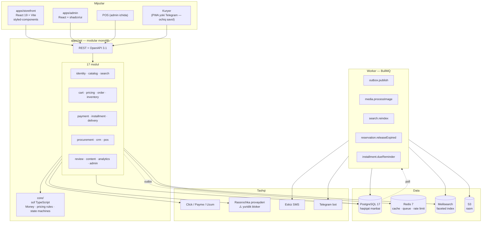
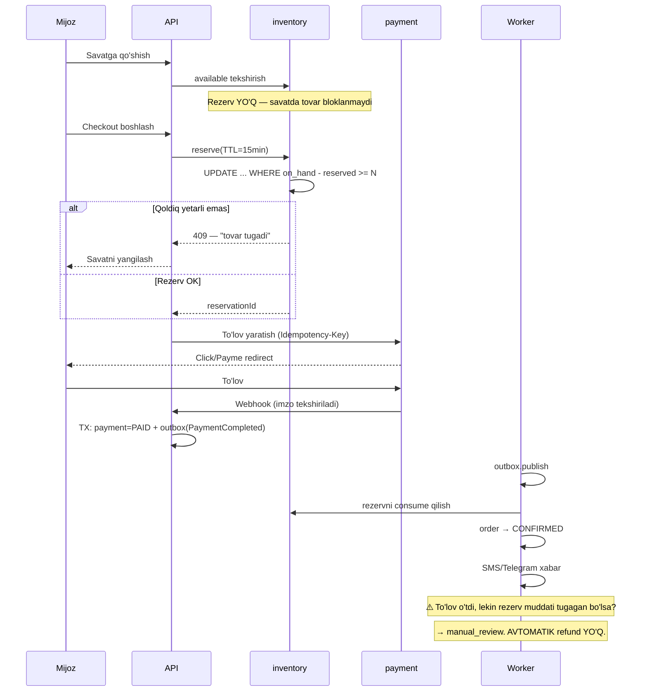

# 02 — Tizim arxitekturasi

> **Hujjat maqomi:** Tasdiqlangan · **Oxirgi yangilanish:** 2026-07-15
> Qarorlar asoslari: [docs/adr/](./adr/)

---

## 1. Tamoyillar

1. **Domen mantiqi infratuzilmadan mustaqil.** Pul hisobi Prisma haqida bilmasligi kerak. Narx dvigateli HTTP haqida bilmasligi kerak.
2. **Modul chegarasi CI bilan majburlanadi**, niyat bilan emas.
3. **Hech qachon mijozga ishonma.** Narx, chegirma, qoldiq — hammasi serverda hisoblanadi.
4. **Pul va qoldiq — invariantlar.** `SUM(debit) == SUM(credit)`, `on_hand >= 0`. Bu talab, tavsiya emas.
5. **Over-engineering dushman.** Bu **bitta do'kon**. Kubernetes, mikroservis, event sourcing — kerak emas.

Beshinchi tamoyil ataylab yozilgan. Farzin'da masshtab muammosi bo'lishi mumkin; bu yerda — yo'q. Har qanday murakkablik o'zini oqlashi kerak.

---

## 2. Umumiy ko'rinish



---

## 3. Monorepo

```
kelvin/
├── apps/
│   ├── storefront/    React 19 + Vite + styled-components  (MAVJUD)
│   ├── admin/         React + shadcn/ui + Tailwind         (YANGI)
│   └── api/           NestJS 11 + Prisma                    (YANGI)
├── packages/
│   ├── contracts/     OpenAPI'dan generatsiya qilingan tiplar
│   └── config/        umumiy eslint / ts / prettier
└── docs/              TZ
```

**Nega monorepo:** API va frontend bir vaqtda o'zgaradi. Alohida repo bo'lsa — versiya moslashuvi muammosi va ikki PR bitta o'zgarish uchun. Turborepo faqat o'zgargan paketni build qiladi.

**Nega ikki xil UI stack** (storefront: styled-components, admin: shadcn/ui): [ADR-0005](./adr/0005-two-ui-stacks.md). Qisqacha — storefront dizayni Figma'dan va allaqachon styled-components'da yozilgan; uni o'zgartirish 8 700 qatorni qayta yozish demak va hech qanday foyda bermaydi. Admin'da esa dizayn yo'q va tezlik muhim.

---

## 4. Qatlamlar

```
┌──────────────────────────────────────────┐
│  Interface: Controller · Job consumer    │  ← HTTP/Queue biladi
├──────────────────────────────────────────┤
│  Application: Service · Use case · DTO   │  ← orkestratsiya, tranzaksiya
├──────────────────────────────────────────┤
│  Domain: Entity · Value object · Rules   │  ← sof mantiq
└──────────────────────────────────────────┘
                 ↑ port (interface)
┌──────────────────────────────────────────┐
│  Infrastructure: Prisma repo · Redis ·   │  ← port implementatsiyasi
│  Click adapter · Meilisearch client      │
└──────────────────────────────────────────┘
```

`core/` — `Money`, narx qoidalari, holat mashinalari — **NestJS'ni ham, Prisma'ni ham import qilmaydi**. Sof TypeScript.

Nega: bu kod eng qimmatli. `Money.allocate()` ni test qilish uchun DB ko'tarish bema'nilik. Va `Money` xato bo'lsa — pul yo'qoladi.

Bu `pnpm --filter @kelvin/api arch:check` bilan CI'da tekshiriladi. Buzilsa — PR merge bo'lmaydi.

---

## 5. Modul xaritasi

| #   | Modul         | Mas'uliyat                        | Nozik joyi                                     |
| --- | ------------- | --------------------------------- | ---------------------------------------------- |
| 1   | `identity`    | auth, RBAC, sessiya               | Refresh rotation, IDOR                         |
| 2   | `catalog`     | mahsulot, variant, atribut, media | Variant matritsasi portlashi                   |
| 3   | `search`      | faceted qidiruv                   | PostgreSQL ↔ Meilisearch sinxronligi           |
| 4   | `cart`        | savat, mehmon savati              | Login'da birlashtirish konflikti               |
| 5   | `pricing`     | narx, chegirma, aksiya            | **Determinizm** — bir xil savat → bir xil narx |
| 6   | `order`       | checkout, holat mashinasi, saga   | **Saga kompensatsiyasi**                       |
| 7   | `inventory`   | qoldiq, rezerv                    | **← ENG NOZIK: oversell**                      |
| 8   | `payment`     | Click/Payme, ledger, refund       | Idempotentlik, webhook                         |
| 9   | `installment` | rassrochka                        | **← yuridik bloker**, pul matematikasi         |
| 10  | `delivery`    | zona, slot, kuryer, o'rnatish     | Slot race condition                            |
| 11  | `procurement` | ta'minotchi, xarid, kirim         | Tannarx (FIFO?)                                |
| 12  | `crm`         | mijoz, lid, voronka, RFM          | Shaxsiy ma'lumot                               |
| 13  | `pos`         | offline kassa, smena              | Onlayn bilan bir xil ledger                    |
| 14  | `review`      | sharh, savol-javob                | Moderatsiya                                    |
| 15  | `content`     | blog, sahifa, banner              | SEO                                            |
| 16  | `analytics`   | hisobot, ABC                      | Og'ir so'rov                                   |
| 17  | `admin`       | audit log, feature flag           | Immutable audit                                |

---

## 6. Modullar orasidagi aloqa

### 6.1. Sinxron — port orqali

```ts
// modules/inventory/inventory.port.ts
export interface InventoryPort {
  getAvailable(variantId: string): Promise<number>;
  reserve(input: ReserveInput): Promise<ReservationResult>;
  release(reservationId: string): Promise<void>;
}

export const INVENTORY_PORT = Symbol('INVENTORY_PORT');
```

`order` moduli `InventoryPort` ni inject qiladi, `InventoryService` ni emas.

### 6.2. Asinxron — transactional outbox

⚠️ **In-process `EventEmitter2` DB tranzaksiyasi bilan atomik EMAS.**

```ts
// ❌ Buzuq — dual write problem
await prisma.$transaction(async (tx) => {
  await tx.payment.update({ data: { status: 'PAID' } });
});
eventEmitter.emit('PaymentCompleted'); // ← process yiqilsa?
// To'lov PAID, lekin buyurtma tasdiqlanmadi. Mijoz to'ladi, tovar yo'q.
```

```ts
// ✅ Atomik
await prisma.$transaction(async (tx) => {
  await tx.payment.update({ data: { status: 'PAID' } });
  await tx.outboxEvent.create({
    data: { eventType: 'PaymentCompleted', aggregateId: paymentId, payload: {...} },
  });
});
```

Batafsil: [ADR-0004](./adr/0004-transactional-outbox.md).

**Qaysi event outbox talab qiladi:**

| Event                | Outbox? | Sabab                                   |
| -------------------- | ------- | --------------------------------------- |
| `PaymentCompleted`   | **Ha**  | Pul                                     |
| `OrderPlaced`        | **Ha**  | Rezervni consume qiladi                 |
| `RefundIssued`       | **Ha**  | Pul                                     |
| `StockAdjusted`      | **Ha**  | Qoldiq — real tovar                     |
| `InstallmentOverdue` | **Ha**  | Mijoz huquqi                            |
| `ProductUpdated`     | Yo'q    | Search reindex — yo'qolsa keyingi safar |
| `ReviewPosted`       | Yo'q    | Moderatsiya baribir qo'lda              |

**Mezon:** event yo'qolsa **pul, real tovar yoki mijoz huquqi** zarar ko'radimi?

Kafolat: **at-least-once** → **har handler idempotent bo'lishi SHART**.

---

## 7. Buyurtma oqimi — uchdan-uchgacha

Bu Kelvin'ning asosiy oqimi va eng nozik joyi:



Oxirgi izoh muhim: "to'lov o'tdi, tovar yo'q" holatida tizim **avtomatik pul qaytarmaydi** — odam ko'rib chiqadi. Sabab: [07-order-and-checkout.md §3](./07-order-and-checkout.md).

---

## 8. Ma'lumot qatlami

### 8.1. PostgreSQL — yagona haqiqat manbai

Pul, qoldiq, buyurtma — hammasi shu yerda. Tranzaksiya majburiy.

### 8.2. Redis — faqat efemer

| Ishlatiladi               | Ishlatilmaydi                          |
| ------------------------- | -------------------------------------- |
| Cache (katalog, narx)     | **Qoldiq** — bu haqiqat, PostgreSQL'da |
| BullMQ navbat             | Pul                                    |
| Rate limit hisoblagichi   | Buyurtma                               |
| Sessiya                   | Audit log                              |
| Mehmon savati (qisqa TTL) |                                        |

⚠️ **Qoldiq Redis'da SAQLANMAYDI.** Bu Farzin'dan farq: u yerda o'yin taymeri Redis'da edi, chunki u efemer. Bu yerda qoldiq — real tovar. Redis yo'qolsa qoldiq yo'qolmasligi kerak.

### 8.3. Meilisearch — index, manba emas

PostgreSQL — haqiqat. Meilisearch — qidiruv indeksi. Sinxronizatsiya: outbox → BullMQ job.

Nomuvofiqlik xavfi bor: index eskirgan bo'lishi mumkin. Yumshatish: qidiruv natijasidagi narx/qoldiq **PostgreSQL'dan qayta o'qiladi** — Meilisearch faqat ID ro'yxatini beradi.

Bu muhim: mijoz "bor" deb ko'rsatilgan tovarni bosganda "yo'q" chiqishi mumkin, lekin **oversell bo'lmaydi** — chunki rezerv PostgreSQL'da atomik.

Batafsil: [ADR-0006](./adr/0006-meilisearch-for-faceted-search.md).

---

## 9. Xatoliklar

Domen xatosi va texnik xato aralashmaydi. RFC 9457 (Problem Details):

```json
{
  "type": "https://kelvin.uz/errors/insufficient-stock",
  "title": "Tovar yetarli emas",
  "status": 409,
  "code": "INSUFFICIENT_STOCK",
  "detail": "So'ralgan: 3, mavjud: 1",
  "traceId": "0af7651916cd43dd8448eb211c80319c"
}
```

500 xatosida **hech qachon** ichki detal chiqmaydi.

---

## 10. Masshtablash — halol baho

⚠️ **Bu bitta do'kon.** Quyidagi jadval "kerak bo'lsa yo'l bor" degani, "shu yo'ldan yuramiz" degani emas.

| Bosqich | Signal                         | Chora                                      |
| ------- | ------------------------------ | ------------------------------------------ |
| 1       | —                              | Bitta VPS + Docker Compose. **Bu yetarli** |
| 2       | CPU > 70%                      | API instance qo'shish                      |
| 3       | Rasm bandwidth                 | CDN                                        |
| 4       | Qidiruv sekin                  | Meilisearch resurslarini oshirish          |
| 5       | Hisobot bazani sekinlashtiradi | Read replica                               |

**2-bosqichdan narisiga yetish ehtimoli past.** Kubernetes bu loyihaga **kerak emas** — [12-infrastructure.md §5](./12-infrastructure.md).

---

## 11. Ochiq savollar

1. **SEO: Vite SPA yetarlimi yoki Next.js kerakmi?** — eng qimmat savol. → [13-frontend-spec.md](./13-frontend-spec.md)
2. **1C integratsiyasi kerakmi?** — katta arxitektura ta'siri. → [10-crm-pos-analytics.md](./10-crm-pos-analytics.md)
3. **POS offline ishlashi kerakmi?** — local-first, sync, konflikt. → [10-crm-pos-analytics.md](./10-crm-pos-analytics.md)
4. **Kuryer uchun mobil ilova kerakmi?** — yoki Telegram bot yetarlimi. → [09-delivery-and-operations.md](./09-delivery-and-operations.md)
5. **Meilisearch haqiqatan kerakmi?** — SKU soni noma'lum. 1000 SKU bo'lsa PostgreSQL yetarli. → [ADR-0006](./adr/0006-meilisearch-for-faceted-search.md)
