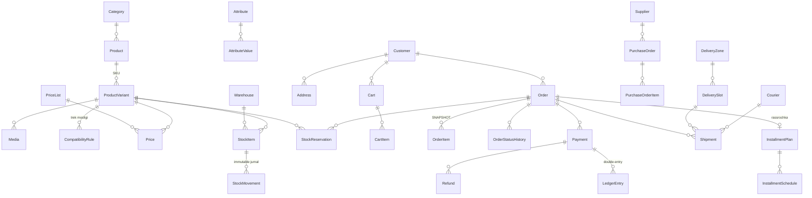

# 03 — Ma'lumotlar modeli

> **Hujjat maqomi:** Tasdiqlangan · **Oxirgi yangilanish:** 2026-07-15
> **Manba fayl:** [`apps/api/prisma/schema.prisma`](../apps/api/prisma/schema.prisma) — bu hujjat uni tushuntiradi, almashtirmaydi.
> Ziddiyat bo'lsa **schema.prisma g'olib**.

---

## 1. Konvensiyalar

| Qoida | Sabab |
|---|---|
| Prisma model: `PascalCase` birlik → DB: `snake_case` ko'plik | TypeScript va PostgreSQL konvensiyalari |
| PK: **UUID v7** | Vaqt bo'yicha tartiblanadi → index fragmentatsiyasi yo'q. Auto-increment ma'lumot sizdiradi (raqib nechta buyurtmangiz borligini biladi) va enumeration hujumiga ochiq |
| **Pul: `BigInt`, tiyinda** | [ADR-0003](./adr/0003-money-as-bigint-tiyin.md). Float — jinoyat |
| Vaqt: `@db.Timestamptz(3)` | Har doim TZ bilan. DB'da UTC, ko'rsatishda `Asia/Tashkent` |
| Ko'p tilli matn: `Json` | `{ "uz-Latn": "Qandil", "uz-Cyrl": "Қандил", "ru": "Люстра" }` |
| Soft delete: `deleted_at` | Faqat muhim entity'larda. `stock_movements` da bema'nilik |

⚠️ `@default(uuid(7))` **Prisma ≥ 5.14** talab qiladi.

---

## 2. Umumiy ER ko'rinishi



---

## 3. Kritik dizayn qarorlari

Bu bo'lim eng muhim. Har biri kelajakdagi xatoni oldini oladi.

### 3.1. `Product` vs `ProductVariant` — nega ikki daraja

`Product` — model ("Qandil Aurora"). `ProductVariant` — **sotiladigan birlik** (SKU).

Sabab: bitta qandil 4 rangda (xrom/oltin/qora/nikel), 3 o'lchamda, 2 lampa sonida keladi. Bular:
- Bir xil tavsif, bir xil brend, bir xil kategoriya
- **Turli narx, turli qoldiq, turli shtrix-kod**

Bitta darajada modellansa: 24 ta alohida mahsulot, har birida bir xil tavsif takrorlanadi. Kontent menejer tavsifni o'zgartirsa — 24 joyda o'zgartiradi.

⚠️ **Variant matritsasi portlashi:** 4 × 3 × 2 = 24 SKU. Faqat **mavjud** kombinatsiyalar saqlanadi, dekart ko'paytmasi emas. Batafsil: [05-catalog-and-search.md](./05-catalog-and-search.md).

### 3.2. Atribut: gibrid — ustun + JSONB

```prisma
// Tez-tez filtrlanadigan → ustun (tez so'rov, index)
colorTemperature Int?
ipRating         String?
socketType       String?

// Qolganlari → JSONB (moslashuvchan)
attributes Json @default("{}")
@@index([attributes], type: Gin)
```

**Nega sof EAV yomon:** har atribut alohida qatorda → 15 atribut bo'yicha filtr = 15 ta JOIN. Sekin.

**Nega sof JSONB yomon:** GIN index diapazon so'roviga (`luminous_flux BETWEEN 800 AND 1200`) yaxshi ishlamaydi.

**Gibrid:** eng ko'p ishlatiladigan 12 atribut ustun sifatida, qolganlari JSONB'da.

Narxi: yangi "asosiy" atribut qo'shish migration talab qiladi. Bu qabul qilinadi — yoritgich atributlari standart va kam o'zgaradi.

### 3.3. `AttributeValue.rank` — IP darajasi ierarxik

```prisma
rank Int?   // IP20=1, IP44=3, IP54=4, IP65=5, IP67=6
```

Bu nozik. Mijoz "vannaxona uchun" filtrlab IP44 tanlasa, **IP65 ham ko'rsatilishi kerak** — u IP44 talabini ham qoplaydi.

`WHERE ip_rating = 'IP44'` → **noto'g'ri**.
`WHERE rank >= 3` → to'g'ri.

Oddiy `ENUM` bilan bu ifodalanmaydi. Shuning uchun `AttributeType.ORDINAL` bor.

### 3.4. `OrderItem` — SNAPSHOT, havola emas

```prisma
model OrderItem {
  variantId String            // havola — statistika uchun
  // ══ SNAPSHOT ══
  sku          String
  productName  Json
  variantAxis  Json
  unitAmount   BigInt
  costAmount   BigInt?
}
```

**Muammo:** buyurtma 2026-yil yanvarda 500 000 so'mga berilgan. Iyunda narx 700 000 bo'ldi. Mijoz "buyurtmalarim" ga kirsa — 700 000 ko'radi.

Yoki mahsulot o'chirilsa — buyurtma **buziladi**.

**Yechim:** narx, nom, atribut — hammasi buyurtma paytida **nusxalanadi**. `Product`/`Price` dan hech qachon o'qilmaydi.

`costAmount` ham snapshot — foyda hisobi uchun. Tannarx ertaga o'zgarsa, eski buyurtmaning foydasi o'zgarmasligi kerak.

Bu ko'p loyihada qilinadigan xato. [07-order-and-checkout.md §5](./07-order-and-checkout.md).

### 3.5. `StockItem` — atomik, `StockMovement` — immutable

```prisma
model StockItem {
  onHand   Int   // jismonan omborda
  reserved Int   // band qilingan
  version  Int   // optimistic lock zaxirasi
}
```

`available = onHand - reserved` — **hisoblanadi, saqlanmaydi**.

⚠️ `onHand` va `reserved` **faqat atomik shartli UPDATE bilan** o'zgaradi:

```sql
UPDATE stock_items
SET    reserved = reserved + $1
WHERE  id = $2 AND (on_hand - reserved) >= $1
RETURNING *;
```

Qator qaytmasa → qoldiq yetarli emas. Bu **oversell'ning oldini oladi hech qanday qulfsiz**.

Bu Kelvin'ning eng muhim texnik qarori: [ADR-0007](./adr/0007-atomic-conditional-reservation.md).

`StockMovement` — har o'zgarish uchun immutable yozuv. Invariant:

```
SUM(stock_movements.quantity) == stock_items.on_hand
```

Bu property test bilan tekshiriladi. Nega kerak: "qoldiq nega 3 ta kam?" savoliga javob. Va **ichki o'g'irlik** — kimdir qoldiqni "tuzatgan" bo'lsa, iz qoladi.

### 3.6. `LedgerEntry` — double-entry, `balance` ustuni emas

**Oddiy yondashuv:** `balance` ustuni, to'lov kelganda `balance += amount`.

**Nega buzuq:** balans qayerdan kelgani ma'lum emas; xato bo'lsa tuzatib bo'lmaydi; buxgalteriya bilan solishtirib bo'lmaydi; concurrent update → lost update.

**Double-entry:** har tranzaksiya ≥ 2 yozuv, `SUM(debit) == SUM(credit)`.

Klient 540 000 so'mlik qandil uchun Click orqali to'ladi:

| transactionId | account | direction | amount (tiyin) |
|---|---|---|---|
| `019a…` | `cash.click` | DEBIT | 54 000 000 |
| `019a…` | `revenue.product` | CREDIT | 54 000 000 |

Ledger **append-only**. Xato bo'lsa teskari yozuv, o'chirish emas. Bu buxgalteriyaning 500 yillik qoidasi.

⚠️ **Onlayn va offline (POS) sotuv bir xil ledger'ga tushadi.** Alohida tizim emas.

### 3.7. `InstallmentSchedule` — tiyin yo'qolmasligi

```
5 000 000 so'm / 3 oy = 1 666 666.666…
```

Har oyga `1 666 666.67` yozsak → jami `5 000 000.01` → mijoz 1 tiyin ortiqcha to'laydi.

`Money.allocate()`: `[166 666 667, 166 666 667, 166 666 666]` tiyin → jami **aniq** 500 000 000.

Invariant: `SUM(schedule.amount) == plan.totalPayableAmount`. Property test: 500 tasodifiy summa × muddat.

⚠️ **Yuridik bloker:** do'konning **o'z** rassrochkasi kredit berish hisoblanadimi? Yurist tasdig'isiz bu modul prod'ga chiqmaydi.

### 3.8. `IdempotencyRecord`, `SagaState` — infra jadvallari

Bular domen entity'lari emas, lekin ularsiz tizim ishonchsiz.

`IdempotencyRecord` — `Idempotency-Key` bo'yicha birinchi javob saqlanadi. Mijoz "To'lash" ni ikki marta bossa — ikkinchi so'rov birinchi javobni oladi, operatsiya qayta bajarilmaydi.

`SagaState` — buyurtma oqimi to'lov ↔ rezerv ↔ yetkazib berishga tegadi. Distributed tranzaksiya yo'q → orchestration saga + kompensatsiya.

⚠️ **"To'lov o'tdi, lekin tovar qolmadi" → `MANUAL_REVIEW`.** Avtomatik refund **yo'q**. Sabab: [07-order-and-checkout.md §3](./07-order-and-checkout.md).

### 3.9. `Address.floor` va `hasElevator` — yoritgichga xos

Qandil og'ir va mo'rt. Kuryer 9-qavatga liftisiz ko'tarishi kerakmi — bu **yetkazib berish narxiga va vaqtiga** ta'sir qiladi.

Kichik detal, lekin real operatsiyada muhim.

---

## 4. Index strategiyasi

Har index yozuvni sekinlashtiradi. Shuning uchun har biri asoslangan.

| Index | Nega |
|---|---|
| `product_variants(attributes)` GIN | JSONB atribut filtri |
| `product_variants(color_temperature)` | Eng ko'p ishlatiladigan filtr |
| `product_variants(ip_rating)`, `(socket_type)` | Keyingi eng ko'p |
| `stock_items(variant_id, warehouse_id)` unique | Rezerv so'rovi — har checkout'da |
| `stock_reservations(status, expires_at)` | TTL job — har daqiqada |
| `outbox_events(status, available_at)` | Worker poll — har 500ms |
| `orders(status, created_at)` | Admin buyurtma jadvali |
| `ledger_entries(transaction_id)` | Balans tekshiruvi |
| `audit_logs(resource_type, resource_id)` | "Bu mahsulotda nima o'zgardi?" |

---

## 5. Partitioning nomzodlari

Vaqt bo'yicha bo'linishi kerak — **hozir emas, o'lchov bilan**:

| Jadval | O'sish sababi | Kalit |
|---|---|---|
| `stock_movements` | Har sotuv, har kirim | `created_at` (choraklik) |
| `audit_logs` | Har harakat | `created_at` (oylik) |
| `notifications` | Har SMS | `created_at` (oylik) |
| `outbox_events` | Har kritik event | Tozalanadi — partitioning kerak emas |

⚠️ Bu **bitta do'kon**. Bu jadvallar 50M qatorga yetishi ehtimoli past. Oldindan partitioning qilish — over-engineering.

---

## 6. Migration siyosati

- `prisma migrate dev` — faqat lokal
- `prisma db push` — **hech qachon, hech qayerda**
- ⚠️ `sequelize.sync({ alter: true })` / `synchronize: true` — loyiha egasining oldingi loyihalarida (`chess`, `donate_service`, `dorixona`) shu bor edi. Bu prod'da **ma'lumot yo'qotadi**. Kelvin'da bunday narsa yo'q
- Prod: `prisma migrate deploy`, CI'dan
- **Zero-downtime:** expand-contract. Ustun o'chirish uchun uch deploy

---

## 7. Ma'lumot saqlash muddati

⚠️ **Yurist bilan tasdiqlanishi kerak.** Quyidagilar taklif, tavsiya emas.

| Ma'lumot | Taklif | Sabab |
|---|---|---|
| `Order`, `OrderItem` | Soliq qonuni bo'yicha | **Yurist aniqlaydi** |
| `LedgerEntry` | Soliq qonuni bo'yicha | **Yurist aniqlaydi** |
| `StockMovement` | 3+ yil | Inventarizatsiya nizolari |
| `AuditLog` | 3+ yil | Ichki o'g'irlik tergovi |
| `Customer` (shaxsiy) | Mijoz so'rasa — o'chirish | **Yurist aniqlaydi** |
| `Cart` (tashlab ketilgan) | 30 kun | Analitika |
| `RefreshToken` (expired) | 30 kun | Xavfsizlik |

---

## 8. Seed

Dev uchun ([`apps/api/prisma/seed.ts`](../apps/api/prisma/seed.ts)) — **idempotent** (`upsert`):

1. Kategoriyalar — Figma footer'idagi 11 ta
2. Atributlar — rang harorati, IP, tsokol va h.k. + qiymatlari
3. `Warehouse` — asosiy ombor + do'kon zali
4. Har rol uchun test hisobi ⚠️ **faqat dev'da**
5. ~50 test mahsuloti, variantlar bilan
6. `DeliveryZone` — Toshkent tumanlari

⚠️ **Prod seed HECH QANDAY hisob yaratmaydi.** `dorixona` da `admin`/`admin123` seeder har ishga tushganda ishlar va parolni konsolga chop etardi. Bu takrorlanmaydi.

---

## 9. Ochiq savollar

1. **Tannarx: FIFO yoki o'rtacha tortilgan?** — foyda hisobiga ta'sir qiladi. FIFO partiya kuzatuvini talab qiladi (`StockMovement` da hozir yo'q). **Buxgalter javobi kerak**
2. **Partiya (lot/batch) kuzatuvi kerakmi?** — yoritgichda otzыv kam, lekin ta'minotchi da'vosi uchun foydali
3. **PostGIS kerakmi?** — yetkazib berish zonasi hozir tuman ro'yxati. "Poligon" kerak bo'lsa PostGIS
4. **1C integratsiyasi** — agar 1C **haqiqat manbai** bo'lsa, bu model tubdan o'zgaradi. **Eng katta ochiq savol**
5. **Ko'p ombor haqiqatan kerakmi?** — bitta do'konda bitta ombor bo'lishi mumkin. Model qo'llab-quvvatlaydi, lekin murakkablik qo'shadi
