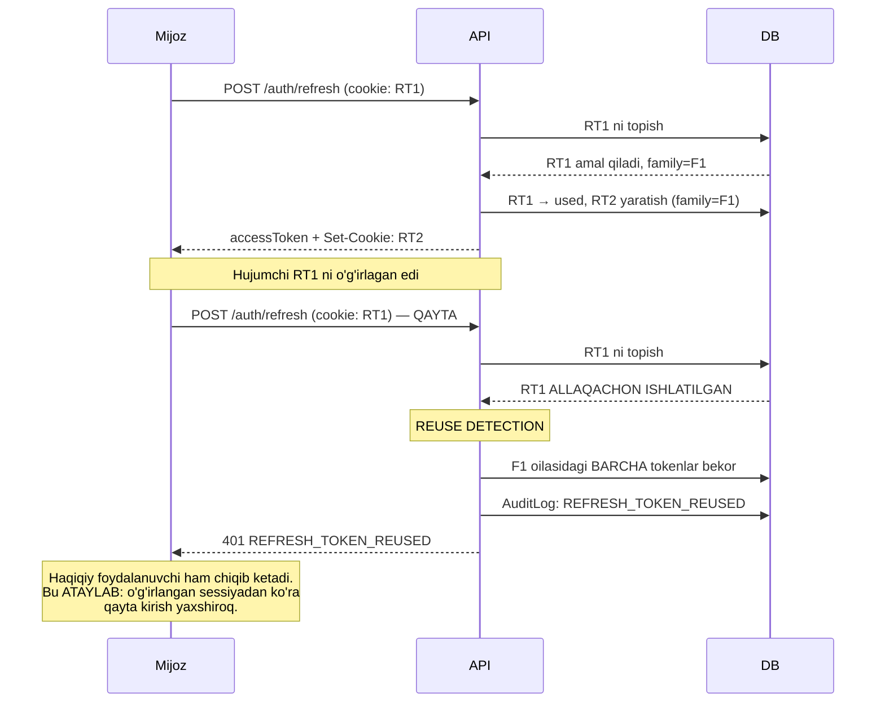
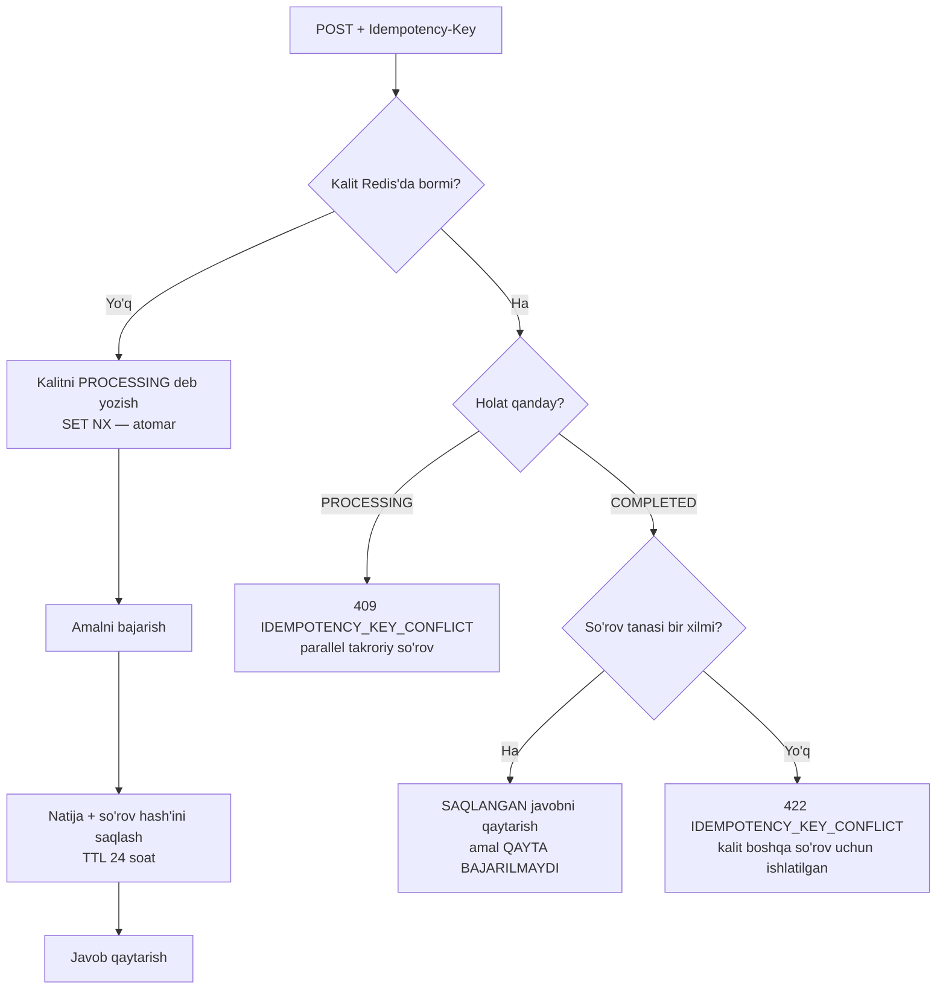
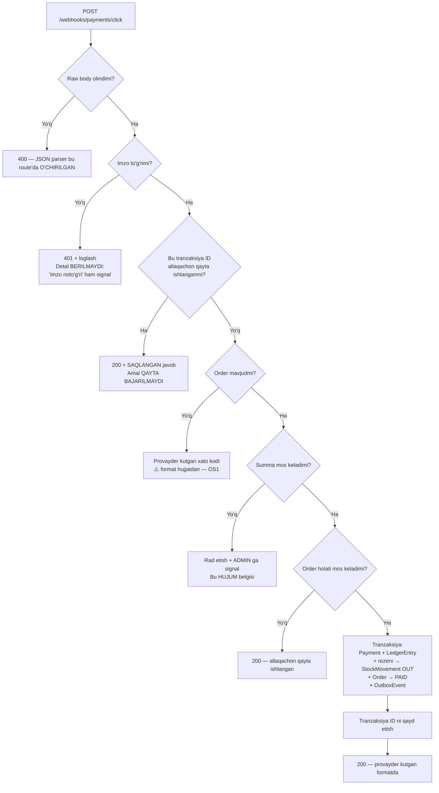
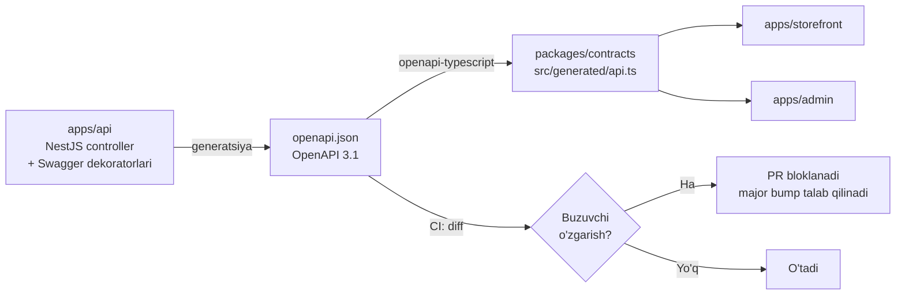

# Kelvin — API spetsifikatsiyasi

> **Loyiha:** Kelvin — yoritish texnikasi do'koni. **Bozor:** O'zbekiston.
> **Model:** bitta do'kon (single-tenant). **Kanon:** `KELVIN_CANON.md`.

**Bog'liq hujjatlar:**

- [`docs/01-product-spec.md`](./01-product-spec.md) — personalar, user story, RBAC matritsasi
- [`docs/02-architecture.md`](./02-architecture.md) — modul chegaralari, saga, outbox
- [`docs/05-catalog-and-search.md`](./05-catalog-and-search.md) — facet modeli, search engine
- [`docs/11-security.md`](./11-security.md) — token rotatsiya, reuse detection, RBAC guard

---

## 0. Qamrov

Bu hujjat **API shartnomasi qanday tuzilishini** belgilaydi: konvensiyalar, xatolar,
auth, pagination, idempotentlik. Bu **to'liq endpoint katalogi emas** — to'liq ro'yxat
OpenAPI 3.1 spetsifikatsiyasida (`apps/api` dan generatsiya qilinadi, §13).

Bu yerda faqat **asosiy va nozik** endpoint'lar keltiriladi — ya'ni yoki eng ko'p
ishlatiladiganlar, yoki noto'g'ri loyihalansa qimmatga tushadiganlar.

**Mijozlar (API iste'molchilari):**

| Mijoz                | Nima                                           | Auth                               |
| -------------------- | ---------------------------------------------- | ---------------------------------- |
| `apps/storefront`    | Mavjud React 19 + Vite (kanon §3)              | Cookie refresh + xotiradagi access |
| `apps/admin`         | Yangi React + shadcn/ui                        | Bir xil                            |
| Kuryer PWA           | Storefront ichida alohida route (§01-spec OS8) | Bir xil                            |
| Click / Payme / Uzum | **Webhook yuboradi**                           | Imzo (§11)                         |
| 1C                   | ⚠️ Kerakmi — noma'lum (§15-OS13)               | —                                  |

---

## 1. Nega REST + OpenAPI, GraphQL emas

### 1.1 Taqqoslash

| Mezon                                      | REST + OpenAPI 3.1                                         | GraphQL                                                     |
| ------------------------------------------ | ---------------------------------------------------------- | ----------------------------------------------------------- |
| **Mijozlar soni va turi**                  | 2–3 ta, **hammasi bizniki**                                | Ko'p, oldindan noma'lum mijozlar uchun kuchli               |
| **Over-fetching**                          | Muammo bo'lishi mumkin                                     | Hal qiladi                                                  |
| **Kelvin'da over-fetching real muammomi?** | Mijoz bizniki → endpoint'ni aynan ehtiyojga moslash mumkin | Muammo bo'lmasa — yechim keraksiz                           |
| **HTTP keshi**                             | Tabiiy (`GET` + `ETag` + CDN)                              | Og'riqli (hamma narsa `POST /graphql`)                      |
| **Kelvin uchun kesh muhimmi?**             | **Ha** — katalog og'ir o'qish yuki                         | —                                                           |
| **NestJS bilan integratsiya**              | Birinchi darajali, Swagger dekoratorlari                   | Bor, lekin ko'proq sozlash                                  |
| **Webhook (Click/Payme)**                  | Tabiiy: oddiy HTTP POST endpoint                           | GraphQL bunga mos emas — baribir REST kerak                 |
| **Rate limiting**                          | Endpoint bo'yicha aniq (§8)                                | Query murakkabligi bo'yicha — o'zi alohida muammo           |
| **N+1 riski**                              | Server nazorat qiladi                                      | DataLoader kerak, aks holda resolver'lar DB ni yiqitadi     |
| **Idempotentlik**                          | HTTP semantikasi bilan tabiiy (§7)                         | Mutation'da qo'lda                                          |
| **Fayl yuklash (media)**                   | `multipart/form-data` — standart                           | Spetsifikatsiyadan tashqari, kutubxonaga bog'liq            |
| **Tip generatsiyasi**                      | `openapi-typescript` (§13)                                 | `graphql-codegen` — ham yaxshi                              |
| **Jamoa**                                  | Bitta dasturchi                                            | Ikkalasi ham o'rganiladi, lekin GraphQL'da xato qilish oson |
| **Kuzatuv (tracing)**                      | Endpoint = span, tabiiy                                    | Bitta endpoint, ichida hamma narsa                          |

### 1.2 Qaror

**REST + OpenAPI 3.1.**

Sabab — GraphQL yomon bo'lgani uchun emas, balki **u hal qiladigan muammolar Kelvin'da
yo'q**:

1. **Mijozlar bizniki va oz.** GraphQL ning asosiy qiymati — noma'lum mijozlarga
   moslashuvchanlik. Bizda 2–3 mijoz bor va ikkalasini ham biz yozamiz. Storefront
   `GET /products/:id` dan ortiqcha maydon olsa — endpoint'ni tuzatamiz.
2. **Katalog — og'ir o'qish yuki, kesh kerak.** REST'da `GET` + `ETag` + CDN darhol
   ishlaydi. GraphQL'da bu alohida infratuzilma muammosi.
3. **Webhook baribir REST bo'ladi.** Click va Payme GraphQL bilmaydi. Ya'ni GraphQL
   tanlansa ham — ikki xil API stack.
4. **Rate limiting endpoint bo'yicha aniq bo'lishi kerak** (§8): login 5/min,
   qidiruv 60/min. GraphQL'da bu query murakkabligini hisoblashga aylanadi —
   yechilgan, lekin ortiqcha ish.
5. **Facet count — GraphQL uchun tabiiy emas.** Bizga natijalar + har filtr qiymati
   uchun son kerak (§01-spec US-SRC-01). Bu **bitta maxsus javob shakli**, moslashuvchan
   graf so'rovi emas.

**Nima yo'qotamiz (halol):** dizayner (P2) mahsulot ro'yxatida CRI ni ko'rmoqchi bo'lsa,
biz endpoint javobini kengaytirishimiz kerak. GraphQL'da bu mijoz tomonida hal bo'lardi.
Bu narx **qabul qilinadi**, chunki bunday o'zgarish kamdan-kam bo'ladi va bizda backend
ham, frontend ham bitta repoda (kanon §6).

⚠️ **Qachon qayta ko'rib chiqiladi:** agar tashqi mijozlar paydo bo'lsa (masalan, sherik
integratsiyalari). Hozir bunday reja **yo'q** (§01-spec §8.2).

---

## 2. Konvensiyalar

### 2.1 Versiyalash

```
https://api.kelvin.uz/api/v1/products
```

- Versiya **URL yo'lida**: `/api/v1/`. Header'da emas — URL da versiya ko'rinadi,
  loglarda o'qiladi, brauzerda sinaladi, keshlanadi.
- **Buzuvchi (breaking) o'zgarish** → `/api/v2/`. `v1` ma'lum muddat parallel ishlaydi.
  ⚠️ Muddat — mijozlar bizniki bo'lgani uchun qisqa bo'lishi mumkin, aniq qiymat keyin.
- **Buzmaydigan o'zgarish** (yangi ixtiyoriy maydon, yangi endpoint) → versiya
  o'zgarmaydi.
- **Buzuvchi nima:** maydonni o'chirish/qayta nomlash, tipni o'zgartirish, enum'dan
  qiymat olib tashlash, majburiy parametr qo'shish, xato `code` ini o'zgartirish.

### 2.2 Resurs nomlari

| Qoida                            | To'g'ri               | Noto'g'ri                               |
| -------------------------------- | --------------------- | --------------------------------------- |
| Ko'plik                          | `/products`           | `/product`                              |
| kebab-case                       | `/purchase-orders`    | `/purchaseOrders`, `/purchase_orders`   |
| Ot, fe'l emas                    | `POST /orders`        | `POST /createOrder`                     |
| Ichma-ich — 2 darajadan oshmaydi | `/orders/:id/items`   | `/customers/:id/orders/:oid/items/:iid` |
| Identifikator — UUID v7          | `/products/018f3a...` | `/products/42`                          |

**Fe'l qachon ruxsat etiladi:** resurs modeli tabiiy ifodalay olmaydigan **holat o'tishi**
uchun sub-resurs sifatida:

```
POST /orders/:id/cancel
POST /orders/:id/transitions
POST /auth/refresh
POST /carts/:id/merge
POST /pos/shifts/:id/close
```

Bu **RESTdan chekinish**, va u ataylab. `PATCH /orders/:id { status: 'CANCELLED' }`
noto'g'ri bo'lardi: bekor qilish — bu maydonni yozish emas, balki **biznes tranzaksiya**
(rezerv bo'shatish + refund + xabar + audit). Endpoint buni ochiq ko'rsatishi kerak.

### 2.3 HTTP metodlari

| Metod    | Ma'no                       | Idempotent                             | Kelvin'da                                               |
| -------- | --------------------------- | -------------------------------------- | ------------------------------------------------------- |
| `GET`    | O'qish                      | Ha                                     | Hamma joyda. **Hech qachon holat o'zgartirmaydi** (§14) |
| `POST`   | Yaratish yoki holat o'tishi | Yo'q → `Idempotency-Key` bilan ha (§7) | Asosiy yozish metodi                                    |
| `PATCH`  | Qisman yangilash            | Yo'q                                   | Yagona yangilash metodi                                 |
| `DELETE` | O'chirish                   | Ha                                     | Ko'pincha **soft delete** (`deleted_at`, kanon §8)      |
| `PUT`    | To'liq almashtirish         | Ha                                     | **Ishlatilmaydi** (§14)                                 |

### 2.4 Javob formati — konvert YO'Q

**To'g'ri:**

```json
{
  "id": "018f3a2c-7b1e-7000-8000-000000000001",
  "sku": "KLV-CHN-001-GOLD-M",
  "name": "Zamonaviy qandil",
  "priceMinor": "1250000",
  "currency": "UZS"
}
```

**Noto'g'ri:**

```json
{
  "success": true,
  "data": { "id": "..." },
  "error": null
}
```

**Nega konvert yo'q:**

1. **HTTP allaqachon konvert.** `success` — bu status kodi. `error` — bu 4xx/5xx.
   Ikkinchi marta yozish — takror va ziddiyat manbai (`200 { success: false }` ni
   qanday tushunish kerak?).
2. **Har mijoz `.data` yozadi.** Foydasiz shovqin.
3. **OpenAPI sxemasi soddalashadi**, generatsiya qilingan tiplar toza bo'ladi (§13).

**Yagona istisno — kolleksiyalar** (`items` + `pageInfo` kerak, §6):

```json
{
  "items": [{ "id": "...", "sku": "..." }],
  "pageInfo": {
    "nextCursor": "eyJpZCI6IjAxOGYzYTJjIn0",
    "hasNextPage": true
  }
}
```

Bu konvert emas — `pageInfo` **resursning bir qismi** (kolleksiya sahifasi).

### 2.5 Ma'lumot tiplari

| Tur          | Format                  | Misol                        | Nega                                                                                             |
| ------------ | ----------------------- | ---------------------------- | ------------------------------------------------------------------------------------------------ |
| ID           | UUID v7 string          | `"018f3a2c-7b1e-7000-..."`   | Kanon §8. Vaqt bo'yicha tartiblangan → cursor (§6)                                               |
| **Pul**      | **`string`**, tiyinda   | `"1250000"` = 12 500 so'm    | **JSON `number` — 2^53 chegarasi va float xatosi. Kanon §8: `BigInt`, tiyin, float HECH QACHON** |
| Valyuta      | ISO 4217                | `"UZS"`                      | Kanon §8: alohida ustun                                                                          |
| Vaqt         | ISO 8601 UTC            | `"2026-07-15T09:30:00.000Z"` | Kanon §8: `Timestamptz(3)`, UTC                                                                  |
| Enum         | `SCREAMING_SNAKE_CASE`  | `"PENDING_PAYMENT"`          | Tarjima qilinmaydi (§12)                                                                         |
| Maydon nomi  | `camelCase`             | `luminousFlux`               | JS mijozlari uchun tabiiy                                                                        |
| Bo'sh qiymat | `null` yoki maydon yo'q |                              | `exactOptionalPropertyTypes` (kanon §6)                                                          |

**Pul — eng ko'p xato qilinadigan joy:**

```ts
// packages/contracts/src/money.ts

/** Pul — MINOR birlikda (tiyin). Wire'da string, chunki JSON number 2^53 dan keyin buziladi. */
export interface Money {
  /** Tiyinda. Misol: "1250000" = 12 500.00 UZS */
  readonly amountMinor: string;
  readonly currency: 'UZS';
}

export function toMoney(amountMinor: bigint, currency: 'UZS' = 'UZS'): Money {
  return { amountMinor: amountMinor.toString(), currency };
}

export function fromMoney(money: Money): bigint {
  return BigInt(money.amountMinor);
}

/**
 * DIQQAT: bu funksiya QASDDAN yo'q:
 *   export function moneyToNumber(m: Money): number
 * Chunki u float'ga aylantiradi va tiyin yo'qoladi. Formatlash — faqat UI da,
 * Intl.NumberFormat orqali, hisobsiz.
 */
```

---

## 3. Xatolik formati — RFC 9457 (Problem Details)

### 3.1 Nega RFC 9457

Standart. O'zimizniki o'ylab topish — bu yana bir hujjatlanmagan konvensiya.
`Content-Type: application/problem+json`.

### 3.2 Struktura

```ts
// packages/contracts/src/problem.ts

export interface ProblemDetails {
  /** Xato turi hujjatiga havola. */
  readonly type: string;
  /** Qisqa, inson uchun sarlavha. Tarjima qilinadi (§12). */
  readonly title: string;
  /** HTTP status kodi (dublikat — loglarda qulay). */
  readonly status: number;
  /** Bu holat uchun tushuntirish. Tarjima qilinadi (§12). */
  readonly detail: string;
  /** Xato sodir bo'lgan resurs. */
  readonly instance?: string;

  // --- Kelvin kengaytmalari ---

  /**
   * MASHINA UCHUN. Barqaror. HECH QACHON tarjima qilinmaydi.
   * Mijoz mantiqi FAQAT shunga tayanadi, `title`/`detail` ga emas.
   * O'zgarishi = buzuvchi o'zgarish (§2.1).
   */
  readonly code: ErrorCode;
  /** HAR DOIM bor — 500 da ham. Foydalanuvchi shu bilan murojaat qiladi. */
  readonly traceId: string;
  /** Faqat validatsiya xatolarida (422). */
  readonly errors?: readonly FieldError[];
}

export interface FieldError {
  /** JSON Pointer (RFC 6901): "/items/0/quantity" */
  readonly pointer: string;
  readonly code: string;
  readonly message: string;
}
```

### 3.3 Misollar

**422 — validatsiya, maydon darajasida:**

```json
{
  "type": "https://api.kelvin.uz/problems/validation-failed",
  "title": "Ma'lumot noto'g'ri",
  "status": 422,
  "detail": "So'rovda 2 ta maydon xato to'ldirilgan.",
  "instance": "/api/v1/orders",
  "code": "VALIDATION_FAILED",
  "traceId": "0af7651916cd43dd8448eb211c80319c",
  "errors": [
    {
      "pointer": "/items/0/quantity",
      "code": "MIN_VALUE",
      "message": "Miqdor 1 dan kam bo'lmasligi kerak."
    },
    {
      "pointer": "/deliveryAddress/phone",
      "code": "INVALID_PHONE",
      "message": "Telefon raqami +998XXXXXXXXX formatida bo'lishi kerak."
    }
  ]
}
```

**409 — oversell (kanon §9.2):**

```json
{
  "type": "https://api.kelvin.uz/problems/insufficient-stock",
  "title": "Tovar yetarli emas",
  "status": 409,
  "detail": "So'ralgan miqdor mavjud emas. Ba'zi pozitsiyalar hozirgina sotildi.",
  "instance": "/api/v1/checkout/reserve",
  "code": "INSUFFICIENT_STOCK",
  "traceId": "4bf92f3577b34da6a3ce929d0e0e4736",
  "errors": [
    {
      "pointer": "/items/2/quantity",
      "code": "INSUFFICIENT_STOCK",
      "message": "Mavjud: 1, so'ralgan: 3."
    }
  ]
}
```

> `errors` bu yerda validatsiya emas, lekin **maydon darajasidagi sabab** — mijoz aynan
> qaysi pozitsiyani belgilashi mumkin. Bu ataylab.

**500 — ichki detal HECH QACHON chiqmaydi:**

```json
{
  "type": "https://api.kelvin.uz/problems/internal-error",
  "title": "Ichki xatolik",
  "status": 500,
  "detail": "So'rovni bajarib bo'lmadi. Iltimos, keyinroq urinib ko'ring.",
  "code": "INTERNAL_ERROR",
  "traceId": "8a3c60f7d188f8fa79d48a391a778fa6"
}
```

**Qat'iy qoidalar 500 uchun:**

- Stack trace, SQL, Prisma xato matni, jadval/ustun nomi, fayl yo'li, ichki xost —
  **hech qachon** javobda bo'lmaydi. Bular hujum uchun razvedka.
- `traceId` **har doim** bor. Foydalanuvchi shuni aytadi → biz logdan topamiz.
- To'liq detal Pino logida `traceId` bilan (kanon §6).
- `detail` — **doimiy matn**, ichki holatdan generatsiya qilinmaydi.

```ts
// apps/api/src/common/filters/problem.filter.ts (skelet)
import type { ExceptionFilter, ArgumentsHost } from '@nestjs/common';
import { Catch, HttpException, HttpStatus } from '@nestjs/common';
import type { Response } from 'express';
import type { ProblemDetails } from '@kelvin/contracts';

@Catch()
export class ProblemDetailsFilter implements ExceptionFilter {
  catch(exception: unknown, host: ArgumentsHost): void {
    const ctx = host.switchToHttp();
    const res = ctx.getResponse<Response>();
    const traceId = ctx.getRequest<{ traceId: string }>().traceId;

    if (exception instanceof HttpException) {
      const problem = toProblem(exception, traceId);
      res.status(problem.status).type('application/problem+json').json(problem);
      return;
    }

    // Kutilmagan xato: logga TO'LIQ, javobga HECH NARSA.
    // TODO: Pino logger inject qilinadi
    const problem: ProblemDetails = {
      type: 'https://api.kelvin.uz/problems/internal-error',
      title: 'Ichki xatolik',
      status: HttpStatus.INTERNAL_SERVER_ERROR,
      detail: 'So‘rovni bajarib bo‘lmadi. Iltimos, keyinroq urinib ko‘ring.',
      code: 'INTERNAL_ERROR',
      traceId,
    };
    res.status(500).type('application/problem+json').json(problem);
  }
}

declare function toProblem(e: HttpException, traceId: string): ProblemDetails;
```

### 3.4 `code` — barqaror ro'yxat

```ts
export const ERROR_CODES = [
  // 400
  'MALFORMED_REQUEST',
  'INVALID_CURSOR',
  'INVALID_FILTER',
  'UNSUPPORTED_SORT_FIELD',
  // 401
  'UNAUTHENTICATED',
  'TOKEN_EXPIRED',
  'TOKEN_INVALID',
  'REFRESH_TOKEN_REUSED',
  // 403
  'PERMISSION_DENIED',
  // 404
  'RESOURCE_NOT_FOUND',
  // 409
  'INSUFFICIENT_STOCK',
  'RESERVATION_EXPIRED',
  'INVALID_STATE_TRANSITION',
  'IDEMPOTENCY_KEY_CONFLICT',
  'CONCURRENT_MODIFICATION',
  'SHIFT_ALREADY_OPEN',
  // 422
  'VALIDATION_FAILED',
  'INCOMPLETE_PRODUCT',
  'INCOMPATIBLE_COMPONENTS',
  'PRICE_CHANGED',
  // 429
  'RATE_LIMIT_EXCEEDED',
  // 500 / 502 / 503
  'INTERNAL_ERROR',
  'PAYMENT_PROVIDER_ERROR',
  'SERVICE_UNAVAILABLE',
] as const;

export type ErrorCode = (typeof ERROR_CODES)[number];
```

---

## 4. Status kodlari

| Kod   | Qachon                                       | Kelvin misoli                       |
| ----- | -------------------------------------------- | ----------------------------------- |
| `200` | Muvaffaqiyatli o'qish/yangilash              | `GET /products`                     |
| `201` | Yaratildi + `Location`                       | `POST /orders`                      |
| `202` | Qabul qilindi, asinxron                      | `POST /reports` (BullMQ)            |
| `204` | Muvaffaqiyat, tana yo'q                      | `DELETE /carts/:id/items/:itemId`   |
| `304` | O'zgarmagan (`ETag`)                         | `GET /products/:id`                 |
| `400` | **So'rov shakli buzuq**                      | JSON parse xatosi, noto'g'ri cursor |
| `401` | Kim ekanliging noma'lum                      | Token yo'q / muddati tugagan        |
| `403` | Kim ekanliging ma'lum, **lekin ruxsat yo'q** | `SALES` refund qilmoqchi            |
| `404` | Resurs yo'q **yoki senga ko'rinmaydi**       | Boshqaning buyurtmasi               |
| `409` | Holat ziddiyati                              | Oversell, noto'g'ri o'tish          |
| `410` | Resurs bor edi, endi yo'q                    | Muddati o'tgan to'lov sessiyasi     |
| `413` | Juda katta                                   | 10 MB dan katta rasm                |
| `415` | Qo'llab-quvvatlanmaydigan tur                | `Content-Type: text/xml`            |
| `422` | **Shakl to'g'ri, mazmun noto'g'ri**          | `quantity: -1`                      |
| `429` | Rate limit (§8)                              | Login brute-force                   |
| `500` | Ichki xato                                   | Kutilmagan istisno                  |
| `502` | Tashqi tizim xatosi                          | Click javob bermadi                 |
| `503` | Vaqtincha ishlamayapti                       | Texnik ish                          |

### 4.1 `400` vs `422` — farq

Bu chalkashlik keng tarqalgan. Chegaraga aniq:

|                    | `400 Bad Request`                       | `422 Unprocessable Content`                |
| ------------------ | --------------------------------------- | ------------------------------------------ |
| Ma'no              | **Server so'rovni o'qiy olmadi**        | **O'qidi, tushundi, lekin bajara olmaydi** |
| Bosqich            | Parsing / deserializatsiya              | Validatsiya / biznes qoidasi               |
| Misol              | `{"items": [` — buzuq JSON              | `{"items": []}` — bo'sh savat              |
| Misol              | `?limit=abc` — son kutilgan             | `?limit=5000` — maksimum 100               |
| Misol              | `Content-Type` noto'g'ri                | `quantity: -1`                             |
| Misol              | Cursor dekodlanmadi                     | `phone: "12345"` — format noto'g'ri        |
| `errors` bo'ladimi | **Yo'q** — maydonga bo'lish mumkin emas | **Ha** — har maydon uchun                  |

**Sodda mezon:** so'rov obyektga aylandimi? Yo'q → `400`. Ha, lekin qiymat noto'g'ri
→ `422`.

**Nega muhim:** `400` — bu **mijozning bug'i** (kod xato yozilgan, retry foydasiz).
`422` — bu **foydalanuvchining xatosi** (formani tuzatsa, ishlaydi). Mijoz bularga
butunlay boshqacha munosabatda bo'ladi.

### 4.2 `403` vs `404` — ma'lumot sizdirmaslik

Bu **xavfsizlik qarori**, uslub emas.

**Qoida:**

| Vaziyat                                          | Kod       | Nega                                                                        |
| ------------------------------------------------ | --------- | --------------------------------------------------------------------------- |
| `SALES` `POST /payments/:id/refund` chaqirdi     | **`403`** | Amal taqiqlangan. Resurs mavjudligi allaqachon ma'lum — u o'z ish doirasida |
| `CUSTOMER` **boshqaning** buyurtmasini so'radi   | **`404`** | `403` desak — "bunday buyurtma **bor**" deb aytgan bo'lamiz                 |
| `COURIER` unga tayinlanmagan yetkazishni so'radi | **`404`** | Bir xil mantiq                                                              |
| Autentifikatsiya yo'q, `/admin/*`                | **`401`** | Avval kim ekanligi aniqlansin                                               |
| Buyurtma haqiqatan mavjud emas                   | **`404`** | —                                                                           |

**Nega `403` ma'lumot sizdiradi:**

Buyurtma ID lari UUID v7 bo'lsa ham, hujumchi ID lar to'plamiga ega bo'lishi mumkin
(masalan, eski sizib chiqishdan). `403` va `404` ni farqlash unga **oracle** beradi:
`403` = "bu ID mavjud", `404` = "yo'q". Shunday qilib u bizning buyurtmalar bazamiz
hajmini va tuzilishini o'rganadi.

`404` qaytarish bu oracle'ni yo'q qiladi: hujumchi mavjud va mavjud emas resursni
farqlay olmaydi.

**Chegara:** agar foydalanuvchi resursning mavjudligini **allaqachon bilsa**, `403`
to'g'ri. Sotuvchi refund qilmoqchi bo'lsa — u to'lovni ko'rgan, mavjudligi sir emas.
Bu yerda `404` faqat chalkashtiradi ("chek yo'qoldimi?").

```ts
// §01-spec §4.5 dagi AccessDecision shu yerda ishlatiladi.
import { canReadOrder, type Actor } from '../authz/order-access';
import { ForbiddenException, NotFoundException } from '@nestjs/common';

export async function loadOrderForActor(
  actor: Actor,
  orderId: string,
  repo: { findById(id: string): Promise<OrderRecord | null> },
): Promise<OrderRecord> {
  const order = await repo.findById(orderId);

  // Resurs yo'q → 404. Bor, lekin ko'rinmaydi → HAM 404 (farqi bilinmasin).
  if (order === null) {
    throw new NotFoundException({ code: 'RESOURCE_NOT_FOUND' });
  }

  const decision = canReadOrder(actor, order);
  if (!decision.allowed) {
    throw decision.notFound
      ? new NotFoundException({ code: 'RESOURCE_NOT_FOUND' })
      : new ForbiddenException({ code: 'PERMISSION_DENIED' });
  }

  return order;
}

interface OrderRecord {
  readonly id: string;
  readonly customerId: string;
  readonly assignedCourierId?: string | undefined;
  readonly assignedInstallerId?: string | undefined;
}
```

⚠️ **Vaqt bo'yicha sizib chiqish:** mavjud resurs uchun `404` (DB so'rovi + guard)
mavjud emas resursdan sekinroq qaytishi mumkin. Bu nozik oracle. Kelvin uchun bu
qabul qilingan risk — hujumchi uchun signal juda shovqinli. [`11-security.md`](./11-security.md)

---

## 5. Autentifikatsiya

To'liq model → [`docs/11-security.md`](./11-security.md). Bu yerda **API shartnomasi**.

### 5.1 Ikki token

|                   | Access token                                    | Refresh token                              |
| ----------------- | ----------------------------------------------- | ------------------------------------------ |
| Format            | **JWT** (imzolangan)                            | **Opaque** (tasodifiy string, DB da hash)  |
| Umr               | **~15 daqiqa**                                  | **~30 kun**                                |
| Qayerda qaytadi   | **Javob tanasida**                              | **`Set-Cookie`**                           |
| Mijozda saqlanadi | **FAQAT XOTIRADA** (JS o'zgaruvchisi / Zustand) | httpOnly cookie — **JS ko'ra olmaydi**     |
| Yuboriladi        | `Authorization: Bearer <token>`                 | Avtomatik, faqat `/api/v1/auth/refresh` ga |
| Bekor qilinadimi  | Yo'q (qisqa umr — narxi shu)                    | **Ha**, DB da                              |

### 5.2 Nega access token localStorage'da EMAS

`localStorage` — **har qanday JS uchun ochiq**. Bitta XSS (uchinchi tomon skripti,
kutubxonadagi zaiflik, `dangerouslySetInnerHTML`) → token o'g'irlanadi va hujumchi
15 daqiqa emas, **muddat tugaguncha** foydalanadi.

Xotirada saqlash XSS ni **to'xtatmaydi** (XSS bo'lsa hujumchi baribir so'rov yubora
oladi), lekin **tokenni eksfiltratsiya qilishni** to'xtatadi — u sahifadan tashqariga
chiqmaydi. Bu farq real: eksfiltratsiya qilingan token hujumchi serverida uzoq
ishlatiladi.

**Narxi (halol):** sahifa yangilanganda access token yo'qoladi → ilova yuklanganda
`POST /auth/refresh` chaqiriladi. Bu qo'shimcha so'rov va qisqa "yuklanmoqda" holati.
Bu **qabul qilinadi**.

**Refresh nega cookie'da:** httpOnly → JS uni o'qiy olmaydi → XSS uni o'g'irlay olmaydi.
CSRF riski `SameSite=Strict` + refresh endpoint'ning boshqa hech narsa qilmasligi bilan
yopiladi.

```
Set-Cookie: kelvin_rt=<opaque>; HttpOnly; Secure; SameSite=Strict;
            Path=/api/v1/auth; Max-Age=2592000
```

`Path=/api/v1/auth` — cookie **faqat** auth endpoint'lariga yuboriladi. Katalog
so'rovlarida u umuman tarmoqqa chiqmaydi.

### 5.3 Endpoint'lar

| Metod  | Yo'l                       | Izoh                                              |
| ------ | -------------------------- | ------------------------------------------------- |
| `POST` | `/api/v1/auth/otp/request` | Telefon → SMS kod (Eskiz). Rate limit qattiq (§8) |
| `POST` | `/api/v1/auth/otp/verify`  | Kod → access (body) + refresh (cookie)            |
| `POST` | `/api/v1/auth/refresh`     | **Rotation** — eski bekor, yangi juftlik          |
| `POST` | `/api/v1/auth/logout`      | Refresh bekor qilinadi + cookie tozalanadi        |
| `POST` | `/api/v1/auth/logout-all`  | Foydalanuvchining **barcha** sessiyalari          |
| `GET`  | `/api/v1/auth/me`          | Joriy foydalanuvchi + roli + ruxsatlari           |

**`POST /auth/otp/verify` javobi:**

```json
{
  "accessToken": "eyJhbGciOiJIUzI1NiIs...",
  "expiresIn": 900,
  "user": {
    "id": "018f3a2c-7b1e-7000-8000-000000000001",
    "role": "CUSTOMER",
    "permissions": ["product:read", "cart:manage_own", "order:read_own"]
  }
}
```

> `permissions` — **UI qulayligi uchun** (tugmani yashirish). Server **hech qachon**
> bunga ishonmaydi — ruxsat har so'rovda qayta tekshiriladi (§01-spec §4.5).
> Refresh token javobda **yo'q** — u faqat cookie'da.

### 5.4 Rotation va reuse detection



Batafsil → [`docs/11-security.md`](./11-security.md).

---

## 6. Pagination — cursor-based

### 6.1 Nega offset EMAS

**Ikki sabab, ikkalasi ham amaliy:**

**1. `OFFSET` sekin — va u sekinlashib boradi.**

```sql
SELECT * FROM products ORDER BY created_at DESC LIMIT 20 OFFSET 10000;
```

PostgreSQL 10 020 qatorni o'qiydi, 10 000 tasini tashlab yuboradi. 1-sahifa tez,
500-sahifa sekin. Bu **arxitektura muammosi**, indeks bilan hal bo'lmaydi.

```sql
-- Cursor: har doim bir xil tezlik
SELECT * FROM products WHERE id < $1 ORDER BY id DESC LIMIT 20;
```

Indeks bo'ylab **to'g'ridan-to'g'ri** — 1-sahifa ham, 500-sahifa ham bir xil.

**2. Sahifa suriladi — foydalanuvchi tovarni ko'rmaydi yoki ikki marta ko'radi.**

Bu abstrakt emas. Kelvin'da real:

- Foydalanuvchi 1-sahifani ko'rdi (mahsulot 1–20).
- Kontent menejer yangi mahsulot nashr qildi → u ro'yxat boshiga tushdi.
- Foydalanuvchi 2-sahifaga o'tdi (`OFFSET 20`) → **eski 20-mahsulot yana ko'rinadi**,
  chunki hamma narsa bir pozitsiya pastga surildi.
- O'chirilsa — teskarisi: **mahsulot butunlay o'tkazib yuboriladi**.

Cursor'da bunday bo'lmaydi — cursor **pozitsiyani emas, qiymatni** ko'rsatadi.

### 6.2 Nega UUID v7 buni tabiiy qiladi

Kanon §8: PK — **UUID v7**. UUID v7 ichida **millisekundli timestamp** bor va u
**leksikografik tartibda o'sadi**.

Ya'ni:

- `ORDER BY id` == `ORDER BY created_at` (amalda)
- `id` — noyob → **tie-break kerak emas**
- Cursor = oxirgi `id` — qo'shimcha maydon shart emas
- Birlamchi indeks allaqachon bor

UUID v4 bilan bu ishlamas edi (tasodifiy → tartib yo'q) va `(created_at, id)`
kompozit cursor kerak bo'lardi. **UUID v7 tanlovi to'g'ridan-to'g'ri pagination'ni
soddalashtirdi.**

### 6.3 Shartnoma

```
GET /api/v1/products?limit=20&cursor=eyJpZCI6IjAxOGYzYTJjIn0
```

| Parametr | Tur              | Default | Maks                              |
| -------- | ---------------- | ------- | --------------------------------- |
| `limit`  | int              | 20      | **100** (oshsa `422`)             |
| `cursor` | opaque base64url | —       | Dekodlanmasa `400 INVALID_CURSOR` |

```json
{
  "items": [{ "id": "018f3a2c-...", "sku": "KLV-CHN-001" }],
  "pageInfo": {
    "nextCursor": "eyJpZCI6IjAxOGYzYTJjLTdiMWUifQ",
    "hasNextPage": true
  }
}
```

**Cursor — opaque.** Mijoz uni **parse qilmasligi kerak**. Bugun bu `{"id":"..."}`,
ertaga tuzilishi o'zgarishi mumkin.

**`totalCount` YO'Q.** Sabab: `COUNT(*)` katta jadvalda `OFFSET` kabi qimmat, va u
har so'rovda hisoblanadi. **Istisno:** qidiruv natijalari — u yerda son foydalanuvchiga
kerak va Meilisearch/GIN uni arzon beradi ([`05-catalog-and-search.md`](./05-catalog-and-search.md)).

```ts
// packages/contracts/src/pagination.ts

export interface CursorPage<T> {
  readonly items: readonly T[];
  readonly pageInfo: {
    readonly nextCursor: string | null;
    readonly hasNextPage: boolean;
  };
}

export interface CursorQuery {
  readonly limit?: number | undefined;
  readonly cursor?: string | undefined;
}

/** Cursor ichi — mijozga OSHKOR EMAS. O'zgarishi buzuvchi emas. */
interface CursorPayload {
  readonly id: string;
}

export function encodeCursor(id: string): string {
  const payload: CursorPayload = { id };
  return Buffer.from(JSON.stringify(payload)).toString('base64url');
}

export function decodeCursor(cursor: string): CursorPayload {
  try {
    const raw = Buffer.from(cursor, 'base64url').toString('utf8');
    const parsed: unknown = JSON.parse(raw);
    if (
      typeof parsed === 'object' &&
      parsed !== null &&
      'id' in parsed &&
      typeof (parsed as { id: unknown }).id === 'string'
    ) {
      return { id: (parsed as { id: string }).id };
    }
    throw new Error('shape');
  } catch {
    // 400, 422 emas: cursor — bizning formatimiz, uni faqat bizning
    // mijozimiz yuboradi. Buzuq bo'lsa — bu parse muammosi (§4.1).
    throw new InvalidCursorError();
  }
}

export class InvalidCursorError extends Error {
  readonly code = 'INVALID_CURSOR' as const;
}
```

### 6.4 Istisno: admin jadvallari

`apps/admin` da offset **ruxsat etiladi**:

```
GET /api/v1/admin/orders?page=5&perPage=50&sort=-createdAt
```

**Nega istisno:**

1. Admin real **"5-sahifaga o'tish"** va **"jami: 1 248"** ni xohlaydi. Cursor bunga
   mos emas.
2. Admin foydalanuvchilari — o'nlab, storefront'da minglab bo'lishi mumkin.
   `OFFSET` narxi bu yerda ahamiyatsiz.
3. Admin jadvallari **filtrlangan** (holat, sana) → asosiy to'plam kichik.

**Cheklovlar:**

- `perPage` maks **100**
- `page` maks **500** (undan narisi → filtrni toraytirish taklif qilinadi)
- `totalCount` beriladi, lekin **keshlangan** (⚠️ TTL o'lchov bilan)
- Faqat `/api/v1/admin/*` ostida. Ommaviy endpoint'larda **hech qachon**.

---

## 7. Idempotentlik

### 7.1 Muammo

Mijoz `POST /orders` yubordi. Tarmoq uzildi. Javob kelmadi. **Buyurtma yaratildimi?**

Mijoz bilmaydi. Ikki variant, ikkalasi ham yomon:

- Takrorlamasa → mijoz buyurtmasiz qoladi
- Takrorlasa → **ikkita buyurtma**, ikki marta to'lov

O'zbekistonda mobil internet barqaror emas — bu chekka holat emas, **kunlik holat**.

### 7.2 Yechim

```
POST /api/v1/orders
Idempotency-Key: 018f3a2c-7b1e-7000-8000-a1b2c3d4e5f6
Content-Type: application/json
```

Kalit — mijoz generatsiya qiladigan UUID. **Bir mantiqiy amal = bir kalit**,
retry'larda **o'zgarmaydi**.

**Server mantiqi:**



**Nozik joy — so'rov tanasi hash'i.** Kalit bir xil, lekin tana boshqa bo'lsa — bu
retry emas, bu **mijozning bug'i**. Saqlangan javobni qaytarish xato ma'lumot berardi.
Shuning uchun ziddiyat aniq bildiriladi.

### 7.3 Qayerda MAJBURIY

| Endpoint                            | Nega                                                          | Kalitsiz  |
| ----------------------------------- | ------------------------------------------------------------- | --------- |
| `POST /orders`                      | Ikkilangan buyurtma → ikki marta yetkazish, ikki marta to'lov | **`400`** |
| `POST /payments`                    | **Ikki marta pul yechish**                                    | **`400`** |
| `POST /checkout/reserve`            | Ikkilangan rezerv → soxta oversell                            | **`400`** |
| `POST /stock/movements`             | Qoldiq ikki marta o'zgaradi → hisob buziladi                  | **`400`** |
| `POST /payments/:id/refund`         | **Ikki marta qaytarish**                                      | **`400`** |
| `POST /pos/transactions`            | Ikkilangan chek                                               | **`400`** |
| `POST /purchase-orders/:id/receive` | Kirim ikki marta                                              | **`400`** |

**Kalitsiz `400`, `422` emas** — chunki bu header yo'qligi, ya'ni so'rov shakli
noto'g'ri (§4.1). Bu **mijozning bug'i**, foydalanuvchining xatosi emas.

**Webhook'lar** (§11) — alohida mexanizm: provayder `Idempotency-Key` yubormaydi,
uning o'z tranzaksiya ID si idempotentlik kaliti bo'ladi.

```ts
// apps/api/src/common/idempotency/idempotency.types.ts

export interface IdempotencyRecord {
  readonly key: string;
  readonly status: 'PROCESSING' | 'COMPLETED';
  /** So'rov tanasining SHA-256 — kalit qayta ishlatilganini aniqlash uchun. */
  readonly requestHash: string;
  readonly responseStatus?: number | undefined;
  readonly responseBody?: string | undefined;
  readonly createdAt: Date;
}

export interface IdempotencyStore {
  /** Atomar: faqat kalit yo'q bo'lsa yozadi (Redis SET NX). */
  tryAcquire(key: string, requestHash: string, ttlSeconds: number): Promise<boolean>;
  get(key: string): Promise<IdempotencyRecord | null>;
  complete(key: string, status: number, body: string): Promise<void>;
  /** Amal yiqilsa kalit bo'shatiladi — mijoz qayta urina olsin. */
  release(key: string): Promise<void>;
}

/** TTL 24 soat: retry oynasidan uzun, lekin Redis'ni to'ldirmaydigan. */
export const IDEMPOTENCY_TTL_SECONDS = 24 * 60 * 60;
```

⚠️ **Ochiq savol:** amal bajarilib, lekin javob saqlanishidan oldin server yiqilsa —
kalit `PROCESSING` da qoladi va retry `409` oladi. Yechim: `PROCESSING` uchun qisqaroq
TTL + outbox orqali tiklash. Aniq strategiya → [`02-architecture.md`](./02-architecture.md) (§15-OS4).

---

## 8. Rate limiting

### 8.1 Nega endpoint bo'yicha

Global limit ("100 req/min") ma'nosiz: qidiruv 60 marta chaqirilishi normal,
login 60 marta chaqirilishi — **hujum**.

### 8.2 Jadval

| Endpoint                       | Limit   | Oyna   | Kalit        | Nega                                                                 |
| ------------------------------ | ------- | ------ | ------------ | -------------------------------------------------------------------- |
| `POST /auth/otp/request`       | **3**   | 1 daq  | telefon      | **Har SMS pul turadi** (Eskiz). Bu to'g'ridan-to'g'ri xarajat hujumi |
| `POST /auth/otp/request`       | **10**  | 1 soat | telefon      | Kunlik suiiste'mol                                                   |
| `POST /auth/otp/request`       | **20**  | 1 soat | IP           | Ko'p raqamga hujum                                                   |
| `POST /auth/otp/verify`        | **5**   | 15 daq | telefon      | Brute-force. 6 xonali kod = 10^6 — cheklovsiz topiladi               |
| `POST /auth/refresh`           | **20**  | 1 daq  | IP           | Normal ishda 15 daq'da 1 marta                                       |
| `GET /search`, `GET /products` | **60**  | 1 daq  | IP / user    | Filtr o'zgartirish tez-tez — bu normal                               |
| `GET /search/suggest`          | **120** | 1 daq  | IP           | Har harfda chaqiriladi                                               |
| `POST /checkout/reserve`       | **10**  | 1 daq  | user         | Rezerv qimmat: lock oladi                                            |
| `POST /orders`                 | **5**   | 1 daq  | user         | Odam daqiqada 5 buyurtma qilmaydi                                    |
| `POST /payments`               | **5**   | 1 daq  | user         | —                                                                    |
| `POST /reviews`                | **5**   | 1 soat | user         | Spam                                                                 |
| `POST /questions`              | **10**  | 1 soat | user         | Spam                                                                 |
| `POST /webhooks/*`             | **300** | 1 daq  | provayder IP | **Yuqori** — provayder retry qiladi, bloklash **pul yo'qotish**      |
| `/api/v1/admin/*`              | **300** | 1 daq  | user         | Admin ko'p so'rov yuboradi                                           |
| Boshqalari (default)           | **100** | 1 daq  | IP / user    | —                                                                    |

**⚠️ Bu qiymatlar — boshlang'ich taxmin, o'lchangan emas.** Real trafik ko'rilgach
sozlanadi. Ular ikki prinsipdan kelib chiqqan: (a) **pul turadigan** amal qattiq
cheklanadi (SMS), (b) **provayder webhook'i hech qachon bloklanmaydi**.

### 8.3 Header'lar (RFC 9331 uslubida)

Har javobda (limitga yetmagan bo'lsa ham):

```
RateLimit-Limit: 60
RateLimit-Remaining: 57
RateLimit-Reset: 43
```

`429` da qo'shimcha:

```
Retry-After: 43
```

```json
{
  "type": "https://api.kelvin.uz/problems/rate-limit-exceeded",
  "title": "So'rovlar juda ko'p",
  "status": 429,
  "detail": "43 soniyadan keyin qayta urinib ko'ring.",
  "code": "RATE_LIMIT_EXCEEDED",
  "traceId": "b7ad6b7169203331"
}
```

`Retry-After` — **majburiy**. Usiz mijoz darhol qayta uradi va limitni yanada
chuqurlashtiradi.

### 8.4 Autentifikatsiyalangan vs anonim

Autentifikatsiyalangan foydalanuvchi uchun kalit — `userId`, anonim uchun — IP.
Sabab: **NAT**. O'zbekistonda bir IP ortida yuzlab foydalanuvchi bo'lishi mumkin
(mobil operator, ofis). Faqat IP bo'yicha cheklash — halol foydalanuvchilarni bloklash.

**Zaxira storage — Redis** (kanon §6). In-memory ishlamaydi: bir necha instance
bo'lsa har biri o'z hisobini yuritadi va limit N marta ko'payadi.

---

## 9. Filtrlash va saralash

### 9.1 Format

Operator **kvadrat qavsda**, maydon nomidan keyin:

```
GET /api/v1/products
  ?colorTemperature[in]=2700,3000
  &cri[gte]=90
  &ipRating[in]=IP44,IP54,IP65
  &priceMinor[lte]=5000000
  &dimmable[eq]=true
  &beamAngle[lte]=36
  &sort=-createdAt,priceMinor
  &limit=20
```

| Operator       | Ma'no                | Misol                            |
| -------------- | -------------------- | -------------------------------- |
| `[eq]`         | Teng (default)       | `dimmable[eq]=true`              |
| `[ne]`         | Teng emas            | `socketType[ne]=E14`             |
| `[gt]` `[gte]` | Katta / katta-teng   | `cri[gte]=90`                    |
| `[lt]` `[lte]` | Kichik / kichik-teng | `priceMinor[lte]=5000000`        |
| `[in]`         | Ro'yxatda (vergul)   | `colorTemperature[in]=2700,3000` |
| `[nin]`        | Ro'yxatda emas       | `brand[nin]=X,Y`                 |
| `[contains]`   | Matn ichida          | `name[contains]=qandil`          |

**Saralash:** `sort=-createdAt,priceMinor` — `-` = kamayish, bir necha maydon vergul bilan.

**Nega bu format, `filter[cri][gte]=90` emas:** o'qilishi oson, URL qisqa, `qs`
kutubxonasi kerak emas, log'da tushunarli. Bu — moslashuvchanlik va soddalik o'rtasidagi
kelishuv.

### 9.2 Oq ro'yxat — MAJBURIY

Har resurs uchun **filtrlash va saralash mumkin bo'lgan maydonlar aniq e'lon qilinadi**.
Ro'yxatda yo'q maydon → `400 INVALID_FILTER` / `400 UNSUPPORTED_SORT_FIELD`.

**Ikki sabab, ikkalasi ham jiddiy:**

**1. SQL injection.** Maydon nomi query'ga to'g'ridan-to'g'ri tushadi. Prisma parametrlarni
himoyalaydi, lekin **ustun nomi parametr emas**. `?sort=id; DROP TABLE--` yoki
`orderBy` ga dinamik obyekt qurish — bu real yo'l. Oq ro'yxat buni **butunlay**
yopadi: qiymat ro'yxatda bo'lmasa, u query'ga yetib bormaydi.

**2. Performance.** Indekssiz ustun bo'yicha filtr → **full table scan**.
`?description[contains]=chiroq` 100 000 mahsulot bo'yicha DB ni yiqitadi.
Oq ro'yxat = **"biz bu maydonni indekslaganmiz"** degan va'da.

```ts
// apps/api/src/catalog/product-query.schema.ts
import { z } from 'zod';

/**
 * Filtrlash mumkin bo'lgan maydonlar.
 * Bu yerga maydon qo'shish = DB da indeks borligini TASDIQLASH.
 * Indekssiz maydon qo'shilsa — bu performance regressiyasi.
 */
export const PRODUCT_FILTERABLE = {
  categoryId: ['eq', 'in'],
  brandId: ['eq', 'in', 'nin'],
  priceMinor: ['gte', 'lte', 'eq'],
  colorTemperature: ['eq', 'in'],
  cri: ['gte', 'lte', 'eq'],
  ipRating: ['eq', 'in'],
  socketType: ['eq', 'in'],
  luminousFlux: ['gte', 'lte'],
  power: ['gte', 'lte'],
  voltage: ['eq', 'in'],
  dimmable: ['eq'],
  beamAngle: ['gte', 'lte'],
  bulbsIncluded: ['eq'],
  lightSource: ['eq', 'in'],
  mountType: ['eq', 'in'],
  inStock: ['eq'],
} as const satisfies Record<string, readonly string[]>;

export type ProductFilterField = keyof typeof PRODUCT_FILTERABLE;

/** Saralash — alohida ro'yxat. Filtrlanadigan ≠ saralanadigan. */
export const PRODUCT_SORTABLE = [
  'createdAt',
  'priceMinor',
  'name',
  'popularity',
  'rating',
] as const;

export type ProductSortField = (typeof PRODUCT_SORTABLE)[number];

export const productSortSchema = z
  .string()
  .transform((raw) => raw.split(','))
  .pipe(
    z
      .array(
        z.string().refine(
          (token) => {
            const field = token.startsWith('-') ? token.slice(1) : token;
            return (PRODUCT_SORTABLE as readonly string[]).includes(field);
          },
          { message: 'UNSUPPORTED_SORT_FIELD' },
        ),
      )
      .max(3), // 3 dan ortiq saralash — indeks ishlamay qoladi
  );

/**
 * DIQQAT: bu funksiya QASDDAN yo'q:
 *   function buildOrderBy(raw: string): Prisma.ProductOrderByInput
 * Foydalanuvchi kiritmasidan to'g'ridan-to'g'ri Prisma obyekti QURILMAYDI.
 * Faqat oq ro'yxatdan o'tgan literal qiymatlar ishlatiladi.
 */
```

⚠️ **Facet parametrlari** (`search` uchun) alohida — ular Meilisearch/GIN modeliga
bog'liq → [`docs/05-catalog-and-search.md`](./05-catalog-and-search.md).

---

## 10. Asosiy endpoint'lar

To'liq ro'yxat — OpenAPI'da (§13). Bu yerda **asosiylar va nozik joylar**.

### 10.1 `catalog`

| Metod  | Yo'l                                    | Auth              | Izoh                                         |
| ------ | --------------------------------------- | ----------------- | -------------------------------------------- |
| `GET`  | `/products`                             | `GUEST`+          | Cursor pagination. `ETag`. Faqat `PUBLISHED` |
| `GET`  | `/products/:id`                         | `GUEST`+          | Variantlar bilan                             |
| `GET`  | `/products/:id/variants`                | `GUEST`+          | —                                            |
| `GET`  | `/products/:id/compatible`              | `GUEST`+          | **Nozik** — pastga qarang                    |
| `GET`  | `/categories`                           | `GUEST`+          | Daraxt. Kuchli keshlanadi                    |
| `GET`  | `/attributes`                           | `GUEST`+          | Filtr UI ni qurish uchun lug'at              |
| `POST` | `/admin/products`                       | `product:write`   | —                                            |
| `POST` | `/admin/products/:id/variants:generate` | `product:write`   | **Nozik** — pastga                           |
| `POST` | `/admin/products/:id/publish`           | `product:publish` | To'liqsiz → `422 INCOMPLETE_PRODUCT`         |

**`GET /products/:id/compatible?role=CONNECTOR`** — trek mosligi (kanon §9.7).

```json
{
  "compatible": [{ "productId": "018f...", "role": "CONNECTOR", "reason": "TRACK_SYSTEM_MATCH" }],
  "incompatible": [{ "productId": "018f...", "reason": "VOLTAGE_MISMATCH" }]
}
```

> **Nega alohida endpoint, `?include=compatible` emas:** moslik — **graf traversali**,
> oddiy join emas. Uni mahsulot javobiga qo'shish har `GET /products/:id` ni
> qimmatlashtiradi, holbuki u faqat trek sahifasida kerak. Ajratish keshni ham
> alohida qiladi.

**`POST /admin/products/:id/variants:generate`** — variant matritsasi (§01-spec US-CAT-01):

```json
{
  "axes": [
    { "attributeId": "018f-color", "valueIds": ["chrome", "gold", "black", "nickel"] },
    { "attributeId": "018f-size", "valueIds": ["s", "m", "l"] }
  ],
  "exclude": [{ "size": "s", "bulbCount": "8" }],
  "dryRun": true
}
```

> **Nega `dryRun`:** 4 × 3 × 2 = 24 SKU — bu **qaytarib bo'lmaydigan** amal.
> Kontent menejer (P8) avval nima yaratilishini ko'radi, keyin tasdiqlaydi.
> **Nega `:generate` (ikki nuqta):** bu resurs yaratish emas, **N ta resurs
> generatsiya qiluvchi amal**. `POST /variants` boshqa narsa — bitta variant yaratish.

### 10.2 `search`

| Metod | Yo'l              | Auth     | Izoh                             |
| ----- | ----------------- | -------- | -------------------------------- |
| `GET` | `/search`         | `GUEST`+ | Matn + facet. **Nozik**          |
| `GET` | `/search/suggest` | `GUEST`+ | Autocomplete. Rate limit 120/min |
| `GET` | `/search/facets`  | `GUEST`+ | Faqat facet, natijasiz           |

**`GET /search`** — **eng nozik endpoint** (kanon §9.1):

```
GET /api/v1/search
  ?q=qandil
  &categoryId=018f-chandeliers
  &f[colorTemperature]=2700,3000
  &f[cri][gte]=90
  &f[ipRating]=IP44,IP54
  &f[priceMinor][gte]=1000000
  &f[priceMinor][lte]=5000000
  &facets=colorTemperature,cri,ipRating,socketType,brand,priceMinor
  &sort=-popularity
  &limit=24
```

**Javob:**

```json
{
  "items": [{ "id": "018f...", "sku": "KLV-CHN-001", "name": "Zamonaviy qandil" }],
  "pageInfo": { "nextCursor": "eyJ...", "hasNextPage": true },
  "totalCount": 143,
  "facets": {
    "colorTemperature": [
      { "value": "2700", "count": 87, "selected": true },
      { "value": "3000", "count": 41, "selected": true },
      { "value": "4000", "count": 15, "selected": false },
      { "value": "6500", "count": 0, "selected": false }
    ],
    "ipRating": [
      { "value": "IP20", "count": 98, "selected": false },
      { "value": "IP44", "count": 32, "selected": true }
    ],
    "priceMinor": {
      "type": "range",
      "min": "890000",
      "max": "12400000",
      "histogram": [{ "from": "890000", "to": "3000000", "count": 64 }]
    }
  }
}
```

**Nozik joylar — nega aynan shunday:**

1. **`f[...]` prefiksi ataylab.** Facet filtrlari oddiy filtrlardan (§9) ajratilgan,
   chunki ular **atribut qiymatlari** (dinamik, DB dagi `AttributeValue`), oddiy
   filtrlar esa **ustunlar** (statik). Aralashtirilsa oq ro'yxat mantiqi buziladi.
2. **`count: 0` qaytariladi, olib tashlanmaydi.** Foydalanuvchi 6500K borligini
   ko'rishi kerak — u `disabled` bo'ladi, yashirilmaydi. Yashirish "bunday variant
   yo'q" deb noto'g'ri xabar beradi (§01-spec US-SRC-01).
3. **`facets` parametri majburiy va aniq.** "Hamma facet'ni ber" degani yo'q —
   har facet hisoblash narxi. Mijoz nima kerakligini aytadi.
4. **`totalCount` bor** — bu §6.3 dagi qoidadan istisno, chunki qidiruv engine'i
   uni **allaqachon hisoblaydi** (bu bepul), va foydalanuvchiga "143 ta topildi" kerak.
5. **`selected` bayrog'i** — mijoz o'zi hisoblamasin. Filtr URL'dan kelgan bo'lishi
   mumkin, mijoz holati bilan mos kelmasligi mumkin. Server haqiqat manbai.
6. **Facet count'ning nozikligi:** `colorTemperature` uchun count'lar **shu facet'ni
   hisobga olmasdan** hisoblanadi (aks holda tanlangan qiymatdan boshqasi har doim 0
   bo'lardi). Bu **klassik faceted search qoidasi** → [`05-catalog-and-search.md`](./05-catalog-and-search.md).

### 10.3 `cart`

| Metod    | Yo'l                           | Auth       | Izoh                              |
| -------- | ------------------------------ | ---------- | --------------------------------- |
| `GET`    | `/carts/current`               | `GUEST`+   | Mehmon: cookie ID, user: `userId` |
| `POST`   | `/carts/current/items`         | `GUEST`+   | Bor bo'lsa miqdor qo'shiladi      |
| `PATCH`  | `/carts/current/items/:itemId` | `GUEST`+   | Miqdor                            |
| `DELETE` | `/carts/current/items/:itemId` | `GUEST`+   | `204`                             |
| `POST`   | `/carts/current/merge`         | `CUSTOMER` | **Nozik**                         |
| `POST`   | `/carts/current/validate`      | `GUEST`+   | **Nozik**                         |

**`POST /carts/current/merge`** — mehmon savatini birlashtirish (§01-spec US-CART-03):

> **Nozik:** miqdor **qo'shilmaydi, maksimum olinadi**. Mehmonda 2, akkauntda 3 →
> natija 3, 5 emas. Sabab: foydalanuvchi ikki xil sessiyada bir xil narsani ko'rgan,
> u 5 ta xohlamagan. Qo'shish — kutilmagan natija.
> **Idempotent:** takroriy login savatni ikkilantirmaydi.

**`POST /carts/current/validate`** — checkout'dan oldin:

```json
{
  "valid": false,
  "issues": [
    {
      "itemId": "018f...",
      "code": "PRICE_CHANGED",
      "oldPriceMinor": "1250000",
      "newPriceMinor": "1390000"
    },
    {
      "itemId": "018f...",
      "code": "INSUFFICIENT_STOCK",
      "requested": 3,
      "available": 1
    },
    {
      "code": "TRANSFORMER_UNDERSIZED",
      "requiredWatts": 173,
      "currentWatts": 100,
      "severity": "WARNING"
    }
  ]
}
```

> **Nega alohida endpoint:** savat **holat emas, snapshot**. Narx va qoldiq savatdan
> mustaqil o'zgaradi. `GET /carts/current` har safar qayta hisoblasa — u sekin va
> keshlanmaydigan bo'ladi. `validate` — checkout oldidan **bir marta**, ataylab qimmat.
>
> **`severity: WARNING`** — 12V transformator (§01-spec US-CART-04) checkout'ni
> **bloklamaydi**. Mijozda o'z transformatori bo'lishi mumkin. `ERROR` bloklaydi.

### 10.4 `order` va `checkout`

| Metod  | Yo'l                      | Auth               | Idempotency  | Izoh                          |
| ------ | ------------------------- | ------------------ | ------------ | ----------------------------- |
| `POST` | `/checkout/reserve`       | `GUEST`+           | **Majburiy** | **Eng nozik**                 |
| `POST` | `/orders`                 | `GUEST`+           | **Majburiy** | Rezervdan `Order`             |
| `GET`  | `/orders`                 | `order:read_own`   | —            | O'z buyurtmalari              |
| `GET`  | `/orders/:id`             | `order:read_own`   | —            | Boshqaniki → **`404`** (§4.2) |
| `POST` | `/orders/:id/cancel`      | `order:cancel`     | Majburiy     | Rezerv bo'shaydi + refund     |
| `POST` | `/orders/:id/transitions` | `order:transition` | Majburiy     | **Nozik**                     |
| `GET`  | `/orders/:id/transitions` | `order:read_own`   | —            | Ruxsat etilgan o'tishlar      |

**`POST /checkout/reserve`** — oversell'ning yagona to'sig'i (kanon §9.2):

```json
{ "cartId": "018f...", "warehouseId": "018f-main" }
```

```json
{
  "reservationId": "018f...",
  "expiresAt": "2026-07-15T09:45:00.000Z",
  "items": [{ "variantId": "018f...", "quantity": 2, "reserved": true }]
}
```

> **Nozik joylar:**
>
> - Bu **to'lovdan OLDIN** chaqiriladi. Aks holda mijoz to'laydi, keyin tovar yo'qligi
>   bilinadi.
> - Muvaffaqiyatsiz → `409 INSUFFICIENT_STOCK` + `errors` da **qaysi pozitsiya**.
> - `expiresAt` — TTL. ⚠️ Aniq qiymat NOMA'LUM: u to'lov provayderining timeout'idan
>   uzun bo'lishi kerak, u esa hujjatlanmagan (§15-OS1, OS2).
> - Idempotentlik **majburiy**: takroriy so'rov ikkinchi rezerv yaratmasligi kerak,
>   aks holda soxta oversell.
> - Lock strategiyasi → [`02-architecture.md`](./02-architecture.md).

**`POST /orders/:id/transitions`** — holat mashinasi:

```json
{ "to": "SHIPPED", "reason": "Kuryerga topshirildi", "metadata": { "courierId": "018f..." } }
```

> **Nega `PATCH /orders/:id { status }` EMAS:**
>
> 1. Holat o'zgarishi — **maydonni yozish emas**, biznes tranzaksiya: rezerv, to'lov,
>    xabar, audit, outbox event.
> 2. `PATCH` "har qanday holatga o'tish mumkin" degan taassurot beradi. Holbuki
>    `PENDING_PAYMENT → DELIVERED` **taqiqlangan** (§01-spec US-ORD-02).
> 3. `reason` **majburiy** — `OrderStatusHistory` uchun.
> 4. Ruxsat etilmagan o'tish → `409 INVALID_STATE_TRANSITION`.
>
> **`GET /orders/:id/transitions`** — mijoz qaysi tugmalarni ko'rsatishni **so'raydi**,
> o'zi hisoblamaydi. Aks holda holat mashinasi ikki joyda (server + mijoz) yoziladi
> va ular vaqt o'tishi bilan ajralib ketadi.

### 10.5 `payment`

| Metod  | Yo'l                       | Auth               | Izoh                             |
| ------ | -------------------------- | ------------------ | -------------------------------- |
| `POST` | `/payments`                | `CUSTOMER`         | `PaymentAttempt` + provayder URL |
| `GET`  | `/payments/:id`            | `payment:read_own` | Holat                            |
| `POST` | `/payments/:id/refund`     | `payment:refund`   | Idempotency majburiy             |
| `POST` | `/installments/quote`      | `GUEST`+           | **Nozik**                        |
| `POST` | `/webhooks/payments/click` | **YO'Q**           | §11                              |
| `POST` | `/webhooks/payments/payme` | **YO'Q**           | §11                              |
| `POST` | `/webhooks/payments/uzum`  | **YO'Q**           | §11                              |

**`POST /installments/quote`** — rassrochka grafigi (§01-spec US-PAY-02):

```json
{ "amountMinor": "12500000", "months": 6, "provider": "UZUM_NASIYA" }
```

```json
{
  "totalMinor": "14375000",
  "markupMinor": "1875000",
  "monthlyMinor": "2395833",
  "schedule": [
    { "n": 1, "dueDate": "2026-08-15", "amountMinor": "2395833" },
    { "n": 6, "dueDate": "2027-01-15", "amountMinor": "2395835" }
  ]
}
```

> **Nozik joylar:**
>
> - **`quote` — yaratmaydi, hisoblaydi.** Mijoz grafikni **to'lashdan oldin** ko'radi.
>   `POST` chunki tanada murakkab kirish bor, lekin u **holat o'zgartirmaydi** —
>   bu §14 dagi qoidaning teskarisi va u ataylab qabul qilingan istisno.
> - **Oxirgi to'lov farq qiladi:** `2395833 × 5 + 2395835 = 14375000`. Yaxlitlash
>   qoldig'ini **oxirgi to'lov yutadi**. `Σ schedule == totalMinor` — bu **property
>   test bilan tekshiriladi** (kanon §9.6, §01-spec M10).
> - Hamma summa **`BigInt` tiyinda, string sifatida** (§2.5).
> - ⚠️ **Foiz va shartlar provayderdan** — bu yerdagi raqamlar **misol**, real formula
>   NOMA'LUM (§15-OS1). To'qib chiqarilmaydi.

### 10.6 `inventory`

| Metod  | Yo'l                       | Auth                   | Izoh                  |
| ------ | -------------------------- | ---------------------- | --------------------- |
| `GET`  | `/stock?variantIds=...`    | `GUEST`+               | **Nozik** — pastga    |
| `GET`  | `/admin/stock`             | `stock:read`           | Ombor kesimida        |
| `POST` | `/admin/stock/movements`   | `stock:movement_write` | Idempotency majburiy  |
| `POST` | `/admin/stock/adjustments` | `stock:adjust`         | `reason` **majburiy** |
| `GET`  | `/admin/reservations`      | `reservation:read`     | Faol rezervlar        |

**`GET /stock`** — ommaviy qoldiq:

```json
{
  "items": [
    { "variantId": "018f...", "availability": "IN_STOCK", "quantity": 7 },
    { "variantId": "018f...", "availability": "LOW_STOCK", "quantity": 2 },
    { "variantId": "018f...", "availability": "OUT_OF_STOCK", "quantity": 0 }
  ]
}
```

> **Nozik:** `quantity` **aniq son** ko'rsatilsinmi? Raqobatchi qoldiqni ko'radi.
> Lekin brigadir (P3) aniq sonni xohlaydi. ⚠️ Bu **biznes qarori** (§15-OS7).
> Shuning uchun `availability` enum'i **har doim** bor, `quantity` — konfiguratsiya
> bilan yoqiladi/o'chiriladi. API shakli ikkalasiga ham tayyor.
>
> **Muhim:** `quantity` = `onHand − reserved`, ya'ni **mavjud**, ombordagi emas.
> Aks holda rezervlangan tovar sotuvda ko'rinadi → oversell.

**`POST /admin/stock/adjustments`:**

```json
{
  "variantId": "018f...",
  "warehouseId": "018f...",
  "delta": -2,
  "reason": "BROKEN_GLASS",
  "note": "Javondan tushib ketdi"
}
```

> **`reason` majburiy va enum.** Erkin matn bo'lsa — hech kim yozmaydi yoki "tuzatish"
> deb yozadi. Enum: `BROKEN`, `LOST`, `FOUND`, `INVENTORY_COUNT`, `SUPPLIER_ERROR`,
> `THEFT`, `OTHER` (`OTHER` uchun `note` majburiy).
> Har `adjustment` → `AuditLog`. ⚠️ Katta `delta` uchun `OWNER` tasdig'i kerakmi (§15-OS10).

### 10.7 `delivery`

| Metod  | Yo'l                                | Auth                           | Izoh                                       |
| ------ | ----------------------------------- | ------------------------------ | ------------------------------------------ |
| `POST` | `/delivery/zones/resolve`           | `GUEST`+                       | Koordinata → zona + narx                   |
| `GET`  | `/delivery/slots?zoneId=&from=&to=` | `GUEST`+                       | **Bo'sh** slotlar (sig'im hisobga olingan) |
| `GET`  | `/shipments/:id`                    | `shipment:read_own`            | Kuzatuv                                    |
| `GET`  | `/courier/route?date=`              | `shipment:read_assigned`       | **Nozik**                                  |
| `POST` | `/courier/stops/:id/status`         | `shipment:update_assigned`     | **Nozik**                                  |
| `GET`  | `/installer/jobs?date=`             | `installation:read_assigned`   | O'z ishlari                                |
| `POST` | `/installer/jobs/:id/complete`      | `installation:update_assigned` | Foto + tasdiq                              |

**`POST /courier/stops/:id/status`:**

```json
{
  "status": "FAILED",
  "reason": "CUSTOMER_NOT_AVAILABLE",
  "note": "3 marta qo'ng'iroq qildim",
  "photoIds": [],
  "occurredAt": "2026-07-15T11:20:00.000Z"
}
```

> **Nozik joylar:**
>
> - **`occurredAt` mijozdan keladi** — kuryer offline bo'lgan bo'lishi mumkin (PWA,
>   §01-spec OS8). Server `receivedAt` ni o'zi qo'yadi. Ikkisi ham saqlanadi.
> - **`occurredAt` ga to'liq ishonilmaydi:** kelajakdagi vaqt yoki juda eski vaqt →
>   `422`. Telefon soati noto'g'ri bo'lishi mumkin.
> - `FAILED` uchun **`reason` majburiy** (enum). Usiz statistika yo'q → muammo
>   ko'rinmaydi.
> - `DELIVERED` uchun **`photoIds` majburiy**, agar buyurtmada mo'rt tovar bo'lsa
>   (kanon §9.5) — sinish nizosida yagona dalil.
> - `GET /courier/route` faqat **o'z** marshrutini qaytaradi (§01-spec §4.3.3).
>   Boshqa kuryerning ID si so'ralsa → **`404`**.

### 10.8 `crm` va `pos`

| Metod  | Yo'l                          | Auth                     | Izoh                     |
| ------ | ----------------------------- | ------------------------ | ------------------------ |
| `GET`  | `/admin/customers?phone[eq]=` | `customer:read`          | Telefon — asosiy qidiruv |
| `POST` | `/admin/leads`                | `lead:write_own`         | Sotuvchiga biriktiriladi |
| `POST` | `/pos/shifts`                 | `pos:shift_manage_own`   | **Nozik**                |
| `POST` | `/pos/shifts/:id/close`       | `pos:shift_manage_own`   | Naqd farqi + sabab       |
| `POST` | `/pos/transactions`           | `pos:transaction_create` | Idempotency majburiy     |

**`POST /pos/shifts`:**

> **Nozik:** bir sotuvchida bir vaqtda **faqat bitta ochiq smena**. Ikkinchi urinish →
> `409 SHIFT_ALREADY_OPEN`. Aks holda naqd hisobi ikki smenaga bo'linadi va
> yarashtirib bo'lmaydi.

**`POST /pos/transactions`:**

> **Nozik:** POS `Order` yaratadi (`channel: "POS"`) — onlayn bilan **bir xil model**
> (§01-spec §3.2). **Rezerv bosqichi YO'Q**: tovar mijozning qo'lida, darhol
> `StockMovement` `OUT`. Bu `/checkout/reserve` dan tubdan farq qiladi va u ataylab.

### 10.9 `admin`

| Metod   | Yo'l                        | Auth                 | Izoh                                       |
| ------- | --------------------------- | -------------------- | ------------------------------------------ |
| `GET`   | `/admin/audit-logs`         | `audit_log:read`     | Offset pagination (§6.4). **Faqat o'qish** |
| `GET`   | `/admin/feature-flags`      | `feature_flag:read`  | —                                          |
| `PATCH` | `/admin/feature-flags/:key` | `feature_flag:write` | `OWNER`                                    |
| `POST`  | `/admin/users/:id/roles`    | `user:assign_role`   | `OWNER` roli → `user:assign_owner_role`    |
| `POST`  | `/admin/reports`            | `report:read_all`    | `202` + BullMQ                             |
| `GET`   | `/admin/reports/:id`        | `report:read_all`    | Holat / natija                             |

> **`/admin/audit-logs` da `POST`/`PATCH`/`DELETE` YO'Q.** `AuditLog` — **append-only**.
> Yozuvni faqat tizim qo'shadi. `OWNER` ham o'chira olmaydi (§01-spec US-ADM-01).
> Bu API darajasida ta'minlanadi: endpoint mavjud emas.
>
> **`POST /admin/reports` → `202`**, chunki og'ir hisobot BullMQ da bajariladi
> (kanon §6). HTTP so'rovda hisoblash — timeout va DB bloklash demak.

---

## 11. Webhook — Click / Payme / Uzum

### 11.1 Muammo

Webhook — **kirish nuqtasi, unda `Authorization` header YO'Q**. Provayder bizning
tokenimizni bilmaydi. Bu — internetdan ochiq endpoint, unga **kim xohlasa POST
qila oladi**.

Agar tekshirmasak: hujumchi `{"orderId": "...", "status": "PAID"}` yuboradi →
buyurtma to'langan deb belgilanadi → tovar bepul jo'natiladi.

### 11.2 Himoya qatlamlari

| #   | Qatlam               | Nima qiladi                                                         |
| --- | -------------------- | ------------------------------------------------------------------- |
| 1   | **Imzo tekshiruvi**  | Yagona haqiqiy autentifikatsiya                                     |
| 2   | **Idempotentlik**    | Takroriy webhook ikkinchi to'lovni yaratmaydi                       |
| 3   | **Summa tekshiruvi** | Webhook'dagi summa `Order` dagi summaga teng bo'lishi shart         |
| 4   | **Holat tekshiruvi** | `PAID` buyurtma qayta `PAID` bo'lmaydi                              |
| 5   | IP allowlist         | Qo'shimcha, ⚠️ provayder IP lari o'zgarishi mumkin                  |
| 6   | Raw body             | Imzo **xom bayt** ustidan — JSON qayta serializatsiya imzoni buzadi |

### 11.3 Imzo — umumiy skelet

⚠️ **Har provayderning algoritmi BOSHQA va u rasmiy hujjatdan olinishi kerak**
(§15-OS1). Quyida **shakl**, algoritm emas:

```ts
// apps/api/src/payment/webhook/signature.ts
import { createHmac, timingSafeEqual } from 'node:crypto';

export interface WebhookVerifier {
  readonly provider: 'CLICK' | 'PAYME' | 'UZUM';
  verify(rawBody: Buffer, headers: Readonly<Record<string, string>>): boolean;
}

/**
 * TODO: Click uchun REAL algoritm rasmiy hujjatdan olinadi (§15-OS1).
 * Quyidagi HMAC — SHAKL namunasi, Click'ning haqiqiy sxemasi EMAS.
 * Uni taxmin qilib yozish — to'lovni yo'qotish yoki soxta to'lovni qabul qilish demak.
 */
export class ClickWebhookVerifier implements WebhookVerifier {
  readonly provider = 'CLICK' as const;

  constructor(private readonly secret: string) {}

  verify(rawBody: Buffer, headers: Readonly<Record<string, string>>): boolean {
    const received = headers['x-click-signature'];
    if (received === undefined) return false;

    const expected = createHmac('sha256', this.secret).update(rawBody).digest('hex');

    const a = Buffer.from(expected, 'utf8');
    const b = Buffer.from(received, 'utf8');
    // Uzunlik farq qilsa timingSafeEqual throw qiladi — oldindan tekshiramiz.
    if (a.length !== b.length) return false;

    // MUHIM: oddiy `===` timing attack'ga ochiq — hujumchi imzoni bayt-baytlab topadi.
    return timingSafeEqual(a, b);
  }
}
```

### 11.4 Qayta ishlash oqimi



**Qat'iy qoidalar:**

1. **Javob provayder kutgan formatda**, RFC 9457 emas. Webhook — **ularning
   shartnomasi**, biznikimas. ⚠️ Aniq format hujjatdan (§15-OS1).
2. **Idempotentlik kaliti — provayderning tranzaksiya ID si.** `Idempotency-Key`
   header'i yo'q (§7.3).
3. **Tez javob qaytariladi.** Og'ir ish (SMS, Telegram) — **outbox → BullMQ**
   (kanon §8). Provayder timeout'i noma'lum, lekin u qisqa.
4. **Xato detali berilmaydi.** "Imzo noto'g'ri" vs "buyurtma topilmadi" — hujumchi
   uchun ikki xil ma'lumot.
5. **Rate limit yuqori** (300/min, §8.2) — provayder retry qiladi, bloklash = pul yo'qotish.
6. **Summa mos kelmasa — bu hujum**, xato emas. `ADMIN` ga darhol signal.

---

## 12. Ko'p tillilik

### 12.1 `Accept-Language`

```
GET /api/v1/products/018f3a2c-7b1e-7000-8000-000000000001
Accept-Language: uz-Latn-UZ
```

Javobda **doim**:

```
Content-Language: uz-Latn-UZ
Vary: Accept-Language
```

`Vary` — **majburiy**. Usiz CDN o'zbekcha javobni ruscha so'ragan foydalanuvchiga beradi.
Bu kesh zaharlanishining klassik shakli.

**Til aniqlash tartibi** (§01-spec §7.4): profil → URL → cookie → `Accept-Language` →
default `uz-Latn-UZ`. Noma'lum locale → **default**, `400` emas. `resolveLocale`
implementatsiyasi → [`01-product-spec.md`](./01-product-spec.md) §7.5.

### 12.2 Nima tarjima qilinadi, nima YO'Q

| Element                               | Tarjima  | Nega                                                       |
| ------------------------------------- | -------- | ---------------------------------------------------------- |
| `title` (Problem)                     | **HA**   | Foydalanuvchi o'qiydi                                      |
| `detail` (Problem)                    | **HA**   | Foydalanuvchi o'qiydi                                      |
| `errors[].message`                    | **HA**   | Forma ostida ko'rinadi                                     |
| **`code`**                            | **YO'Q** | **Mashina uchun. Barqaror. Mijoz mantiqi shunga tayanadi** |
| `errors[].code`                       | **YO'Q** | Bir xil sabab                                              |
| `errors[].pointer`                    | **YO'Q** | JSON Pointer — texnik                                      |
| `type` (URI)                          | **YO'Q** | Identifikator                                              |
| **Enum** (`PENDING_PAYMENT`)          | **YO'Q** | Mashina qiymati. UI o'zi ko'rsatadi                        |
| Mahsulot nomi, tavsif                 | **HA**   | DB dan, locale bo'yicha                                    |
| Kategoriya, atribut **nomi**          | **HA**   | DB dan                                                     |
| Atribut **qiymati** (`2700K`, `IP44`) | **YO'Q** | Texnik qiymat, tilga bog'liq emas                          |
| `sku`, `traceId`, ID                  | **YO'Q** | —                                                          |

**Nega `code` hech qachon tarjima qilinmaydi — bu qat'iy:**

Agar mijoz kodi shunday yozilsa:

```ts
// ❌ HECH QACHON. Til o'zgarsa — mantiq buziladi.
if (problem.title === 'Tovar yetarli emas') {
  /* ... */
}

// ✅ To'g'ri. `code` — shartnoma, `title` — matn.
if (problem.code === 'INSUFFICIENT_STOCK') {
  /* ... */
}
```

`code` — bu **API shartnomasining bir qismi**. Uni o'zgartirish — buzuvchi o'zgarish
(§2.1). `title`/`detail` — bu **UX matni**, uni istalgan vaqtda tuzatish mumkin.

### 12.3 Enum'ni ko'rsatish — mijozda

```ts
// apps/storefront/src/i18n/order-status.ts
import type { Locale } from '@kelvin/contracts/i18n';

export type OrderStatus =
  | 'DRAFT'
  | 'PENDING_PAYMENT'
  | 'PAID'
  | 'PICKING'
  | 'SHIPPED'
  | 'DELIVERED'
  | 'COMPLETED'
  | 'CANCELLED'
  | 'CANCELLED_OUT_OF_STOCK';

/**
 * Enum → matn XARITASI MIJOZDA. Server enum'ni tarjima qilib yubormaydi.
 * Sabab: server javobi keshlanadi. Tarjima qilingan enum → har til uchun
 * alohida kesh yozuvi, holbuki ma'lumot bir xil.
 */
const ORDER_STATUS_LABELS: Record<Locale, Record<OrderStatus, string>> = {
  'uz-Latn-UZ': {
    DRAFT: 'Qoralama',
    PENDING_PAYMENT: 'To‘lov kutilmoqda',
    PAID: 'To‘landi',
    PICKING: 'Yig‘ilmoqda',
    SHIPPED: 'Yo‘lda',
    DELIVERED: 'Yetkazildi',
    COMPLETED: 'Yakunlandi',
    CANCELLED: 'Bekor qilindi',
    CANCELLED_OUT_OF_STOCK: 'Bekor qilindi — tovar tugadi',
  },
  'uz-Cyrl-UZ': {
    DRAFT: 'Қоралама',
    PENDING_PAYMENT: 'Тўлов кутилмоқда',
    PAID: 'Тўланди',
    PICKING: 'Йиғилмоқда',
    SHIPPED: 'Йўлда',
    DELIVERED: 'Етказилди',
    COMPLETED: 'Якунланди',
    CANCELLED: 'Бекор қилинди',
    CANCELLED_OUT_OF_STOCK: 'Бекор қилинди — товар тугади',
  },
  'ru-UZ': {
    DRAFT: 'Черновик',
    PENDING_PAYMENT: 'Ожидает оплаты',
    PAID: 'Оплачен',
    PICKING: 'Собирается',
    SHIPPED: 'В пути',
    DELIVERED: 'Доставлен',
    COMPLETED: 'Завершён',
    CANCELLED: 'Отменён',
    CANCELLED_OUT_OF_STOCK: 'Отменён — товар закончился',
  },
};

export function orderStatusLabel(status: OrderStatus, locale: Locale): string {
  return ORDER_STATUS_LABELS[locale][status];
}
```

> **Nega `Record<Locale, Record<OrderStatus, string>>`:** TypeScript yangi status yoki
> yangi til qo'shilganda **kompilyatsiya xatosi** beradi. Tarjima unutilishi mumkin emas.

---

## 13. OpenAPI va mijoz generatsiyasi

### 13.1 Yagona haqiqat manbai

**Kod → OpenAPI → tiplar.** Boshqa yo'nalish emas.



**Nega bu yo'nalish:** OpenAPI qo'lda yozilsa — u koddan **ajralib ketadi**. Kod
o'zgaradi, hujjat qolib ketadi. Generatsiya qilinsa — bu **imkonsiz**.

### 13.2 Qo'lda tip yozilmaydi

```ts
// packages/contracts/src/api.ts
import type { paths, components } from './generated/api';

/**
 * Generatsiya qilingan tiplar ustidan qulay alias'lar.
 * `generated/api.ts` — `openapi-typescript` chiqishi, QO'LDA TAHRIRLANMAYDI.
 */
export type Product = components['schemas']['ProductDto'];
export type ProductVariant = components['schemas']['ProductVariantDto'];
export type Order = components['schemas']['OrderDto'];
export type ProblemDetails = components['schemas']['ProblemDetails'];

export type SearchResponse =
  paths['/api/v1/search']['get']['responses']['200']['content']['application/json'];

export type SearchQuery = NonNullable<paths['/api/v1/search']['get']['parameters']['query']>;

export type CreateOrderRequest =
  paths['/api/v1/orders']['post']['requestBody']['content']['application/json'];

/**
 * ❌ HECH QACHON:
 *   export interface Product { id: string; name: string; }
 * Qo'lda yozilgan tip — bu yolg'onning boshlanishi. Server javobi o'zgaradi,
 * tip qoladi, TypeScript "hammasi joyida" deydi, runtime'da undefined chiqadi.
 */
```

**Zod sxemalari** (kanon §6: `packages/contracts` — tiplar + zod):

- **Generatsiya qilingan tiplar** — kompilyatsiya vaqti uchun (barcha DTO lar).
- **Zod sxemalari** — **runtime validatsiya kerak bo'lgan chegaralarda**:
  formalar (react-hook-form), webhook kirishi, `localStorage` dan o'qish.

Har DTO uchun zod yozilmaydi — bu takror. Faqat **ishonchsiz kirish** nuqtalarida.

### 13.3 CI da OpenAPI diff

```yaml
# .github/workflows/api-contract.yml (skelet)
name: API Contract

on: [pull_request]

jobs:
  openapi-diff:
    runs-on: ubuntu-latest
    steps:
      - uses: actions/checkout@v4
        with: { fetch-depth: 0 }

      - name: Generatsiya (bu branch)
        run: pnpm --filter @kelvin/api openapi:generate

      - name: Buzuvchi o'zgarishlarni tekshirish
        run: |
          git show origin/main:apps/api/openapi.json > /tmp/base.json
          npx @redocly/cli diff /tmp/base.json apps/api/openapi.json \
            --fail-on=breaking

      - name: Tiplar yangimi tekshirish
        run: |
          pnpm --filter @kelvin/contracts generate
          git diff --exit-code packages/contracts/src/generated/
```

**Ikki tekshiruv, ikki xil maqsad:**

1. **`--fail-on=breaking`** — buzuvchi o'zgarish PR ni bloklaydi. Ataylab bo'lsa —
   `v2` (§2.1). Tasodifan bo'lsa (maydonni qayta nomlash) — bu **aynan ushlanadigan bug**.
2. **`git diff --exit-code`** — generatsiya qilingan tiplar commit'da yangi bo'lishi
   shart. Aks holda `contracts` va API ajralib ketadi va CI yashil bo'lib turaveradi.

**Skriptlar:**

```json
{
  "scripts": {
    "openapi:generate": "nest start --entryFile openapi-generate",
    "contracts:generate": "openapi-typescript ../../apps/api/openapi.json -o src/generated/api.ts"
  }
}
```

---

## 14. Nima YO'Q va nega

| Nima                                            | Nega yo'q                                                                                                                                                                                                                            | O'rniga                                                                                                                                   |
| ----------------------------------------------- | ------------------------------------------------------------------------------------------------------------------------------------------------------------------------------------------------------------------------------------ | ----------------------------------------------------------------------------------------------------------------------------------------- |
| **Batch endpoint** (`POST /batch`)              | Tranzaksiya chegarasi noaniq: 3 tadan 2 tasi o'tsa nima? Har element uchun status kodi kerak → HTTP semantikasi buziladi. Auth har element uchun alohida tekshirilishi kerak. Rate limit aylanib o'tiladi. Log/trace o'qib bo'lmaydi | Real ehtiyoj bo'lsa — **maxsus domen endpoint'i**: `POST /admin/products/bulk-publish` aniq shartnoma va aniq tranzaksiya bilan           |
| **Eager loading** (`?include=variants,reviews`) | Har kombinatsiya = alohida kesh yozuvi. Javob shakli **runtime'da o'zgaradi** → tiplar `Product & Partial<...>` ga aylanadi. N+1 riski mijozga o'tadi. Ruxsat: `?include=cost` — mijoz tannarxni ko'radimi?                          | **Endpoint aniq shakl beradi.** Kerak bo'lsa — alohida endpoint (`/products/:id/variants`) yoki javobga qo'shish (mijozlar bizniki, §1.2) |
| **`PUT`**                                       | Amalda hech kim to'liq resursni yubormaydi — yuborsa ham u eskirgan snapshot bo'ladi va o'zga o'zgarishlarni **jimgina o'chiradi** (lost update). `PATCH` niyatni aniq ifodalaydi                                                    | `PATCH` (qisman) yoki `POST /:id/:action` (holat o'tishi)                                                                                 |
| **`GET` bilan holat o'zgartirish**              | `GET /orders/:id/cancel` — **falokat**. Brauzer prefetch, CDN, qidiruv boti, `<link rel=prefetch>` buni chaqiradi. Buyurtma o'z-o'zidan bekor bo'ladi. `GET` — **spetsifikatsiya bo'yicha xavfsiz**                                  | `POST /orders/:id/cancel`                                                                                                                 |
| **`DELETE` bilan biznes-amal**                  | `DELETE /reservations/:id` — bu rezervni "o'chirish" emas, **bo'shatish** (qoldiqni qaytarish, event yuborish). `DELETE` semantikasi buni yashiradi                                                                                  | `POST /reservations/:id/release`                                                                                                          |
| **`totalCount` har kolleksiyada**               | `COUNT(*)` qimmat, har so'rovda hisoblanadi, mijozga kamdan-kam kerak                                                                                                                                                                | Cursor + `hasNextPage`. Istisno: qidiruv (§10.2) va admin (§6.4)                                                                          |
| **API'da narx hisoblash mijozdan**              | Mijoz `{"totalPrice": 1}` yuborsa — bu firibgarlik                                                                                                                                                                                   | Narx **har doim serverda**, mijoz faqat `variantId` + `quantity` yuboradi                                                                 |
| **Long polling / WebSocket (v1)**               | Bitta do'kon yuklamasida buyurtma holati uchun bu ortiqcha infratuzilma                                                                                                                                                              | Sahifa ochilganda `GET`. Real-time kerak bo'lsa — SSE, keyingi bosqich                                                                    |
| **`X-` prefiksli o'z header'larimiz**           | RFC 6648: `X-` eskirgan                                                                                                                                                                                                              | `Idempotency-Key`, `RateLimit-*` — standart/de-fakto nomlar                                                                               |
| **API kalitlari (statik token)**                | O'g'irlansa — muddatsiz kirish. Rotatsiya yo'q                                                                                                                                                                                       | JWT + refresh rotation (§5)                                                                                                               |
| **`?fields=id,name` (sparse fieldsets)**        | Eager loading bilan bir xil muammolar: tip noaniq, kesh portlaydi                                                                                                                                                                    | Endpoint aniq shakl beradi                                                                                                                |

---

## 15. Acceptance criteria

API shartnomasi qabul qilingan hisoblanadi, agar:

1. **OpenAPI 3.1** spetsifikatsiyasi koddan generatsiya qilinadi va CI'da diff
   tekshiriladi (§13.3).
2. `packages/contracts` dagi barcha DTO tiplari **generatsiya qilingan** — qo'lda
   yozilgan interface **yo'q** (test: `generated/` da `git diff` bo'sh).
3. Har xato javobi `application/problem+json` va **`code` hamda `traceId`** bor (§3).
4. **Hech bir `500` javobida** stack trace, SQL, jadval nomi yoki fayl yo'li yo'q
   (test: xato injeksiyasi → javob tekshiriladi).
5. Boshqaning resursiga murojaat **`404`** qaytaradi, `403` emas (§4.2) —
   har `read_own` endpoint uchun test.
6. Ommaviy kolleksiya endpoint'lari **cursor** ishlatadi. `offset` faqat
   `/api/v1/admin/*` da (§6.4) — test bilan tekshiriladi.
7. §7.3 jadvalidagi **har endpoint** `Idempotency-Key` siz `400` qaytaradi.
8. §7.3 dagi har endpoint uchun test: bir kalit bilan N parallel so'rov → **1 ta**
   resurs.
9. Har javobda `RateLimit-*` header'lari, `429` da `Retry-After` (§8.3).
10. **Oq ro'yxatdan tashqari** filtr/sort maydoni `400` qaytaradi (§9.2) — fuzz test.
11. `sort` parametridan Prisma `orderBy` **to'g'ridan-to'g'ri qurilmaydi** (kod review + lint).
12. Webhook **imzosiz** so'rovni `401` bilan rad etadi va detal bermaydi (§11).
13. Webhook **idempotent**: bir tranzaksiya ID bilan N so'rov → **1 ta** `Payment`.
14. Webhook'da summa mos kelmasa — rad etiladi va `ADMIN` ga signal (§11.2).
15. Barcha pul maydonlari — **string, tiyinda**. `number` tipidagi pul maydoni yo'q
    (test: OpenAPI sxemasini skanerlash).
16. Xato `code` lari **tarjima qilinmaydi** (§12.2) — har uch locale uchun bir xil
    `code` qaytishini test tekshiradi.
17. `Vary: Accept-Language` **har lokalizatsiyalangan javobda** bor (§12.1).
18. Ruxsat metadata'si **yo'q endpoint yo'q** — route sweep testi
    ([`01-product-spec.md`](./01-product-spec.md) §4.5).

---

## 16. Ochiq savollar

| #        | Savol                                                                                                                                         | Nega muhim                                                                                                                                | Kim javob beradi                                                        | Blokirovka                                          |
| -------- | --------------------------------------------------------------------------------------------------------------------------------------------- | ----------------------------------------------------------------------------------------------------------------------------------------- | ----------------------------------------------------------------------- | --------------------------------------------------- |
| **OS1**  | **Click / Payme / Uzum webhook protokoli:** imzo algoritmi, header nomi, javob formati, xato kodlari, timeout, retry siyosati, sandbox muhiti | §11 ning **hammasi** shunga bog'liq. Kanon §10: **to'qib chiqarish taqiqlanadi**. Noto'g'ri imzo tekshiruvi = soxta to'lovni qabul qilish | Provayderlarning rasmiy hujjati + texnik shartnoma                      | **HA** — `payment`, `order`                         |
| **OS2**  | **`StockReservation` TTL** aniq qiymati                                                                                                       | To'lov oynasidan qisqa → to'langan buyurtma tovarsiz. Uzun → tovar bekorga bloklanadi. OS1 ga bog'liq                                     | OS1 + do'kon egasi                                                      | **HA** — `/checkout/reserve`                        |
| **OS3**  | **Rassrochka provayderi API si** (Uzum Nasiya / Alif / Intend): foiz formulasi, grafik hisobi, kechikish, tasdiqlash oqimi                    | §10.5 dagi `/installments/quote` javobi **misol**, real formula noma'lum                                                                  | Provayder + shartnoma                                                   | **HA** — `payment`                                  |
| **OS4**  | **Idempotentlik `PROCESSING` da qolib ketsa** (server yiqildi) tiklash strategiyasi                                                           | Mijoz `409` oladi va qayta urina olmaydi                                                                                                  | [`02-architecture.md`](./02-architecture.md)                            | Yo'q                                                |
| **OS5**  | **Search engine:** PostgreSQL GIN yoki Meilisearch?                                                                                           | `/search` ning facet shakli va p95 shunga bog'liq (§10.2)                                                                                 | **O'lchov** → [`05-catalog-and-search.md`](./05-catalog-and-search.md)  | Yo'q — API shakli ikkalasiga mos                    |
| **OS6**  | **Rate limit qiymatlari** (§8.2) real trafikda to'g'rimi?                                                                                     | Qattiq bo'lsa — halol foydalanuvchi bloklanadi. Bo'sh bo'lsa — SMS xarajati                                                               | O'lchov, ishga tushgandan keyin                                         | Yo'q                                                |
| **OS7**  | **`GET /stock` da aniq `quantity`** ko'rsatilsinmi?                                                                                           | Raqobatchi qoldiqni ko'radi, lekin brigadir (P3) aniq son xohlaydi                                                                        | Do'kon egasi                                                            | Yo'q — API ikkalasiga tayyor                        |
| **OS8**  | **`v1` deprecation muddati** — `v2` chiqsa `v1` qancha yashaydi?                                                                              | Mijozlar bizniki → qisqa bo'lishi mumkin. Lekin PWA da eski versiya keshlanib qolishi mumkin                                              | Do'kon egasi + jamoa                                                    | Yo'q                                                |
| **OS9**  | **Kuryer PWA offline:** `occurredAt` ga qanchalik ishonish mumkin? Qancha eski voqea qabul qilinadi?                                          | Telefon soati noto'g'ri bo'lsa — statistika buziladi                                                                                      | O'lchov + kuryerlar bilan suhbat                                        | Yo'q                                                |
| **OS10** | **`stock:adjust` uchun summa limiti** va `OWNER` tasdig'i kerakmi?                                                                            | O'g'irlikni yashirish yo'li                                                                                                               | Do'kon egasi                                                            | Yo'q                                                |
| **OS11** | **1C integratsiyasi** kerak bo'lsa — API yo'nalishi qanday? 1C bizni chaqiradimi yoki biz uni? Fayl almashinuvmi yoki HTTP?                   | Kanon §6: **tasdiqlanmagan**. Kerak bo'lsa — yangi mijoz turi, yangi auth modeli                                                          | Do'kon egasi + 1C ma'muri                                               | Yo'q — lekin arxitektura buni **imkonsiz qilmasin** |
| **OS12** | **Admin `totalCount` keshi TTL**                                                                                                              | Uzun → admin eski sonni ko'radi. Qisqa → `COUNT(*)` tez-tez                                                                               | O'lchov                                                                 | Yo'q                                                |
| **OS13** | **Webhook IP allowlist** ishlatilsinmi? Provayder IP lari barqarormi?                                                                         | Barqaror bo'lmasa — to'lovlar to'satdan rad etiladi                                                                                       | OS1 (provayder hujjati)                                                 | Yo'q                                                |
| **OS14** | **`GET /search` javobida narx** — mijoz segmentiga qarab o'zgaradimi (B2B narx)? Agar ha — kesh qanday ishlaydi?                              | Segmentga bog'liq narx **keshni segmentlarga bo'ladi**                                                                                    | [`05-catalog-and-search.md`](./05-catalog-and-search.md) + do'kon egasi | Yo'q                                                |

---

**Bog'liq:** [`01-product-spec.md`](./01-product-spec.md) ·
[`02-architecture.md`](./02-architecture.md) ·
[`05-catalog-and-search.md`](./05-catalog-and-search.md) ·
[`11-security.md`](./11-security.md)
