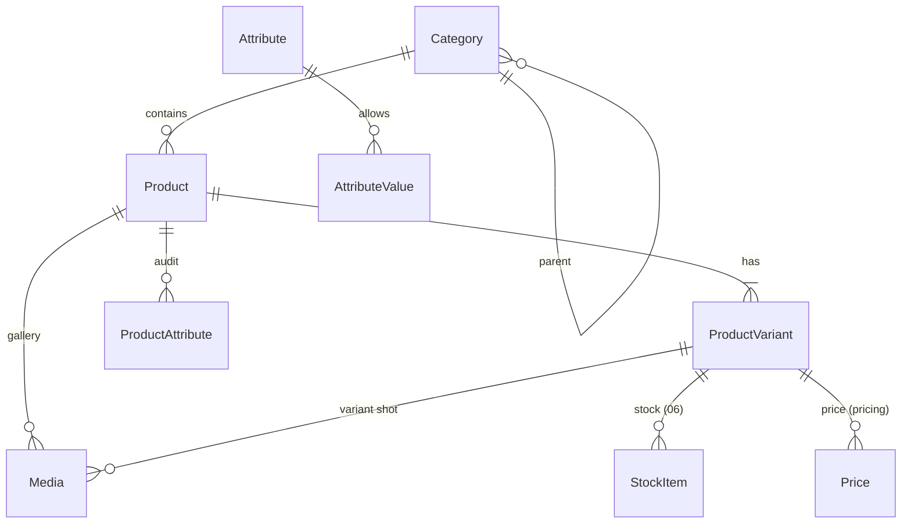
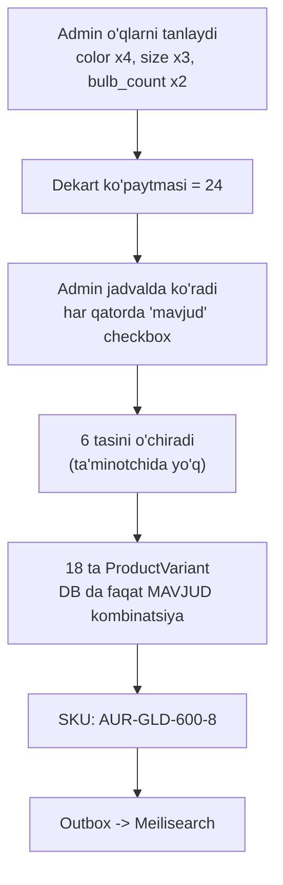
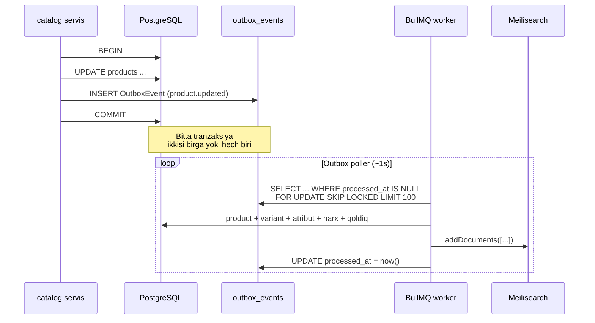
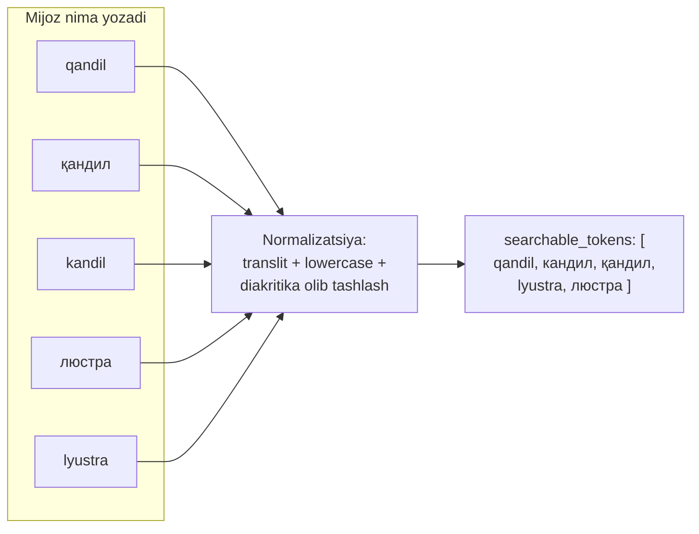
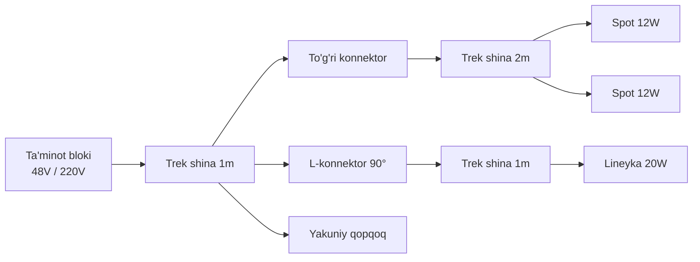

# 05 — Katalog va Qidiruv

> **Modul:** `catalog` (#2), `search` (#3) · **Status:** loyihalash
> **Bog'liq:** [`03-data-model.md`](./03-data-model.md) · [`06-inventory-and-reservations.md`](./06-inventory-and-reservations.md) · [`13-frontend-spec.md`](./13-frontend-spec.md)

---

## 0. Nima uchun bu hujjat alohida

Oddiy e-commerce katalogida mahsulotning 2-3 ta filtrlanadigan xossasi bo'ladi.
Yoritgichda **15+ texnik atribut** bor va har biri xarid qaroriga ta'sir qiladi.
Mijoz "vannaxonaga chiroq" deb qidirsa, unga IP44 dan past himoyali mahsulot
ko'rsatilishi — noqulaylik emas, **elektr xavfsizligi masalasi**.

CANON §9 dagi sakkiz qiyinchilikdan uchtasi (#1 faceted search, #4 variant
matritsasi, #7 trek mosligi) shu hujjatda hal qilinadi.

**Qamramaydi:** qoldiq/rezerv → `06`; narx/aksiya → `pricing`; UI → `13`;
to'liq Prisma sxemasi → `03`.

---

## 1. Katalog modeli



| Qatlam      | Entity           | Nima                                  | Misol                           |
| ----------- | ---------------- | ------------------------------------- | ------------------------------- |
| Taksonomiya | `Category`       | Navigatsiya daraxti                   | Люстры → Хрустальные            |
| Model       | `Product`        | Bitta sahifa, bitta tavsif            | "Aurora qandili"                |
| SKU         | `ProductVariant` | Sotiladigan, omborda yotadigan birlik | Aurora / oltin / Ø600 / 8 lampa |

### 1.1 `Category` — daraxt

11 ta ildiz kategoriya CANON §4 dan (Figma footer'i) — **o'zgarmaydi**. Ostida
2-3 daraja ichki bo'linish (~50-80 node).

| Kriteriya     | Adjacency list | Nested set      | Materialized path             |
| ------------- | -------------- | --------------- | ----------------------------- |
| Subtree       | Rekursiv CTE   | `BETWEEN` — tez | `LIKE 'x.%'` — tez            |
| Breadcrumb    | Rekursiv CTE   | 1 so'rov        | **Yozuvdan parse — 0 so'rov** |
| Node qo'shish | O(1)           | **O(n)**        | O(1)                          |
| Murakkablik   | Past           | **Yuqori**      | O'rta                         |

**Qaror: materialized path + `parent_id`.** O'qish yozishdan ~1000× ko'p:
daraxt kuniga bir-ikki marta o'zgaradi, har sahifada o'qiladi. Breadcrumb
(`path = "lyustry.hrustalnye.kaskadnye"`) satrni bo'lish bilan — 0 qo'shimcha
so'rov. Subtree — bitta indexlangan `LIKE`. `parent_id` baribir saqlanadi:
FK yaxlitligi va admin drag-drop uchun. Ya'ni path — denormalizatsiya,
`parent_id` — haqiqat; path servis qatlamida qayta hisoblanadi (trigger emas:
ko'chirish kamdan-kam).

Nested set rad etildi: node qo'shishda jadvalning yarmi yangilanadi va
admin panelida deadlock xavfi — ~80 node uchun bu murakkablik hech narsa
qaytarmaydi.

```sql
CREATE INDEX categories_path_prefix_idx ON categories (path text_pattern_ops);
```

> PostgreSQL `ltree` aynan shu vazifa uchun, lekin Prisma uni nativ
> qo'llab-quvvatlamaydi (`Unsupported` + raw query). 1000+ node'da ADR bilan
> ko'riladi — ochiq savol emas, **ataylab kechiktirilgan optimizatsiya**.

**Invariantlar:** `depth = 0` ⇔ `parent_id IS NULL`; `path = parent.path + '.' + slug`;
sikl yo'q (ko'chirishda `newParent.path` `moved.path` bilan boshlanmasligi
tekshiriladi); bir mahsulot **bitta** kategoriyada — breadcrumb va kanonik URL
bir xil bo'lishi kerak (§10). Ko'p kategoriya kerak bo'lsa — atribut/tag orqali.

### 1.2 `Product` vs `ProductVariant`

"Aurora qandili" — bitta narsami yoki 24 tami? **Mijoz uchun** bitta: bitta
sahifa, tavsif, sharhlar to'plami. **Ombor uchun** 24 ta: har birining
shtrix-kodi, qoldig'i, narxi (oltin xromdan qimmat), og'irligi.

- Faqat `Product`: rang/o'lchamni qayerda saqlaymiz, qoldiqni qanday
  hisoblaymiz? Javob yo'q.
- Faqat `ProductVariant`: 24 sahifa, 24 takrorlangan tavsif, sharhlar
  bo'linadi, SEO kannibalizatsiyasi.

|                                                           | `Product`         | `ProductVariant`   |
| --------------------------------------------------------- | ----------------- | ------------------ |
| URL                                                       | `/lyustry/aurora` | Yo'q (`?variant=`) |
| Tavsif, sharh                                             | Bu yerda          | Yo'q               |
| **Umumiy** atributlar (`socket_type`, `ip_rating`, `cri`) | Bu yerda          | Meros              |
| **Farqlovchi** (`color`, `dimensions`, `bulb_count`)      | Yo'q              | Bu yerda           |
| Narx / qoldiq / shtrix-kod                                | Yo'q              | Bor                |

**Meros qoidasi:** atribut `Product` da, **agar barcha variantlarda bir xil
bo'lsa**; aks holda variantga tushadi. Bu mexanik — `variantAxes` ga kiritilgan
atributlar avtomatik variantga tushadi.

**Nozik holat:** `bulb_count` o'q bo'lsa, `power` va `luminous_flux` **hosila**
bo'lib qoladi: `variant.luminous_flux = product.luminous_flux_per_bulb ×
variant.bulb_count`. Bu hisoblanadigan atribut: variantda saqlanadi (index
uchun), admin qo'lda kiritmaydi. Ta'minotchi boshqa raqam bersa — admin
override qiladi va yozuv `is_overridden = true` oladi, aks holda keyingi
regeneratsiya uni yo'q qiladi.

### 1.3 Variant matritsasi portlashi

CANON §4.1: `1 × 4 rang × 3 o'lcham × 2 lampa = 24 SKU`. Bu **ko'paytma** —
yana bir o'q (`color_temperature`) qo'shilsa 48. Admin 48 SKU'ni qo'lda
kiritmaydi.



**Uch qoida:**

1. **Faqat mavjud kombinatsiya DB da.** Dekart ko'paytmasi — admin UI dagi
   _taklif_, DB dagi _haqiqat_ emas. Ta'minotchi Ø800 ni faqat oltin/xromda
   ishlab chiqarsa — qora Ø800 umuman yaratilmaydi. Bu "yo'q mahsulotni sotib
   olish" holatini ildizidan yo'q qiladi.
2. **O'qlar `Product.variantAxes` (JSONB) da** — matritsaning sxemasi.
   Variantda har o'q uchun **aynan bitta** qiymat bo'lishi validatsiya qilinadi.
3. **Regeneratsiya destruktiv emas.** Yangi rang qo'shilsa — faqat yangi
   kombinatsiyalar taklif qilinadi, mavjudlar (qoldiq va buyurtma tarixi bor)
   tegilmaydi. O'q qiymati o'chirilsa — variantlar **soft-delete**, hard delete
   hech qachon (`OrderItem` ularga bog'langan).

```typescript
// apps/api/src/catalog/variant-matrix/cartesian.ts

/** Product.variantAxes JSONB ichidagi struktura */
export interface VariantAxis {
  readonly attributeCode: string; // "color", "bulb_count"
  readonly valueIds: readonly string[]; // AttributeValue.id; tartib = UI tartibi
}

export interface AxisCombination {
  readonly values: Readonly<Record<string, string>>; // attributeCode -> valueId
}

/** O'qlardan dekart ko'paytmasi. Faqat REJA — DB ga yozmaydi. */
export function buildCombinations(axes: readonly VariantAxis[]): readonly AxisCombination[] {
  if (axes.length === 0) return [];
  return axes.reduce<readonly AxisCombination[]>(
    (acc, axis) =>
      acc.flatMap((partial) =>
        axis.valueIds.map((valueId) => ({
          values: { ...partial.values, [axis.attributeCode]: valueId },
        })),
      ),
    [{ values: {} }],
  );
}

/** Guard rail: admin 15 rang x 10 o'lcham x 4 harorat = 600 SKU yaratmasin. */
export const MAX_COMBINATIONS = 200;
```

> `MAX_COMBINATIONS = 200` — **himoya to'sig'i, o'lchangan chegara emas.** Real
> katalogdagi eng katta matritsa ma'lum bo'lgach qayta ko'riladi.

**SKU:** `AUR-GLD-600-8`; qisqartmalar `AttributeValue.skuToken` da. SKU
**unique va o'zgarmas** — u shtrix-kod, ta'minotchi hujjati va 1C bilan
bog'lanadi (1C — CANON §6 bo'yicha ochiq savol).

### 1.4 Atribut sistemasi — EAV muammosi va gibrid yechim

Sof EAV'da har atribut alohida qator → "IP44 va 3000K va 2000-3000 lm" = **uch
self-join**:

```sql
SELECT p.id FROM products p
  JOIN product_attributes a1 ON a1.product_id = p.id
       AND a1.attribute_id = 'ip_rating'         AND a1.value_text = 'IP44'
  JOIN product_attributes a2 ON a2.product_id = p.id
       AND a2.attribute_id = 'color_temperature' AND a2.value_int  = 3000
  JOIN product_attributes a3 ON a3.product_id = p.id
       AND a3.attribute_id = 'luminous_flux'     AND a3.value_int BETWEEN 2000 AND 3000;
```

1. **JOIN soni filtr soniga chiziqli o'sadi.** 15 atributli domenda 6-7 filtr
   normal → 7 JOIN; planner join order'ni xato tanlash ehtimoli keskin oshadi.
2. **Tip yo'q.** `value` — `text`; `> 2000` uchun CAST kerak, CAST index'ni buzadi.
3. **Facet count deyarli imkonsiz** — har filtr uchun alohida agregatsiya × 15.
4. **Validatsiya DB da yo'q** — `color_temperature = "issiq"` yozilaveradi.

**Gibrid — ikkiga bo'lamiz:**

| Nima                                                | Qayerda                                                        | Nega                                            |
| --------------------------------------------------- | -------------------------------------------------------------- | ----------------------------------------------- |
| Atribut **ta'rifi** (kod, tip, birlik, filtr usuli) | `Attribute` — relyatsion                                       | ~20 yozuv, admin UI shundan generatsiya         |
| Ruxsat etilgan **qiymatlar**                        | `AttributeValue` — relyatsion                                  | Tarjima, tartib, `skuToken`, FK yaxlitligi      |
| **Haqiqiy qiymatlar**                               | `Product.attributes` / `ProductVariant.attributes` — **JSONB** | Bitta qatorda, JOIN yo'q, GIN index             |
| **Audit** (kim/qachon o'zgartirdi)                  | `ProductAttribute`                                             | Kim `ip_rating` ni o'zgartirganini bilish kerak |

`ProductAttribute` **saqlanadi** (CANON §8 entity), lekin uning roli — **yozuv
jurnali**, o'qish yo'lidagi jadval emas. JSONB — undan hosil qilingan
denormalizatsiya.

> **Bu ataylab denormalizatsiya va u xavf tug'diradi:** JSONB
> `ProductAttribute` bilan rassinxron bo'lishi mumkin. Ikkalasi **bitta
> tranzaksiyada** yoziladi, tunda `catalog:attr-drift-check` job solishtiradi.

```sql
-- jsonb_path_ops: faqat @> uchun, default gin_jsonb_ops dan ~30% kichik
CREATE INDEX products_attributes_gin_idx ON products USING GIN (attributes jsonb_path_ops);

SELECT id FROM products
WHERE attributes @> '{"ip_rating": "IP44", "color_temperature": 3000}';
```

JOIN'siz, bitta index scan — filtr soni o'sganda ham **bitta**. EAV'ning asosiy
muammosi yo'qoladi.

**`@>` cheklovi:** u faqat **tenglik**ni biladi; `BETWEEN` diapazoni `@>` bilan
ifodalanmaydi. Yechim — **generated column + B-tree**:

```sql
ALTER TABLE product_variants
  ADD COLUMN luminous_flux int
  GENERATED ALWAYS AS ((attributes->>'luminous_flux')::int) STORED;
CREATE INDEX product_variants_flux_idx ON product_variants (luminous_flux);
```

Ya'ni: **enum/bool → JSONB + GIN**, **diapazonli sonli → generated column +
B-tree**. Bu bo'linish §2 dagi "filtr usuli" ustunidan kelib chiqadi.

> Lekin bu — PostgreSQL'ni qidiruv dvigateliga aylantirish yo'li. §3 da aynan
> shu yerda Meilisearch'ga o'tish sababi ko'rsatiladi. PostgreSQL bu yerda
> **haqiqat manbai va zaxira** rolini o'ynaydi.

### 1.5 `Media` — rasm variantgami yoki mahsulotgami

**Ikkalasiga ham**, `variantId` nullable orqali:

| `variantId`  | Ma'no                        | Misol                                  |
| ------------ | ---------------------------- | -------------------------------------- |
| `NULL`       | Umumiy — barcha variantlarga | O'lchov chizmasi, sertifikat, interyer |
| To'ldirilgan | Faqat shu variant            | Oltin Aurora'ning studiya surati       |

Qandilning "oltin" va "qora" varianti butunlay boshqacha ko'rinadi — rang
tanlanganda galereya **almashishi shart**. Lekin o'lchov chizmasi bir xil —
uni 4 marta yuklash ahmoqlik. Galereya = variant rasmlari + umumiylar,
`position` bo'yicha.

| Tip        | Format             | Izoh                                                                     |
| ---------- | ------------------ | ------------------------------------------------------------------------ |
| `IMAGE`    | AVIF + WebP + JPEG | BullMQ job (CANON §6) 5 o'lchamda variant hosil qiladi                   |
| `SPIN_360` | 24-36 kadr JPEG    | `spinSetId` bilan guruhlangan                                            |
| `VIDEO`    | MP4 + poster       | **Yoritgich uchun muhim** — statik rasm 3000K/4000K farqini ko'rsatmaydi |
| `DOCUMENT` | PDF                | Sertifikat, yo'riqnoma, datasheet                                        |

> **Domen qoidasi:** mahsulot rasmi kamera oq balansiga bog'liq — 2700K surati
> 4000K bilan bir xil chiqishi mumkin. Shuning uchun `color_temperature`
> **rasm bilan emas, swatch va raqam bilan** ko'rsatiladi.

---

## 2. Yoritishga xos atributlar

### 2.1 Reestr

| #   | `code`              | `dataType`     | Birlik | Qiymatlar                                        | Validatsiya      | `filterKind`   | UI                         |
| --- | ------------------- | -------------- | ------ | ------------------------------------------------ | ---------------- | -------------- | -------------------------- |
| 1   | `luminous_flux`     | `INT`          | lm     | 50 … 20000                                       | `> 0`, `≤ 50000` | `RANGE`        | Slider                     |
| 2   | `color_temperature` | `INT`          | K      | 2700/3000/4000/5000/6500                         | Enum a'zosi      | `MULTI`        | Checkbox + swatch          |
| 3   | `cri`               | `INT`          | Ra     | 70, 80, 90, 95                                   | `1 … 100`        | `RANGE` (min)  | "Ra 80+" radio             |
| 4   | `ip_rating`         | `ENUM`         | —      | IP20/44/54/65/67                                 | `^IP[0-6][0-8]$` | `HIERARCHICAL` | Radio "kamida"             |
| 5   | `socket_type`       | `ENUM`         | —      | E27, E14, GU10, G9, GU5.3, G4, integrated        | Enum a'zosi      | `MULTI`        | Checkbox                   |
| 6   | `power`             | `DECIMAL(6,2)` | W      | 0.5 … 500                                        | `> 0`            | `RANGE`        | Slider                     |
| 7   | `voltage`           | `ENUM`         | V      | 220, 12, 24                                      | Enum a'zosi      | `MULTI`        | Checkbox + ⚠️              |
| 8   | `dimmable`          | `BOOL`         | —      | ha/yo'q                                          | —                | `EXACT`        | Toggle                     |
| 9   | `beam_angle`        | `INT`          | °      | 10 … 120                                         | `1 … 360`        | `RANGE`        | Slider (spot)              |
| 10  | `bulbs_included`    | `BOOL`         | —      | ha/yo'q                                          | —                | `EXACT`        | Toggle                     |
| 11  | `light_source`      | `ENUM`         | —      | LED, halogen, incandescent, fluorescent          | Enum a'zosi      | `MULTI`        | Checkbox                   |
| 12  | `mount_type`        | `ENUM`         | —      | shift, devor, tortma, o'rnatiladigan             | Enum a'zosi      | `MULTI`        | Checkbox                   |
| 13  | `material`          | `ENUM`         | —      | shisha, kristall, metall, yog'och, plastik, mato | Enum a'zosi      | `MULTI`        | Checkbox                   |
| 14  | `color`             | `ENUM`         | —      | xrom, oltin, qora, nikel, oq, bronza             | Enum a'zosi      | `MULTI`        | Swatch                     |
| 15  | `dimensions`        | `TEXT`         | mm     | `{w,h,d,diameter}`                               | Har biri `> 0`   | `RANGE`        | Slider ×2                  |
| 16  | `weight`            | `INT`          | g      | `> 0`                                            | `> 0`            | `NONE`         | Yashirin (yetkazish uchun) |
| 17  | `bulb_count`        | `INT`          | dona   | 1 … 24                                           | `≥ 1`            | `RANGE`        | Slider                     |

> `bulb_count` CANON §4 jadvalida alohida qator emas, lekin §4.1 dagi matritsa
> misolida ("2 lampa soni") o'q sifatida ishlatilgan — demak `Attribute`
> jadvalida bo'lishi shart. Yangi entity emas, mavjud jadvaldagi qator.

### 2.2 Filtr semantikasi

- **`EXACT`** — `dimmable = true`.
- **`MULTI`** — **ichida OR**: 3000K va 4000K belgilangan = ikkalasini ham
  ko'rish, ikkalasi bir vaqtda bo'lgan mahsulot emas. **Atributlar orasida AND**:
  `(ct IN (3000,4000)) AND (socket IN ('E27')) AND (dimmable = true)`.
- **`RANGE`** — slider chegaralari **joriy natijalardan** dinamik
  (`facetStats`), statik emas — aks holda "Комплектующие" da 20000 lm gacha
  cho'zilgan foydasiz slider chiqadi.

#### `ip_rating` — jadvaldagi eng nozik atribut

"Vannaxona uchun" = IP44 talabi. IP65 li mahsulot bu talabni
**qanoatlantiradi** — u himoyaliroq. Ya'ni `ip_rating = 'IP44'` **noto'g'ri
filtr**; to'g'risi `ip_rating >= IP44`.

IP ikki raqam, **har biri mustaqil**: 1-si chang (0…6), 2-si suv (0…8).
Taqqoslash raqam-ma-raqam: `IP65 ≥ IP44 ⇔ 6≥4 AND 5≥4` ✅.

**⚠️ Istisno:** suv shkalasi to'liq tartiblangan **emas**. IPx7 (botirish)
IPx5 (suv oqimi) ni **kafolatlamaydi** — ikki turli sinov. Shuning uchun
sanoatda IP65/IP67 **qo'sh belgilash** ishlatiladi.

```
IP67 ≥ IP65 ?  →  6 ≥ 6 ✅ (chang),  7 ≥ 5 ❓ (suv — kafolat YO'Q)
```

Sof raqamli taqqoslash bu yerda **noto'g'ri javob beradi**.

```typescript
// apps/api/src/catalog/attributes/ip-rating.ts

/**
 * IP suv himoyasi darajalari orasidagi "qanoatlantiradi" munosabati.
 * TO'LIQ TARTIBLANGAN EMAS: IPx7 IPx5 ni qamramaydi (turli sinov).
 * ⚠️ IEC 60529 matni bo'yicha TEKSHIRILISHI KERAK — quyidagilar sanoat
 * amaliyotidan, standart iqtibosi emas (§13 #4).
 */
const WATER_IMPLIES: Readonly<Record<number, readonly number[]>> = {
  0: [0],
  4: [4, 3, 2, 1, 0],
  1: [1, 0],
  5: [5, 4, 3, 2, 1, 0],
  2: [2, 1, 0],
  6: [6, 5, 4, 3, 2, 1, 0],
  3: [3, 2, 1, 0],
  // 7/8 — botirish sinovi. Ular 5/6 (oqim sinovi) ni QAMRAMAYDI.
  7: [7, 4, 3, 2, 1, 0],
  8: [8, 7, 4, 3, 2, 1, 0],
};

export interface IpRating {
  readonly solid: number;
  readonly water: number;
}

export function parseIp(code: string): IpRating {
  const m = /^IP([0-6])([0-8])$/.exec(code);
  if (!m) throw new Error(`Yaroqsiz IP kodi: ${code}`);
  return { solid: Number(m[1]), water: Number(m[2]) };
}

/** `candidate` `required` talabini qanoatlantiradimi? */
export function satisfies(candidate: IpRating, required: IpRating): boolean {
  return (
    candidate.solid >= required.solid &&
    (WATER_IMPLIES[candidate.water]?.includes(required.water) ?? false)
  );
}
```

**Index'da:** Meilisearch (va GIN) qisman tartibni bilmaydi → indexlashda
**materializatsiya**: har mahsulot qanoatlantiradigan barcha IP darajalari
massiv sifatida yoziladi.

```jsonc
{
  "ip_rating": "IP65",
  // Hosila: IP65 qanoatlantiradigan BARCHA talablar. Filtr shu maydon bo'yicha.
  "ip_satisfies": ["IP20", "IP21", "IP22", "IP23", "IP24", "IP44", "IP54", "IP65"],
}
```

`ip_satisfies = "IP44"` → IP44/IP54/IP65 chiqadi, IP20 chiqmaydi. **Va IP67
li mahsulot IP65 talabiga chiqmaydi** — massiv `satisfies()` bilan hisoblanadi.
Indexlash paytida bir marta (maks. 5×9 kombinatsiya) evaziga so'rov paytida
murakkab mantiq yo'q qilinadi.

**`voltage`** — filtr oddiy `MULTI`, lekin 12V mahsulot **transformatorsiz
ishlamaydi** (CANON §4.4) → savatga qo'shishda validatsiya (§6.5).

---

## 3. Faceted search

### 3.1 Talab va facet count muammosi

```
Rang harorati          Sokol
  ☐ 2700K  (48)          ☐ E27   (94)
  ☑ 3000K  (112)         ☐ GU10  (18)
  ☐ 4000K  (86)
  ☐ 6500K  (0)   ← o'chirilgan
```

Bu raqamlarsiz mijoz "bo'sh natijalar" tuzog'iga tushadi: filtr → 0 natija →
orqaga → yana urinish.

**Sodda yondashuv:** har qiymat uchun alohida `count(*)` → 15 atribut × ~5
qiymat = **75 so'rov, har sahifada**. N+1, faqat qatorlar emas — filtrlar bo'yicha.

**Nozik joy — "o'z-o'zini istisno qilish":** foydalanuvchi 3000K ni tanlagan.
4000K yonida nima turishi kerak?

- ❌ "Joriy natijalar ichida nechta 4000K bor" → **0**. Befoyda.
- ✅ "3000K ni yechib 4000K ni tanlasam nechta bo'ladi" → **86**.

Ya'ni **bir atribut ichida** facet count hisoblashda **o'sha atributning o'z
filtri chiqarib tashlanadi**, boshqalarniki qoladi — bu §2.2 dagi "ichida OR,
orasida AND" semantikasining bevosita natijasi. Demak har atribut uchun
**boshqa filtr to'plami** bilan agregatsiya kerak:

```sql
SELECT
  count(*) FILTER (WHERE attributes @> '{"color_temperature": 2700}') AS ct_2700,
  count(*) FILTER (WHERE attributes @> '{"color_temperature": 3000}') AS ct_3000,
  count(*) FILTER (WHERE attributes @> '{"color_temperature": 4000}') AS ct_4000
FROM products
WHERE category_path LIKE 'lyustry.%'
  AND attributes @> '{"socket_type": "E27"}'   -- boshqa filtrlar QOLADI
  AND deleted_at IS NULL;
-- color_temperature filtri YO'Q — o'zini istisno qilyapti.
```

Bu **bitta** atribut uchun. 15 atribut = 15 shunday blok, dinamik generatsiya
qilingan SQL. Yozish mumkin. **Saqlash — og'riq.**

### 3.2 PostgreSQL vs Meilisearch

| Kriteriya                        | PostgreSQL (GIN + JSONB + pg_trgm)                                    | Meilisearch                            |
| -------------------------------- | --------------------------------------------------------------------- | -------------------------------------- |
| **Facet count**                  | Qo'lda: dinamik `FILTER` SQL har atribut uchun                        | `facets: [...]` — **tayyor**           |
| **Facet stats** (slider min/max) | `min()`/`max()` + yana so'rov                                         | `facetStats` — tayyor                  |
| **Typo tolerance**               | `pg_trgm` — sozlanadi, qo'pol                                         | **Nativ**, so'z uzunligiga moslashadi  |
| **Prefix (as-you-type)**         | `LIKE 'abc%'` / trgm — sekin                                          | Nativ, dizayndan                       |
| **Sinonim**                      | `tsquery` + dict fayl (deploy kerak)                                  | API orqali, runtime'da                 |
| **Ranking**                      | `ts_rank` — biznes signali qo'shish qiyin                             | Sozlanadigan qoida ro'yxati            |
| **Diapazon**                     | ✅ B-tree + generated column                                          | ✅ nativ                               |
| **Ierarxik (IP)**                | Materializatsiya kerak                                                | Materializatsiya kerak (**bir xil**)   |
| **Tranzaksiya**                  | ✅ ACID                                                               | ❌ Eventual                            |
| **Haqiqat manbai**               | ✅                                                                    | ❌ Hech qachon                         |
| **Infra**                        | Allaqachon bor                                                        | **+1 servis**, RAM, monitoring, backup |
| **Sinxronizatsiya**              | Kerak emas                                                            | **Kerak — asosiy narx**                |
| **Ko'p tillilik**                | `tsvector` tilga bog'liq; **o'zbek uchun tayyor konfiguratsiya yo'q** | Til-agnostik tokenizatsiya             |

**Qaror: Meilisearch (CANON §6).**

1. **Facet count tayyor.** §3.1 dagi butun muammo — bitta parametr. Bu bizga
   _yozilmagan kod_ beradi, va yozilmagan kodda bug yo'q.
2. **O'zbek tili.** PG FTS til konfiguratsiyasiga tayanadi
   (`to_tsvector('russian', ...)`); o'zbek uchun **standart konfiguratsiya yo'q**
   — stemmer, stop-word yo'q, `simple` ga tushamiz. Meilisearch til
   konfiguratsiyasiz ishlaydi. §4 uchun bu hal qiluvchi.
3. **Typo tolerance nativ**; `pg_trgm` bilan ham bo'ladi, lekin sozlash tajriba ishi.
4. **Ranking qoidalari deklarativ** — `ts_rank` + `ORDER BY` da bu sehrli
   koeffitsiyentli formula bo'lardi.

**Narx (halol):** +1 servis; eventual consistency; yangi failure mode (§3.4
fallback). Eventual consistency **qabul qilinadi**: index'dagi narx —
ko'rsatkich, haqiqiysi savatda `pricing` dan qayta olinadi; `in_stock` faqat
filtr uchun, rezerv har doim PostgreSQL'da lock bilan ([`06`](./06-inventory-and-reservations.md)).

**Qachon PostgreSQL yetarli edi:** katalog < ~5 000 SKU **va** filtrlar < ~5
**va** faqat rus tili **va** typo tolerance kerak emas **va** facet count'siz
yashash mumkin. Kelvin'ning boshlang'ich katalogi ehtimol < 5 000 SKU — ya'ni
**1-shart bajariladi**. Lekin 3-shart (o'zbek tili) va facet count talabi
(15 atribut) bajarilmaydi. Aynan shu ikkitasi qarorni hal qiladi — **hajm emas**.

> **Muhim:** biz Meilisearch'ni "PostgreSQL sekin" degani uchun tanlamayapmiz.
> 5 000 qator uchun PostgreSQL tez. Biz uni **facet count va ko'p tilli qidiruv
> kodini yozmaslik uchun** tanlayapmiz. Kimdir "PostgreSQL yetarli-ku" desa —
> u hajm haqida gapiryapti va u haq. Javob: masala hajmda emas, funksiyada.

> ⚠️ **O'lchov kerak.** Yuqoridagi — arxitektura tahlili, benchmark emas.
> CANON §9.1 "o'lchov bilan qaror" deydi. Real qaror ADR-0xx da real katalog
> bilan o'lchangandan keyin tasdiqlanadi. Bu hujjat **taxminni** yozadi.

### 3.3 Sinxronizatsiya: PostgreSQL → Meilisearch

**Qat'iy qoida:** PostgreSQL — **yagona haqiqat manbai**. Meilisearch —
**tashlab yuborilishi mumkin bo'lgan index**: undagi ma'lumot yo'qolsa,
PostgreSQL'dan to'liq qayta qurilishi shart.



**Nega outbox** (CANON §8): to'g'ridan-to'g'ri yozishda ikki buzilish bor —
(1) `COMMIT` o'tdi, Meili chaqiruvi yiqildi → **index abadiy eski**;
(2) Meili'ga yozildi, `COMMIT` yiqildi → **index'da mavjud bo'lmagan ma'lumot**.
Outbox ikkalasini yo'q qiladi: event `UPDATE` bilan bir tranzaksiyada.

`FOR UPDATE SKIP LOCKED` — parallel worker'lar bir event'ni ikki marta olmasin.
**At-least-once, idempotent:** worker crash bo'lsa event ikki marta qayta
ishlanishi mumkin — muammo emas, `addDocuments` **upsert**.

**Tartib muammosi:** ikki worker bir mahsulotning ikki event'ini parallel qayta
ishlasa, eski holat yangisining ustiga yozilishi mumkin. Yechim: BullMQ
`groupKey = product:{id}` — bir mahsulot uchun ketma-ket, turli mahsulotlar
parallel. (Muqobil — dokumentda `version` tekshiruvi; **birinchisi tanlanadi**,
oddiyroq.)

| Xavf                          | Sabab                          | Ushlash                                                     | Tuzatish                                        |
| ----------------------------- | ------------------------------ | ----------------------------------------------------------- | ----------------------------------------------- |
| Index eski                    | Worker o'chgan, navbat to'lgan | Outbox lag metrikasi + alert                                | Worker tiklanadi, outbox o'zi tugatadi          |
| O'chirilgan mahsulot index'da | `deleted` event yo'qolgan      | Tunlik `search:drift-check` — ID to'plamlarini solishtiradi | Farqni tuzatadi + `WARN`                        |
| Narx noto'g'ri                | Race yoki bug                  | Xuddi shu job — namuna bo'yicha `updated_at`                | Reindex                                         |
| Index butunlay yo'q           | Volume yo'qolgan               | Health check                                                | `search:full-reindex` — **CI da test qilinadi** |

> Drift detektori — **paranoyya emas, zarurat.** Eventual consistency'ning
> ta'rifi bo'yicha nomuvofiqlik _bo'ladi_. Savol — uni biz topamizmi yoki mijoz.

### 3.4 Fallback

Meilisearch SPOF bo'lmasligi kerak. Uch daraja:

1. **Ishlayapti** → to'liq qidiruv, facet, typo tolerance.
2. **Yiqilgan, kategoriya sahifasi** → PostgreSQL: `path LIKE` + JSONB `@>`
   (§1.4 dagi GIN index aynan shu uchun ham). **Facet count `null`** — UI
   raqamsiz, lekin filtrlar ishlaydi.
3. **Yiqilgan, matn qidiruvi** → `pg_trgm` qo'pol qidiruv. Sifat past, lekin 500 emas.

Bu — `SearchPort` (§8.3) ikki implementatsiyaga ega bo'lishining **asosiy
sababi**: PostgreSQL implementatsiyasi "ADR taqqoslashi" emas — u **ishlab
turadigan zaxira**.

> Circuit breaker: ketma-ket 5 xato → 30s ga PostgreSQL. ⚠️ Raqamlar —
> taxmin, o'lchov bilan sozlanadi.

### 3.5 Filtr kombinatsiyasi va URL holati

Filtr URL'da bo'lishi shart: ulashish, "orqaga" tugmasi, sahifa yangilash, SEO.

```
/lyustry?ct=3000,4000&socket=e27&flux=2000-4000&ip=ip44&dim=1&sort=popular&page=2
```

| Param          | Format       | Izoh                                                             |
| -------------- | ------------ | ---------------------------------------------------------------- |
| `ct`, `socket` | Vergul bilan | `MULTI` → OR                                                     |
| `flux`         | `min-max`    | `RANGE`                                                          |
| `ip`           | Bitta qiymat | `HIERARCHICAL` → "kamida"                                        |
| `dim`          | `1`/`0`      | `BOOL`                                                           |
| `sort`         | Enum         | `relevance` \| `price_asc` \| `price_desc` \| `popular` \| `new` |

**Qoidalar:** qisqa kalitlar (`ct`, `flux`), atribut `code` emas — xarita
`Attribute.urlKey` da; qiymatlar **tartiblangan** (`?ct=4000,3000` va
`?ct=3000,4000` — bir xil sahifa → backend kanonik shaklga `301`, aks holda SEO
duplikat); bo'sh param va `page=1` yozilmaydi; kategoriya — path'da, filtr —
query'da (§10).

```typescript
// packages/contracts/src/search/url-state.ts
import { z } from 'zod';

export const searchUrlStateSchema = z.object({
  categorySlug: z.string().min(1).optional(),
  q: z.string().trim().min(1).max(120).optional(),
  filters: z
    .record(
      z.string(),
      z.union([
        z.array(z.string()), // MULTI
        z.object({ min: z.number(), max: z.number() }), // RANGE
        z.boolean(), // EXACT
        z.string(), // HIERARCHICAL
      ]),
    )
    .default({}),
  sort: z.enum(['relevance', 'price_asc', 'price_desc', 'popular', 'new']).default('relevance'),
  page: z.number().int().min(1).default(1),
  perPage: z.number().int().min(12).max(96).default(24), // §9 byudjeti
});

export type SearchUrlState = z.infer<typeof searchUrlStateSchema>;

/** Kanonik URL — SEO uchun. Kalitlar va qiymatlar tartiblanadi (determinizm). */
export function toCanonicalQuery(state: SearchUrlState): string;
```

---

## 4. Qidiruv sifati

### 4.1 Typo tolerance

Mijoz xato yozadi — bu norma: `люстро`, `лустра` → Люстры; `светильнек`,
`svetilnik` → Светильники; `spott` → Споты.

```typescript
// apps/api/src/search/meili/index-settings.ts
export const typoTolerance = {
  enabled: true,
  minWordSizeForTypos: { oneTypo: 4, twoTypos: 8 },
  // Bu so'zlarda typo YO'Q — ular texnik kodlar.
  disableOnWords: [
    'e27',
    'e14',
    'gu10',
    'g9',
    'gu5.3',
    'g4',
    'ip20',
    'ip44',
    'ip54',
    'ip65',
    'ip67',
    '2700k',
    '3000k',
    '4000k',
    '5000k',
    '6500k',
    '12v',
    '24v',
    '220v',
  ],
  disableOnAttributes: ['sku', 'barcode', 'socket_type', 'ip_rating'],
} as const;
```

> **`disableOnWords` — bu bo'limdagi eng muhim satr.** "E27" va "E14" orasidagi
> Levenshtein masofasi 1. Typo tolerance yoqilgan bo'lsa, E27 qidirgan mijozga
> E14 chiqadi va u **noto'g'ri lampochka sotib oladi** → qaytarish, shikoyat,
> yomon sharh. Texnik kodlarda typo tolerance — **zarar**.

### 4.2 Ko'p tillilik va transliteratsiya

**Bu hujjatdagi eng murakkab qism.** Bitta mahsulot kamida uch xil yozilishi
mumkin: o'zbek lotin (`qandil`), o'zbek kirill (`қандил`), rus (`люстра`).
Va **klaviatura haqiqati**: ko'pchilik telefonda rus klaviaturasida o'zbekcha
yozadi (`қандил` o'rniga `кандил`), yoki lotin klaviaturada ruscha (`lyustra`).



| Yondashuv                                                              | Muammo                                                                  |
| ---------------------------------------------------------------------- | ----------------------------------------------------------------------- |
| **So'rovni kengaytirish** — so'rovni barcha variantlarga aylantirib OR | So'rov paytida narx; typo tolerance kengaytmalar ustida noaniq ishlaydi |
| **Dokumentni kengaytirish** ✅                                         | Index ~2-3× katta. **Lekin so'rov paytida narx yo'q.**                  |

**Dokumentni kengaytirish tanlanadi:** indexlash offline (BullMQ), qidiruv
online. Narxni offline tomonga surish — har doim to'g'ri almashuv.

Xaritalar (`translit.data.ts`): `UZ_LAT_TO_CYR` va `RU_CYR_TO_LAT` — juftliklar
ro'yxati, `applyMap` ketma-ket almashtiradi. **TARTIB MUHIM: ko'p belgili
grafemalar BIRINCHI** (`o'`→`ў`, `g'`→`ғ`, `sh`→`ш`, `ch`→`ч`, `ng`→`нг`), aks
holda `sh` → `сҳ` bo'lib ketadi. ⚠️ Jadvallar to'liq emas va tekshirilishi
kerak (§13 #3).

```typescript
// apps/api/src/search/normalization/translit.ts

export const uzLatinToCyrillic = (s: string) => applyMap(s, UZ_LAT_TO_CYR);
export const ruCyrillicToLatin = (s: string) => applyMap(s, RU_CYR_TO_LAT);

/** "қандил" -> "кандил": o'zbek kirill belgilarini "oddiy" ruscha shaklga */
export const foldUzbekCyrillic = (s: string): string =>
  s
    .toLowerCase()
    .split('қ')
    .join('к')
    .split('ғ')
    .join('г')
    .split('ҳ')
    .join('х')
    .split('ў')
    .join('у');

/** Indexlash paytida chaqiriladi, so'rov paytida EMAS. */
export function expandWritingVariants(text: string): readonly string[] {
  const base = text.trim().toLowerCase();
  if (base.length === 0) return [];
  return [
    ...new Set([
      base,
      uzLatinToCyrillic(base),
      ruCyrillicToLatin(base),
      foldUzbekCyrillic(base),
      foldUzbekCyrillic(uzLatinToCyrillic(base)),
      base.split("'").join('').split('ʻ').join(''), // mijoz apostrof yozmaydi
    ]),
  ].filter((v) => v.length > 0);
}

/** So'rov tomonida — faqat minimal normalizatsiya (apostrof variantlari). */
export const normalizeQuery = (q: string): string =>
  q
    .trim()
    .toLowerCase()
    .replace(/[‘’ʻʼ`]/g, "'")
    .replace(/\s+/g, ' ');
```

```typescript
// Tartib vaznni belgilaydi: birinchisidagi moslik yuqoriroq baholanadi.
export const searchableAttributes = [
  'name_uz',
  'name_ru',
  'sku',
  'brand',
  'category_name_uz',
  'category_name_ru',
  'searchable_tokens', // ataylab past: to'g'ridan-to'g'ri moslik
  'description_uz', // transliteratsiya orqali mosligdan yuqori turishi kerak
  'description_ru',
] as const;
```

`searchable_tokens` index'da bo'ladi, lekin UI'da **hech qachon ko'rsatilmaydi**.

### 4.3 Sinonimlar

CANON §4 kategoriyalari ruscha, mijoz o'zbekcha yozadi — sinonimlar ko'prik quradi.

```typescript
/** Meilisearch sinonimlari IKKI TOMONLAMA EMAS — ikkalasini ham yozish shart. */
export const productSynonyms: Readonly<Record<string, readonly string[]>> = {
  qandil: ['люстра', 'lyustra', 'қандил', 'chandelier'],
  люстра: ['qandil', 'lyustra', 'қандил'],
  chiroq: ['светильник', 'svetilnik', 'чироқ', 'лампа'],
  светильник: ['chiroq', 'svetilnik', 'лампа', 'чироқ'],
  bra: ['бра', "devor chirog'i", 'настенный светильник'],
  spot: ['спот', 'точечный светильник'],
  trek: ['трек', 'трековый', 'track'],
  lenta: ['лента', 'led lenta', 'светодиодная лента'],
  torsher: ['торшер', 'floor lamp', 'poldagi chiroq'],
  sokol: ['цоколь', 'патрон', 'socket'],
  /* … to'liq ro'yxat admin panelida boshqariladi */
};
```

> **Bu ro'yxat to'liq emas va bo'lishi ham mumkin emas.** Sinonimlar — jonli
> ma'lumot; ular real qidiruv loglaridan o'sadi (§4.5). Boshlang'ich ro'yxat —
> taxmin; haqiqiysi mijozlar nima yozganidan keladi. Shuning uchun sinonimlar
> **kodda hardcode emas**, admin panelida tahrirlanadigan va Meilisearch API
> orqali runtime'da yangilanadigan bo'lishi kerak.

### 4.4 Ranking

```typescript
// Tartib MUHIM — yuqoridan pastga qo'llaniladi
export const rankingRules = [
  'words',
  'typo',
  'proximity',
  'attribute', // searchableAttributes tartibi (name_uz > tokens)
  'sort', // foydalanuvchi tanlovi
  'exactness',
  'in_stock:desc', // mavjud mahsulot yuqorida
  'popularity:desc', // oxirgi ajratuvchi
] as const;
```

| #   | Signal         | Nega bu tartibda                                       |
| --- | -------------- | ------------------------------------------------------ |
| 1   | **Moslik**     | "GU10" qidirilsa, mashhur E27 qandil chiqmasligi kerak |
| 2   | **Mavjudlik**  | Sotib bo'lmaydigan mahsulot yuqorida — mijozni aldash  |
| 3   | **Mashhurlik** | Teng mosliklar orasida ajratuvchi                      |

**`in_stock` nega `rankingRules` da, `filter` da emas:** tugagan mahsulotni
butunlay yashirish noto'g'ri — mijoz aynan shuni qidirayotgan bo'lishi mumkin,
unga "vaqtincha yo'q, xabar beraymi?" kerak, 404 emas. Shuning uchun chiqadi,
lekin **pastda**. Istisno: "faqat mavjudlarini" filtri yoqilsa — `filter` ga
o'tadi (ongli tanlov).

`popularity` = 90 kunlik sotuv soni (`OrderItem` dan), kunlik
`search:recompute-popularity` job yangilaydi.

> ⚠️ **90 kun — taxmin, o'lchov emas.** Yoritgichda mavsumiylik bor (ko'cha
> chiroqlari — bahor/yoz; qandil — to'y mavsumi, yangi yil). Oyna uzunligi
> real sotuv ma'lumotidan keyin sozlanadi.

> **Cold start:** yangi mahsulotning `popularity = 0` → har doim pastda.
> Yechim — `is_new` (30 kun) bayrog'i va alohida "Yangi" saralash. Avtomatik
> "yangilik bonusi" **qo'shilmaydi** — u ranking'ni tushunib bo'lmaydigan qiladi.

### 4.5 Qidiruv analitikasi

Sinonim ro'yxatini (§4.3) **taxmin qilib bo'lmaydi** — uni o'lchash kerak.
Har qidiruv `analytics` moduliga yoziladi (`SearchLogEntry`: `queryRaw`,
`queryNormalized`, `filters`, `resultCount`, `tookMs`, `clickedPosition`,
`sessionId`, `at`). Ikki hisobot haftalik ko'riladi:

1. **Nol natijali so'rovlar** (`resultCount = 0`), chastota bo'yicha → bu
   **to'g'ridan-to'g'ri sinonim/kontent ro'yxati**. 50 kishi "потолочная
   люстра" yozib hech narsa topmagan bo'lsa — bu bug.
2. **Bosilmagan so'rovlar** (`clickedPosition = null`, `resultCount > 0`) →
   natija bor, lekin **noto'g'ri**. Ranking muammosi.

**Qidiruv — bir marta yozib qo'yiladigan narsa emas, doimiy sozlanadigan tizim.**

---

## 5. Xona yorug'lik kalkulyatori

Mijoz "20 m² yotoqxonaga qancha lyumen kerak?" savoliga javob bilmaydi — u
"yorug'roq"/"xira" deb o'ylaydi. Kalkulyator: **xona turi + maydon → tavsiya
lyumen → mos mahsulotlar**.

### 5.1 ⚠️ Normalar — TEKSHIRILISHI KERAK

> **QAT'IY:** quyidagi arxitektura lm/m² normalari mavjudligini nazarda tutadi.
> **Bu hujjatda aniq raqamlar YOZILMAYDI.**
>
> Sabab: yoritish normalari — **normativ hujjat masalasi**, taxmin emas.
> Noto'g'ri raqam mijozning uyida yetarsiz yoritishga olib keladi va bu
> do'konning javobgarligi.
>
> **Tekshirilishi kerak:**
>
> - **O'zbekiston qurilish normalari (QMQ / ShNQ)** — turar-joy va jamoat
>   binolarini yoritish. **Aniq raqami va tahriri noma'lum → §13 #1.**
> - **EN 12464-1** — "Lighting of work places" (xalqaro/EU), ish joylari uchun lyuks.
> - Ishlab chiqaruvchi / assotsiatsiya tavsiyalari (IES Handbook) — **tavsiya, norma emas.**
>
> **Nima qilinadi:** `RoomNorm` jadvali **bo'sh** yaratiladi; to'ldirish —
> alohida vazifa, tekshirilgan manba topilgach. Normalarsiz kalkulyator
> `NORMS_NOT_CONFIGURED` qaytaradi va **taxminiy raqam ko'rsatmaydi**.

### 5.2 Formula

Fizika (taxmin emas): `E (lyuks) = Φ (lyumen) / A (m²)` → `Φ_kerak = E × A`.
Lekin bu ideal holat; real hisobda ikki koeffitsiyent:

```
Φ_kerak = (E_norma × A) / (U × MF)
```

| Belgi     | Nima                                 | Nimaga bog'liq                                  |
| --------- | ------------------------------------ | ----------------------------------------------- |
| `E_norma` | Talab qilinadigan yoritilganlik (lk) | **Xona turi** — normadan                        |
| `A`       | Maydon (m²)                          | Foydalanuvchi kiritadi                          |
| `U`       | Foydalanish koeffitsiyenti           | Shift balandligi, xona shakli, aks ettirish     |
| `MF`      | Xizmat koeffitsiyenti                | Changlanish, LED degradatsiyasi, tozalash davri |

> ⚠️ **`U` va `MF` uchun ham aniq qiymatlar berilmaydi** (§13 #2). To'liq lumen
> method shift balandligi va aks ettirish koeffitsiyentlarini talab qiladi — bu
> mijozdan so'raladigan ma'lumot emas. **Boshlang'ich yechim:** ikkalasini
> `RoomNorm` da xona turi bo'yicha **konservativ konstanta** sifatida saqlash
> va **manbasini ko'rsatish**.

### 5.3 Model va servis

```prisma
/// ⚠️ Bu jadval BO'SH yaratiladi. Qiymatlar tekshirilgan manbadan kiritiladi.
model RoomNorm {
  id             String   @id @default(uuid(7))
  roomType       RoomType @unique @map("room_type")

  /// Talab qilinadigan yoritilganlik (lx). ⚠️ MANBA KO'RSATILISHI SHART.
  illuminanceLux Int      @map("illuminance_lux")
  /// Koeffitsiyentlar × 100 (butun son — float ishlatilmaydi)
  utilisationPct Int      @map("utilisation_pct")
  maintenancePct Int      @map("maintenance_pct")

  /// "QMQ 2.01.05-98, 4-jadval" yoki "EN 12464-1:2021 §6.3". BO'SH BO'LMASLIGI SHART.
  sourceRef      String    @map("source_ref") @db.VarChar(240)
  verifiedBy     String?   @map("verified_by") @db.VarChar(120)
  verifiedAt     DateTime? @map("verified_at") @db.Timestamptz(3)

  @@map("room_norms")
}

enum RoomType {
  LIVING_ROOM BEDROOM KITCHEN BATHROOM HALLWAY
  HOME_OFFICE CHILDREN_ROOM OUTDOOR RETAIL OFFICE
}
```

```typescript
// apps/api/src/catalog/calculator/lighting-calculator.service.ts

export interface CalculatorInput {
  readonly roomType: RoomType;
  readonly areaM2: number; // 1 … 500
  readonly ceilingHeightM?: number; // kelajakda U ni aniqlashtirish uchun
  readonly preferenceAdjustPct?: number; // -20 … +20
}

export interface CalculatorResult {
  readonly requiredLumen: number;
  readonly lumenRange: { readonly min: number; readonly max: number }; // ±15%
  readonly normSource: string; // mijozga KO'RSATILADI (shaffoflik)
  readonly illuminanceLux: number;
  readonly breakdown: readonly string[]; // "qanday chiqdi" tugmasi ostida
  readonly disclaimer: string; // ⚠️ har doim
}

export class NormsNotConfiguredError extends Error {
  readonly code = 'NORMS_NOT_CONFIGURED';
}

@Injectable()
export class LightingCalculatorService {
  async calculate(input: CalculatorInput): Promise<CalculatorResult> {
    const norm = await this.norms.findByRoomType(input.roomType);

    // ⚠️ Norma yo'q yoki manbasiz -> TAXMIN QILMAYMIZ. Bu — bo'limning o'zagi.
    if (norm === null || norm.sourceRef.trim() === '') {
      throw new NormsNotConfiguredError(input.roomType);
    }

    const ideal = norm.illuminanceLux * input.areaM2; // Φ = E × A
    const u = norm.utilisationPct / 100;
    const mf = norm.maintenancePct / 100;
    const base = ideal / (u * mf); // Φ / (U × MF)
    const required = Math.round(base * (1 + (input.preferenceAdjustPct ?? 0) / 100));

    // normSource va disclaimer HAR DOIM qaytariladi (shaffoflik),
    // breakdown — hisobning har qadami.
    return buildResult(required, norm, input, { ideal, u, mf, base });
  }
}
```

### 5.4 Kalkulyatordan qidiruvga

Natija — **filtrlangan qidiruv URL'i**: `20 m² yotoqxona → ~2400 lm` →
`/lyustry?flux=2040-2760&mount=shift&sort=popular`. Bu — kalkulyatorning
haqiqiy qiymati: u raqam emas, **sotib olinadigan ro'yxat** beradi.

**Nozik joy:** 2400 lm ni bitta qandil ham, 4 ta spot (600 lm) ham beradi.
Shuning uchun `LightingScenario[]` qaytariladi: `1 × 2400 lm`, `2 × 1200 lm`,
`4 × 600 lm`, `6 × 400 lm` — har biri o'z `searchUrl` i bilan (`flux` diapazoni
= `lm ± 15%`).

---

## 6. Trek tizimi mosligi

### 6.1 Muammo

Trek — **konstruktor**, mahsulot emas:



Mijoz "trek" olsa — kamida 4 xil mahsulot oladi. Mos kelmasa — ishlamaydi.

| Nomuvofiqlik    | Misol                                | Oqibat                        |
| --------------- | ------------------------------------ | ----------------------------- |
| Trek standarti  | 1-fazali spot 3-fazali trekka        | O'rnashmaydi / noto'g'ri faza |
| Kuchlanish      | 220V spot 48V trekka                 | **Ishlamaydi yoki yonadi**    |
| Konnektor tipi  | X brend konnektori Y brend shinasiga | O'rnashmaydi                  |
| Quvvat byudjeti | 100W blokka 10×12W spot              | **Ortiqcha yuk — xavf**       |

### 6.2 Model: atribut tengligi + istisno jadvali

| Yondashuv                                                     | Muammo                                                                 |
| ------------------------------------------------------------- | ---------------------------------------------------------------------- |
| **Har juftlik uchun yozuv** — 200 spot × 30 trek = 6000 qator | Admin qo'lda to'ldirmaydi; yangi spot → 30 yozuv. **Saqlab bo'lmaydi** |
| **Sof graf** (node=mahsulot, qirra=moslik)                    | Bir xil muammo, boshqa nom bilan                                       |
| **Atributga asoslangan qoida** ✅                             | Yangi spot → 1 atribut, moslik avtomatik                               |

**Asosiy g'oya:** moslik — grafning qirralari emas, **atributlarning mosligi**.
Ikki komponent mos, agar `track_system` va `voltage` teng bo'lsa. Bu **6000
qatorni ~230 atribut qiymatiga** aylantiradi.

**Lekin real dunyo iflos** — ba'zan bir xil standartdagi ikki komponent mos
kelmaydi (ishlab chiqaruvchi o'ziga xosligi, seriya farqi, fizik to'siq).
Shuning uchun `CompatibilityRule` — graf **butun moslikni emas, faqat
istisnolarni** saqlaydi:

```prisma
/// Atributga asoslangan mosliknining ISTISNOSI. Asosiy moslik atributlardan
/// hisoblanadi; bu jadval faqat "atributlar mos, lekin ishlamaydi" (DENY) yoki
/// "atributlar mos emas, lekin adapter bilan ishlaydi" (ALLOW) uchun.
model CompatibilityRule {
  id                       String  @id @default(uuid(7))
  sourceProductId          String  @map("source_product_id")
  targetProductId          String  @map("target_product_id")
  effect                   RuleEffect            // ALLOW | DENY
  /// Nega. Admin va mijozga ko'rsatiladi. BO'SH BO'LMASLIGI SHART.
  reasonUz                 String  @map("reason_uz") @db.VarChar(300)
  reasonRu                 String  @map("reason_ru") @db.VarChar(300)
  requiredAdapterProductId String? @map("required_adapter_product_id")

  @@unique([sourceProductId, targetProductId])
  @@map("compatibility_rules")
}

enum RuleEffect { ALLOW DENY }
```

### 6.3 Trek atributlari

`Attribute` jadvaliga qo'shiladigan qatorlar (§2.1 reestrining davomi):

| `code`              | `dataType` | Qiymatlar                                                                                         | Kimga                       |
| ------------------- | ---------- | ------------------------------------------------------------------------------------------------- | --------------------------- |
| `track_system`      | `ENUM`     | `single_phase_220`, `three_phase_220`, `magnetic_48v_slim`, `magnetic_48v_wide`, `low_voltage_24` | Trek, spot, konnektor, blok |
| `track_role`        | `ENUM`     | `rail`, `connector`, `power_supply`, `fixture`, `end_cap`, `adapter`                              | Barchasi                    |
| `track_length_mm`   | `INT`      | 500 … 3000                                                                                        | `rail`                      |
| `connector_shape`   | `ENUM`     | `straight`, `l_corner`, `t_shape`, `x_cross`, `flexible`                                          | `connector`                 |
| `power_supply_watt` | `INT`      | 50 … 500                                                                                          | `power_supply`              |

### 6.4 "Bu spot bu trekka mos keladimi?"

```typescript
// apps/api/src/catalog/compatibility/compatibility.service.ts

export type CompatibilityVerdict =
  | { readonly kind: 'compatible' }
  | {
      readonly kind: 'compatible_with_adapter';
      readonly adapterProductId: string;
      readonly reasonUz: string;
    }
  | { readonly kind: 'incompatible'; readonly reasonUz: string; readonly reasonRu: string };

@Injectable()
export class CompatibilityService {
  async check(sourceId: string, targetId: string): Promise<CompatibilityVerdict> {
    // 1) Istisno jadvali ATRIBUTLARDAN USTUN.
    //    Admin "ishlamaydi" desa, atributlar nima deyishidan qat'i nazar.
    const rule = await this.rules.find(sourceId, targetId);
    if (rule?.effect === 'DENY') {
      return { kind: 'incompatible', reasonUz: rule.reasonUz, reasonRu: rule.reasonRu };
    }
    if (rule?.effect === 'ALLOW') {
      return rule.requiredAdapterProductId
        ? {
            kind: 'compatible_with_adapter',
            adapterProductId: rule.requiredAdapterProductId,
            reasonUz: rule.reasonUz,
          }
        : { kind: 'compatible' };
    }

    // 2) Asosiy qoida: track_system va voltage TENGLIGI.
    //    Farq bo'lsa -> incompatible, sabab ikki tilda (qaysi maydon, qaysi qiymatlar).
    return this.compareAttributes(sourceId, targetId);
  }
}
```

### 6.5 Quvvat byudjeti

CANON §4.4 ("transformator quvvati yuklamaga mos kelishi kerak") ning trek
ko'rinishi. Moslik emas — **hisob**: `headroom% = (supplied - consumed) / supplied`,
bunda `supplied` = `power_supply` rolidagi elementlar yig'indisi, `consumed` =
`fixture` rolidagilar.

```typescript
export interface PowerBudget {
  readonly suppliedWatt: number;
  readonly consumedWatt: number;
  readonly headroomPct: number; // manfiy = ORTIQCHA YUK
  readonly status: 'ok' | 'tight' | 'overloaded' | 'no_supply';
}

/**
 * ⚠️ 20% zaxira — sanoat amaliyotidagi keng tarqalgan tavsiya, LEKIN bu
 * hujjatda TASDIQLANGAN norma sifatida yozilmaydi. Elektrik yoki ishlab
 * chiqaruvchi hujjati bilan tekshirilishi kerak (§13 #5).
 */
const RECOMMENDED_HEADROOM_PCT = 20;
```

| Status                        | Savatga qo'shish  | Xabar                                                      |
| ----------------------------- | ----------------- | ---------------------------------------------------------- |
| `ok`                          | ✅                | —                                                          |
| `tight` (`headroom < 20%`)    | ✅                | ⚠️ "Zaxira kam. Kuchliroq ta'minot bloki tavsiya etiladi." |
| `overloaded` (`headroom < 0`) | ❌ **Bloklanadi** | 🛑 "Blok quvvati yetmaydi: {consumed}W > {supplied}W"      |
| `no_supply`                   | ⚠️ Ruxsat         | ⚠️ "Ta'minot bloki tanlanmagan — tizim ishlamaydi."        |

> `overloaded` **qattiq bloklanadi** — bu xavfsizlik masalasi, konversiya emas.

### 6.6 Konfigurator va `Bundle`

`Bundle` (CANON §8) — tayyor trek to'plami: shina + blok + konnektor + N spot,
bitta narxda. Ikki rejim: **tayyor bundle** (admin yig'adi — "ishlaydigan narsa
kerak" mijozga) va **konfigurator** (mijoz yig'adi — "aynan shu joyga").

Konfigurator har qadamda `check()` va quvvat byudjetini chaqiradi. Tayyor
bundle admin tomonidan validatsiya qilingan, lekin **saqlashda xuddi shu
validatsiya majburiy ishga tushadi** — admin ham xato qiladi. To'plamda
bo'lishi shart bo'lgan rollar: `rail`, `power_supply`, `fixture`.

---

## 7. Taqqoslash

2-4 mahsulot yonma-yon. 4 dan ko'p — mobil ekranda o'qib bo'lmaydi va qaror
qabul qilishga yordam bermaydi (tanlov paralizi). Ro'yxat: mehmon —
`localStorage`, kirgan foydalanuvchi — server; kirishda birlashadi (`cart`
modulidagi mehmon savati mantiqi bilan bir printsip).

**Qaysi atributlar:** `isComparable = true`, `position` bo'yicha. Ikki moslashuv:

1. **"Faqat farqlarni ko'rsat"** — bir xil qatorlar yashiriladi. 3 qandilni
   taqqoslashda 17 atributdan 12 tasi bir xil bo'lishi mumkin — ular shovqin.
2. **Kategoriyaga bog'liq ustuvorlik** — `beam_angle` spot uchun eng muhim,
   qandil uchun ma'nosiz → `CategoryAttributeConfig`.

```typescript
export interface ComparisonRow {
  readonly attributeCode: string;
  readonly labelUz: string;
  readonly labelRu: string;
  readonly unit: string | null;
  /** variantId -> formatlangan qiymat. null = bu mahsulotda yo'q. */
  readonly values: Readonly<Record<string, string | null>>;
  readonly hasDifference: boolean;
  /** Qaysi variant "yutadi" — faqat monoton atributlarda, aks holda null */
  readonly bestVariantId: string | null;
}

export const MAX_COMPARISON_ITEMS = 4;
```

**`bestVariantId` — nozik joy.** "Yaxshiroq" har doim aniq emas:

| Atribut             | Aniqmi | Izoh                                                      |
| ------------------- | ------ | --------------------------------------------------------- |
| `luminous_flux`     | ❌     | Ko'proq lyumen yaxshi emas — yotoqxonaga 5000 lm ortiqcha |
| `power`             | ❌     | Kam vatt = kam elektr, lekin kam yorug'lik ham            |
| `color_temperature` | ❌     | Did masalasi                                              |
| `cri`               | ✅     | Yuqori Ra — har doim yaxshi                               |
| `ip_rating`         | ✅     | Yuqori himoya — hech qachon zarar emas                    |
| **`lm_per_watt`**   | ✅     | **Haqiqiy sifat ko'rsatkichi**                            |

`bestVariantId` **faqat monoton yaxshilanadigan** atributlarda to'ldiriladi
(`cri`, `ip_rating`, `lm_per_watt`), boshqalarida `null`.

> **`lm_per_watt`** `Attribute` jadvalida yo'q — u kiritilmaydi, hisoblanadi
> (`luminous_flux / power`). Bu yoritgichni taqqoslashning eng foydali
> ko'rsatkichi va jadvalda **avtomatik** paydo bo'ladi.

---

## 8. TypeScript interfeyslar

Barchasi `packages/contracts` da — `storefront`, `admin`, `api` uchun umumiy.

### 8.1 So'rov va natija

```typescript
// packages/contracts/src/search/query.ts

export type FilterValue =
  | { readonly kind: 'multi'; readonly values: readonly string[] }
  | { readonly kind: 'range'; readonly min: number | null; readonly max: number | null }
  | { readonly kind: 'exact'; readonly value: string | number | boolean }
  | { readonly kind: 'hierarchical'; readonly atLeast: string };

export type SortOption = 'relevance' | 'price_asc' | 'price_desc' | 'popular' | 'new' | 'rating';

export interface SearchQuery {
  readonly q?: string; // bo'sh bo'lsa — kategoriya ko'rinishi
  readonly categoryPath?: string; // "lyustry" -> butun subtree
  readonly filters: Readonly<Record<string, FilterValue>>; // Attribute.code -> filtr
  readonly sort: SortOption;
  readonly page: number;
  readonly perPage: number;
  readonly facets?: readonly string[]; // bo'sh = kategoriya konfiguratsiyasidan
  readonly locale: 'uz' | 'ru';
  readonly inStockOnly?: boolean; // foydalanuvchining ongli tanlovi (§4.4)
}
```

```typescript
// packages/contracts/src/search/result.ts

export interface FacetValue {
  readonly value: string; // filtrda ishlatiladi: "3000"
  readonly labelUz: string; // ko'rsatiladi: "3000K (issiq oq)"
  readonly labelRu: string;
  /** Shu qiymat tanlansa nechta natija. 0 = o'chirilgan checkbox. */
  readonly count: number;
  readonly selected: boolean;
  readonly swatchHex?: string; // color, color_temperature uchun
}

export interface Facet {
  readonly attributeCode: string;
  readonly labelUz: string;
  readonly labelRu: string;
  readonly kind: 'multi' | 'range' | 'exact' | 'hierarchical';
  readonly unit: string | null;
  readonly values: readonly FacetValue[];
  /** range uchun — JORIY natijalardan olingan chegaralar (§2.2) */
  readonly stats: { readonly min: number; readonly max: number } | null;
  readonly position: number;
  readonly collapsedByDefault: boolean;
}

export interface SearchHit {
  readonly variantId: string;
  readonly productId: string;
  readonly slug: string;
  readonly nameUz: string;
  readonly nameRu: string;
  readonly sku: string;
  /** ⚠️ Pul — BigInt, TIYINDA (CANON §8). JSON'da string. */
  readonly priceMinor: string;
  readonly oldPriceMinor: string | null;
  readonly currency: 'UZS';
  readonly thumbnailUrl: string;
  readonly inStock: boolean;
  readonly rating: number | null;
  readonly reviewCount: number;
  readonly keyAttributes: Readonly<Record<string, string>>; // kartochkadagilar
  readonly highlightedName?: string;
}

export interface SearchResult {
  readonly hits: readonly SearchHit[];
  readonly total: number;
  readonly page: number;
  readonly perPage: number;
  readonly totalPages: number;
  readonly facets: readonly Facet[];
  readonly tookMs: number;
  readonly engine: 'meilisearch' | 'postgres'; // fallback holatini bilish (§3.4)
  readonly didYouMean: string | null; // 0 natija bo'lganda
}
```

### 8.2 Domen tiplari

```typescript
// packages/contracts/src/catalog/product.ts

export type AttributeDataType = 'INT' | 'DECIMAL' | 'TEXT' | 'BOOL' | 'ENUM';
export type FilterKind = 'EXACT' | 'RANGE' | 'MULTI' | 'HIERARCHICAL' | 'NONE';

export interface AttributeValue {
  readonly id: string;
  readonly attributeCode: string;
  readonly value: string; // normallashtirilgan: "3000", "IP44", "e27"
  readonly labelUz: string;
  readonly labelRu: string;
  readonly skuToken: string | null; // SKU generatsiyasi: "GLD"
  readonly swatchHex: string | null;
  readonly position: number;
}

/** JSONB aksi (§1.4) */
export type AttributeMap = Readonly<Record<string, string | number | boolean | null>>;

export interface ProductVariant {
  readonly id: string;
  readonly productId: string;
  readonly sku: string;
  readonly barcode: string | null;

  /** Ajratuvchi o'q qiymatlari: { color: "oltin", bulb_count: "8" } */
  readonly axisValues: Readonly<Record<string, string>>;
  /** To'liq atributlar (product'dan meros + variantniki) */
  readonly attributes: AttributeMap;

  /** ⚠️ BigInt, tiyinda. Serializatsiyada string. */
  readonly priceMinor: bigint;
  readonly currency: 'UZS';

  readonly weightGram: number;
  readonly dimensions: {
    readonly widthMm: number;
    readonly heightMm: number;
    readonly depthMm: number;
    readonly diameterMm: number | null;
  } | null;

  readonly isActive: boolean;
  readonly createdAt: Date;
  readonly updatedAt: Date;
  readonly deletedAt: Date | null;
}
```

### 8.3 `SearchPort` — almashtiriladigan implementatsiya

Hujjatning asosiy arxitektura qarori: **`search` moduli Meilisearch'ga
bog'lanmaydi**, portga bog'lanadi.

```typescript
// apps/api/src/search/ports/search.port.ts

export const SEARCH_PORT = Symbol('SEARCH_PORT');

/**
 * Ikki implementatsiya: MeiliSearchAdapter (asosiy), PostgresSearchAdapter
 * (fallback + ADR taqqoslash). Modulning qolgani bu interfeysdan boshqa
 * hech narsani bilmaydi.
 */
export interface SearchPort {
  readonly engineName: 'meilisearch' | 'postgres';
  search(query: SearchQuery): Promise<SearchResult>;
  /** Facet'larni alohida (filtr panelini natijalarsiz yangilash) */
  facetsOnly(query: SearchQuery): Promise<readonly Facet[]>;
  suggest(prefix: string, locale: 'uz' | 'ru', limit: number): Promise<readonly string[]>;
  health(): Promise<{ readonly healthy: boolean; readonly latencyMs: number }>;
}

/**
 * Index yozish — ALOHIDA port.
 * Sabab: PostgresSearchAdapter uchun bu no-op (ma'lumot allaqachon PG da).
 * Ikkalasini bitta interfeysga qo'shish — noto'g'ri abstraksiya bo'lardi.
 */
export const SEARCH_INDEX_PORT = Symbol('SEARCH_INDEX_PORT');

export interface SearchIndexPort {
  upsert(documents: readonly SearchDocument[]): Promise<void>;
  deleteByProductId(productId: string): Promise<void>;
  /** Falokatdan tiklanish. CI da test qilinadi (§11.5). */
  rebuildAll(): Promise<{ readonly indexed: number; readonly tookMs: number }>;
  applySettings(): Promise<void>;
}

/** Index'ga yoziladigan denormallashtirilgan dokument */
export interface SearchDocument {
  readonly id: string; // "{productId}:{variantId}" — Meili primary key
  readonly productId: string;
  readonly variantId: string;
  readonly nameUz: string;
  readonly nameRu: string;
  readonly sku: string;
  readonly brand: string | null;
  readonly searchableTokens: readonly string[]; // §4.2 transliteratsiya
  readonly categoryPath: string;
  readonly attributes: AttributeMap; // tekis — Meili filterable uchun
  readonly ipSatisfies: readonly string[]; // §2.2 materializatsiya
  /** ⚠️ Meilisearch BigInt bilmaydi -> Number, tiyinda.
   *  UZS uchun Number.MAX_SAFE_INTEGER (~9×10^15 tiyin) yetarli. */
  readonly priceMinor: number;
  readonly inStock: boolean;
  readonly popularity: number;
  readonly rating: number | null;
  readonly createdAtEpoch: number;
  readonly version: number; // §3.3 tartib nazorati
}
```

Meilisearch implementatsiyasining o'zagi — §3.1 dagi butun facet count muammosi
`facets: [...]` parametriga aylanadi, `maxTotalHits: 5000` (§9) bilan birga.

Fallback — `SearchPort` **ustida dekorator** (`ResilientSearchAdapter`), ichida
emas; shuning uchun `MeiliSearchAdapter` fallback haqida hech narsa bilmaydi:
breaker ochiq bo'lsa yoki `primary` xato bersa — `PostgresSearchAdapter` ga
o'tadi (`suggest` esa `[]` qaytaradi — taklif kritik emas).

---

## 9. Performance byudjeti

> ⚠️ **Quyidagi raqamlar — MAQSAD (target), O'LCHOV EMAS.** Benchmark
> o'tkazilmagan, chunki tizim yozilmagan. Bu — loyihalash byudjeti. Real yuk
> testidan keyin **o'zgarishi mumkin va ehtimol o'zgaradi**. Maqsadga
> erishilmasa — bu muvaffaqiyatsizlik emas, **o'lchov natijasi**.

| Operatsiya                   | p50 maqsad | p95 maqsad   | Izoh                              |
| ---------------------------- | ---------- | ------------ | --------------------------------- |
| `POST /search` (facet bilan) | < 80 ms    | **< 200 ms** | Server ichida, tarmoqsiz          |
| `GET /categories/:slug`      | < 20 ms    | < 60 ms      | Redis cache'dan                   |
| `GET /products/:slug`        | < 50 ms    | < 150 ms     | Variant + media + narx            |
| `GET /search/suggest`        | < 30 ms    | < 80 ms      | As-you-type — tezlik hal qiluvchi |
| Index lag (outbox → Meili)   | < 2 s      | < 10 s       |                                   |
| To'liq reindex (10k SKU)     | —          | < 5 min      | Falokatdan tiklanish oynasi       |

**Byudjet qanday ushlanadi:** facet soni ≤ 12/so'rov (17 atributning hammasi
bir vaqtda kerak emas — `CategoryAttributeConfig` tanlaydi); `maxTotalHits =
5000` (50 000-chi natijani sanashga urinmaydi); kategoriya cache Redis TTL 5
min; filtrsiz kategoriya facet'lari Redis TTL 60s (eng ko'p takrorlanadigan
so'rov); `page > 100` → `410 Gone` (bot'lar cheksiz sahifalashga urinadi);
`perPage ≤ 96`.

```
search_duration_ms{engine, has_query, facet_count, cache_hit}   # histogram
search_results_total{engine, zero_results}                      # counter
search_engine_fallback_total{reason}                            # counter
search_index_lag_seconds                                        # gauge
search_index_drift_total{kind}                                  # counter
```

> `search_index_lag_seconds` — **eng muhim metrika**: eventual consistency'ning
> "eventual" qismi qancha ekanini ko'rsatadi. Alert: > 60s → sahifa.

---

## 10. SEO

### 10.1 Indexlash oq ro'yxati

17 atribut × ~5 qiymat → kombinatsiyalar astronomik. Har filtrlangan URL
indexlansa: crawl budget foydasiz sahifalarga ketadi; index bloat; o'z
sahifalarimiz bir-biri bilan raqobatlashadi (kannibalizatsiya).

| Sahifa                         | Misol                 | Index                    | Nega                             |
| ------------------------------ | --------------------- | ------------------------ | -------------------------------- |
| Kategoriya                     | `/lyustry`            | ✅                       | Asosiy kirish nuqtasi            |
| Ichki kategoriya               | `/lyustry/hrustalnye` | ✅                       | Aniq qidiruv niyati              |
| **Bitta** oq ro'yxatdagi filtr | `/lyustry?ct=3000`    | ✅                       | "Issiq oq qandil" — real qidiruv |
| Ikki+ filtr                    | `?ct=3000&socket=e27` | ❌ `noindex`             | Qidiruv niyati yo'q              |
| Diapazon                       | `?flux=2000-4000`     | ❌ `noindex`             | Cheksiz kombinatsiya             |
| Saralash                       | `?sort=price_asc`     | ❌ `noindex` + canonical | Bir xil kontent                  |
| Pagination                     | `?page=2`             | ✅ o'z canonical'i bilan | Kontent boshqa                   |
| Matn qidiruvi                  | `?q=люстра`           | ❌ `noindex`             | Cheksiz, sifatsiz                |

Oq ro'yxat **kategoriyaga bog'liq** (`CategoryAttributeConfig.seoIndexable`):
Люстры → `ct`, `material`, `bulb_count` ("kristall qandil", "8 lampali
qandil"); Споты → `ct`, `socket`, `mount` ("GU10 spot"); Уличные светильники →
`ip`, `mount` ("IP65 ko'cha chirog'i"); Светодиодные ленты → `ct`, `ip`.

> Bu ro'yxat — **taxmin**. Tasdiqlash uchun Search Console va Yandex.Metrika
> kerak (O'zbekistonda Yandex ulushi sezilarli — §13 #11). Boshida konservativ:
> **kam indexlash ko'pdan yaxshi**, chunki index bloat'dan chiqish qiyin.

```typescript
// apps/api/src/search/seo/indexability.ts

export interface SeoDirectives {
  readonly robots: 'index,follow' | 'noindex,follow';
  readonly canonicalUrl: string;
  readonly prevUrl: string | null;
  readonly nextUrl: string | null;
  readonly alternates: readonly { readonly hreflang: string; readonly href: string }[];
}

export function computeSeoDirectives(
  state: SearchUrlState,
  config: CategoryAttributeConfig,
  baseUrl: string,
): SeoDirectives;

/**
 * Indexlash qoidasi (yagona joyda):
 *   q bor                          -> noindex, canonical = toza kategoriya
 *   filtr yo'q                     -> index
 *   1 ta oq ro'yxatdagi filtr
 *     VA sort = relevance          -> index, canonical = o'zi
 *   qolgan hammasi                 -> noindex, canonical = toza kategoriya
 * hreflang: uz-UZ + ru-UZ har doim.
 */
```

### 10.2 Structured data va sitemap

Variantli mahsulot uchun `ProductGroup` — Google'ning variantlar uchun tavsiya
qilgan tipi. `hasVariant[]` da har SKU, `variesBy` da o'qlar:

```typescript
{
  '@context': 'https://schema.org',
  '@type': 'ProductGroup',
  productGroupID: product.id,
  variesBy: product.variantAxes.map((a) => schemaPropertyFor(a.attributeCode)),
  hasVariant: variants.map((v) => ({
    '@type': 'Product',
    sku: v.sku,
    gtin13: v.barcode ?? undefined,
    offers: {
      '@type': 'Offer',
      // ⚠️ BigInt tiyin -> so'm (string). Float ishlatilmaydi.
      price: minorToDecimalString(v.priceMinor),   // "1250000.00"
      priceCurrency: 'UZS',
      availability: v.inStock
        ? 'https://schema.org/InStock' : 'https://schema.org/OutOfStock',
    },
    // Yoritish atributlari uchun schema.org'da maxsus maydon YO'Q.
    // Google buni ko'rsatmasligi mumkin, boshqa parser'lar uchun foydali.
    additionalProperty: toPropertyValues(v.attributes, locale),
  })),
}
```

Kategoriya sahifasida: `BreadcrumbList` (materialized path'dan bevosita —
§1.1 qarorining yana bir foydasi) + `ItemList`.

**Sitemap** — BullMQ `seo:generate-sitemap`, kunlik: `sitemap-index.xml`,
`-categories.xml` (~80), `-products-N.xml` (50 000 tadan), `-filters.xml`
(**faqat oq ro'yxat**, ~200-400), `-blog.xml`. `lastmod` — `products.updated_at`
dan. `changefreq` va `priority` **yozilmaydi** — Google ularni e'tiborsiz
qoldirishini rasman aytgan.

---

## 11. Acceptance criteria

### 11.1 Katalog modeli

- [ ] `Category` 4 darajagacha; `path` har o'zgarishda to'g'ri qayta hisoblanadi
      (subtree ko'chirilganda ham)
- [ ] Kategoriyani o'z avlodiga ko'chirish `400` bilan rad etiladi
- [ ] `GET /categories/lyustry?includeDescendants=true` bitta so'rovda subtree
- [ ] Breadcrumb qo'shimcha DB so'rovisiz
- [ ] `variantAxes` ga mos kelmaydigan `ProductVariant` yaratib bo'lmaydi (`400`)
- [ ] 4×3×2 o'q → generator aynan 24 kombinatsiya taklif qiladi; admin 6 tasini
      o'chirsa → DB da aynan 18 variant
- [ ] O'q qiymati o'chirilsa → variantlar `deleted_at` oladi, **hard delete yo'q**
- [ ] `MAX_COMBINATIONS` dan oshgan reja `CombinationExplosionError` beradi
- [ ] SKU unique va yaratilgandan keyin o'zgartirib bo'lmaydi (`409`)
- [ ] `Media.variantId = null` → barcha variantlarda; to'ldirilgan → faqat o'zida

### 11.2 Atributlar

- [ ] §2.1 dagi **17 atributning hammasi** `Attribute` da seed bilan yaratilgan,
      `dataType`/`unit`/`filterKind` jadvalga mos
- [ ] `ENUM` ga ro'yxatdan tashqari qiymat yozib bo'lmaydi (`400`)
- [ ] `ip_rating` regex `IP99` ni rad etadi
- [ ] `satisfies(IP65, IP44) === true`; `satisfies(IP44, IP65) === false`
- [ ] **`satisfies(IP67, IP65) === false`** — x7 x5 ni qamramaydi
- [ ] `satisfies(IP67, IP44) === true`
- [ ] `ip_satisfies` massivi indexlashda to'g'ri materializatsiya qilinadi
- [ ] `luminous_flux = 0` yoki manfiy rad etiladi

### 11.3 Qidiruv va facet

- [ ] Filtrsiz kategoriya sahifasi barcha facet'larni count bilan qaytaradi
- [ ] `ct=3000` tanlanganda **`ct` ning boshqa qiymatlari 0 emas** —
      o'z-o'zini istisno qilish ishlaydi
- [ ] `ct=3000` tanlanganda **boshqa** atributlar count'i 3000K filtri
      qo'llangan holatda hisoblanadi
- [ ] `MULTI` ichida OR (`ct=3000,4000` → ikkalasi); atributlar orasida AND
      (`ct=3000&socket=e27` → ikkala shart)
- [ ] `RANGE` slider chegaralari joriy natijalardan (`facetStats`)
- [ ] `ip=ip44` → IP44, IP54, IP65 qaytaradi; IP20 qaytarmaydi
- [ ] `ip=ip65` → IP67 li mahsulotni **qaytarmaydi**
- [ ] 0 natijada `didYouMean` to'ldiriladi; `count = 0` facet UI'da o'chirilgan

### 11.4 Qidiruv sifati

- [ ] `люстро` → Люстры; `qandil` → Люстры (sinonim); `қандил` → Люстры (kirill)
- [ ] `kandil` → Люстры (fold); `lyustra` → Люстры (translit)
- [ ] `svetilnik` → Светильники
- [ ] **`E27` → E14 sokolli mahsulot CHIQMAYDI** (typo o'chirilgan)
- [ ] **`IP44` → IP54 mahsulot typo tufayli chiqmaydi**
- [ ] Tugagan mahsulot natijalarda bor, lekin mavjudlaridan pastda
- [ ] `inStockOnly=true` → tugaganlar umuman chiqmaydi
- [ ] Har qidiruv `SearchLogEntry` sifatida yoziladi; nol natijali so'rovlar
      hisoboti admin panelida

### 11.5 Sinxronizatsiya va fallback

- [ ] `PATCH /products/:id` → `OutboxEvent` **bir xil tranzaksiyada**;
      rollback bo'lsa event ham yo'q
- [ ] Meilisearch o'chirilgan holatda `PATCH` **muvaffaqiyatli** o'tadi;
      qayta ishga tushganda outbox index'ni o'zi tiklaydi
- [ ] Bir event ikki marta qayta ishlansa — natija bir xil (idempotent)
- [ ] `search:full-reindex` bo'sh index'dan to'liq katalogni tiklaydi —
      **CI da test qilinadi**
- [ ] `search:drift-check` sun'iy kiritilgan farqni topadi
- [ ] Meilisearch to'xtatilganda kategoriya sahifasi **ishlaydi**;
      `SearchResult.engine === 'postgres'`; filtrlar ishlaydi, facet `null` bo'lishi mumkin
- [ ] Breaker ochilgach Meilisearch'ga so'rov ketmaydi; tiklanganda yopiladi
- [ ] `search_index_lag_seconds`, `search_engine_fallback_total` Prometheus'da

### 11.6 Kalkulyator

- [ ] `RoomNorm` bo'sh bo'lsa `NORMS_NOT_CONFIGURED`
- [ ] **Hech qanday holatda "taxminiy" raqam ixtiro qilinmaydi**
- [ ] `sourceRef` bo'sh normani saqlab bo'lmaydi (`400`)
- [ ] Natijada `normSource` va `disclaimer` har doim bor
- [ ] `breakdown` hisobning har qadamini ko'rsatadi
- [ ] Natijadan filtrlangan qidiruv URL'iga o'tish ishlaydi; 1/2/4/6 chiroq
      stsenariylari taklif qilinadi

### 11.7 Trek mosligi

- [ ] Bir xil `track_system` + `voltage` → `compatible`
- [ ] Turli `track_system` → `incompatible`, sabab ikki tilda
- [ ] `CompatibilityRule` `DENY` atributlardan **ustun turadi**
- [ ] `ALLOW` + adapter → `compatible_with_adapter`
- [ ] Blok 100W, yuk 120W → `overloaded`, **savatga qo'shish bloklanadi**
- [ ] Blok 100W, yuk 85W → `tight` + ogohlantirish, qo'shish mumkin
- [ ] Blok yo'q → `no_supply` + ogohlantirish
- [ ] `Bundle` saqlashda validatsiya majburiy; yaroqsizni admin saqlay olmaydi

### 11.8 Taqqoslash

- [ ] 2-4 mahsulot; 5-chi `400`
- [ ] "Faqat farqlar" bir xil qatorlarni yashiradi
- [ ] `lm_per_watt` avtomatik hisoblanadi va jadvalda bor
- [ ] `bestVariantId` **faqat** `cri`, `ip_rating`, `lm_per_watt` uchun;
      `luminous_flux` va `color_temperature` uchun `null`
- [ ] Turli kategoriyadagilar taqqoslanganda ogohlantirish
- [ ] Mehmon `localStorage`, kirgan — server; kirishda birlashadi

### 11.9 SEO

- [ ] `/lyustry` va `/lyustry?ct=3000` → `index,follow` (oq ro'yxat)
- [ ] `/lyustry?ct=3000&socket=e27` → `noindex,follow`
- [ ] `/lyustry?sort=price_asc` → `noindex` + canonical `/lyustry`
- [ ] `?q=люстра` → `noindex,follow`
- [ ] `?ct=4000,3000` → `301` → `?ct=3000,4000`; `?page=1` → `301` → sahifasiz URL
- [ ] `page > 100` → `410 Gone`
- [ ] `ProductGroup` JSON-LD; Rich Results Test xatosiz
- [ ] `Offer.price` — `priceMinor` dan **string**, float emas
- [ ] `BreadcrumbList` materialized path'dan
- [ ] Sitemap kunlik; `sitemap-filters.xml` faqat oq ro'yxat

### 11.10 Performance (⚠️ maqsad)

- [ ] Yuk testi (k6/artillery) CI da mavjud — **natija byudjet bilan
      taqqoslanadi, lekin CI ni yiqitmaydi** (bu maqsad, kontrakt emas)
- [ ] `search_duration_ms` histogram Prometheus'da; Grafana p50/p95/p99
- [ ] Facet soni so'rov boshiga 12 dan oshmaydi; `maxTotalHits = 5000`

---

## 12. Bog'liqliklar

| Modul / hujjat                                                           | Bog'liqlik                                                                                                                                                             |
| ------------------------------------------------------------------------ | ---------------------------------------------------------------------------------------------------------------------------------------------------------------------- |
| [`03-data-model.md`](./03-data-model.md)                                 | `Category`, `Product`, `ProductVariant`, `Attribute`, `AttributeValue`, `ProductAttribute`, `Media`, `Bundle`, `CompatibilityRule`, `RoomNorm` — to'liq Prisma sxemasi |
| [`06-inventory-and-reservations.md`](./06-inventory-and-reservations.md) | `SearchDocument.inStock` manbai. **Muhim:** index'dagi `inStock` faqat filtr/ranking uchun; rezerv har doim PostgreSQL'da lock bilan                                   |
| [`13-frontend-spec.md`](./13-frontend-spec.md)                           | Filtr paneli, galereya, taqqoslash jadvali, kalkulyator UI; URL holati (§3.5) shu yerda ishlatiladi                                                                    |
| `pricing`                                                                | `SearchDocument.priceMinor` manbai. Index'dagi narx — ko'rsatkich; haqiqiysi savatda qayta hisoblanadi                                                                 |
| `review`                                                                 | `rating`, `reviewCount` — index'da denormallashtirilgan                                                                                                                |
| `analytics`                                                              | `SearchLogEntry`, `popularity` hisobi                                                                                                                                  |
| `admin`                                                                  | Atribut, kategoriya, sinonim, `RoomNorm`, `CompatibilityRule` boshqaruvi                                                                                               |

---

## 13. Ochiq savollar

| #   | Savol                                                                                                                                 | Nega ochiq                                                                                                   | Kim hal qiladi                        | Bloklaydimi                                     |
| --- | ------------------------------------------------------------------------------------------------------------------------------------- | ------------------------------------------------------------------------------------------------------------ | ------------------------------------- | ----------------------------------------------- |
| 1   | **Yoritish normalari (lyuks).** Qaysi hujjat amalda: QMQ mi, ShNQ mi? Aniq raqami va tahriri? EN 12464-1 ga tayanish mumkinmi?        | Bu hujjatda **ataylab to'qib chiqarilmadi**                                                                  | Loyiha egasi + yoritish muhandisi     | ✅ **Kalkulyatorni bloklaydi** (§5)             |
| 2   | **`U` va `MF` koeffitsiyentlari.** Xona turi bo'yicha konservativ qiymatlar qayerdan?                                                 | To'liq lumen method mijozdan olinmaydigan ma'lumot talab qiladi                                              | Yoritish muhandisi                    | ✅ Kalkulyatorni bloklaydi                      |
| 3   | **O'zbek lotin↔kirill jadvali** (§4.2) to'g'rimi? Ko'p belgili grafemalar (`o'`, `g'`, `sh`, `ch`, `ng`) to'g'ri qayta ishlanyaptimi? | Kod'dagi jadval — ishchi taxmin, til mutaxassisi tasdiqlamagan                                               | Til mutaxassisi / o'zbek NLP manbai   | ❌ Ishlaydi, sifat past bo'lishi mumkin         |
| 4   | **IP suv qisman tartibi** (`WATER_IMPLIES`) IEC 60529 ga aynan mosmi? x8 x7 ni qamraydimi?                                            | Jadval sanoat amaliyotidan, standart iqtibosi emas                                                           | IEC 60529 matni                       | ❌ Konservativ (kam natija), noto'g'ri emas     |
| 5   | **Trek quvvat zaxirasi 20%** to'g'rimi? Ishlab chiqaruvchiga bog'liqmi?                                                               | Sanoat amaliyoti, tasdiqlangan norma emas                                                                    | Elektrik / ishlab chiqaruvchi hujjati | ❌ `tight` chegarasi noto'g'ri bo'lishi mumkin  |
| 6   | **1C integratsiyasi** (CANON §6). Bo'lsa — SKU va kategoriyani kim boshqaradi: 1C mi, Kelvin mi?                                      | Ikki tomonlama sinxronizatsiyada konflikt hal qilish qoidasi kerak. **Butun katalog modeliga ta'sir qiladi** | Loyiha egasi                          | ⚠️ Katta refaktoring keltirib chiqarishi mumkin |
| 7   | **Real katalog hajmi.** Nechta SKU? Bu Meilisearch qarorini (§3.2) tasdiqlaydimi?                                                     | ADR **o'lchov** talab qiladi (CANON §9.1), ma'lumot yo'q                                                     | Loyiha egasi                          | ❌ Qaror qoladi, ADR keyin yopiladi             |
| 8   | **Brend — alohida entity kerakmi?** Hozir `Product.brand` — matn maydoni                                                              | CANON §8 da `Brand` yo'q. "Brend bo'yicha filtr" kerak bo'lsa normalizatsiya zarur                           | Loyiha egasi                          | ❌ `ENUM` atribut sifatida ham ishlaydi         |
| 9   | **Ta'minotchi ma'lumot formati.** Atributlar Excel'da keladimi? Qanday ustunlar?                                                      | Import quvuri shunga bog'liq. 17 atributni qo'lda kiritish real emas                                         | Loyiha egasi + ta'minotchi            | ⚠️ Kontent to'ldirishni bloklaydi               |
| 10  | **`color_temperature` swatch ranglari.** 2700K ni qaysi hex bilan?                                                                    | Fizik xarita (Planck egri chizig'i → sRGB) bormi yoki dizayn qarorimi?                                       | Dizayner + fizik manba                | ❌ Kosmetik                                     |
| 11  | **Yandex.Metrika kerakmi?** §10.1 oq ro'yxati faqat Google'ni nazarda tutgan                                                          | O'zbekistonda Yandex ulushi sezilarli; ikki tizim indexlash siyosati farq qiladi                             | Loyiha egasi                          | ❌                                              |
| 12  | **Mahsulot bir nechta kategoriyada bo'lishi kerakmi?** (§1.1 da "yo'q" deb qaror qilindi)                                             | "Trek spot" — `Споты` da ham, `Трековые светильники` da ham mantiqiy                                         | Loyiha egasi                          | ⚠️ Model o'zgarishi (`categoryId` → M2M)        |

---

_Hujjat versiyasi: 1.0 · Modul: `catalog`, `search` · Kanon: KELVIN_CANON.md §4, §6, §7, §8, §9_
