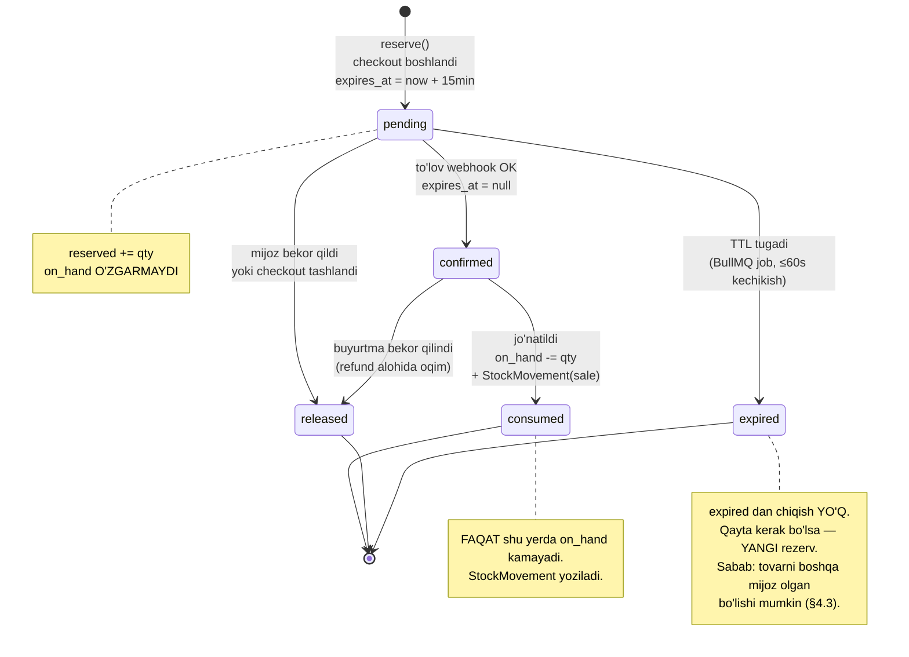
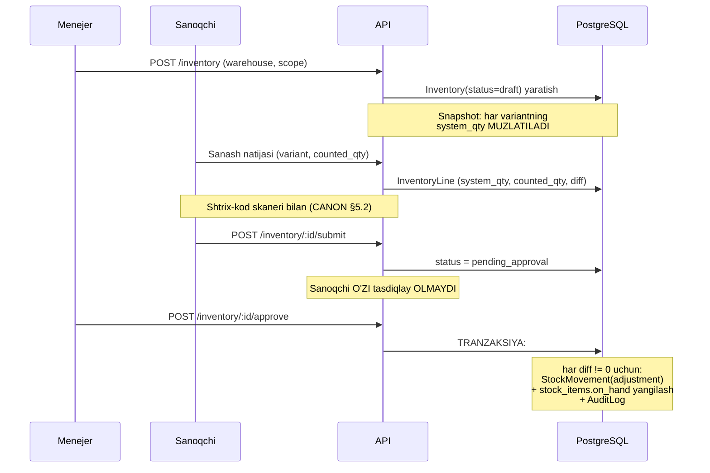
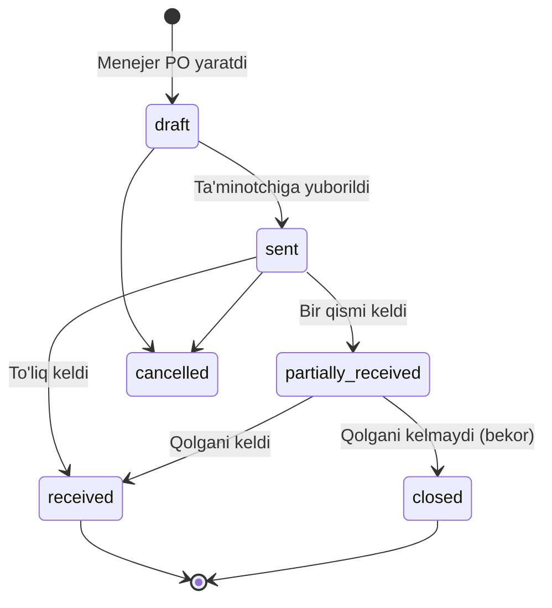

# 06 — Ombor va rezerv (`inventory`)

> **Modul:** `inventory` (CANON §7, #8)
> **Bog'liq modullar:** `order` (§5), `procurement` (§9), `delivery` (§7), `catalog` (§2)
> **Bog'liq hujjatlar:** `docs/07-order-and-checkout.md`, `docs/09-delivery-and-operations.md`
> **Status:** loyihalash (implementatsiya yo'q)

---

## 0. Nima uchun bu hujjat alohida va nega u eng nozik

CANON §9.2 da aytilgan: **oversell oldini olish — loyihaning eng nozik joyi.** Sabab
oddiy: qolgan barcha modullarda xato bo'lsa, foydalanuvchi noqulaylik ko'radi. Bu
yerda xato bo'lsa — **do'kon mijozga yo'q tovarni sotadi**. Bu pul qaytarish,
telefon qo'ng'iroq, obro' yo'qotish demakdir.

Yoritish do'koni uchun bu yanada og'riqli, chunki:

- Qandil — **bir dona** tovar. "Yana bittasini yasab beramiz" yo'q. Ta'minotchidan
  yangi partiya kelishi haftalar oladi.
- **Variant matritsasi** (CANON §4.1): 1 qandil × 4 rang × 3 o'lcham × 2 lampa soni
  = 24 SKU. Har SKU alohida qoldiqqa ega. "Qandil bor" degan gap ma'nosiz —
  "xrom, 60 sm, 8 lampali qandil bor" degan gap ma'noli.
- **Mo'rtlik** (CANON §4.5): tizim "1 dona bor" deydi, lekin ombordagi yagona
  quti sinib yotibdi. Fizik qoldiq va tizimdagi qoldiq ajralib ketadi.

Shuning uchun bu hujjat qoldiqni **ma'lumot** sifatida emas, **buxgalteriya
kitobi** sifatida ko'radi.

---

## 1. Ombor modeli

### 1.1 Nima uchun `quantity` ustunini o'zgartirish YOMON

Eng sodda yechim shunday ko'rinadi:

```sql
-- ❌ SHUNDAY QILMAYMIZ
UPDATE stock_item SET quantity = quantity - 1 WHERE variant_id = $1;
```

Bu ishlaydi. Bir necha oy ishlaydi. Keyin quyidagi savol paydo bo'ladi:

> "Bu qandilning qoldig'i 3 ta ko'rinyapti, lekin ombordа 1 ta. Qachon va nima
> uchun 2 tasi yo'qoldi?"

Va javob yo'q. Chunki `UPDATE` **tarixni o'chiradi**. Sizda faqat oxirgi holat bor.
Kim o'zgartirdi, qachon, qaysi buyurtma sababli, kim tasdiqladi — hech biri yo'q.

Bu — **double-entry bookkeeping** yechgan muammoning aynan o'zi. Buxgalteriyada
hisob qoldig'ini to'g'ridan-to'g'ri yozmaysiz; siz **provodka (entry)** yozasiz,
qoldiq esa provodkalar yig'indisidan **kelib chiqadi**. Sabab bir xil: qoldiq —
faktlarning natijasi, faktning o'zi emas.

Shuning uchun Kelvin'da qoldiq ikki qatlamda saqlanadi:

| Qatlam                 | Jadval           | Xususiyat                       | Vazifa                                                  |
| ---------------------- | ---------------- | ------------------------------- | ------------------------------------------------------- |
| **Fakt (ledger)**      | `stock_movement` | **Immutable**, append-only      | Haqiqat manbai. Hech qachon `UPDATE`/`DELETE` bo'lmaydi |
| **Proyeksiya (cache)** | `stock_item`     | Mutable, `on_hand` + `reserved` | Tez o'qish uchun. Ledger'dan qayta hisoblanishi mumkin  |

**Invariant (majburiy, test bilan tekshiriladi):**

```
stock_item.on_hand == SUM(stock_movement.delta)
                      WHERE variant_id = X AND warehouse_id = Y
```

Bu invariant buzilsa — tizimda bug bor. Uni **kechayu-kunduz job** tekshiradi
(§9.3) va nomuvofiqlik topilsa alert beradi. `stock_item` yo'qolsa yoki buzilsa,
uni ledger'dan to'liq tiklash mumkin. Buning teskarisi mumkin emas — shuning
uchun ledger birlamchi.

> **E'tibor:** `stock_item` — denormalizatsiya. U bo'lmasa ham tizim ishlaydi
> (har safar `SUM` qilib), lekin `SUM` millionlab qatorda sekin. `stock_item` —
> shu `SUM` ning materialized ko'rinishi. Uni **faqat** movement yozilgan
> tranzaksiya ichida yangilaymiz, boshqa joyda emas.

### 1.2 `Warehouse` — ko'p ombor

CANON §5.2 da "ko'p ombor" qamrovda. Kelvin uchun kamida uch tur kerak:

| Tur (`kind`) | Misol        | Sotuvga tayyormi | Izoh                                                             |
| ------------ | ------------ | ---------------- | ---------------------------------------------------------------- |
| `main`       | Asosiy ombor | Ha               | Buyurtmalarning asosiy manbai                                    |
| `showroom`   | Do'kon zali  | Shartli          | Ko'rgazma namunasi — sotilishi mumkin, lekin ehtiyotkorlik bilan |
| `transit`    | Tranzit      | Yo'q             | Ta'minotchidan yo'lda yoki ombordan omborga ko'chirilmoqda       |

Nima uchun `transit` alohida ombor, `stock_item.in_transit` ustuni emas? Chunki
ko'chirish — ikki qadamli operatsiya: `main` dan chiqdi (`-1`), `transit` ga kirdi
(`+1`), keyin `showroom` ga yetdi (`transit -1`, `showroom +1`). Har qadam alohida
movement. Agar `transit` ombor bo'lmasa, ikki qadam orasida tovar "yo'q" bo'lib
qoladi va invariant buziladi. Ombor sifatida modellashtirsak — tovar hech qachon
yo'qolmaydi, faqat joyini o'zgartiradi. Bu yana o'sha double-entry mantiqi:
har chiqim boshqa joyda kirim.

`showroom` bo'yicha alohida qaror kerak: ko'rgazmadagi qandil sotiladimi? Bu
biznes savoli — §11 ga ochiq savol sifatida kiritilgan.

```prisma
// apps/api/prisma/schema.prisma (parcha)

enum WarehouseKind {
  main
  showroom
  transit
}

model Warehouse {
  id        String        @id @default(uuid(7))
  code      String        @unique              // "MAIN-01", "SHOWROOM-CHILONZOR"
  name      String
  kind      WarehouseKind
  /// Sotuvga tayyor qoldiq shu ombordan hisoblanadimi.
  /// transit uchun har doim false.
  isSellable Boolean      @default(true)       @map("is_sellable")
  /// Fulfillment prioriteti: kichik raqam = avval shu ombordan olinadi.
  priority  Int           @default(100)
  /// Manzil — eng yaqin ombor strategiyasi uchun (§5).
  addressId String?       @map("address_id")

  createdAt DateTime      @default(now()) @map("created_at") @db.Timestamptz(3)
  updatedAt DateTime      @updatedAt      @map("updated_at") @db.Timestamptz(3)
  deletedAt DateTime?     @map("deleted_at") @db.Timestamptz(3)

  stockItems     StockItem[]
  stockMovements StockMovement[]

  @@map("warehouses")
}
```

### 1.3 `StockItem` — (variant × ombor) → qoldiq

```prisma
model StockItem {
  id          String @id @default(uuid(7))
  variantId   String @map("variant_id")
  warehouseId String @map("warehouse_id")

  /// Fizik qoldiq: ombordа nechta dona turibdi.
  /// SUM(stock_movement.delta) ga TENG bo'lishi SHART (invariant).
  onHand      Int    @default(0) @map("on_hand")

  /// Rezervlangan: on_hand ichidan nechtasi allaqachon band.
  /// SUM(stock_reservation.quantity WHERE status IN (pending, confirmed)) ga teng.
  reserved    Int    @default(0)

  /// Optimistic lock uchun (§2.3). Har o'zgarishda +1.
  version     Int    @default(0)

  /// Qayta buyurtma chegarasi — procurement moduli uchun signal (§7).
  reorderPoint Int   @default(0) @map("reorder_point")

  createdAt DateTime @default(now()) @map("created_at") @db.Timestamptz(3)
  updatedAt DateTime @updatedAt      @map("updated_at") @db.Timestamptz(3)

  variant   ProductVariant @relation(fields: [variantId], references: [id])
  warehouse Warehouse      @relation(fields: [warehouseId], references: [id])

  @@unique([variantId, warehouseId])
  @@index([warehouseId, variantId])
  @@map("stock_items")
}
```

**DB darajasidagi himoya** — bu Prisma'da ifodalanmaydi, migratsiyada qo'lda
yoziladi:

```sql
-- prisma/migrations/xxxx_stock_constraints/migration.sql

ALTER TABLE stock_items
  ADD CONSTRAINT stock_on_hand_non_negative   CHECK (on_hand  >= 0),
  ADD CONSTRAINT stock_reserved_non_negative  CHECK (reserved >= 0),
  -- Eng muhim qoida: rezerv fizik qoldiqdan oshmasin.
  ADD CONSTRAINT stock_reserved_lte_on_hand   CHECK (reserved <= on_hand);
```

Nega bu `CHECK` shunchalik muhim? Chunki u — **oxirgi himoya chizig'i**. Agar
kodda mantiqiy xato bo'lsa (§2 dagi barcha ehtiyot choralari ishlamasa ham),
PostgreSQL tranzaksiyani rad etadi. Xato yuzaga chiqadi (500 xatosi, alert), lekin
**ma'lumot buzilmaydi**. Buzilgan ma'lumot — tuzatib bo'lmaydigan xato; rad
etilgan so'rov — tuzatib bo'ladigan xato. Har doim ikkinchisini tanlaymiz.

> Bu "belt and suspenders" yondashuvi. Kod to'g'ri bo'lishi kerak, lekin kodga
> ishonmaymiz. `CHECK` — bepul (PostgreSQL uni `UPDATE` da baholaydi) va u
> hech qachon yolg'on gapirmaydi.

### 1.4 `available = on_hand - reserved` — uch raqamning ma'nosi

Bu formula soddaligi bilan aldaydi. Har bir hadning aniq ma'nosi:

| Had         | Ta'rif                                       | Kim o'zgartiradi         | Fizik ma'no                         |
| ----------- | -------------------------------------------- | ------------------------ | ----------------------------------- |
| `on_hand`   | Ombordа **jismonan turgan** dona soni        | Faqat `StockMovement`    | Qo'lingiz bilan ushlay olasiz       |
| `reserved`  | `on_hand` ichidan **va'da qilingan** soni    | `StockReservation`       | Ushlay olasiz, lekin u sizniki emas |
| `available` | Yangi mijozga **sotish mumkin** bo'lgan soni | Hisoblanadi, saqlanmaydi | Sotish mumkin                       |

Muhim nuqtalar:

1. **`reserved` — `on_hand` dan ayrilmaydi, u `on_hand` ichida.** Rezerv qilingan
   qandil hali ham ombordа. U jo'natilganda `on_hand` kamayadi. Bu chalkashlik
   manbai: ba'zi tizimlar rezervda `on_hand` ni ham kamaytiradi va keyin ikki
   marta ayirib yuboradi.

2. **`available` saqlanmaydi — u hisoblanadi.** Uni ustun qilib saqlash uchinchi
   sinxronlanadigan raqam yaratadi, ya'ni uchinchi buzilish nuqtasi. Generated
   column varianti ko'rib chiqildi:

   ```sql
   -- Ko'rib chiqildi, lekin QABUL QILINMADI:
   ALTER TABLE stock_items
     ADD COLUMN available INT GENERATED ALWAYS AS (on_hand - reserved) STORED;
   ```

   Rad etish sababi: `STORED` generated column'ni `WHERE` da ishlatish mumkin,
   lekin `RETURNING` bilan atomik `UPDATE` da (§2.4) baribir ifodani qo'lda
   yozamiz. Foydasi indeks (`WHERE available > 0`) — lekin bu holatda oddiy
   partial indeks yetarli. Qo'shimcha ustun = qo'shimcha invariant. Rad etamiz.

3. **`available` manfiy bo'lishi mumkin emas**, chunki `reserved <= on_hand`
   `CHECK` bilan kafolatlangan (§1.3).

**Storefront'da nima ko'rsatiladi?** `available` ni to'g'ridan-to'g'ri emas
(raqobatchi qoldiqni bilib oladi, mijoz "faqat 1 ta qoldi" ni ko'rib shoshiladi —
bu ba'zan foydali, ba'zan zararli). Taklif:

| `available` | Storefront'da                           | Sabab                             |
| ----------- | --------------------------------------- | --------------------------------- |
| `0`         | "Mavjud emas" + "Kelganda xabar bering" | Aniq bo'lishi kerak               |
| `1..3`      | "Kam qoldi"                             | Shoshilish signali, aniq raqamsiz |
| `> 3`       | "Mavjud"                                | Aniq raqam kerak emas             |

Aniq raqam ko'rsatish/ko'rsatmaslik — biznes qarori, §11 da ochiq savol.

### 1.5 `StockMovement` — immutable ledger

```prisma
enum MovementType {
  purchase_receipt   // Ta'minotchidan kirim (§7)
  sale               // Buyurtma jo'natildi (chiqim)
  return_in          // Mijoz qaytardi (kirim)
  transfer_out       // Boshqa omborga chiqdi
  transfer_in        // Boshqa ombordan keldi
  adjustment         // Inventarizatsiya tuzatishi (§6)
  write_off          // Hisobdan chiqarish: siniq, brak (§8)
  supplier_return    // Ta'minotchiga qaytarish (§8)
}

model StockMovement {
  id          String       @id @default(uuid(7))
  variantId   String       @map("variant_id")
  warehouseId String       @map("warehouse_id")

  type        MovementType

  /// Miqdor o'zgarishi. Kirim uchun musbat, chiqim uchun manfiy.
  /// HECH QACHON 0 bo'lmaydi (CHECK).
  delta       Int

  /// Movement'dan KEYINGI on_hand qiymati.
  /// Denormalizatsiya: audit va nosozlikni topish uchun.
  /// Ledger'ni ketma-ket o'qimasdan "o'sha paytda nechta edi" ni bilish.
  balanceAfter Int         @map("balance_after")

  /// Sabab havolasi: qaysi buyurtma / qabul / inventarizatsiya.
  /// Polimorf: refType + refId. FK yo'q, chunki turli jadvallarga ishora qiladi.
  refType     String?      @map("ref_type")   // "order", "purchase_order", "inventory"
  refId       String?      @map("ref_id")

  /// Kim bajardi. Avtomatik operatsiyalar uchun null (tizim).
  actorId     String?      @map("actor_id")

  /// Erkin izoh — ayniqsa adjustment va write_off uchun MAJBURIY (§6, §8).
  note        String?

  /// Tannarx — ABC tahlil va moliyaviy hisobot uchun.
  /// BigInt, TIYINDA (CANON §8). Float HECH QACHON.
  unitCost    BigInt?      @map("unit_cost")
  currency    String       @default("UZS")

  createdAt   DateTime     @default(now()) @map("created_at") @db.Timestamptz(3)
  // updatedAt YO'Q — bu jadval immutable.
  // deletedAt YO'Q — ledger'dan hech narsa o'chirilmaydi.

  variant   ProductVariant @relation(fields: [variantId], references: [id])
  warehouse Warehouse      @relation(fields: [warehouseId], references: [id])

  @@index([variantId, warehouseId, createdAt])
  @@index([refType, refId])
  @@index([createdAt])
  @@map("stock_movements")
}
```

**Immutability'ni DB darajasida majburlash.** Kod xato qilishi mumkin, ORM
xato qilishi mumkin, migratsiya xato qilishi mumkin. Trigger — qilmaydi:

```sql
CREATE OR REPLACE FUNCTION stock_movement_is_immutable()
RETURNS TRIGGER AS $$
BEGIN
  RAISE EXCEPTION 'stock_movements is append-only: % is forbidden', TG_OP
    USING HINT = 'Xatoni tuzatish uchun teskari movement (adjustment) yozing';
END;
$$ LANGUAGE plpgsql;

CREATE TRIGGER stock_movement_no_update
  BEFORE UPDATE ON stock_movements
  FOR EACH ROW EXECUTE FUNCTION stock_movement_is_immutable();

CREATE TRIGGER stock_movement_no_delete
  BEFORE DELETE ON stock_movements
  FOR EACH ROW EXECUTE FUNCTION stock_movement_is_immutable();

ALTER TABLE stock_movements
  ADD CONSTRAINT movement_delta_not_zero CHECK (delta <> 0);
```

**Xatoni qanday tuzatamiz?** Movement'ni o'chirmaymiz — **teskari movement**
yozamiz (`type = adjustment`, `delta` teskari ishorali, `note` da sabab). Bu
buxgalteriyadagi **storno** ning aynan o'zi. Natijada tarix "10 ta keldi, xato
edi, 10 ta chiqdi" bo'lib qoladi — bu **to'g'ri**, chunki xato ham fakt va u
sodir bo'lgan.

### 1.6 `StockReservation`

```prisma
enum ReservationStatus {
  pending    // Yaratildi, to'lov kutilmoqda
  confirmed  // To'lov o'tdi, jo'natish kutilmoqda
  consumed   // Jo'natildi → movement yozildi, rezerv yopildi
  released   // Bekor qilindi → tovar bo'shatildi
  expired    // TTL tugadi → avtomatik bo'shatildi
}

model StockReservation {
  id          String            @id @default(uuid(7))
  variantId   String            @map("variant_id")
  warehouseId String            @map("warehouse_id")

  /// Har doim musbat (CHECK quantity > 0).
  quantity    Int

  status      ReservationStatus @default(pending)

  /// Egasi: order yoki cart. Ikkalasi ham bo'lishi mumkin emas.
  orderId     String?           @map("order_id")
  cartId      String?           @map("cart_id")

  /// TTL (§4.2). pending uchun MAJBURIY, confirmed uchun null.
  expiresAt   DateTime?         @map("expires_at") @db.Timestamptz(3)

  /// Terminal holatga o'tgan vaqt — audit uchun.
  resolvedAt  DateTime?         @map("resolved_at") @db.Timestamptz(3)

  createdAt   DateTime          @default(now()) @map("created_at") @db.Timestamptz(3)
  updatedAt   DateTime          @updatedAt      @map("updated_at") @db.Timestamptz(3)

  @@index([variantId, warehouseId, status])
  // Muddati tugaganlarni topish uchun partial indeks (§4.2).
  @@index([expiresAt, status])
  @@index([orderId])
  @@map("stock_reservations")
}
```

```sql
ALTER TABLE stock_reservations
  ADD CONSTRAINT reservation_qty_positive CHECK (quantity > 0),
  -- Egasi aniq bitta bo'lishi shart.
  ADD CONSTRAINT reservation_single_owner CHECK (
    (order_id IS NOT NULL AND cart_id IS NULL) OR
    (order_id IS NULL AND cart_id IS NOT NULL)
  ),
  -- pending → expires_at majburiy. Boshqa holatda ma'nosiz.
  ADD CONSTRAINT reservation_pending_has_ttl CHECK (
    status <> 'pending' OR expires_at IS NOT NULL
  );

-- Muddati tugagan rezervlarni tozalash job'i uchun (§4.2) —
-- faqat pending qatorlarni indekslaymiz, indeks kichik qoladi.
CREATE INDEX stock_reservations_expiring_idx
  ON stock_reservations (expires_at)
  WHERE status = 'pending';
```

---

## 2. OVERSELL — asosiy muammo

### 2.1 Ssenariy

Ombordа **oxirgi bitta** "Kelvin Aurora 8L, xrom, 60 sm" qandili.
`on_hand = 1, reserved = 0, available = 1`.

Soat 20:14:07.100 da ikki mijoz bir vaqtda "Sotib olish" bosadi:

```
Vaqt      Mijoz A (so'rov #1)              Mijoz B (so'rov #2)
─────────────────────────────────────────────────────────────────────
t0        SELECT available → 1
t0+2ms                                     SELECT available → 1
t0+3ms    if (1 >= 1) → OK
t0+4ms                                     if (1 >= 1) → OK
t0+5ms    UPDATE reserved = 0 + 1 → 1
t0+6ms                                     UPDATE reserved = 0 + 1 → 1  ← YO'QOLDI
t0+7ms    INSERT reservation A
t0+8ms                                     INSERT reservation B
─────────────────────────────────────────────────────────────────────
NATIJA:   on_hand = 1, reserved = 1, LEKIN ikkita rezerv bor.
          Ikkala mijoz ham to'ladi. Bitta qandil. Bitta xafa mijoz.
```

Bu klassik **read-modify-write race** (TOCTOU: time-of-check to time-of-use).
Muammo o'qish va yozish o'rtasidagi bo'shliqda: `t0` da o'qilgan qiymat `t0+5ms`
da allaqachon eskirgan.

**Muhim:** bu holatni PostgreSQL'ning standart `READ COMMITTED` izolyatsiyasi
**o'z-o'zidan hal qilmaydi.** `READ COMMITTED` faqat commit qilinmagan
ma'lumotni o'qishdan himoya qiladi; u ikki tranzaksiyaning bir xil qatorni
o'qib, keyin ikkalasining ham yozishidan himoya qilmaydi.

> **Diqqat — bu 100 so'rovda emas, 2 so'rovda ham sodir bo'ladi.** "Bizda bunday
> yuk yo'q" — noto'g'ri javob. Aksiya boshlanganda, Telegram'ga post
> chiqqanda, yoki oddiy takroriy bosishda ham ikki so'rov 5 ms ichida keladi.

### 2.2 Variant A — Pessimistic lock (`SELECT ... FOR UPDATE`)

```sql
BEGIN;
  -- Qatorni qulflaydi. Ikkinchi tranzaksiya shu yerda KUTADI.
  SELECT on_hand, reserved FROM stock_items
   WHERE variant_id = $1 AND warehouse_id = $2
     FOR UPDATE;

  -- Endi xavfsiz: bu qatorni faqat biz o'zgartira olamiz.
  -- (ilova kodida tekshiruv: on_hand - reserved >= qty)

  UPDATE stock_items SET reserved = reserved + $3
   WHERE variant_id = $1 AND warehouse_id = $2;

  INSERT INTO stock_reservations (...) VALUES (...);
COMMIT;  -- qulf shu yerda bo'shaydi
```

**Ishlaydi.** Lekin narxi bor:

| Muammo               | Tafsilot                                                                                                                                                                                                                                                        |
| -------------------- | --------------------------------------------------------------------------------------------------------------------------------------------------------------------------------------------------------------------------------------------------------------- |
| **Qulf davomiyligi** | Qulf `COMMIT` gacha ushlab turiladi. Agar tranzaksiya ichida tashqi chaqiruv bo'lsa (Click API, Meilisearch), qulf shu chaqiruv davomida ushlanadi. Tashqi API 3 s javob bersa — qulf 3 s. Bu **falokat**. Qoida: **tranzaksiya ichida tashqi I/O QAT'IY MAN**. |
| **Throughput**       | Bitta ommabop variant → barcha so'rovlar navbatga tushadi. Ular parallel emas, **ketma-ket** bajariladi. Aksiya paytida (eng ko'p yuk bo'lgan paytda) tizim eng sekin ishlaydi.                                                                                 |
| **Deadlock**         | Ikki tranzaksiya ikki qatorni teskari tartibda qulflasa → deadlock (§2.6).                                                                                                                                                                                      |
| **Kutish zanjiri**   | `lock_timeout` qo'yilmasa, so'rov cheksiz kutadi. Connection pool tugaydi. Bu **butun API** ni o'ldiradi, faqat inventory'ni emas.                                                                                                                              |

Agar pessimistic lock tanlansa, `lock_timeout` **majburiy**:

```sql
SET LOCAL lock_timeout = '3s';  -- kutdik, olmadik → xato, kutishni davom ettirmaymiz
```

### 2.3 Variant B — Optimistic lock (version ustuni)

```sql
-- 1) Qulfsiz o'qiymiz
SELECT on_hand, reserved, version FROM stock_items WHERE variant_id = $1;
-- → on_hand=1, reserved=0, version=42

-- 2) Ilovada tekshiramiz: 1 - 0 >= 1 → OK

-- 3) Yozishda version'ni shart qilamiz
UPDATE stock_items
   SET reserved = reserved + 1, version = version + 1
 WHERE variant_id = $1 AND version = 42;   -- ← himoya shu yerda
-- affectedRows = 1 → muvaffaqiyat
-- affectedRows = 0 → kimdir bizdan oldin o'zgartirdi → RETRY
```

**Ustunligi:** qulf yo'q → hech kim kutmaydi → yozuvchilar bir-birini bloklamaydi.

**Kamchiligi:**

- **Retry loop kerak.** Retry — kod murakkabligi: necha marta? qancha kutib?
  exponential backoff? Retry limitiga yetsa nima? Bularning har biri qaror.
- **Yuqori raqobatda samarasiz.** 100 ta parallel so'rov → 1 tasi o'tadi,
  99 tasi retry → yana 1 tasi o'tadi... Bu **O(n²)** ish. Pessimistic lock'da
  esa navbat — O(n). Ya'ni raqobat yuqori bo'lganda optimistic lock pessimistic
  lock'dan **yomonroq**.
- **Version — butun qator uchun.** `reorder_point` o'zgarsa ham version o'sadi
  va rezerv so'rovi bekorga retry bo'ladi (false conflict).

**Xulosa:** optimistic lock — raqobat **kam** bo'lganda yaxshi. Qoldiq esa aynan
raqobat **ko'p** bo'lgan joyda muammo tug'diradi. Bu — noto'g'ri vosita.

### 2.4 Variant C — Atomik shartli UPDATE ✅ **KELVIN TANLOVI**

Kalit g'oya: **o'qish va yozishni ajratmaymiz.** Bitta `UPDATE` ichida ham
tekshiramiz, ham yozamiz. Bo'shliq yo'q → race yo'q.

```sql
UPDATE stock_items
   SET reserved   = reserved + $3,
       version    = version + 1,
       updated_at = now()
 WHERE variant_id   = $1
   AND warehouse_id = $2
   AND on_hand - reserved >= $3   -- ← shart UPDATE ichida
RETURNING on_hand, reserved, on_hand - reserved AS available;
```

**Nima uchun bu ishlaydi — aniq mexanizm:**

PostgreSQL `UPDATE` da qatorga **row-level exclusive lock** oladi. Ikki
tranzaksiya bir qatorni `UPDATE` qilsa, ikkinchisi birinchisining `COMMIT`/
`ROLLBACK` ini kutadi. Bu yergacha `FOR UPDATE` bilan bir xil. Farq keyingi
qadamda:

Birinchisi commit qilgach, ikkinchisi `READ COMMITTED` da **`WHERE` shartini
yangi qiymat bilan qayta baholaydi** (bu `EvalPlanQual` mexanizmi). Ya'ni:

```
Mijoz A: UPDATE ... WHERE 1 - 0 >= 1  → TRUE  → reserved = 1 → COMMIT
Mijoz B: (kutdi) → qayta baholaydi: WHERE 1 - 1 >= 1 → FALSE → 0 qator
```

Mijoz B `0 qator` oladi → `RETURNING` bo'sh → ilova "yetarli qoldiq yo'q" deb
javob beradi. **Oversell yo'q.** Retry loop **kerak emas** — natija birinchi
urinishda to'g'ri.

> ⚠️ **Muhim cheklov:** bu xatti-harakat `READ COMMITTED` ga xos. `REPEATABLE
READ` yoki `SERIALIZABLE` da PostgreSQL qayta baholamaydi — u
> `serialization_failure` (40001) xatosini beradi va **o'shanda retry kerak
> bo'ladi.** Kelvin standart `READ COMMITTED` da ishlaydi (Prisma'ning
> default'i, PostgreSQL'ning default'i), shuning uchun retry'siz yechim
> to'g'ri. Bu qaror **izolyatsiya darajasiga bog'liq** va agar kelajakda
> izolyatsiya o'zgartirilsa, bu kod qayta ko'rib chiqilishi SHART. Buni
> kodda komment sifatida yozamiz.

**Nima uchun bu ko'pincha eng to'g'ri yechim:**

1. **Bitta round-trip.** Optimistic'da 2 ta (SELECT + UPDATE), bu yerda 1 ta.
   Ya'ni ilova↔DB kechikishi ikki barobar kam.
2. **Retry yo'q** (READ COMMITTED da). Kod sodda. Sodda kod — kam bug.
3. **Qulf minimal.** Qulf `UPDATE` boshlanganda olinadi, `COMMIT` da bo'shaydi.
   Tranzaksiyani qisqa tutsak — qulf mikrosoniyalar.
4. **Tekshiruv DB'da, ilovada emas.** Bu eng muhimi: hech qanday API instansiyasi
   eskirgan ma'lumot asosida qaror qabul qila olmaydi. Ilova nusxalari soni
   (1 ta yoki 20 ta pod) natijaga ta'sir qilmaydi.

**Nima uchun `FOR UPDATE` emas?** Chunki `FOR UPDATE` + `SELECT` + ilovada
tekshiruv + `UPDATE` = atomik `UPDATE` bilan **bir xil natija**, lekin ikki
round-trip va qulfni uzoqroq ushlab. Atomik `UPDATE` — shunchaki o'sha
mantiqning siqilgan ko'rinishi. Kod kamroq, xato kamroq.

### 2.5 Variant D — Redis bilan (rad etildi)

```
DECR stock:{variantId}   → atomik, ~0.1 ms, juda tez
```

Yoki Lua script bilan shartli dekrement. **Tez** — bu haqiqat.

**Nima uchun rad etamiz:**

| Muammo                | Tafsilot                                                                                                                                                                                                   |
| --------------------- | ---------------------------------------------------------------------------------------------------------------------------------------------------------------------------------------------------------- |
| **Ikki manba**        | Redis'da `5`, PostgreSQL'da `3`. Qaysi biri haqiqat? Ikkisi ham "ha" deydi. Bu — **split-brain**.                                                                                                          |
| **Atomik emas**       | `DECR` (Redis) + `INSERT` (PostgreSQL) bitta tranzaksiyada emas. Redis o'tdi, PostgreSQL yiqildi → Redis'da tovar "sotilgan", DB'da yo'q. Kim tuzatadi? Ikki fazali commit → kerak emas darajada murakkab. |
| **Redis persistence** | RDB snapshot orasida qulash → oxirgi soniyalardagi `DECR` lar yo'qoladi → oversell. AOF `fsync=always` bilan sekinlashadi va PostgreSQL tezligiga yaqinlashadi — ustunlik yo'qoladi.                       |
| **Ledger yo'q**       | §1.1 dagi butun mantiq (audit, invariant, tiklash) yo'qoladi.                                                                                                                                              |

**Redis qayerda ishlatiladi (CANON §6 ga muvofiq):**

- **Read-side cache:** katalogda "mavjud / kam qoldi / yo'q" belgisi. Bu yerda
  15 soniya eskirgan ma'lumot **maqbul** — mijoz baribir checkout'da haqiqiy
  tekshiruvdan o'tadi.
- **Rate limiting:** bitta IP dan sekundiga N ta rezerv urinishi.
- **BullMQ:** TTL tozalash job'i uchun navbat (§4.2).
- **Idempotency key** cache (`docs/07`, §4).

Ya'ni Redis — **yordamchi**, haqiqat manbai emas. CANON §6 da Redis roli aynan
"cache, sessiya, rezerv lock, BullMQ" deb yozilgan; bu yerda "rezerv lock"
degani rezerv qarorini Redis qabul qiladi degani **emas** — u distributed lock
kerak bo'lgan yordamchi holatlar uchun (masalan, bitta job ikki marta
ishlamasligi uchun).

### 2.6 Deadlock — ko'p mahsulotli savat

Bitta variant uchun deadlock yo'q. Muammo **savatda bir necha mahsulot** bo'lganda:

```
Savat A: [Aurora qandil, Trek spot]
Savat B: [Trek spot, Aurora qandil]   ← teskari tartib

t0    A: UPDATE stock_items WHERE variant = Aurora   → Aurora qulflandi
t0+1  B: UPDATE stock_items WHERE variant = Spot     → Spot qulflandi
t0+2  A: UPDATE stock_items WHERE variant = Spot     → KUTADI (B ushlab turibdi)
t0+3  B: UPDATE stock_items WHERE variant = Aurora   → KUTADI (A ushlab turibdi)
      ↓
      DEADLOCK. PostgreSQL deadlock_timeout (default 1s) dan keyin
      birini o'ldiradi: ERROR 40P01 "deadlock detected"
```

**Yechim: deterministik qulflash tartibi.** Barcha tranzaksiyalar qatorlarni
**bir xil tartibda** qulflasa, tsikl hosil bo'lishi matematik jihatdan mumkin
emas (bu — resurslarga to'liq tartib joriy qilish, klassik deadlock oldini olish
sharti).

Tartib sifatida `variant_id` ni tanlaymiz — u UUID v7, ya'ni **barqaror va
global tartiblanadigan**:

```typescript
// HAR DOIM shu tartibda. Istisno yo'q.
const ordered = [...items].sort((a, b) => a.variantId.localeCompare(b.variantId));
for (const item of ordered) {
  await reserveOne(tx, item);
}
```

Endi yuqoridagi ssenariy:

```
Ikkala tranzaksiya ham Aurora'ni birinchi qulflaydi (uning UUID'i kichikroq).
A: Aurora qulfladi → Spot qulfladi → COMMIT
B: Aurora'ni kutdi → A commit qildi → Aurora oldi → Spot oldi → COMMIT
      ↓
Deadlock YO'Q. B kutdi (bu normal), lekin o'ldirilmadi.
```

**Bu qoida qanday majburlanadi?** Faqat komment bilan emas — komment eskiradi.
Ikki mexanizm:

1. `ReservationService.reserve()` **ichida** saralanadi. Chaqiruvchi bu haqda
   o'ylamaydi. Ya'ni tartibni buzish uchun kimdir servisni chetlab o'tishi kerak.
2. Servisni chetlab o'tishga qarshi — kod review + `stock_items` ga
   to'g'ridan-to'g'ri `UPDATE` yozadigan kodni CI'da grep bilan taqiqlash
   (arxitektura testi).

> **Nima uchun `ORDER BY` ni SQL'ga qo'ymaymiz?** `UPDATE ... WHERE id IN (...)`
> da PostgreSQL qulflash tartibini **kafolatlamaydi** — u plan tanlashiga
> bog'liq. Shuning uchun tartib **ilovada** majburlanadi: har variant uchun
> alohida `UPDATE`, saralangan tartibda. Bu bir necha round-trip degani
> (savatda 5 mahsulot → 5 ta `UPDATE`), lekin bu narx deadlock'siz ishlash
> uchun to'lanadi. Savatda odatda 1-5 element bo'ladi.

### 2.7 Qaror jadvali

| Mezon               | Pessimistic | Optimistic        | **Atomik UPDATE** | Redis           |
| ------------------- | ----------- | ----------------- | ----------------- | --------------- |
| Oversell'dan himoya | ✅          | ✅                | ✅                | ⚠️ (sinxronlik) |
| Retry kerakmi       | Yo'q        | **Ha**            | Yo'q¹             | Yo'q            |
| Round-trip soni     | 2+          | 2+ (×retry)       | **1**             | 1               |
| Qulf davomiyligi    | Uzun        | Yo'q              | **Qisqa**         | Yo'q            |
| Yuqori raqobatda    | Navbat      | **Yomon (O(n²))** | Navbat            | Tez             |
| Haqiqat manbai      | PG          | PG                | **PG**            | ⚠️ Redis        |
| Audit/ledger        | ✅          | ✅                | ✅                | ❌              |
| Kod murakkabligi    | O'rta       | **Yuqori**        | **Past**          | Yuqori          |

¹ `READ COMMITTED` da. Boshqa izolyatsiyada retry kerak (§2.4 dagi ogohlantirish).

**Kelvin qarori: atomik shartli `UPDATE` + deterministik tartib + DB `CHECK`.**

Sabab: eng oz harakatlanuvchi qismga ega, haqiqat manbai bitta, tekshiruv
DB'da, kod sodda. Redis — faqat cache. Pessimistic lock — faqat inventarizatsiya
kabi maxsus holatlarda (§6), chunki u yerda raqobat yo'q va butun ombor
kesimini muzlatish kerak.

---

## 3. Rezerv qilish — real kod

### 3.1 Atomik rezerv (Prisma + raw SQL)

Prisma'ning `update()` metodi `WHERE` da hisoblangan shartni (`on_hand - reserved

> = qty`) qo'llab-quvvatlamaydi. Shuning uchun **`$queryRaw`** ishlatamiz. Bu —
> ataylab qilingan tanlov: bu yerda ORM abstraksiyasi to'g'rilikni buzadi.

```typescript
// apps/api/src/inventory/reservation.service.ts

import { Injectable, Logger } from '@nestjs/common';
import { Prisma, PrismaClient } from '@prisma/client';

type Tx = Prisma.TransactionClient;

export interface ReserveLine {
  readonly variantId: string;
  readonly warehouseId: string;
  readonly quantity: number; // > 0
}

export interface ReserveRequest {
  readonly lines: readonly ReserveLine[];
  readonly owner:
    | { readonly kind: 'order'; readonly orderId: string }
    | { readonly kind: 'cart'; readonly cartId: string };
  readonly ttlSeconds: number;
  readonly idempotencyKey: string;
}

export type ReserveResult =
  | { readonly ok: true; readonly reservationIds: readonly string[] }
  | {
      readonly ok: false;
      readonly reason: 'insufficient_stock';
      /// Qaysi variant yetmadi va nechta bor — mijozga aniq xabar uchun.
      readonly shortages: readonly {
        readonly variantId: string;
        readonly requested: number;
        readonly available: number;
      }[];
    };

@Injectable()
export class ReservationService {
  private readonly log = new Logger(ReservationService.name);

  constructor(private readonly prisma: PrismaClient) {}

  /**
   * Barcha qatorlarni rezerv qiladi yoki hech birini (all-or-nothing).
   *
   * Qulflash tartibi variantId bo'yicha saralangan — deadlock oldini olish (§2.6).
   * Bu SHART, o'zgartirmang.
   *
   * ⚠️ READ COMMITTED izolyatsiyasiga bog'liq: UPDATE ... WHERE shartini
   * PostgreSQL blokdan keyin qayta baholaydi (EvalPlanQual). REPEATABLE READ
   * yoki SERIALIZABLE ga o'tilsa — 40001 retry kerak bo'ladi (§2.4).
   */
  async reserve(req: ReserveRequest): Promise<ReserveResult> {
    // Idempotentlik: bir xil key bilan takroriy chaqiruv yangi rezerv yaratmaydi.
    const existing = await this.findByIdempotencyKey(req.idempotencyKey);
    if (existing) return { ok: true, reservationIds: existing };

    const ordered = [...req.lines].sort((a, b) =>
      a.variantId < b.variantId ? -1 : a.variantId > b.variantId ? 1 : 0,
    );

    try {
      return await this.prisma.$transaction(
        async (tx) => {
          const ids: string[] = [];
          const shortages: {
            variantId: string;
            requested: number;
            available: number;
          }[] = [];

          for (const line of ordered) {
            const rows = await tx.$queryRaw<{ on_hand: number; reserved: number }[]>`
              UPDATE stock_items
                 SET reserved   = reserved + ${line.quantity},
                     version    = version + 1,
                     updated_at = now()
               WHERE variant_id   = ${line.variantId}::uuid
                 AND warehouse_id = ${line.warehouseId}::uuid
                 AND on_hand - reserved >= ${line.quantity}
              RETURNING on_hand, reserved
            `;

            if (rows.length === 0) {
              // Qoldiq yetmadi. Sababni aniqlash uchun joriy holatni o'qiymiz.
              // Bu qator FOR SHARE emas — faqat xabar uchun, aniqligi kritik emas.
              const snap = await tx.stockItem.findUnique({
                where: {
                  variantId_warehouseId: {
                    variantId: line.variantId,
                    warehouseId: line.warehouseId,
                  },
                },
                select: { onHand: true, reserved: true },
              });
              shortages.push({
                variantId: line.variantId,
                requested: line.quantity,
                available: snap ? snap.onHand - snap.reserved : 0,
              });
              continue;
            }

            const reservation = await tx.stockReservation.create({
              data: {
                variantId: line.variantId,
                warehouseId: line.warehouseId,
                quantity: line.quantity,
                status: 'pending',
                expiresAt: new Date(Date.now() + req.ttlSeconds * 1000),
                orderId: req.owner.kind === 'order' ? req.owner.orderId : null,
                cartId: req.owner.kind === 'cart' ? req.owner.cartId : null,
              },
              select: { id: true },
            });
            ids.push(reservation.id);
          }

          if (shortages.length > 0) {
            // All-or-nothing: bironta yetmasa, hammasini qaytaramiz.
            // ROLLBACK muvaffaqiyatli UPDATE larni ham bekor qiladi —
            // qo'lda kompensatsiya kerak emas.
            throw new InsufficientStockError(shortages);
          }

          await this.saveIdempotencyKey(tx, req.idempotencyKey, ids);
          return { ok: true as const, reservationIds: ids };
        },
        {
          // Tranzaksiya QISQA bo'lishi shart — ichida tashqi I/O YO'Q.
          timeout: 5_000,
          maxWait: 2_000,
          isolationLevel: Prisma.TransactionIsolationLevel.ReadCommitted,
        },
      );
    } catch (e) {
      if (e instanceof InsufficientStockError) {
        return { ok: false, reason: 'insufficient_stock', shortages: e.shortages };
      }
      throw e;
    }
  }
}

export class InsufficientStockError extends Error {
  constructor(
    readonly shortages: readonly {
      variantId: string;
      requested: number;
      available: number;
    }[],
  ) {
    super('insufficient_stock');
    this.name = 'InsufficientStockError';
  }
}
```

**Diqqat qiling:** `INSERT reservation` va `UPDATE stock_items` **bir
tranzaksiyada**. Agar `INSERT` yiqilsa, `UPDATE` ham rollback bo'ladi. Ya'ni
"reserved oshdi, lekin rezerv yozuvi yo'q" holati **mumkin emas**. Bu — atomiklik
kafolati va §9.2 dagi invariantning asosi.

### 3.2 Rezervni yopish: `consume` va `release`

```typescript
/**
 * Rezervni tovarga aylantirish — jo'natish paytida.
 * Bu yerda VA FAQAT BU YERDA on_hand kamayadi.
 */
async consume(tx: Tx, reservationId: string, actorId: string): Promise<void> {
  // Faqat confirmed → consumed. pending dan to'g'ridan-to'g'ri consume MUMKIN EMAS
  // (to'lanmagan buyurtma jo'natilmaydi).
  const updated = await tx.$executeRaw`
    UPDATE stock_reservations
       SET status = 'consumed', resolved_at = now(), updated_at = now()
     WHERE id = ${reservationId}::uuid AND status = 'confirmed'
  `;
  if (updated === 0) {
    // Idempotentlik: allaqachon consumed bo'lsa — bu xato emas.
    const current = await tx.stockReservation.findUnique({
      where: { id: reservationId },
      select: { status: true },
    });
    if (current?.status === 'consumed') return;
    throw new IllegalReservationTransitionError(reservationId, current?.status);
  }

  const r = await tx.stockReservation.findUniqueOrThrow({
    where: { id: reservationId },
  });

  // on_hand VA reserved birga kamayadi:
  // tovar ombordan chiqdi va endi rezervda emas.
  const rows = await tx.$queryRaw<{ on_hand: number }[]>`
    UPDATE stock_items
       SET on_hand    = on_hand  - ${r.quantity},
           reserved   = reserved - ${r.quantity},
           version    = version + 1,
           updated_at = now()
     WHERE variant_id = ${r.variantId}::uuid
       AND warehouse_id = ${r.warehouseId}::uuid
    RETURNING on_hand
  `;

  // Ledger yozuvi — MAJBURIY, aks holda invariant buziladi (§9.2).
  await tx.stockMovement.create({
    data: {
      variantId: r.variantId,
      warehouseId: r.warehouseId,
      type: 'sale',
      delta: -r.quantity,
      balanceAfter: rows[0].on_hand,
      refType: 'order',
      refId: r.orderId,
      actorId,
    },
  });
}

/**
 * Rezervni bo'shatish — bekor qilish yoki TTL tugashi.
 * on_hand O'ZGARMAYDI (tovar ombordan chiqmagan), faqat reserved kamayadi.
 * Shuning uchun StockMovement ham YOZILMAYDI — fizik harakat bo'lmadi.
 */
async release(
  tx: Tx,
  reservationId: string,
  reason: 'released' | 'expired',
): Promise<void> {
  // Shartli UPDATE: faqat aktiv holatdan bo'shatiladi.
  // Bu idempotentlikni ta'minlaydi — ikki marta chaqirilsa, ikkinchisi 0 qator.
  const rows = await tx.$queryRaw<{ variant_id: string; warehouse_id: string; quantity: number }[]>`
    UPDATE stock_reservations
       SET status = ${reason}::"ReservationStatus",
           resolved_at = now(),
           updated_at = now()
     WHERE id = ${reservationId}::uuid
       AND status IN ('pending', 'confirmed')
    RETURNING variant_id, warehouse_id, quantity
  `;

  if (rows.length === 0) return; // Allaqachon yopilgan — idempotent, xato emas.

  const r = rows[0];
  await tx.$executeRaw`
    UPDATE stock_items
       SET reserved = reserved - ${r.quantity},
           version = version + 1,
           updated_at = now()
     WHERE variant_id = ${r.variant_id}::uuid
       AND warehouse_id = ${r.warehouse_id}::uuid
  `;
}
```

> **Nega `release` da movement yozilmaydi, `consume` da yoziladi?** Chunki
> `StockMovement` — **fizik** harakat jurnali. Rezerv bo'shashi fizik harakat
> emas: qandil qanday turgan bo'lsa, shunday turibdi. `consume` da esa qandil
> qutiga solinib jo'natildi — bu fizik harakat. Bu farq muhim: agar rezerv
> bo'shashini ham movement qilsak, ledger "harakat" bilan to'lib ketadi va
> `SUM(delta) == on_hand` invarianti ma'nosini yo'qotadi.

---

## 4. Rezerv hayot sikli

### 4.1 Qachon rezerv qilinadi: savatda yoki checkout'da?

Bu — **biznes savoli**, texnik emas. Ikki qutb:

|                 | **Savatga qo'shilganda**                                       | **Checkout boshlanganda**      |
| --------------- | -------------------------------------------------------------- | ------------------------------ |
| Mijoz tajribasi | Savatdagi tovar kafolatlangan                                  | Oxirgi lahzada "tugadi" xatosi |
| Konversiya      | Yuqoriroq (ishonch)                                            | Pastroq (kutilmagan xato)      |
| Tovar aylanmasi | **Yomon** — tashlab ketilgan savatlar tovarni bloklaydi        | Yaxshi                         |
| Zaifligi        | **Hujum:** bot barcha tovarni savatga soladi → do'kon "tugadi" | Kam                            |
| TTL boshqaruvi  | Uzoq (savat kunlar yashaydi) → murakkab                        | Qisqa (15 daq) → sodda         |

Savatga qo'shishda rezerv qilishning zaifligi jiddiy: savat odatda uzoq yashaydi
(mijoz haftalarga tashlab ketadi), tashlab ketish darajasi e-commerce'da yuqori,
va autentifikatsiyasiz mehmon savati (CANON §7, `cart` moduli) botga ochiq. Ya'ni
raqobatchi yoki oddiy skript butun katalogni "tugatib" qo'yishi mumkin.

**Kelvin qarori: rezerv checkout boshlanganda.** Savat — **niyat**, majburiyat
emas.

"Oxirgi lahzada xato" muammosini rezerv bilan emas, **UX bilan** yumshatamiz:

- Savatda `available` **ma'lumot uchun** ko'rsatiladi ("kam qoldi") — kafolatsiz.
  Bu Redis cache'dan o'qiladi (§2.5), ~15 s eskirgan bo'lishi mumkin.
- Checkout'ning **birinchi** qadamida rezerv qilinadi, oxirgisida emas. Ya'ni
  mijoz manzil va to'lovni kiritishdan **oldin** tovar band bo'ladi. Xato bo'lsa,
  u erta yuzaga chiqadi — bu eng qimmat bo'lmagan nuqta.
- Rezerv muvaffaqiyatsiz bo'lsa — aniq xabar: "Aurora qandil (xrom, 60 sm) —
  1 ta so'radingiz, 0 ta qoldi." Umumiy "xato yuz berdi" emas. `shortages`
  massivi aynan shuning uchun qaytariladi (§3.1).

**Istisno — aksiya paytida.** Katta aksiyada (Black Friday) savat rezervi
mantiqli bo'lishi mumkin. Bu — kelajakdagi feature flag (CANON §7, `admin`
moduli). Hozir qamrovda emas.

### 4.2 TTL — rezerv qancha yashaydi

| Holat                                             | TTL                                | Sabab                                              |
| ------------------------------------------------- | ---------------------------------- | -------------------------------------------------- |
| `pending` (checkout boshlandi, to'lov kutilmoqda) | **15 daqiqa**                      | Click/Payme sahifasida to'lash uchun yetarli vaqt  |
| `pending` → rassrochka arizasi                    | **Uzunroq**                        | Ariza ko'rib chiqiladi. Aniq muddat noma'lum — §11 |
| `confirmed` (to'lov o'tdi)                        | **TTL yo'q** (`expires_at = null`) | To'langan tovar muddat bilan bo'shatilmaydi        |

> ⚠️ **15 daqiqa — taxmin, o'lchov emas.** U Click/Payme sessiyasining amaldagi
> muddatidan **kelib chiqishi** kerak. Rezerv TTL'i to'lov sessiyasi muddatidan
> **qisqa bo'lmasligi** shart, aks holda mijoz to'layotgan paytda rezerv
> bo'shab, boshqa mijoz uni olib ketadi va §5 dagi eng yomon holat yuzaga
> keladi (`docs/07`, §3.3). Provayder hujjati tekshirilishi kerak — §11.

**Bo'shatish mexanizmi — ikki yondashuv:**

**A) `expires_at` + lazy tekshiruv.** Rezerv o'z-o'zidan bo'shamaydi; `available`
hisoblanganda muddati tugaganlarini hisobga olmaymiz:

```sql
SELECT si.on_hand - COALESCE(SUM(r.quantity), 0) AS available
  FROM stock_items si
  LEFT JOIN stock_reservations r
    ON r.variant_id = si.variant_id
   AND r.warehouse_id = si.warehouse_id
   AND r.status IN ('pending', 'confirmed')
   AND (r.expires_at IS NULL OR r.expires_at > now())   -- ← lazy filtr
 WHERE si.variant_id = $1
 GROUP BY si.on_hand;
```

- ✅ Job kerak emas. Yiqilgan job → oqibat yo'q.
- ✅ Zudlik bilan to'g'ri: muddati tugagan rezerv **darhol** hisobdan chiqadi.
- ❌ `stock_items.reserved` **yolg'on gapiradi** — u muddati tugaganlarni ham
  sanaydi. Ya'ni §1.3 dagi denormalizatsiya buziladi.
- ❌ Har o'qishda `JOIN` + `SUM` — bu `stock_items` ning butun ma'nosini yo'qotadi.
- ❌ Atomik `UPDATE` (§2.4) `reserved` ustuniga tayanadi. Lazy filtr bilan u
  ishlamaydi — shartni `JOIN` ga aylantirish kerak, bu esa atomiklikni buzadi.

**B) BullMQ job.** Har daqiqada muddati tugaganlarni topib, `release` chaqiradi:

```typescript
// apps/api/src/inventory/jobs/expire-reservations.processor.ts
@Processor('inventory')
export class ExpireReservationsProcessor {
  @Process({ name: 'expire-reservations', concurrency: 1 }) // concurrency 1 — MUHIM
  async handle(): Promise<{ released: number }> {
    // Batch — bitta ulkan tranzaksiya emas, uzoq qulf bo'lmasligi uchun.
    const expired = await this.prisma.stockReservation.findMany({
      where: { status: 'pending', expiresAt: { lt: new Date() } },
      select: { id: true },
      take: 200,
    });

    let released = 0;
    for (const { id } of expired) {
      // Har biri alohida tranzaksiya: biri yiqilsa, qolganlari bajariladi.
      await this.prisma.$transaction((tx) => this.reservations.release(tx, id, 'expired'));
      released++;
    }
    return { released };
  }
}
```

- ✅ `stock_items.reserved` **haqiqatni aytadi** → atomik `UPDATE` ishlaydi.
- ✅ O'qish tez — `JOIN` yo'q.
- ❌ Job yiqilsa yoki kechiksa — tovar keraksiz bloklangan holda qoladi.
- ❌ Bo'shatish **darhol emas**, ≤1 daqiqa kechikish bilan.

**Kelvin qarori: B (BullMQ job), har 60 soniyada.**

Sabab: (A) atomik `UPDATE` bilan mos kelmaydi. Bizning butun oversell himoyamiz
(§2.4) `reserved` ustunining to'g'riligiga tayanadi. Agar `reserved` yolg'on
gapirsa — himoya yo'q. Ya'ni bu tanlov emas, **majburiyat**.

(B) ning kamchiligi (≤60 s kechikish) qabul qilinadi: rezerv 15 daqiqaga
qo'yilgan, ya'ni 15:00 o'rniga 15:01 da bo'shashi — biznes uchun ahamiyatsiz.

**Job yiqilishiga qarshi himoya:**

- Job ishlagan vaqti metrika (`inventory_expire_job_last_success_timestamp`).
  5 daqiqadan ortiq ishlamasa → alert (Prometheus, CANON §6).
- `concurrency: 1` + BullMQ `jobId` — ikki instansiya bir vaqtda ishlamasin.
  `release` idempotent bo'lgani uchun (§3.2) ikki marta ishlashi ham xavfsiz,
  lekin keraksiz yuk.
- Reconciliation job (§9.3) `reserved` ni haqiqiy rezervlar bilan solishtiradi
  — bu ikkinchi himoya chizig'i.

### 4.3 To'lov kutilayotganda

Bu — eng nozik nuqta va u `docs/07-order-and-checkout.md` (§3, saga) bilan
chambarchas bog'liq.

```
Mijoz → checkout → rezerv (pending, TTL 15 daq) → Click sahifasi
                                                     ↓
                                    ┌────────────────┼────────────────┐
                                    ↓                ↓                ↓
                              To'ladi (5 daq)   Bekor qildi    Yo'q bo'ldi
                                    ↓                ↓                ↓
                            confirmed          released        expired (15 daq)
                            expires_at=null
```

**Kritik qoida:** to'lov webhook'i kelganda rezerv `pending` → `confirmed` ga
o'tadi **va** `expires_at = null` bo'ladi. Aks holda: mijoz to'ladi, keyin TTL
tugaydi, tovar bo'shaydi — **to'langan buyurtma tovarsiz qoladi**.

**Eng yomon holat:** webhook 16-daqiqada keladi (Click sekinlashdi), rezerv
allaqachon `expired`. Bu holat **mumkin** va u `docs/07` §3.2 da saga
kompensatsiyasi sifatida ko'rib chiqiladi. Qisqacha: qayta rezerv qilishga
urinamiz; muvaffaqiyatsiz bo'lsa → buyurtma `manual_review` ga o'tadi va
operator qo'ng'iroq qiladi. **Avtomatik refund qilmaymiz** — ehtimol boshqa
ombordan topiladi yoki mijoz kutishga rozi bo'ladi. Bu qaror `docs/07` da
asoslanadi.

### 4.4 Holat mashinasi



**Terminal holatlar:** `consumed`, `released`, `expired`. Ulardan chiqish yo'q.
`expired` → `confirmed` o'tishi **ataylab yo'q**: muddati tugagan rezervni
"tiriltirish" xavfli, chunki oraliqda tovar boshqa mijozga berilgan bo'lishi
mumkin. To'g'ri yo'l — yangi rezerv qilishga urinish (u §2.4 dagi tekshiruvdan
o'tadi).

---

## 5. Ko'p ombor — qaysi ombordan olinadi

`available` bir necha omborga tarqalgan bo'lishi mumkin:

```
Aurora qandil (xrom, 60 sm):
  main (Sergeli)        → available = 2
  showroom (Chilonzor)  → available = 1
  transit               → available = 0  (isSellable = false, hisobga olinmaydi)
```

Mijoz 2 ta so'radi. Qayerdan olamiz?

### 5.1 Strategiyalar

| Strategiya   | Mantiq                        | Ustunlik                       | Kamchilik                    |
| ------------ | ----------------------------- | ------------------------------ | ---------------------------- |
| `nearest`    | Mijozga eng yaqin ombor       | Tez yetkazish, arzon logistika | Ombor bo'linib ketadi        |
| `most_stock` | Eng ko'p qoldiqli ombor       | Split kam                      | Uzoq bo'lishi mumkin         |
| `priority`   | `Warehouse.priority` bo'yicha | Sodda, bashoratli              | Optimal emas                 |
| `split`      | Bir necha ombordan bo'lib     | Har doim bajariladi            | **2 ta yetkazish = 2× narx** |

### 5.2 Kelvin qarori: `priority` → keyin `split` (faqat ruxsat bilan)

```typescript
export interface AllocationPlan {
  readonly lines: readonly {
    readonly variantId: string;
    readonly warehouseId: string;
    readonly quantity: number;
  }[];
  /// Nechta alohida jo'natma bo'ladi (delivery moduli uchun).
  readonly shipmentCount: number;
}

export interface AllocationStrategy {
  allocate(
    request: readonly { variantId: string; quantity: number }[],
    ctx: { customerAddressId: string | null; allowSplit: boolean },
  ): Promise<AllocationPlan | { insufficient: string[] }>;
}
```

Algoritm (birinchi versiya — ataylab sodda):

1. `isSellable = true` bo'lgan omborlarni `priority` bo'yicha saralaymiz.
2. Har variant uchun: **bitta** ombordan to'liq olishga urinamiz (`priority`
   tartibida birinchi mos kelgani).
3. Bitta ombordan to'liq olib bo'lmasa **va** `allowSplit = true` bo'lsa —
   bo'lamiz.
4. `allowSplit = false` bo'lsa va bitta ombordan olinmasa → `insufficient`.

**Nima uchun `nearest` emas?** Chunki `nearest` uchun masofa hisobi kerak, u
esa geokodlash va marshrut hisobi degani. CANON §9.8 da aytilgan: marshrut
optimizatsiyasi (VRP) — NP-qiyin, boshida qo'lda. Bu yerda ham xuddi shunday
mantiq: `priority` — qo'lda sozlanadigan raqam va u 2-3 ta ombor uchun
**yetarli**. Toshkentda ikki ombor orasidagi farq mijoz uchun sezilarli emas.
Ombor soni oshsa yoki viloyatlarga chiqsa — qayta ko'rib chiqiladi.

**Split shipment — biznes qarori, texnik emas.** Ikki jo'natma = ikki karra
yetkazish xarajati. Kim to'laydi? Mijoz "ertaga 1 ta, payshanba 1 ta" ga rozimi?
Shisha qandil ikki marta yo'lda — sinish xavfi ikki karra. **Default:
`allowSplit = false`**; checkout'da mijozdan aniq so'raladi. §11 da ochiq savol.

---

## 6. Inventarizatsiya (`Inventory`)

Fizik qoldiq tizimdagi qoldiqdan **har doim** farq qiladi. Sabablar: o'g'irlik,
sinish (hisobga olinmagan), qabulda xato sanash, yorliq almashuvi. Bu — normal;
buni inkor qilish emas, **o'lchash** kerak.

### 6.1 Oqim



### 6.2 Muzlatish muammosi

Sanash bir necha soat davom etadi. Sanash paytida sotuv davom etadimi?

| Yondashuv             | Tafsilot                                                                                                                                                                           |
| --------------------- | ---------------------------------------------------------------------------------------------------------------------------------------------------------------------------------- |
| **To'liq to'xtatish** | Ombor "muzlatiladi", sotuv to'xtaydi. Aniq, lekin do'kon yopiladi.                                                                                                                 |
| **Davom etadi**       | `system_qty` snapshot vaqtida olinadi; sanash paytidagi movement'lar hisobga olinadi: `expected = system_qty + SUM(movements sanash oralig'ida)`. Murakkab, lekin do'kon ishlaydi. |
| **Sikl sanash**       | Kuniga bir necha SKU sanaladi, butun ombor emas. Har SKU uchun muzlatish — daqiqalar.                                                                                              |

**Kelvin qarori: sikl sanash (cycle counting) asosiy usul + yillik to'liq
inventarizatsiya (to'xtatish bilan, ish kunidan tashqari).**

Sabab: sikl sanashda muzlatish oynasi kichik (bitta SKU, bir necha daqiqa),
ya'ni "davom etadi" murakkabligi ham, "to'xtatish" zarari ham yo'q. Sikl
sanashda pessimistic lock (§2.2) **o'rinli**: raqobat deyarli yo'q, muzlatish
oynasi qisqa, va bu yerda to'g'rilik tezlikdan muhimroq.

Qaysi SKU'lar tez-tez sanaladi — ABC tahlil bo'yicha (CANON §7, `analytics`
moduli): qimmat/ommabop tovarlar tez-tez, arzon aksessuarlar kamdan-kam.

### 6.3 Kim tasdiqlaydi

**Qoida: sanagan odam tuzatishni tasdiqlay olmaydi.** Bu — vazifalar ajratilishi
(separation of duties), ichki nazoratning asosiy tamoyili. Aks holda: "10 ta
qandil yo'q" → sanoqchi o'zi tasdiqlaydi → o'g'irlik izsiz yo'qoladi.

```typescript
type InventoryRole = 'counter' | 'approver';

// RBAC (identity moduli, CANON §7 #1):
//   inventory:count    → counter
//   inventory:approve  → approver (menejer)
// Bitta foydalanuvchida ikkalasi ham bo'lishi mumkin, LEKIN
// bitta Inventory hujjatida u faqat bitta rolda qatnasha oladi.
```

```sql
ALTER TABLE inventories
  ADD CONSTRAINT inventory_approver_is_not_counter
    CHECK (approved_by IS NULL OR approved_by <> submitted_by);
```

Katta farq (masalan, tannarxi X so'mdan ortiq) uchun ikkinchi tasdiq talab
qilinadimi? Chegara qiymati — biznes qarori, §11.

### 6.4 Audit

Har tuzatish uchun majburiy:

- `StockMovement(type = adjustment)` — `note` **majburiy** (bo'sh bo'lolmaydi).
- `AuditLog` — kim so'radi, kim tasdiqladi, qachon, oldingi/keyingi qiymat.
- Tuzatishlarning **umumiy tannarxi** — moliyaviy hisobot uchun (`unit_cost`).

```sql
ALTER TABLE stock_movements
  ADD CONSTRAINT movement_adjustment_needs_note CHECK (
    type NOT IN ('adjustment', 'write_off') OR (note IS NOT NULL AND length(trim(note)) >= 10)
  );
```

10 belgi — "ok" yoki "." kabi bo'sh izohlarni to'sish uchun. Aniq raqam muhokama
qilinishi mumkin, lekin nol bo'lmasligi kerak.

---

## 7. Kirim — ta'minotchidan tovar keldi

Bu `procurement` moduliga tegishli (CANON §7 #9), lekin natijasi `inventory` da.



### 7.1 Qabul jarayoni

```typescript
export interface ReceiveLine {
  readonly purchaseOrderItemId: string;
  /// Jismonan sanalgan soni. PO dagi soni bilan FARQ QILISHI MUMKIN.
  readonly receivedQuantity: number;
  /// Sifatsiz kelganlari — darhol ajratiladi (§8).
  readonly damagedQuantity: number;
  /// Tannarx — kelishuvdan farq qilishi mumkin (kurs, chegirma).
  /// BigInt, TIYINDA (CANON §8).
  readonly unitCost: bigint;
  readonly currency: string;
}

async receive(
  purchaseOrderId: string,
  warehouseId: string,
  lines: readonly ReceiveLine[],
  actorId: string,
): Promise<void> {
  await this.prisma.$transaction(async (tx) => {
    for (const line of lines) {
      const good = line.receivedQuantity - line.damagedQuantity;

      if (good > 0) {
        const rows = await tx.$queryRaw<{ on_hand: number }[]>`
          INSERT INTO stock_items (id, variant_id, warehouse_id, on_hand, reserved, version)
          VALUES (gen_random_uuid(), ${variantId}::uuid, ${warehouseId}::uuid, ${good}, 0, 0)
          ON CONFLICT (variant_id, warehouse_id) DO UPDATE
            SET on_hand = stock_items.on_hand + ${good},
                version = stock_items.version + 1,
                updated_at = now()
          RETURNING on_hand
        `;

        await tx.stockMovement.create({
          data: {
            variantId, warehouseId,
            type: 'purchase_receipt',
            delta: good,
            balanceAfter: rows[0].on_hand,
            refType: 'purchase_order',
            refId: purchaseOrderId,
            actorId,
            unitCost: line.unitCost,
            currency: line.currency,
          },
        });
      }

      // Shikastlanganlar omborga KIRITILMAYDI — ular hech qachon
      // on_hand ga qo'shilmagan, shuning uchun write_off ham qilinmaydi.
      // Ular ta'minotchiga da'vo sifatida yoziladi (§8.2).
      if (line.damagedQuantity > 0) {
        await tx.supplierClaim.create({ data: { /* ... */ } });
      }
    }
    await this.recalcPurchaseOrderStatus(tx, purchaseOrderId);
  });
}
```

> `INSERT ... ON CONFLICT DO UPDATE` (upsert) — chunki bu variant bu omborda
> birinchi marta paydo bo'lishi mumkin. Race'siz: `unique (variant_id,
warehouse_id)` cheklovi upsert'ni atomik qiladi.

### 7.2 Farqlar

| Holat              | Harakat                                                                  |
| ------------------ | ------------------------------------------------------------------------ |
| Kelgan < buyurtma  | `partially_received`. Qolgani kutiladi yoki bekor qilinadi.              |
| Kelgan > buyurtma  | **Tasdiq talab qilinadi.** Sabab: ortiqcha tovar uchun to'lov ham ortiq. |
| Sifatsiz           | Omborga kiritilmaydi → `SupplierClaim` (§8.2).                           |
| Boshqa tovar keldi | Qabul qilinmaydi. `SupplierClaim`.                                       |

---

## 8. Mo'rt tovar — siniq, brak, hisobdan chiqarish

CANON §4.5: shisha qandil — mo'rtlik alohida oqim.

### 8.1 Uch stsenariy

| Qachon sindi                   | Kim javobgar   | Tizimdagi harakat                                                                          |
| ------------------------------ | -------------- | ------------------------------------------------------------------------------------------ |
| **Ta'minotchidan siniq keldi** | Ta'minotchi    | Omborga kiritilmaydi. `SupplierClaim`. `on_hand` **o'zgarmaydi** (u hech qachon oshmagan). |
| **Omborda sindi**              | Do'kon         | `StockMovement(write_off, delta = -N)`. Zarar do'kon hisobiga.                             |
| **Yetkazishda sindi**          | Kuryer / qadoq | Mijoz qaytaradi → `return_in (+N)` **keyin** `write_off (-N)`. Ikki movement.              |

**Nima uchun uchinchi holatda ikki movement, bitta emas?** Chunki ikki **fizik**
fakt sodir bo'ldi: (1) qandil omborga qaytib keldi, (2) u yaroqsiz deb hisobdan
chiqarildi. Ledger faktlarni yozadi, xulosani emas. Bu farq hisobotda ko'rinadi:
"nechta qaytdi" va "nechta hisobdan chiqdi" — ikki xil ko'rsatkich va ikkalasi
ham kerak (birinchisi qadoqlash sifatini, ikkinchisi zararni o'lchaydi).

### 8.2 Hisobdan chiqarish oqimi

```typescript
export interface WriteOffRequest {
  readonly variantId: string;
  readonly warehouseId: string;
  readonly quantity: number;
  readonly reason: 'broken' | 'defective' | 'lost' | 'expired_display';
  /// MAJBURIY, ≥10 belgi (§6.4 dagi CHECK).
  readonly note: string;
  /// Rasm — sug'urta va ta'minotchi da'vosi uchun.
  readonly photoMediaIds: readonly string[];
  readonly actorId: string;
}
```

**Muhim nozik nuqta:** hisobdan chiqarish `on_hand` ni kamaytiradi, lekin
`reserved` ni **kamaytirmaydi**. Ya'ni `reserved <= on_hand` `CHECK` (§1.3)
buzilishi mumkin:

```
on_hand = 1, reserved = 1  (mijoz to'lagan, jo'natishga tayyor)
→ omborchi: "sinib yotibdi"
→ write_off: on_hand = 0, reserved = 1
→ ❌ CHECK constraint violation: reserved <= on_hand
```

Bu — **xato emas, xususiyat**. `CHECK` bizga muhim narsani aytmoqda: _to'langan
buyurtmaning tovarini shunchaki hisobdan chiqarib bo'lmaydi._ Avval buyurtma
bilan nima qilishni hal qilish kerak.

Shuning uchun `writeOff` avval rezervlarni tekshiradi:

```typescript
async writeOff(req: WriteOffRequest): Promise<WriteOffResult> {
  return this.prisma.$transaction(async (tx) => {
    const item = await tx.$queryRaw<{ on_hand: number; reserved: number }[]>`
      SELECT on_hand, reserved FROM stock_items
       WHERE variant_id = ${req.variantId}::uuid
         AND warehouse_id = ${req.warehouseId}::uuid
         FOR UPDATE
    `;
    // Bu yerda FOR UPDATE O'RINLI: bir necha o'qish + shartli mantiq,
    // raqobat past (omborchi qo'lda kiritadi), qulf millisekundlar.

    const { on_hand, reserved } = item[0];
    const free = on_hand - reserved;

    if (req.quantity > free) {
      // Bloklangan buyurtmalar bor. Avtomatik hal qilmaymiz —
      // bu operator qarori (mijozga qo'ng'iroq, boshqa ombordan olish, refund).
      const affected = await this.findAffectedOrders(tx, req.variantId, req.warehouseId);
      return {
        ok: false as const,
        reason: 'reserved_stock_affected' as const,
        freeQuantity: free,
        affectedOrderIds: affected,
      };
    }

    const rows = await tx.$queryRaw<{ on_hand: number }[]>`
      UPDATE stock_items
         SET on_hand = on_hand - ${req.quantity},
             version = version + 1,
             updated_at = now()
       WHERE variant_id = ${req.variantId}::uuid
         AND warehouse_id = ${req.warehouseId}::uuid
      RETURNING on_hand
    `;

    await tx.stockMovement.create({
      data: {
        variantId: req.variantId,
        warehouseId: req.warehouseId,
        type: 'write_off',
        delta: -req.quantity,
        balanceAfter: rows[0].on_hand,
        note: `${req.reason}: ${req.note}`,
        actorId: req.actorId,
      },
    });

    return { ok: true as const };
  });
}
```

Ya'ni `CHECK` cheklovi bizni **to'g'ri UX** ga majburladi: "bu tovarni hisobdan
chiqara olmaysiz, chunki 1 ta to'langan buyurtmada band. Avval buyurtma #1234
bilan nima qilishni hal qiling."

---

## 9. Test strategiyasi — bu bo'lim KRITIK

CANON §9.2: "Property test bilan tekshiriladi." Bu — talab, tavsiya emas.

**Nima uchun unit test yetarli emas:** race condition mock bilan topilmaydi.
Mock ketma-ket ishlaydi, real DB — parallel. Bu yerda **real PostgreSQL** kerak,
shuning uchun Testcontainers (CANON §6).

### 9.1 Concurrency test — asosiy test

```typescript
// apps/api/test/inventory/oversell.e2e-spec.ts
import { PostgreSqlContainer, StartedPostgreSqlContainer } from '@testcontainers/postgresql';

describe('Oversell prevention', () => {
  let container: StartedPostgreSqlContainer;
  let service: ReservationService;

  beforeAll(async () => {
    container = await new PostgreSqlContainer('postgres:17-alpine').start();
    // ... migratsiya + DI
  }, 120_000);

  afterAll(async () => {
    await container.stop();
  });

  it("100 ta parallel so'rov, 1 ta tovar → ANIQ 1 tasi muvaffaqiyatli", async () => {
    const { variantId, warehouseId } = await seedStock({ onHand: 1 });

    // Promise.all — real parallellik. Har so'rov alohida connection oladi.
    const results = await Promise.all(
      Array.from({ length: 100 }, (_, i) =>
        service.reserve({
          lines: [{ variantId, warehouseId, quantity: 1 }],
          owner: { kind: 'order', orderId: randomUUID() },
          ttlSeconds: 900,
          idempotencyKey: `test-${i}`, // HAR BIRI BOSHQA — aks holda idempotentlik test buzadi
        }),
      ),
    );

    const ok = results.filter((r) => r.ok);
    // ASOSIY TASDIQ
    expect(ok).toHaveLength(1);
    expect(results.filter((r) => !r.ok)).toHaveLength(99);

    // Ma'lumot ham to'g'ri bo'lishi kerak, natija emas
    const item = await prisma.stockItem.findUniqueOrThrow({
      where: { variantId_warehouseId: { variantId, warehouseId } },
    });
    expect(item.onHand).toBe(1); // hali jo'natilmagan
    expect(item.reserved).toBe(1); // 100 emas, 1

    const reservations = await prisma.stockReservation.count({
      where: { variantId, status: 'pending' },
    });
    expect(reservations).toBe(1);
  });

  it("on_hand = 7, 100 ta parallel so'rov (har biri 1 ta) → aniq 7 tasi", async () => {
    const { variantId, warehouseId } = await seedStock({ onHand: 7 });
    const results = await Promise.all(/* 100 ta reserve */);
    expect(results.filter((r) => r.ok)).toHaveLength(7);
  });

  it("turli miqdorlar: on_hand = 10, so'rovlar [3,3,3,3,3] → 3 tasi o'tadi", async () => {
    // 3+3+3 = 9 <= 10, to'rtinchisi uchun 1 qoladi → o'tmaydi
    const results = await Promise.all(/* 5 ta reserve, har biri qty 3 */);
    expect(results.filter((r) => r.ok)).toHaveLength(3);
  });
});
```

> **Test flaky bo'lmasligi kerak.** `Promise.all` haqiqiy parallellikni beradi,
> lekin Prisma connection pool `connection_limit` bilan cheklangan. Agar pool
> 10 ta bo'lsa, 100 so'rov 10 talik to'lqinlarda keladi — bu ham race'ni
> yaratadi, lekin kuchsizroq. Test uchun pool'ni oshiramiz
> (`?connection_limit=50`), aks holda test race'ni **yashiradi**. Bu — testning
> o'zi haqidagi muhim nuqta: yashil test hech narsani isbotlamasa, u zararli.

### 9.2 Property test (fast-check) — invariantlar

Concurrency test **bitta** ssenariyni tekshiradi. Property test **barcha**
ssenariylarni tekshiradi (statistik ma'noda): fast-check tasodifiy operatsiya
ketma-ketligini generatsiya qiladi va har birida invariantni tekshiradi.

```typescript
import fc from 'fast-check';

type Op =
  | { kind: 'receive'; qty: number }
  | { kind: 'reserve'; qty: number }
  | { kind: 'consume'; index: number }
  | { kind: 'release'; index: number }
  | { kind: 'writeOff'; qty: number };

const opArb: fc.Arbitrary<Op> = fc.oneof(
  fc.record({ kind: fc.constant('receive' as const), qty: fc.integer({ min: 1, max: 20 }) }),
  fc.record({ kind: fc.constant('reserve' as const), qty: fc.integer({ min: 1, max: 5 }) }),
  fc.record({ kind: fc.constant('consume' as const), index: fc.nat() }),
  fc.record({ kind: fc.constant('release' as const), index: fc.nat() }),
  fc.record({ kind: fc.constant('writeOff' as const), qty: fc.integer({ min: 1, max: 3 }) }),
);

describe('Inventory invariants (property-based)', () => {
  it('INVARIANT 1: on_hand HECH QACHON manfiy emas', async () => {
    await fc.assert(
      fc.asyncProperty(fc.array(opArb, { minLength: 1, maxLength: 60 }), async (ops) => {
        const ctx = await freshVariant();
        for (const op of ops) {
          await applyOpIgnoringBusinessErrors(ctx, op);

          const item = await readStockItem(ctx);
          expect(item.onHand).toBeGreaterThanOrEqual(0);
        }
      }),
      { numRuns: 200 },
    );
  });

  it('INVARIANT 2: SUM(movements.delta) == on_hand', async () => {
    await fc.assert(
      fc.asyncProperty(fc.array(opArb, { minLength: 1, maxLength: 60 }), async (ops) => {
        const ctx = await freshVariant();
        for (const op of ops) await applyOpIgnoringBusinessErrors(ctx, op);

        const item = await readStockItem(ctx);
        const sum = await prisma.stockMovement.aggregate({
          where: { variantId: ctx.variantId, warehouseId: ctx.warehouseId },
          _sum: { delta: true },
        });
        // Bu — ledger'ning butun ma'nosi. Buzilsa, tizim ishonchsiz.
        expect(sum._sum.delta ?? 0).toBe(item.onHand);
      }),
      { numRuns: 200 },
    );
  });

  it('INVARIANT 3: reserved <= on_hand', async () => {
    /* ... */
  });

  it('INVARIANT 4: reserved == SUM(aktiv rezervlar)', async () => {
    // stock_items.reserved denormalizatsiyasi to'g'riligi (§1.1)
    const active = await prisma.stockReservation.aggregate({
      where: { variantId, warehouseId, status: { in: ['pending', 'confirmed'] } },
      _sum: { quantity: true },
    });
    expect(active._sum.quantity ?? 0).toBe(item.reserved);
  });

  it('INVARIANT 5: balance_after ledger bilan mos', async () => {
    // Har movement uchun: balance_after == o'sha paytgacha bo'lgan SUM(delta)
    const movements = await prisma.stockMovement.findMany({
      where: { variantId, warehouseId },
      orderBy: { createdAt: 'asc' },
    });
    let running = 0;
    for (const m of movements) {
      running += m.delta;
      expect(m.balanceAfter).toBe(running);
    }
  });
});
```

**Nima uchun `applyOpIgnoringBusinessErrors`?** Chunki "qoldiq yetmadi" — **xato
emas, to'g'ri javob**. Property test tekshiradi: _rad etilgan operatsiyadan
keyin ham invariant saqlanadimi?_ Aynan shu yerda bug'lar yashiringan bo'ladi
— rad etish yo'lida qisman o'zgarish qolib ketishi mumkin (masalan, `reserved`
oshdi, lekin rezerv yozuvi yaratilmadi).

### 9.3 Reconciliation job — production'dagi invariant tekshiruvi

Test — kod haqida. Production — real hayot haqida (migratsiya, qo'lda `UPDATE`,
tiklangan backup). Shuning uchun invariant **production'da ham** tekshiriladi:

```sql
-- Har kecha, BullMQ job. Natija != 0 qator bo'lsa → alert.
SELECT si.variant_id, si.warehouse_id,
       si.on_hand AS projected,
       COALESCE(SUM(sm.delta), 0) AS ledger_sum,
       si.on_hand - COALESCE(SUM(sm.delta), 0) AS drift
  FROM stock_items si
  LEFT JOIN stock_movements sm
    ON sm.variant_id = si.variant_id AND sm.warehouse_id = si.warehouse_id
 GROUP BY si.variant_id, si.warehouse_id, si.on_hand
HAVING si.on_hand <> COALESCE(SUM(sm.delta), 0);
```

Nomuvofiqlik topilsa: **avtomatik tuzatmaymiz** (bu bug'ni yashiradi) — alert
beramiz va qo'lda tekshiriladi. Ledger to'g'ri deb hisoblanadi, proyeksiya
tiklanadi, lekin **sabab topilgandan keyin**.

### 9.4 Deadlock testi

```typescript
it("teskari tartibli ko'p mahsulotli rezerv deadlock bermaydi", async () => {
  const a = await seedStock({ onHand: 50 });
  const b = await seedStock({ onHand: 50 });

  // Ataylab teskari tartibda beramiz. Servis ichida saralanishi kerak (§2.6).
  const forward = Array.from({ length: 50 }, (_, i) =>
    service.reserve({
      lines: [
        { variantId: a.variantId, warehouseId: a.warehouseId, quantity: 1 },
        { variantId: b.variantId, warehouseId: b.warehouseId, quantity: 1 },
      ],
      owner: { kind: 'order', orderId: randomUUID() },
      ttlSeconds: 900,
      idempotencyKey: `fwd-${i}`,
    }),
  );
  const backward = Array.from({ length: 50 }, (_, i) =>
    service.reserve({
      lines: [
        { variantId: b.variantId, warehouseId: b.warehouseId, quantity: 1 }, // teskari
        { variantId: a.variantId, warehouseId: a.warehouseId, quantity: 1 },
      ],
      owner: { kind: 'order', orderId: randomUUID() },
      ttlSeconds: 900,
      idempotencyKey: `bwd-${i}`,
    }),
  );

  const results = await Promise.all([...forward, ...backward]);

  // Deadlock BO'LMASLIGI kerak (40P01 xatosi otilmasin)
  const deadlocks = results.filter((r) => !r.ok && (r as any).reason === 'deadlock');
  expect(deadlocks).toHaveLength(0);

  // Va natija to'g'ri: 50 ta o'tdi (har biri a dan 1, b dan 1)
  expect(results.filter((r) => r.ok)).toHaveLength(50);
});
```

> **Bu test saralashsiz YIQILISHI kerak.** Testni yozgandan keyin `sort()` ni
> vaqtincha o'chirib, testning haqiqatan deadlock'ni tutishiga ishonch hosil
> qiling. Yiqilmasa — test yolg'on gapiryapti va uni tuzatish kerak.

### 9.5 TTL testi

```typescript
it("muddati tugagan rezerv tovarni bo'shatadi", async () => {
  const { variantId, warehouseId } = await seedStock({ onHand: 1 });
  const r1 = await service.reserve({/* ttlSeconds: 1 */});
  expect(r1.ok).toBe(true);

  // Ikkinchi mijoz — hozir olmaydi
  expect((await service.reserve({/* ... */})).ok).toBe(false);

  // Vaqtni "oldinga suramiz" — real sleep emas, expires_at ni o'zgartiramiz.
  // Sabab: real sleep testni sekin va flaky qiladi.
  await prisma.stockReservation.update({
    where: { id: r1.reservationIds[0] },
    data: { expiresAt: new Date(Date.now() - 1000) },
  });
  await expireProcessor.handle();

  // Endi olishi kerak
  expect((await service.reserve({/* ... */})).ok).toBe(true);

  const expired = await prisma.stockReservation.findUniqueOrThrow({
    where: { id: r1.reservationIds[0] },
  });
  expect(expired.status).toBe('expired');
});
```

### 9.6 Test qamrovi jadvali

| Test                  | Tur                          | Nima kafolatlaydi                      |
| --------------------- | ---------------------------- | -------------------------------------- |
| 100 parallel → 1      | Concurrency (Testcontainers) | Oversell yo'q                          |
| on_hand = 7 → 7       | Concurrency                  | Chegara to'g'ri                        |
| Invariant 1-5         | Property (fast-check)        | Ma'lumot hech qachon buzilmaydi        |
| Deadlock              | Concurrency                  | Tartib qoidasi ishlaydi                |
| TTL                   | Integration                  | Bo'shatish ishlaydi                    |
| Idempotentlik         | Integration                  | Takroriy so'rov ikki rezerv yaratmaydi |
| `writeOff` + reserved | Integration                  | `CHECK` to'g'ri UX ga majburlaydi      |
| Reconciliation        | Integration                  | Drift aniqlanadi                       |

---

## 10. Acceptance criteria

Modul quyidagilar bajarilganda "tayyor" hisoblanadi:

**To'g'rilik (bloklovchi):**

1. `on_hand` hech qanday ssenariyda manfiy bo'lmaydi. DB `CHECK` bilan
   kafolatlangan, property test bilan tasdiqlangan (≥200 run).
2. `SUM(stock_movement.delta) == stock_item.on_hand` — har variant/ombor uchun.
   Property test + kechayu-kunduz reconciliation job.
3. `reserved <= on_hand` — DB `CHECK`.
4. `stock_item.reserved == SUM(aktiv rezervlar)` — property test.
5. 100 ta parallel rezerv, `on_hand = 1` → **aniq 1 tasi** muvaffaqiyatli.
   Real PostgreSQL (Testcontainers), CI'da har commit'da.
6. `stock_movements` da `UPDATE`/`DELETE` mumkin emas — trigger bilan bloklangan,
   test bilan tasdiqlangan.
7. Ko'p mahsulotli rezervda deadlock yo'q — teskari tartib testi yashil.
8. `release`, `consume`, `reserve` — idempotent. Ikki marta chaqiruv bir marta
   ta'sir qiladi.

**Funksional:**

9. TTL tugagan rezerv ≤60 s ichida bo'shaydi.
10. To'lov tasdiqlanganda `expires_at = null` bo'ladi — to'langan buyurtma
    tovari bo'shab ketmaydi.
11. Inventarizatsiya: sanoqchi ≠ tasdiqlovchi (DB `CHECK` + RBAC).
12. Har `adjustment`/`write_off` da izoh majburiy (≥10 belgi).
13. Rezervlangan tovarni hisobdan chiqarishga urinish → aniq xato + ta'sirlangan
    buyurtmalar ro'yxati.

**Kuzatuv:**

14. Metrikalar (Prometheus, CANON §6): `inventory_reservation_total{result}`,
    `inventory_reservation_duration_seconds`, `inventory_expired_total`,
    `inventory_drift_detected_total`, `inventory_expire_job_last_success_timestamp`.
15. Reconciliation drift topilsa → alert (avtomatik tuzatish YO'Q).
16. Har rezerv urinishi — structured log (Pino) `trace_id` bilan (OpenTelemetry).

**Hujjat:**

17. `stock_items` ga to'g'ridan-to'g'ri `UPDATE` yozadigan kod faqat
    `inventory` modulida. CI'da arxitektura testi bilan tekshiriladi.

---

## 11. Ochiq savollar

| #   | Savol                                                                                | Kim hal qiladi        | Nima uchun hozir javob yo'q                                                                                                                                                                                                                                                                                                                                                                                                                                                                     |
| --- | ------------------------------------------------------------------------------------ | --------------------- | ----------------------------------------------------------------------------------------------------------------------------------------------------------------------------------------------------------------------------------------------------------------------------------------------------------------------------------------------------------------------------------------------------------------------------------------------------------------------------------------------- |
| 1   | Rezerv TTL aniq necha daqiqa?                                                        | Backend + biznes      | Click/Payme sessiya muddatidan kelib chiqishi kerak. Provayder hujjati tekshirilmagan (CANON §6 — API detallari noma'lum).                                                                                                                                                                                                                                                                                                                                                                      |
| 2   | Rassrochka arizasi ko'rib chiqilayotganda rezerv qancha turadi?                      | Biznes + provayder    | Ariza qancha ko'riladi — noma'lum. Uzum Nasiya/Alif API hujjati kerak (CANON §6).                                                                                                                                                                                                                                                                                                                                                                                                               |
| 3   | Storefront'da aniq qoldiq raqami ko'rsatiladimi?                                     | Biznes                | "Faqat 2 ta qoldi" konversiyani oshiradi, lekin raqobatchiga ma'lumot beradi.                                                                                                                                                                                                                                                                                                                                                                                                                   |
| 4   | Ko'rgazmadagi (showroom) namuna sotiladimi?                                          | Biznes                | Sotilsa — ko'rgazma bo'sh qoladi. Sotilmasa — qoldiq muzlaydi.                                                                                                                                                                                                                                                                                                                                                                                                                                  |
| 5   | Split shipment default holatda ruxsatmi? Qo'shimcha yetkazish narxini kim to'laydi?  | Biznes                | Ikki jo'natish = ikki xarajat + mo'rt tovar uchun ikki karra xavf (CANON §4.5).                                                                                                                                                                                                                                                                                                                                                                                                                 |
| 6   | Inventarizatsiya tuzatishi uchun ikkinchi tasdiq chegarasi (tannarx bo'yicha)?       | Biznes + buxgalteriya | Chegara qiymati o'zbek buxgalteriya amaliyotiga bog'liq.                                                                                                                                                                                                                                                                                                                                                                                                                                        |
| 7   | Sikl sanash chastotasi — ABC guruhlari bo'yicha qanday?                              | Operatsiya            | Real SKU soni va omborchi resursi noma'lum. O'lchov bilan aniqlanadi.                                                                                                                                                                                                                                                                                                                                                                                                                           |
| 8   | Kanonda yo'q entity'lar: `SupplierClaim` va `InventoryLine`. Ular kerakmi?           | Arxitektura           | CANON §8 ro'yxatida ikkalasi ham **YO'Q**, lekin bu hujjatda ishlatilgan — bu kanondan chetlanish va uni yashirmayapmiz. `SupplierClaim` (§7.1, §8.1) — ta'minotchi da'vosi; `InventoryLine` (§6.1) — inventarizatsiya qatori (`Inventory` bor, uning qatori yo'q). Har biri uchun uch yo'l: (a) `procurement`/`inventory` ichki jadvali sifatida rasmiylashtirish, (b) kanonga qo'shish, (c) mavjud entity bilan modellashtirish. **Hal qilinishi shart** (`docs/07` §13.13 da bir xil holat). |
| 9   | 1C bilan qoldiq sinxronizatsiyasi — qaysi tomon haqiqat manbai?                      | Biznes + integratsiya | CANON §6: 1C talabi tasdiqlanmagan. Agar 1C ham qoldiq yozsa — ikki manba muammosi (§2.5 dagi bilan bir xil), bu jiddiy arxitektura qarori.                                                                                                                                                                                                                                                                                                                                                     |
| 10  | `transit` ombordagi tovar storefront'da "yo'lda, N kunda keladi" deb ko'rsatiladimi? | Biznes                | Preorder oqimi degani — bu qamrovni kengaytiradi.                                                                                                                                                                                                                                                                                                                                                                                                                                               |
| 11  | Yetkazishda singan tovar uchun kuryer javobgarligi qanday rasmiylashtiriladi?        | Biznes + yurist       | CANON §10: yuridik maslahat yozilmaydi.                                                                                                                                                                                                                                                                                                                                                                                                                                                         |
| 12  | `showroom` ombori uchun `isSellable` — statik yoki tovar turiga qarabmi?             | Biznes                | Qandil namunasi sotilmasin, lekin lampochka sotilsin — bunday nyuans bo'lishi mumkin.                                                                                                                                                                                                                                                                                                                                                                                                           |

---

## 12. Bog'liqliklar

| Modul          | Bog'liqlik yo'nalishi                  | Nima                                                                         |
| -------------- | -------------------------------------- | ---------------------------------------------------------------------------- |
| `order`        | `order` → `inventory`                  | Checkout rezerv chaqiradi, jo'natish `consume` chaqiradi. Saga: `docs/07` §3 |
| `payment`      | `payment` → `inventory` (event orqali) | To'lov webhook → rezerv `confirmed`. Outbox (CANON §8)                       |
| `procurement`  | `procurement` → `inventory`            | PO qabuli → `purchase_receipt` movement (§7)                                 |
| `delivery`     | `delivery` → `inventory`               | Jo'natma yaratilganda `consume`. Qaytarish → `return_in`                     |
| `catalog`      | `inventory` → `catalog`                | `ProductVariant` ga FK                                                       |
| `search`       | `inventory` → `search` (event)         | `available` o'zgarsa Meilisearch indeksi yangilanadi (CANON §6)              |
| `analytics`    | `analytics` → `inventory`              | `stock_movements` + `unit_cost` → ABC tahlil, aylanma                        |
| `notification` | `inventory` → `notification`           | `reorder_point` ga yetdi → menejerga Telegram                                |

**Muhim:** `inventory` boshqa modullarga **to'g'ridan-to'g'ri bog'lanmaydi**. U
event chiqaradi (outbox orqali), boshqalar tinglaydi. Sabab: `inventory` —
tizimning eng past qatlami; u yuqoriga bog'lansa, sikl paydo bo'ladi va modul
alohida test qilinmaydi.
