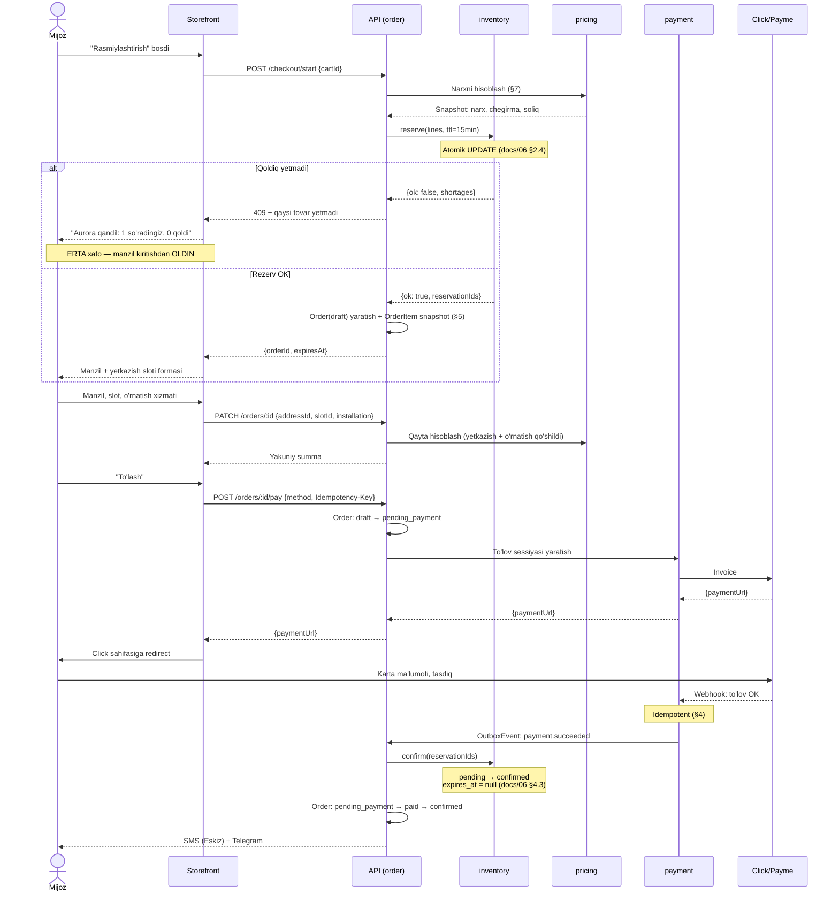
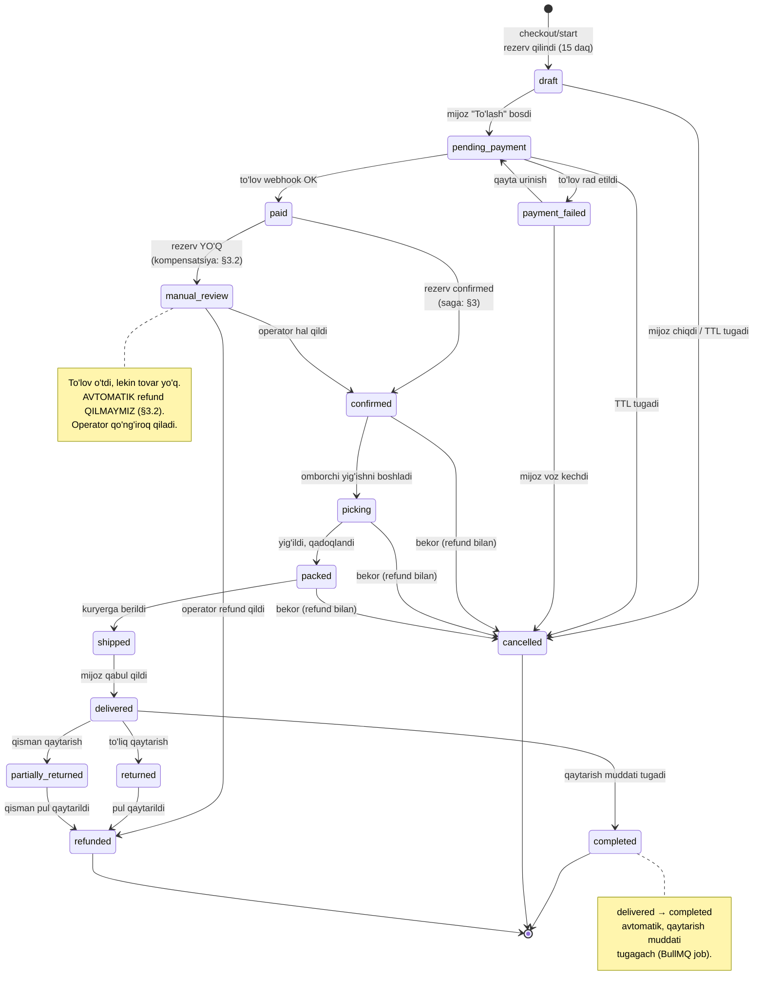
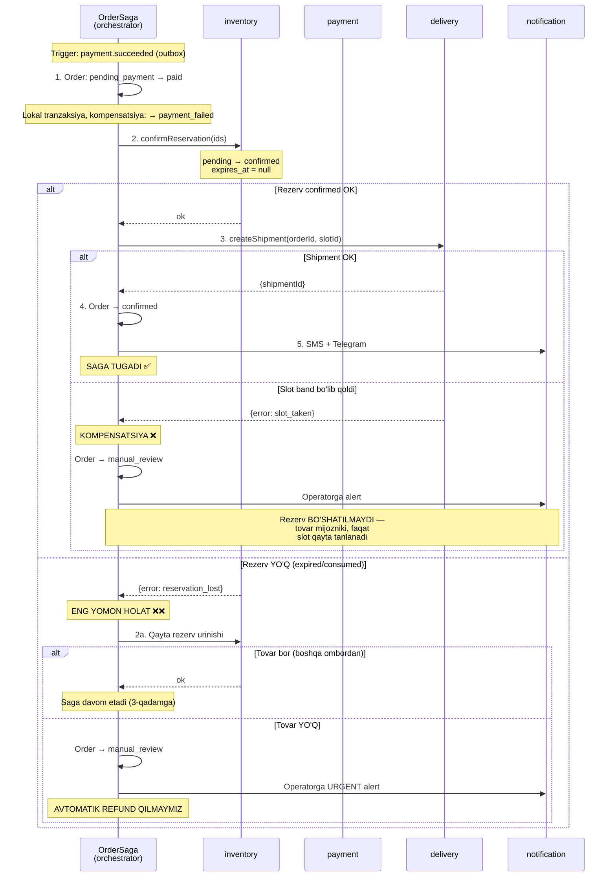
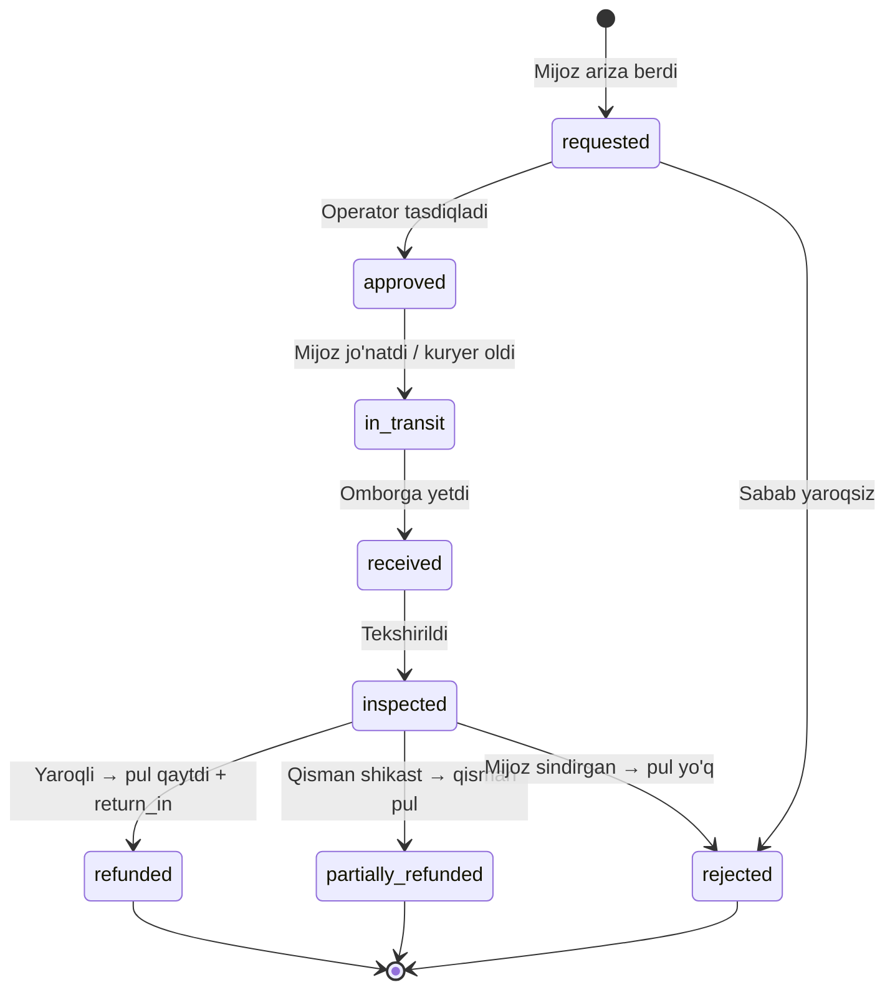

# 07 — Buyurtma va checkout (`order`)

> **Modul:** `order` (CANON §7, #5)
> **Bog'liq modullar:** `cart` (#4), `payment` (#6), `inventory` (#8), `delivery` (#7), `pricing` (#12)
> **Bog'liq hujjatlar:** `docs/06-inventory-and-reservations.md`, `docs/08-payments-and-installments.md`, `docs/09-delivery-and-operations.md`
> **Status:** loyihalash (implementatsiya yo'q)

---

## 0. Bu modul nima uchun qiyin

`order` — tizimning **kesishma nuqtasi**. U yolg'iz ishlamaydi: har buyurtma
kamida uch mustaqil tizimga tegadi — **to'lov** (Click/Payme, tashqi API),
**rezerv** (PostgreSQL, `docs/06`), **yetkazib berish** (slot, kuryer). Bularning
har biri alohida yiqilishi mumkin va **ular bitta tranzaksiyaga sig'maydi**.

Buyurtma modulining butun murakkabligi shu bitta jumladan kelib chiqadi:

> To'lov o'tdi. Rezerv yo'qoldi. Endi nima qilamiz?

CANON §9.3 buni aniq belgilaydi: **distributed tranzaksiya emas, saga.** Bu
hujjatning yadrosi — §3.

Ikkinchi og'riq nuqtasi — **narx**. Buyurtma yaratilgan paytdagi narx muzlashi
kerak. Bu ko'p loyihada xato qilinadi va §5 da batafsil.

---

## 1. Checkout oqimi

### 1.1 Umumiy oqim



**Diqqat qiling — rezerv checkout'ning BIRINCHI qadamida**, oxirgisida emas.
Sabab `docs/06` §4.1 da asoslangan: xato erta yuzaga chiqsin. Mijoz 3 daqiqa
manzil yozib, keyin "tugadi" eshitishi — eng yomon tajriba.

### 1.2 Mehmon (guest) vs ro'yxatdan o'tgan

CANON §7 (`cart` moduli): "savat, mehmon savati, birlashtirish".

|                      | Mehmon                                      | Ro'yxatdan o'tgan   |
| -------------------- | ------------------------------------------- | ------------------- |
| Savat identifikatori | `cart_token` (cookie, HttpOnly)             | `customer_id`       |
| Buyurtma tarixi      | Yo'q (faqat havola + SMS)                   | To'liq              |
| Manzil               | Har safar kiritiladi                        | Saqlangan `Address` |
| Rassrochka           | **Mumkin emas** — shaxs tasdiqlanishi shart | Mumkin              |
| Kuzatuv              | Buyurtma raqami + telefon orqali            | Kabinetda           |

**Kelvin qarori: mehmon checkout ruxsat etiladi.** Sabab: majburiy ro'yxatdan
o'tish konversiyani pasaytiradi, telefon raqami esa baribir olinadi (SMS uchun
kerak — CANON §6, Eskiz.uz).

Lekin: **rassrochka uchun ro'yxatdan o'tish majburiy.** Bu texnik cheklov emas,
provayder talabi — bo'lib to'lash uchun shaxsni identifikatsiya qilish kerak
(`docs/08`).

**Nozik nuqta:** mehmon buyurtma bergan telefon raqami keyinchalik ro'yxatdan
o'tsa, eski buyurtmalar unga bog'lanadimi? Bu **xavfsizlik savoli**, qulaylik
savoli emas: telefon raqami qayta ishlatilgan bo'lishi mumkin (O'zbekistonda
operatorlar raqamni qayta sotadi). Avtomatik bog'lash — begona odamga boshqa
kishining manzili va buyurtma tarixini ko'rsatish demakdir. §12 da ochiq savol,
lekin **default: bog'lanmaydi**.

### 1.3 Savatni birlashtirish (cart merge)

Mijoz mehmon sifatida savat to'ldirdi, keyin login qildi. Uning akkauntida
allaqachon savat bor. Nima bo'ladi?

| Strategiya  | Natija                                      | Muammo                                    |
| ----------- | ------------------------------------------- | ----------------------------------------- |
| `replace`   | Mehmon savati akkaunt savatini almashtiradi | Eski savat yo'qoladi — mijoz g'azablanadi |
| `keep_user` | Akkaunt savati qoladi                       | Hozirgi mehnat yo'qoladi — yanada yomon   |
| `union`     | Ikkalasi birlashadi                         | Miqdorlar qanday qo'shiladi?              |

**Kelvin qarori: `union`, miqdor uchun `max()` (yig'indi emas).**

```typescript
export interface CartMergeStrategy {
  merge(guestCart: Cart, userCart: Cart): Promise<Cart>;
}

/**
 * union + max: bir xil variant ikkala savatda bo'lsa, KATTA miqdor olinadi.
 *
 * Nima uchun max, sum emas:
 * mijoz mehmon sifatida 2 ta qandil qo'ydi, keyin login qildi va o'sha yerda
 * 2 ta bor edi (o'tgan hafta qo'ygan — o'sha niyat). sum → 4 ta. Mijoz 4 ta
 * xohlamagan, u 2 ta xohlagan. max → 2 ta. To'g'ri.
 *
 * max ham mukammal emas (haqiqatan 4 ta kerak bo'lsa — mijoz qo'lda tuzatadi),
 * lekin uning xatosi ARZONROQ: kam buyurtma qilish — 4 ta qandil kutilmaganda
 * kelishidan yaxshiroq.
 */
async merge(guestCart: Cart, userCart: Cart): Promise<Cart> {
  const byVariant = new Map<string, CartItem>();
  for (const item of userCart.items) byVariant.set(item.variantId, item);
  for (const item of guestCart.items) {
    const existing = byVariant.get(item.variantId);
    byVariant.set(
      item.variantId,
      existing ? { ...item, quantity: Math.max(existing.quantity, item.quantity) } : item,
    );
  }
  // Narx merge paytida QAYTA HISOBLANADI (§5): savatdagi narx — havola, snapshot emas.
  return this.rebuild(userCart.id, [...byVariant.values()]);
}
```

**Muhim:** merge natijasi mijozga **ko'rsatiladi** ("Savatingizga 3 ta tovar
qo'shildi"). Jimgina o'zgartirish — mijoz uchun sirli xatti-harakat.

---

## 2. Buyurtma holat mashinasi

### 2.1 Diagramma



### 2.2 O'tishlar jadvali

| #   | O'tish                                 | Kim boshlaydi     | Shart                                      | Yon ta'sir                                              |
| --- | -------------------------------------- | ----------------- | ------------------------------------------ | ------------------------------------------------------- |
| 1   | `→ draft`                              | Mijoz             | Savat bo'sh emas, rezerv OK                | Rezerv (`pending`, 15 daq), narx snapshot (§5)          |
| 2   | `draft → pending_payment`              | Mijoz             | Manzil + slot tanlangan                    | To'lov sessiyasi, `Idempotency-Key` (§4)                |
| 3   | `draft → cancelled`                    | Mijoz / job       | —                                          | Rezerv `released`                                       |
| 4   | `pending_payment → paid`               | **Webhook**       | To'lov summasi buyurtma summasiga **teng** | `Payment(succeeded)`, `LedgerEntry`, outbox             |
| 5   | `pending_payment → payment_failed`     | Webhook           | Provayder rad etdi                         | Rezerv **saqlanadi** (TTL ichida qayta urinsin)         |
| 6   | `pending_payment → cancelled`          | Job               | TTL tugadi                                 | Rezerv `expired`                                        |
| 7   | `payment_failed → pending_payment`     | Mijoz             | Rezerv hali tirik                          | Yangi `PaymentAttempt`                                  |
| 8   | `paid → confirmed`                     | Tizim (saga)      | Rezerv `confirmed` bo'ldi                  | SMS + Telegram, `Shipment` yaratish                     |
| 9   | `paid → manual_review`                 | Tizim (saga)      | Rezerv **yo'q**                            | Operatorga alert (§3.2)                                 |
| 10  | `manual_review → confirmed`            | Operator          | Tovar topildi                              | Yangi rezerv, SMS                                       |
| 11  | `manual_review → refunded`             | Operator          | Tovar yo'q, mijoz rozi                     | Refund (`docs/08`)                                      |
| 12  | `confirmed → picking`                  | Omborchi          | —                                          | —                                                       |
| 13  | `picking → packed`                     | Omborchi          | Barcha qatorlar yig'ildi                   | Rezerv `consumed` → `on_hand` kamayadi (`docs/06` §3.2) |
| 14  | `packed → shipped`                     | Kuryer / operator | Kuryer tayinlangan                         | SMS: "Yo'lda", kuzatuv havolasi                         |
| 15  | `shipped → delivered`                  | Kuryer            | Mijoz tasdiqladi                           | SMS: sharh so'rovi                                      |
| 16  | `delivered → completed`                | **Job**           | Qaytarish muddati tugadi                   | Sotuvchi komissiyasi yopiladi (`crm`)                   |
| 17  | `confirmed/picking/packed → cancelled` | Mijoz / operator  | Hali jo'natilmagan                         | Rezerv `released`, **refund**                           |
| 18  | `delivered → returned`                 | Mijoz             | Qaytarish muddati ichida                   | `return_in` movement, refund                            |
| 19  | `delivered → partially_returned`       | Mijoz             | Muddat ichida, bir qism                    | Qisman `return_in`, qisman refund (§6.2)                |

**#13 nozik nuqta:** `on_hand` **`packed`** da kamayadi, `shipped` da emas.
Sabab: tovar jismonan qutiga solindi va ombordan ajratildi — bu fizik harakat.
Kuryer kelguncha u ombordа turgan bo'lishi mumkin, lekin u **boshqa mijozga
sotilishi mumkin emas**. `docs/06` §3.2 dagi `consume` aynan shu nuqtada
chaqiriladi.

**#4 nozik nuqta:** to'lov summasi **tekshiriladi**. Webhook "10 000 so'm
to'landi" desa, buyurtma esa 500 000 so'm bo'lsa — bu `paid` emas. Bu — hujum
vektori va u §4.3 da ko'rib chiqiladi.

### 2.3 Nima uchun `manual_review` mavjud

Ko'p tizimda bu holat yo'q va u — xato. "To'lov o'tdi, tovar yo'q" holati
**kamdan-kam**, lekin **muqarrar** (§3.2). Agar holat mashinasida unga joy
bo'lmasa, u baribir sodir bo'ladi — faqat tizim uni `paid` da qoldiradi va hech
kim ko'rmaydi. Buyurtma "osilib" qoladi, mijoz kutadi, hech narsa bo'lmaydi.

**Nomlangan holat — ko'rinadigan muammo.** `manual_review` dagi buyurtmalar
admin panelda alohida ro'yxat, alert bilan. Bu — muammoni hal qilmaydi, lekin
uni **yashirmaydi**. Bu farq muhim.

---

## 3. SAGA — eng muhim qism

### 3.1 Nima uchun distributed tranzaksiya yo'q

Ideal dunyoda:

```sql
BEGIN;
  UPDATE stock_items SET reserved = reserved + 1 ...;  -- PostgreSQL
  POST https://api.click.uz/payment ...;               -- ❌ Tashqi API
  INSERT INTO shipments ...;                           -- PostgreSQL
COMMIT;
```

Bu **mumkin emas**. Sabablar:

1. **Click/Payme — tashqi tizim.** Ular sizning `ROLLBACK` ingizni bilmaydi.
   Pul o'tgan bo'lsa, o'tgan.
2. **Tranzaksiya ichida tashqi I/O — taqiqlangan** (`docs/06` §2.2). Click 3 s
   javob bersa, qulf 3 s ushlanadi. Connection pool tugaydi. Butun API yiqiladi.
3. **2PC (two-phase commit)** — nazariy jihatdan bor, amalda: Click uni
   qo'llab-quvvatlamaydi, koordinator yiqilsa tizim bloklanadi.

Demak — **saga**: har qadam alohida tranzaksiya, xato bo'lsa **kompensatsiya**
(oldingi qadamlarni orqaga qaytaruvchi harakat).

**Muhim tushuncha:** kompensatsiya — `ROLLBACK` **emas**. `ROLLBACK` hech narsa
bo'lmagandek qiladi. Kompensatsiya — **yangi fakt**: "pul qaytarildi" — bu
"pul o'tmagan" degani emas. Ledger'da ikkala yozuv ham qoladi (`docs/06` §1.5
dagi storno mantiqi bilan bir xil).

### 3.2 Choreography vs Orchestration

|               | **Choreography**                                    | **Orchestration**                              |
| ------------- | --------------------------------------------------- | ---------------------------------------------- |
| Mantiq        | Har servis event tinglaydi va o'zi qaror qiladi     | Markaziy koordinator ketma-ketlikni boshqaradi |
| Bog'liqlik    | Past                                                | Koordinator hammani biladi                     |
| Kuzatish      | **Qiyin** — oqim kodda yo'q, u event'lar orasida    | Oson — oqim bitta joyda                        |
| Debug         | "Nega bu buyurtma osilib qoldi?" → 5 ta servis logi | Saga holatini o'qiysiz                         |
| Kompensatsiya | Har servis o'zinikini biladi                        | Koordinator biladi                             |
| Mos keladi    | Oddiy, chiziqli oqim                                | **Murakkab, shartli oqim**                     |

**Kelvin qarori: Orchestration.**

Sabablar:

1. **Bu — bitta do'kon uchun monolit** (CANON §1: single-tenant, marketplace
   emas). Modullar bitta NestJS ilovada. Choreography'ning asosiy foydasi
   (servislarni mustaqil deploy qilish) bu yerda **yo'q** — deploy baribir
   bitta. Ya'ni biz murakkablikni to'laymiz, lekin foydasini olmaymiz.
2. **Kompensatsiya mantig'i murakkab va shartli.** §3.4 ga qarang: "rezerv yo'q
   bo'lsa → boshqa ombordan urin → topilmasa → manual_review". Bu qaror
   **butun kontekstni** ko'rishni talab qiladi. Choreography'da bu mantiq
   servislar orasiga sochilib ketadi.
3. **Kuzatiluvchanlik.** "Buyurtma #1234 nima bo'ldi?" savoliga javob bitta
   jadvaldan (`saga_state`) o'qiladi.

**Muhim aniqlik:** orchestration tanlash **sinxron chaqiruv** degani emas.
Koordinator qadamlarni **outbox + BullMQ** orqali async bajaradi (§3.5).
Orchestration — mantiq qayerda turishi haqida, transport haqida emas.

### 3.3 Saga qadamlari



**Nima uchun avtomatik refund qilmaymiz?**

Bu — ataylab qilingan qaror va u intuitivga zid. Sabablar:

1. **Tovar boshqa omborda bo'lishi mumkin** (`docs/06` §5). Avtomatik refund
   buyurtmani yopadi, holbuki uni bajarish mumkin edi.
2. **Mijoz kutishga rozi bo'lishi mumkin.** "Ta'minotchidan 2 haftada keladi —
   kutasizmi?" Ko'p mijoz "ha" deydi, ayniqsa aynan shu qandilni tanlagan bo'lsa.
3. **Refund — bir tomonlama eshik.** Pul qaytgach, buyurtmani qaytarish uchun
   mijoz butun jarayonni qaytadan boshlashi kerak. Konversiya yo'qoladi.
4. **Refund arzon emas.** Click/Payme komissiyasi qaytmaydi (bu provayder
   siyosatiga bog'liq — `docs/08`, ochiq savol).

Ya'ni: **avtomatik qaror qabul qilib bo'lmaydigan joyda odam qaror qabul
qilsin.** Tizimning vazifasi — muammoni **ko'rinadigan** qilish (`manual_review`

- alert), uni yashirish yoki shoshib hal qilish emas.

Bu holat qanchalik tez-tez uchraydi? Rezerv TTL to'lov sessiyasidan uzunroq
bo'lsa — deyarli hech qachon (`docs/06` §4.2). Ya'ni bu — **oxirgi himoya
chizig'i**, kundalik oqim emas.

### 3.4 TypeScript: Saga interfeysi

```typescript
// apps/api/src/order/saga/saga.types.ts

export interface SagaStep<TCtx> {
  readonly name: string;

  /**
   * Qadamni bajarish. IDEMPOTENT bo'lishi SHART (§3.6).
   * Ikki marta chaqirilsa — bir marta ta'sir qilishi kerak.
   */
  execute(ctx: TCtx): Promise<StepResult>;

  /**
   * Orqaga qaytarish. IDEMPOTENT bo'lishi SHART.
   * null → bu qadam kompensatsiya qilinmaydi (masalan, SMS: yuborilgan SMS
   * qaytarilmaydi. Bu — dizayn cheklovi, shuning uchun SMS OXIRGI qadam).
   */
  compensate: ((ctx: TCtx) => Promise<void>) | null;

  /**
   * Xato retry qilinadimi. Tarmoq xatosi → ha. Biznes xatosi → yo'q.
   */
  isRetryable(error: unknown): boolean;
}

export type StepResult =
  | { readonly status: 'ok' }
  | { readonly status: 'failed'; readonly reason: string; readonly compensate: boolean }
  /** Kompensatsiya ham, davom etish ham mumkin emas → odam kerak. */
  | { readonly status: 'needs_human'; readonly reason: string };

export interface SagaState {
  readonly id: string;
  readonly orderId: string;
  readonly currentStep: number;
  readonly status: 'running' | 'completed' | 'compensating' | 'failed' | 'needs_human';
  readonly completedSteps: readonly string[];
  readonly context: Record<string, unknown>;
  readonly attempts: number;
  readonly lastError: string | null;
}
```

```typescript
// apps/api/src/order/saga/order-saga.orchestrator.ts

@Injectable()
export class OrderSagaOrchestrator {
  private readonly log = new Logger(OrderSagaOrchestrator.name);

  constructor(
    private readonly prisma: PrismaClient,
    private readonly steps: OrderSagaSteps,
  ) {}

  private buildSteps(): readonly SagaStep<OrderSagaContext>[] {
    return [
      this.steps.markPaid, // kompensatsiya: → payment_failed
      this.steps.confirmReservation, // kompensatsiya: rezervni pending ga qaytarish
      this.steps.createShipment, // kompensatsiya: shipment bekor
      this.steps.markConfirmed, // kompensatsiya: → paid
      this.steps.notify, // kompensatsiya: null (SMS qaytmaydi)
    ];
  }

  async run(sagaId: string): Promise<void> {
    const state = await this.loadState(sagaId);
    const steps = this.buildSteps();

    for (let i = state.currentStep; i < steps.length; i++) {
      const step = steps[i];
      try {
        const result = await step.execute(state.context as OrderSagaContext);

        if (result.status === 'ok') {
          await this.advance(sagaId, i + 1, step.name);
          continue;
        }

        if (result.status === 'needs_human') {
          // Kompensatsiya ham qilmaymiz — holat noaniq, odam ko'rsin.
          await this.markNeedsHuman(sagaId, result.reason);
          await this.alertOperator(state.orderId, result.reason);
          return;
        }

        // status === 'failed'
        if (result.compensate) {
          await this.compensateFrom(sagaId, i - 1, steps, state);
        } else {
          await this.markFailed(sagaId, result.reason);
        }
        return;
      } catch (e) {
        if (step.isRetryable(e) && state.attempts < MAX_ATTEMPTS) {
          // BullMQ exponential backoff bilan qayta navbatga qo'yadi.
          // Qadam idempotent bo'lgani uchun qayta bajarish xavfsiz.
          await this.scheduleRetry(sagaId, state.attempts + 1);
          return;
        }
        await this.compensateFrom(sagaId, i - 1, steps, state);
        return;
      }
    }

    await this.markCompleted(sagaId);
  }

  /**
   * Bajarilgan qadamlarni TESKARI tartibda orqaga qaytarish.
   *
   * Kompensatsiyaning O'ZI yiqilsa nima bo'ladi? Bu — eng yomon holat:
   * tizim na oldinga, na orqaga bora oladi. Bunday holatda saga
   * needs_human ga o'tadi va operator qo'lda hal qiladi.
   * Bu holatni YASHIRISH mumkin emas — u ma'lumot nomuvofiqligini bildiradi.
   */
  private async compensateFrom(
    sagaId: string,
    fromIndex: number,
    steps: readonly SagaStep<OrderSagaContext>[],
    state: SagaState,
  ): Promise<void> {
    await this.markCompensating(sagaId);

    for (let i = fromIndex; i >= 0; i--) {
      const step = steps[i];
      if (!step.compensate) continue;
      if (!state.completedSteps.includes(step.name)) continue;

      try {
        await step.compensate(state.context as OrderSagaContext);
      } catch (e) {
        this.log.error(
          { sagaId, step: step.name, err: e },
          "Kompensatsiya yiqildi — qo'lda aralashuv kerak",
        );
        await this.markNeedsHuman(sagaId, `compensation_failed:${step.name}`);
        await this.alertOperator(state.orderId, `compensation_failed:${step.name}`);
        return;
      }
    }
    await this.markFailed(sagaId, 'compensated');
  }
}
```

### 3.5 Outbox bilan bog'lanish (CANON §8)

Saga qadamlari **event** orqali ishga tushadi. Muammo: event'ni qanday
**ishonchli** chiqaramiz?

```typescript
// ❌ NOTO'G'RI — ikki tizim, atomiklik yo'q
await prisma.order.update({ where: { id }, data: { status: 'paid' } });
await redis.publish('order.paid', { orderId: id });
// Agar shu ikkisi orasida process yiqilsa:
// DB'da paid, lekin event chiqmadi → saga hech qachon boshlanmaydi
// → buyurtma abadiy "paid" da osilib qoladi
```

```typescript
// ✅ TO'G'RI — transactional outbox (CANON §8)
await prisma.$transaction(async (tx) => {
  await tx.order.update({ where: { id }, data: { status: 'paid' } });
  await tx.outboxEvent.create({
    data: {
      aggregateType: 'order',
      aggregateId: id,
      eventType: 'order.paid',
      payload: { orderId: id, amount: order.totalAmount.toString() }, // BigInt → string!
      // status: 'pending' (default)
    },
  });
});
// Ikkalasi BIR tranzaksiyada → ikkalasi ham bo'ladi yoki hech biri.
// Alohida publisher job outbox'ni o'qib, event'ni BullMQ ga uzatadi.
```

> **`payload` da BigInt → `string`.** `JSON.stringify(1n)` — `TypeError`.
> Pul `BigInt` tiyinda (CANON §8), shuning uchun outbox payload'ida u
> **majburiy** ravishda string'ga aylantiriladi. Bu — oson unutiladigan va
> production'da yuzaga chiqadigan xato. `payload` tipini zod bilan
> tekshiramiz (`packages/contracts`).

**Publisher `at-least-once` beradi** — ya'ni event **ikki marta** yetkazilishi
mumkin (publish qildi, `status = sent` yozishdan oldin yiqildi). Shuning uchun
har saga qadami **idempotent bo'lishi shart** (§3.6). `Exactly-once` yetkazish
— tarqoq tizimlarda erishib bo'lmaydigan narsa; to'g'ri yechim —
at-least-once + idempotent iste'molchi.

### 3.6 Idempotentlik — har qadam uchun majburiy

```typescript
// ❌ IDEMPOTENT EMAS
async execute(ctx) {
  await this.inventory.confirmReservation(ctx.reservationIds);
  await this.sms.send(ctx.phone, 'Buyurtmangiz qabul qilindi');
  // Ikki marta chaqirilsa → mijoz ikkita SMS oladi
}

// ✅ IDEMPOTENT
async execute(ctx) {
  // confirmReservation shartli UPDATE ishlatadi (docs/06 §3.2):
  // WHERE status = 'pending' → ikkinchi chaqiruvda 0 qator → no-op
  await this.inventory.confirmReservation(ctx.reservationIds);

  // SMS uchun deduplikatsiya kaliti
  await this.notifications.sendOnce({
    key: `order-confirmed:${ctx.orderId}`, // unique constraint DB'da
    channel: 'sms',
    to: ctx.phone,
    template: 'order_confirmed',
  });
}
```

**Idempotentlik uch usuli:**

| Usul                  | Qayerda          | Misol                                                        |
| --------------------- | ---------------- | ------------------------------------------------------------ |
| **Shartli UPDATE**    | Holat o'zgarishi | `WHERE status = 'pending'` → 0 qator = allaqachon bajarilgan |
| **Unique constraint** | Yaratish         | `sendOnce(key)` — ikkinchi `INSERT` conflict beradi          |
| **Idempotency key**   | Tashqi API       | Click'ga `Idempotency-Key` header (§4)                       |

**Qoida:** har saga qadami shu uchtadan **kamida bittasini** ishlatishi shart.
Ishlatmasa — u saga qadami bo'la olmaydi. Bu — kod review'da tekshiriladigan
majburiy talab.

---

## 4. Idempotentlik — mijoz "To'lash" ni ikki marta bosdi

### 4.1 Muammo

```
t0     Mijoz "To'lash" bosdi → POST /orders/123/pay
t0+50  Tarmoq sekin, javob yo'q
t0+2s  Mijoz sabrsizlanib YANA bosdi → POST /orders/123/pay
       ↓
       Ikkita to'lov sessiyasi. Ikkita Click invoice.
       Eng yomon holat: mijoz ikkalasini ham to'laydi.
```

Bu — nazariy muammo emas. Sekin 3G da (O'zbekiston viloyatlarida odatiy hol)
bu **muntazam** sodir bo'ladi.

### 4.2 `Idempotency-Key`

```typescript
// apps/api/src/common/idempotency/idempotency.interceptor.ts

/**
 * Stripe modeliga o'xshash idempotentlik.
 *
 * Mijoz UUID generatsiya qiladi va uni HAR urinishda bir xil yuboradi.
 * Bir xil key → bir xil javob, yangi ta'sir YO'Q.
 */
@Injectable()
export class IdempotencyInterceptor implements NestInterceptor {
  constructor(private readonly prisma: PrismaClient) {}

  async intercept(ctx: ExecutionContext, next: CallHandler): Promise<Observable<unknown>> {
    const req = ctx.switchToHttp().getRequest<Request>();
    if (req.method !== 'POST') return next.handle();

    const key = req.header('Idempotency-Key');
    if (!key) throw new BadRequestException('Idempotency-Key header majburiy');

    // So'rov tanasi hash'i — bir xil key, boshqa tana = mijoz xatosi
    const fingerprint = sha256(JSON.stringify(req.body));

    try {
      // INSERT — atomik "band qilish". Race'siz: unique constraint hal qiladi.
      await this.prisma.idempotencyRecord.create({
        data: {
          key,
          fingerprint,
          endpoint: req.path,
          status: 'in_progress',
          expiresAt: new Date(Date.now() + 24 * 3600 * 1000),
        },
      });
    } catch (e) {
      if (isUniqueViolation(e)) {
        return from(this.handleReplay(key, fingerprint));
      }
      throw e;
    }

    return next.handle().pipe(
      tap(async (response) => {
        await this.prisma.idempotencyRecord.update({
          where: { key },
          data: { status: 'completed', response: response as Prisma.JsonObject },
        });
      }),
      catchError(async (err) => {
        // Xato bo'lsa — yozuvni O'CHIRAMIZ, mijoz qayta urinsin.
        // Aks holda vaqtinchalik xato abadiy "yopishib" qoladi.
        await this.prisma.idempotencyRecord.delete({ where: { key } }).catch(() => {});
        throw err;
      }),
    );
  }

  private async handleReplay(key: string, fingerprint: string): Promise<unknown> {
    const existing = await this.prisma.idempotencyRecord.findUniqueOrThrow({ where: { key } });

    if (existing.fingerprint !== fingerprint) {
      // Bir xil key, boshqa tana → mijoz kalitni qayta ishlatyapti. Bu xato.
      throw new ConflictException("Idempotency-Key boshqa so'rov tanasi bilan ishlatilgan");
    }

    if (existing.status === 'in_progress') {
      // Birinchi so'rov hali ishlayapti. Mijoz kutsin va qayta urinsin.
      throw new HttpException("So'rov qayta ishlanmoqda", 409);
    }

    return existing.response; // Saqlangan javobni qaytaramiz
  }
}
```

```prisma
model IdempotencyRecord {
  key         String   @id
  fingerprint String
  endpoint    String
  status      String   // in_progress | completed
  response    Json?
  expiresAt   DateTime @map("expires_at") @db.Timestamptz(3)
  createdAt   DateTime @default(now()) @map("created_at") @db.Timestamptz(3)

  @@index([expiresAt])  // tozalash job'i uchun
  @@map("idempotency_records")
}
```

> **Nima uchun PostgreSQL, Redis emas?** Idempotentlik — to'g'rilik masalasi,
> tezlik emas. Redis yiqilsa yoki kalitni chiqarib yuborsa (eviction), ikki
> marta to'lov yaratiladi. PostgreSQL'da `unique` cheklovi — qat'iy kafolat.
> Bu `docs/06` §2.5 dagi bir xil mantiq: haqiqat manbai — PostgreSQL.

### 4.3 Webhook idempotentligi — muhimroq

Click/Payme webhook'ni **bir necha marta** yuboradi (javobni olmasa qayta
urinadi). Bu — normal xatti-harakat, xato emas.

```typescript
async handlePaymentWebhook(payload: ClickWebhookPayload): Promise<void> {
  // 1. Imzoni tekshirish — HAR DOIM BIRINCHI.
  //    Aks holda har kim "to'lov o'tdi" deb yuborishi mumkin.
  if (!this.verifySignature(payload)) {
    throw new UnauthorizedException('Imzo noto\'g\'ri');
  }

  await this.prisma.$transaction(async (tx) => {
    // 2. Deduplikatsiya: provayder tranzaksiya ID bo'yicha unique.
    try {
      await tx.paymentAttempt.create({
        data: {
          providerTxnId: payload.transactionId,  // @unique
          provider: 'click',
          amount: BigInt(payload.amount),        // TIYINDA (CANON §8)
          currency: 'UZS',
          status: 'succeeded',
          orderId: payload.orderId,
        },
      });
    } catch (e) {
      if (isUniqueViolation(e)) return; // Takroriy webhook — jim chiqamiz
      throw e;
    }

    // 3. Summani TEKSHIRISH — hujum vektori.
    const order = await tx.order.findUniqueOrThrow({ where: { id: payload.orderId } });
    if (BigInt(payload.amount) !== order.totalAmount) {
      // Kam to'lov: hujum yoki provayder xatosi. Ikkalasida ham paid QILMAYMIZ.
      await tx.order.update({
        where: { id: order.id },
        data: { status: 'manual_review' },
      });
      this.log.error(
        { orderId: order.id, expected: order.totalAmount.toString(), got: payload.amount },
        'To\'lov summasi mos kelmadi',
      );
      return;
    }

    // 4. Holat o'zgarishi + outbox — BIR tranzaksiyada (§3.5)
    await tx.order.update({
      where: { id: order.id, status: 'pending_payment' }, // shartli — idempotent
      data: { status: 'paid' },
    });
    await tx.outboxEvent.create({
      data: {
        aggregateType: 'order',
        aggregateId: order.id,
        eventType: 'order.paid',
        payload: { orderId: order.id, amount: order.totalAmount.toString() },
      },
    });
  });
}
```

> ⚠️ **Click/Payme webhook formati, imzo algoritmi va qayta urinish siyosati —
> NOMA'LUM.** CANON §10: "Click/Payme/rassrochka API detallari (rasmiy hujjat
> kerak)". Yuqoridagi kod — **struktura**, aniq maydon nomlari emas. Rasmiy
> hujjat olingandan keyin `docs/08` da aniqlashtiriladi. §12 da ochiq savol.

---

## 5. Narx muzlatilishi — MUHIM

### 5.1 Muammo

```typescript
// ❌ FALOKAT — ko'p loyihada aynan shunday yozilgan
const order = await prisma.order.findUnique({
  where: { id },
  include: { items: { include: { variant: { include: { price: true } } } } },
});
const total = order.items.reduce((sum, i) => sum + i.variant.price.amount * BigInt(i.quantity), 0n);
```

Nima uchun bu falokat:

- **Bugun** mijoz qandilni 1 200 000 so'mga sotib oldi va to'ladi.
- **Ertaga** menejer narxni 1 500 000 ga oshirdi.
- **Endi** o'sha buyurtma sahifasi 1 500 000 ko'rsatadi.
- Mijoz 1 200 000 to'lagan. Chek 1 500 000. **Buxgalteriya buzildi.**
- Mijoz "Men bunchalik to'lamaganman!" deydi va **haq**.
- Aksiya tugadi → barcha eski buyurtmalar "qimmatlashdi".
- Mahsulot o'chirildi (`deleted_at`) → buyurtma **umuman ochilmaydi**.

Bu — **eng ko'p uchraydigan e-commerce xatosi**. Ildizi: buyurtma
`Product` ga **havola** qilyapti, holbuki u o'sha paytdagi **kelishuvni**
saqlashi kerak.

### 5.2 Yechim: to'liq snapshot

**Buyurtma — shartnoma.** Shartnoma imzolangan paytdagi shartlarni saqlaydi.
Katalog o'zgarishi imzolangan shartnomani o'zgartirmaydi.

```prisma
model OrderItem {
  id      String @id @default(uuid(7))
  orderId String @map("order_id")

  // ─── Havola (FAQAT audit va havola uchun) ───
  // ⚠️ Bu FK'lardan NARX yoki NOM O'QILMAYDI. Ular faqat
  // "qaysi mahsulot edi" savoliga javob berish uchun.
  // Mahsulot o'chirilsa ham (deleted_at), buyurtma to'liq ishlaydi.
  variantId String  @map("variant_id")
  productId String  @map("product_id")

  // ─── SNAPSHOT: buyurtma paytidagi holat ───
  /// Mahsulot nomi — o'sha paytdagi. Keyin o'zgarsa ham bu qoladi.
  productName String @map("product_name")
  variantName String @map("variant_name")
  sku         String

  /// Yoritish atributlari — snapshot (CANON §4).
  /// Nima uchun: mijoz 3000K qandil sotib oldi. Keyin ta'minotchi
  /// modelni 4000K ga o'zgartirdi va menejer katalogda yangiladi.
  /// Mijozning chekida 3000K yozilishi SHART — u aynan shuni sotib olgan.
  colorTemperature Int?    @map("color_temperature")  // K
  luminousFlux     Int?    @map("luminous_flux")      // lm
  socketType       String? @map("socket_type")        // E27, GU10...
  power            Int?                               // W
  ipRating         String? @map("ip_rating")

  quantity Int

  // ─── PUL: BigInt, TIYINDA (CANON §8). Float HECH QACHON. ───
  /// Chegirmasiz birlik narxi
  unitPrice       BigInt @map("unit_price")
  /// Shu qatorga tushgan chegirma (musbat son)
  discountAmount  BigInt @default(0) @map("discount_amount")
  /// Soliq (agar ajratilsa)
  taxAmount       BigInt @default(0) @map("tax_amount")
  /// Yakuniy: unitPrice * quantity - discountAmount + taxAmount
  /// Saqlanadi (hisoblanmaydi) — hisoblash qoidasi o'zgarsa ham buzilmasin.
  lineTotal       BigInt @map("line_total")

  currency String @default("UZS")

  /// Qaysi chegirma qo'llandi — audit va nizo uchun (§7).
  appliedDiscountIds String[] @map("applied_discount_ids")

  /// Qaysi ombordan olinadi (docs/06 §5)
  warehouseId String? @map("warehouse_id")

  createdAt DateTime @default(now()) @map("created_at") @db.Timestamptz(3)

  order Order @relation(fields: [orderId], references: [id])

  @@index([orderId])
  @@map("order_items")
}
```

```sql
-- lineTotal to'g'riligi DB darajasida
ALTER TABLE order_items
  ADD CONSTRAINT order_item_line_total_correct CHECK (
    line_total = unit_price * quantity - discount_amount + tax_amount
  ),
  ADD CONSTRAINT order_item_qty_positive     CHECK (quantity > 0),
  ADD CONSTRAINT order_item_prices_non_neg   CHECK (
    unit_price >= 0 AND discount_amount >= 0 AND tax_amount >= 0
  );
```

### 5.3 Qoida

> **`Order` va `OrderItem` dagi hech qanday pul qiymati `Product`, `Price`,
> `Discount` jadvalidan `JOIN` orqali o'qilmaydi. HECH QACHON.**

Buyurtma yaratilgandan keyin u **o'zini o'zi tushuntiradi**: butun `catalog`
jadvali o'chirilsa ham, buyurtma sahifasi to'liq va to'g'ri ko'rinadi.

**Bu qoida qanday majburlanadi?**

1. **Arxitektura testi:** `order` moduli `catalog` jadvallariga `JOIN`
   qilmasligi CI'da tekshiriladi.
2. **Kod review:** `OrderItem` da `include: { variant: ... }` ko'rinsa — rad.
3. **Test:** mahsulot narxi o'zgartirilgandan keyin eski buyurtma summasi
   **o'zgarmasligi** (§11.4).

```typescript
// apps/api/src/order/order-snapshot.builder.ts

/**
 * Savatdan buyurtma snapshot'ini quradi.
 * Bu — checkout'dagi YAGONA joy, u yerda catalog/pricing o'qiladi.
 * Undan keyin buyurtma mustaqil.
 */
async buildSnapshot(cart: Cart, ctx: PricingContext): Promise<OrderSnapshot> {
  const priced = await this.pricing.calculate(cart, ctx); // §7

  const items = priced.lines.map((line) => ({
    variantId: line.variantId,
    productId: line.productId,

    // Snapshot — HOZIRGI qiymatlar nusxalanadi
    productName: line.product.name,
    variantName: line.variant.name,
    sku: line.variant.sku,
    colorTemperature: line.variant.attributes.colorTemperature ?? null,
    luminousFlux: line.variant.attributes.luminousFlux ?? null,
    socketType: line.variant.attributes.socketType ?? null,
    power: line.variant.attributes.power ?? null,
    ipRating: line.variant.attributes.ipRating ?? null,

    quantity: line.quantity,
    unitPrice: line.unitPrice,           // BigInt, tiyin
    discountAmount: line.discountAmount, // BigInt, tiyin
    taxAmount: line.taxAmount,           // BigInt, tiyin
    lineTotal: line.unitPrice * BigInt(line.quantity) - line.discountAmount + line.taxAmount,
    currency: 'UZS',
    appliedDiscountIds: line.appliedDiscounts.map((d) => d.id),
    warehouseId: line.warehouseId,
  }));

  return {
    items,
    subtotal: sumBigInt(items.map((i) => i.unitPrice * BigInt(i.quantity))),
    discountTotal: sumBigInt(items.map((i) => i.discountAmount)),
    deliveryFee: priced.deliveryFee,
    installationFee: priced.installationFee,
    totalAmount: sumBigInt(items.map((i) => i.lineTotal)) + priced.deliveryFee + priced.installationFee,
    currency: 'UZS',
    /// Narx qaysi qoidalar bilan hisoblangani — nizo uchun (§7.4)
    pricingTrace: priced.trace,
  };
}
```

### 5.4 Savat — snapshot EMAS

Muhim farq: **`Cart` da narx muzlatilmaydi.** Savat — niyat, shartnoma emas.
Savatdagi narx har ochilganda qayta hisoblanadi.

Sabab: mijoz savatga 2 hafta oldin qo'ygan. Narx o'zgardi. Agar savatda eski
narx muzlagan bo'lsa — do'kon eski narxda sotishga majburmi? Yo'q. Shuning uchun
`CartItem` da narx — **cache** (ko'rsatish uchun), `OrderItem` da — **snapshot**
(shartnoma).

Mijoz uchun UX: savatdagi narx o'zgargan bo'lsa, checkout'da **aniq
ko'rsatiladi**: "Narx o'zgardi: 1 200 000 → 1 500 000". Jimgina o'zgartirish
— aldash.

---

## 6. Bekor qilish va qaytarish

### 6.1 Bekor qilish

| Holat               | Mijoz bekor qila oladimi | Nima bo'ladi                                      |
| ------------------- | ------------------------ | ------------------------------------------------- |
| `draft`             | ✅                       | Rezerv `released`. Pul yo'q.                      |
| `pending_payment`   | ✅                       | Rezerv `released`. Pul yo'q.                      |
| `paid`, `confirmed` | ✅                       | Rezerv `released` + **to'liq refund**             |
| `picking`           | ⚠️ Operator orqali       | Yig'ish to'xtatiladi, rezerv `released` + refund  |
| `packed`            | ⚠️ Operator orqali       | Qadoq ochiladi, `return_in` movement, refund      |
| `shipped`           | ❌                       | Kuryer yo'lda. Faqat qabul qilmaslik → `returned` |
| `delivered`         | ❌                       | Bekor emas — **qaytarish** (§6.2)                 |

**`packed` dan bekor qilish nozik:** tovar allaqachon `consumed` (`on_hand`
kamaygan, `docs/06` §3.2, #13). Uni qaytarish uchun **yangi movement** kerak:

```typescript
// packed → cancelled
await prisma.$transaction(async (tx) => {
  for (const item of order.items) {
    // Tovar omborga QAYTADI — bu yangi fizik fakt
    await this.inventory.recordMovement(tx, {
      variantId: item.variantId,
      warehouseId: item.warehouseId,
      type: 'return_in',
      delta: item.quantity,
      refType: 'order',
      refId: order.id,
      note: 'Buyurtma qadoqlangandan keyin bekor qilindi',
    });
  }
  await tx.order.update({ where: { id: order.id }, data: { status: 'cancelled' } });
  await tx.outboxEvent.create({
    data: { eventType: 'order.cancelled', aggregateId: order.id /* ... */ },
  });
});
```

Diqqat: rezervni `release` **qilmaymiz** — u allaqachon `consumed`. Buning
o'rniga yangi kirim movement. Bu — `docs/06` §1.5 dagi qoida: ledger'da hech
narsa o'chirilmaydi, faqat yangi fakt qo'shiladi.

### 6.2 Qaytarish

Qaytarish — **buyurtmadan alohida entity**, chunki u alohida hayot siklga ega.



**Mo'rt tovar nozikligi (CANON §4.5).** Qandil singan holda qaytdi. Kim sindirdi?

| Holat                                   | Natija                      | `inventory` harakati                                         |
| --------------------------------------- | --------------------------- | ------------------------------------------------------------ |
| Yetkazishda sindi (qadoq shikastlangan) | To'liq refund               | `return_in` (+N) **keyin** `write_off` (-N) — `docs/06` §8.1 |
| Mijoz o'rnatishda sindirdi              | Refund yo'q                 | Movement yo'q — tovar qaytmaydi                              |
| Zavod braki                             | To'liq refund               | `return_in` + `write_off` + `SupplierClaim`                  |
| Yaroqli, shunchaki yoqmadi              | Refund (agar muddat ichida) | `return_in` (+N) — tovar qayta sotiladi                      |

**Kim hal qiladi?** Operator, **rasm asosida**. Qaytarish arizasida rasm
majburiy (`docs/06` §8.2 dagi `photoMediaIds` bilan bir xil mantiq). Avtomatik
qaror **yo'q** — bu sub'ektiv baho.

### 6.3 Qisman qaytarish

Savatda 3 ta tovar. Mijoz 1 tasini qaytardi.

```typescript
export interface ReturnRequest {
  readonly orderId: string;
  readonly lines: readonly {
    readonly orderItemId: string;
    readonly quantity: number;   // <= OrderItem.quantity
    readonly reason: ReturnReason;
    readonly photoMediaIds: readonly string[];
  }[];
}

/**
 * Qisman qaytarishda qancha pul qaytariladi?
 *
 * ⚠️ Bu NAIV emas: OrderItem.lineTotal ni shunchaki qaytarib bo'lmaydi,
 * chunki chegirma butun savatga tushgan bo'lishi mumkin
 * ("3 ta olsang 10% chegirma"). 1 tasi qaytsa — chegirma shartini
 * buzadi va qolgan 2 ta uchun chegirma haqli emas.
 */
async calculateRefund(req: ReturnRequest): Promise<RefundCalculation> {
  const order = await this.loadOrderWithItems(req.orderId);

  // 1. Qatorlar bo'yicha to'g'ridan-to'g'ri summa
  let refund = 0n;
  for (const line of req.lines) {
    const item = order.items.find((i) => i.id === line.orderItemId);
    if (!item) throw new NotFoundException();
    // Proporsional: qator chegirmasi ham proporsional qaytadi
    const perUnit = item.lineTotal / BigInt(item.quantity);
    refund += perUnit * BigInt(line.quantity);
  }

  // 2. Savat darajasidagi chegirma qayta baholanadi
  const remaining = this.computeRemainingItems(order, req.lines);
  const repriced = await this.pricing.recalculateForReturn(order, remaining);
  if (repriced.discountTotal < order.discountTotal) {
    // Chegirma sharti buzildi → mijoz kamroq oladi
    const lostDiscount = order.discountTotal - repriced.discountTotal;
    refund -= lostDiscount;
  }

  // 3. Yetkazish narxi qaytadimi? — biznes qarori (§12)
  //    Default: qaytmaydi (xizmat ko'rsatilgan).

  return {
    refundAmount: refund,          // BigInt, tiyin
    currency: 'UZS',
    breakdown: /* nizo uchun tushuntirish */,
  };
}
```

> ⚠️ **Butun sonli bo'lish (`/`) tiyin yo'qotadi.** `lineTotal / quantity` —
> `BigInt` bo'lishi, ya'ni qoldiq tashlanadi. 1000 tiyin / 3 = 333 (1 tiyin
> yo'qoladi). Bu — **hal qilinishi shart** bo'lgan muammo: qoldiq oxirgi
> qatorga qo'shiladimi yoki mijoz foydasiga yaxlitlanadimi? §12 da ochiq savol.
> **Float ISHLATILMAYDI** (CANON §8) — bu muammoni yashiradi, hal qilmaydi.

Pul qaytarish mexanizmi (Click/Payme refund API) — `docs/08-payments-and-installments.md`.

---

## 7. Chegirma va aksiya qo'llash tartibi

CANON §9.5: "Narx/aksiya dvigateli — qoida baholash tartibi, ustma-ust chegirma,
bundle narxi. **Determinizm majburiy.**"

### 7.1 Muammo

Savatda: Aurora qandil, 1 200 000 so'm. Amal qiladigan qoidalar:

1. Kategoriya aksiyasi: "Qandillarga -10%"
2. Promokod: `KELVIN2024` → -50 000 so'm
3. Mijoz segmenti: VIP → -5%
4. Bundle: "Qandil + o'rnatish → -100 000"

Yakuniy narx nima? **Tartibga bog'liq:**

```
Tartib A: 1 200 000 → -10% = 1 080 000 → -50 000 = 1 030 000 → -5% = 978 500
Tartib B: 1 200 000 → -50 000 = 1 150 000 → -10% = 1 035 000 → -5% = 983 250
                                                            FARQ: 4 750 so'm
```

**Determinizm buzilsa:** bir xil savat, ikki xil narx. Mijoz F5 bosadi — narx
o'zgaradi. Bu — **ishonchni yo'qotish** va buxgalteriyada tushuntirib
bo'lmaydigan farq.

### 7.2 Qat'iy tartib

```typescript
/**
 * Chegirma qo'llash tartibi. Bu tartib QAT'IY va o'zgartirilmaydi.
 * Har bosqich oldingisining natijasiga qo'llanadi.
 */
export enum DiscountStage {
  /** 1. Bazaviy narx: PriceList → Price */
  BASE = 10,
  /** 2. Bundle: to'plam narxi alohida qatorlarni almashtiradi */
  BUNDLE = 20,
  /** 3. Mahsulot aksiyasi: "Bu qandilga -15%" */
  PRODUCT_PROMOTION = 30,
  /** 4. Kategoriya aksiyasi: "Barcha qandillarga -10%" */
  CATEGORY_PROMOTION = 40,
  /** 5. Mijoz segmenti: VIP -5% */
  CUSTOMER_SEGMENT = 50,
  /** 6. Promokod: mijoz kiritadi */
  PROMO_CODE = 60,
  /** 7. Savat darajasi: "500 000 dan ortiq → yetkazish bepul" */
  CART_LEVEL = 70,
  /** 8. Yaxlitlash: tiyinni yaxlitlash (§7.5) */
  ROUNDING = 80,
}

export interface PricingRule {
  readonly id: string;
  readonly stage: DiscountStage;
  /** Bir bosqichda bir necha qoida bo'lsa — kichik raqam avval. */
  readonly priority: number;
  /** true → bu qoida qo'llansa, shu bosqichda boshqasi qo'llanmaydi. */
  readonly exclusive: boolean;

  matches(ctx: PricingContext): boolean;
  apply(state: PricingState): PricingState;
}
```

```typescript
// apps/api/src/pricing/pricing.engine.ts

@Injectable()
export class PricingEngine {
  /**
   * Determinizm kafolati:
   * 1. Qoidalar (stage, priority, id) bo'yicha saralanadi — id oxirgi tie-break,
   *    ya'ni tartib HAR DOIM bir xil (UUID v7 barqaror).
   * 2. Sana kontekstdan olinadi, now() dan EMAS — test va qayta hisoblash uchun.
   * 3. Har qadam trace'ga yoziladi (§7.4).
   */
  calculate(cart: Cart, ctx: PricingContext): PricedCart {
    const rules = this.rules
      .filter((r) => r.matches(ctx))
      .sort(
        (a, b) =>
          a.stage !== b.stage
            ? a.stage - b.stage
            : a.priority !== b.priority
              ? a.priority - b.priority
              : a.id.localeCompare(b.id), // ← determinizm uchun oxirgi tie-break
      );

    let state = PricingState.fromCart(cart);
    const trace: PricingTraceEntry[] = [];
    const usedExclusiveStages = new Set<DiscountStage>();

    for (const rule of rules) {
      if (usedExclusiveStages.has(rule.stage)) continue;

      const before = state.total;
      state = rule.apply(state);

      trace.push({
        ruleId: rule.id,
        stage: rule.stage,
        before, // BigInt, tiyin
        after: state.total,
        delta: state.total - before,
      });

      if (rule.exclusive) usedExclusiveStages.add(rule.stage);
    }

    return state.toPricedCart(trace);
  }
}
```

### 7.3 Ustma-ust tushish qoidalari

| Vaziyat                        | Qaror                           | Sabab                                         |
| ------------------------------ | ------------------------------- | --------------------------------------------- |
| Ikki promokod                  | **Faqat bittasi** (`exclusive`) | Standart amaliyot, suiiste'mol oldini oladi   |
| Promokod + kategoriya aksiyasi | Ikkalasi (turli `stage`)        | Aksiya — do'kon taklifi, promokod — marketing |
| VIP + aksiya                   | Ikkalasi                        | VIP — sodiqlik mukofoti                       |
| Bundle + mahsulot aksiyasi     | **Bundle g'olib**               | Bundle narxi allaqachon kelishilgan           |

**Chegara: maksimal umumiy chegirma.** Bir necha chegirma qo'shilib narxni
nolga (yoki manfiyga!) tushirishi mumkin:

```typescript
/** Yakuniy himoya: chegirma bazaviy narxning N% dan oshmasin. */
const MAX_TOTAL_DISCOUNT_PERCENT = 50; // ⚠️ Bu raqam BIZNES tomonidan tasdiqlanishi kerak (§12)

if (state.discountTotal * 100n > state.subtotal * BigInt(MAX_TOTAL_DISCOUNT_PERCENT)) {
  state = state.capDiscount((state.subtotal * BigInt(MAX_TOTAL_DISCOUNT_PERCENT)) / 100n);
  trace.push({ ruleId: 'MAX_DISCOUNT_CAP' /* ... */ });
}
```

```sql
-- Oxirgi himoya: buyurtma summasi hech qachon manfiy emas
ALTER TABLE orders ADD CONSTRAINT order_total_non_negative CHECK (total_amount >= 0);
```

### 7.4 `pricingTrace` — nima uchun kerak

Mijoz: "Nega 978 500? Men 1 030 000 kutgandim."

Trace'siz javob: "Tizim shunday hisobladi." — bu javob emas.

Trace bilan:

```json
[
  { "ruleId": "base", "stage": 10, "before": "120000000", "after": "120000000", "delta": "0" },
  {
    "ruleId": "promo-lyustry",
    "stage": 40,
    "before": "120000000",
    "after": "108000000",
    "delta": "-12000000"
  },
  {
    "ruleId": "code-KELVIN2024",
    "stage": 60,
    "before": "108000000",
    "after": "103000000",
    "delta": "-5000000"
  },
  {
    "ruleId": "vip-5",
    "stage": 50,
    "before": "103000000",
    "after": "97850000",
    "delta": "-5150000"
  }
]
```

(Qiymatlar **tiyinda**, `string` sifatida — `BigInt` JSON'ga to'g'ridan-to'g'ri
sig'maydi, §3.5.)

Trace `Order` da saqlanadi. Bu — nizoni hal qiladi, audit talabini qondiradi va
debug'ni mumkin qiladi.

### 7.5 Yaxlitlash

Chegirma foizda → kasr tiyin chiqadi:

```
1 200 000 so'm = 120 000 000 tiyin
-10% → 108 000 000 tiyin ✅ butun

Lekin: 1 234 567 so'm = 123 456 700 tiyin
-7% → 114 814 731 tiyin ✅ butun (BigInt bo'lish qoldiqni tashlaydi)
```

`BigInt` bo'lish **truncate** qiladi (nolga tomon). Bu **qaror** — va u aniq
belgilanishi kerak:

```typescript
/**
 * Foizli chegirma. BigInt bo'lish truncate qiladi → chegirma
 * MIJOZ ZARARIGA yaxlitlanadi (kamroq chegirma).
 *
 * Alternativa — mijoz foydasiga yaxlitlash (ceil). Farq 1 tiyin,
 * lekin QOIDA aniq bo'lishi kerak, aks holda test yozib bo'lmaydi.
 *
 * ⚠️ Yaxlitlash yo'nalishi biznes tomonidan tasdiqlanishi kerak (§12).
 */
function applyPercentDiscount(amount: bigint, percent: number): bigint {
  const basisPoints = BigInt(Math.round(percent * 100)); // 10% → 1000 bp
  return (amount * basisPoints) / 10_000n; // truncate
}
```

> **Nima uchun `number` emas?** `0.1 + 0.2 !== 0.3`. Pulda bu — yo'qolgan tiyin,
> yo'qolgan tiyin — sinmagan buxgalteriya. CANON §8 buni qat'iy taqiqlaydi.
> Foiz **o'zi** `number` bo'lishi mumkin (u pul emas), lekin u **darhol**
> basis point'ga (butun songa) aylantiriladi va undan keyin faqat `BigInt`
> arifmetikasi ishlatiladi.

---

## 8. Yetkazib berish tanlovi

Checkout'da mijoz slot tanlaydi. Tafsilotlar —
`docs/09-delivery-and-operations.md`. Bu yerda faqat `order` bilan bog'liq
qismi:

```typescript
export interface CheckoutDeliverySelection {
  readonly zoneId: string;
  readonly slotId: string;
  readonly addressId: string;
  /// Yetkazish narxi — snapshot (§5). BigInt, tiyin.
  readonly fee: bigint;
}
```

**Nozik nuqta: slot ham rezerv qilinadi.** Slot — cheklangan resurs (kuniga N ta
yetkazish). Bu — `docs/06` dagi bilan **bir xil race condition**: ikki mijoz
bir slotni tanlasa. Yechim ham bir xil: atomik shartli `UPDATE`:

```sql
UPDATE delivery_slots
   SET booked = booked + 1
 WHERE id = $1 AND booked < capacity     -- ← shart UPDATE ichida
RETURNING capacity - booked AS remaining;
```

`docs/06` §2.4 dagi mantiqning aynan o'zi. Bu tasodif emas: "cheklangan
resursni parallel so'rovlar orasida taqsimlash" — bitta muammo, bitta yechim.

Slot rezervi ham saga qadami (§3.3, 3-qadam) va u ham kompensatsiya qilinadi.

---

## 9. O'rnatish xizmati

CANON §4.6: "O'rnatish xizmati — elektrik. Bu upsell va alohida operatsion oqim."

### 9.1 Checkout'da upsell

```typescript
export interface InstallationOffer {
  readonly available: boolean;
  /// BigInt, tiyin
  readonly fee: bigint;
  readonly reason?: 'zone_not_covered' | 'product_not_eligible';
}

/**
 * O'rnatish taklif qilinadimi.
 *
 * Mantiq:
 * - Qandil, trek tizimi, texnik yoritgich → HA (murakkab montaj)
 * - Stol lampasi, LED lenta → YO'Q (rozetkaga ulanadi)
 * - 12V tizim → HA + transformator tekshiruvi MAJBURIY (CANON §4.4)
 */
async offerInstallation(cart: Cart, zoneId: string): Promise<InstallationOffer> {
  const zone = await this.delivery.getZone(zoneId);
  if (!zone.hasInstallers) {
    return { available: false, fee: 0n, reason: 'zone_not_covered' };
  }

  const eligible = cart.items.filter((i) =>
    INSTALLABLE_CATEGORIES.has(i.categorySlug),
  );
  if (eligible.length === 0) {
    return { available: false, fee: 0n, reason: 'product_not_eligible' };
  }

  // ⚠️ Narx: murakkablik va shift balandligiga bog'liq.
  // Aniq tarif BIZNES tomonidan beriladi — to'qib chiqarilmaydi (§12).
  const fee = await this.pricing.getInstallationFee(eligible, zone);
  return { available: true, fee };
}
```

### 9.2 `InstallationJob` va buyurtma bog'liqligi

O'rnatish — **buyurtmadan keyingi** alohida ish (CANON §8: `InstallationJob`).

```
Order: delivered (qandil yetkazildi)
   ↓
InstallationJob: scheduled → in_progress → completed
   ↓
Order: completed  ← FAQAT o'rnatish tugagach
```

**Nozik nuqta:** o'rnatish xizmati sotib olingan buyurtma `delivered` da
`completed` ga **avtomatik o'tmaydi**. U o'rnatish tugashini kutadi. Aks holda:
tovar yetkazildi, mijoz to'lagan o'rnatish qilinmadi, buyurtma "tugadi" —
xizmat yo'qoladi.

```typescript
// #16 o'tishi (§2.2) uchun shart
async canComplete(order: Order): Promise<boolean> {
  if (order.status !== 'delivered') return false;
  if (this.isWithinReturnWindow(order)) return false;

  // O'rnatish bor bo'lsa — u tugagan bo'lishi SHART
  if (order.hasInstallation) {
    const job = await this.installation.findByOrderId(order.id);
    if (!job || job.status !== 'completed') return false;
  }
  return true;
}
```

O'rnatuvchi brigada, jadval, marshrut — `docs/09`.

---

## 10. TypeScript: `OrderStateMachine`

```typescript
// apps/api/src/order/order-state-machine.ts

export type OrderStatus =
  | 'draft'
  | 'pending_payment'
  | 'paid'
  | 'payment_failed'
  | 'manual_review'
  | 'confirmed'
  | 'picking'
  | 'packed'
  | 'shipped'
  | 'delivered'
  | 'completed'
  | 'cancelled'
  | 'returned'
  | 'partially_returned'
  | 'refunded';

export type OrderActor = 'customer' | 'operator' | 'warehouse' | 'courier' | 'system' | 'webhook';

interface TransitionSpec {
  readonly from: readonly OrderStatus[];
  readonly to: OrderStatus;
  readonly allowedActors: readonly OrderActor[];
  readonly guard?: (order: Order, ctx: TransitionContext) => Promise<GuardResult>;
}

type GuardResult = { ok: true } | { ok: false; reason: string };

/**
 * Buyurtma holat mashinasi.
 *
 * Asosiy tamoyil: RUXSAT ETILGANLAR RO'YXATI (allowlist).
 * Bu yerda yozilmagan o'tish — MUMKIN EMAS.
 * Bu — property test bilan tekshiriladigan invariant (§11.1).
 */
export const ORDER_TRANSITIONS = {
  submit_payment: {
    from: ['draft', 'payment_failed'],
    to: 'pending_payment',
    allowedActors: ['customer'],
    guard: async (order) =>
      order.addressId && order.slotId
        ? { ok: true }
        : { ok: false, reason: 'Manzil va yetkazish sloti tanlanmagan' },
  },
  payment_succeeded: {
    from: ['pending_payment'],
    to: 'paid',
    allowedActors: ['webhook'], // FAQAT webhook. Mijoz o'zini "to'ladim" deb belgilay olmaydi.
  },
  payment_failed: {
    from: ['pending_payment'],
    to: 'payment_failed',
    allowedActors: ['webhook'],
  },
  confirm: {
    from: ['paid', 'manual_review'],
    to: 'confirmed',
    allowedActors: ['system', 'operator'],
    guard: async (order, ctx) => {
      const ok = await ctx.inventory.allReservationsConfirmed(order.id);
      return ok ? { ok: true } : { ok: false, reason: 'Rezerv tasdiqlanmagan' };
    },
  },
  needs_review: {
    from: ['paid'],
    to: 'manual_review',
    allowedActors: ['system'],
  },
  start_picking: { from: ['confirmed'], to: 'picking', allowedActors: ['warehouse'] },
  pack: {
    from: ['picking'],
    to: 'packed',
    allowedActors: ['warehouse'],
    guard: async (order, ctx) => {
      const all = await ctx.warehouse.allLinesPicked(order.id);
      return all ? { ok: true } : { ok: false, reason: "Barcha qatorlar yig'ilmagan" };
    },
  },
  ship: { from: ['packed'], to: 'shipped', allowedActors: ['courier', 'operator'] },
  deliver: { from: ['shipped'], to: 'delivered', allowedActors: ['courier'] },
  complete: {
    from: ['delivered'],
    to: 'completed',
    allowedActors: ['system'],
    guard: async (order, ctx) =>
      (await ctx.orders.canComplete(order)) // §9.2
        ? { ok: true }
        : { ok: false, reason: "Qaytarish muddati yoki o'rnatish tugamagan" },
  },
  cancel: {
    from: ['draft', 'pending_payment', 'payment_failed', 'paid', 'confirmed', 'picking', 'packed'],
    to: 'cancelled',
    allowedActors: ['customer', 'operator', 'system'],
    guard: async (order, ctx) => {
      // Mijoz faqat jo'natilmaganini bekor qila oladi
      if (
        ctx.actor === 'customer' &&
        !['draft', 'pending_payment', 'payment_failed'].includes(order.status)
      ) {
        return { ok: false, reason: 'Bu bosqichda operator orqali bekor qilinadi' };
      }
      return { ok: true };
    },
  },
  return_full: { from: ['delivered'], to: 'returned', allowedActors: ['operator'] },
  return_partial: { from: ['delivered'], to: 'partially_returned', allowedActors: ['operator'] },
  refund: {
    from: ['returned', 'partially_returned', 'manual_review'],
    to: 'refunded',
    allowedActors: ['operator', 'system'],
  },
} as const satisfies Record<string, TransitionSpec>;

export type OrderEvent = keyof typeof ORDER_TRANSITIONS;

@Injectable()
export class OrderStateMachine {
  constructor(private readonly prisma: PrismaClient) {}

  /**
   * O'tishni bajarish. Atomik: holat tekshiruvi va yozish bir tranzaksiyada.
   *
   * Race condition: ikki operator bir vaqtda o'tish qilsa — shartli UPDATE
   * (WHERE status = from) faqat bittasini o'tkazadi. docs/06 §2.4 bilan
   * BIR XIL mantiq.
   */
  async transition(
    orderId: string,
    event: OrderEvent,
    ctx: TransitionContext,
  ): Promise<TransitionResult> {
    const spec = ORDER_TRANSITIONS[event];

    return this.prisma.$transaction(async (tx) => {
      const order = await tx.order.findUniqueOrThrow({ where: { id: orderId } });

      if (!spec.from.includes(order.status)) {
        return {
          ok: false as const,
          reason: `'${order.status}' dan '${spec.to}' ga o'tib bo'lmaydi`,
        };
      }
      if (!spec.allowedActors.includes(ctx.actor)) {
        return { ok: false as const, reason: `'${ctx.actor}' bu o'tishni qila olmaydi` };
      }
      if (spec.guard) {
        const guard = await spec.guard(order, ctx);
        if (!guard.ok) return { ok: false as const, reason: guard.reason };
      }

      // Shartli UPDATE — parallel o'tishga qarshi himoya
      const updated = await tx.$executeRaw`
        UPDATE orders SET status = ${spec.to}::"OrderStatus", updated_at = now()
         WHERE id = ${orderId}::uuid AND status = ${order.status}::"OrderStatus"
      `;
      if (updated === 0) {
        return { ok: false as const, reason: "Buyurtma holati parallel o'zgardi" };
      }

      // Tarix — audit uchun majburiy (CANON §8: OrderStatusHistory)
      await tx.orderStatusHistory.create({
        data: {
          orderId,
          fromStatus: order.status,
          toStatus: spec.to,
          event,
          actorId: ctx.actorId,
          actorType: ctx.actor,
          reason: ctx.reason ?? null,
        },
      });

      // Outbox — holat o'zgarishi bilan BIR tranzaksiyada (§3.5)
      await tx.outboxEvent.create({
        data: {
          aggregateType: 'order',
          aggregateId: orderId,
          eventType: `order.${spec.to}`,
          payload: { orderId, from: order.status, to: spec.to },
        },
      });

      return { ok: true as const, from: order.status, to: spec.to };
    });
  }
}
```

---

## 11. Test strategiyasi

### 11.1 Holat mashinasi — property test

```typescript
import fc from 'fast-check';

const ALL_STATUSES: OrderStatus[] = [/* ... 15 ta ... */];
const ALL_EVENTS = Object.keys(ORDER_TRANSITIONS) as OrderEvent[];

describe('OrderStateMachine (property-based)', () => {
  it("INVARIANT: ruxsat etilmagan o'tish HECH QACHON bajarilmaydi", async () => {
    await fc.assert(
      fc.asyncProperty(
        fc.constantFrom(...ALL_STATUSES),
        fc.constantFrom(...ALL_EVENTS),
        fc.constantFrom<OrderActor>(
          'customer',
          'operator',
          'warehouse',
          'courier',
          'system',
          'webhook',
        ),
        async (status, event, actor) => {
          const order = await seedOrder({ status });
          const spec = ORDER_TRANSITIONS[event];

          const result = await sm.transition(order.id, event, { actor, actorId: 'test' });

          const shouldBeAllowed = spec.from.includes(status) && spec.allowedActors.includes(actor);

          if (!shouldBeAllowed) {
            expect(result.ok).toBe(false);
            // Eng muhimi: DB'da holat O'ZGARMAGAN bo'lishi kerak
            const after = await prisma.order.findUniqueOrThrow({ where: { id: order.id } });
            expect(after.status).toBe(status);
          }
          // shouldBeAllowed bo'lsa — guard rad etishi MUMKIN, shuning uchun
          // ok=true ni majburlamaymiz. Faqat "rad etilgan → o'zgarmagan" ni tekshiramiz.
        },
      ),
      { numRuns: 500 },
    );
  });

  it("INVARIANT: terminal holatdan chiqish yo'q", async () => {
    const terminal: OrderStatus[] = ['completed', 'cancelled', 'refunded'];
    await fc.assert(
      fc.asyncProperty(
        fc.constantFrom(...terminal),
        fc.constantFrom(...ALL_EVENTS),
        async (status, event) => {
          const order = await seedOrder({ status });
          const result = await sm.transition(order.id, event, { actor: 'system', actorId: 't' });
          expect(result.ok).toBe(false);
        },
      ),
      { numRuns: 200 },
    );
  });

  it("INVARIANT: har o'tish OrderStatusHistory yozadi", async () => {
    // Audit yo'qolmasligi — muvaffaqiyatli o'tish soni == tarix yozuvlari soni
  });

  it("INVARIANT: mijoz jo'natilgan buyurtmani bekor qila olmaydi", async () => {
    for (const status of ['shipped', 'delivered', 'completed'] as const) {
      const order = await seedOrder({ status });
      const r = await sm.transition(order.id, 'cancel', { actor: 'customer', actorId: 'c' });
      expect(r.ok).toBe(false);
    }
  });
});
```

### 11.2 Saga kompensatsiya testi

```typescript
describe('OrderSaga kompensatsiya', () => {
  it("shipment yiqilsa → manual_review, rezerv BO'SHATILMAYDI", async () => {
    const order = await seedPaidOrder();
    // delivery servisini ataylab yiqitamiz
    jest.spyOn(deliveryService, 'createShipment').mockRejectedValue(new SlotTakenError());

    await saga.run(await startSaga(order.id));

    const after = await prisma.order.findUniqueOrThrow({ where: { id: order.id } });
    expect(after.status).toBe('manual_review');

    // KRITIK: tovar mijozniki, u bo'shatilmasligi kerak (§3.3)
    const res = await prisma.stockReservation.findFirst({ where: { orderId: order.id } });
    expect(res?.status).toBe('confirmed');
  });

  it("rezerv yo'qolgan bo'lsa → qayta rezerv urinishi", async () => {
    const order = await seedPaidOrder();
    // Rezervni "yo'qotamiz" (TTL tugadi ssenariysi)
    await prisma.stockReservation.updateMany({
      where: { orderId: order.id },
      data: { status: 'expired' },
    });
    // Lekin ombordа tovar bor
    await seedStock({ variantId: order.items[0].variantId, onHand: 5 });

    await saga.run(await startSaga(order.id));

    // Qayta rezerv muvaffaqiyatli → saga davom etdi
    const after = await prisma.order.findUniqueOrThrow({ where: { id: order.id } });
    expect(after.status).toBe('confirmed');
  });

  it("rezerv yo'q VA tovar yo'q → manual_review, AVTOMATIK refund YO'Q", async () => {
    const order = await seedPaidOrder();
    await prisma.stockReservation.updateMany({
      where: { orderId: order.id },
      data: { status: 'expired' },
    });
    await setStock({ variantId: order.items[0].variantId, onHand: 0 });

    await saga.run(await startSaga(order.id));

    const after = await prisma.order.findUniqueOrThrow({ where: { id: order.id } });
    expect(after.status).toBe('manual_review');
    // §3.3: avtomatik refund QILMAYMIZ — bu ataylab
    expect(await prisma.refund.count({ where: { orderId: order.id } })).toBe(0);
  });

  it('saga qadamlari idempotent — ikki marta run bir xil natija', async () => {
    const order = await seedPaidOrder();
    const sagaId = await startSaga(order.id);

    await saga.run(sagaId);
    await saga.run(sagaId); // takroriy (outbox at-least-once, §3.5)

    // Bitta shipment, bitta SMS
    expect(await prisma.shipment.count({ where: { orderId: order.id } })).toBe(1);
    expect(await prisma.notification.count({ where: { refId: order.id } })).toBe(1);
  });
});
```

### 11.3 Idempotentlik testi

```typescript
it("bir xil Idempotency-Key bilan 10 ta parallel so'rov → 1 ta to'lov sessiyasi", async () => {
  const order = await seedDraftOrder();
  const key = randomUUID();

  const results = await Promise.allSettled(
    Array.from({ length: 10 }, () =>
      request(app.getHttpServer())
        .post(`/orders/${order.id}/pay`)
        .set('Idempotency-Key', key)
        .send({ method: 'click' }),
    ),
  );

  const created = results.filter((r) => r.status === 'fulfilled' && r.value.status === 201);
  expect(created.length).toBeLessThanOrEqual(1);

  // Eng muhimi: DB'da bitta
  expect(await prisma.paymentAttempt.count({ where: { orderId: order.id } })).toBe(1);
});

it('takroriy webhook ikki marta paid qilmaydi', async () => {
  const order = await seedPendingPaymentOrder();
  const payload = buildWebhook({ orderId: order.id, txnId: 'txn-1' });

  await handler.handlePaymentWebhook(payload);
  await handler.handlePaymentWebhook(payload); // takroriy
  await handler.handlePaymentWebhook(payload); // yana

  expect(await prisma.paymentAttempt.count({ where: { orderId: order.id } })).toBe(1);
  expect(
    await prisma.outboxEvent.count({
      where: { aggregateId: order.id, eventType: 'order.paid' },
    }),
  ).toBe(1);
});

it('kam summali webhook → manual_review, paid EMAS', async () => {
  const order = await seedPendingPaymentOrder({ totalAmount: 120_000_000n });
  await handler.handlePaymentWebhook(buildWebhook({ orderId: order.id, amount: '1000' }));

  const after = await prisma.order.findUniqueOrThrow({ where: { id: order.id } });
  expect(after.status).toBe('manual_review');
});
```

### 11.4 Narx snapshot testi

```typescript
it("mahsulot narxi o'zgarsa, eski buyurtma summasi O'ZGARMAYDI", async () => {
  const variant = await seedVariant({ price: 120_000_000n }); // 1 200 000 so'm tiyinda
  const order = await createOrder({ variantId: variant.id, quantity: 1 });
  const originalTotal = order.totalAmount;

  // Narx oshdi
  await prisma.price.update({
    where: { variantId: variant.id },
    data: { amount: 150_000_000n },
  });

  const reloaded = await prisma.order.findUniqueOrThrow({
    where: { id: order.id },
    include: { items: true },
  });
  expect(reloaded.totalAmount).toBe(originalTotal);
  expect(reloaded.items[0].unitPrice).toBe(120_000_000n);
});

it("mahsulot o'chirilsa ham buyurtma to'liq ochiladi", async () => {
  const variant = await seedVariant({ name: 'Aurora 8L xrom' });
  const order = await createOrder({ variantId: variant.id, quantity: 1 });

  await prisma.product.update({
    where: { id: variant.productId },
    data: { deletedAt: new Date() },
  });

  const reloaded = await orderService.getById(order.id);
  expect(reloaded.items[0].productName).toBe('Aurora 8L xrom'); // snapshot
  expect(reloaded.items[0].colorTemperature).toBeDefined();
  expect(reloaded.totalAmount).toBeGreaterThan(0n);
});
```

### 11.5 Pricing determinizm testi

```typescript
it('DETERMINIZM: bir xil savat → bir xil narx (100 marta)', async () => {
  const cart = await seedComplexCart(); // 4 ta chegirma ustma-ust tushadi
  const ctx = buildPricingContext({ at: new Date('2026-01-15T10:00:00Z') });

  const results = Array.from({ length: 100 }, () => engine.calculate(cart, ctx));
  const first = results[0].totalAmount;

  for (const r of results) expect(r.totalAmount).toBe(first);
  // Trace ham bir xil — tartib barqaror
  for (const r of results) {
    expect(r.trace.map((t) => t.ruleId)).toEqual(results[0].trace.map((t) => t.ruleId));
  }
});

it("DETERMINIZM: qoidalar tartibi o'zgarsa ham natija bir xil", async () => {
  await fc.assert(
    fc.property(fc.shuffledSubarray(ALL_RULES, { minLength: 5 }), (shuffled) => {
      // Engine ichida saralaydi (§7.2) → kirish tartibi ahamiyatsiz
      const a = new PricingEngine(shuffled).calculate(cart, ctx);
      const b = new PricingEngine([...shuffled].reverse()).calculate(cart, ctx);
      expect(a.totalAmount).toBe(b.totalAmount);
    }),
    { numRuns: 100 },
  );
});

it('chegirma narxni manfiyga tushira olmaydi', async () => {
  await fc.assert(
    fc.asyncProperty(cartArb, discountSetArb, async (cart, discounts) => {
      const priced = engine.calculate(cart, buildCtx(discounts));
      expect(priced.totalAmount >= 0n).toBe(true);
      expect(priced.discountTotal <= priced.subtotal).toBe(true);
    }),
    { numRuns: 300 },
  );
});
```

### 11.6 Test qamrovi

| Test                      | Tur         | Nima kafolatlaydi                |
| ------------------------- | ----------- | -------------------------------- |
| Holat mashinasi (500 run) | Property    | Noto'g'ri o'tish mumkin emas     |
| Terminal holat            | Property    | Yopilgan buyurtma o'zgarmaydi    |
| Saga kompensatsiya        | Integration | Xato bo'lsa tizim izchil qoladi  |
| Saga idempotentlik        | Integration | Takroriy event zarar qilmaydi    |
| `Idempotency-Key`         | Concurrency | Ikki marta to'lov yo'q           |
| Webhook takrori           | Integration | Provayder qayta urinishi xavfsiz |
| Webhook summasi           | Integration | Kam to'lov `paid` qilmaydi       |
| Narx snapshot             | Integration | Eski buyurtma buzilmaydi         |
| Pricing determinizm       | Property    | Bir xil savat → bir xil narx     |
| Cart merge                | Unit        | Savat yo'qolmaydi                |

---

## 12. Acceptance criteria

**To'g'rilik (bloklovchi):**

1. Holat mashinasida ruxsat etilmagan o'tish **mumkin emas** — property test
   (≥500 run) yashil. Rad etilgan o'tishda DB holati o'zgarmaydi.
2. Terminal holatlardan (`completed`, `cancelled`, `refunded`) chiqish yo'q.
3. Har o'tish `OrderStatusHistory` yozadi — istisnosiz.
4. Har o'tish `OutboxEvent` bilan **bir tranzaksiyada** yoziladi (CANON §8).
5. Bir xil `Idempotency-Key` bilan 10 parallel so'rov → **≤1 ta**
   `PaymentAttempt`.
6. Takroriy webhook (3 marta) → 1 ta `PaymentAttempt`, 1 ta `order.paid` event.
7. Webhook summasi buyurtma summasiga teng bo'lmasa → `paid` **emas**,
   `manual_review`.
8. Barcha saga qadamlari idempotent — saga ikki marta ishlasa natija bir xil.
9. Saga xatosida kompensatsiya bajariladi; kompensatsiya yiqilsa →
   `needs_human` + alert (jimgina yutilmaydi).

**Narx (bloklovchi):**

10. `Order`/`OrderItem` dagi pul `catalog` jadvallaridan `JOIN` bilan
    **o'qilmaydi** — arxitektura testi bilan tekshiriladi.
11. Mahsulot narxi o'zgargandan keyin eski buyurtma summasi o'zgarmaydi.
12. Mahsulot `deleted_at` bo'lgandan keyin ham buyurtma to'liq ochiladi.
13. Barcha pul qiymatlari `BigInt`, tiyinda. `number` ishlatilgan joy yo'q —
    lint qoidasi bilan tekshiriladi (CANON §8).
14. Bir xil savat + bir xil kontekst → **bir xil narx**, 100 marta.
15. `totalAmount >= 0` — property test + DB `CHECK`.
16. `pricingTrace` har buyurtmada saqlanadi.

**Funksional:**

17. Mehmon checkout ishlaydi; rassrochka uchun ro'yxatdan o'tish talab qilinadi.
18. Cart merge savatni yo'qotmaydi; natija mijozga ko'rsatiladi.
19. Rezerv checkout'ning **birinchi** qadamida (`docs/06` §4.1).
20. O'rnatish xizmati bor buyurtma `completed` ga o'rnatish tugamaguncha
    o'tmaydi.

**Kuzatuv:**

21. Metrikalar: `order_transition_total{from,to,result}`,
    `order_saga_duration_seconds`, `order_saga_compensation_total`,
    `order_manual_review_total`, `order_idempotent_replay_total`.
22. `manual_review` ga tushgan buyurtma → operatorga darhol alert.
23. Har buyurtma oqimi `trace_id` bilan uzluksiz kuzatiladi (OpenTelemetry).

---

## 13. Ochiq savollar

| #   | Savol                                                                                           | Kim hal qiladi        | Nima uchun hozir javob yo'q                                                                                                                                                                                           |
| --- | ----------------------------------------------------------------------------------------------- | --------------------- | --------------------------------------------------------------------------------------------------------------------------------------------------------------------------------------------------------------------- |
| 1   | Click/Payme webhook formati, imzo algoritmi, qayta urinish siyosati?                            | Backend + provayder   | CANON §10: API detallari rasmiy hujjatdan olinishi kerak. §4.3 dagi kod — struktura, aniq maydonlar emas.                                                                                                             |
| 2   | Refund'da provayder komissiyasi qaytadimi?                                                      | Biznes + provayder    | To'lov shartnomasiga bog'liq. `docs/08`.                                                                                                                                                                              |
| 3   | Qaytarish muddati necha kun?                                                                    | Biznes + yurist       | O'zbekiston iste'molchi huquqlari qonuni. CANON §10: yuridik maslahat yozilmaydi.                                                                                                                                     |
| 4   | Qisman qaytarishda yetkazish narxi qaytadimi?                                                   | Biznes                | §6.3. Xizmat ko'rsatilgan — lekin siyosat qarori.                                                                                                                                                                     |
| 5   | Qisman qaytarishda butun sonli bo'lish qoldig'i (1 tiyin) qayerga ketadi?                       | Biznes + buxgalteriya | §6.3. Oxirgi qatorga qo'shiladimi yoki mijoz foydasigami — qoida kerak, aks holda test yozilmaydi.                                                                                                                    |
| 6   | Foizli chegirma yaxlitlash yo'nalishi: mijoz foydasiga (ceil) yoki do'kon foydasiga (truncate)? | Biznes                | §7.5. Hozir truncate taklif qilingan — tasdiqlanishi kerak.                                                                                                                                                           |
| 7   | Maksimal umumiy chegirma foizi (§7.3 da 50% taxmin qilingan)?                                   | Biznes                | Raqam to'qib chiqarilmaydi (CANON §2).                                                                                                                                                                                |
| 8   | O'rnatish xizmati tarifi qanday hisoblanadi (murakkablik, shift balandligi)?                    | Biznes                | §9.1. Aniq tarif berilishi kerak.                                                                                                                                                                                     |
| 9   | Mehmon buyurtmasi keyinchalik o'sha telefon bilan ro'yxatdan o'tilsa bog'lanadimi?              | Biznes + xavfsizlik   | §1.2. Telefon raqami qayta sotiladi → begona odamga ma'lumot ochilishi mumkin. Default: bog'lanmaydi.                                                                                                                 |
| 10  | `manual_review` da operator javob berish SLA'si?                                                | Operatsiya            | Mijoz to'lagan va kutmoqda — bu vaqt cheklangan bo'lishi kerak.                                                                                                                                                       |
| 11  | `delivered → completed` avtomatik o'tish qancha kundan keyin?                                   | Biznes                | Qaytarish muddatiga bog'liq (savol #3).                                                                                                                                                                               |
| 12  | Buyurtma raqami formati (mijozga ko'rinadigan)? UUID v7 ko'rsatilmaydi.                         | Biznes                | Qisqa, aytish oson bo'lishi kerak (telefon orqali). CANON §8: PK — UUID v7, lekin bu ichki.                                                                                                                           |
| 13  | `SagaState` va `IdempotencyRecord` — CANON §8 entity ro'yxatida **YO'Q**.                       | Arxitektura           | Bu hujjatda ishlatildi — kanondan chetlanish. Yo `order` moduli ichki jadvali sifatida rasmiylashtiriladi, yo kanonga qo'shiladi. **Hal qilinishi shart** (`docs/06` §11.8 dagi `SupplierClaim` bilan bir xil holat). |
| 14  | 1C ga buyurtma eksport qilinadimi va qaysi holatda?                                             | Biznes + integratsiya | CANON §6: 1C talabi tasdiqlanmagan.                                                                                                                                                                                   |

---

## 14. Bog'liqliklar

| Modul          | Yo'nalish                | Nima                                                 |
| -------------- | ------------------------ | ---------------------------------------------------- |
| `cart`         | `order` → `cart`         | Checkout savatdan snapshot oladi (§5.3)              |
| `pricing`      | `order` → `pricing`      | Narx hisobi — **faqat** snapshot qurishda (§5.3)     |
| `inventory`    | `order` → `inventory`    | Rezerv, `confirm`, `consume`. `docs/06`              |
| `payment`      | `order` ↔ `payment`      | Sessiya yaratish; webhook → outbox → saga. `docs/08` |
| `delivery`     | `order` → `delivery`     | Slot rezervi (§8), `Shipment`. `docs/09`             |
| `notification` | `order` → `notification` | SMS (Eskiz), Telegram — saga oxirgi qadami           |
| `crm`          | `crm` → `order`          | Buyurtma tarixi, segment, komissiya                  |
| `analytics`    | `analytics` → `order`    | Voronka, o'rtacha chek, konversiya                   |

**Arxitektura qoidasi:** `order` — orkestrator, ya'ni u boshqa modullarni
**chaqiradi**. Teskarisi bo'lmasligi kerak: `inventory` yoki `payment`
`order` ni chaqirmaydi — ular **event chiqaradi**, `order` tinglaydi. Bu
`docs/06` §12 dagi qoidaning davomi va u sikl bog'liqlikni oldini oladi.
