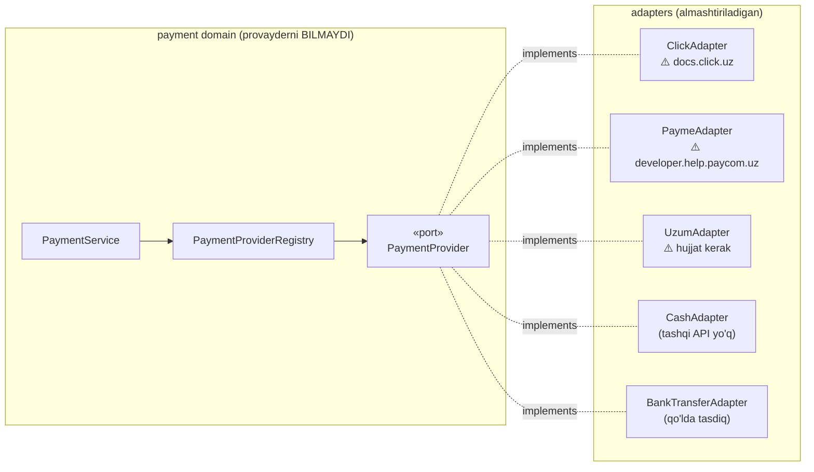
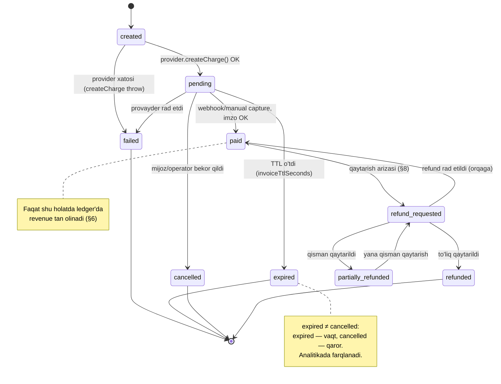
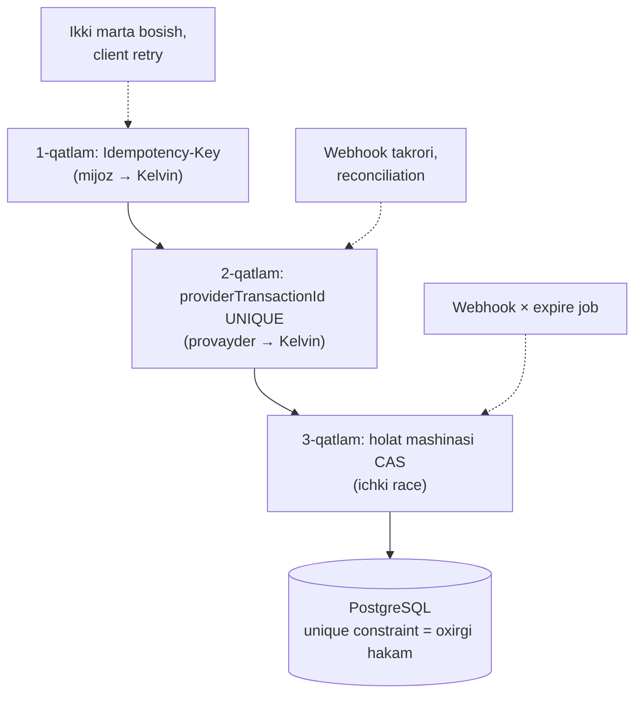
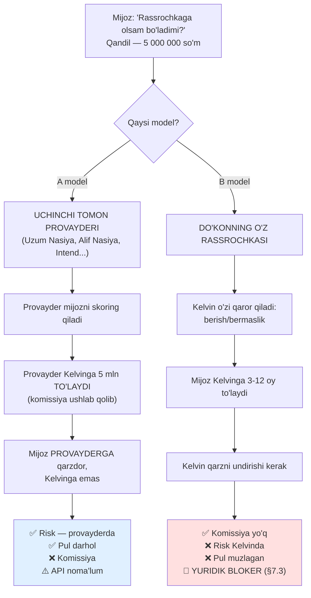
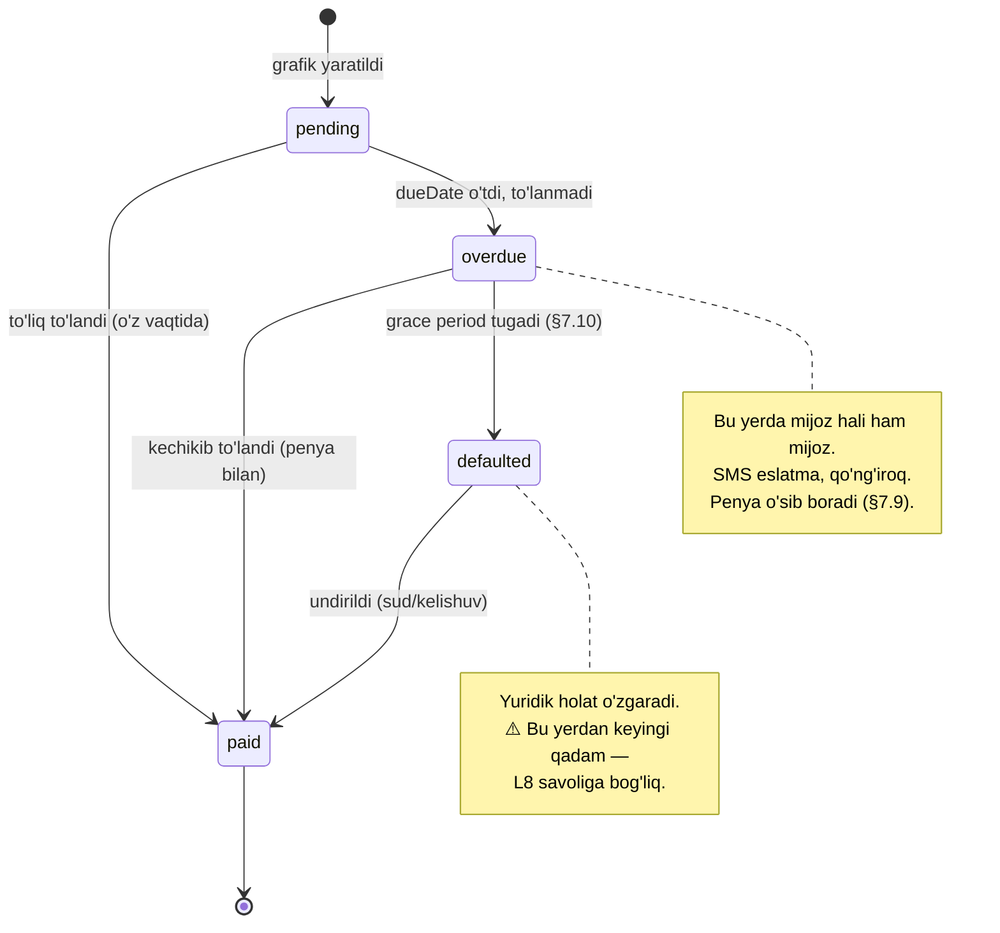
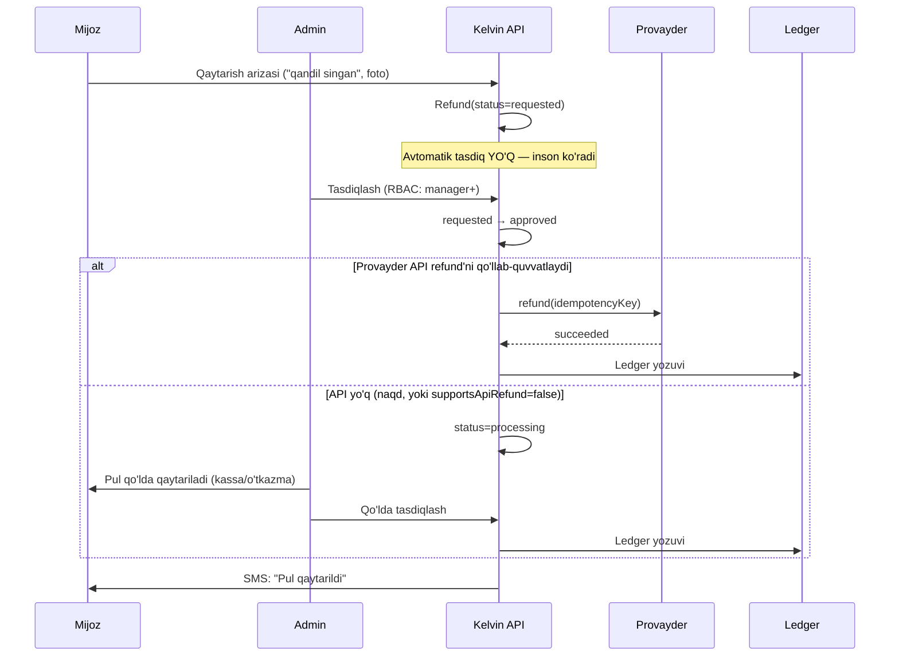
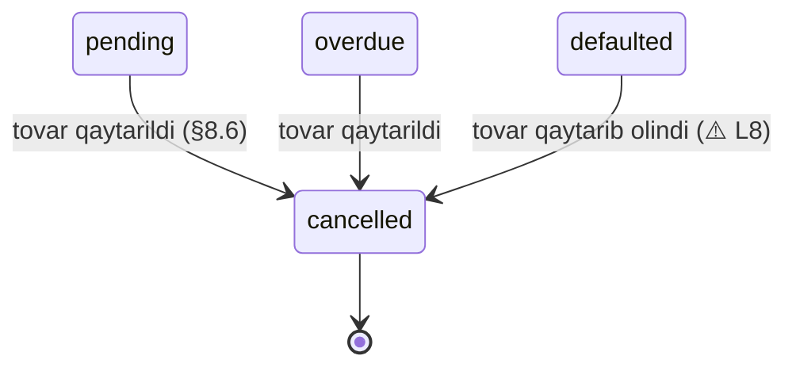
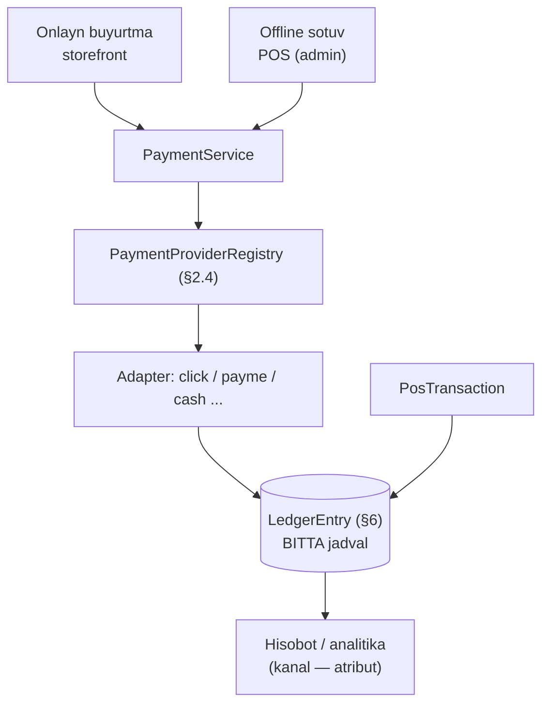

# 08 — To'lov va rassrochka (`payment`)

> **Modul:** `payment` (CANON §7, #6)
> **Bog'liq modullar:** `order` (§5), `inventory` (§8), `pos` (§11), `crm` (§10), `notification` (§16)
> **Bog'liq hujjatlar:** `docs/06-inventory-and-reservations.md`, `docs/09-delivery-and-operations.md`
> **Status:** loyihalash (implementatsiya yo'q)
> **⚠️ BLOKER:** bu hujjatda **8 ta yuridik/buxgalteriya bloker savoli** bor
> (§7.3, §10, §14.4, jamlanma — §15.1: Q-01…Q-08). Ular hal bo'lmaguncha
> `payment` moduli **to'liq ishga tushirilmaydi**.

---

## 0. Nima uchun bu hujjat alohida va nega u eng qattiq

`inventory` da xato bo'lsa — do'kon yo'q tovarni sotadi (`docs/06`, §0). Bu yomon,
lekin tuzatib bo'ladi: qo'ng'iroq qilasan, uzr so'raysan, pulni qaytarasan.

`payment` da xato bo'lsa — **pul yo'qoladi yoki ikki marta olinadi**. Buni "uzr
so'rash" bilan tuzatib bo'lmaydi, chunki:

1. **Pul — davlat nazoratidagi narsa.** Soliq organiga noto'g'ri raqam ketsa, bu
   texnik bag emas, huquqiy masala (§10).
2. **Xato jim yuradi.** Oversell darhol ko'rinadi — mijoz qo'ng'iroq qiladi. Pul
   xatosi oylar davomida ledger'da yotadi va faqat yakuniy hisobotda chiqadi.
3. **Xatoni orqaga qaytarib bo'lmaydi.** `UPDATE` bilan qoldiqni tuzatish mumkin.
   Provayder hisobidan yechilgan pulni `UPDATE` bilan qaytarib bo'lmaydi.

Shu sababdan bu hujjat butun boshli uch qoidaga tayanadi va ular muhokama
qilinmaydi:

| #   | Qoida                                                                    | Manba        | Nega |
| --- | ------------------------------------------------------------------------ | ------------ | ---- |
| 1   | Pul — **`BigInt`, tiyinda**. Float **hech qachon**                       | CANON §8     | §3.1 |
| 2   | Har bir pul harakati — **double-entry ledger'da**. `balance` ustuni yo'q | Bu hujjat §6 | §6.1 |
| 3   | Har bir yozuv operatsiyasi — **idempotent**                              | Bu hujjat §5 | §5.1 |

### 0.1 Bu hujjat NIMA YOZMAYDI (ataylab)

CANON §10 ga muvofiq:

- **Click/Payme/Uzum API detallari yozilmaydi.** Endpoint nomi, parametr nomi,
  imzo algoritmi, xato kodlari — bularning **hech biri** bu yerda yo'q. Sabab
  oddiy: men ularni aniq bilmayman, to'qib chiqarish esa eng yomon variant —
  ishonchli ko'rinadi, lekin noto'g'ri. Har bir shunday joy
  **⚠️ TEKSHIRILISHI KERAK** deb belgilangan va manba ko'rsatilgan
  (`docs.click.uz`, `developer.help.paycom.uz`).
- **Rassrochka provayderlari API'lari yozilmaydi** (Uzum Nasiya, Alif Nasiya,
  Intend) — CANON §6 da aynan shu ogohlantirish bor.
- **Yuridik maslahat berilmaydi.** "Litsenziya kerakmi?", "QQS necha foiz?",
  "fiskal chek qanday yuboriladi?" — bular **ochiq savol** sifatida belgilangan,
  javob berilmagan. Men yurist emasman va bu yerda taxmin qilish zarar keltiradi.

Buning o'rniga bu hujjat **provayderdan qat'i nazar amal qiladigan** narsani
yozadi: abstraksiya, pul matematikasi, holat mashinasi, ledger, idempotentlik,
test. Bular Click ham, Payme ham, ertaga chiqadigan yangi provayder ham
o'zgartirmaydigan qism. API detali — adapter ichidagi 200 qator, arxitektura esa
qolgan hammasi.

---

## 1. To'lov provayderlari — O'zbekiston realiyasi

### 1.1 Manzara

Kelvin — O'zbekiston bozoridagi bitta do'kon (CANON §1). Bu yerda to'lov manzarasi
G'arbdan **tubdan farq qiladi**, va buni tushunmasdan arxitektura qurish
mumkin emas.

| Kanal                       | Turi             | Kim ishlatadi  | Kelvin uchun ahamiyati                  |
| --------------------------- | ---------------- | -------------- | --------------------------------------- |
| **Click**                   | To'lov tizimi    | Ommaviy        | Yuqori — onlayn to'lovning asosiy qismi |
| **Payme**                   | To'lov tizimi    | Ommaviy        | Yuqori                                  |
| **Uzum Bank**               | Bank + super-app | O'suvchi       | O'rta-yuqori (rassrochka bilan bog'liq) |
| **Naqd (kuryerga)**         | Offline          | Juda keng      | **Juda yuqori** — §1.4                  |
| **POS terminal (do'konda)** | Offline          | Keng           | Yuqori — `docs/08` §9                   |
| **Bank o'tkazmasi**         | B2B              | Yuridik shaxs  | O'rta — §1.5                            |
| **Rassrochka**              | Kredit           | Qimmat tovarda | **Kritik** — §7                         |

### 1.2 Kartalar: UzCard, Humo, Visa/Mastercard

O'zbekistonda **ikkita mahalliy karta tizimi** hukmron:

- **UzCard** — milliy protsessing tizimi.
- **Humo** — ikkinchi milliy tizim.

Aholining asosiy kartasi — shu ikkitasidan biri (yoki ikkalasi). **Visa/Mastercard
mavjud, lekin cheklangan**: ko'pincha valyuta karta sifatida, chet elga to'lov
uchun. Mahalliy do'konda so'mda to'lash uchun odam odatda UzCard/Humo ishlatadi.

**Arxitektura uchun xulosa (muhim):**

Kelvin **karta tizimi bilan bevosita ishlamaydi**. UzCard/Humo bilan integratsiya —
bu Click/Payme/Uzum ning ishi. Kelvin uchun karta turi — **provayder qaytargan
metadata**, ko'pi bilan chek va analitika uchun. Kelvin hech qachon karta raqamini
ko'rmaydi (§11).

Ya'ni:

```
Mijoz → Click/Payme/Uzum → UzCard/Humo protsessing → bank
                ↑
         Kelvin faqat shu yerda
```

> ⚠️ **TEKSHIRILISHI KERAK:** har bir provayder qaysi karta tizimlarini qo'llab-quvvatlashi,
> Visa/Mastercard qabul qilinishi va komissiya stavkalari — rasmiy hujjat va
> shartnomadan olinadi (`docs.click.uz`, `developer.help.paycom.uz`). Bu hujjatda
> komissiya raqami **yozilmagan**, chunki u shartnomaga bog'liq va men uni bilmayman.

### 1.3 Click, Payme, Uzum — nima ma'lum va nima noma'lum

**Ma'lum (umumiy, xavfsiz da'volar):**

- Uchalasi ham **hosted/redirect yoki invoice** modeliga o'xshash oqim taklif qiladi:
  Kelvin to'lov niyatini yaratadi, mijoz provayder tomonida to'laydi, natija
  Kelvinga **webhook** (server-to-server) orqali keladi.
- Uchalasi ham **webhook imzosi**ni qandaydir shaklda qo'llaydi (§11.3).
- Uchalasida ham **transaction ID** tushunchasi bor — bu Kelvin uchun
  `providerTransactionId` bo'ladi va **unique** bo'lishi shart (§5.3).
- Click'ning **Click Up** (ilova) va **Click Pass** (kassada QR/telefon orqali)
  degan mahsulotlari bor — birinchisi onlayn, ikkinchisi offline/POS ssenariysi
  bilan bog'liq.

**⚠️ NOMA'LUM — TO'QIB CHIQARILMAYDI:**

| Savol                                                                    | Manba                                        |
| ------------------------------------------------------------------------ | -------------------------------------------- |
| Endpoint URL, HTTP metod, parametr nomlari                               | `docs.click.uz` / `developer.help.paycom.uz` |
| Imzo algoritmi (MD5/HMAC/SHA?) va imzolanadigan qatorning aniq tuzilishi | Rasmiy hujjat                                |
| Xato kodlari ro'yxati va ularning semantikasi                            | Rasmiy hujjat                                |
| `Prepare`/`Complete` kabi ikki fazali oqim bormi va u qanday ishlaydi    | Rasmiy hujjat                                |
| Refund API bormi, qisman refund qo'llab-quvvatlanadimi                   | Rasmiy hujjat + shartnoma                    |
| Settlement (pul do'kon hisobiga qachon tushadi) davri                    | Shartnoma                                    |
| Sandbox muhiti bor-yo'qligi va unga kirish tartibi                       | Rasmiy hujjat                                |
| Komissiya stavkasi                                                       | Shartnoma                                    |

**Bu jadval — ish rejasi.** Har bir qator adapter yozilishidan **oldin**
to'ldirilishi shart (§14, AC-P1).

### 1.4 Naqd — bu O'zbekistonda birinchi darajali oqim

G'arb e-commerce hujjatlarida "cash on delivery" — chekka ssenariy. O'zbekistonda
**bu asosiy oqimlardan biri**, ayniqsa qimmat tovarda: odam 3 mln so'mlik qandilni
ko'rmasdan onlayn to'lashni istamaydi. "Keltiring, ko'ray, keyin to'layman."

Bu arxitekturaga to'g'ridan-to'g'ri ta'sir qiladi:

1. **Naqd — bu ham `PaymentProvider`.** U ham `payment` moduli orqali o'tadi,
   ledger'ga tushadi (§6), holat mashinasiga bo'ysunadi (§4). "Naqd — pul emas,
   uni keyin hisoblaymiz" — bu xato. Naqd — eng ko'p yo'qoladigan pul.
2. **Naqdda `paid` momenti boshqa.** Click'da pul webhook kelganda tasdiqlanadi.
   Naqdda — **kuryer pulni olganda**. Ya'ni `paid` ni kuryer ilovasi
   (`docs/09`, §5) yoki operator qo'lda belgilaydi. Bu — inson qaroriga tayangan
   holat o'tishi, demak **audit log majburiy** (§6.5).
3. **Kuryer qo'lida pul qoladi.** Bu Kelvin balansidagi real aktiv, lekin bankda
   emas. Ledger'da alohida hisob kerak: `asset.cash.courier` (§6.3). Kuryer
   pulni kassaga topshirganda — o'tkazma yozuvi. Topshirmasa — ledger buni
   **ko'rsatib turadi**. Bu bug emas, bu funksiya.

### 1.5 Bank o'tkazmasi (yuridik shaxs)

Yoritish do'konida B2B ulushi bor: ofis, restoran, qurilish tashkiloti trek
tizimini yoki 40 ta spotni bir yo'la oladi. Ular naqd yoki Click bilan
to'lamaydi — **hisob-faktura** (invoice) so'raydi va bank o'tkazmasi qiladi.

Xususiyatlari:

- To'lov **asinxron va sekin**: hisob berildi → 1-5 kun → pul keldi.
- Webhook **yo'q**. Pul kelganini kimdir (buxgalter) tasdiqlaydi yoki bank
  vipiskasi import qilinadi.
- Ya'ni bu — `manual_confirmation` tipidagi provayder. Interfeys bir xil,
  `capture` esa inson tomonidan chaqiriladi.

> ⚠️ **TEKSHIRILISHI KERAK:** yuridik shaxsga sotishda hujjat talablari (hisob-faktura
> shakli, shartnoma, EDI/E-faktura tizimi). O'zbekistonda elektron hisob-faktura
> tizimi mavjud — lekin uning Kelvin uchun majburiyligi va integratsiya usuli
> **buxgalter bilan tasdiqlanishi kerak**. → Ochiq savol Q-19.

---

## 2. Provider abstraksiyasi

### 2.1 Muammo va talab

Talab aniq: **yangi provayder qo'shish uchun mavjud kodga tegilmasin.** Bugun
Click va Payme bor; ertaga Uzum qo'shiladi; indinga ikkalasidan biri shartnomani
bekor qiladi.

Eng ko'p uchraydigan xato — provayder nomini biznes-mantiqqa olib kirish:

```ts
// ❌ SHUNDAY QILMAYMIZ
async function pay(order: Order, method: string) {
  if (method === 'click') {
    const res = await clickApi.createInvoice(order.total); // ...
  } else if (method === 'payme') {
    const res = await paymeApi.receiptsCreate(order.total); // ...
  } else if (method === 'cash') {
    // naqd uchun umuman boshqa yo'l
  }
}
```

Nima uchun yomon: har yangi provayder — bu `if` shoxi; har `if` shoxi —
`order` modulida o'zgarish; har o'zgarish — regressiya riski **allaqachon
ishlayotgan** to'lov yo'lida. Bu — pul kodida qabul qilib bo'lmaydigan narx.

### 2.2 Yechim: port + adapter (strategiya pattern)

`payment` moduli **portni** (interfeys) e'lon qiladi. Har provayder — **adapter**.
Registry adapterni `PaymentProviderCode` bo'yicha topadi. Biznes-mantiq faqat
portni ko'radi, hech qachon adapterni bilmaydi.



**Diagrammadagi asosiy nuqta:** `CashAdapter` ham port ortida. Naqd — tashqi API'si
yo'q provayder, xolos. Shu tufayli naqd sotuv ham xuddi Click kabi ledger'ga,
holat mashinasiga va reconciliation'ga tushadi (§1.4).

### 2.3 Port interfeysi — to'liq TypeScript

```ts
// packages/contracts/src/payment/provider.port.ts

import type { Money } from './money';

/** CANON §6: Click, Payme, Uzum + offline kanallar. */
export type PaymentProviderCode = 'click' | 'payme' | 'uzum' | 'cash' | 'bank_transfer';

/**
 * Provayder qanday tasdiqlanadi.
 * - 'webhook': provayder server-to-server xabar yuboradi (Click, Payme, Uzum).
 * - 'manual':  inson tasdiqlaydi (naqd — kuryer; bank o'tkazmasi — buxgalter).
 * Bu farq PaymentService uchun muhim: 'manual' da timeout/expire siyosati boshqa.
 */
export type ConfirmationMode = 'webhook' | 'manual';

export interface ProviderCapabilities {
  readonly confirmation: ConfirmationMode;
  /** Provayder qisman refund'ni qo'llab-quvvatlaydimi. ⚠️ har provayder uchun tekshiriladi. */
  readonly supportsPartialRefund: boolean;
  /** Provayder API orqali refund qila oladimi (yo'q bo'lsa — qo'lda). */
  readonly supportsApiRefund: boolean;
  /** Provayder hisobotini yuklab olish mumkinmi (reconciliation uchun, §12). */
  readonly supportsSettlementReport: boolean;
  /** To'lov havolasi/invoice muddati. null — muddatsiz (naqd). */
  readonly invoiceTtlSeconds: number | null;
}

/** Kelvin → provayder: to'lov niyatini yarat. */
export interface CreateChargeInput {
  /** Kelvin tomonidagi yagona kalit. Provayderga uzatiladi (merchant order id). */
  readonly paymentId: string;
  readonly orderId: string;
  readonly amount: Money;
  /** Idempotentlik kaliti — §5. Adapter uni provayderga uzatishi MUMKIN. */
  readonly idempotencyKey: string;
  readonly returnUrl: string;
  readonly customerPhone: string | null;
  readonly description: string;
}

/** Provayder → Kelvin: niyat yaratildi. */
export interface CreateChargeResult {
  /** Provayderdagi ID. UNIQUE bo'ladi (§5.3). null — provayder hali bermagan. */
  readonly providerTransactionId: string | null;
  /** Mijoz yo'naltiriladigan havola. null — redirect kerak emas (naqd). */
  readonly redirectUrl: string | null;
  readonly expiresAt: Date | null;
  /** Xom javob — audit va debug uchun. Karta ma'lumoti BO'LMASLIGI shart (§11). */
  readonly raw: unknown;
}

export type ProviderPaymentStatus =
  | 'pending'
  | 'paid'
  | 'failed'
  | 'cancelled'
  | 'expired'
  | 'refunded'
  | 'partially_refunded'
  | 'unknown';

export interface ProviderPaymentState {
  readonly status: ProviderPaymentStatus;
  readonly providerTransactionId: string | null;
  readonly paidAmount: Money | null;
  readonly paidAt: Date | null;
  readonly raw: unknown;
}

export interface RefundInput {
  readonly paymentId: string;
  readonly providerTransactionId: string;
  readonly amount: Money;
  readonly idempotencyKey: string;
  readonly reason: string;
}

export interface RefundResult {
  readonly providerRefundId: string | null;
  readonly status: 'succeeded' | 'pending' | 'failed';
  readonly raw: unknown;
}

/** Webhook'ning normallashtirilgan ko'rinishi — domen shuni ko'radi. */
export interface NormalizedWebhookEvent {
  readonly providerCode: PaymentProviderCode;
  /** Provayderdagi event ID — dedup uchun (§5.4). Yo'q bo'lsa — adapter hosil qiladi. */
  readonly providerEventId: string;
  readonly providerTransactionId: string;
  readonly paymentId: string | null;
  readonly state: ProviderPaymentState;
  /** Provayder tomonidagi vaqt — replay oynasi uchun (§11.4). */
  readonly occurredAt: Date;
}

/** Xom webhook so'rovi. RAW body — imzo tekshiruvi uchun (§11.3). */
export interface RawWebhookRequest {
  readonly headers: Readonly<Record<string, string | undefined>>;
  readonly rawBody: Buffer;
}

/**
 * PORT. Har provayder shuni bajaradi. Domen boshqa hech narsani ko'rmaydi.
 */
export interface PaymentProvider {
  readonly code: PaymentProviderCode;
  readonly capabilities: ProviderCapabilities;

  createCharge(input: CreateChargeInput): Promise<CreateChargeResult>;

  /** Holatni provayderdan so'rash — webhook kelmaganda va reconciliation'da (§12). */
  getState(providerTransactionId: string): Promise<ProviderPaymentState>;

  refund(input: RefundInput): Promise<RefundResult>;

  /**
   * Imzoni tekshiradi va normallashtiradi.
   * Imzo noto'g'ri bo'lsa — MAJBURIY throw. null qaytarish TAQIQLANADI.
   */
  parseWebhook(req: RawWebhookRequest): Promise<NormalizedWebhookEvent>;

  /**
   * Provayder webhook'ga kutadigan javob. Har provayderda o'z formati bor
   * (⚠️ rasmiy hujjatdan), shuning uchun javobni ham adapter shakllantiradi.
   */
  buildWebhookResponse(result: 'accepted' | 'rejected', error?: Error): unknown;
}
```

### 2.4 Registry

```ts
// apps/api/src/payment/provider.registry.ts

import { Injectable, Inject } from '@nestjs/common';
import type { PaymentProvider, PaymentProviderCode } from '@kelvin/contracts';

export const PAYMENT_PROVIDERS = Symbol('PAYMENT_PROVIDERS');

export class UnknownProviderError extends Error {
  constructor(code: string) {
    super(`Unknown payment provider: ${code}`);
  }
}

@Injectable()
export class PaymentProviderRegistry {
  private readonly byCode: ReadonlyMap<PaymentProviderCode, PaymentProvider>;

  constructor(@Inject(PAYMENT_PROVIDERS) providers: readonly PaymentProvider[]) {
    const map = new Map<PaymentProviderCode, PaymentProvider>();
    for (const p of providers) {
      if (map.has(p.code)) {
        // Fail fast: ikki adapter bitta kodni da'vo qilsa — bu konfiguratsiya xatosi.
        throw new Error(`Duplicate payment provider code: ${p.code}`);
      }
      map.set(p.code, p);
    }
    this.byCode = map;
  }

  get(code: PaymentProviderCode): PaymentProvider {
    const provider = this.byCode.get(code);
    if (!provider) throw new UnknownProviderError(code);
    return provider;
  }

  /** Storefront'da "to'lov usuli" ro'yxatini ko'rsatish uchun. */
  listEnabled(): readonly PaymentProviderCode[] {
    return [...this.byCode.keys()];
  }
}
```

**Yangi provayder qo'shish tartibi (3 qadam, mavjud kod o'zgarmaydi):**

1. `XAdapter implements PaymentProvider` yoz.
2. `PAYMENT_PROVIDERS` provider massiviga qo'sh (DI modulida bitta qator).
3. `PaymentProviderCode` union'iga kod qo'sh.

`PaymentService`, `order`, ledger, reconciliation — **tegilmaydi**.

### 2.5 Adapter skeleti — halol "hali yozilmagan"

Quyidagi skelet **ataylab ishlamaydi**. Uning vazifasi — tuzilmani ko'rsatish va
rasmiy hujjat tekshirilmaguncha kodni ishga tushirmaslik. Bu — CANON §10:
"biznes-mantiq implementatsiyasi emas, skelet + interfeys + TODO".

```ts
// apps/api/src/payment/adapters/click.adapter.ts

import { Injectable } from '@nestjs/common';
import type {
  PaymentProvider,
  ProviderCapabilities,
  CreateChargeInput,
  CreateChargeResult,
  ProviderPaymentState,
  RefundInput,
  RefundResult,
  RawWebhookRequest,
  NormalizedWebhookEvent,
} from '@kelvin/contracts';

/**
 * Click adapteri.
 *
 * ⚠️ BU ADAPTER HALI YOZILMAGAN — ATAYLAB.
 * Quyidagilar rasmiy hujjatdan (https://docs.click.uz) tasdiqlanmaguncha
 * bironta qator yozilmaydi:
 *   1. Endpoint URL va HTTP metod
 *   2. So'rov/javob parametrlari
 *   3. Imzo algoritmi va imzolanadigan qatorning ANIQ tuzilishi
 *   4. Xato kodlari semantikasi
 *   5. Ikki fazali (Prepare/Complete) oqim bormi
 *   6. Refund API bormi, qisman refund bormi
 *   7. Sandbox ma'lumotlari
 *
 * Taxmin asosida yozilgan kod — eng qimmat kod: u ishlayotgandek ko'rinadi,
 * lekin production'da pul yo'qotadi.
 */
@Injectable()
export class ClickAdapter implements PaymentProvider {
  readonly code = 'click' as const;

  readonly capabilities: ProviderCapabilities = {
    confirmation: 'webhook',
    // ⚠️ Quyidagi 4 qiymat TAXMIN EMAS, PLACEHOLDER. Hujjatdan tasdiqlanadi.
    supportsPartialRefund: false,
    supportsApiRefund: false,
    supportsSettlementReport: false,
    invoiceTtlSeconds: null,
  };

  createCharge(_input: CreateChargeInput): Promise<CreateChargeResult> {
    throw new Error('Not implemented: verify docs.click.uz first');
  }

  getState(_providerTransactionId: string): Promise<ProviderPaymentState> {
    throw new Error('Not implemented: verify docs.click.uz first');
  }

  refund(_input: RefundInput): Promise<RefundResult> {
    throw new Error('Not implemented: verify docs.click.uz first');
  }

  parseWebhook(_req: RawWebhookRequest): Promise<NormalizedWebhookEvent> {
    // Imzo tekshiruvi RAW body ustidan, timing-safe compare bilan (§11.3).
    throw new Error('Not implemented: verify docs.click.uz first');
  }

  buildWebhookResponse(_result: 'accepted' | 'rejected', _error?: Error): unknown {
    throw new Error('Not implemented: verify docs.click.uz first');
  }
}
```

`PaymeAdapter` va `UzumAdapter` — aynan shu shaklda, mos manba bilan
(`developer.help.paycom.uz`; Uzum uchun rasmiy hujjat havolasi hali aniqlanmagan
→ Ochiq savol Q-11).

### 2.6 `CashAdapter` — tashqi API'siz adapter

Naqd adapteri esa **hozir ham yozilishi mumkin**, chunki unda noma'lum narsa yo'q:

```ts
// apps/api/src/payment/adapters/cash.adapter.ts

@Injectable()
export class CashAdapter implements PaymentProvider {
  readonly code = 'cash' as const;

  readonly capabilities: ProviderCapabilities = {
    confirmation: 'manual', // kuryer/kassir tasdiqlaydi (§1.4)
    supportsPartialRefund: true, // kassadan qisman qaytarish — jismonan mumkin
    supportsApiRefund: false, // API yo'q: pul qo'ldan beriladi
    supportsSettlementReport: false,
    invoiceTtlSeconds: null, // naqd "muddati o'tmaydi"
  };

  async createCharge(input: CreateChargeInput): Promise<CreateChargeResult> {
    // Tashqi chaqiruv yo'q. Payment `pending` holatda qoladi va kuryer
    // pulni olganda `capture` qo'lda chaqiriladi (§4.4).
    return {
      providerTransactionId: `cash:${input.paymentId}`, // unique constraint bajarilsin
      redirectUrl: null,
      expiresAt: null,
      raw: { mode: 'manual' },
    };
  }

  async getState(_id: string): Promise<ProviderPaymentState> {
    // Naqdda tashqi haqiqat manbai yo'q — Kelvin ledger'i O'ZI manba.
    return {
      status: 'unknown',
      providerTransactionId: null,
      paidAmount: null,
      paidAt: null,
      raw: null,
    };
  }

  async refund(_input: RefundInput): Promise<RefundResult> {
    // Pul jismonan qaytariladi; tizim faqat faktni qayd etadi.
    return { providerRefundId: null, status: 'pending', raw: { mode: 'manual' } };
  }

  async parseWebhook(): Promise<NormalizedWebhookEvent> {
    throw new Error('Cash provider has no webhooks');
  }

  buildWebhookResponse(): unknown {
    throw new Error('Cash provider has no webhooks');
  }
}
```

**Nima uchun bu muhim:** naqd adapteri port to'g'ri loyihalanganini isbotlaydi.
Agar interfeys faqat Click'ga moslashtirilgan bo'lsa, naqd unga sig'maydi. Sig'di —
demak abstraksiya haqiqatan ham provayderdan mustaqil.

---

## 3. Pul qoidalari — `Money`

### 3.1 Nima uchun float TAQIQLANADI (CANON §8)

Bu qoida did masalasi emas. IEEE-754 `double` ikkilik kasr bilan ishlaydi va
o'nlik kasrni **aniq ifodalay olmaydi**:

```ts
0.1 + 0.2 === 0.3; // false
0.1 + 0.2; // 0.30000000000000004
1_666_666.67 * 3; // 5000000.009999999
```

Oxirgi qator — aynan bizning holat: 5 mln so'mlik qandil, 3 oylik rassrochka.
Float bilan grafik yig'indisi asl summaga **teng chiqmaydi**. Bu 1 tiyin emas —
bu **ledger invariantining buzilishi** (§6.4), ya'ni butun buxgalteriya
ishonchsiz bo'lib qoladi.

`Number` ning ikkinchi muammosi: `Number.MAX_SAFE_INTEGER` = 9_007_199_254_740_991.
Tiyinda hisoblaganda bu ≈ 90 mlrd so'm. Bitta to'lov uchun yetadi, lekin
**yillik aylanma yig'indisi** yoki ledger bo'yicha `SUM()` uchun chegaraga
yaqinlashish mumkin. `BigInt` da bunday chegara yo'q.

**Qoida (CANON §8, muhokama qilinmaydi):**

- Xotirada: `bigint`, **tiyinda** (1 so'm = 100 tiyin).
- DB da: `BigInt` ustun + alohida `currency` ustuni.
- API/JSON da: **string** (`"500000000"`), chunki JSON `number` — bu float.
  `BigInt` `JSON.stringify` da xato beradi va bu yaxshi: bizni majburlaydi.
- UI da: faqat formatlashda `so'm` ga o'giriladi va **hech qachon qayta hisoblanmaydi**.

> **Eslatma UZS haqida:** tiyin amalda muomalada yo'q — narxlar so'mda, ko'pincha
> 1000 so'mgacha yaxlitlangan. Lekin **ichki hisob-kitob tiyinda yuritiladi**:
> foiz, chegirma, bo'lish — bularning oralig'ida tiyin paydo bo'ladi va uni
> yo'qotmaslik kerak. Yaxlitlash — faqat chegarada (mijozga ko'rsatiladigan
> grafik, §7.6). Bu — CANON §8 ning to'g'ri o'qilishi.

### 3.2 `Money` klassi

```ts
// packages/contracts/src/payment/money.ts

export type CurrencyCode = 'UZS';

/** Har valyuta uchun minor birlik darajasi. UZS: 1 so'm = 100 tiyin. */
const MINOR_UNITS: Readonly<Record<CurrencyCode, number>> = { UZS: 2 };

export class CurrencyMismatchError extends Error {
  constructor(a: CurrencyCode, b: CurrencyCode) {
    super(`Currency mismatch: ${a} vs ${b}`);
  }
}

/**
 * Immutable pul qiymati. Ichkarida — TIYIN (minor unit), bigint.
 * CANON §8: float hech qachon.
 */
export class Money {
  private constructor(
    readonly minor: bigint,
    readonly currency: CurrencyCode,
  ) {
    Object.freeze(this);
  }

  /** Tiyindan. Asosiy konstruktor — kod shuni ishlatadi. */
  static fromMinor(minor: bigint | number | string, currency: CurrencyCode = 'UZS'): Money {
    if (typeof minor === 'number' && !Number.isInteger(minor)) {
      // Bu — float sizib kirgan joy. Jim yaxlitlash O'RNIGA — throw.
      throw new TypeError(`Money.fromMinor requires an integer, got ${minor}`);
    }
    return new Money(BigInt(minor), currency);
  }

  /**
   * So'mdan. FAQAT chegarada ishlatiladi (admin kiritdi, seed, test).
   * String qabul qiladi, chunki "1666666.67" ni float orqali o'tkazish — yo'qotish.
   */
  static fromMajor(major: string | number | bigint, currency: CurrencyCode = 'UZS'): Money {
    const exp = MINOR_UNITS[currency];
    const s = typeof major === 'string' ? major.trim() : String(major);
    const m = /^(-)?(\d+)(?:\.(\d+))?$/.exec(s);
    if (!m) throw new TypeError(`Invalid major amount: ${s}`);
    const [, sign, whole, frac = ''] = m;
    if (frac.length > exp) {
      // "1666666.666" UZS uchun — bu tiyindan kichik. Jim kesish TAQIQ.
      throw new TypeError(`Too many fraction digits for ${currency}: ${s}`);
    }
    const padded = frac.padEnd(exp, '0');
    const minor = BigInt(whole) * 10n ** BigInt(exp) + BigInt(padded || '0');
    return new Money(sign === '-' ? -minor : minor, currency);
  }

  static zero(currency: CurrencyCode = 'UZS'): Money {
    return new Money(0n, currency);
  }

  private assertSame(other: Money): void {
    if (this.currency !== other.currency) {
      throw new CurrencyMismatchError(this.currency, other.currency);
    }
  }

  add(other: Money): Money {
    this.assertSame(other);
    return new Money(this.minor + other.minor, this.currency);
  }

  subtract(other: Money): Money {
    this.assertSame(other);
    return new Money(this.minor - other.minor, this.currency);
  }

  /** Butun songa ko'paytirish (masalan, savatdagi miqdor). */
  multiply(factor: bigint | number): Money {
    if (typeof factor === 'number' && !Number.isInteger(factor)) {
      throw new TypeError('Money.multiply requires an integer factor; use percentage() for rates');
    }
    return new Money(this.minor * BigInt(factor), this.currency);
  }

  /**
   * Foiz — BASIS POINT da (1 bp = 0.01%). 12% = 1200 bp.
   * Nega bp: "12.5%" ni float bilan ifodalash yana o'sha muammo. bp — butun son.
   *
   * Yaxlitlash: HALF_UP (0.5 — yuqoriga, musbat tomonga).
   * ASOSLASH: bu — foiz/QQS uchun keng tarqalgan tijorat konvensiyasi va u
   * simmetrik (manfiy summada ham kattaligi bo'yicha yuqoriga). ⚠️ Soliq
   * hisobida yaxlitlash qoidasi qonun bilan belgilangan bo'lishi mumkin —
   * buxgalter bilan tasdiqlanadi (Ochiq savol Q-03).
   */
  percentage(basisPoints: bigint | number): Money {
    const bp = BigInt(basisPoints);
    const numerator = this.minor * bp;
    const denominator = 10_000n;
    return new Money(divideHalfUp(numerator, denominator), this.currency);
  }

  isZero(): boolean {
    return this.minor === 0n;
  }
  isNegative(): boolean {
    return this.minor < 0n;
  }
  equals(other: Money): boolean {
    return this.currency === other.currency && this.minor === other.minor;
  }
  compare(other: Money): -1 | 0 | 1 {
    this.assertSame(other);
    return this.minor < other.minor ? -1 : this.minor > other.minor ? 1 : 0;
  }

  /** JSON — string. JSON number float, unga pul berilmaydi. */
  toJSON(): { amount: string; currency: CurrencyCode } {
    return { amount: this.minor.toString(), currency: this.currency };
  }

  /** Faqat ko'rsatish uchun. Natija bilan hisob-kitob QILINMAYDI. */
  format(locale: 'uz-UZ' | 'ru-RU' = 'uz-UZ'): string {
    const exp = MINOR_UNITS[this.currency];
    const div = 10n ** BigInt(exp);
    const whole = this.minor / div;
    const frac = (this.minor < 0n ? -this.minor : this.minor) % div;
    const wholeStr = new Intl.NumberFormat(locale).format(whole);
    return frac === 0n
      ? `${wholeStr} so'm`
      : `${wholeStr},${frac.toString().padStart(exp, '0')} so'm`;
  }

  /**
   * ALLOCATE — tiyin yo'qotmasdan bo'lish. Bu klassdagi eng muhim metod.
   * §3.3 da batafsil.
   */
  allocate(ratios: readonly bigint[]): Money[] {
    if (ratios.length === 0) throw new TypeError('allocate: ratios must not be empty');
    if (ratios.some((r) => r < 0n)) throw new TypeError('allocate: ratios must be non-negative');

    const total = ratios.reduce((a, b) => a + b, 0n);
    if (total === 0n) throw new TypeError('allocate: ratio sum must be > 0');

    const shares: bigint[] = [];
    let distributed = 0n;

    // 1-qadam: har kimga PASTGA yaxlitlangan ulush (floor, manfiy cheksizlik tomon).
    for (const r of ratios) {
      const share = floorDiv(this.minor * r, total);
      shares.push(share);
      distributed += share;
    }

    // 2-qadam: qoldiq. floor tufayli |qoldiq| < ratios.length — HAR DOIM.
    let remainder = this.minor - distributed;

    // 3-qadam: qoldiqni birma-bir tarqatamiz (largest remainder o'rniga —
    // barqaror tartib: birinchi kelganga). Nega barqaror tartib: natija
    // deterministik bo'lishi shart (CANON §9.5 — determinizm majburiy).
    const step = remainder >= 0n ? 1n : -1n;
    for (let i = 0; remainder !== 0n; i = (i + 1) % shares.length) {
      shares[i] += step;
      remainder -= step;
    }

    return shares.map((s) => new Money(s, this.currency));
  }

  /** Teng bo'lish — allocate ustidagi qulaylik. */
  split(parts: number): Money[] {
    return this.allocate(Array.from({ length: parts }, () => 1n));
  }
}

/** Nolga qarab emas, MANFIY CHEKSIZLIK tomon bo'lish. bigint `/` nolga qarab kesadi. */
function floorDiv(a: bigint, b: bigint): bigint {
  const q = a / b;
  return a % b !== 0n && a < 0n !== b < 0n ? q - 1n : q;
}

/** HALF_UP: kattalik bo'yicha yaxlitlash (|x| ning yarmi — yuqoriga). */
function divideHalfUp(a: bigint, b: bigint): bigint {
  const neg = a < 0n !== b < 0n;
  const absA = a < 0n ? -a : a;
  const absB = b < 0n ? -b : b;
  const q = (2n * absA + absB) / (2n * absB);
  return neg ? -q : q;
}
```

### 3.3 `allocate()` — tiyin qayerga ketadi

**Masala (topshiriqdagi aniq misol):** 5 000 000 so'mni 3 oyga bo'lamiz.

```
5 000 000 so'm            = 500 000 000 tiyin
500 000 000 / 3           = 166 666 666.666...  tiyin
floor(...)                = 166 666 666 tiyin  (× 3 = 499 999 998)
qoldiq                    = 2 tiyin
```

**2 tiyin qayerdadir bo'lishi SHART.** Uch xil yechim bor va ularning ikkitasi
xato:

| Yondashuv                          | Natija                                  | Yig'indi        | Baho                         |
| ---------------------------------- | --------------------------------------- | --------------- | ---------------------------- |
| `1 666 666.67 × 3` (float, yaxlit) | 1 666 666.67 ×3                         | 5 000 000.01    | ❌ Do'kon 1 tiyin ko'p oladi |
| `1 666 666.66 × 3` (kesish)        | 1 666 666.66 ×3                         | 4 999 999.98    | ❌ Do'kon 2 tiyin yo'qotadi  |
| **`allocate([1,1,1])`**            | 166 666 667 / 166 666 667 / 166 666 666 | **500 000 000** | ✅ Aniq                      |

`allocate` natijasi (tiyinda):

```ts
Money.fromMajor('5000000').allocate([1n, 1n, 1n]);
// [166_666_667n, 166_666_667n, 166_666_666n]  → yig'indi 500_000_000n ✅
```

**Invariant (buzilmaydi):**

```
sum(money.allocate(ratios)) === money      // har doim, har qanday ratios uchun
```

Bu §13.3 da 1000 ta tasodifiy holatda `fast-check` bilan tekshiriladi.

### 3.4 Yaxlitlash yo'nalishi — har bo'lishda asoslanadi

CANON "har texnik da'vo ortida sabab bo'lsin" deydi. Yaxlitlash yo'nalishi —
aynan shunday joy. Umumiy "hamma joyda HALF_UP" qoidasi **noto'g'ri**: yo'nalish
kimga foyda berishiga qarab tanlanadi va har safar yoziladi.

| Joy                                  | Yo'nalish                      | Asos                                                            |
| ------------------------------------ | ------------------------------ | --------------------------------------------------------------- |
| `allocate()` (grafik, ulush)         | floor + qoldiqni tarqatish     | Yig'indi saqlanishi shart — bu yagona to'g'ri yo'l              |
| `percentage()` (foiz, QQS)           | HALF_UP                        | Tijorat konvensiyasi; ⚠️ soliq uchun Q-03                       |
| Chegirma summasi                     | **mijoz foydasiga** (yuqoriga) | 1 tiyin do'konga arzimaydi; mijoz "chegirma kam bo'ldi" demasin |
| Penya (§7.9)                         | **mijoz foydasiga** (pastga)   | Jarima — nozik joy. Kam olish xavfsiz, ko'p olish nizo          |
| Mijozga ko'rsatiladigan oylik to'lov | so'mgacha (§7.6)               | Tiyin muomalada yo'q; UI da "1 666 666,67" — bema'ni            |

**Muhim nuance:** oxirgi qatordagi yaxlitlash **grafik yig'indisini buzmasligi**
kerak. Yechim §7.6 da: so'mgacha yaxlitlash `allocate` dan **keyin** emas,
**ichida** qilinadi — oxirgi oy farqni yutadi.

---

## 4. To'lov holat mashinasi

### 4.1 Diagramma



**Terminal holatlar:** `failed`, `expired`, `cancelled`, `refunded`.
`partially_refunded` — terminal EMAS: undan yana refund so'ralishi mumkin.

### 4.2 Ruxsat etilgan o'tishlar — kodda

```ts
// apps/api/src/payment/payment.state.ts

export type PaymentStatus =
  | 'created'
  | 'pending'
  | 'paid'
  | 'failed'
  | 'expired'
  | 'cancelled'
  | 'refund_requested'
  | 'refunded'
  | 'partially_refunded';

/** Yagona haqiqat manbai. Diagramma — shuning ko'rinishi, aksincha emas. */
const TRANSITIONS: Readonly<Record<PaymentStatus, readonly PaymentStatus[]>> = {
  created: ['pending', 'failed'],
  pending: ['paid', 'failed', 'expired', 'cancelled'],
  paid: ['refund_requested'],
  refund_requested: ['refunded', 'partially_refunded', 'paid'],
  partially_refunded: ['refund_requested'],
  failed: [],
  expired: [],
  cancelled: [],
  refunded: [],
};

export function canTransition(from: PaymentStatus, to: PaymentStatus): boolean {
  return TRANSITIONS[from].includes(to);
}

export class InvalidTransitionError extends Error {
  constructor(from: PaymentStatus, to: PaymentStatus) {
    super(`Invalid payment transition: ${from} -> ${to}`);
  }
}

/** Race'da yutqazgan tomon shuni oladi (§4.3). */
export class PaymentStateConflictError extends Error {
  constructor(id: string, expected: PaymentStatus) {
    super(`Payment ${id} is no longer in expected state ${expected}`);
  }
}
```

### 4.3 O'tish — compare-and-set (race condition)

**Muammo real.** Click webhook'i keladi va **ayni paytda** BullMQ'dagi expire
job'i ishga tushadi. Ikkalasi ham `pending` ni o'qiydi. Birinchisi `paid`,
ikkinchisi `expired` yozadi. Natija — pul olingan, buyurtma bekor qilingan.

Naive kod aynan shunga olib keladi:

```ts
// ❌ SHUNDAY QILMAYMIZ — read-then-write, oraliqda hamma narsa bo'lishi mumkin
const payment = await prisma.payment.findUnique({ where: { id } });
if (!canTransition(payment.status, 'paid')) throw new InvalidTransitionError(...);
await prisma.payment.update({ where: { id }, data: { status: 'paid' } });
```

Yechim — **shartni `WHERE` ga kiritish** (compare-and-set). O'qish va yozish
o'rtasida oraliq qolmaydi: DB o'zi hakam bo'ladi.

```ts
// apps/api/src/payment/payment.repository.ts

async transition(
  tx: Prisma.TransactionClient,
  id: string,
  from: PaymentStatus,
  to: PaymentStatus,
  patch: Prisma.PaymentUpdateInput = {},
): Promise<void> {
  if (!canTransition(from, to)) throw new InvalidTransitionError(from, to);

  // CAS: status hali ham `from` bo'lsagina yozadi. Aks holda count === 0.
  const res = await tx.payment.updateMany({
    where: { id, status: from },          // ← shart shu yerda
    data: { ...patch, status: to, updatedAt: new Date() },
  });

  if (res.count === 0) {
    // Kimdir bizdan oldin ulgurdi. Bu — kutilgan holat, panic emas.
    throw new PaymentStateConflictError(id, from);
  }

  await tx.orderStatusHistory.create({ /* audit izi — §6.5 */ } as never);
}
```

**Chaqiruvchi konflikni qanday qayta ishlaydi** — bu holatga bog'liq va bu yerda
"retry qilaver" degan javob **xato**:

| Kim yutqazdi                                    | To'g'ri javob                                                                                                                                              |
| ----------------------------------------------- | ---------------------------------------------------------------------------------------------------------------------------------------------------------- |
| Webhook (`paid` yozolmadi, chunki `expired`)    | **Ogohlantirish + qo'lda ko'rib chiqish.** Pul olingan, lekin to'lov muddati o'tgan. Bu — pul bilan bog'liq nomuvofiqlik, avtomatik hal qilinmaydi (§12.4) |
| Expire job (`expired` yozolmadi, chunki `paid`) | **Jim tashlab yuborish.** To'g'ri natija allaqachon yozilgan                                                                                               |
| Webhook takrori (`paid` → `paid`)               | **Jim OK qaytarish.** Idempotentlik (§5)                                                                                                                   |

Shu sababdan `transition()` xatoni **yutmaydi** — chaqiruvchi qaror qabul qiladi.

### 4.4 `manual` provayderlar uchun o'tish

Naqd va bank o'tkazmasida `pending → paid` ni **inson** chaqiradi. Bu — eng
oson suiiste'mol qilinadigan joy (kuryer pulni oldi, tizimda "to'landi" deb
belgiladi, pulni cho'ntagiga soldi). Shuning uchun:

- O'tish **faqat** `POST /payments/:id/capture` orqali, RBAC bilan
  (`courier` faqat o'ziga biriktirilgan buyurtma; `cashier` faqat ochiq smena —
  `docs/01`, §4).
- Har o'tishda `AuditLog`: kim, qachon, qaysi qurilma, IP.
- Ledger'da pul `asset.cash.courier` ga tushadi — **bankga emas** (§6.3). Ya'ni
  tizim "kuryerda 12 mln so'm bor" deb ko'rsatib turadi. Inkassatsiya
  (§9.4) bu qarzni yopadi.

---

## 5. Idempotentlik — eng muhim qism

### 5.1 Nima uchun bu birinchi o'rinda

Idempotentlik — "yaxshi bo'lsa bo'ldi" xususiyati emas. To'lov tizimida
**takror — norma, istisno emas**:

| Ssenariy                                          | Chastota                                               | Idempotentliksiz natija                             |
| ------------------------------------------------- | ------------------------------------------------------ | --------------------------------------------------- |
| Provayder webhook'ni takrorlaydi (javobni olmadi) | **Doimiy** — bu provayderlarning normal xatti-harakati | Ledger'ga ikki marta yozuv, revenue ikki barobar    |
| Mijoz "To'lash" tugmasini ikki marta bosdi        | Tez-tez                                                | Ikkita `Payment`, ikkita rezerv, ikki marta yechish |
| Tarmoq uzildi: so'rov ketdi, javob kelmadi        | Tez-tez                                                | Client retry qiladi → ikkinchi charge               |
| BullMQ job qayta urinmoqda                        | Doimiy                                                 | Ikki marta SMS, ikki marta refund                   |
| Reconciliation job'i webhook bilan bir vaqtda     | Kunlik                                                 | Ikkita `paid` o'tishi                               |

Ya'ni: **retry — arxitekturaning bir qismi.** Savol "takror keladimi?" emas,
"takror kelganda nima bo'ladi?".

**Ta'rif:** operatsiya idempotent, agar uni N marta bajarish 1 marta bajarish
bilan **bir xil natija va bir xil yon ta'sir** bersa.

### 5.2 Uch qatlamli himoya

Bitta mexanizm yetarli emas, chunki takror uch xil joydan keladi:



**Asosiy tamoyil:** oxirgi hakam — **DB unique constraint**, ilova mantiqi emas.
Redis lock, `findFirst` tekshiruvi, mutex — bularning hammasi race'da yutqazadi.
`UNIQUE` yutqazmaydi.

### 5.3 `PaymentAttempt` — idempotentlik yozuvi

CANON §8 da entity ro'yxati qat'iy va u yerda `IdempotencyRecord` **yo'q**. Bu —
kamchilik emas, **imkoniyat**: `PaymentAttempt` aynan shu rolni bajaradi.
Yangi entity o'ylab topilmaydi (CANON §0).

Model:

- `Payment` — **niyat**: "bu buyurtma uchun shuncha pul olinishi kerak". Bitta
  buyurtmada odatda bitta `Payment`.
- `PaymentAttempt` — **urinish**: "shu niyatni provayder orqali amalga oshirish".
  Bitta `Payment` da bir nechta `PaymentAttempt` bo'lishi mumkin (birinchisi
  muvaffaqiyatsiz, ikkinchisi o'tdi).

```prisma
// apps/api/prisma/schema.prisma (parcha)

model Payment {
  id            String    @id @default(uuid(7)) @db.Uuid
  orderId       String    @map("order_id") @db.Uuid
  amount        BigInt                              // TIYIN (CANON §8)
  currency      String    @default("UZS") @db.VarChar(3)
  status        String    @db.VarChar(32)           // §4.2
  providerCode  String    @map("provider_code") @db.VarChar(32)
  paidAt        DateTime? @map("paid_at") @db.Timestamptz(3)
  createdAt     DateTime  @default(now()) @map("created_at") @db.Timestamptz(3)
  updatedAt     DateTime  @updatedAt @map("updated_at") @db.Timestamptz(3)

  attempts      PaymentAttempt[]
  refunds       Refund[]

  @@index([orderId])
  @@index([status, createdAt])
  @@map("payments")
}

model PaymentAttempt {
  id                    String    @id @default(uuid(7)) @db.Uuid
  paymentId             String    @map("payment_id") @db.Uuid
  providerCode          String    @map("provider_code") @db.VarChar(32)

  /// 1-qatlam: mijoz/client bergan kalit. Bitta payment ichida takrorlanmaydi.
  idempotencyKey        String    @map("idempotency_key") @db.VarChar(128)

  /// 2-qatlam: provayderdagi tranzaksiya. GLOBAL unique — §5.5.
  providerTransactionId String?   @map("provider_transaction_id") @db.VarChar(128)

  status                String    @db.VarChar(32)
  amount                BigInt
  currency              String    @default("UZS") @db.VarChar(3)

  /// Javobni takrorlash uchun (§5.4). Karta ma'lumoti BO'LMAYDI (§11.1).
  responseSnapshot      Json?     @map("response_snapshot")
  /// So'rov barmoq izi — bir xil kalit, boshqa summa holatini tutish (§5.4).
  requestFingerprint    String    @map("request_fingerprint") @db.VarChar(64)

  createdAt             DateTime  @default(now()) @map("created_at") @db.Timestamptz(3)
  updatedAt             DateTime  @updatedAt @map("updated_at") @db.Timestamptz(3)

  payment Payment @relation(fields: [paymentId], references: [id])

  /// 1-qatlam himoyasi
  @@unique([paymentId, idempotencyKey])
  /// 2-qatlam himoyasi: bitta provayder tranzaksiyasi — bitta urinish. HECH QACHON ikkita.
  @@unique([providerCode, providerTransactionId])
  @@map("payment_attempts")
}
```

**`@@unique([providerCode, providerTransactionId])` — bu hujjatdagi eng muhim
bitta qator.** U webhook takroridan, reconciliation qo'shaloqligidan va
provayder xatosidan **bir vaqtning o'zida** himoya qiladi. `providerCode` bilan
juftlangan, chunki turli provayderlarda ID lar to'qnashishi mumkin.

> `providerTransactionId` nullable — chunki charge yaratilishidan **oldin** ham
> attempt yoziladi (§5.6). PostgreSQL da `NULL` lar unique constraint'da
> to'qnashmaydi, ya'ni bir nechta "hali ID'siz" attempt yashab tura oladi. Bu —
> kerakli xatti-harakat.

### 5.4 `Idempotency-Key` — HTTP qatlami

```ts
// apps/api/src/payment/payment.controller.ts

@Post()
async createPayment(
  @Body() dto: CreatePaymentDto,
  @Headers('idempotency-key') idempotencyKey?: string,
): Promise<PaymentResponseDto> {
  if (!idempotencyKey || idempotencyKey.length < 16) {
    // Kalitsiz to'lov yaratishga RUXSAT BERILMAYDI. Client uni UUID sifatida
    // savat sahifasi ochilganda hosil qiladi va retry'da AYNAN o'shani yuboradi.
    throw new BadRequestException('Idempotency-Key header is required (min 16 chars)');
  }
  return this.paymentService.createPayment(dto, idempotencyKey);
}
```

Xizmat qatlamidagi mantiq — uch holat:

```ts
// apps/api/src/payment/payment.service.ts

async createPayment(dto: CreatePaymentDto, idempotencyKey: string): Promise<PaymentResponseDto> {
  const fingerprint = sha256(JSON.stringify({ orderId: dto.orderId, amount: dto.amount, provider: dto.providerCode }));

  const existing = await this.prisma.paymentAttempt.findFirst({
    where: { payment: { orderId: dto.orderId }, idempotencyKey },
  });

  if (existing) {
    // HOLAT A: bir xil kalit, BOSHQA so'rov → bu client'ning bagi. 409.
    if (existing.requestFingerprint !== fingerprint) {
      throw new ConflictException('Idempotency-Key reused with different request body');
    }
    // HOLAT B: bir xil kalit, bir xil so'rov → SAQLANGAN javobni qaytaramiz.
    // Yangi charge YARATILMAYDI. Provayderga chaqiruv YO'Q.
    if (existing.responseSnapshot) {
      return existing.responseSnapshot as unknown as PaymentResponseDto;
    }
    // HOLAT C: urinish bor, javob yo'q → oldingi so'rov yarim yo'lda uzilgan.
    // Provayderdan HAQIQIY holatni so'raymiz (§5.6).
    return this.recoverAttempt(existing);
  }

  return this.startNewAttempt(dto, idempotencyKey, fingerprint);
}
```

**HOLAT C — eng ko'p e'tibordan chetda qoladigan joy.** "Attempt yozildi, lekin
javob yo'q" degani: biz provayderga so'rov yubordik va **natijani bilmaymiz**.
Bu yerda yangi charge yaratish — ikki marta pul olish demakdir. To'g'ri javob —
`provider.getState()` bilan haqiqatni so'rash.

### 5.5 Webhook idempotentligi

```ts
// apps/api/src/payment/webhook.controller.ts

@Post(':providerCode/webhook')
@HttpCode(200)
async handleWebhook(
  @Param('providerCode') providerCode: PaymentProviderCode,
  @Req() req: RawBodyRequest<Request>,
): Promise<unknown> {
  const provider = this.registry.get(providerCode);

  let event: NormalizedWebhookEvent;
  try {
    // Imzo RAW body ustidan tekshiriladi (§11.3). Parse qilingan JSON EMAS.
    event = await provider.parseWebhook({ headers: req.headers as never, rawBody: req.rawBody! });
  } catch (err) {
    // Imzo noto'g'ri → 4xx va LOG. Bu — hujum bo'lishi mumkin.
    this.logger.warn({ providerCode, err }, 'webhook signature rejected');
    return provider.buildWebhookResponse('rejected', err as Error);
  }

  try {
    await this.paymentService.applyWebhookEvent(event);
    return provider.buildWebhookResponse('accepted');
  } catch (err) {
    if (err instanceof DuplicateWebhookError) {
      // Takror — bu XATO EMAS. Provayder javobni olmagan, qayta yuborgan.
      // 200 qaytaramiz, aks holda u abadiy urinaveradi.
      return provider.buildWebhookResponse('accepted');
    }
    throw err;
  }
}
```

Va domen tomonida — DB constraint'ga tayanish:

```ts
async applyWebhookEvent(event: NormalizedWebhookEvent): Promise<void> {
  await this.prisma.$transaction(async (tx) => {
    // Attempt'ni providerTransactionId bo'yicha topamiz yoki BOG'LAYMIZ.
    // Unique constraint bu yerda hakam: ikkita parallel webhook kelsa,
    // biri P2002 oladi va DuplicateWebhookError ga aylanadi.
    const attempt = await tx.paymentAttempt.findUnique({
      where: {
        providerCode_providerTransactionId: {
          providerCode: event.providerCode,
          providerTransactionId: event.providerTransactionId,
        },
      },
      include: { payment: true },
    });

    if (!attempt) throw new UnknownTransactionError(event.providerTransactionId);

    // Allaqachon terminal holatda bo'lsa — takror. Jim chiqamiz.
    if (attempt.payment.status === 'paid' && event.state.status === 'paid') {
      throw new DuplicateWebhookError(event.providerEventId);
    }

    // Summani TEKSHIRAMIZ. Provayder boshqa summa aytsa — bu jiddiy.
    if (event.state.paidAmount && event.state.paidAmount.minor !== attempt.payment.amount) {
      throw new AmountMismatchError(attempt.payment.id); // → alert (§12.4)
    }

    // CAS o'tish (§4.3) + ledger yozuvi (§6) — BITTA tranzaksiyada.
    await this.repo.transition(tx, attempt.paymentId, 'pending', 'paid', { paidAt: event.state.paidAt });
    await this.ledger.recordPaymentCaptured(tx, attempt.payment);
  });
}
```

**Diqqat: holat o'tishi va ledger yozuvi bitta DB tranzaksiyasida.** Agar
ular ajratilsa, `paid` yozilib ledger yozilmasligi mumkin — va bu jim yuradigan
pul yo'qolishi (§0).

### 5.6 Nima uchun charge'dan OLDIN attempt yoziladi

Tartib muhim va u intuitiv emas:

```ts
private async startNewAttempt(dto, idempotencyKey, fingerprint) {
  // 1. AVVAL DB ga yozamiz (providerTransactionId hali null)
  const attempt = await this.prisma.paymentAttempt.create({
    data: { paymentId: payment.id, providerCode: dto.providerCode, idempotencyKey,
            requestFingerprint: fingerprint, status: 'created', amount: BigInt(dto.amount), currency: 'UZS' },
  });

  // 2. KEYIN provayderga chaqiruv
  const result = await this.registry.get(dto.providerCode).createCharge({ ... });

  // 3. Natijani yozamiz
  await this.prisma.paymentAttempt.update({
    where: { id: attempt.id },
    data: { providerTransactionId: result.providerTransactionId, responseSnapshot: ..., status: 'pending' },
  });
  // ...
}
```

**Nega aynan shu tartib:** agar 2-qadamdan keyin server o'lsa, DB da "javobsiz
attempt" qoladi (HOLAT C, §5.4) — va biz **bilamizki so'rov ketgan bo'lishi
mumkin**. Teskari tartibda (avval provayder, keyin DB) server o'lsa — provayderda
charge bor, Kelvinda hech narsa yo'q: **yetim to'lov**. Mijoz to'laydi, buyurtma
yaratilmaydi, hech kim bilmaydi.

Ya'ni: **tashqi yon ta'sirdan oldin niyatni yozib qo'y.** Bu — write-ahead
tamoyilining to'lovdagi ko'rinishi.

---

## 6. Double-entry ledger

### 6.1 Nima uchun `balance` ustuni YETARLI EMAS

Eng sodda yechim shunday ko'rinadi:

```sql
-- ❌ SHUNDAY QILMAYMIZ
UPDATE account SET balance = balance + 500000000 WHERE code = 'cash.click';
```

Bu — `docs/06` §1.1 dagi `quantity` muammosining aynan o'zi, faqat pulda va
og'irroq oqibat bilan. Muammolari:

1. **Tarix yo'q.** Balans 47 mln so'm. Nega? Qaysi to'lovlardan? Javob yo'q —
   oxirgi qiymatdan boshqa hech narsa saqlanmagan.
2. **`UPDATE` tarixni o'chiradi.** Xato yozuv bo'lsa, uni "tuzatish" — ustiga
   yozish, ya'ni **dalilni yo'q qilish**. Buxgalteriyada bu qabul qilinmaydi.
3. **Muvozanat tekshirilmaydi.** Pul `cash.click` ga tushdi — lekin **qayerdan**?
   Bir tomonlama yozuvda "pul yo'qdan paydo bo'ldi" holatini tizim sezmaydi.
4. **Race.** Ikki parallel `UPDATE` — lost update (`docs/06`, §2).
5. **Reconciliation imkonsiz.** Provayder "12 ta tranzaksiya, 47 mln" deydi.
   Sizda bitta son bor. Solishtirish uchun **hech narsa yo'q** (§12).

Double-entry — 500 yillik yechim va u shu 5 muammoni bir yo'la yopadi.

### 6.2 Tamoyil

Har bir pul harakati — **kamida ikkita yozuv**: qayerdan (credit) va qayerga
(debit). Yig'indisi har doim nol.

```
INVARIANT:  SUM(debit) == SUM(credit)     — har tranzaksiyada VA butun ledger'da
```

Bu shunchaki qoida emas — bu **tekshiriladigan invariant**. Buzilsa, tizim
buzilganini **o'zi aytadi** (§6.4, §12.4). `balance` ustunida esa buzilish jim
qoladi.

### 6.3 Hisoblar rejasi (chart of accounts)

```ts
// packages/contracts/src/payment/accounts.ts

/**
 * Hisob kodlari. Ierarxik: <type>.<group>.<detail>
 *
 * ⚠️ TASDIQLANISHI KERAK: bu reja — MUHANDISLIK modeli, rasmiy buxgalteriya
 * hisoblar rejasi EMAS. O'zbekiston BHMS (buxgalteriya hisobi milliy standarti)
 * bo'yicha hisob raqamlari bilan moslashtirish BUXGALTER ishi. → Ochiq savol Q-07.
 */
export const ACCOUNTS = {
  // AKTIV — bizda bor pul
  'asset.cash.click': 'Click hisobidagi pul',
  'asset.cash.payme': 'Payme hisobidagi pul',
  'asset.cash.uzum': 'Uzum hisobidagi pul',
  'asset.cash.pos_drawer': "Do'kon kassasidagi naqd (§9)",
  'asset.cash.courier': "Kuryer qo'lidagi naqd (§1.4)",
  'asset.cash.bank': 'Bank hisobraqami',
  'asset.receivable.provider': 'Provayder ushlab turgan pul (settlement kutilmoqda)',
  'asset.receivable.installment': "Rassrochka qarzi — mijoz to'lashi kerak (§7)",

  // PASSIV — bizning majburiyatimiz
  'liability.customer_prepayment': "Oldindan to'lov: pul olindi, tovar berilmadi",
  'liability.refund_payable': 'Qaytarilishi kerak, hali qaytarilmagan (§8)',
  'liability.vat_payable': "Soliqqa to'lanadigan QQS (⚠️ §10)",

  // DAROMAD
  'revenue.product': 'Tovar sotuvi',
  'revenue.delivery': 'Yetkazib berish xizmati',
  'revenue.installation': "O'rnatish xizmati (CANON §4.6)",
  'revenue.installment_fee': "Rassrochka ustamasi (agar bo'lsa — §7.5)",

  // KONTR-DAROMAD — refund revenue'dan AYIRILMAYDI, alohida yuritiladi
  'contra_revenue.refund': 'Qaytarilgan sotuv (§8)',
  'revenue.cash_overage': 'Kassada ortiqcha chiqqan naqd (§9.3)',

  // XARAJAT
  'expense.provider_fee': 'Provayder komissiyasi',
  'expense.installment_loss': 'Rassrochka defolti — hisobdan chiqarilgan qarz (§7.10)',
  'expense.cash_shortage': 'Kassada kam chiqqan naqd (§9.3)',
} as const;

export type AccountCode = keyof typeof ACCOUNTS;
```

> **⚠️ Muhim tuzatish.** Dastlabki eskizda `liability.installment_receivable`
> yozilgan edi. Bu **noto'g'ri**: _receivable_ (qarz — bizga to'lanishi kerak) —
> bu **aktiv**, majburiyat emas. Shuning uchun bu yerda
> `asset.receivable.installment` ishlatilgan. Nomni jim tuzatib qo'ymay,
> ochiq yozdim — chunki hisob turini chalkashtirish butun hisobotni ag'daradi.
> ⚠️ Baribir **buxgalter tasdig'i shart** (Q-07).

**Kontr-daromad haqida:** refund'da `revenue.product` ni kamaytirish
**mumkin emas** — u holda "bugun 50 mln sotdik, 3 mln qaytardik" ma'lumoti
yo'qoladi va faqat "47 mln" qoladi. Qaytarish darajasi (return rate) — mo'rt
tovar sotadigan do'kon uchun kritik metrika (CANON §4.5). Shuning uchun refund
alohida hisobga yoziladi.

### 6.4 `LedgerEntry` — append-only

```prisma
model LedgerEntry {
  id            String   @id @default(uuid(7)) @db.Uuid

  /// Bitta pul harakatining barcha yozuvlari SHU id bilan bog'lanadi.
  /// Muvozanat aynan shu guruh ichida tekshiriladi.
  transactionId String   @map("transaction_id") @db.Uuid

  accountCode   String   @map("account_code") @db.VarChar(64)

  /// Ikkalasidan FAQAT bittasi > 0. CHECK constraint bilan majburlanadi.
  debit         BigInt   @default(0)     // TIYIN
  credit        BigInt   @default(0)     // TIYIN
  currency      String   @default("UZS") @db.VarChar(3)

  /// Nima sabab bo'ldi: 'payment' | 'refund' | 'installment_payment' | 'pos_shift' ...
  refType       String   @map("ref_type") @db.VarChar(32)
  refId         String   @map("ref_id") @db.Uuid

  /// Teskari yozuv (§6.6). Asl yozuv O'CHIRILMAYDI.
  reversesId    String?  @map("reverses_id") @db.Uuid

  description   String   @db.VarChar(256)

  /// updated_at YO'Q — ATAYLAB. Bu jadval o'zgarmaydi (§6.5).
  createdAt     DateTime @default(now()) @map("created_at") @db.Timestamptz(3)

  @@index([transactionId])
  @@index([accountCode, createdAt])
  @@index([refType, refId])
  @@map("ledger_entries")
}
```

Append-only'ni **kod emas, DB majburlaydi**:

```sql
-- Migratsiya: kod xatosi ham ledger'ni buza olmasin

-- 1. Debit yoki credit — bittasi, ikkalasi ham emas, ikkalasi ham nol emas
ALTER TABLE ledger_entries ADD CONSTRAINT ledger_debit_xor_credit CHECK (
  (debit > 0 AND credit = 0) OR (credit > 0 AND debit = 0)
);

-- 2. Manfiy summa yo'q. Manfiy pul — bu qarama-qarshi yozuv, minus emas.
ALTER TABLE ledger_entries ADD CONSTRAINT ledger_non_negative CHECK (debit >= 0 AND credit >= 0);

-- 3. APPEND-ONLY: UPDATE va DELETE ni DB darajasida taqiqlaymiz
CREATE OR REPLACE FUNCTION ledger_immutable() RETURNS TRIGGER AS $$
BEGIN
  RAISE EXCEPTION 'ledger_entries is append-only: % is forbidden', TG_OP;
END;
$$ LANGUAGE plpgsql;

CREATE TRIGGER ledger_no_update BEFORE UPDATE ON ledger_entries
  FOR EACH ROW EXECUTE FUNCTION ledger_immutable();
CREATE TRIGGER ledger_no_delete BEFORE DELETE ON ledger_entries
  FOR EACH ROW EXECUTE FUNCTION ledger_immutable();
```

**Nega trigger, ORM tekshiruvi emas:** Prisma'dagi tekshiruvni chetlab o'tish
oson — migratsiya skripti, `$executeRaw`, qo'lda SQL, "tezda tuzatib qo'yaman"
degan admin. Trigger'ni chetlab o'tib bo'lmaydi. Pul kodida himoya **eng pastki
qatlamda** turishi kerak.

Global invariant tekshiruvi (§12.4 da kunlik job chaqiradi):

```sql
-- Butun ledger nolga teng bo'lishi SHART
SELECT SUM(debit) - SUM(credit) AS imbalance FROM ledger_entries;
-- imbalance != 0 → P1 ALERT

-- Muvozanatsiz tranzaksiyani topish
SELECT transaction_id, SUM(debit) - SUM(credit) AS imbalance
FROM ledger_entries GROUP BY transaction_id HAVING SUM(debit) <> SUM(credit);
```

### 6.5 Yozuv misollari

**A. Click orqali 5 000 000 so'mlik qandil sotildi** (soddalashtirilgan, QQS'siz —
QQS §10 da, u tasdiqlanmagan):

| Hisob                       |       Debit |      Credit | Izoh                                    |
| --------------------------- | ----------: | ----------: | --------------------------------------- |
| `asset.receivable.provider` | 500 000 000 |             | Click pulni oldi, bizga hali o'tkazmadi |
| `revenue.product`           |             | 500 000 000 | Daromad tan olindi                      |

Click settlement qilganda (pul bankka tushdi, komissiya 1% deb **faraz** —
⚠️ real stavka shartnomadan, §1.2):

| Hisob                       |       Debit |      Credit |
| --------------------------- | ----------: | ----------: |
| `asset.cash.bank`           | 495 000 000 |             |
| `expense.provider_fee`      |   5 000 000 |             |
| `asset.receivable.provider` |             | 500 000 000 |

**Diqqat:** komissiya `revenue` dan ayirilmaydi. Daromad — 5 mln, komissiya —
xarajat. Aks holda "sotuv hajmi" metrikasi buziladi.

**B. Naqd, kuryer orqali** (§1.4):

| Hisob                |       Debit |      Credit |
| -------------------- | ----------: | ----------: |
| `asset.cash.courier` | 500 000 000 |             |
| `revenue.product`    |             | 500 000 000 |

Kuryer kassaga topshirganda:

| Hisob                   |       Debit |      Credit |
| ----------------------- | ----------: | ----------: |
| `asset.cash.pos_drawer` | 500 000 000 |             |
| `asset.cash.courier`    |             | 500 000 000 |

Kuryer topshirmasa — `asset.cash.courier` da qoldiq **turaveradi va ko'rinadi**.
Hisobot "Aliyevda 12 mln so'm 4 kundan beri" deydi. Bu — ledger'ning
`balance` ustuni hech qachon bera olmaydigan qiymati.

### 6.6 Xato bo'lsa — teskari yozuv, o'chirish emas

Operator 500 000 so'm o'rniga 5 000 000 yozdi. `UPDATE` yo'q, `DELETE` yo'q
(trigger baribir ruxsat bermaydi). To'g'ri yo'l — **reversing entry**:

```ts
async reverse(tx: Prisma.TransactionClient, transactionId: string, reason: string): Promise<string> {
  const original = await tx.ledgerEntry.findMany({ where: { transactionId } });
  if (original.length === 0) throw new Error(`No ledger transaction ${transactionId}`);

  // Ikki marta teskari qilishdan himoya
  const already = await tx.ledgerEntry.findFirst({ where: { reversesId: { in: original.map((e) => e.id) } } });
  if (already) throw new AlreadyReversedError(transactionId);

  const reversalTxId = uuidv7();
  await tx.ledgerEntry.createMany({
    data: original.map((e) => ({
      transactionId: reversalTxId,
      accountCode: e.accountCode,
      debit: e.credit,        // ← almashtiriladi
      credit: e.debit,        // ←
      currency: e.currency,
      refType: e.refType,
      refId: e.refId,
      reversesId: e.id,
      description: `Reversal: ${reason}`,
    })),
  });
  return reversalTxId;   // keyin to'g'ri yozuv alohida yoziladi
}
```

Natijada ledger'da **uchta** tranzaksiya qoladi: xato, teskarisi, to'g'risi.
Balans to'g'ri, tarix esa to'liq — kim, qachon, nima xato qilgan va kim tuzatgan.
Audit uchun aynan shu kerak.

### 6.7 Ledger qachon yoziladi

| Hodisa                              | Ledger yozuvi | Qachon                              |
| ----------------------------------- | ------------- | ----------------------------------- |
| `Payment: created → pending`        | **Yo'q**      | Hali pul yo'q, faqat niyat          |
| `Payment: pending → paid`           | **Ha**        | §6.5.A — bitta tranzaksiyada (§5.5) |
| `Payment: pending → failed/expired` | **Yo'q**      | Pul harakati bo'lmagan              |
| Provayder settlement                | **Ha**        | Reconciliation job (§12)            |
| Rassrochka shartnomasi tuzildi      | **Ha**        | §7.7                                |
| Rassrochka oyligi to'landi          | **Ha**        | §7.7                                |
| Refund                              | **Ha**        | §8.4                                |
| Smena yopildi, farq bor             | **Ha**        | §9.3                                |

**Qoida:** ledger'ga faqat **real pul harakati** yoziladi. Holat o'zgarishi —
`Payment.status` ning ishi. Bu ikkisini aralashtirish — eng ko'p uchraydigan
loyihalash xatosi.

---

## 7. RASSROCHKA (bo'lib to'lash) — kritik bo'lim

### 7.1 Nima uchun bu bo'lim eng uzun

CANON §5.4 va §9.6 da rassrochka "O'zbekistonda kritik" deb belgilangan. Bu —
mubolag'a emas, arifmetika.

Kelvinning tovari — qandil. Narx diapazoni: arzoni ~300 ming so'm, o'rtachasi
**2-5 mln so'm** (CANON: "qandil 2-5 mln so'm"). Bu — ko'p xonadon uchun bir
oylik daromaddan katta summa. Bunday tovarni **bir yo'la to'lab oladigan mijoz
ozchilik**.

O'zbekiston bozorida qimmat tovar (maishiy texnika, mebel, telefon, yoritish)
ommaviy ravishda **bo'lib to'lash** bilan sotiladi. Xulosa qattiq:

> **Rassrochkasiz Kelvin o'z segmentining katta qismini sotolmaydi.**
> Bu "keyingi versiyada qo'shamiz" degan funksiya emas — bu sotuv kanalining o'zi.

Shu sababdan bu bo'lim boshqalardan uzun va bu yerda ikkita mustaqil murakkablik
bor: **pul matematikasi** (§7.5-7.6) va **yuridik status** (§7.3).

### 7.2 Ikki model — tanlov arxitekturaviy emas, biznes qarori



#### A model — uchinchi tomon provayderi

**Mohiyati:** Kelvin **tovarni to'liq narxda naqd sotadi**. Kim to'laydi —
provayder. Mijozning qarzi Kelvin bilan emas, provayder bilan.

Kelvin uchun bu deyarli **oddiy to'lov**: `PaymentProvider` porti (§2.3) shu
holatni ham qoplaydi. Rassrochka provayderi — bu shunchaki `capabilities`
boshqacha bo'lgan adapter.

| Jihat                    | Baho                                         |
| ------------------------ | -------------------------------------------- |
| Pul qachon keladi        | Darhol (settlement davri bilan)              |
| Kredit riski             | **Provayderda**                              |
| Undirish (qarz qaytmasa) | **Provayderning ishi**                       |
| Yuridik status           | Provayder litsenziyalangan moliya tashkiloti |
| Kelvin xarajati          | Komissiya (⚠️ stavka noma'lum — shartnoma)   |
| Texnik murakkablik       | **Past** — mavjud port yetadi                |
| Grafik hisobi            | Provayderda. Kelvin faqat **ko'rsatadi**     |

> **⚠️ TEKSHIRILISHI KERAK — TO'QIB CHIQARILMAYDI (CANON §6, §10):**
> Uzum Nasiya, Alif Nasiya, Intend va boshqa provayderlarning **API'lari
> menga noma'lum**. Quyidagilarning **hech biri** bu hujjatda yozilmagan va
> yozilmaydi:
>
> | Savol                                                                   | Kim aniqlaydi   |
> | ----------------------------------------------------------------------- | --------------- |
> | Integratsiya API bormi yoki hamma narsa ularning ilovasi orqalimi       | Provayder       |
> | Skoring natijasi Kelvinga qaytadimi (yoki mijoz o'zi ilovada ko'radimi) | Provayder       |
> | Qaysi muddatlar (3/6/9/12 oy) qo'llab-quvvatlanadi                      | Shartnoma       |
> | Komissiya stavkasi va u muddatga bog'liqmi                              | Shartnoma       |
> | Refund/qaytarish qanday ishlaydi (§8.6)                                 | Shartnoma + API |
> | Do'kon uchun minimal/maksimal summa chegarasi                           | Shartnoma       |
> | Webhook bormi, imzo qanday                                              | Rasmiy hujjat   |
>
> Adapter §2.5 dagi shaklda — `throw new Error('Not implemented: verify provider docs first')`.

**Loyihalash qarori:** A model uchun adapter yoziladi, lekin `Installment`
entity'si **ishlatilmaydi** — chunki grafik Kelvinniki emas. Kelvin faqat
`Payment` ni ko'radi: provayder to'ladi, tamom. Grafikni ko'rsatish kerak
bo'lsa — u provayderdan **o'qiladi**, Kelvinda hisoblanmaydi. Ikki joyda
hisoblangan grafik **albatta bir-biridan farq qiladi** va bu nizoga olib keladi.

#### B model — do'konning o'z rassrochkasi

**Mohiyati:** Kelvin mijozga **tovarni berib, pulni keyin oladi**. Bu —
buxgalteriya tili bilan `asset.receivable.installment`, oddiy til bilan
**qarzga berish**.

Bu yerda ochiq aytish kerak: **bu texnik xususiyat emas, bu moliyaviy faoliyat.**
Kelvin bu modelda do'kon bo'lishdan tashqari **kreditor** bo'ladi.

| Jihat              | Baho                                                      |
| ------------------ | --------------------------------------------------------- |
| Pul qachon keladi  | 3-12 oy davomida                                          |
| Kredit riski       | **Kelvinda** — mijoz to'lamasa, zarar Kelvinniki          |
| Undirish           | **Kelvinning ishi** — qo'ng'iroq, sud, hisobdan chiqarish |
| Aylanma mablag'    | **Muzlaydi** — 100 ta rassrochka = ~500 mln so'm ko'chada |
| Yuridik status     | 🚫 **NOMA'LUM — BLOKER (§7.3)**                           |
| Texnik murakkablik | **Yuqori** — §7.4-7.10 shu haqda                          |

### 7.3 🚫 YURIDIK BLOKER — B model

> ## ⚠️ TO'XTA. Bu bo'lim javob bermaydi — savol qo'yadi.
>
> **Savol:** O'zbekiston qonunchiligida savdo tashkilotining o'z mablag'i
> hisobidan jismoniy shaxsga **to'lovni bo'lib to'lash sharti bilan tovar
> sotishi** — bu litsenziyalanadigan moliyaviy faoliyatmi?
>
> **Men bu savolga JAVOB BERMAYMAN.** Sabab: men yurist emasman va bu yerda
> taxmin qilish — loyiha egasini huquqbuzarlikka boshlash demakdir. CANON §10:
> _"Yuridik maslahat (yurist savoli sifatida belgila)"_.
>
> **Nima uchun bu jiddiy:** agar javob "ha, litsenziya kerak" bo'lsa, B model
> Kelvin uchun **umuman yopiq** — kod yozilgan yoki yozilmagani ahamiyatsiz.
> Agar "yo'q, tovar krediti (kommersiya krediti) sifatida ruxsat" bo'lsa —
> unda ham shartnoma shakli, foiz cheklovi va soliq oqibati bo'yicha talablar
> bo'lishi mumkin.

**Yuristga beriladigan savollar ro'yxati (aynan shu shaklda):**

| #   | Savol                                                                                                       | Nega muhim                     |
| --- | ----------------------------------------------------------------------------------------------------------- | ------------------------------ |
| L1  | Savdo tashkilotining o'z hisobidan bo'lib to'lash sharti bilan sotishi litsenziya talab qiladimi?           | Butun B modelning mavjudligi   |
| L2  | Agar yo'q — bu munosabat qanday rasmiylashtiriladi (oldi-sotdi shartnomasi + to'lov grafigi? boshqa shakl?) | Shartnoma shabloni             |
| L3  | Ustama (foiz) olish mumkinmi? Cheklov bormi?                                                                | §7.5 — foiz modeli             |
| L4  | Ustama — bu "foiz" (kredit) bo'lib qoladimi, yoki narx farqi sifatida rasmiylashtiriladimi?                 | Yuridik kvalifikatsiya + soliq |
| L5  | Kechikish uchun penya olish mumkinmi? Maksimal stavka bormi?                                                | §7.9                           |
| L6  | Daromad qachon tan olinadi: tovar berilganda yoki pul kelganda?                                             | §6.7, §7.7 — ledger va soliq   |
| L7  | QQS qachon va qaysi summadan hisoblanadi (to'liq narxdanmi, har oylik to'lovdanmi)?                         | §10                            |
| L8  | Mijoz to'lamasa, undirish tartibi qanday? Tovarni qaytarib olish mumkinmi?                                  | §7.10                          |
| L9  | Mijozning shaxsiy ma'lumotini (passport, daromad) skoring uchun saqlash talablari                           | Ma'lumot himoyasi              |

**Blokerning kodga ta'siri — aniq:**

```ts
// apps/api/src/payment/installment/installment.config.ts

export interface InstallmentConfig {
  /**
   * B model (do'konning o'z rassrochkasi) yoqilganmi.
   *
   * 🚫 DEFAULT: false. VA U production'da o'zgartirilmaydi —
   * §7.3 dagi L1-L9 savollariga YURIST YOZMA javob bermaguncha.
   *
   * Bu bayroq — texnik sozlama emas, huquqiy darvoza.
   */
  readonly inHouseEnabled: boolean;

  /** A model — provayder orqali. Bu darvoza yopiq emas (risk provayderda). */
  readonly providerCodes: readonly string[];
}
```

va ishga tushishda **qattiq tekshiruv**:

```ts
// apps/api/src/payment/installment/installment.service.ts

async createInHouseInstallment(input: CreateInstallmentInput): Promise<Installment> {
  if (!this.config.inHouseEnabled) {
    throw new ForbiddenException(
      'In-house installment is disabled: legal review pending (see docs/08 §7.3, L1-L9)',
    );
  }
  // ...
}
```

**Qolgan §7.4-§7.10 — B model uchun.** Ular yoziladi, chunki: (1) yurist ruxsat
bersa, ish tayyor bo'lsin; (2) grafik matematikasi (§7.5-7.6) A modelda ham
kerak — grafikni **ko'rsatish** uchun. Lekin kod **darvoza ortida** turadi.

### 7.4 Ma'lumot modeli

CANON §8 da ikkita entity berilgan: `Installment` (shartnoma) va
`InstallmentSchedule` (grafik qatori). Ular aynan shunday ishlatiladi —
yangisi o'ylab topilmaydi.

```prisma
/// Rassrochka SHARTNOMASI — bitta buyurtmaga bitta.
model Installment {
  id             String   @id @default(uuid(7)) @db.Uuid
  orderId        String   @unique @map("order_id") @db.Uuid
  customerId     String   @map("customer_id") @db.Uuid

  /// 'in_house' (B model) | 'provider' (A model)
  kind           String   @db.VarChar(16)
  /// A modelda — provayder kodi; B modelda — null
  providerCode   String?  @map("provider_code") @db.VarChar(32)

  /// Tovarning to'liq narxi (TIYIN)
  totalAmount    BigInt   @map("total_amount")
  /// Boshlang'ich badal — mijoz darhol to'ladi (§7.5)
  downPayment    BigInt   @map("down_payment") @default(0)
  /// Bo'lib to'lanadigan asosiy qarz = totalAmount - downPayment
  principal      BigInt
  /// Ustama, TIYIN. 0 bo'lishi mumkin. ⚠️ Yuridik kvalifikatsiya — L3/L4
  markup         BigInt   @default(0)
  /// Ustama stavkasi — BASIS POINT (§3.2). Faqat AUDIT uchun saqlanadi:
  /// hisob-kitob markup dan ketadi, stavkadan qayta hisoblanmaydi.
  markupBps      Int      @map("markup_bps") @default(0)

  /// 3 | 6 | 9 | 12 (§7.5)
  termMonths     Int      @map("term_months")
  currency       String   @default("UZS") @db.VarChar(3)

  /// 'active' | 'completed' | 'defaulted' | 'cancelled'
  status         String   @db.VarChar(16)

  startedAt      DateTime @map("started_at") @db.Timestamptz(3)
  createdAt      DateTime @default(now()) @map("created_at") @db.Timestamptz(3)
  updatedAt      DateTime @updatedAt @map("updated_at") @db.Timestamptz(3)

  schedule       InstallmentSchedule[]

  @@index([customerId, status])
  @@map("installments")
}

/// Grafikning BITTA qatori = bitta oy.
model InstallmentSchedule {
  id             String   @id @default(uuid(7)) @db.Uuid
  installmentId  String   @map("installment_id") @db.Uuid

  /// 1..termMonths
  seq            Int
  dueDate        DateTime @map("due_date") @db.Timestamptz(3)

  /// Shu oyda to'lanadigan summa (TIYIN) = principalPart + markupPart
  amountDue      BigInt   @map("amount_due")
  principalPart  BigInt   @map("principal_part")
  markupPart     BigInt   @map("markup_part") @default(0)
  /// Kechikish jarimasi — dinamik o'sadi (§7.9)
  penaltyAmount  BigInt   @map("penalty_amount") @default(0)

  /// Haqiqatda to'langan summa
  amountPaid     BigInt   @map("amount_paid") @default(0)

  /// 'pending' | 'paid' | 'overdue' | 'defaulted' (§7.8)
  status         String   @db.VarChar(16)
  paidAt         DateTime? @map("paid_at") @db.Timestamptz(3)
  currency       String   @default("UZS") @db.VarChar(3)

  createdAt      DateTime @default(now()) @map("created_at") @db.Timestamptz(3)
  updatedAt      DateTime @updatedAt @map("updated_at") @db.Timestamptz(3)

  installment    Installment @relation(fields: [installmentId], references: [id])

  /// Bitta shartnomada bitta seq — ikki marta 3-oy bo'lmaydi
  @@unique([installmentId, seq])
  @@index([status, dueDate])   // kechikkanlarni topish uchun (§7.9)
  @@map("installment_schedules")
}
```

DB darajasidagi invariant:

```sql
-- Grafik yig'indisi shartnomaga TENG bo'lishi shart (§7.6)
-- Bu — ilova mantiqiga ishonmaslik: kod bagi ham buza olmasin.
ALTER TABLE installment_schedules ADD CONSTRAINT sched_amount_parts CHECK (
  amount_due = principal_part + markup_part
);
ALTER TABLE installment_schedules ADD CONSTRAINT sched_non_negative CHECK (
  amount_due >= 0 AND amount_paid >= 0 AND penalty_amount >= 0
);
```

### 7.5 Grafik hisobi — muddat, badal, ustama

**Kirish parametrlari:**

| Parametr      | Qiymat              | Manba                                  |
| ------------- | ------------------- | -------------------------------------- |
| `termMonths`  | 3 / 6 / 9 / 12      | Biznes tanlovi. ⚠️ Aniq ro'yxat — Q-21 |
| `downPayment` | Boshlang'ich badal  | ⚠️ Majburiymi va necha % — Q-22        |
| `markupBps`   | Ustama, basis point | ⚠️ 0 bo'lishi mumkin. Yuridik — L3/L4  |

> ⚠️ **Bu jadvaldagi hech bir RAQAM bu hujjatda belgilanmagan.** "3 oy — 0%,
> 12 oy — 20%" kabi jumla bu yerda **yo'q**, chunki men Kelvinning marja
> tuzilishini, kapital narxini va raqobatchilar shartlarini bilmayman. Bu —
> **do'kon egasining moliyaviy qarori**, muhandisniki emas (Q-21, Q-22, Q-23, Q-24).
> Kod ularni **parametr** sifatida oladi.

**Ustama modeli — ikki xil bo'lishi mumkin va farqi katta:**

```ts
export type MarkupModel =
  /**
   * FLAT: ustama boshlang'ich qarzdan bir marta hisoblanadi va muddatga tarqatiladi.
   *   markup = principal × bps / 10000
   * Sodda, tushunarli, O'zbekistonda keng tarqalgan ko'rinadi.
   */
  | 'flat'
  /**
   * REDUCING: ustama qolgan qarzdan har oy qayta hisoblanadi (annuitet).
   *   Bank krediti shunday ishlaydi. Bir xil bps da FLAT dan ARZON chiqadi.
   */
  | 'reducing';
```

> ⚠️ **QAYSI MODEL — TASDIQLANISHI KERAK (Q-23).** Bu tanlov mijoz to'laydigan
> summani **sezilarli** o'zgartiradi va yuridik kvalifikatsiyaga ham ta'sir
> qilishi mumkin (L4). Men "flat ishlatamiz" deb qaror qilmayman. Quyidagi kod
> ikkalasini ham qo'llab-quvvatlaydi va tanlovni konfiguratsiyaga qoldiradi.

### 7.6 Pul matematikasi — tiyin qayerga ketadi

Bu — bo'limning **texnik yuragi**. Topshiriqdagi misol:

> 5 000 000 so'mni 3 oyga bo'lsak — 1 666 666.67 so'm. Tiyin qayerga ketadi?

```
principal = 5 000 000 so'm = 500 000 000 tiyin
500 000 000 / 3 = 166 666 666.67 tiyin
```

Aniq bo'linmaydi. **2 tiyin ortadi** va u yo'qolishi mumkin emas (§3.3).

**Qoida (buzilmaydi):**

```
sum(schedule[i].amountDue) === installment.principal + installment.markup
```

`Money.allocate()` (§3.2) buni ta'minlaydi. Lekin grafik uchun **qo'shimcha
talab** bor: mijozga ko'rsatiladigan oylik to'lov "chiroyli" bo'lsin — tiyin
UZS da muomalada yo'q (§3.1). Shuning uchun grafikda `allocate` ustiga
**yaxlitlash birligi** qo'shiladi va **farqni oxirgi oy yutadi**.

**Nima uchun aynan OXIRGI oy:**

| Variant                 | Muammo                                                                                              |
| ----------------------- | --------------------------------------------------------------------------------------------------- |
| Farq **birinchi** oyga  | Mijoz birinchi to'lovda ko'proq to'laydi — "kelishuvdan boshqa" taassuroti, eng yomon paytda        |
| Farq **tarqatilsa**     | Har oy boshqa summa: 1 666 667 / 1 666 667 / 1 666 666 — mijoz "nega har oy har xil?" deb so'raydi  |
| **Farq oxirgi oyga** ✅ | Birinchi N-1 oy — bir xil, yaxlit, tushunarli. Oxirgisi biroz farq qiladi va buni tushuntirish oson |

```ts
// apps/api/src/payment/installment/schedule.builder.ts

import { Money } from '@kelvin/contracts';

export interface BuildScheduleInput {
  readonly totalAmount: Money;
  readonly downPayment: Money;
  readonly termMonths: number;
  readonly markupBps: number;
  readonly markupModel: 'flat' | 'reducing';
  /**
   * Mijozga ko'rsatiladigan to'lovni shu birlikka yaxlitlash (tiyinda).
   *   100n     = 1 so'mgacha
   *   100_000n = 1000 so'mgacha
   * ⚠️ Qiymat — biznes qarori (Q-25). Kod uni PARAMETR sifatida oladi.
   */
  readonly roundingUnit: bigint;
  readonly startDate: Date;
}

export interface ScheduleRow {
  readonly seq: number;
  readonly dueDate: Date;
  readonly amountDue: Money;
  readonly principalPart: Money;
  readonly markupPart: Money;
}

export function buildSchedule(input: BuildScheduleInput): readonly ScheduleRow[] {
  const { totalAmount, downPayment, termMonths, markupBps, roundingUnit, startDate } = input;

  if (termMonths < 1) throw new RangeError('termMonths must be >= 1');
  if (roundingUnit <= 0n) throw new RangeError('roundingUnit must be > 0');
  if (downPayment.compare(totalAmount) > 0) throw new RangeError('downPayment exceeds total');

  const principal = totalAmount.subtract(downPayment);

  // 1. Ustama
  const markup =
    input.markupModel === 'flat'
      ? principal.percentage(markupBps)
      : reducingMarkup(principal, termMonths, markupBps);

  const payable = principal.add(markup); // ← YIG'INDI shunga TENG bo'lishi shart

  // 2. Teng bo'lish — tiyin yo'qotmasdan (§3.3)
  const rawParts = payable.split(termMonths);

  // 3. Yaxlitlash: N-1 oy PASTGA yaxlitlanadi, farq OXIRGI oyga.
  //    ASOSLASH: pastga — chunki yuqoriga yaxlitlansa N-1 oy yig'indisi
  //    payable dan oshib ketishi va oxirgi oy MANFIY chiqishi mumkin.
  const rounded: Money[] = [];
  let accumulated = Money.zero(payable.currency);

  for (let i = 0; i < termMonths - 1; i++) {
    const down = floorToUnit(rawParts[i], roundingUnit);
    rounded.push(down);
    accumulated = accumulated.add(down);
  }
  // Oxirgi oy — QOLDIQNING HAMMASI. Ayirish orqali, hisoblash orqali EMAS.
  // Shu tufayli yig'indi ta'rifan to'g'ri bo'ladi.
  rounded.push(payable.subtract(accumulated));

  // 4. Har oy ichida principal/markup ajratish — yana allocate bilan
  const principalParts = principal.allocate(rounded.map((m) => (m.minor === 0n ? 1n : m.minor)));
  const markupParts = rounded.map((total, i) => total.subtract(principalParts[i]));

  return rounded.map((amountDue, i) => ({
    seq: i + 1,
    dueDate: addMonths(startDate, i + 1),
    amountDue,
    principalPart: principalParts[i],
    markupPart: markupParts[i],
  }));
}

/** Pastga yaxlitlash — berilgan birlikka (100n = 1 so'm). */
function floorToUnit(m: Money, unit: bigint): Money {
  const rem = ((m.minor % unit) + unit) % unit; // manfiy uchun ham to'g'ri
  return Money.fromMinor(m.minor - rem, m.currency);
}

/**
 * Kamayib boruvchi qoldiqqa ustama.
 * ⚠️ Formula — TASDIQLANISHI KERAK (Q-23). Bu — bir yechim, yagona emas.
 */
function reducingMarkup(principal: Money, months: number, bps: number): Money {
  let total = Money.zero(principal.currency);
  let remaining = principal;
  const monthlyPrincipal = principal.split(months);
  const monthlyBps = Math.round(bps / 12); // ⚠️ oylik stavka: yillikni 12 ga? — Q-23
  for (let i = 0; i < months; i++) {
    total = total.add(remaining.percentage(monthlyBps));
    remaining = remaining.subtract(monthlyPrincipal[i]);
  }
  return total;
}

function addMonths(date: Date, months: number): Date {
  const d = new Date(date);
  const targetMonth = d.getUTCMonth() + months;
  const result = new Date(Date.UTC(d.getUTCFullYear(), targetMonth, 1));
  // 31-yanvar + 1 oy = 28/29-fevral (31-fevral yo'q). Oyning oxirgi kunini olamiz.
  const lastDay = new Date(
    Date.UTC(result.getUTCFullYear(), result.getUTCMonth() + 1, 0),
  ).getUTCDate();
  result.setUTCDate(Math.min(d.getUTCDate(), lastDay));
  result.setUTCHours(d.getUTCHours(), d.getUTCMinutes(), 0, 0);
  return result;
}
```

**Natija — 5 000 000 so'm, 3 oy, ustamasiz, 1 so'mgacha yaxlitlash:**

```
rawParts   = [166 666 667, 166 666 667, 166 666 666]  tiyin  (allocate)
floorToUnit(166 666 667, 100n) = 166 666 600          tiyin  = 1 666 666 so'm
accumulated (2 oy)             = 333 333 200          tiyin
oxirgi oy = 500 000 000 - 333 333 200 = 166 666 800   tiyin  = 1 666 668 so'm
```

| Oy           |    To'lov (so'm) |            Tiyinda |
| ------------ | ---------------: | -----------------: |
| 1            |        1 666 666 |        166 666 600 |
| 2            |        1 666 666 |        166 666 600 |
| 3            |    **1 666 668** |        166 666 800 |
| **Yig'indi** | **5 000 000** ✅ | **500 000 000** ✅ |

Ikki oy bir xil va yaxlit; oxirgi oy 2 so'mga ko'p; **yig'indi asl summaga aniq
teng**. `addMonths` dagi 31-yanvar holati ham qasddan hal qilingan: sana
matematikasi — grafikdagi ikkinchi jim bag manbai.

**⚠️ Yaxlitlash birligi (`roundingUnit`) — ochiq savol (Q-25).** 1 so'mmi yoki
1000 so'mmi? 1000 so'm bo'lsa oxirgi oy farqi kattaroq bo'ladi (~2000 so'mgacha),
lekin mijozga ko'rsatiladigan raqam chiroyliroq. Bu — biznes qarori.

### 7.7 Rassrochka va ledger

**B model, shartnoma tuzildi** (5 mln, 1 mln badal, 4 mln 3 oyga, ustamasiz):

| Hisob                          |       Debit |      Credit | Izoh                        |
| ------------------------------ | ----------: | ----------: | --------------------------- |
| `asset.cash.pos_drawer`        | 100 000 000 |             | Boshlang'ich badal — naqd   |
| `asset.receivable.installment` | 400 000 000 |             | Mijozning qarzi — **aktiv** |
| `revenue.product`              |             | 500 000 000 | Daromad to'liq tan olindi   |

> ⚠️ **Daromadni qachon tan olish — L6 savoli.** Bu yerda "tovar berilganda"
> modeli ko'rsatilgan (accrual). Agar buxgalter "pul kelganda" (cash basis)
> desa — yozuv butunlay boshqacha bo'ladi: `liability.customer_prepayment`
> orqali. **Bu tanlov buxgalter tasdig'isiz qotirilmaydi.**

**Har oylik to'lov kelganda.** Grafik §7.6 dagi algoritm bilan hisoblanadi —
lekin bu safar **principal 4 000 000 so'm** (5 mln − 1 mln badal), 3 oyga:

```
400 000 000 tiyin → allocate → [133 333 334, 133 333 333, 133 333 333]
1 so'mgacha yaxlitlash, farq oxirgi oyga:
  1-oy: 133 333 300 tiyin = 1 333 333 so'm
  2-oy: 133 333 300 tiyin = 1 333 333 so'm
  3-oy: 133 333 400 tiyin = 1 333 334 so'm   ← farqni yutdi
  Yig'indi: 400 000 000 tiyin = 4 000 000 so'm ✅
```

Birinchi oylik to'lov (1 333 333 so'm) Click orqali kelganda:

| Hisob                          |       Debit |      Credit |
| ------------------------------ | ----------: | ----------: |
| `asset.receivable.provider`    | 133 333 300 |             |
| `asset.receivable.installment` |             | 133 333 300 |

**Diqqat:** bu yerda `revenue` **yo'q** — daromad shartnoma tuzilganda allaqachon
tan olingan. Har oylik to'lov — bu qarzning yopilishi, yangi sotuv emas. Ikkinchi
marta `revenue` yozish — daromadni ikki barobar ko'rsatish.

**A model** (provayder to'ladi) — `Installment` umuman yo'q:

| Hisob                       |       Debit |                                   Credit |
| --------------------------- | ----------: | ---------------------------------------: |
| `asset.receivable.provider` | 485 000 000 | (komissiya 3% — **faraz**, ⚠️ shartnoma) |
| `expense.provider_fee`      |  15 000 000 |                                          |
| `revenue.product`           |             |                              500 000 000 |

### 7.8 Grafik qatorining holat mashinasi



**Muhim: `defaulted` — terminal EMAS.** Mijoz 8-oyda pulni olib kelishi mumkin.
Holatni "o'chirilgan" deb belgilash — pulni rad etish demakdir.

**Shartnoma darajasidagi holat** (`Installment.status`) grafikdan **hosila**:

```ts
export function deriveInstallmentStatus(rows: readonly ScheduleRowState[]): InstallmentStatus {
  if (rows.every((r) => r.status === 'paid')) return 'completed';
  if (rows.some((r) => r.status === 'defaulted')) return 'defaulted';
  return 'active';
}
```

Ikkita mustaqil holat saqlash — ular **albatta bir-biriga zid bo'lib qoladi**.
Grafik — haqiqat, shartnoma holati — uning yig'indisi.

### 7.9 Kechikish: eslatma → penya → defolt

Kunlik BullMQ job (CANON §6 — BullMQ):

```ts
// apps/api/src/payment/installment/overdue.processor.ts

@Processor('installment-overdue')
export class OverdueProcessor {
  /** Har kuni 09:00 (Asia/Tashkent). Vaqt — mijozga SMS yuborish uchun qulay bo'lsin. */
  @Process()
  async handle(): Promise<void> {
    const today = startOfDayTashkent(new Date());

    // 1. ESLATMA — muddat YAQINLASHGANDA (kechikkanda emas!)
    //    ⚠️ Necha kun oldin — Q-28. Bu yerda 3 kun — PLACEHOLDER.
    const upcoming = await this.repo.findDueIn(today, 3);
    for (const row of upcoming) {
      await this.notifications.send({
        channel: 'sms', // Eskiz.uz (CANON §6)
        template: 'installment_reminder',
        vars: { amount: fmt(row.amountDue), date: fmt(row.dueDate) },
      });
    }

    // 2. OVERDUE — muddat o'tdi
    const overdue = await this.repo.findOverdue(today);
    for (const row of overdue) {
      await this.prisma.$transaction(async (tx) => {
        // CAS — job ikki marta ishga tushsa ham (§5.1)
        await this.repo.transitionRow(tx, row.id, 'pending', 'overdue');
        await this.notifications.send({ channel: 'sms', template: 'installment_overdue' });
      });
    }

    // 3. PENYA — har kun o'sadi
    await this.accruePenalties(today);

    // 4. DEFOLT — grace period tugadi
    await this.markDefaults(today);
  }
}
```

**Penya hisobi:**

```ts
/**
 * Penya = kechikkan summa × kunlik stavka × kechikkan kun.
 *
 * ⚠️ STAVKA BU YERDA YOZILMAGAN va u kodda qattiq yozilmaydi. Sabab:
 *   1. L5: penya olish umuman mumkinmi va cheklov bormi — YURIST savoli
 *   2. Stavka — biznes qarori (Q-29)
 * Kod stavkani konfiguratsiyadan oladi; default — 0 (penya yo'q).
 */
private computePenalty(row: ScheduleRow, daysLate: number, dailyBps: number): Money {
  if (dailyBps === 0) return Money.zero('UZS');

  const unpaid = row.amountDue.subtract(row.amountPaid);
  const raw = unpaid.percentage(dailyBps * daysLate);

  // Yaxlitlash MIJOZ FOYDASIGA — pastga (§3.4).
  // Asos: jarima — nizoli joy. Kam olish xavfsiz, ko'p olish sud.
  const floored = floorToUnit(raw, 100n);

  // ⚠️ Penya asosiy qarzdan oshmasligi kerakmi? — L5. Ehtiyot chorasi sifatida
  // cheklov qo'yamiz; aniq qiymat yurist javobidan keyin.
  const cap = unpaid;
  return floored.compare(cap) > 0 ? cap : floored;
}
```

### 7.10 Defolt

```ts
/**
 * Grace period tugagach — defolt.
 * ⚠️ Necha kun (30? 60? 90?) — Q-30. Yuridik oqibati — L8.
 */
private async markDefaults(today: Date): Promise<void> {
  const candidates = await this.repo.findOverdueLongerThan(today, this.config.graceDays);

  for (const row of candidates) {
    await this.prisma.$transaction(async (tx) => {
      await this.repo.transitionRow(tx, row.id, 'overdue', 'defaulted');

      // Ledger: qarzni hisobdan chiqarish EMAS — hali umid bor.
      // Faqat BELGILANADI. Hisobdan chiqarish — buxgalterning ONGLI qarori,
      // avtomatik job'niki emas.
      await this.notifications.notifyStaff({ template: 'installment_defaulted', installmentId: row.installmentId });
    });
  }
}
```

**Qarzni hisobdan chiqarish (write-off) — qo'lda, buxgalter tomonidan:**

| Hisob                          |       Debit |      Credit |
| ------------------------------ | ----------: | ----------: |
| `expense.installment_loss`     | 400 000 000 |             |
| `asset.receivable.installment` |             | 400 000 000 |

**Nima uchun avtomatik emas:** bu — zararni tan olish, soliq oqibati bor (L6) va
qaytarib bo'lmaydi. Bunday qarorni cron job qabul qilmaydi.

---

## 8. Refund va qaytarish

### 8.1 Nima uchun bu Kelvinda ko'p uchraydi

CANON §4.5: **mo'rtlik** — shisha qandil. `docs/09` §3 da yetkazib berish
tomoni yozilgan; bu yerda — **pul tomoni**.

Mo'rt tovar sotadigan do'konda refund — chekka holat emas, **muntazam oqim**:
qandil sinib keldi, mijoz qutini ochdi va plafon darz ketgan, montaj paytida
sindi. Har biri — pulni qaytarish.

### 8.2 To'liq va qisman

| Tur                          | Ssenariy                                                               |
| ---------------------------- | ---------------------------------------------------------------------- |
| **To'liq**                   | Yagona tovar sindi / mijoz butun buyurtmadan voz kechdi                |
| **Qisman**                   | Buyurtmada 3 ta spot + 1 qandil; qandil sindi → faqat qandil narxi     |
| **Qisman (yetkazib berish)** | Tovar joyida, lekin kuryer kechikdi → yetkazib berish haqi qaytariladi |

**Qisman refund — arifmetik tuzoq:** buyurtmaga 10% chegirma qo'llangan bo'lsa,
qaytariladigan summa tovar **katalog narxi** emas. Chegirma pozitsiyalarga
**qanday tarqatilgan bo'lsa, shunday** qaytariladi — va bu yana `allocate()`:

```ts
/**
 * Buyurtma chegirmasi pozitsiyalarga allocate bilan tarqatilgan (docs/07).
 * Refundda AYNAN o'sha tarqatish ishlatiladi — qayta hisoblanmaydi.
 * Qayta hisoblansa, yaxlitlash farqi tufayli 1-2 tiyin chiqib ketishi mumkin.
 */
async computeRefundAmount(orderId: string, itemIds: readonly string[]): Promise<Money> {
  const items = await this.orderRepo.findItems(orderId);
  // effectiveAmount — buyurtma yaratilganda YOZIB QO'YILGAN qiymat.
  return itemIds
    .map((id) => items.find((i) => i.id === id)!.effectiveAmount)
    .reduce((a, b) => a.add(b), Money.zero('UZS'));
}
```

**Qoida:** refund summasi — **saqlangan** qiymatdan, qayta hisobdan emas.
Umumiy refund yig'indisi hech qachon `Payment.amount` dan oshmaydi:

```sql
ALTER TABLE refunds ADD CONSTRAINT refund_not_exceeding CHECK (amount > 0);
-- To'liq tekshiruv ilovada + tranzaksiyada (§8.4), chunki u boshqa qatorlarga bog'liq
```

### 8.3 `Refund` entity

```prisma
model Refund {
  id                String   @id @default(uuid(7)) @db.Uuid
  paymentId         String   @map("payment_id") @db.Uuid
  orderId           String   @map("order_id") @db.Uuid

  amount            BigInt                              // TIYIN
  currency          String   @default("UZS") @db.VarChar(3)

  /// 'broken' | 'customer_changed_mind' | 'wrong_item' | 'late_delivery' | 'other'
  reason            String   @db.VarChar(32)
  reasonNote        String?  @map("reason_note") @db.VarChar(512)

  /// 'requested' | 'approved' | 'processing' | 'succeeded' | 'failed' | 'rejected'
  status            String   @db.VarChar(16)

  /// Idempotentlik — §5. Refund ikki marta ketmasin.
  idempotencyKey    String   @map("idempotency_key") @db.VarChar(128)
  providerRefundId  String?  @map("provider_refund_id") @db.VarChar(128)

  /// Kim tasdiqladi — audit (§6.5)
  approvedByUserId  String?  @map("approved_by_user_id") @db.Uuid

  createdAt         DateTime @default(now()) @map("created_at") @db.Timestamptz(3)
  updatedAt         DateTime @updatedAt @map("updated_at") @db.Timestamptz(3)

  payment Payment @relation(fields: [paymentId], references: [id])

  @@unique([paymentId, idempotencyKey])
  @@unique([providerRefundId])
  @@index([orderId])
  @@map("refunds")
}
```

### 8.4 Oqim



**Nima uchun avtomatik tasdiq yo'q:** "qandil singan" da'vosini tizim
tekshirolmaydi. Foto kerak, ba'zan tovarni qaytarib olish kerak (`docs/09` §8).
Bu — inson qarori. Avtomatlashtirilsa — suiiste'mol.

Ledger yozuvi (2 mln so'mlik qandil qaytarildi):

| Hisob                   |       Debit |      Credit |
| ----------------------- | ----------: | ----------: |
| `contra_revenue.refund` | 200 000 000 |             |
| `asset.cash.bank`       |             | 200 000 000 |

`revenue.product` **tegilmaydi** (§6.3).

### 8.5 Idempotentlik — refundda ayniqsa

Refund — idempotentlik buzilsa **eng qimmat** joy: ikki marta refund = do'kon
pulni ikki marta qaytaradi va buni faqat oy oxirida sezadi.

```ts
async processRefund(refundId: string): Promise<void> {
  await this.prisma.$transaction(async (tx) => {
    const refund = await tx.refund.findUniqueOrThrow({ where: { id: refundId }, include: { payment: true } });

    // 1. CAS — ikki job parallel ishlasa, biri yutqazadi (§4.3)
    const claimed = await tx.refund.updateMany({
      where: { id: refundId, status: 'approved' },
      data: { status: 'processing' },
    });
    if (claimed.count === 0) return;   // Boshqa job oldi. Jim chiqamiz.

    // 2. Yig'indi tekshiruvi — TRANZAKSIYA ICHIDA, lock bilan
    const [{ total }] = await tx.$queryRaw<[{ total: bigint }]>`
      SELECT COALESCE(SUM(amount), 0) AS total FROM refunds
      WHERE payment_id = ${refund.paymentId}::uuid
        AND status IN ('succeeded', 'processing')
      FOR UPDATE
    `;
    if (total > refund.payment.amount) {
      throw new RefundExceedsPaymentError(refund.paymentId);
    }

    // 3. Provayderga — O'ZGARMAS idempotency key bilan.
    //    Retry bo'lsa ham AYNAN shu kalit ketadi → provayder ikkinchi marta qaytarmaydi.
    const provider = this.registry.get(refund.payment.providerCode as PaymentProviderCode);
    const result = await provider.refund({
      paymentId: refund.paymentId,
      providerTransactionId: /* attempt dan */ '',
      amount: Money.fromMinor(refund.amount),
      idempotencyKey: refund.idempotencyKey,   // ← DB da saqlangan, har retry'da bir xil
      reason: refund.reason,
    });

    await tx.refund.update({ where: { id: refundId }, data: { status: result.status === 'succeeded' ? 'succeeded' : 'processing', providerRefundId: result.providerRefundId } });
    if (result.status === 'succeeded') await this.ledger.recordRefund(tx, refund);
  });
}
```

### 8.6 Rassrochka bilan olingan tovar qaytarilsa — eng nozik holat

Mijoz 5 mln so'mlik qandilni 12 oyga rassrochkaga oldi. 3 oy to'ladi
(~1.25 mln). To'rtinchi oyda qandil sindi va u qaytarmoqchi.

**Grafik nima bo'ladi?** Bu — hujjatdagi eng nozik savol, chunki javob modelga
bog'liq.

#### A model (provayder)

Mijozning qarzi **Kelvin bilan emas, provayder bilan**. Kelvin grafikni
bekor qila **olmaydi** — bu uning shartnomasi emas.

```
Kelvin → provayderga refund → provayder mijozning grafigini yopadi
                            → mijoz to'lagan pulini provayderdan oladi
```

> ⚠️ **BU QANDAY ISHLASHI NOMA'LUM.** Savollar (Q-12, Q-13):
>
> - Provayder qisman refund'ni qabul qiladimi (qandil qaytdi, spotlar qoldi)?
> - Grafik o'rtasida refund bo'lsa — qayta hisoblanadimi yoki yopiladimi?
> - Mijoz to'lagan ustama qaytariladimi?
> - Kelvindan ushlangan komissiya qaytariladimi?
>
> **Javob shartnomada.** Men bu yerda mexanizm to'qib chiqarmayman.

#### B model (o'z rassrochkasi)

Bu yerda Kelvin ikkala tomonni ham boshqaradi, ya'ni **javob berish kerak**.

Uch kichik holat va ularning arifmetikasi:

**1. To'liq qaytarish, hali to'liq to'lanmagan.**

```
totalAmount   = 5 000 000
to'langan     = 1 250 000   (badal + 3 oy)
qolgan qarz   = 3 750 000
```

To'g'ri yechim:

- Qolgan grafik qatorlari → `cancelled` (yangi holat kerak! — §8.7)
- Mijozga **to'lagani qaytariladi**: 1 250 000
- `asset.receivable.installment` yopiladi (3 750 000 — teskari yozuv)

| Hisob                          |       Debit |      Credit |
| ------------------------------ | ----------: | ----------: |
| `contra_revenue.refund`        | 500 000 000 |             |
| `asset.receivable.installment` |             | 375 000 000 |
| `asset.cash.bank`              |             | 125 000 000 |

Muvozanat: 500 000 000 = 375 000 000 + 125 000 000 ✅

**Nima uchun `contra_revenue` to'liq 5 mln:** sotuv butunlay bekor bo'ldi.
Mijoz faqat to'lagan pulini oladi (1.25 mln), qolgan qarzi (3.75 mln) esa
**shunchaki yo'qoladi** — u endi hech kimga qarzdor emas.

**2. Qisman qaytarish** (3 spotdan bittasi sindi, qandil qoldi).

Bu — **grafikni qayta hisoblash** demakdir va shu yerda tuzoq bor:

```ts
/**
 * ⚠️ QAROR TALAB QILINADI (Q-31): qisman refundda grafik qanday o'zgaradi?
 *
 * Variant A: MUDDAT saqlanadi, oylik to'lov kamayadi.
 *   12 oy qoladi, har oy kamroq. Mijoz uchun tushunarli.
 * Variant B: OYLIK TO'LOV saqlanadi, muddat qisqaradi.
 *   Oxirgi oylar o'chadi. Qarz tezroq yopiladi.
 *
 * Bu — biznes qarori. Kod ikkalasini qo'llab-quvvatlaydi.
 * MUHIM: allaqachon TO'LANGAN oylar TEGILMAYDI — ular tarix.
 */
export function recalculateAfterPartialRefund(
  installment: Installment,
  paidRows: readonly ScheduleRow[],
  refundAmount: Money,
  strategy: 'keep_term' | 'keep_payment',
): readonly ScheduleRow[] {
  const paidTotal = paidRows.reduce((a, r) => a.add(r.amountDue), Money.zero('UZS'));
  const newPayable = Money.fromMinor(installment.principal + installment.markup).subtract(
    refundAmount,
  );

  const remaining = newPayable.subtract(paidTotal);

  // Mijoz KERAGIDAN KO'P to'lab qo'ygan bo'lsa — pulni QAYTARAMIZ.
  // Bu real holat: 90% to'lagan mijoz katta tovarni qaytarsa.
  if (remaining.isNegative()) {
    throw new OverpaidRefundError(installment.id, remaining); // → §8.6.3
  }

  const futureRows = /* pending + overdue qatorlar */ [];
  if (strategy === 'keep_term') {
    // Muddat o'zgarmaydi, summa qayta taqsimlanadi — YANA allocate (§3.3)
    const parts = remaining.split(futureRows.length);
    return futureRows.map((r, i) => ({ ...r, amountDue: parts[i] }));
  }
  // keep_payment: oxirgi oylarni o'chirib boramiz
  return truncateRowsToTotal(futureRows, remaining);
}
```

**3. Mijoz qarzdan ko'p to'lagan** (`OverpaidRefundError`). Kelvin
**mijozga qarzdor** bo'lib qoladi:

| Hisob                          | Debit | Credit |
| ------------------------------ | ----: | -----: |
| `asset.receivable.installment` |   ... |        |
| `liability.refund_payable`     |       |    ... |

Aynan shu uchun `liability.refund_payable` hisobi bor (§6.3): "qaytarilishi kerak,
hali qaytarilmagan" — bu real majburiyat va u ko'rinib turishi shart.

### 8.7 Grafik holatiga `cancelled` qo'shiladi

§7.8 dagi holat mashinasi refund tufayli kengayadi:



`cancelled` ≠ `paid`: mijoz to'lamadi, lekin qarzdor ham emas. Ularni
farqlamaslik — hisobotni buzadi (`completed` rassrochkalar soni noto'g'ri chiqadi).

---

## 9. POS — offline kassa

### 9.1 Nima uchun bu `payment` bilan bitta ledger'da

Do'konda odam kelib, qandilni ko'rib, naqd to'lab ketadi. Vasvasa: "bu boshqa
tizim, keyin qo'shamiz".

**Bu xato.** Sabab: agar POS alohida ledger'da bo'lsa, do'konning **umumiy
moliyaviy holati hech qayerda ko'rinmaydi**. "Bugun qancha sotdik?" savoliga
javob berish uchun ikkita tizimni qo'lda qo'shish kerak bo'ladi — va ular
albatta bir-biriga to'g'ri kelmaydi.

> **Qoida: onlayn ham, offline ham — BITTA ledger'ga (§6).** Kanal — bu atribut
> (`refType`, hisob kodi), alohida tizim emas.

CANON §8 da entity'lar bor: `PosShift`, `PosTransaction`. Yangisi qo'shilmaydi.

### 9.2 Smena (`PosShift`)

```prisma
model PosShift {
  id              String    @id @default(uuid(7)) @db.Uuid
  cashierId       String    @map("cashier_id") @db.Uuid
  warehouseId     String    @map("warehouse_id") @db.Uuid   // qaysi do'kon (docs/06 §5)

  openedAt        DateTime  @map("opened_at") @db.Timestamptz(3)
  closedAt        DateTime? @map("closed_at") @db.Timestamptz(3)

  /// Smena ochilishida kassadagi naqd (TIYIN) — kassir SANAB kiritadi
  openingFloat    BigInt    @map("opening_float")
  /// Yopilishda kassir SANAGAN naqd
  countedCash     BigInt?   @map("counted_cash")
  /// Tizim KUTGAN naqd = opening + naqd sotuv - naqd refund - inkassatsiya
  expectedCash    BigInt?   @map("expected_cash")
  /// countedCash - expectedCash. Musbat — ortiqcha, manfiy — kam (§9.3)
  discrepancy     BigInt?

  status          String    @db.VarChar(16)   // 'open' | 'closed'

  createdAt       DateTime  @default(now()) @map("created_at") @db.Timestamptz(3)
  updatedAt       DateTime  @updatedAt @map("updated_at") @db.Timestamptz(3)

  transactions    PosTransaction[]

  @@index([cashierId, status])
  @@map("pos_shifts")
}

model PosTransaction {
  id            String   @id @default(uuid(7)) @db.Uuid
  shiftId       String   @map("shift_id") @db.Uuid
  orderId       String?  @map("order_id") @db.Uuid
  /// 'sale' | 'refund' | 'cash_in' | 'cash_out' | 'collection' (inkassatsiya)
  kind          String   @db.VarChar(16)
  /// 'cash' | 'card' | 'click' | 'payme' ...
  tenderType    String   @map("tender_type") @db.VarChar(16)
  amount        BigInt
  currency      String   @default("UZS") @db.VarChar(3)
  createdAt     DateTime @default(now()) @map("created_at") @db.Timestamptz(3)

  shift PosShift @relation(fields: [shiftId], references: [id])

  @@index([shiftId, kind])
  @@map("pos_transactions")
}
```

Bitta kassirda bitta ochiq smena — DB majburlaydi:

```sql
-- Partial unique index: bitta kassirda ayni paytda BITTA ochiq smena
CREATE UNIQUE INDEX pos_shift_one_open_per_cashier
  ON pos_shifts (cashier_id) WHERE status = 'open';
```

### 9.3 Smena yopish — farq bo'lsa nima bo'ladi

```ts
async closeShift(shiftId: string, countedCash: Money, userId: string): Promise<ShiftReport> {
  return this.prisma.$transaction(async (tx) => {
    const shift = await tx.posShift.findUniqueOrThrow({ where: { id: shiftId }, include: { transactions: true } });
    if (shift.status !== 'open') throw new ShiftAlreadyClosedError(shiftId);

    // Kutilgan naqd — TRANZAKSIYALARDAN hisoblanadi, saqlangan balansdan emas (§6.1)
    const expected = computeExpectedCash(shift);
    const discrepancy = countedCash.subtract(expected);

    await tx.posShift.updateMany({
      where: { id: shiftId, status: 'open' },     // CAS (§4.3)
      data: { status: 'closed', closedAt: new Date(), countedCash: countedCash.minor,
              expectedCash: expected.minor, discrepancy: discrepancy.minor },
    });

    // FARQ BO'LSA — u ledger'ga YOZILADI. "Yo'qolgan" pul yo'q bo'lib ketmaydi.
    if (!discrepancy.isZero()) {
      await this.ledger.record(tx, {
        refType: 'pos_shift', refId: shiftId,
        description: `Shift discrepancy: ${discrepancy.format()}`,
        lines: discrepancy.isNegative()
          // Kam chiqdi → xarajat (yoki kassir zimmasiga — ⚠️ Q-32, mehnat huquqi)
          ? [{ account: 'expense.cash_shortage', debit: discrepancy.minor * -1n },
             { account: 'asset.cash.pos_drawer', credit: discrepancy.minor * -1n }]
          // Ortiqcha chiqdi → bu ham muammo: demak biror sotuv yozilmagan
          : [{ account: 'asset.cash.pos_drawer', debit: discrepancy.minor },
             { account: 'revenue.cash_overage', credit: discrepancy.minor }],
      });

      // ⚠️ Chegara — Q-32. Har qanday farq alertmi yoki ma'lum summadan yuqorisimi?
      await this.notifications.notifyStaff({ template: 'shift_discrepancy', shiftId, amount: discrepancy });
    }

    return buildReport(shift, expected, countedCash, discrepancy);
  });
}
```

**Ortiqcha pul ham muammo** — bu ko'pincha "sotuv kassaga urilmagan" degani.
Faqat kamomadni kuzatish — yarim nazorat.

### 9.4 Inkassatsiya

Kassadan pul olinib bankka topshiriladi:

| Hisob                   |         Debit |        Credit |
| ----------------------- | ------------: | ------------: |
| `asset.cash.bank`       | 5 000 000 000 |               |
| `asset.cash.pos_drawer` |               | 5 000 000 000 |

Bu — daromad emas, **joyi o'zgarishi**. `revenue` tegilmaydi. Kuryer naqdi
(§1.4) ham xuddi shunday: `asset.cash.courier` → `asset.cash.pos_drawer`.

### 9.5 Onlayn va offline — bir xil yo'l



POS naqd sotuvi `CashAdapter` (§2.6) orqali o'tadi. Farq faqat hisob kodida:
kuryer naqdi → `asset.cash.courier`, kassa naqdi → `asset.cash.pos_drawer`.

> **Offline rejim (internetsiz) — ochiq savol Q-33.** Do'konda internet uzilsa
> kassa ishlashi kerakmi? Agar ha — bu lokal navbat, sinxronizatsiya va
> konflikt hal qilishni talab qiladi, ya'ni **sezilarli** murakkablik. Men buni
> "kerak" deb qaror qilmayman — bu do'kon egasining savoli.

---

## 10. Fiskal chek va soliq

> ## 🚫 BLOKER — BU BO'LIM JAVOB BERMAYDI
>
> O'zbekistonda savdo operatsiyalarini soliq organlariga qayd etish talablari
> mavjud (onlayn nazorat-kassa texnikasi, fiskal belgi, elektron chek).
> **Men bu talablarning aniq mazmunini, texnik reglamentini va Kelvinga
> qo'llanilishini BILMAYMAN.**
>
> CANON §10: _"Yuridik maslahat (yurist savoli sifatida belgila)"_.
> Bu yerda taxmin qilish — soliq huquqbuzarligiga olib borishi mumkin.

**Yurist va buxgalterga beriladigan savollar:**

| #   | Savol                                                                                                 | Ta'siri                             |
| --- | ----------------------------------------------------------------------------------------------------- | ----------------------------------- |
| F1  | Kelvin uchun onlayn NKM (kassa apparati) / virtual kassa majburiymi?                                  | Butun `pos` moduli va onlayn to'lov |
| F2  | Onlayn to'lovda (Click/Payme) fiskal chek kim tomonidan shakllantiriladi — do'konmi yoki provaydermi? | Integratsiya bor-yo'qligi           |
| F3  | Fiskal ma'lumot qaysi tizimga, qaysi format va protokol orqali yuboriladi?                            | Yangi integratsiya (hajmi noma'lum) |
| F4  | Naqd sotuvda (kuryer qo'lida) chek qanday beriladi?                                                   | `docs/09` §5 — kuryer oqimi         |
| F5  | Rassrochkada chek qachon beriladi — shartnoma tuzilganda yoki har to'lovda?                           | §7.7                                |
| F6  | **QQS stavkasi** Kelvin tovarlari uchun necha foiz?                                                   | Har bir narx hisobi                 |
| F7  | Kelvin QQS to'lovchisimi (aylanmaga bog'liq)?                                                         | Soliq rejimi                        |
| F8  | QQS narxga kiritilganmi (ichida) yoki ustiga qo'shiladimi?                                            | `pricing` moduli, storefront        |
| F9  | Refundda chek/QQS qanday qaytariladi?                                                                 | §8                                  |

**⚠️ QQS stavkasi bu hujjatda YOZILMAGAN.** Men taxminiy foiz yozib, uni kodga
kiritmayman — noto'g'ri stavka bilan hisoblangan minglab chek soliq
tekshiruvida chiqadi.

**Kod bu blokerni qanday kutadi:**

```ts
// apps/api/src/payment/fiscal/fiscal.port.ts

/**
 * Fiskalizatsiya porti.
 * 🚫 IMPLEMENTATSIYA YO'Q — F1-F9 javobsiz.
 * Port ATAYLAB yozilgan: talab tasdiqlansa, adapter qo'shiladi va
 * PaymentService O'ZGARMAYDI (§2.1 bilan bir xil tamoyil).
 */
export interface FiscalPort {
  registerSale(input: FiscalSaleInput): Promise<FiscalReceipt>;
  registerRefund(input: FiscalRefundInput): Promise<FiscalReceipt>;
}

@Injectable()
export class NoopFiscalAdapter implements FiscalPort {
  registerSale(): Promise<FiscalReceipt> {
    throw new Error('Not implemented: fiscal requirements unconfirmed (docs/08 §10, F1-F9)');
  }
  registerRefund(): Promise<FiscalReceipt> {
    throw new Error('Not implemented: fiscal requirements unconfirmed (docs/08 §10, F1-F9)');
  }
}
```

**QQS ledger'da qanday ko'rinishi (F6-F8 javobidan KEYIN):** agar QQS narx
ichida bo'lsa, sotuv yozuvi uch qatorli bo'ladi — `revenue.product` sof summa,
`liability.vat_payable` esa soliq qismi. Aniq raqamlar F6 javobisiz yozilmaydi.

---

## 11. PCI DSS va webhook xavfsizligi

### 11.1 Asosiy qoida

> **Karta ma'lumoti HECH QACHON Kelvin serveriga tegmaydi.**
> Na DB da, na log'da, na Redis'da, na `responseSnapshot` da, na Sentry'da.

Sabab pragmatik: karta ma'lumotini qabul qiladigan tizim **PCI DSS** doirasiga
tushadi — bu audit, sertifikatsiya, doimiy xarajat va Kelvin hajmidagi do'kon
uchun **noreal**. Bu doiradan chiqishning yagona yo'li — **karta ma'lumotini
umuman ko'rmaslik**.

**Amalda bu nimani anglatadi:**

| ✅ To'g'ri                                                       | ❌ Taqiq                               |
| ---------------------------------------------------------------- | -------------------------------------- |
| Mijoz provayder sahifasiga/ilovasiga yo'naltiriladi              | Kelvin formasida karta raqami          |
| Kelvin faqat `providerTransactionId` va oxirgi 4 raqamni ko'radi | PAN (to'liq raqam) saqlash             |
| Takroriy to'lov uchun — **provayder tokeni**                     | CVV ni "vaqtincha" saqlash             |
| Log'da — `paymentId`, `orderId`                                  | Log'da provayder xom javobi (filtrsiz) |

```ts
// apps/api/src/common/logging/redact.ts

/**
 * Pino redaction. Bu ro'yxat — HIMOYA, qulaylik emas.
 * Yangi provayder qo'shilganda ro'yxat KENGAYTIRILADI (§2 checklist).
 */
export const REDACT_PATHS = [
  '*.card_number',
  '*.cardNumber',
  '*.pan',
  '*.cvv',
  '*.cvc',
  '*.expiry',
  '*.exp_month',
  '*.exp_year',
  'req.headers.authorization',
  'req.headers["idempotency-key"]',
  '*.password',
  '*.token',
  '*.secret',
];
```

`responseSnapshot` (§5.3) ga yozishdan oldin ham **filtr majburiy** — adapter
xom javobni tozalab qaytaradi. Bu — adapterning mas'uliyati va u code review'da
tekshiriladi.

### 11.2 Sirlar

- Provayder kalitlari — **faqat** env/secret manager. Repoda **hech qachon**.
- Kalit rotatsiyasi imkoni bo'lsin: adapter kalitni **har chaqiruvda** o'qisin,
  ishga tushishda bir marta emas.
- Sandbox va production kalitlari **alohida muhitda**. Bitta `.env` da ikkalasi —
  bu vaqt masalasi.

### 11.3 Webhook imzosini tekshirish

Webhook — bu **internetdan ochiq turgan endpoint** va u "pul to'landi" deydi.
Imzo tekshirilmasa — istalgan odam bepul qandil buyurtma qiladi.

Uchta qoida:

**1. Imzo RAW body ustidan tekshiriladi.**

```ts
// apps/api/src/main.ts
app.use('/payments/*/webhook', express.raw({ type: '*/*' })); // ← parse QILMA
```

Nima uchun: `JSON.parse` → `JSON.stringify` **aylanishi baytni o'zgartiradi**
(kalitlar tartibi, bo'shliq, unicode escape, son formati). Imzo esa **baytlar**
ustidan hisoblangan. Parse qilingan obyektdan qayta yig'ilgan JSON —
**boshqa bayt**, demak imzo mos kelmaydi. Yoki eng yomoni: mos keladi, lekin
siz **boshqa** ma'lumotni tasdiqlagan bo'lasiz.

**2. Taqqoslash — timing-safe.**

```ts
import { timingSafeEqual } from 'node:crypto';

export function safeCompare(a: string, b: string): boolean {
  const bufA = Buffer.from(a, 'utf8');
  const bufB = Buffer.from(b, 'utf8');
  // Uzunlik farq qilsa — timingSafeEqual throw qiladi. Uzunlikni oldin tekshiramiz,
  // lekin ERTA return qilmaymiz: baribir taqqoslashni bajaramiz.
  if (bufA.length !== bufB.length) {
    timingSafeEqual(bufA, bufA); // vaqtni tekislash uchun
    return false;
  }
  return timingSafeEqual(bufA, bufB);
}
```

`a === b` **yaramaydi**: JS satr taqqoslashi birinchi farqda to'xtaydi.
Hujumchi javob vaqtini o'lchab, imzoni **belgima-belgi** topa oladi. Bu —
nazariy emas, amaliy hujum.

**3. Imzo YO'Q bo'lsa — rad etiladi.**

```ts
// ❌ HECH QACHON
if (signature && !safeCompare(signature, expected)) throw new Error('bad signature');
// Imzo umuman kelmasa — bu kod uni O'TKAZIB YUBORADI.

// ✅ TO'G'RI
if (!signature) throw new InvalidSignatureError('missing signature');
if (!safeCompare(signature, expected)) throw new InvalidSignatureError('signature mismatch');
```

> ⚠️ **Imzo ALGORITMI har provayder uchun rasmiy hujjatdan olinadi** — MD5,
> HMAC-SHA256, RSA? Imzolanadigan qatorda qaysi maydonlar va qanday tartibda?
> **To'qib chiqarilmaydi** (§1.3). Yuqoridagi uch qoida esa **algoritmdan
> qat'i nazar** amal qiladi.

### 11.4 Replay attack

Imzo to'g'ri bo'lsa ham, **eski** so'rovni qayta yuborish mumkin. Hujumchi
tarmoqdan haqiqiy webhook'ni ushlab, uni 1000 marta yuboradi.

Ikki qatlamli himoya:

```ts
const REPLAY_WINDOW_SECONDS = 300; // 5 daqiqa

function assertFresh(occurredAt: Date): void {
  const ageMs = Date.now() - occurredAt.getTime();

  // Juda eski — replay
  if (ageMs > REPLAY_WINDOW_SECONDS * 1000) throw new ReplayAttackError('event too old');

  // KELAJAKDAN — soat mos emas yoki qalbaki. Bu ham rad etiladi.
  if (ageMs < -REPLAY_WINDOW_SECONDS * 1000) throw new ReplayAttackError('event from the future');
}
```

**Ikkinchi qatlam — `providerTransactionId` unique (§5.3).** Timestamp oynasi
ichidagi replay ham DB constraint'da to'xtaydi. Ya'ni replay himoyasi
**faqat** vaqtga tayanmaydi — bu muhim, chunki soat farqi (clock skew) real
muammo.

> ⚠️ Provayder webhook'ida timestamp bormi va u qayerda (header? body?) —
> rasmiy hujjatdan (§1.3). Bo'lmasa — faqat unique constraint qoladi va bu
> ochiq savol sifatida qayd etiladi (Q-16).

### 11.5 Qo'shimcha chora

- **IP allowlist** — provayder IP diapazonini bersa. ⚠️ Ular o'zgarishi mumkin →
  konfiguratsiyada, kodda emas. Bu — qo'shimcha qatlam, imzo o'rnini **bosmaydi**.
- **Rate limit** — webhook endpoint'da ham. Imzosiz so'rovlar oqimi — DoS.
- **Webhook — faqat HTTPS.**
- **Alert:** imzo xatolari ko'paysa (§12.4) — bu hujum belgisi.

---

## 12. Reconciliation

### 12.1 Nima uchun kerak

Kelvin ledger'i "bugun Click orqali 47 mln so'm" deydi. Click hisoboti
"45.5 mln" deydi. **Kim haq?**

Javob: **bilmaymiz** — va aynan shu muammo. Farq quyidagilardan bo'lishi mumkin:

| Sabab                                                     | Xavflilik                              |
| --------------------------------------------------------- | -------------------------------------- |
| Webhook yetib kelmagan (tarmoq)                           | Yuqori — mijoz to'lagan, buyurtma yo'q |
| Webhook kelgan, lekin xato bilan qayta ishlangan          | Yuqori                                 |
| To'lov provayder tomonida bekor qilingan, Kelvin bilmaydi | Yuqori                                 |
| Settlement davri chegarasi (kecha 23:59 to'lov)           | Past — vaqt masalasi                   |
| Komissiya ushlab qolingan                                 | Past — kutilgan                        |
| **Firibgarlik**                                           | Kritik                                 |

**Reconciliation'siz bu farqlarni hech kim ko'rmaydi.** Ular oylab yig'iladi va
yillik hisobotda "qayerdadir 300 mln yo'q" bo'lib chiqadi — sababini topib
bo'lmaydigan holatda.

### 12.2 Kunlik job

```ts
// apps/api/src/payment/reconciliation/reconciliation.processor.ts

@Processor('reconciliation')
export class ReconciliationProcessor {
  /**
   * Har kuni 03:00 (Asia/Tashkent) — kunlik yopilishdan keyin.
   * ⚠️ Provayder hisoboti qachon tayyor bo'ladi — bu shartnomadan (Q-14).
   * 03:00 — PLACEHOLDER.
   */
  @Process()
  async reconcile(job: Job<{ date: string; providerCode: PaymentProviderCode }>): Promise<void> {
    const { date, providerCode } = job.data;
    const provider = this.registry.get(providerCode);

    if (!provider.capabilities.supportsSettlementReport) {
      // Hisobot API yo'q → qo'lda solishtirish (CSV import). Bu ham reja.
      this.logger.warn(
        { providerCode },
        'settlement report not supported; manual reconciliation required',
      );
      return;
    }

    const providerRows = await this.fetchReport(provider, date); // ⚠️ format noma'lum
    const internalRows = await this.repo.findPaidByDate(providerCode, date);

    const diff = compareRows(internalRows, providerRows);

    if (diff.hasDiscrepancy) {
      await this.alerts.raise({
        severity: diff.severity,
        title: `Reconciliation mismatch: ${providerCode} ${date}`,
        details: diff,
      });
    }

    await this.saveReport(providerCode, date, diff);
  }
}
```

### 12.3 Solishtirish natijasi

```ts
export interface ReconciliationDiff {
  /** Bizda 'paid', provayderda YO'Q → biz ortiqcha yozganmiz. KRITIK. */
  readonly onlyInternal: readonly string[];
  /** Provayderda bor, bizda YO'Q → webhook yo'qolgan. KRITIK: mijoz to'lagan! */
  readonly onlyProvider: readonly string[];
  /** Ikkalasida bor, lekin SUMMA farq qiladi. KRITIK. */
  readonly amountMismatch: readonly { txId: string; ours: bigint; theirs: bigint }[];
  /** Ikkalasida bor, holat farq qiladi (biz 'paid', ular 'refunded'). */
  readonly statusMismatch: readonly { txId: string; ours: string; theirs: string }[];
  readonly hasDiscrepancy: boolean;
  readonly severity: 'P1' | 'P2' | 'P3';
}
```

**`onlyProvider` — eng xavflisi.** Mijoz pul to'lagan, Kelvinda buyurtma
`pending` yoki `expired`. Mijoz kutmoqda, hech kim bilmaydi. Bu — P1.

### 12.4 Alert siyosati

| Holat                              | Daraja | Javob                                                           |
| ---------------------------------- | ------ | --------------------------------------------------------------- |
| `onlyProvider` (webhook yo'qolgan) | **P1** | Darhol Telegram, avtomatik `getState()` bilan tiklashga urinish |
| `amountMismatch`                   | **P1** | Darhol. Avtomatik hech narsa qilinmaydi — inson ko'radi         |
| Ledger invarianti buzilgan (§6.4)  | **P1** | Darhol. Bu — kod bagi                                           |
| `onlyInternal`                     | **P2** | Kun ichida                                                      |
| Komissiya farqi                    | **P3** | Haftalik hisobot                                                |

**`amountMismatch` da avtomatik tuzatish YO'Q.** Vasvasa bor: "provayder haq,
uning qiymatini yozamiz". Bu xato — agar bug bizda bo'lsa, avtomatik "tuzatish"
dalilni yo'q qiladi. Har qanday tuzatish — **teskari yozuv** (§6.6) va u
insonning qarori.

### 12.5 Ichki tekshiruvlar (provayderdan mustaqil)

Kunlik job qo'shimcha ravishda ledger invariantlarini tekshiradi:

```sql
-- 1. Global muvozanat (§6.4)
SELECT SUM(debit) - SUM(credit) FROM ledger_entries;                       -- 0 bo'lishi SHART

-- 2. Har tranzaksiya muvozanati
SELECT transaction_id FROM ledger_entries GROUP BY transaction_id HAVING SUM(debit) <> SUM(credit);

-- 3. Rassrochka grafigi yig'indisi shartnomaga teng (§7.6)
SELECT i.id FROM installments i
JOIN installment_schedules s ON s.installment_id = i.id
GROUP BY i.id, i.principal, i.markup
HAVING SUM(s.amount_due) <> i.principal + i.markup;                        -- bo'sh bo'lishi SHART

-- 4. Refund yig'indisi to'lovdan oshmasin (§8.2)
SELECT p.id FROM payments p
JOIN refunds r ON r.payment_id = p.id AND r.status = 'succeeded'
GROUP BY p.id, p.amount HAVING SUM(r.amount) > p.amount;                   -- bo'sh bo'lishi SHART

-- 5. 'paid' Payment ledger'da izsiz qolmasin
SELECT p.id FROM payments p
LEFT JOIN ledger_entries l ON l.ref_id = p.id AND l.ref_type = 'payment'
WHERE p.status = 'paid' AND l.id IS NULL;                                  -- bo'sh bo'lishi SHART
```

Bu beshta so'rov — **tizimning o'zini o'zi tekshirishi**. Ularning har biri
bo'sh natija qaytarishi shart; qaytarmasa — P1.

---

## 13. Test strategiyasi

### 13.1 Nima uchun bu yerda oddiy unit test yetarli emas

`docs/06` §9 da aytilgan tamoyil bu yerda ham amal qiladi va yanada qattiqroq:
**pul kodida misol-testlar (example-based) yolg'on xavfsizlik hissi beradi.**

"5 000 000 ni 3 ga bo'lsak to'g'ri chiqdi" — bu bitta holat. Bag esa
4 999 999 da yoki 7 oyda yoki 0 so'mda chiqadi. Shuning uchun:

| Qatlam               | Vosita                        | Nimani tekshiradi                              |
| -------------------- | ----------------------------- | ---------------------------------------------- |
| Property test        | **fast-check** (CANON §6)     | `Money`, `allocate`, grafik — **invariantlar** |
| Unit                 | Jest                          | Holat mashinasi, adapter mantiqi               |
| Integratsiya         | **Testcontainers** (CANON §6) | DB constraint, tranzaksiya, CAS                |
| Webhook simulyatsiya | Supertest                     | Imzo, idempotentlik, replay                    |
| Sandbox              | Provayder sandbox             | Haqiqiy oqim (⚠️ mavjudligi — §1.3)            |

### 13.2 `Money` — property testlar

```ts
// packages/contracts/src/payment/__tests__/money.property.spec.ts

import fc from 'fast-check';
import { Money } from '../money';

/** Tiyin generatori: real diapazon (0 dan ~1 mlrd so'mgacha). */
const minorArb = fc.bigInt({ min: 0n, max: 100_000_000_000n });

describe('Money — invariantlar', () => {
  it('add/subtract — teskari amallar', () => {
    fc.assert(
      fc.property(minorArb, minorArb, (a, b) => {
        const ma = Money.fromMinor(a);
        const mb = Money.fromMinor(b);
        expect(ma.add(mb).subtract(mb).equals(ma)).toBe(true);
      }),
    );
  });

  it("fromMajor → toJSON → fromMinor — yo'qotishsiz", () => {
    fc.assert(
      fc.property(
        fc.bigInt({ min: 0n, max: 1_000_000_000n }),
        fc.integer({ min: 0, max: 99 }),
        (som, tiyin) => {
          const major = `${som}.${String(tiyin).padStart(2, '0')}`;
          const m = Money.fromMajor(major);
          expect(Money.fromMinor(m.toJSON().amount).equals(m)).toBe(true);
        },
      ),
    );
  });

  it('percentage — hech qachon manfiy natija (musbat kirishda)', () => {
    fc.assert(
      fc.property(minorArb, fc.integer({ min: 0, max: 10_000 }), (a, bps) => {
        expect(Money.fromMinor(a).percentage(bps).isNegative()).toBe(false);
      }),
    );
  });

  it("percentage(10000) === asl summa (100% = o'zi)", () => {
    fc.assert(
      fc.property(minorArb, (a) => {
        expect(Money.fromMinor(a).percentage(10_000).equals(Money.fromMinor(a))).toBe(true);
      }),
    );
  });
});
```

### 13.3 `allocate()` — 1000 ta tasodifiy holat

**Bu — hujjatdagi eng muhim test.** U §3.3 dagi asosiy invariantni tekshiradi.

```ts
// packages/contracts/src/payment/__tests__/allocate.property.spec.ts

import fc from 'fast-check';
import { Money } from '../money';

const ratiosArb = fc.array(fc.bigInt({ min: 1n, max: 1000n }), { minLength: 1, maxLength: 24 });

describe("Money.allocate — tiyin yo'qolmaydi", () => {
  it("INVARIANT: yig'indi HAR DOIM asl summaga teng", () => {
    fc.assert(
      fc.property(fc.bigInt({ min: 0n, max: 1_000_000_000_000n }), ratiosArb, (minor, ratios) => {
        const money = Money.fromMinor(minor);
        const parts = money.allocate(ratios);

        const sum = parts.reduce((a, p) => a.add(p), Money.zero('UZS'));
        expect(sum.minor).toBe(money.minor); // ← ASOSIY INVARIANT
      }),
      { numRuns: 1000 }, // topshiriq: 1000 ta holat
    );
  });

  it("bo'laklar soni = ratios soni", () => {
    fc.assert(
      fc.property(fc.bigInt({ min: 0n, max: 10_000_000_000n }), ratiosArb, (minor, ratios) => {
        expect(Money.fromMinor(minor).allocate(ratios)).toHaveLength(ratios.length);
      }),
      { numRuns: 1000 },
    );
  });

  it("har bo'lak ideal ulushdan 1 tiyindan ko'p farq qilmaydi", () => {
    fc.assert(
      fc.property(fc.bigInt({ min: 0n, max: 10_000_000_000n }), ratiosArb, (minor, ratios) => {
        const total = ratios.reduce((a, b) => a + b, 0n);
        const parts = Money.fromMinor(minor).allocate(ratios);
        parts.forEach((p, i) => {
          const ideal = (minor * ratios[i]) / total;
          const delta = p.minor - ideal;
          expect(delta >= -1n && delta <= 1n).toBe(true); // adolatlilik
        });
      }),
      { numRuns: 1000 },
    );
  });

  it('DETERMINIZM: bir xil kirishda bir xil natija (CANON §9.5)', () => {
    fc.assert(
      fc.property(fc.bigInt({ min: 0n, max: 10_000_000_000n }), ratiosArb, (minor, ratios) => {
        const a = Money.fromMinor(minor)
          .allocate(ratios)
          .map((m) => m.minor);
        const b = Money.fromMinor(minor)
          .allocate(ratios)
          .map((m) => m.minor);
        expect(a).toEqual(b);
      }),
      { numRuns: 1000 },
    );
  });

  it("split(n) — teng bo'lish ham yig'indini saqlaydi", () => {
    fc.assert(
      fc.property(
        fc.bigInt({ min: 0n, max: 10_000_000_000n }),
        fc.integer({ min: 1, max: 24 }),
        (minor, n) => {
          const money = Money.fromMinor(minor);
          const sum = money.split(n).reduce((a, p) => a.add(p), Money.zero('UZS'));
          expect(sum.minor).toBe(money.minor);
        },
      ),
      { numRuns: 1000 },
    );
  });

  // Topshiriqdagi ANIQ misol — regressiya sifatida qotiriladi
  it("5 000 000 so'm / 3 oy — 2 tiyin yo'qolmaydi", () => {
    const parts = Money.fromMajor('5000000').allocate([1n, 1n, 1n]);
    expect(parts.map((p) => p.minor)).toEqual([166_666_667n, 166_666_667n, 166_666_666n]);
    expect(parts.reduce((a, p) => a.add(p), Money.zero()).minor).toBe(500_000_000n);
  });
});
```

### 13.4 Rassrochka grafigi testi

```ts
// apps/api/src/payment/installment/__tests__/schedule.property.spec.ts

describe('buildSchedule — invariantlar', () => {
  const termArb = fc.constantFrom(3, 6, 9, 12);
  const priceArb = fc.bigInt({ min: 10_000_000n, max: 5_000_000_000n }); // 100k–50 mln so'm
  const unitArb = fc.constantFrom(1n, 100n, 100_000n);

  it("INVARIANT: grafik yig'indisi = principal + markup", () => {
    fc.assert(
      fc.property(
        priceArb,
        termArb,
        fc.integer({ min: 0, max: 5000 }),
        unitArb,
        (total, term, bps, unit) => {
          const rows = buildSchedule({
            totalAmount: Money.fromMinor(total),
            downPayment: Money.zero(),
            termMonths: term,
            markupBps: bps,
            markupModel: 'flat',
            roundingUnit: unit,
            startDate: new Date('2026-01-15T00:00:00Z'),
          });
          const sum = rows.reduce((a, r) => a.add(r.amountDue), Money.zero('UZS'));
          const expected = Money.fromMinor(total).add(Money.fromMinor(total).percentage(bps));
          expect(sum.equals(expected)).toBe(true); // ← tiyin yo'qolmaydi
        },
      ),
      { numRuns: 1000 },
    );
  });

  it('INVARIANT: har oy amountDue = principalPart + markupPart', () => {
    fc.assert(
      fc.property(priceArb, termArb, fc.integer({ min: 0, max: 5000 }), (total, term, bps) => {
        const rows = buildSchedule({/* ... */} as never);
        rows.forEach((r) =>
          expect(r.amountDue.equals(r.principalPart.add(r.markupPart))).toBe(true),
        );
      }),
      { numRuns: 1000 },
    );
  });

  it("INVARIANT: hech bir to'lov manfiy emas (§7.6 — pastga yaxlitlash sababi)", () => {
    fc.assert(
      fc.property(priceArb, termArb, unitArb, (total, term, unit) => {
        const rows = buildSchedule({/* ... */} as never);
        rows.forEach((r) => expect(r.amountDue.isNegative()).toBe(false));
      }),
      { numRuns: 1000 },
    );
  });

  it('N-1 oy bir xil, oxirgi oy farq qiladi (§7.6)', () => {
    const rows = buildSchedule({
      totalAmount: Money.fromMajor('5000000'),
      downPayment: Money.zero(),
      termMonths: 3,
      markupBps: 0,
      markupModel: 'flat',
      roundingUnit: 100n,
      startDate: new Date('2026-01-15T00:00:00Z'),
    });
    expect(rows[0].amountDue.minor).toBe(166_666_600n); // 1 666 666 so'm
    expect(rows[1].amountDue.minor).toBe(166_666_600n); // 1 666 666 so'm
    expect(rows[2].amountDue.minor).toBe(166_666_800n); // 1 666 668 so'm — farqni yutdi
  });

  it('sana: 31-yanvarda boshlangan grafik fevralda qulamaydi', () => {
    const rows = buildSchedule({
      startDate: new Date('2026-01-31T00:00:00Z'),
      termMonths: 3,
    } as never);
    expect(rows[0].dueDate.getUTCMonth()).toBe(1); // fevral
    expect(rows[0].dueDate.getUTCDate()).toBe(28); // 31 emas — oy oxiri
  });
});
```

### 13.5 Idempotentlik — property test

```ts
// apps/api/src/payment/__tests__/idempotency.property.spec.ts
// Testcontainers: haqiqiy PostgreSQL. DB constraint'lar — testning bir qismi.

describe('Idempotentlik', () => {
  it('INVARIANT: bir xil Idempotency-Key bilan N marta — 1 ta Payment', async () => {
    await fc.assert(
      fc.asyncProperty(fc.integer({ min: 2, max: 10 }), async (n) => {
        const key = randomUUID();
        const dto = { orderId, amount: '500000000', providerCode: 'cash' };

        const results = await Promise.all(
          Array.from({ length: n }, () => service.createPayment(dto, key)),
        );

        // Hammasi BIR XIL javob
        const ids = new Set(results.map((r) => r.id));
        expect(ids.size).toBe(1);

        // DB da BITTA attempt
        const attempts = await prisma.paymentAttempt.count({ where: { idempotencyKey: key } });
        expect(attempts).toBe(1);
      }),
      { numRuns: 50 },
    ); // DB bilan — kamroq run, lekin haqiqiy
  });

  it('INVARIANT: webhook N marta — ledger BIR MARTA yoziladi', async () => {
    await fc.assert(
      fc.asyncProperty(fc.integer({ min: 2, max: 20 }), async (n) => {
        const event = buildWebhookEvent({ providerTransactionId: randomUUID(), status: 'paid' });

        // PARALLEL — ketma-ket emas. Race'ni ataylab chaqiramiz.
        await Promise.allSettled(Array.from({ length: n }, () => service.applyWebhookEvent(event)));

        const entries = await prisma.ledgerEntry.findMany({
          where: { refType: 'payment', refId: event.paymentId! },
        });
        // Bitta to'lov = 2 qator (debit + credit), N marta EMAS
        expect(entries).toHaveLength(2);
        expect(sumDebit(entries)).toBe(sumCredit(entries)); // muvozanat (§6.4)
      }),
      { numRuns: 30 },
    );
  });

  it('bir xil kalit + BOSHQA summa → 409', async () => {
    const key = randomUUID();
    await service.createPayment({ orderId, amount: '500000000', providerCode: 'cash' }, key);
    await expect(
      service.createPayment({ orderId, amount: '999000000', providerCode: 'cash' }, key),
    ).rejects.toThrow(ConflictException);
  });
});
```

### 13.6 Holat mashinasi va race

```ts
describe('Payment holat mashinasi', () => {
  it("ruxsatsiz o'tish rad etiladi", () => {
    fc.assert(
      fc.property(statusArb, statusArb, (from, to) => {
        if (!canTransition(from, to)) {
          expect(() => assertTransition(from, to)).toThrow(InvalidTransitionError);
        }
      }),
    );
  });

  it("terminal holatdan chiqib bo'lmaydi", () => {
    (['failed', 'expired', 'cancelled', 'refunded'] as const).forEach((t) => {
      statusList.forEach((to) => expect(canTransition(t, to)).toBe(false));
    });
  });

  // RACE — bu test DB bilan ishlaydi (Testcontainers), mock bilan EMAS
  it('webhook × expire job: FAQAT BITTASI yutadi (§4.3)', async () => {
    const payment = await createPending();

    const [paidRes, expiredRes] = await Promise.allSettled([
      repo.transition(prisma, payment.id, 'pending', 'paid'),
      repo.transition(prisma, payment.id, 'pending', 'expired'),
    ]);

    const wins = [paidRes, expiredRes].filter((r) => r.status === 'fulfilled').length;
    expect(wins).toBe(1); // ← ikkalasi ham yutsa — CAS ishlamayapti

    const loser = [paidRes, expiredRes].find((r) => r.status === 'rejected');
    expect((loser as PromiseRejectedResult).reason).toBeInstanceOf(PaymentStateConflictError);
  });
});
```

### 13.7 Webhook simulyatsiyasi

Provayder sandbox'i **bo'lmasligi mumkin** (§1.3), lekin xavfsizlik testlari
sandbox'siz ham yoziladi:

```ts
describe('Webhook xavfsizligi', () => {
  it("imzosiz so'rov RAD etiladi", async () => {
    await request(app.getHttpServer())
      .post('/payments/click/webhook')
      .send(validPayload)
      .expect((res) => expect(res.status).toBeGreaterThanOrEqual(400));
  });

  it("noto'g'ri imzo RAD etiladi", async () => {
    /* ... */
  });

  it("body o'zgartirilsa imzo buziladi (raw body ustidan — §11.3)", async () => {
    const { body, signature } = signPayload({ amount: '500000000' });
    const tampered = body.replace('500000000', '1');
    await request(app.getHttpServer())
      .post('/payments/click/webhook')
      .set('X-Signature', signature)
      .send(tampered)
      .expect(400);
  });

  it('eski timestamp — replay sifatida rad etiladi (§11.4)', async () => {
    const old = new Date(Date.now() - 10 * 60_000); // 10 daqiqa oldin
    await expect(assertFresh(old)).rejects?.toBeDefined?.();
  });

  it('kelajakdagi timestamp ham rad etiladi', () => {
    expect(() => assertFresh(new Date(Date.now() + 10 * 60_000))).toThrow(ReplayAttackError);
  });

  it('imzo taqqoslash timing-safe (§11.3)', () => {
    // safeCompare === ishlatmasligini statik tekshiruv bilan ham kuzatamiz (eslint qoidasi)
    expect(safeCompare('abc', 'abd')).toBe(false);
    expect(safeCompare('abc', 'abc')).toBe(true);
    expect(safeCompare('abc', 'abcd')).toBe(false); // uzunlik farqi — throw emas
  });
});
```

### 13.8 Ledger integratsiya testlari

```ts
describe('Ledger — DB majburlaydi', () => {
  it("debit va credit birga bo'lsa — DB rad etadi (§6.4)", async () => {
    await expect(prisma.$executeRaw`
      INSERT INTO ledger_entries (id, transaction_id, account_code, debit, credit, ref_type, ref_id, description)
      VALUES (gen_random_uuid(), gen_random_uuid(), 'asset.cash.bank', 100, 100, 'test', gen_random_uuid(), 'x')
    `).rejects.toThrow(/ledger_debit_xor_credit/);
  });

  it('UPDATE taqiqlangan — trigger (§6.4)', async () => {
    const e = await insertBalancedEntry();
    await expect(prisma.$executeRaw`
      UPDATE ledger_entries SET debit = 999 WHERE id = ${e.id}::uuid
    `).rejects.toThrow(/append-only/);
  });

  it('DELETE taqiqlangan', async () => {
    /* ... */
  });

  it('teskari yozuv balansni nolga qaytaradi (§6.6)', async () => {
    const txId = await ledger.record(prisma, sampleSale());
    await ledger.reverse(prisma, txId, 'operator error');
    const net = await accountBalance('revenue.product');
    expect(net).toBe(0n);
  });

  it("ikki marta teskari qilib bo'lmaydi", async () => {
    const txId = await ledger.record(prisma, sampleSale());
    await ledger.reverse(prisma, txId, 'first');
    await expect(ledger.reverse(prisma, txId, 'second')).rejects.toThrow(AlreadyReversedError);
  });

  it('INVARIANT: tasodifiy 100 operatsiyadan keyin ham SUM(debit) === SUM(credit)', async () => {
    await fc.assert(
      fc.asyncProperty(fc.array(operationArb, { minLength: 1, maxLength: 100 }), async (ops) => {
        for (const op of ops) await applyOperation(op); // sotuv, refund, inkassatsiya, rassrochka...
        const [{ imbalance }] = await prisma.$queryRaw<[{ imbalance: bigint }]>`
        SELECT SUM(debit) - SUM(credit) AS imbalance FROM ledger_entries
      `;
        expect(imbalance).toBe(0n);
      }),
      { numRuns: 20 },
    );
  });
});
```

### 13.9 Sandbox testlari

> ⚠️ **Sandbox mavjudligi tasdiqlanmagan** (§1.3). Agar mavjud bo'lsa:
>
> - Sandbox testlari CI da **alohida** ishlaydi (nightly), har PR da emas —
>   tashqi xizmatga bog'liqlik CI ni beqaror qiladi.
> - Sandbox kalitlari production kalitlaridan **butunlay ajratilgan** (§11.2).
> - Testlar tashqi xizmat **o'chganda** ham xatolik bermasin: `skip` bilan.
>
> Sandbox bo'lmasa — adapter testlari `nock`/`msw` bilan yoziladi, lekin bu
> **haqiqiy oqimni tasdiqlamaydi**. Bu holat ochiq savol sifatida qayd etiladi (Q-15).

---

## 14. Acceptance criteria

### 14.1 Pul va matematika

| ID    | Kriteriya                                                                | Qanday tekshiriladi                                   |
| ----- | ------------------------------------------------------------------------ | ----------------------------------------------------- |
| AC-M1 | Kodda **birorta** pul qiymati `number`/`float` da saqlanmaydi            | Code review + eslint qoidasi (`no-restricted-syntax`) |
| AC-M2 | Prisma sxemasida har pul ustuni — `BigInt` + `currency` ustuni bor       | Sxema review                                          |
| AC-M3 | API javoblarida pul — **string**, JSON number emas                       | Contract test                                         |
| AC-M4 | `allocate()` yig'indisi 1000 tasodifiy holatda asl summaga teng          | §13.3                                                 |
| AC-M5 | `allocate()` deterministik: bir xil kirish → bir xil natija              | §13.3                                                 |
| AC-M6 | Grafik yig'indisi 1000 tasodifiy holatda `principal + markup` ga teng    | §13.4                                                 |
| AC-M7 | Har bo'lishda yaxlitlash yo'nalishi kodda **kommentda asoslangan**       | Code review                                           |
| AC-M8 | 5 000 000 / 3 oy → [1 666 666, 1 666 666, 1 666 668], yig'indi 5 000 000 | §13.4                                                 |

### 14.2 Idempotentlik va holat

| ID    | Kriteriya                                                | Qanday tekshiriladi |
| ----- | -------------------------------------------------------- | ------------------- |
| AC-I1 | `POST /payments` `Idempotency-Key` siz **rad etiladi**   | §5.4                |
| AC-I2 | Bir xil kalit N marta → 1 ta `Payment`, bir xil javob    | §13.5               |
| AC-I3 | Bir xil kalit + boshqa body → **409**                    | §13.5               |
| AC-I4 | `@@unique([providerCode, providerTransactionId])` mavjud | Migratsiya          |
| AC-I5 | Webhook N marta (parallel) → ledger'da 2 qator, N×2 emas | §13.5               |
| AC-I6 | Ruxsatsiz holat o'tishi rad etiladi                      | §13.6               |
| AC-I7 | Parallel `paid` va `expired` — faqat bittasi yutadi      | §13.6               |
| AC-I8 | Holat o'tishi va ledger yozuvi — **bitta tranzaksiyada** | Code review + §13.5 |
| AC-I9 | Tashqi chaqiruvdan **oldin** attempt yoziladi            | §5.6, code review   |

### 14.3 Ledger

| ID    | Kriteriya                                                        | Qanday tekshiriladi  |
| ----- | ---------------------------------------------------------------- | -------------------- |
| AC-L1 | `SUM(debit) == SUM(credit)` — global, har doim                   | §12.5 №1, §13.8      |
| AC-L2 | Har `transactionId` ichida muvozanat                             | §12.5 №2             |
| AC-L3 | `ledger_entries` da `UPDATE`/`DELETE` — **DB trigger** rad etadi | §13.8                |
| AC-L4 | CHECK: debit XOR credit, ikkalasi ham manfiy emas                | §13.8                |
| AC-L5 | Xato tuzatish — **faqat** teskari yozuv orqali                   | §13.8                |
| AC-L6 | `status = 'paid'` bo'lgan har `Payment` uchun ledger yozuvi bor  | §12.5 №5             |
| AC-L7 | Hisoblar rejasi buxgalter tomonidan **imzolangan**               | 🚫 **BLOKER** — Q-07 |

### 14.4 Yuridik — 🚫 BLOKERLAR

> Quyidagilar **hal bo'lmaguncha** tegishli funksiya production'ga chiqmaydi.
> Bular texnik vazifa emas — ular **javob kutadi**.

| ID           | Kriteriya                                                                          | Bloklaydi                        |
| ------------ | ---------------------------------------------------------------------------------- | -------------------------------- |
| **AC-B1** 🚫 | **L1-L9** (§7.3) bo'yicha yuristdan **yozma** javob olingan                        | Butun B model (o'z rassrochkasi) |
| **AC-B2** 🚫 | `inHouseEnabled = false` — L1 javobi olinmaguncha production'da **o'zgarmaydi**    | §7.3                             |
| **AC-B3** 🚫 | **F1-F9** (§10) bo'yicha buxgalter/yuristdan javob olingan                         | Fiskal chek, QQS, butun sotuv    |
| **AC-B4** 🚫 | QQS stavkasi va qo'llash tartibi **tasdiqlangan** — kodda taxminiy stavka **yo'q** | `pricing`, har bir chek          |
| **AC-B5** 🚫 | Hisoblar rejasi (§6.3) BHMS ga moslashtirilgan                                     | Hisobot, soliq                   |
| **AC-B6** 🚫 | Daromadni tan olish momenti (L6) tasdiqlangan                                      | §7.7 ledger yozuvlari            |
| **AC-B7** 🚫 | Penya qonuniyligi va stavkasi (L5) tasdiqlangan                                    | §7.9                             |

**AC-B1 va AC-B3 — loyihaning eng katta noaniqligi.** Ular texnik ish bilan hal
bo'lmaydi: ularni **hal qilish uchun kod yozish kerak emas, savol berish kerak**.

### 14.5 Integratsiya

| ID    | Kriteriya                                                        | Qanday tekshiriladi |
| ----- | ---------------------------------------------------------------- | ------------------- |
| AC-P1 | §1.3 jadvalidagi **har bir qator** rasmiy hujjatdan to'ldirilgan | Hujjat review       |
| AC-P2 | Adapter yozilishidan oldin AC-P1 bajarilgan                      | Process             |
| AC-P3 | Yangi provayder qo'shish — `PaymentService`ga tegmasdan          | §2.4, code review   |
| AC-P4 | `CashAdapter` port ortida ishlaydi (abstraksiya isboti)          | §2.6                |
| AC-P5 | Rassrochka provayderi (A model) — `Installment` **yaratmaydi**   | §7.2                |

### 14.6 Xavfsizlik

| ID    | Kriteriya                                                  | Qanday tekshiriladi     |
| ----- | ---------------------------------------------------------- | ----------------------- |
| AC-S1 | Karta ma'lumoti DB/log/Redis/Sentry da **yo'q**            | Code review + log audit |
| AC-S2 | Imzo **raw body** ustidan tekshiriladi                     | §13.7                   |
| AC-S3 | Taqqoslash — `timingSafeEqual`                             | §13.7 + eslint          |
| AC-S4 | Imzo **yo'q** bo'lsa — rad etiladi (o'tkazib yuborilmaydi) | §13.7                   |
| AC-S5 | Replay oynasi (o'tmish **va** kelajak) tekshiriladi        | §13.7                   |
| AC-S6 | Provayder kalitlari repoda yo'q                            | `gitleaks` CI da        |
| AC-S7 | Webhook endpoint — HTTPS + rate limit                      | Infra review            |

### 14.7 Operatsiya

| ID    | Kriteriya                                              | Qanday tekshiriladi        |
| ----- | ------------------------------------------------------ | -------------------------- |
| AC-O1 | Kunlik reconciliation job ishlaydi va hisobot saqlaydi | §12.2                      |
| AC-O2 | `onlyProvider` farq → **P1 alert**                     | §12.4                      |
| AC-O3 | Farq **avtomatik tuzatilmaydi**                        | §12.4, code review         |
| AC-O4 | §12.5 dagi 5 ta so'rov kunlik ishlaydi, natija bo'sh   | §12.5                      |
| AC-O5 | Kassa smenasi: bitta kassirda bitta ochiq smena        | §9.2, partial unique index |
| AC-O6 | Smena farqi ledger'ga yoziladi (kam **va** ortiqcha)   | §9.3                       |
| AC-O7 | Kuryer naqdi `asset.cash.courier` da ko'rinadi         | §1.4, §6.5                 |
| AC-O8 | Naqd `capture` — RBAC + `AuditLog` bilan               | §4.4                       |

---

## 15. Ochiq savollar

### 15.1 🚫 Blokerlar (javobsiz — ish boshlanmaydi)

| #           | Savol                                                                                                  | Kim javob beradi       | Bloklaydi          |
| ----------- | ------------------------------------------------------------------------------------------------------ | ---------------------- | ------------------ |
| **Q-01** 🚫 | Savdo tashkilotining o'z hisobidan bo'lib to'lash sharti bilan sotishi litsenziya talab qiladimi? (L1) | **Yurist**             | B model butunlay   |
| **Q-02** 🚫 | Fiskal chek / onlayn NKM talablari Kelvinga qanday qo'llaniladi? (F1-F5)                               | **Yurist + buxgalter** | Har qanday sotuv   |
| **Q-03** 🚫 | QQS: stavka, to'lovchi maqomi, narxga kiritilganmi? (F6-F8)                                            | **Buxgalter**          | Narx, chek, ledger |
| **Q-04** 🚫 | Ustama "foiz" bo'lib kvalifikatsiya qilinadimi? Cheklov bormi? (L3, L4)                                | **Yurist**             | §7.5               |
| **Q-05** 🚫 | Penya olish qonuniymi, maksimal stavka bormi? (L5)                                                     | **Yurist**             | §7.9               |
| **Q-06** 🚫 | Daromad qachon tan olinadi — tovar berilganda yoki pul kelganda? (L6)                                  | **Buxgalter**          | §7.7               |
| **Q-07** 🚫 | Hisoblar rejasi (§6.3) BHMS bilan qanday moslashadi?                                                   | **Buxgalter**          | Hisobot            |
| **Q-08** 🚫 | Defolt bo'lgan qarzni undirish tartibi; tovarni qaytarib olish mumkinmi? (L8)                          | **Yurist**             | §7.10              |

### 15.2 ⚠️ Integratsiya — rasmiy hujjatdan tekshiriladi

| #    | Savol                                                                                                             | Manba                      |
| ---- | ----------------------------------------------------------------------------------------------------------------- | -------------------------- |
| Q-09 | Click API: endpoint, parametr, imzo algoritmi, xato kodlari, ikki fazali oqim                                     | `docs.click.uz`            |
| Q-10 | Payme API: shu ro'yxat                                                                                            | `developer.help.paycom.uz` |
| Q-11 | Uzum Bank API: rasmiy hujjat **havolasi ham noma'lum**                                                            | Provayder bilan aloqa      |
| Q-12 | Rassrochka provayderlari (Uzum Nasiya, Alif, Intend): API bormi, skoring natijasi qaytadimi, muddatlar, komissiya | Provayder + shartnoma      |
| Q-13 | Har provayderda refund API bormi, **qisman** refund bormi                                                         | Rasmiy hujjat + shartnoma  |
| Q-14 | Settlement davri va hisobot formati (reconciliation uchun)                                                        | Shartnoma                  |
| Q-15 | Sandbox mavjudmi, unga qanday kirish olinadi                                                                      | Rasmiy hujjat              |
| Q-16 | Webhook'da timestamp bormi (replay himoyasi uchun — §11.4)                                                        | Rasmiy hujjat              |
| Q-17 | Provayder IP diapazoni bormi (allowlist uchun)                                                                    | Rasmiy hujjat              |
| Q-18 | Komissiya stavkalari                                                                                              | Shartnoma                  |
| Q-19 | Elektron hisob-faktura tizimi B2B sotuvda majburiymi (§1.5)                                                       | Buxgalter                  |
| Q-20 | **1C integratsiyasi** rassrochka va ledger ma'lumotini talab qiladimi? (CANON §6 — tasdiqlanmagan)                | Do'kon egasi               |

### 15.3 Biznes qarorlari — do'kon egasi

| #    | Savol                                                                            | Ta'siri                                    |
| ---- | -------------------------------------------------------------------------------- | ------------------------------------------ |
| Q-21 | Rassrochka muddatlari: 3/6/9/12 — hammasimi yoki qismimi?                        | §7.5                                       |
| Q-22 | Boshlang'ich badal majburiymi? Necha foiz? Muddatga bog'liqmi?                   | §7.5                                       |
| Q-23 | Ustama modeli: `flat` yoki `reducing`?                                           | §7.5 — mijoz to'lovi sezilarli farq qiladi |
| Q-24 | Ustama stavkasi (bps) — muddatga qarab jadval                                    | §7.5                                       |
| Q-25 | Yaxlitlash birligi: 1 so'mmi yoki 1000 so'mmi?                                   | §7.6                                       |
| Q-26 | Rassrochkaga minimal summa bormi (masalan, 1 mln so'mdan yuqori)?                | §7                                         |
| Q-27 | B model uchun skoring: qanday mezon? Passport? Kafil?                            | §7.2, L9                                   |
| Q-28 | Eslatma SMS necha kun oldin?                                                     | §7.9                                       |
| Q-29 | Penya kunlik stavkasi (agar Q-05 ruxsat bersa)                                   | §7.9                                       |
| Q-30 | Grace period: necha kundan keyin defolt?                                         | §7.10                                      |
| Q-31 | Qisman refundda grafik: `keep_term` yoki `keep_payment`?                         | §8.6                                       |
| Q-32 | Kassa farqi: qaysi summadan yuqorisi alert? Kassir zimmasigami? (mehnat huquqi!) | §9.3                                       |
| Q-33 | POS internetsiz ishlashi kerakmi? (offline rejim — katta murakkablik)            | §9.5                                       |
| Q-34 | Refund tasdig'i uchun qaysi rol yetarli (manager? faqat egasi?)                  | §8.4                                       |

### 15.4 Texnik — keyinroq hal qilinadi

| #    | Savol                                                                                                                                                                                                                     | Izoh                                          |
| ---- | ------------------------------------------------------------------------------------------------------------------------------------------------------------------------------------------------------------------------- | --------------------------------------------- |
| Q-35 | Webhook dedup uchun alohida jadval kerakmi? CANON §8 da `WebhookEvent` **yo'q**; hozir `PaymentAttempt` + unique constraint yetadi (§5.3). Provayder bir tranzaksiya uchun ko'p **turli** event yuborsa — qayta ko'riladi | Kanon o'zgarishi talab qilinadi               |
| Q-36 | Ledger hajmi: yiliga necha yozuv? Partitsiyalash kerak bo'ladimi?                                                                                                                                                         | O'lchov bilan (CANON §2)                      |
| Q-37 | Reconciliation hisoboti qayerda saqlanadi — DB da yoki S3 da?                                                                                                                                                             | Hajmga bog'liq                                |
| Q-38 | Ko'p valyuta kerak bo'ladimi? (hozir faqat UZS)                                                                                                                                                                           | `Money` tayyor, `CurrencyCode` kengaytiriladi |

---

## 16. Bog'liq hujjatlar

| Hujjat                                  | Bog'liqlik                                                                           |
| --------------------------------------- | ------------------------------------------------------------------------------------ |
| `docs/01-product-spec.md`               | RBAC (§4.4, §8.4), user story'lar                                                    |
| `docs/06-inventory-and-reservations.md` | Rezerv ↔ to'lov (saga, CANON §9.3); mo'rt tovar → refund (§8.1)                      |
| `docs/07-order-and-checkout.md`         | Buyurtma holat mashinasi; chegirma tarqatilishi (§8.2)                               |
| `docs/09-delivery-and-operations.md`    | Kuryer naqdi (§1.4), qaytarish logistikasi (§8)                                      |
| `KELVIN_CANON.md`                       | §6 (texnologiya), §8 (entity, pul qoidasi), §9.6 (rassrochka), §10 (nima yozilmaydi) |

---

## 17. Qarorlar xulosasi

| #   | Qaror                                                        | Asos                            |
| --- | ------------------------------------------------------------ | ------------------------------- |
| 1   | Pul — `BigInt`, tiyinda; API'da string                       | CANON §8; §3.1                  |
| 2   | `allocate()` — floor + qoldiqni deterministik tarqatish      | §3.3 — yig'indi saqlanadi       |
| 3   | Grafikda farqni **oxirgi oy** yutadi                         | §7.6 — N-1 oy bir xil va yaxlit |
| 4   | Provayder — port/adapter ortida; naqd ham adapter            | §2.2, §2.6                      |
| 5   | Adapter skeletlari `throw` qiladi — hujjat tasdiqlanmaguncha | §2.5, CANON §10                 |
| 6   | Double-entry ledger; `balance` ustuni **yo'q**               | §6.1                            |
| 7   | Ledger append-only — **DB trigger** bilan majburlangan       | §6.4                            |
| 8   | Xato → teskari yozuv, `UPDATE` emas                          | §6.6                            |
| 9   | Idempotentlik — 3 qatlam, oxirgi hakam **DB unique**         | §5.2                            |
| 10  | `PaymentAttempt` = idempotentlik yozuvi (yangi entity yo'q)  | §5.3, CANON §0                  |
| 11  | Holat o'tishi — compare-and-set                              | §4.3                            |
| 12  | A model (provayder rassrochkasi) `Installment` yaratmaydi    | §7.2                            |
| 13  | B model — **darvoza ortida**, `inHouseEnabled = false`       | §7.3 — yuridik bloker           |
| 14  | Onlayn va offline — **bitta ledger**                         | §9.1                            |
| 15  | Reconciliation farqi avtomatik tuzatilmaydi                  | §12.4                           |
| 16  | Karta ma'lumoti Kelvinga **tegmaydi**                        | §11.1                           |

---

> **Hujjat holati:** loyihalash. Kod skeletlari `throw` qiladi — bu ataylab.
> **Keyingi qadam:** §15.1 dagi 8 ta blokerni yuristga va buxgalterga berish.
> Ular javob bermaguncha `payment` moduli **yozilishi mumkin, lekin
> yoqilmaydi**.
