# 09 — Yetkazib berish va operatsiya

> Modul: `delivery` (kanon §7, №7)
> Entity'lar: `DeliveryZone`, `DeliverySlot`, `Shipment`, `Courier`, `InstallationJob`
> Bog'liq hujjatlar: `docs/07-order-and-checkout.md`, `docs/06-inventory-and-reservations.md`,
> `docs/08-payments-and-installments.md`, `docs/11-security.md`

---

## 0. Bu hujjat nima haqida

Buyurtma to'langandan keyin boshlanadigan hamma narsa: tovarni omborda yig'ish,
qadoqlash, kuryerga berish, mijozga yetkazish, kerak bo'lsa o'rnatish va —
agar ish yurishmasa — qaytarib olish.

Yoritish do'koni uchun bu bo'lim oddiy e-commerce'dan **ikki jihati bilan** farq qiladi:

1. **Mo'rtlik.** Shisha qandil — yetkazib berishda sinadigan tovar. Qadoqlash,
   kuryer mas'uliyati va sinish bo'yicha qaytarish oqimi alohida ishlab chiqilishi kerak.
2. **O'rnatish.** Qandilni shiftga osish uchun elektrik kerak. Bu — yetkazib berishdan
   **alohida** xizmat, alohida sana, alohida narx va alohida resurs (usta).

Shu ikki narsa bo'lmasa, bu bo'lim har qanday do'kon uchun bir xil bo'lardi.

### 0.1. Nima YOZILMAYDI

- Aniq yetkazib berish narxlari (so'mda) — bu biznes qarori, kanon §2 bo'yicha to'qib chiqarilmaydi.
- Kunlik buyurtma soni, kuryerlar soni, o'rtacha yetkazish vaqti — **NOMA'LUM**.
  Bu raqamlar arxitektura qarorining asosi bo'lishi kerak, lekin ular yo'q → ochiq savol.
- Eskiz.uz API'ning aniq endpoint/parametrlari — rasmiy hujjatdan tekshiriladi (kanon §10).
- Yuridik masalalar (kuryer mas'uliyati chegarasi, iste'molchi huquqlari) — yurist savoli.

---

## 1. Yetkazib berish zonalari

### 1.1. Muammo

Mijoz manzil kiritadi. Tizim javob berishi kerak:

- Biz bu manzilga yetkazamizmi?
- Necha pul turadi?
- Qancha vaqtda yetadi?
- Qaysi slotlar mavjud?

Bu to'rt savolning hammasi **zona** tushunchasiga tayanadi.

### 1.2. Zonalar tuzilishi

O'zbekiston uchun tabiiy ierarxiya:

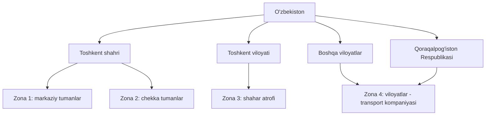

**Toshkent shahri tumanlari (real ro'yxat, 12 ta):**
Bektemir, Chilonzor, Mirobod, Mirzo Ulug'bek, Olmazor, Sergeli, Uchtepa,
Shayxontohur, Yakkasaroy, Yashnobod, Yunusobod, Yangihayot.

**Viloyatlar (12 ta) + Qoraqalpog'iston Respublikasi:**
Andijon, Buxoro, Farg'ona, Jizzax, Xorazm, Namangan, Navoiy, Qashqadaryo,
Samarqand, Sirdaryo, Surxondaryo, Toshkent viloyati, Qoraqalpog'iston Respublikasi.

> ⚠️ **Zonalarga qanday guruhlash — biznes qarori.** Yuqoridagi "Zona 1 / Zona 2"
> bo'linishi **misol**, kanon emas. Qaysi tuman qaysi zonada ekani va har zona
> narxi do'kon egasi tomonidan `DeliveryZone` yozuvlari orqali kiritiladi.
> Kod zonalar sonini qattiq yozmasligi kerak.

### 1.3. Geo: manzil → zona qanday aniqlanadi

Bu — bu bo'limning eng muhim texnik qarori. Ikki yondashuv bor.

#### Variant A — Tuman ro'yxati (ma'muriy bo'linish)

Mijoz dropdown'dan viloyat/tuman tanlaydi. Zona jadval orqali topiladi:

```
region_code + district_code → zone_id
```

| Ijobiy                                                   | Salbiy                                                                 |
| -------------------------------------------------------- | ---------------------------------------------------------------------- |
| Oddiy. `WHERE district_code = ?` — indeks bo'yicha, ~1ms | Tuman ichida bir xil narx. Chilonzorning chekkasi va markazi — bir xil |
| Tashqi API kerak emas, xarajat yo'q                      | Mijoz noto'g'ri tuman tanlashi mumkin                                  |
| Offline ishlaydi                                         | Yangi tuman/chegara o'zgarsa — qo'lda yangilash                        |
| Test qilish oson (determinstik)                          | Toshkent atrofidagi qishloqlar noaniq zonaga tushadi                   |

#### Variant B — Poligon (GeoJSON + PostGIS)

Zona — xaritada chizilgan ko'pburchak. Manzil geokodlanadi (lat/lng), keyin
`ST_Contains(zone.polygon, point)` bilan zona topiladi.

| Ijobiy                                            | Salbiy                                                                                  |
| ------------------------------------------------- | --------------------------------------------------------------------------------------- |
| Aniq. Chegarani xohlagancha chizish mumkin        | PostGIS kengaytmasi kerak (PostgreSQL 17 uni qo'llaydi)                                 |
| Masofa bo'yicha narx hisoblash mumkin             | **Geokodlash kerak** → tashqi API (Yandex/Google) → xarajat + kechikish + ishonchsizlik |
| Zona qo'shish — xaritada chizish, kod o'zgarmaydi | O'zbekiston manzillari geokodlash sifati **NOMA'LUM** — tekshirilishi kerak             |
|                                                   | Geokoder xato qilsa — mijoz noto'g'ri narx ko'radi, buni tuzatish qiyin                 |
|                                                   | Poligonlarni kim chizadi? Admin panelda xarita muharriri kerak — katta ish              |

#### Qaror (boshlang'ich)

**Variant A — tuman ro'yxati.** Sabablar:

1. Geokodlash sifati noma'lum. Noma'lum tashqi bog'liqlik ustiga narx hisoblashni
   qurish — MVP uchun katta risk.
2. Do'kon bitta (kanon §1) va bozor — asosan Toshkent. 12 tuman × zona jadvali
   qo'lda boshqarilishi mumkin.
3. Poligonga o'tish keyin ham mumkin: `DeliveryZone` modeliga `polygon` maydoni
   qo'shiladi, `resolveZone()` funksiyasi ichi o'zgaradi, tashqi interfeys o'zgarmaydi.

**Migratsiya yo'li ochiq qoladi:** zona aniqlash **bitta funksiya ortida** yashiriladi.

```ts
// packages/contracts/src/delivery/zone-resolver.ts

export interface AddressInput {
  readonly regionCode: string; // 'TSH' | 'AND' | 'SAM' | ...
  readonly districtCode: string; // 'TSH_CHL' (Chilonzor) | ...
  readonly street: string;
  readonly house: string;
  readonly apartment?: string;
  readonly landmark?: string; // "mo'ljal" — O'zbekistonda manzildan muhimroq
  readonly lat?: number; // kelajakda: geokodlash natijasi
  readonly lng?: number;
}

export type ZoneResolution =
  | { readonly kind: 'resolved'; readonly zoneId: string }
  | { readonly kind: 'out_of_coverage'; readonly reason: string }
  | { readonly kind: 'needs_manual_review'; readonly reason: string };

/**
 * Manzildan yetkazib berish zonasini aniqlaydi.
 *
 * Hozirgi implementatsiya: district_code → zone lookup.
 * Kelajakda PostGIS poligonga o'tish mumkin — bu interfeys o'zgarmaydi.
 */
export interface ZoneResolver {
  resolve(address: AddressInput): Promise<ZoneResolution>;
}
```

> **`landmark` (mo'ljal) haqida.** O'zbekistonda ko'p manzil "Chilonzor 9-kvartal,
> 45-uy" ko'rinishida bo'ladi va kuryer aslida "Mehnat bozori orqasida" degan
> mo'ljal bilan topadi. Bu maydon **majburiy emas, lekin kuryer uchun kritik**.
> Uni checkout'da so'rash kerak.

### 1.4. `DeliveryZone` modeli

```prisma
model DeliveryZone {
  id                String   @id @default(uuid(7))
  code              String   @unique              // 'TSH_CENTER', 'REGIONS'
  nameUz            String   @map("name_uz")
  nameRu            String   @map("name_ru")

  // Narx — BigInt, TIYINDA (kanon §8)
  basePrice         BigInt   @map("base_price")
  currency          String   @default("UZS")

  // Bepul yetkazib berish chegarasi. null = bu zonada bepul yetkazish yo'q
  freeThreshold     BigInt?  @map("free_threshold")

  // Yetkazish muddati — kun. Mijozga "3-5 kun" deb ko'rsatiladi
  etaMinDays        Int      @map("eta_min_days")
  etaMaxDays        Int      @map("eta_max_days")

  // Bu zonada slot tizimi ishlaydimi? Viloyatda ishlamaydi (transport kompaniyasi)
  slotsEnabled      Boolean  @default(false) @map("slots_enabled")

  // Bu zonada o'rnatish xizmati bormi? Faqat Toshkentda bo'lishi mumkin
  installationEnabled Boolean @default(false) @map("installation_enabled")

  isActive          Boolean  @default(true) @map("is_active")
  sortOrder         Int      @default(0) @map("sort_order")

  districts         DeliveryZoneDistrict[]
  slots             DeliverySlot[]
  shipments         Shipment[]

  createdAt         DateTime @default(now()) @map("created_at") @db.Timestamptz(3)
  updatedAt         DateTime @updatedAt @map("updated_at") @db.Timestamptz(3)
  deletedAt         DateTime? @map("deleted_at") @db.Timestamptz(3)

  @@map("delivery_zones")
}

/// Zona ↔ tuman bog'lanishi. Bitta tuman — bitta zonada (unique).
model DeliveryZoneDistrict {
  id           String       @id @default(uuid(7))
  zoneId       String       @map("zone_id")
  zone         DeliveryZone @relation(fields: [zoneId], references: [id])

  regionCode   String       @map("region_code")
  districtCode String       @unique @map("district_code")

  createdAt    DateTime     @default(now()) @map("created_at") @db.Timestamptz(3)

  @@index([zoneId])
  @@map("delivery_zone_districts")
}
```

**`districtCode` `@unique` bo'lishi muhim:** bitta tuman ikki zonada bo'lsa —
zona aniqlash noaniq bo'ladi. DB darajasida oldini olamiz.

### 1.5. Bepul yetkazib berish chegarasi

Qoida: buyurtma summasi `freeThreshold` dan katta yoki teng bo'lsa — yetkazish bepul.

**Nozik joylar:**

1. **Qaysi summadan hisoblanadi?** Chegirmadan **oldinmi** yoki **keyinmi**?
   → Chegirmadan **keyin** (haqiqiy to'lanadigan summa). Aks holda mijoz chegirma
   bilan chegaradan pastga tushadi, lekin bepul yetkazishni oladi — do'kon zarar ko'radi.
2. **O'rnatish narxi hisobga kiradimi?** → **Yo'q.** Faqat tovar summasi.
   O'rnatish — xizmat, u chegara hisobiga qo'shilmaydi.
3. **Mijoz chegaraga yetgach, keyin tovarni savatdan olib tashlasa?**
   → Narx qayta hisoblanadi. Yetkazish narxi **checkout'da yakuniy hisoblanadi**
   va `Order` ga yoziladi. Savatda ko'rsatilgan narx — **taxminiy**.

```ts
export interface DeliveryQuote {
  readonly zoneId: string;
  readonly zoneName: string;
  readonly price: bigint; // tiyin
  readonly currency: 'UZS';
  readonly isFree: boolean;
  readonly freeThreshold: bigint | null;
  /** Bepul bo'lishiga yana qancha kerak. Upsell uchun: "yana 150 000 so'm" */
  readonly amountToFree: bigint | null;
  readonly etaMinDays: number;
  readonly etaMaxDays: number;
}

export function calculateDeliveryPrice(
  zone: { basePrice: bigint; freeThreshold: bigint | null },
  /** Chegirmadan KEYINGI tovar summasi, tiyinda. O'rnatish narxisiz. */
  goodsSubtotal: bigint,
): { price: bigint; isFree: boolean; amountToFree: bigint | null } {
  if (zone.freeThreshold === null) {
    return { price: zone.basePrice, isFree: false, amountToFree: null };
  }

  if (goodsSubtotal >= zone.freeThreshold) {
    return { price: 0n, isFree: true, amountToFree: null };
  }

  return {
    price: zone.basePrice,
    isFree: false,
    amountToFree: zone.freeThreshold - goodsSubtotal,
  };
}
```

> **Diqqat:** `0n`, `150000n` — hammasi `BigInt`. `Number` ga hech qachon
> aylantirilmaydi (kanon §8). Faqat UI'da formatlashda `string` ga o'tkaziladi.

### 1.6. Katta/og'ir tovar — ochiq savol

Yoritishda 3 metrli trek yoki 15 kg lik kristall qandil bor. Bu oddiy kuryer
mashinasiga sig'maydi.

⚠️ **Bu hal qilinmagan.** Variantlar:

- `Product` ga `oversized: boolean` bayrog'i → bunday tovar uchun alohida narx/logistika.
- Hajm/og'irlik bo'yicha avtomatik hisob (`dimensions`, `weight` atributlari kanon §4 da bor).

Ikkinchisi to'g'riroq ko'rinadi, lekin **koeffitsiyentlar noma'lum** (necha kg dan
"og'ir" hisoblanadi?). → Ochiq savol №4.

---

## 2. Slot tizimi

### 2.1. Nega slot kerak

Mijoz uyda bo'lishi kerak — ayniqsa o'rnatish bo'lsa. "Ertaga yetkazamiz"
yetarli emas: mijoz ishda bo'ladi, kuryer qaytadi, do'kon ikki marta pul sarflaydi.

Yechim: mijoz **kun + vaqt oralig'ini** tanlaydi. Masalan `2026-07-20, 09:00-12:00`.

### 2.2. Slot sig'imi

Bir slotda cheksiz buyurtma qabul qilib bo'lmaydi — kuryerlar soni cheklangan.

```
slot sig'imi = shu vaqt oralig'ida ishlaydigan kuryerlar soni
             × bitta kuryer bajaradigan yetkazish soni
```

⚠️ **Ikkala ko'paytuvchi ham NOMA'LUM.** Do'konda hozir necha kuryer bor? Bitta
kuryer 3 soatda Toshkentda nechta manzilga yetib boradi (tirbandlik, qandil
ko'tarish, mijoz bilan tekshirish)? → **Ochiq savol №1.**

Shuning uchun `capacity` — **konfiguratsiya**, kodda hisoblanmaydi. Admin qo'lda
kiritadi va tajriba asosida sozlaydi.

### 2.3. `DeliverySlot` modeli

```prisma
model DeliverySlot {
  id           String       @id @default(uuid(7))

  zoneId       String       @map("zone_id")
  zone         DeliveryZone @relation(fields: [zoneId], references: [id])

  /// Slot sanasi (kun). UTC emas — LOKAL sana. Pastdagi izohga qara.
  slotDate     DateTime     @map("slot_date") @db.Date

  /// Vaqt oralig'i. Toshkent vaqti (UTC+5), 'HH:mm' formatida.
  startTime    String       @map("start_time")   // '09:00'
  endTime      String       @map("end_time")     // '12:00'

  /// Nechta buyurtma sig'adi
  capacity     Int

  /// Nechta band qilingan. HECH QACHON capacity dan oshmaydi (DB constraint).
  booked       Int          @default(0)

  /// Admin slotni yopishi mumkin (kuryer kasal bo'ldi va h.k.)
  isBlocked    Boolean      @default(false) @map("is_blocked")
  blockReason  String?      @map("block_reason")

  shipments    Shipment[]

  createdAt    DateTime     @default(now()) @map("created_at") @db.Timestamptz(3)
  updatedAt    DateTime     @updatedAt @map("updated_at") @db.Timestamptz(3)

  /// Bir zonada, bir kunda, bir vaqtda — bitta slot
  @@unique([zoneId, slotDate, startTime])
  @@index([slotDate, zoneId])
  @@map("delivery_slots")
}
```

**DB darajasidagi himoya (Prisma sxemasida ifodalab bo'lmaydi — raw migration):**

```sql
-- migration: add slot capacity guard
ALTER TABLE delivery_slots
  ADD CONSTRAINT delivery_slots_booked_within_capacity
  CHECK (booked >= 0 AND booked <= capacity);
```

Bu — **oxirgi himoya chizig'i**. Ilova mantiqi xato qilsa ham, DB oversell'ga
yo'l qo'ymaydi: tranzaksiya `CHECK` bilan rad etiladi.

### 2.4. Vaqt zonasi — nozik joy

Kanon §8: vaqt `@db.Timestamptz(3)`, UTC. Lekin **slot sanasi — istisno**.

Sabab: "20-iyul, 09:00-12:00" — bu Toshkent vaqti bo'yicha mijoz uchun ma'noga ega
bo'lgan tushuncha. Uni UTC ga aylantirsak (`2026-07-20T04:00:00Z`), keyin qayta
ko'rsatishda har safar konvertatsiya kerak va DST bo'lmagan mamlakatda bu ortiqcha
murakkablik keltiradi.

**Qaror:**

- `slotDate` — `@db.Date` (vaqt zonasisiz sana).
- `startTime` / `endTime` — `String` (`'09:00'`), Toshkent vaqti (UTC+5) deb tushuniladi.
- `Shipment.deliveredAt` kabi **hodisa vaqtlari** — odatdagidek `Timestamptz(3)`, UTC.

> O'zbekiston yozgi vaqtga o'tmaydi (UTC+5 doim). Bu qarorni xavfsiz qiladi.
> Agar bu o'zgarsa — migratsiya kerak bo'ladi. Bu qabul qilingan risk.

### 2.5. Slot generatsiyasi

Slotlar qo'lda kiritilmaydi — ular **oldindan generatsiya qilinadi**.

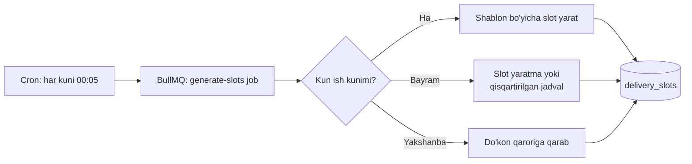

Job N kun oldinga slot yaratadi (`SLOT_HORIZON_DAYS`). Idempotent bo'lishi shart —
`@@unique([zoneId, slotDate, startTime])` buni ta'minlaydi: `ON CONFLICT DO NOTHING`.

### 2.6. Bayram va dam olish kunlari

O'zbekiston rasmiy bayramlari mavjud (1-yanvar, 8-mart, Navro'z, 9-may,
1-sentyabr, 1-oktyabr, 8-dekabr) + Ramazon hayiti va Qurbon hayiti.

⚠️ **Muhim:** hayit sanalari **oy taqvimiga bog'liq** va har yili siljiydi.
Ularni kodda qattiq yozib bo'lmaydi. Bundan tashqari, hukumat dam olish kunlarini
ko'chirishi mumkin (masalan, bayram seshanbaga tushsa, dushanba ham dam olish).

**Qaror:** bayramlar — **jadval**, kod emas. Admin yiliga bir marta kiritadi.

```prisma
model DeliveryCalendarException {
  id          String   @id @default(uuid(7))
  /// Qaysi sana
  date        DateTime @unique @db.Date
  /// Bu kuni ishlaymizmi?
  isWorking   Boolean  @map("is_working")
  /// Ishlasak — qisqartirilgan slot shabloni (null = odatdagi)
  templateId  String?  @map("template_id")
  note        String?  // "Qurbon hayiti", "ko'chirilgan dam olish"

  createdAt   DateTime @default(now()) @map("created_at") @db.Timestamptz(3)

  @@map("delivery_calendar_exceptions")
}
```

Bu jadval bo'sh bo'lsa — odatdagi shablon ishlaydi. Ya'ni tizim bayramlarni
bilmasa ham buziladi emas, shunchaki bayramda ham slot ochadi. Buni admin
tuzatadi. **Nosozlik xavfsiz tomonga qaraydi.**

### 2.7. ⚠️ Slot band qilishda race condition

**Bu — `docs/06-inventory-and-reservations.md` dagi oversell muammosining aynan o'zi.**

Kanon §9.2 da yozilgan: "oxirgi qandilni ikki mijoz bir vaqtda sotib olsa".
Slotda ham bir xil: **oxirgi slot joyini ikki mijoz bir vaqtda olsa.**

#### Muammoning ko'rinishi

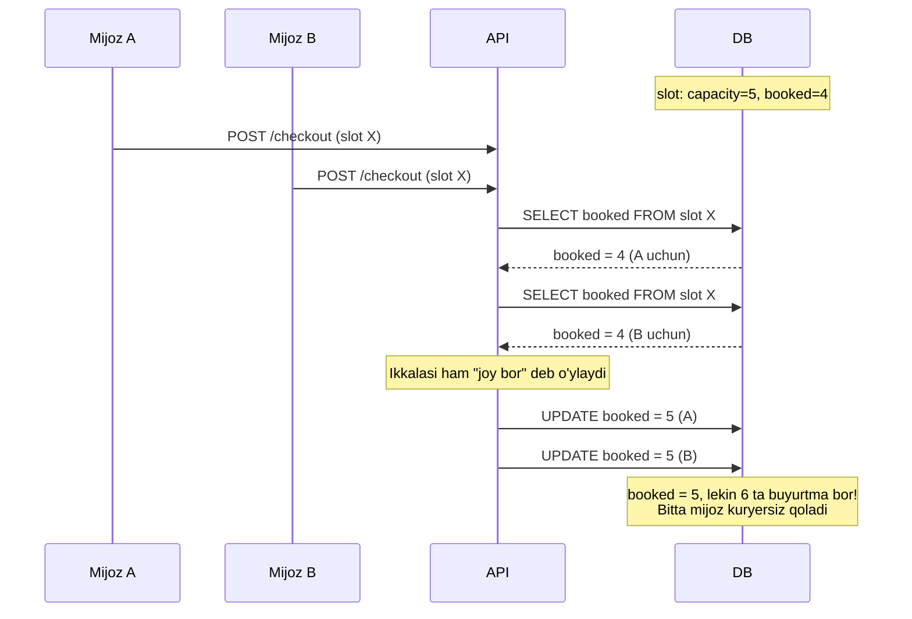

Bu — **klassik lost update**. `SELECT` va `UPDATE` orasida boshqa tranzaksiya
o'zgartirdi, biz eski qiymat ustiga yozdik.

#### Yechim: atomik shartli UPDATE

Eng oddiy va eng ishonchli yechim — o'qish va yozishni **bitta atomik operatsiyaga**
birlashtirish:

```sql
UPDATE delivery_slots
SET booked = booked + 1
WHERE id = $1
  AND booked < capacity
  AND is_blocked = false
RETURNING id, booked, capacity;
```

Agar `RETURNING` bo'sh qaytsa — joy yo'q edi. Hech qanday lock, hech qanday retry.
PostgreSQL `UPDATE` paytida qatorni o'zi qulflaydi, `booked < capacity` sharti
**yangi** qiymat ustida tekshiriladi.

```ts
// apps/api/src/delivery/slot-booking.service.ts

import { Injectable } from '@nestjs/common';
import { PrismaService } from '../prisma/prisma.service';

export type SlotBookingResult =
  | { readonly kind: 'booked'; readonly slotId: string; readonly bookedCount: number }
  | { readonly kind: 'full'; readonly slotId: string }
  | { readonly kind: 'blocked'; readonly slotId: string; readonly reason: string }
  | { readonly kind: 'not_found'; readonly slotId: string };

interface SlotBookingRow {
  readonly id: string;
  readonly booked: number;
  readonly capacity: number;
}

@Injectable()
export class SlotBookingService {
  constructor(private readonly prisma: PrismaService) {}

  /**
   * Slotda bitta joyni atomik band qiladi.
   *
   * Race condition'dan himoya: SELECT+UPDATE emas, bitta shartli UPDATE.
   * `booked < capacity` sharti UPDATE ichida tekshiriladi — PostgreSQL
   * qatorni qulflaydi, shuning uchun ikki parallel so'rov ketma-ket bajariladi.
   *
   * Bu — docs/06-inventory-and-reservations.md dagi StockReservation
   * bilan BIR XIL yondashuv. Ataylab: ikki joyda ikki xil pattern
   * ishlatish — kelajakdagi xato manbai.
   */
  async tryBook(slotId: string, tx?: PrismaService): Promise<SlotBookingResult> {
    const db = tx ?? this.prisma;

    const rows = await db.$queryRaw<SlotBookingRow[]>`
      UPDATE delivery_slots
      SET booked = booked + 1,
          updated_at = NOW()
      WHERE id = ${slotId}::uuid
        AND booked < capacity
        AND is_blocked = false
      RETURNING id, booked, capacity
    `;

    if (rows.length > 0) {
      const row = rows[0]!;
      return { kind: 'booked', slotId: row.id, bookedCount: row.booked };
    }

    // UPDATE hech narsani o'zgartirmadi. Sabab nima? Aniqlaymiz.
    const slot = await db.deliverySlot.findUnique({
      where: { id: slotId },
      select: { id: true, isBlocked: true, blockReason: true },
    });

    if (slot === null) {
      return { kind: 'not_found', slotId };
    }
    if (slot.isBlocked) {
      return {
        kind: 'blocked',
        slotId,
        reason: slot.blockReason ?? 'unknown',
      };
    }
    return { kind: 'full', slotId };
  }

  /**
   * Band qilishni bekor qiladi (buyurtma bekor bo'lsa yoki saga kompensatsiyasi).
   *
   * `booked > 0` sharti — himoya: ikki marta chaqirilsa manfiyga tushmaydi.
   * Idempotent EMAS: ikki marta chaqirsa ikki joy bo'shaydi. Chaqiruvchi
   * buni ta'minlashi kerak (Shipment holati orqali).
   */
  async release(slotId: string, tx?: PrismaService): Promise<void> {
    const db = tx ?? this.prisma;
    await db.$executeRaw`
      UPDATE delivery_slots
      SET booked = booked - 1,
          updated_at = NOW()
      WHERE id = ${slotId}::uuid
        AND booked > 0
    `;
  }
}
```

#### Nega `SELECT ... FOR UPDATE` emas?

Ishlaydi, lekin ikki so'rov (`SELECT FOR UPDATE` + `UPDATE`) va lock tranzaksiya
oxirigacha ushlanadi. Shartli `UPDATE` — bitta so'rov, lock qisqaroq. Ommabop
slot uchun (kechqurun 18:00-21:00 — hamma shuni xohlaydi) bu farq sezilarli.

#### Nega Redis lock emas?

Redis 7 kanon §6 da bor va rezerv uchun ishlatiladi. Lekin slot uchun:
`booked` — **PostgreSQL'dagi haqiqat manbai**. Redis lock qo'shsak, ikki manba
o'rtasida sinxronizatsiya muammosi paydo bo'ladi (Redis tushib qolsa? lock TTL
tugasa, lekin tranzaksiya davom etsa?). PostgreSQL o'zi yetarli kafolat beradi —
qo'shimcha komponent kiritishga sabab yo'q.

> **Umumiy printsip (docs/06 dan takrorlanadi):** cheklangan resursni band
> qilishda — **shartli atomik UPDATE**. Bu qoida `StockReservation` va
> `DeliverySlot` uchun bir xil.

#### Test: property-based

Kanon §6 da `fast-check` bor. Bu yerda u aynan kerak:

```ts
// apps/api/test/slot-booking.property.spec.ts
import fc from 'fast-check';

/**
 * Invariant: N ta parallel band qilish urinishidan
 * MUVAFFAQIYATLI bo'lganlar soni <= capacity.
 *
 * Testcontainers bilan real PostgreSQL ustida ishlaydi —
 * mock bilan race condition'ni tekshirib bo'lmaydi.
 */
it('hech qachon capacity dan oshiq band qilmaydi', async () => {
  await fc.assert(
    fc.asyncProperty(
      fc.integer({ min: 1, max: 10 }), // capacity
      fc.integer({ min: 1, max: 30 }), // parallel urinishlar soni
      async (capacity, attempts) => {
        const slot = await createSlot({ capacity });

        const results = await Promise.all(
          Array.from({ length: attempts }, () => service.tryBook(slot.id)),
        );

        const succeeded = results.filter((r) => r.kind === 'booked').length;
        const finalSlot = await getSlot(slot.id);

        expect(succeeded).toBeLessThanOrEqual(capacity);
        expect(finalSlot.booked).toBe(succeeded);
        expect(finalSlot.booked).toBeLessThanOrEqual(capacity);
      },
    ),
    { numRuns: 30 },
  );
});
```

### 2.8. Slot va buyurtma saga'si

Slot band qilish — buyurtma saga'sining bir qadami (kanon §9.3). Agar to'lov
muvaffaqiyatsiz bo'lsa, slot **bo'shatilishi** kerak.

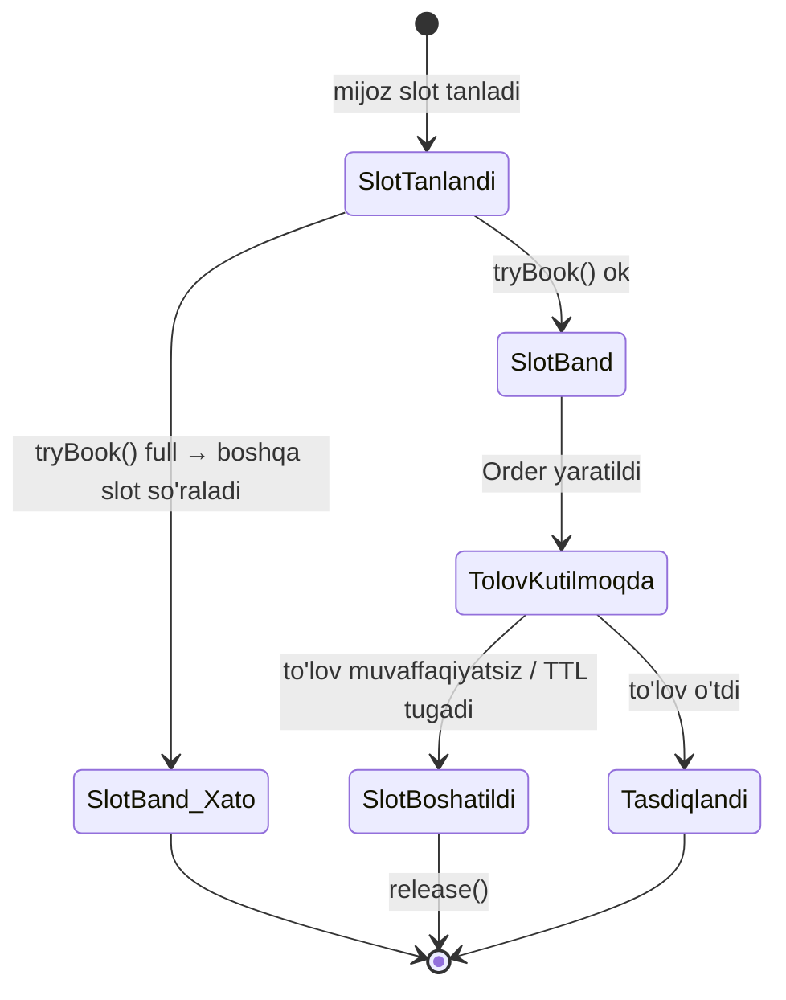

**TTL muammosi:** mijoz slot band qildi, lekin to'lovni tugatmadi va brauzerni
yopdi. Slot band qolib ketadi.

Yechim — `docs/06` dagi rezerv TTL bilan **bir xil**: BullMQ delayed job.
Buyurtma N daqiqada to'lanmasa — rezerv ham, slot ham bo'shatiladi. **Ikkalasi
bir job'da**, chunki ular bir saga'ning qismi.

⚠️ TTL qancha? `docs/06` da rezerv TTL belgilanadi. Slot **aynan shu qiymatni**
ishlatishi kerak — ikki xil TTL bo'lsa, biri bo'shab biri band qolgan holat
paydo bo'ladi. → `docs/06` dagi qiymatga havola.

---

## 3. Mo'rt tovar — yoritgichga xos muammo

### 3.1. Nega bu alohida bo'lim

Kanon §4.5: "Mo'rtlik — shisha qandil". Bu real muammo:

- Kristall qandil — o'nlab alohida shisha element.
- Opal shar plafon — devorga bir marta urilsa yorilib ketadi.
- LED panel — egiladigan, sinadigan.

Do'kon uchun bu **pul**: singan qandil = tovar yo'qoldi + yetkazish behuda +
mijoz norozi + qayta yetkazish xarajati.

### 3.2. "Mo'rt" belgisi

Bu — mahsulot atributi emas, **logistika bayrog'i**. Kanon §4 dagi atributlar
jadvali texnik xususiyatlar uchun (lyumen, IP va h.k.). Mo'rtlik — boshqa o'q.

```prisma
/// Product modeliga qo'shiladi (docs/05-catalog-and-search.md)
/// fragility — logistika xususiyati, texnik atribut EMAS
enum FragilityLevel {
  NORMAL       /// odatdagi qadoqlash
  FRAGILE      /// shisha/keramika element bor — qo'shimcha himoya
  VERY_FRAGILE /// kristall, katta shisha plafon — qo'lda tashish, alohida qadoq
}
```

**Kim belgilaydi?** Kontent-menejer mahsulot kartochkasini yaratishda.
Avtomatik aniqlash mumkin emas — `material` atributida "shisha" bo'lishi
mo'rtlikni bildirmaydi (qalin himoyalangan shisha bor).

### 3.3. Qadoqlash talablari

Har mo'rtlik darajasi uchun **qadoqlash yo'riqnomasi**. Bu — omborchi uchun
checklist, kodda mantiq emas:

```prisma
model PackagingRule {
  id              String         @id @default(uuid(7))
  fragility       FragilityLevel @unique

  /// Omborchiga picking list'da ko'rsatiladigan yo'riqnoma (uz/ru)
  instructionUz   String         @map("instruction_uz")
  instructionRu   String         @map("instruction_ru")

  /// Qadoqlashdan keyin foto majburiymi?
  requiresPhoto   Boolean        @default(false) @map("requires_photo")

  /// Qo'shimcha qadoq materiali narxi (tiyin) — tannarxga qo'shiladi
  materialCost    BigInt         @default(0) @map("material_cost")

  createdAt       DateTime       @default(now()) @map("created_at") @db.Timestamptz(3)
  updatedAt       DateTime       @updatedAt @map("updated_at") @db.Timestamptz(3)

  @@map("packaging_rules")
}
```

**`requiresPhoto` — bu bo'limning kaliti.** Pastda tushuntiriladi.

### 3.4. Dalil zanjiri (foto)

Muammo: qandil singan. **Kim aybdor?**

- Zavod nuqsonimi (ta'minotchiga da'vo)?
- Omborda singanmi (do'kon zarari)?
- Kuryer tashlab yubordimi (kuryer mas'uliyati)?
- Mijoz o'zi sindirib, "singan keldi" deyaptimi?

Buni **keyin** aniqlab bo'lmaydi. Faqat **oldindan yig'ilgan dalil** yordam beradi.

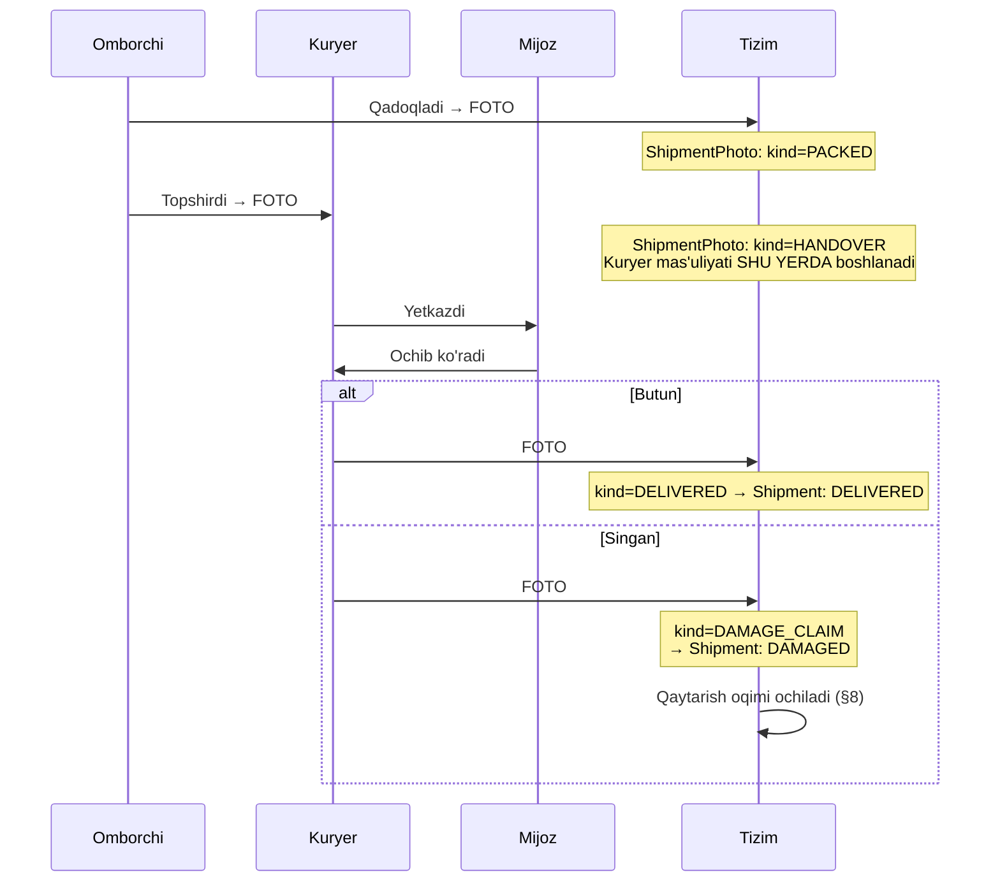

```prisma
model ShipmentPhoto {
  id         String            @id @default(uuid(7))
  shipmentId String            @map("shipment_id")
  shipment   Shipment          @relation(fields: [shipmentId], references: [id])

  kind       ShipmentPhotoKind

  /// S3-mos storage'dagi kalit (kanon §6: Infra)
  storageKey String            @map("storage_key")

  /// Kim yukladi
  uploadedBy String            @map("uploaded_by")
  uploadedAt DateTime          @default(now()) @map("uploaded_at") @db.Timestamptz(3)

  /// Kuryer telefonidan kelgan geo (agar bor bo'lsa) — dalil kuchi uchun
  lat        Float?
  lng        Float?

  note       String?

  @@index([shipmentId, kind])
  @@map("shipment_photos")
}

enum ShipmentPhotoKind {
  PACKED         /// omborda qadoqlangan holat
  HANDOVER       /// kuryerga topshirilgan
  DELIVERED      /// mijoz qabul qilgan
  DAMAGE_CLAIM   /// shikast dalili
  RETURN_PICKUP  /// qaytarishda olib ketilgan holat
}
```

> **`lat`/`lng` `Float?` — bu pul emas, koordinata.** Kanon §8 dagi "Float hech
> qachon" qoidasi **pulga** tegishli. Koordinata uchun `Float` normal.

**Qoida:** `fragility != NORMAL` bo'lgan tovar uchun `PACKED` va `HANDOVER`
fotolari **majburiy**. Ularsiz `Shipment` `IN_TRANSIT` holatiga o'ta olmaydi.

Bu — do'kon uchun himoya, kuryer uchun ham himoya. Kuryer butun qadoqni oldi
degan dalil bo'lsa, u singan yetkazgani uchun javob beradi. Agar foto yo'q bo'lsa —
kuryer "menga shunday berishdi" deyishi mumkin va uni rad etib bo'lmaydi.

### 3.5. Kuryer mas'uliyati

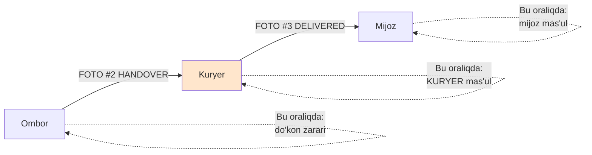

Mas'uliyat chegarasi — `HANDOVER` va `DELIVERED` fotolari orasida.

⚠️ **Kuryer moliyaviy javobgarligi — YURIST SAVOLI.**
Kuryer o'z ish haqidan singan tovar qiymatini to'laydimi? Bu:

- mehnat shartnomasiga bog'liq (shtat kuryeri vs shartnoma asosida);
- O'zbekiston Mehnat kodeksi moddiy javobgarlik cheklovlariga bog'liq;
- tizim buni **hisoblab berishi mumkin**, lekin **qoidani belgilay olmaydi**.

Kanon §10: yuridik maslahat berilmaydi. → **Ochiq savol №7.**

Tizim qiladigan ish: **kuzatuv**. Kuryer bo'yicha shikast statistikasi.

```ts
export interface CourierDamageStats {
  readonly courierId: string;
  readonly periodFrom: Date;
  readonly periodTo: Date;
  readonly totalShipments: number;
  readonly damagedShipments: number;
  /** Shikastlangan tovarlarning umumiy qiymati, tiyin */
  readonly damagedValue: bigint;
  /**
   * Shikast ulushi. Bu — XOM ma'lumot, "yomon kuryer" hukmi EMAS.
   * Mo'rt tovarni ko'p tashigan kuryerda bu ko'rsatkich tabiiy yuqori bo'ladi.
   * Taqqoslashda fragility bo'yicha normalizatsiya kerak.
   */
  readonly damageRate: number;
}
```

---

## 4. O'rnatish xizmati (montaj)

### 4.1. Nega bu alohida entity

Kanon §4.6: "O'rnatish xizmati — elektrik. Bu upsell va alohida operatsion oqim."

Qandilni shiftga osish — elektr ishi. Mijozning ko'pchiligi buni o'zi qila olmaydi
yoki xohlamaydi. Do'kon uchun bu:

- **daromad** (xizmat narxi);
- **farqlanish** (raqobatchi qilmasa);
- **mas'uliyat** (noto'g'ri o'rnatilsa — qandil tushadi).

### 4.2. Asosiy qaror: yetkazish ≠ o'rnatish

**Bu ikki narsa alohida sanada bo'lishi mumkin va bu normal.**

Real ssenariy: mijoz ta'mir qilyapti. Qandilni **hozir** oladi (narx ko'tarilmasin),
lekin shift hali tayyor emas — o'rnatishni **uch haftadan keyin** xohlaydi.

Shuning uchun:

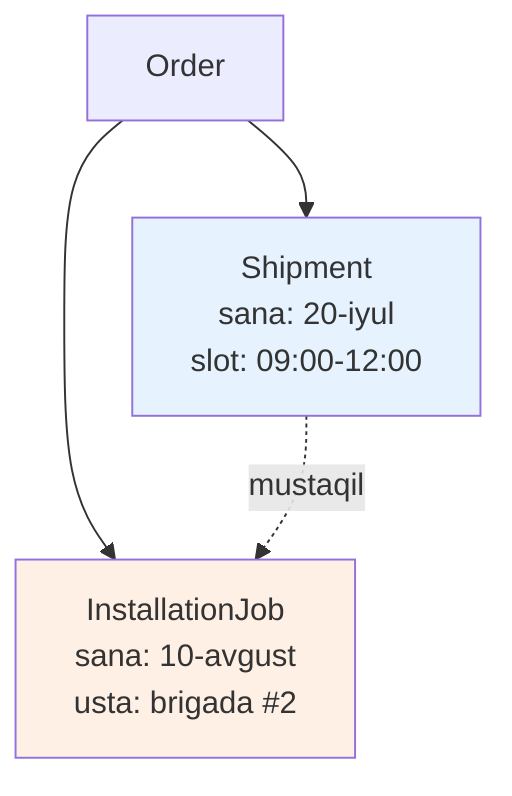

`InstallationJob` — `Shipment` ning bolasi **emas**, `Order` ning bolasi.
Ular parallel yashaydi.

**Lekin bitta qat'iy qoida bor:** o'rnatish sanasi yetkazish sanasidan **oldin
bo'la olmaydi**. Tovar hali mijozda yo'q — nimani o'rnatadi?

### 4.3. `InstallationJob` modeli

```prisma
model InstallationJob {
  id             String                @id @default(uuid(7))

  orderId        String                @map("order_id")
  order          Order                 @relation(fields: [orderId], references: [id])

  status         InstallationJobStatus @default(PENDING)

  /// Rejalashtirilgan sana + slot
  scheduledDate  DateTime?             @map("scheduled_date") @db.Date
  slotId         String?               @map("slot_id")
  slot           DeliverySlot?         @relation(fields: [slotId], references: [id])

  /// Tayinlangan brigada
  crewId         String?               @map("crew_id")
  crew           InstallationCrew?     @relation(fields: [crewId], references: [id])

  /// Narx — BigInt, TIYIN (kanon §8)
  quotedPrice    BigInt                @map("quoted_price")
  /// Yakuniy narx — usta joyida murakkablikni qayta baholashi mumkin
  finalPrice     BigInt?               @map("final_price")
  currency       String                @default("UZS")

  /// Murakkablik omillari — narx hisobi uchun (§4.4)
  complexity     Json

  /// Mijozning izohi: "shift 4 metr", "elektr simi yo'q"
  customerNote   String?               @map("customer_note")
  /// Ustaning izohi
  crewNote       String?               @map("crew_note")

  startedAt      DateTime?             @map("started_at") @db.Timestamptz(3)
  completedAt    DateTime?             @map("completed_at") @db.Timestamptz(3)

  /// Bajarilgan ish foto-dalili
  photos         InstallationPhoto[]

  createdAt      DateTime              @default(now()) @map("created_at") @db.Timestamptz(3)
  updatedAt      DateTime              @updatedAt @map("updated_at") @db.Timestamptz(3)

  @@index([status, scheduledDate])
  @@index([crewId, scheduledDate])
  @@map("installation_jobs")
}

enum InstallationJobStatus {
  PENDING       /// buyurtma berildi, sana kelishilmagan
  SCHEDULED     /// sana + brigada tayinlangan
  EN_ROUTE      /// brigada yo'lda
  IN_PROGRESS   /// ish boshlandi
  COMPLETED     /// bajarildi
  FAILED        /// bajarib bo'lmadi (shift beton, sim yo'q va h.k.)
  CANCELLED     /// bekor qilindi
  RESCHEDULED   /// ko'chirildi (yangi job yaratiladi, bu yopiladi)
}

model InstallationCrew {
  id         String            @id @default(uuid(7))
  name       String            /// "Brigada #1" yoki usta ismi
  phone      String

  /// Bir kunda nechta ish bajara oladi
  dailyCapacity Int            @default(1) @map("daily_capacity")

  /// Qaysi zonalarda ishlaydi
  zoneIds    String[]          @map("zone_ids")

  isActive   Boolean           @default(true) @map("is_active")

  jobs       InstallationJob[]

  createdAt  DateTime          @default(now()) @map("created_at") @db.Timestamptz(3)
  updatedAt  DateTime          @updatedAt @map("updated_at") @db.Timestamptz(3)

  @@map("installation_crews")
}

model InstallationPhoto {
  id         String          @id @default(uuid(7))
  jobId      String          @map("job_id")
  job        InstallationJob @relation(fields: [jobId], references: [id])
  storageKey String          @map("storage_key")
  kind       String          /// 'before' | 'after' | 'issue'
  uploadedAt DateTime        @default(now()) @map("uploaded_at") @db.Timestamptz(3)

  @@index([jobId])
  @@map("installation_photos")
}
```

> **`InstallationCrew` — yangi entity emasmi?** Kanon §8 da u yo'q. Lekin
> `InstallationJob` bor va u kimgadir tayinlanishi kerak. Ikki variant:
> (a) `Courier` ni qayta ishlatish — noto'g'ri, kuryer elektrik emas;
> (b) `InstallationCrew` qo'shish — kanon ro'yxatini kengaytirish.
> **Bu — kanon egasiga savol (Ochiq savol №8).** Vaqtincha (b) taklif qilinadi,
> chunki (a) semantik xato.

### 4.4. Narx: murakkablikka qarab

O'rnatish narxi qat'iy emas. Omillar:

| Omil                     | Nega ta'sir qiladi                                             |
| ------------------------ | -------------------------------------------------------------- |
| **Shift balandligi**     | 2.7 m — stremyanka. 4 m — tur yoki uzun narvon, ikki kishi     |
| **Qandil shoxlari soni** | 12 shoxli qandil — har shoxni alohida yig'ish, soatlab ish     |
| **Og'irlik**             | 15 kg qandil — ankerli mahkamlash, betonga teshik              |
| **Shift materiali**      | Gipsokarton — anker kerak. Beton — perforator. Yog'och — oddiy |
| **Elektr simi bormi**    | Sim yo'q bo'lsa — shtroblash, bu butunlay boshqa ish hajmi     |
| **Dimmer o'rnatish**     | Qo'shimcha ish (kanon §4: `dimmable` atributi)                 |
| **12V transformator**    | Kanon §4.4 — transformator joylashuvi, yuklamani tekshirish    |
| **Nechta chiroq**        | 6 ta spot — 6 marta ish                                        |

⚠️ **Har omil uchun aniq narx — NOMA'LUM.** Bu do'kon egasi va ustalar
kelishuvi. Kodda qattiq yozilmaydi → **konfiguratsiya jadvali**.

```ts
// packages/contracts/src/delivery/installation-pricing.ts

export interface InstallationComplexity {
  /** Shift balandligi, santimetrda. null = mijoz bilmaydi → usta joyida baholaydi */
  readonly ceilingHeightCm: number | null;
  /** Qandil shoxlari / lampa uyalari soni */
  readonly armCount: number;
  /** Tovar og'irligi, grammda (Product.weight dan) */
  readonly weightGrams: number;
  readonly ceilingMaterial: 'concrete' | 'drywall' | 'wood' | 'stretch' | 'unknown';
  readonly hasExistingWiring: boolean | null;
  readonly needsDimmer: boolean;
  readonly needsTransformer: boolean;
  /** Nechta alohida chiroq o'rnatiladi */
  readonly unitCount: number;
}

export interface InstallationPriceBreakdown {
  readonly basePrice: bigint;
  readonly modifiers: ReadonlyArray<{
    readonly code: string;
    readonly labelUz: string;
    readonly amount: bigint;
  }>;
  readonly total: bigint;
  readonly currency: 'UZS';
  /**
   * Narx TAXMINIY. Usta joyida qayta baholashi mumkin.
   * Mijozga aynan shunday ko'rsatiladi — "taxminiy narx".
   */
  readonly isEstimate: true;
}

/**
 * O'rnatish narxini hisoblaydi.
 *
 * Barcha koeffitsiyentlar — DB dagi InstallationPriceRule dan.
 * Kodda RAQAM YO'Q: koeffitsiyentlar biznes qarori (kanon §2).
 *
 * Determinizm majburiy (kanon §9.5 bilan bir xil printsip):
 * bir xil kirish → bir xil chiqish. Qoidalar `priority` bo'yicha
 * qat'iy tartibda qo'llanadi.
 */
export function calculateInstallationPrice(
  complexity: InstallationComplexity,
  rules: readonly InstallationPriceRule[],
): InstallationPriceBreakdown {
  const sorted = [...rules].sort((a, b) => a.priority - b.priority);

  const base = sorted.find((r) => r.kind === 'BASE');
  if (base === undefined) {
    throw new Error('InstallationPriceRule: BASE qoidasi topilmadi');
  }

  const modifiers: Array<{ code: string; labelUz: string; amount: bigint }> = [];
  let total = base.amount;

  for (const rule of sorted) {
    if (rule.kind === 'BASE') continue;
    if (!matchesRule(rule, complexity)) continue;

    const amount =
      rule.mode === 'FIXED'
        ? rule.amount
        : // PER_UNIT: har birlik uchun
          rule.amount * BigInt(resolveUnitCount(rule, complexity));

    modifiers.push({ code: rule.code, labelUz: rule.labelUz, amount });
    total += amount;
  }

  return {
    basePrice: base.amount,
    modifiers,
    total,
    currency: 'UZS',
    isEstimate: true,
  };
}
```

**`isEstimate: true` — literal tip.** Bu ataylab: narx **hech qachon** yakuniy
emas. Usta kelib "shift beton emas, ekan, ish ikki barobar" deyishi mumkin.
Tip tizimi bu haqiqatni majburlaydi — `isEstimate: false` yozib bo'lmaydi.

**Yakuniy narx qachon belgilanadi?** Usta ishni tugatgach, `finalPrice` ni kiritadi.
Agar u `quotedPrice` dan farq qilsa — mijozga tasdiqlash so'raladi.

⚠️ **Nozik holat:** usta kelib, narxni ikki barobar aytdi, mijoz rozi bo'lmadi.
Kim yo'l xarajatini to'laydi? Bu — biznes siyosati, **ochiq savol №9**.

### 4.5. Checkout'da upsell

Kanon §4.6: o'rnatish — upsell.

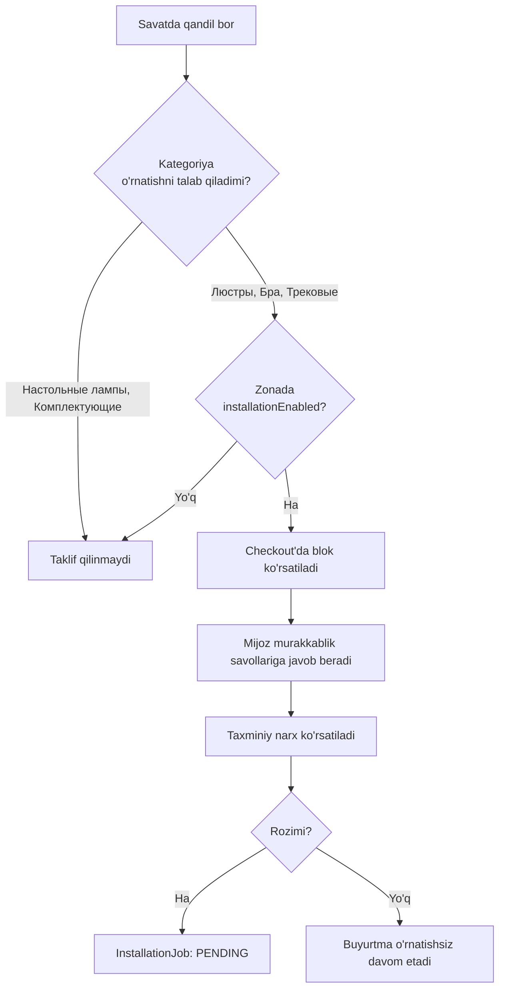

**Qaysi kategoriyalar uchun?** Kanon §4 dagi kategoriyalar ro'yxatidan:

- **Ha:** Люстры (qandil), Бра (devor), Трековые светильники (trek),
  Технические светильники, Уличные светильники, Светодиодные ленты
- **Yo'q:** Настольные лампы (stol lampasi — rozetkaga tiqiladi),
  Торшеры (torsher — pol chirog'i), Комплектующие (butlovchi)
- **Shubhali:** Споты, Светильники — o'rnatish turiga bog'liq (`mount_type` atributi)

Bu ro'yxat `Category` modelida bayroq bo'lishi kerak (`requiresInstallation`),
kodda qattiq yozilmasligi kerak — do'kon egasi fikrini o'zgartirishi mumkin.

**UX ogohlantirishi:** o'rnatish blokini agressiv qilmaslik kerak. Mijozning
ta'mirchisi bor bo'lishi mumkin. Standart holat — **belgilanmagan** (opt-in),
oldindan belgilangan emas (opt-out). Opt-out — qorong'u pattern va u qaytarishlarni
ko'paytiradi.

---

## 5. Kuryer va marshrut

### 5.1. `Courier` va `Shipment` modellari

```prisma
model Courier {
  id         String     @id @default(uuid(7))

  /// Kuryer — tizim foydalanuvchisi (kanon §8: User)
  userId     String     @unique @map("user_id")
  user       User       @relation(fields: [userId], references: [id])

  phone      String

  /// Transport turi — sig'imga ta'sir qiladi
  vehicleType VehicleType @map("vehicle_type")
  vehiclePlate String?    @map("vehicle_plate")

  /// Qaysi zonalarda ishlaydi
  zoneIds    String[]   @map("zone_ids")

  isActive   Boolean    @default(true) @map("is_active")

  shipments  Shipment[]

  createdAt  DateTime   @default(now()) @map("created_at") @db.Timestamptz(3)
  updatedAt  DateTime   @updatedAt @map("updated_at") @db.Timestamptz(3)

  @@map("couriers")
}

enum VehicleType {
  CAR        /// yengil avtomobil — kichik qandil
  VAN        /// furgon — katta/ko'p tovar
  TRUCK      /// yuk mashinasi — 3m trek, oversized
  MOTORCYCLE /// motorollar — faqat mayda (lampochka, butlovchi)
}

model Shipment {
  id            String         @id @default(uuid(7))

  orderId       String         @map("order_id")
  order         Order          @relation(fields: [orderId], references: [id])

  status        ShipmentStatus @default(PENDING)

  zoneId        String         @map("zone_id")
  zone          DeliveryZone   @relation(fields: [zoneId], references: [id])

  slotId        String?        @map("slot_id")
  slot          DeliverySlot?  @relation(fields: [slotId], references: [id])

  courierId     String?        @map("courier_id")
  courier       Courier?       @relation(fields: [courierId], references: [id])

  /// Manzil — Order dan nusxa (snapshot). Mijoz keyin manzilini o'zgartirsa,
  /// bu yetkazish qayerga ketgani tarixda saqlanib qolishi kerak.
  addressSnapshot Json         @map("address_snapshot")

  /// Yetkazish narxi — BigInt, TIYIN
  price         BigInt
  currency      String         @default("UZS")

  /// Marshrutdagi tartib. null = hali marshrutga qo'shilmagan (§5.3)
  routeSequence Int?           @map("route_sequence")

  /// Eng mo'rt tovar darajasi — qadoqlash qoidasini tanlash uchun
  maxFragility  FragilityLevel @default(NORMAL) @map("max_fragility")

  photos        ShipmentPhoto[]

  dispatchedAt  DateTime?      @map("dispatched_at") @db.Timestamptz(3)
  deliveredAt   DateTime?      @map("delivered_at") @db.Timestamptz(3)
  failedAt      DateTime?      @map("failed_at") @db.Timestamptz(3)
  failureReason String?        @map("failure_reason")

  createdAt     DateTime       @default(now()) @map("created_at") @db.Timestamptz(3)
  updatedAt     DateTime       @updatedAt @map("updated_at") @db.Timestamptz(3)

  @@index([status, slotId])
  @@index([courierId, status])
  @@index([orderId])
  @@map("shipments")
}

enum ShipmentStatus {
  PENDING      /// yaratildi, hali yig'ilmagan
  PICKING      /// omborda yig'ilyapti
  PACKED       /// qadoqlandi, kuryer kutilmoqda
  DISPATCHED   /// kuryerga topshirildi
  IN_TRANSIT   /// yo'lda
  DELIVERED    /// yetkazildi
  FAILED       /// yetkazib bo'lmadi (mijoz yo'q, telefon o'chiq)
  DAMAGED      /// shikastlangan holda yetdi
  RETURNED     /// qaytarildi
  CANCELLED    /// bekor qilindi
}
```

### 5.2. Holat mashinasi

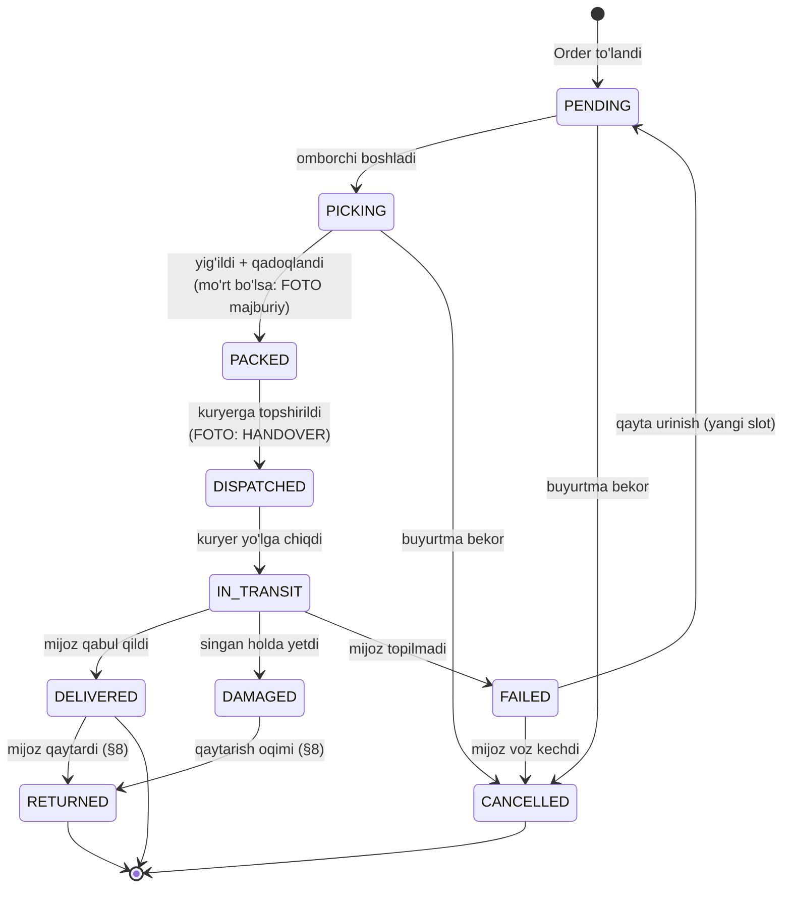

O'tishlar qoidalari kod darajasida majburlanadi — `Order` holat mashinasi bilan
bir xil printsip (`docs/07-order-and-checkout.md`):

```ts
const SHIPMENT_TRANSITIONS: Readonly<Record<ShipmentStatus, readonly ShipmentStatus[]>> = {
  PENDING: ['PICKING', 'CANCELLED'],
  PICKING: ['PACKED', 'CANCELLED'],
  PACKED: ['DISPATCHED', 'CANCELLED'],
  DISPATCHED: ['IN_TRANSIT', 'FAILED'],
  IN_TRANSIT: ['DELIVERED', 'DAMAGED', 'FAILED'],
  DELIVERED: ['RETURNED'],
  FAILED: ['PENDING', 'CANCELLED'],
  DAMAGED: ['RETURNED'],
  RETURNED: [],
  CANCELLED: [],
} as const;

export function canTransition(from: ShipmentStatus, to: ShipmentStatus): boolean {
  return SHIPMENT_TRANSITIONS[from].includes(to);
}
```

### 5.3. ⚠️ Marshrut optimizatsiyasi — halol baho

Kanon §9.8: "Marshrut rejalashtirish — kuryer uchun. ⚠️ VRP — NP-qiyin.
Boshida oddiy (qo'lda tayinlash), keyin optimizatsiya. Bu ochiq savol."

#### Muammo nima

**VRP (Vehicle Routing Problem)** — kombinatorik optimallashtirish masalasi:
N ta manzil, M ta kuryer, har birida sig'im chegarasi, har manzilda vaqt oynasi
(slot!). Umumiy masofani minimallashtirish kerak.

Bu **NP-qiyin**. Ya'ni manzillar soni ortgani sari yechim topish vaqti eksponensial
o'sadi. 10 manzil uchun barcha variantlar — 10! = 3.6 million. 15 manzil uchun —
1.3 trillion.

Bizning holat — VRPTW (Time Windows bilan), bu yanada qiyinroq: slot 09:00-12:00
bo'lsa, kuryer aynan shu oraliqda yetib borishi kerak.

#### Halol javob: bu MVP muammosi EMAS

**Sabab: kunlik buyurtma soni NOMA'LUM.**

Bu hal qiluvchi raqam:

| Kunlik yetkazish | To'g'ri yechim                                                                                        |
| ---------------- | ----------------------------------------------------------------------------------------------------- |
| ~10 gacha        | **Qo'lda tayinlash.** Menejer xaritaga qaraydi, kuryerga aytadi. Algoritm ortiqcha murakkablik        |
| ~10-40           | Yordamchi vosita: manzillarni xaritada ko'rsatish, tumanlar bo'yicha guruhlash. **Odam qaror qiladi** |
| ~40-150          | Heuristika mantiqan asoslanadi (nearest neighbor + 2-opt, yoki tayyor kutubxona)                      |
| 150+             | Jiddiy VRP solver yoki tashqi xizmat                                                                  |

⚠️ **Yuqoridagi chegaralar — muhandislik mo'ljali, o'lchangan haqiqat emas.**
Ular tajribadan tekshirilishi kerak.

**Do'kon kuniga nechta buyurtma yetkazadi? BU NOMA'LUM.** Kanon §2 bo'yicha
to'qib chiqarmayman. → **Ochiq savol №1.**

Yangi do'kon uchun ehtimol birinchi qatorda. Shuning uchun:

#### Boshlang'ich qaror: qo'lda tayinlash

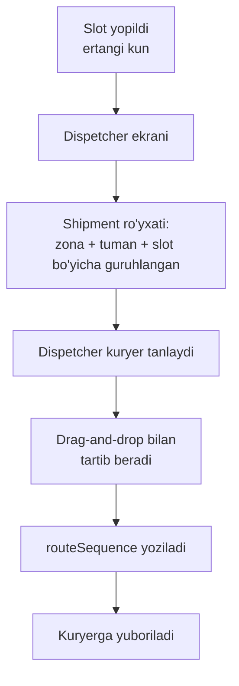

Bu — **to'liq yechim**, vaqtinchalik ish emas. Kichik hajmda odam algoritmdan
yaxshiroq qaror qiladi: u biladi "bu mijoz doim kechikadi", "u ko'chada remont bor".

**Kod nima qiladi:**

1. Shipment'larni zona + tuman + slot bo'yicha guruhlaydi (`GROUP BY`).
2. Kuryerning shu slotdagi yukini ko'rsatadi.
3. `routeSequence` ni saqlaydi.

Bu — bir necha yuz qator kod. VRP solver — bir necha ming qator + tashqi
bog'liqlik + hech qanday tasdiqlangan ehtiyoj.

```ts
// packages/contracts/src/delivery/routing.ts

/**
 * Marshrut rejalashtirish interfeysi.
 *
 * Hozirgi implementatsiya: ManualRoutePlanner — dispetcher qo'lda tartiblaydi.
 *
 * Kelajakda (agar hajm o'ssa va bu O'LCHOV bilan tasdiqlansa):
 * HeuristicRoutePlanner yoki tashqi xizmat. Bu interfeys o'zgarmaydi.
 *
 * ⚠️ Optimizatsiyaga o'tish MEZONI hozircha yo'q — kunlik buyurtma soni
 * noma'lum (Ochiq savol №1). Mezon: dispetcher rejalashtirishga sarflagan
 * vaqt sezilarli bo'lgan payt. Bu vaqtni O'LCHASH kerak.
 */
export interface RoutePlanner {
  plan(input: RoutePlanInput): Promise<RoutePlanResult>;
}

export interface RoutePlanInput {
  readonly date: string; // 'YYYY-MM-DD'
  readonly slotId: string;
  readonly shipments: readonly RoutableShipment[];
  readonly couriers: readonly AvailableCourier[];
}

export interface RoutableShipment {
  readonly shipmentId: string;
  readonly zoneId: string;
  readonly districtCode: string;
  readonly lat: number | null; // geokodlash bo'lsa
  readonly lng: number | null;
  readonly fragility: FragilityLevel;
  readonly volumeCm3: number | null;
  readonly weightGrams: number | null;
}

export interface RoutePlanResult {
  readonly assignments: ReadonlyArray<{
    readonly courierId: string;
    readonly stops: ReadonlyArray<{
      readonly shipmentId: string;
      readonly sequence: number;
    }>;
  }>;
  /** Tayinlanmagan — dispetcher qo'lda hal qiladi */
  readonly unassigned: readonly string[];
  readonly plannerKind: 'manual' | 'heuristic';
}
```

#### Xarita API — ochiq savol

Agar keyinchalik optimizatsiya kerak bo'lsa, masofa matritsasi kerak
("A dan B gacha necha daqiqa"). Variantlar:

| Variant                          | Ijobiy                                                                 | Salbiy                                                                                                          |
| -------------------------------- | ---------------------------------------------------------------------- | --------------------------------------------------------------------------------------------------------------- |
| **Yandex Maps API**              | O'zbekiston/MDH da qamrovi yaxshiroq. Yandex Go O'zbekistonda ishlaydi | Narx va limitlar **noma'lum**. Shartlar tekshirilishi kerak                                                     |
| **Google Maps API**              | Yetuk API, hujjatlari yaxshi                                           | O'zbekiston yo'l ma'lumotlari sifati **noma'lum**. To'lov karta bilan — O'zbekistondan murakkab bo'lishi mumkin |
| **OpenStreetMap + OSRM**         | Bepul, o'zimizda hostlanadi, limit yo'q                                | O'zbekiston OSM ma'lumotlari to'liqligi **noma'lum**. Server saqlash kerak                                      |
| **Yo'q — to'g'ri chiziq masofa** | Bepul, oddiy                                                           | Toshkentda to'g'ri chiziq ≠ haqiqiy yo'l. Faqat qo'pol guruhlash uchun                                          |

⚠️ **Hech biri tekshirilmagan.** Qamrov sifati va narxlarni **to'qib chiqarmayman**
(kanon §2). → **Ochiq savol №2.**

Boshlang'ich qaror: **hech qanday xarita API yo'q.** Guruhlash — `districtCode`
bo'yicha. Bu yetarli, chunki dispetcher Toshkentni o'zi biladi.

### 5.4. Kuryer ilovasi — ochiq savol

Kuryer nima bilan ishlaydi? Uchta variant:

| Variant          | Ijobiy                                                                                                                                           | Salbiy                                                                                                          |
| ---------------- | ------------------------------------------------------------------------------------------------------------------------------------------------ | --------------------------------------------------------------------------------------------------------------- |
| **Telegram bot** | O'zbekistonda hamma Telegram'da. O'rnatish kerak emas. Kanon §6 da Telegram bot **allaqachon bor** — yangi bog'liqlik emas. Foto yuborish tabiiy | Offline ishlamaydi. UI cheklangan (tugmalar, inline keyboard). Geolokatsiya — mumkin, lekin doimiy kuzatuv yo'q |
| **PWA**          | To'liq UI nazorati. Offline (service worker + IndexedDB). Kamera, GPS. Store'ga chiqarish shart emas                                             | Yozish kerak — bu **yangi ilova** (`apps/courier`). Kanon §6 da bunday app yo'q. iOS Safari'da PWA cheklovlari  |
| **Native**       | Eng yaxshi tajriba, fon rejimida GPS                                                                                                             | Katta ish. React Native/Flutter — **yangi stack**. Kanon §6 buni qo'llamaydi                                    |

**Native — darrov rad etiladi:** kanon §6 texnologiya ro'yxati qat'iy, mobil
stack u yerda yo'q.

**Telegram bot vs PWA — hal qilinmagan.** Hal qiluvchi savol:
**kuryerga offline rejim kerakmi?**

Toshkentda mobil internet bor, lekin: yerto'lada, ba'zi binolarda signal yo'qoladi.
Kuryer "yetkazildi" tugmasini bosolmasa — bu jiddiy muammomi yoki 5 daqiqadan
keyin bosadimi?

**Amaliy taklif:** Telegram botdan boshlash. Sabablari:

1. Kanon §6 da Telegram bot allaqachon rejalashtirilgan — infratuzilma bor.
2. Kuryerlar soni kam (ehtimol) — o'qitish oson.
3. PWA yozish — haftalar. Bot — kunlar.
4. Bot yetarli bo'lmasa, PWA ga o'tish mumkin; teskarisi ham to'g'ri.

Lekin **bu tasdiqlanmagan taklif**, kanon qarori emas. → **Ochiq savol №3.**

---

## 6. Buyurtma yig'ish (picking)

### 6.1. Oqim

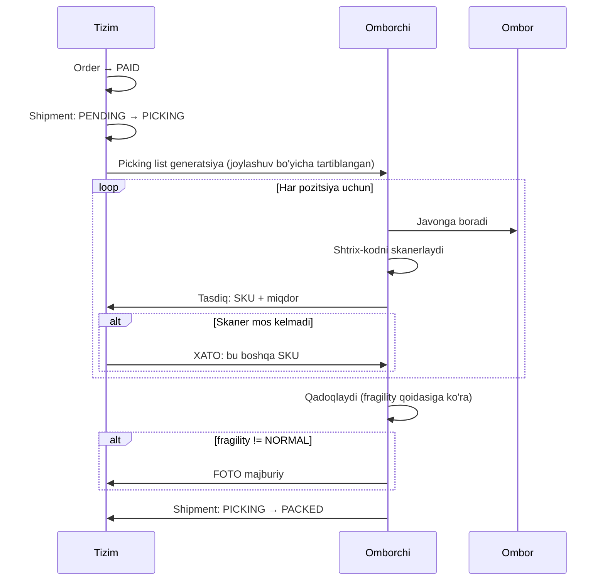

### 6.2. Picking list tartibi

Naive yondashuv: `OrderItem` tartibida. **Bu sekin** — omborchi javonlar orasida
u yoq-bu yoqqa yuguradi.

To'g'ri yondashuv: **ombordagi joylashuv bo'yicha tartiblash**. `StockItem` da
joylashuv bor (`docs/06-inventory-and-reservations.md`: `location`).

```ts
export interface PickingListItem {
  readonly orderItemId: string;
  readonly sku: string;
  readonly productName: string;
  readonly variantLabel: string; // "Xrom, 60cm, 6 lampa"
  readonly quantity: number;
  /** Ombordagi joy: "A-12-3" (qator-javon-polka) */
  readonly location: string | null;
  readonly barcode: string | null;
  readonly fragility: FragilityLevel;
  /** Qadoqlash yo'riqnomasi — mo'rt bo'lsa ko'rsatiladi */
  readonly packagingNoteUz: string | null;
}

export interface PickingList {
  readonly shipmentId: string;
  readonly orderNumber: string;
  readonly warehouseId: string;
  /** Ombordagi joylashuv bo'yicha TARTIBLANGAN */
  readonly items: readonly PickingListItem[];
  readonly requiresPhoto: boolean;
  readonly generatedAt: Date;
}

/**
 * Picking list'ni ombordagi yo'l bo'yicha tartiblaydi.
 *
 * `location` formati: "A-12-3" → qator A, javon 12, polka 3.
 * Tartib: qator (alifbo) → javon (raqam) → polka (raqam).
 *
 * ⚠️ Bu SODDA tartib — u omborchi qatorlar bo'ylab ketma-ket yuradi deb
 * faraz qiladi. Real ombor tartibi (S-shaklidagi yo'l, bir tomonlama
 * yo'laklar) NOMA'LUM — ombor rejasi yo'q. Ochiq savol №5.
 *
 * `location` null bo'lgan pozitsiyalar oxiriga tushadi — omborchi ularni
 * qo'lda qidiradi.
 */
export function sortByPickingPath(items: readonly PickingListItem[]): readonly PickingListItem[] {
  return [...items].sort((a, b) => {
    if (a.location === null && b.location === null) return 0;
    if (a.location === null) return 1;
    if (b.location === null) return -1;
    return compareLocation(a.location, b.location);
  });
}

function compareLocation(a: string, b: string): number {
  const pa = a.split('-');
  const pb = b.split('-');
  for (let i = 0; i < Math.max(pa.length, pb.length); i += 1) {
    const sa = pa[i] ?? '';
    const sb = pb[i] ?? '';
    const na = Number.parseInt(sa, 10);
    const nb = Number.parseInt(sb, 10);
    // Ikkalasi ham raqam bo'lsa — raqam sifatida (12 < 3 emas, 3 < 12)
    if (!Number.isNaN(na) && !Number.isNaN(nb)) {
      if (na !== nb) return na - nb;
      continue;
    }
    const cmp = sa.localeCompare(sb);
    if (cmp !== 0) return cmp;
  }
  return 0;
}
```

### 6.3. Shtrix-kod skaner

Kanon §5.2: shtrix-kod ombor qamrovida.

**Nega skaner kerak:** yoritishda variant matritsasi (kanon §9.4) — bir qandilning
24 SKU si. "Xrom 60cm 6 lampa" va "Nikel 60cm 6 lampa" **ko'zga bir xil ko'rinadi**.
Omborchi xato oladi. Skaner buni oldini oladi.

**Texnik yechim:** USB HID skaner — klaviatura sifatida ishlaydi. Kod yozish kerak
emas, brauzer `input` ni oladi.

```ts
/**
 * Skanerlangan shtrix-kodni tekshiradi.
 *
 * MUHIM: skaner "klaviatura" — u matnni tez yozadi va Enter bosadi.
 * Frontend buni oddiy input sifatida qabul qiladi. Maxsus drayver kerak emas.
 *
 * Xato holatlar:
 *  - wrong_sku: boshqa mahsulot skanerlandi (variant matritsasi tuzog'i)
 *  - not_in_list: bu buyurtmada bunday tovar yo'q
 *  - already_picked: bu pozitsiya allaqachon yig'ilgan
 */
export type ScanResult =
  | { readonly kind: 'ok'; readonly orderItemId: string; readonly remaining: number }
  | { readonly kind: 'wrong_sku'; readonly scannedSku: string; readonly expectedSku: string }
  | { readonly kind: 'not_in_list'; readonly scannedBarcode: string }
  | { readonly kind: 'already_picked'; readonly orderItemId: string };
```

### 6.4. Batch picking

**Muammo:** 5 ta buyurtmada bir xil "E27 LED lampa" bor. Omborchi 5 marta bir
javonga boradi.

**Yechim:** bir necha buyurtmani birga yig'ish. SKU bo'yicha jamlanadi, keyin
buyurtmalarga taqsimlanadi (sorting).

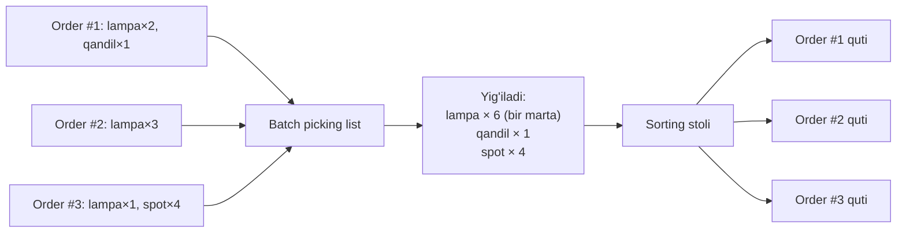

**Ijobiy:** yurish kamayadi.
**Salbiy:** sorting bosqichi qo'shiladi — bu **yangi xato manbai**. Omborchi
lampani noto'g'ri qutiga solishi mumkin.

⚠️ **Batch picking qachon foydali?** Buyurtmalar orasida SKU takrorlanishi
yuqori bo'lsa. Kelvin'da bu qanchalik yuqori? **NOMA'LUM** — real buyurtma
ma'lumoti yo'q.

**Qaror:** MVP da **batch picking YO'Q**. Bitta buyurtma — bitta picking list.
Sabab: qo'shimcha xato manbai, isbotlanmagan foyda.

Kelajakda: agar o'lchov ko'rsatsa (SKU takrorlanishi yuqori + yig'ish vaqti
muammo bo'lsa) — qo'shiladi. → **Ochiq savol №6.**

---

## 7. Mijozga xabar

### 7.1. Kanallar

Kanon §6 va §7 (modul 16 `notification`):

- **SMS** — Eskiz.uz
- **Telegram bot**
- **Email** — O'zbekistonda kuchsiz kanal, lekin bor

Push? Storefront — veb (kanon §3). Web Push mumkin, lekin iOS Safari'da
cheklangan va foydalanuvchi ruxsat berishi kerak. **MVP da yo'q.**

### 7.2. Qaysi bosqichda qanday xabar

| Hodisa                       | SMS | Telegram | Email | Nega                                        |
| ---------------------------- | --- | -------- | ----- | ------------------------------------------- |
| Buyurtma qabul qilindi       | ✅  | ✅       | ✅    | Mijoz kutadi. Buyurtma raqami kerak         |
| To'lov o'tdi                 | ✅  | ✅       | ✅    | Pul — muhim                                 |
| To'lov muvaffaqiyatsiz       | ✅  | ✅       | —     | Shoshilinch: rezerv TTL ketyapti            |
| Yig'ilyapti (PICKING)        | —   | ✅       | —     | Kam qiziq. SMS = pul, arzimaydi             |
| Kuryerga topshirildi         | ✅  | ✅       | —     | Mijoz uyda bo'lishi kerak                   |
| Kuryer yo'lda                | —   | ✅       | —     | "Bugun kuryer keladi" — SMS ortiqcha        |
| Yetkazildi                   | —   | ✅       | ✅    | Tasdiq. Sharh so'rash uchun ham             |
| Yetkazib bo'lmadi            | ✅  | ✅       | —     | Kritik: mijoz nima bo'lganini bilishi kerak |
| O'rnatish sanasi tasdiqlandi | ✅  | ✅       | ✅    | Mijoz kunini rejalashtirishi kerak          |
| O'rnatish — ertaga eslatma   | ✅  | ✅       | —     | Unutmasin                                   |
| Qaytarish qabul qilindi      | ✅  | ✅       | ✅    | Pul qaytishi bilan bog'liq                  |

**Printsip:** SMS — **pul turadi**. Faqat mijoz **harakat qilishi kerak** bo'lgan
yoki **pul** bilan bog'liq hodisalarda. Telegram — bepul, ko'proq yuborish mumkin.

### 7.3. Kanal tanlash

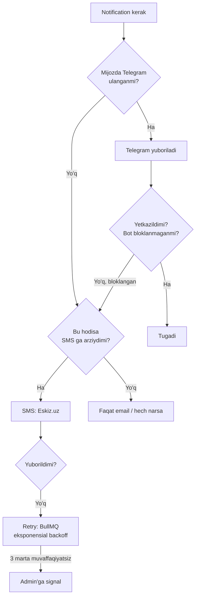

### 7.4. Eskiz.uz integratsiyasi

⚠️ **Kanon §2 va §10: API detallari to'qib chiqarilmaydi.**

Ma'lum:

- Eskiz.uz — O'zbekistondagi SMS provayder (kanon §6 da tanlangan).
- SMS uchun **shablon tasdiqlanishi** kerak — bu MDH bozorlarida odatiy amaliyot.

**NOMA'LUM va rasmiy hujjatdan tekshirilishi kerak:**

- Autentifikatsiya usuli (token? qancha yashaydi? qanday yangilanadi?)
- Endpoint URL, so'rov/javob formati
- Yetkazish statusi qanday olinadi — callback (webhook) yoki polling?
- Narx, kunlik limit, tezlik cheklovi (rate limit)
- Shablonni tasdiqlash muddati
- Xato kodlari

→ **Ochiq savol №10.**

**Shu sababli — abstraksiya:**

```ts
// packages/contracts/src/notification/sms-provider.ts

/**
 * SMS provayder interfeysi.
 *
 * Kelvin uchun implementatsiya: Eskiz.uz (kanon §6).
 *
 * ⚠️ Eskiz API detallari TEKSHIRILMAGAN (Ochiq savol №10).
 * Shuning uchun ilova mantiqi FAQAT shu interfeysga bog'lanadi.
 * Eskiz'ning haqiqiy API si boshqacha chiqsa — faqat adapter o'zgaradi.
 *
 * Testda: FakeSmsProvider.
 */
export interface SmsProvider {
  send(message: OutboundSms): Promise<SmsSendResult>;
  /** Provayder polling talab qilsa. Webhook bo'lsa — kerak emas. */
  getStatus?(providerMessageId: string): Promise<SmsDeliveryStatus>;
}

export interface OutboundSms {
  /** E.164 formatida: +998901234567 */
  readonly phone: string;
  /**
   * Shablon kodi. Matn EMAS — provayder tasdiqlangan shablon talab qiladi.
   * ⚠️ Shablon tasdiqlash jarayoni tekshirilmagan.
   */
  readonly templateCode: string;
  readonly variables: Readonly<Record<string, string>>;
  /** Idempotentlik kaliti — takroriy yuborishni oldini oladi */
  readonly idempotencyKey: string;
}

export type SmsSendResult =
  | { readonly kind: 'accepted'; readonly providerMessageId: string }
  | { readonly kind: 'rejected'; readonly reason: string; readonly retryable: boolean }
  | { readonly kind: 'rate_limited'; readonly retryAfterMs: number };

export type SmsDeliveryStatus = 'pending' | 'delivered' | 'failed' | 'expired' | 'unknown';
```

### 7.5. Idempotentlik — kritik

**Muammo:** BullMQ job qayta ishga tushdi (server restart, timeout). SMS ikki
marta ketdi. Mijoz bir xil xabarni ikki marta oldi. Do'kon ikki marta to'ladi.

**Yechim:** `Notification` yozuvi `idempotencyKey` bilan. Kalit — hodisadan
hosil qilinadi:

```ts
/**
 * Idempotentlik kaliti — hodisadan DETERMINISTIK hosil qilinadi.
 *
 * Bir xil hodisa → bir xil kalit → ikkinchi yuborish rad etiladi.
 *
 * Vaqt yoki random ISHLATILMAYDI — aks holda idempotentlik buziladi.
 */
export function buildNotificationKey(
  entityType: 'order' | 'shipment' | 'installation_job',
  entityId: string,
  event: string,
  channel: 'sms' | 'telegram' | 'email',
): string {
  return `${entityType}:${entityId}:${event}:${channel}`;
}
```

`Notification` jadvalida `@@unique([idempotencyKey])`. Ikkinchi urinish
`P2002` (unique constraint) bilan tushadi → job "muvaffaqiyatli" deb yopiladi.

**Transactional outbox** (kanon §8) bu yerda ishlaydi: `Shipment` holati
o'zgargan **bir tranzaksiyada** `OutboxEvent` yoziladi. Keyin worker uni
o'qib xabar yuboradi. Shunda "holat o'zgardi, lekin xabar ketmadi" holati
bo'lmaydi.

---

## 8. Qaytarish logistikasi

### 8.1. Ikki xil qaytarish

Bu farq muhim, chunki **oqimlar boshqacha**:

| Tur                        | Sabab                                       | Kim to'laydi                     | Tovar taqdiri                |
| -------------------------- | ------------------------------------------- | -------------------------------- | ---------------------------- |
| **Shikast** (`DAMAGED`)    | Singan holda yetdi                          | Do'kon (yoki kuryer/ta'minotchi) | Brak yoki ta'minotchiga      |
| **Voz kechish** (`RETURN`) | Mijoz fikrini o'zgartirdi, rang mos kelmadi | ⚠️ Yuridik savol                 | Tekshiruvdan keyin — omborga |

### 8.2. Qaytarish oqimi

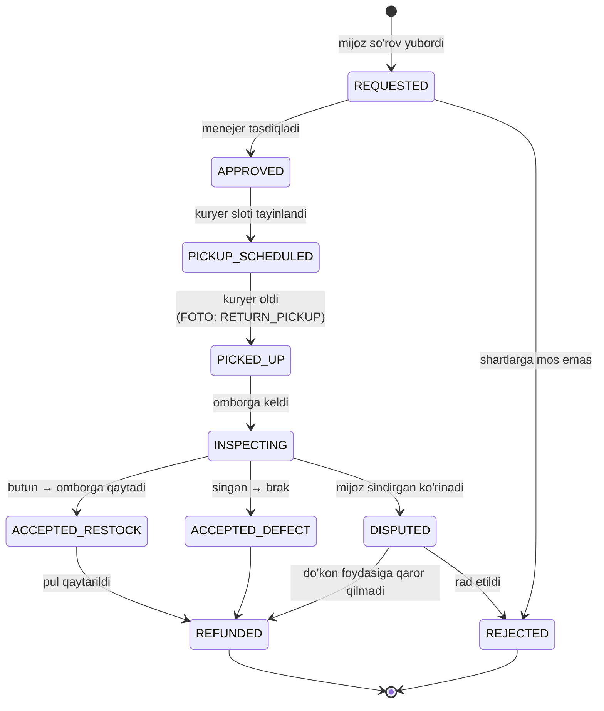

### 8.3. Tekshiruv — nozik bosqich

Qandil qaytdi. Omborchi qaror qiladi:

1. **Butun, qadoqi buzilmagan** → `ACCEPTED_RESTOCK`. `StockItem` ga qaytadi.
   `StockMovement` yoziladi (`kind: RETURN_IN` — `docs/06`).
2. **Singan** → `ACCEPTED_DEFECT`. Omborga **qaytmaydi**. Brak hisobiga.
3. **Ishlatilgan izlari bor** (o'rnatilgan, teshiklar bor) → `DISPUTED`.

**Har uch holat uchun FOTO majburiy.** Bu — nizo bo'lsa yagona dalil.

```ts
export type ReturnInspectionOutcome =
  | {
      readonly kind: 'restock';
      readonly warehouseId: string;
      readonly location: string;
    }
  | {
      readonly kind: 'defect';
      readonly defectReason: string;
      /** Ta'minotchiga da'vo qilinadimi? (docs/06: PurchaseOrder) */
      readonly claimToSupplier: boolean;
    }
  | {
      readonly kind: 'disputed';
      readonly reason: string;
      /** Menejer qaroriga chiqadi */
      readonly escalatedTo: string;
    };

export interface ReturnInspection {
  readonly returnId: string;
  readonly inspectedBy: string;
  readonly inspectedAt: Date;
  readonly outcome: ReturnInspectionOutcome;
  /** Majburiy — kamida 1 ta foto */
  readonly photoKeys: readonly [string, ...string[]];
  readonly note: string | null;
}
```

> `readonly [string, ...string[]]` — TypeScript'da "kamida bitta element"
> tipi. Bo'sh massiv kompilyatsiya bo'lmaydi. Foto majburiyligini **tip
> tizimi** majburlaydi, runtime tekshiruvi emas.

### 8.4. Pul qaytarish

Bu — `docs/08-payments-and-installments.md` mavzusi (`Refund`, `LedgerEntry`).
Bu yerda faqat **bog'lanish nuqtasi**:

- Qaytarish `REFUNDED` ga o'tishi uchun `payment` moduli `Refund` yaratishi kerak.
- Yetkazish narxi qaytariladimi? ⚠️ **Yuridik + biznes savoli** (Ochiq savol №11).
- Rassrochka bo'lsa — `InstallmentSchedule` qayta hisoblanadi. Bu murakkab →
  `docs/08` ga havola.

### 8.5. Qaytarish sabablari statistikasi

Bu — do'kon uchun qimmatli signal:

```ts
export interface ReturnReasonStats {
  readonly reason: string;
  readonly count: number;
  /** Umumiy qiymat, tiyin */
  readonly totalValue: bigint;
  readonly productIds: readonly string[];
}
```

Agar bitta qandil bo'yicha "rang mos kelmadi" ko'p bo'lsa — **rasm yomon**
(kontent muammosi). Agar "singan keldi" ko'p bo'lsa — **qadoqlash yomon**
(logistika muammosi). Bir xil ma'lumot, ikki xil xulosa.

Batafsil: `docs/10-crm-pos-analytics.md`.

---

## 9. TypeScript tiplari — jamlanma

```ts
// packages/contracts/src/delivery/index.ts

// ─── Zona ───────────────────────────────────────────────────────────────
export interface DeliveryZoneDto {
  readonly id: string;
  readonly code: string;
  readonly nameUz: string;
  readonly nameRu: string;
  readonly basePrice: string; // BigInt → JSON: string (pastdagi izohga qara)
  readonly currency: 'UZS';
  readonly freeThreshold: string | null;
  readonly etaMinDays: number;
  readonly etaMaxDays: number;
  readonly slotsEnabled: boolean;
  readonly installationEnabled: boolean;
}

// ─── Slot ───────────────────────────────────────────────────────────────
export interface DeliverySlotDto {
  readonly id: string;
  readonly zoneId: string;
  readonly date: string; // 'YYYY-MM-DD' (Toshkent lokal sanasi)
  readonly startTime: string; // 'HH:mm'
  readonly endTime: string; // 'HH:mm'
  /** Mijozga booked/capacity ko'rsatilmaydi — faqat bor/yo'q */
  readonly isAvailable: boolean;
}

export interface SlotAvailabilityQuery {
  readonly zoneId: string;
  readonly fromDate: string;
  readonly toDate: string;
}

// ─── Shipment ───────────────────────────────────────────────────────────
export type ShipmentStatusDto =
  | 'PENDING'
  | 'PICKING'
  | 'PACKED'
  | 'DISPATCHED'
  | 'IN_TRANSIT'
  | 'DELIVERED'
  | 'FAILED'
  | 'DAMAGED'
  | 'RETURNED'
  | 'CANCELLED';

export interface ShipmentDto {
  readonly id: string;
  readonly orderId: string;
  readonly status: ShipmentStatusDto;
  readonly zoneId: string;
  readonly slot: DeliverySlotDto | null;
  readonly courierName: string | null;
  readonly courierPhone: string | null;
  readonly price: string; // BigInt → string
  readonly currency: 'UZS';
  readonly maxFragility: 'NORMAL' | 'FRAGILE' | 'VERY_FRAGILE';
  readonly dispatchedAt: string | null; // ISO 8601 UTC
  readonly deliveredAt: string | null;
}

// ─── InstallationJob ────────────────────────────────────────────────────
export type InstallationJobStatusDto =
  | 'PENDING'
  | 'SCHEDULED'
  | 'EN_ROUTE'
  | 'IN_PROGRESS'
  | 'COMPLETED'
  | 'FAILED'
  | 'CANCELLED'
  | 'RESCHEDULED';

export interface InstallationJobDto {
  readonly id: string;
  readonly orderId: string;
  readonly status: InstallationJobStatusDto;
  readonly scheduledDate: string | null; // 'YYYY-MM-DD'
  readonly slot: DeliverySlotDto | null;
  readonly crewName: string | null;
  readonly quotedPrice: string; // BigInt → string
  readonly finalPrice: string | null;
  readonly currency: 'UZS';
  readonly customerNote: string | null;
}
```

> **Nega DTO da pul `string`?**
> `JSON.stringify(1n)` — `TypeError: Do not know how to serialize a BigInt`.
> Uni `Number` ga aylantirish — **taqiqlangan** (kanon §8): `Number` 2^53 dan
> katta butun sonni yo'qotadi va suzuvchi nuqta xatosi kiritadi.
> Yechim: DTO chegarasida `BigInt` → `string`. Frontend uni `BigInt(dto.price)`
> bilan qayta o'qiydi yoki formatlash uchun to'g'ridan-to'g'ri ishlatadi.
> Bu qoida **butun loyihada bir xil** — `docs/08` da ham.

### 9.1. Zod sxemalari

```ts
// packages/contracts/src/delivery/schemas.ts
import { z } from 'zod';

/** Pul — string, faqat raqamlardan. BigInt ga aylantiriladi. */
const moneyString = z.string().regex(/^\d+$/, "Pul faqat musbat butun son (tiyin) bo'lishi kerak");

export const createShipmentSchema = z.object({
  orderId: z.string().uuid(),
  zoneId: z.string().uuid(),
  slotId: z.string().uuid().nullable(),
  price: moneyString,
  addressSnapshot: z.object({
    regionCode: z.string().min(1),
    districtCode: z.string().min(1),
    street: z.string().min(1),
    house: z.string().min(1),
    apartment: z.string().optional(),
    landmark: z.string().optional(),
    recipientName: z.string().min(1),
    recipientPhone: z.string().regex(/^\+998\d{9}$/, 'Telefon: +998XXXXXXXXX'),
  }),
});

export const bookSlotSchema = z.object({
  slotId: z.string().uuid(),
  orderId: z.string().uuid(),
});

export const installationRequestSchema = z.object({
  orderId: z.string().uuid(),
  complexity: z.object({
    ceilingHeightCm: z.number().int().min(150).max(1000).nullable(),
    armCount: z.number().int().min(1).max(100),
    weightGrams: z.number().int().min(0),
    ceilingMaterial: z.enum(['concrete', 'drywall', 'wood', 'stretch', 'unknown']),
    hasExistingWiring: z.boolean().nullable(),
    needsDimmer: z.boolean(),
    needsTransformer: z.boolean(),
    unitCount: z.number().int().min(1),
  }),
  preferredDate: z
    .string()
    .regex(/^\d{4}-\d{2}-\d{2}$/)
    .nullable(),
  customerNote: z.string().max(500).nullable(),
});

export type CreateShipmentInput = z.infer<typeof createShipmentSchema>;
export type BookSlotInput = z.infer<typeof bookSlotSchema>;
export type InstallationRequestInput = z.infer<typeof installationRequestSchema>;
```

> `ceilingHeightCm` chegaralari (150-1000 sm) — **sanity check**, biznes qoidasi
> emas. 1.5 m dan past yoki 10 m dan baland shift — kiritish xatosi ehtimoli
> yuqori. Bu raqamlar to'qib chiqarilgan me'yor emas, faqat validatsiya chegarasi.

---

## 10. Acceptance criteria

### 10.1. Zona

- [ ] `DeliveryZone` CRUD admin panelda ishlaydi.
- [ ] Bitta tuman ikki zonaga biriktirilsa — DB `unique` xatosi qaytaradi.
- [ ] `resolveZone()` qamrovdan tashqari manzil uchun `out_of_coverage` qaytaradi,
      exception tashlamaydi.
- [ ] Yetkazish narxi **chegirmadan keyingi** summadan hisoblanadi.
- [ ] O'rnatish narxi bepul yetkazish chegarasiga **qo'shilmaydi**.
- [ ] Barcha pul qiymatlari `BigInt`. Kod bazasida `parseFloat`/`Number()` pul
      ustida ishlatilmaydi — ESLint qoidasi bilan tekshiriladi.

### 10.2. Slot

- [ ] Slot generatsiya job'i idempotent: ikki marta ishlasa dublikat yaratmaydi.
- [ ] `DeliveryCalendarException` da `isWorking=false` bo'lgan kunga slot
      yaratilmaydi.
- [ ] **Property test:** N ta parallel `tryBook()` da muvaffaqiyatli
      natijalar soni hech qachon `capacity` dan oshmaydi (`fast-check`,
      Testcontainers, real PostgreSQL).
- [ ] `booked > capacity` holati DB `CHECK` constraint bilan imkonsiz.
- [ ] To'lov muvaffaqiyatsiz bo'lsa / TTL tugasa — slot **avtomatik** bo'shaydi.
- [ ] Slot TTL qiymati `docs/06` dagi rezerv TTL bilan **bir xil** manbadan olinadi.
- [ ] Bloklangan slot (`isBlocked=true`) band qilinmaydi.
- [ ] Mijozga `booked`/`capacity` ko'rsatilmaydi — faqat `isAvailable`.

### 10.3. Mo'rt tovar

- [ ] `fragility != NORMAL` bo'lgan `Shipment` `PACKED` fotosisiz `DISPATCHED`
      ga o'ta olmaydi.
- [ ] `HANDOVER` fotosi kuryer tayinlanganda majburiy.
- [ ] `Shipment.maxFragility` buyurtmadagi **eng mo'rt** tovardan hisoblanadi.
- [ ] Picking list'da qadoqlash yo'riqnomasi ko'rsatiladi.
- [ ] `DAMAGED` holatidan qaytarish oqimi avtomatik ochiladi.

### 10.4. O'rnatish

- [ ] `InstallationJob` `Order` ga bog'lanadi, `Shipment` ga **emas**.
- [ ] O'rnatish sanasi yetkazish sanasidan oldin bo'lsa — validatsiya xatosi.
- [ ] `installationEnabled=false` zonada o'rnatish taklif qilinmaydi.
- [ ] Checkout'da o'rnatish **standart bo'yicha belgilanmagan** (opt-in).
- [ ] Narx `isEstimate: true` bilan qaytadi va UI da "taxminiy" deb ko'rsatiladi.
- [ ] `finalPrice != quotedPrice` bo'lsa — mijozga tasdiqlash so'raladi.
- [ ] Narx qoidalari DB dan o'qiladi, kodda qattiq yozilgan koeffitsiyent yo'q.
- [ ] Bir xil `complexity` → bir xil narx (determinizm testi).

### 10.5. Kuryer va marshrut

- [ ] `Shipment` holat o'tishlari `canTransition()` bilan tekshiriladi;
      noto'g'ri o'tish rad etiladi.
- [ ] Dispetcher ekranida shipment'lar zona + tuman + slot bo'yicha guruhlanadi.
- [ ] `routeSequence` qo'lda o'rnatiladi va saqlanadi.
- [ ] Kuryerga faqat **o'ziga tayinlangan** shipment'lar ko'rinadi (RBAC —
      `docs/11-security.md`).
- [ ] Tizim **hech qanday tashqi xarita API siz** to'liq ishlaydi.

### 10.6. Picking

- [ ] Picking list `location` bo'yicha tartiblangan.
- [ ] `location = null` pozitsiyalar ro'yxat oxirida.
- [ ] Noto'g'ri shtrix-kod skanerlansa — `wrong_sku` qaytadi, pozitsiya
      yig'ilgan deb belgilanmaydi.
- [ ] Barcha pozitsiya yig'ilmaguncha `PACKED` ga o'tib bo'lmaydi.

### 10.7. Xabar

- [ ] Har xabar `idempotencyKey` bilan yoziladi; takroriy yuborish bo'lmaydi.
- [ ] SMS faqat jadvalda (§7.2) belgilangan hodisalarda ketadi.
- [ ] Telegram yetkazilmasa (bloklangan) — SMS ga fallback (agar hodisa arziysa).
- [ ] Xabar yuborish `OutboxEvent` orqali — holat o'zgarishi bilan bir tranzaksiyada.
- [ ] Ilova mantiqi `SmsProvider` interfeysiga bog'lanadi, Eskiz'ga to'g'ridan-to'g'ri emas.
- [ ] Testda `FakeSmsProvider` ishlatiladi; real SMS ketmaydi.

### 10.8. Qaytarish

- [ ] Tekshiruvda kamida 1 ta foto majburiy (tip darajasida).
- [ ] `restock` natijasi `StockMovement` yaratadi (`docs/06`).
- [ ] `defect` natijasi omborga qaytarmaydi.
- [ ] `REFUNDED` ga o'tish `payment` modulida `Refund` bo'lmasa — imkonsiz.

---

## 11. Ochiq savollar

> Kanon §2: aniq bo'lmasa "o'lchov bilan aniqlanadi" deb yoziladi.
> Quyidagilar — **javob berilmagan** savollar. Ular loyiha egasi, do'kon egasi
> yoki yuristdan javob talab qiladi.

| №      | Savol                                                                                                                                  | Kimga                              | Nega muhim                                                                                                                                                                                |
| ------ | -------------------------------------------------------------------------------------------------------------------------------------- | ---------------------------------- | ----------------------------------------------------------------------------------------------------------------------------------------------------------------------------------------- |
| **1**  | **Do'kon kuniga nechta buyurtma yetkazadi? Necha kuryer bor? Bitta kuryer bir slotda nechta manzilga yetib boradi?**                   | Do'kon egasi                       | Bu — bu hujjatdagi eng muhim noma'lum. Slot `capacity`, marshrut optimizatsiyasi kerakligi, batch picking foydasi — hammasi shunga bog'liq. Bu raqamsiz §2 va §5 dagi qarorlar **taxmin** |
| **2**  | Xarita API: Yandex, Google, OSM yoki hech biri? Narx, limit, O'zbekiston qamrovi sifati?                                               | Loyiha egasi + o'lchov             | Geokodlash va masofa matritsasi shunga bog'liq. Hozircha "hech biri" tanlangan                                                                                                            |
| **3**  | Kuryer nima bilan ishlaydi — Telegram bot yoki PWA? Offline rejim kerakmi?                                                             | Do'kon egasi                       | Telegram bot taklif qilingan (kanon §6 da bor), lekin bu tasdiqlanmagan. PWA — `apps/courier` yangi ilova, kanon §6 ni kengaytiradi                                                       |
| **4**  | Oversized tovar (3 m trek, 15 kg qandil) qanday belgilanadi — qo'lda bayroq yoki `weight`/`dimensions` dan avtomatik? Chegara qayerda? | Do'kon egasi                       | Avtomatik to'g'riroq, lekin chegara koeffitsiyentlari noma'lum                                                                                                                            |
| **5**  | Ombor rejasi qanday? `location` formati ("A-12-3")? Omborchi qanday yo'l bilan yuradi?                                                 | Do'kon egasi                       | Picking list tartibi shunga bog'liq. Hozirgi sodda tartib faraz asosida                                                                                                                   |
| **6**  | Buyurtmalar orasida SKU takrorlanishi qanchalik yuqori?                                                                                | O'lchov (real ma'lumot kerak)      | Batch picking foydasi shunga bog'liq. MVP da batch yo'q                                                                                                                                   |
| **7**  | **Kuryer singan tovar uchun moddiy javobgar bo'ladimi? Qanday hujjat bilan?**                                                          | ⚖️ **Yurist**                      | Mehnat kodeksi moddiy javobgarlik cheklovlari + shartnoma turi. Kanon §10: yuridik maslahat berilmaydi                                                                                    |
| **8**  | `InstallationCrew` — kanon §8 entity ro'yxatiga qo'shiladimi?                                                                          | Kanon egasi                        | `InstallationJob` kimgadir tayinlanishi kerak. `Courier` ni ishlatish — semantik xato                                                                                                     |
| **9**  | Usta kelib narxni oshirsa, mijoz rozi bo'lmasa — kim yo'l xarajatini to'laydi?                                                         | Do'kon egasi                       | Biznes siyosati. Tizim buni faqat qayd qiladi                                                                                                                                             |
| **10** | **Eskiz.uz API:** auth usuli, endpoint, yetkazish statusi (webhook yoki polling?), narx, limit, shablon tasdiqlash muddati?            | Rasmiy hujjat                      | Kanon §10: API detallari to'qib chiqarilmaydi. Adapter shunga qarab yoziladi                                                                                                              |
| **11** | Qaytarishda yetkazib berish narxi mijozga qaytariladimi? Shikast va "fikr o'zgardi" holatlarida farq bormi?                            | ⚖️ **Yurist** + do'kon egasi       | Iste'molchi huquqlari qonunchiligi + biznes siyosati                                                                                                                                      |
| **12** | Viloyatlarga yetkazish o'zimizmi yoki transport kompaniyasi orqalimi? Agar kompaniya bo'lsa — qaysi? Uning API si bormi?               | Do'kon egasi                       | `slotsEnabled=false` deb faraz qilingan. Agar integratsiya kerak bo'lsa — bu yangi katta ish                                                                                              |
| **13** | Bayram va ko'chirilgan dam olish kunlarini kim va qachon kiritadi?                                                                     | Do'kon egasi                       | Hozir: qo'lda, admin panel orqali. Avtomatlashtirish uchun ishonchli manba yo'q                                                                                                           |
| **14** | Slot TTL (mijoz to'lovni tugatmasa, qancha vaqtdan keyin bo'shaydi)?                                                                   | `docs/06` bilan kelishilishi kerak | **Rezerv TTL bilan bir xil bo'lishi shart.** Ikki xil qiymat — nomuvofiqlik manbai                                                                                                        |
| **15** | Mijoz slotni o'zgartira oladimi? Necha marta? Qachongacha (yetkazishdan 24 soat oldin?)                                                | Do'kon egasi                       | Hozir ko'rsatilmagan. Slot `booked` hisobiga ta'sir qiladi                                                                                                                                |

---

## 12. Bog'liq hujjatlar

| Hujjat                                  | Bog'lanish                                                                                                                 |
| --------------------------------------- | -------------------------------------------------------------------------------------------------------------------------- |
| `docs/07-order-and-checkout.md`         | `Order` holat mashinasi, saga. `Shipment` — saga qadami                                                                    |
| `docs/06-inventory-and-reservations.md` | **Rezerv race condition — slot bilan bir xil pattern.** TTL qiymati. `StockMovement` qaytarishda. `location` picking uchun |
| `docs/08-payments-and-installments.md`  | `Refund` qaytarishda. Rassrochka qayta hisobi. Fiskal chek                                                                 |
| `docs/10-crm-pos-analytics.md`          | Qaytarish sabablari statistikasi. Kuryer ko'rsatkichlari                                                                   |
| `docs/11-security.md`                   | Kuryer RBAC (faqat o'z shipment'lari). Manzil — shaxsiy ma'lumot                                                           |
| `docs/05-catalog-and-search.md`         | `Product.fragility`, `weight`, `dimensions`. `Category.requiresInstallation`                                               |
