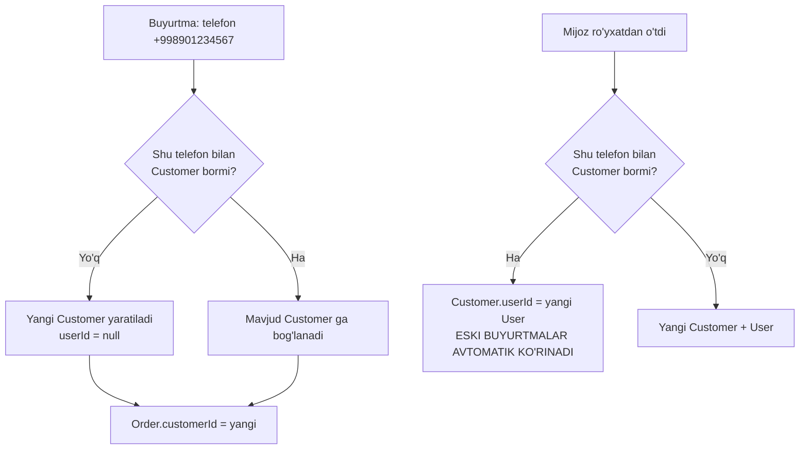
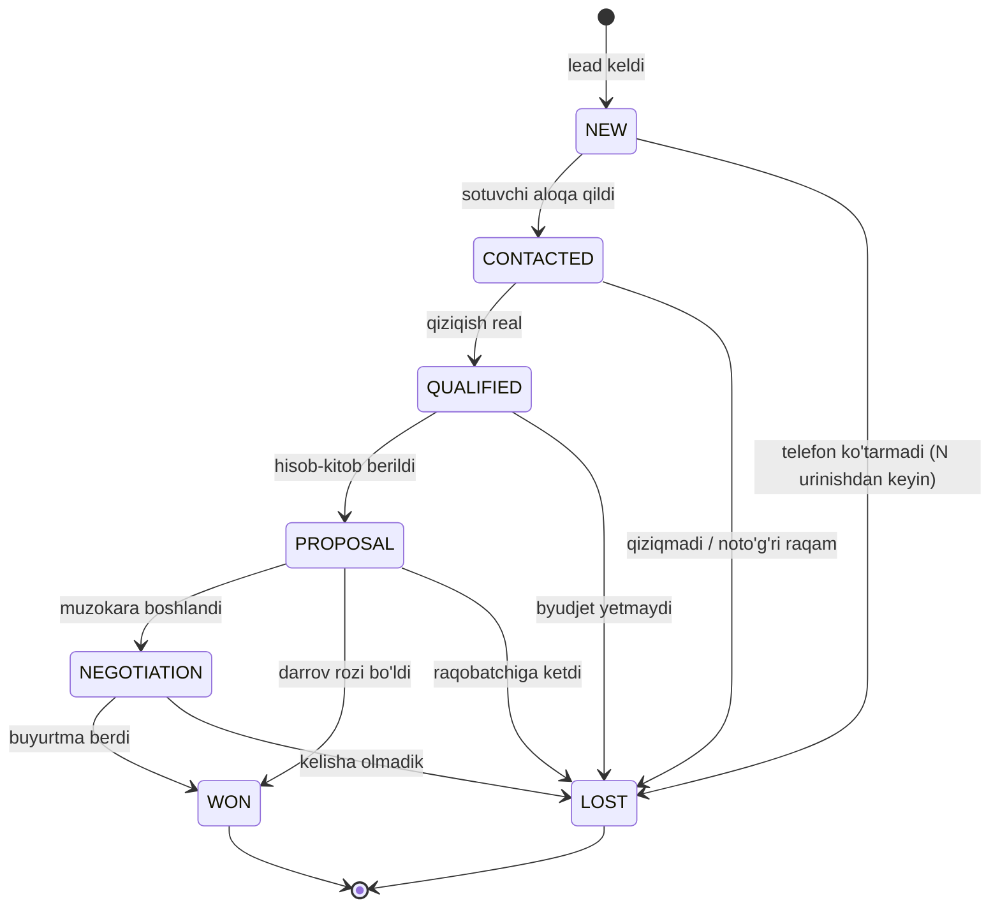
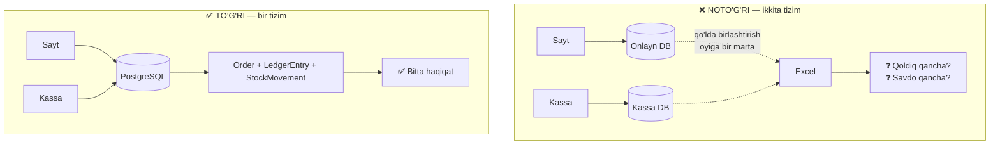
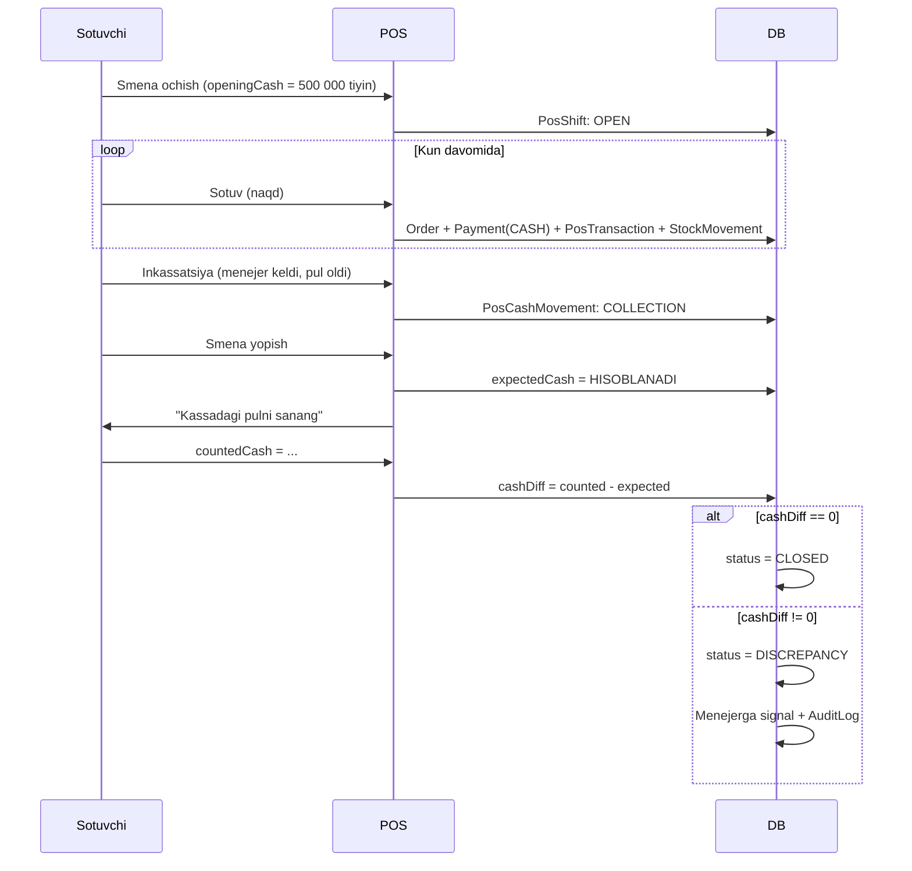
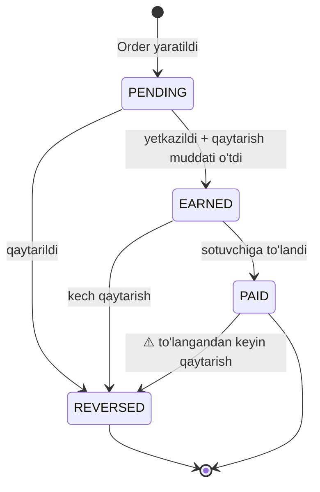
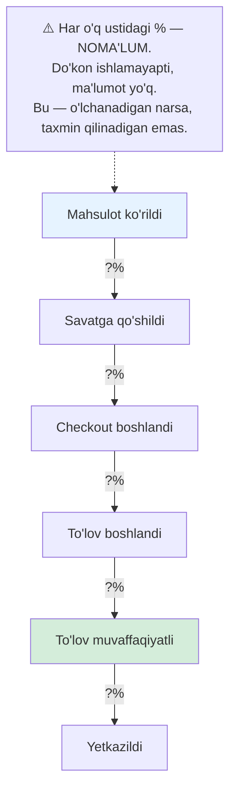
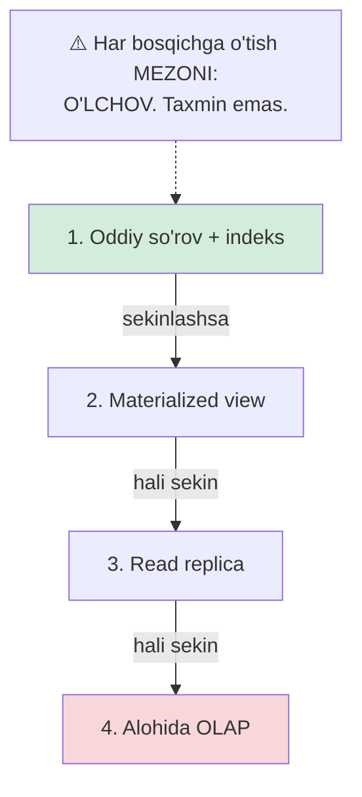
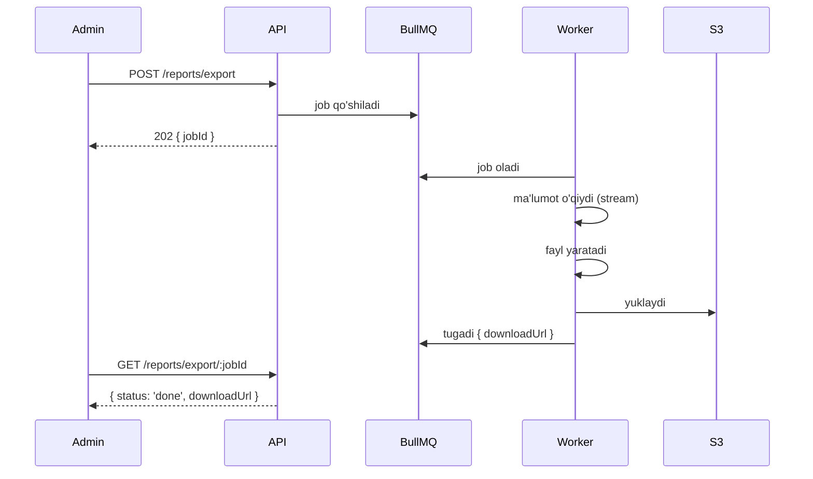
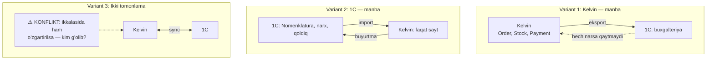

# 10 — CRM, POS va analitika

> Modullar: `crm` (kanon §7, №10), `pos` (№11), `analytics` (№15)
> Entity'lar: `Customer`, `Lead`, `CustomerSegment`, `PosShift`, `PosTransaction`
> Bog'liq hujjatlar: `docs/07-order-and-checkout.md`, `docs/06-inventory-and-reservations.md`,
> `docs/08-payments-and-installments.md`, `docs/09-delivery-and-operations.md`, `docs/11-security.md`

---

## 0. Bu hujjat nima haqida

Uchta bog'liq mavzu:

1. **CRM** — mijoz kim, u qayerdan keldi, u bilan nima bo'ldi.
2. **POS** — do'kon zalidagi kassa. Offline savdo.
3. **Analitika** — do'kon egasi qaror qabul qilishi uchun raqamlar.

Ular bir hujjatda, chunki ular **bitta narsaga tayanadi**: har savdo — onlayn
bo'ladimi, do'kon zalida bo'ladimi — bitta `Order` ga va bitta `LedgerEntry`
zanjiriga tushadi.

### 0.1. Eng muhim arxitektura qarori

> **Onlayn va offline savdo — BIR XIL tizim. Ikkita tizim EMAS.**

Bu hujjatning markaziy qarori. Sabab pastda (§2.1) batafsil, lekin qisqasi:
agar kassa alohida ma'lumot bazasida ishlasa, do'kon egasi "bugun qancha sotdik?"
degan savolga **ikki xil javob** oladi va ularni qo'lda birlashtirishga majbur
bo'ladi. Qoldiq ikki joyda hisoblanadi va ular bir-biriga mos kelmaydi.

### 0.2. Nima YOZILMAYDI

- Konversiya foizi, o'rtacha chek, mijozlar soni, LTV qiymati — **NOMA'LUM**
  (kanon §2). Bu hujjat ularni **qanday hisoblashni** ko'rsatadi, qiymatini emas.
- Fiskal ro'yxatga olish qoidalari — yurist savoli (kanon §10).
- Shaxsiy ma'lumot qonunchiligi talqini — yurist savoli.
- 1C API detallari — **tasdiqlanmagan talab** (kanon §6).

---

## 1. CRM

### 1.1. `Customer` — mijoz profili

```prisma
model Customer {
  id            String    @id @default(uuid(7))

  /// Ro'yxatdan o'tgan mijozda User bor. Mehmon/offline mijozda — null.
  userId        String?   @unique @map("user_id")
  user          User?     @relation(fields: [userId], references: [id])

  /// TELEFON — asosiy identifikator. Pastdagi §1.2 ga qara.
  /// E.164: +998901234567
  phone         String    @unique
  phoneVerified Boolean   @default(false) @map("phone_verified")

  email         String?
  firstName     String?   @map("first_name")
  lastName      String?   @map("last_name")

  /// Mijoz turi — B2B (quruvchi, dizayner) alohida narx olishi mumkin
  kind          CustomerKind @default(INDIVIDUAL)
  /// B2B uchun
  companyName   String?   @map("company_name")
  taxId         String?   @map("tax_id")

  /// Qaysi tilda gaplashadi (kanon §0: o'zbek + rus)
  locale        String    @default("uz")

  /// Marketing xabarlariga rozilik. ⚠️ docs/11-security.md — bu YURIDIK talab
  marketingConsent      Boolean   @default(false) @map("marketing_consent")
  marketingConsentAt    DateTime? @map("marketing_consent_at") @db.Timestamptz(3)

  orders        Order[]
  addresses     Address[]
  leads         Lead[]
  interactions  CustomerInteraction[]
  segments      CustomerSegmentMember[]
  rfm           CustomerRfm?

  createdAt     DateTime  @default(now()) @map("created_at") @db.Timestamptz(3)
  updatedAt     DateTime  @updatedAt @map("updated_at") @db.Timestamptz(3)
  deletedAt     DateTime? @map("deleted_at") @db.Timestamptz(3)

  @@index([phone])
  @@map("customers")
}

enum CustomerKind {
  INDIVIDUAL   /// jismoniy shaxs
  BUSINESS     /// quruvchi, dizayner, tashkilot
}
```

### 1.2. Telefon — asosiy identifikator

**Nega email emas?** O'zbekistonda email kuchsiz kanal. Ko'p mijozda email yo'q
yoki u ishlatilmaydi. Telefon — bor, va u SMS/Telegram uchun ham kerak.

**Nega bu muhim:** mehmon buyurtmasini mijoz profiliga **bog'lash** telefon
orqali bo'ladi.

#### Mehmon buyurtmasini bog'lash

Ssenariy:
1. Mijoz saytga kirdi, ro'yxatdan o'tmadi, `+998901234567` bilan buyurtma berdi.
2. Bir oy o'tib, **do'konga keldi**, kassada yana shu telefon bilan sotib oldi.
3. Yana bir oy o'tib, **ro'yxatdan o'tdi** — shu telefon bilan.

Uchalasi ham **bitta odam**. Tizim buni bilishi kerak.



```ts
// apps/api/src/crm/customer-resolution.service.ts

export type CustomerResolution =
  | { readonly kind: 'existing'; readonly customerId: string }
  | { readonly kind: 'created'; readonly customerId: string };

/**
 * Telefon bo'yicha Customer topadi yoki yaratadi.
 *
 * Bu — mehmon buyurtmasi, offline savdo va ro'yxatdan o'tishni
 * BOG'LAYDIGAN yagona nuqta.
 *
 * Race condition: ikki parallel buyurtma bir xil telefon bilan kelsa —
 * ikkita Customer yaratilishi mumkin. Himoya: phone @unique + upsert.
 */
async resolveByPhone(
  rawPhone: string,
  hint: { firstName?: string; lastName?: string },
): Promise<CustomerResolution> {
  const phone = normalizePhone(rawPhone);

  const existing = await this.prisma.customer.findUnique({
    where: { phone },
    select: { id: true },
  });
  if (existing !== null) {
    return { kind: 'existing', customerId: existing.id };
  }

  try {
    const created = await this.prisma.customer.create({
      data: {
        phone,
        firstName: hint.firstName ?? null,
        lastName: hint.lastName ?? null,
      },
      select: { id: true },
    });
    return { kind: 'created', customerId: created.id };
  } catch (e) {
    // P2002 = unique constraint. Parallel so'rov bizdan oldin yaratdi.
    if (isPrismaUniqueError(e)) {
      const raced = await this.prisma.customer.findUniqueOrThrow({
        where: { phone },
        select: { id: true },
      });
      return { kind: 'existing', customerId: raced.id };
    }
    throw e;
  }
}

/**
 * Telefonni E.164 ga normallashtiradi.
 *
 * O'zbekistonda mijozlar turlicha yozadi:
 *   901234567, 90 123 45 67, +998901234567, 998901234567, 8901234567
 * Hammasi → +998901234567
 *
 * ⚠️ NORMALIZATSIYASIZ telefon identifikator BO'LA OLMAYDI:
 * "90 123 45 67" va "+998901234567" ikki xil Customer yaratadi.
 */
export function normalizePhone(input: string): string {
  const digits = input.replace(/\D/g, '');

  if (digits.length === 9) return `+998${digits}`;                  // 901234567
  if (digits.length === 12 && digits.startsWith('998')) return `+${digits}`;
  if (digits.length === 10 && digits.startsWith('8')) {             // 8901234567
    return `+998${digits.slice(1)}`;
  }
  throw new InvalidPhoneError(input);
}
```

> **`normalizePhone` — kichik funksiya, katta ta'sir.** U bo'lmasa CRM ma'nosini
> yo'qotadi: bir mijoz o'nta profil bo'lib ketadi va RFM, segmentatsiya, LTV —
> hammasi noto'g'ri hisoblanadi.

#### ⚠️ Ochiq savol: telefon o'zgarsa?

Odam raqamini o'zgartirishi mumkin. Yoki eski raqam boshqa odamga berilishi
mumkin (operatorlar shunday qiladi). Unda:
- Yangi odam eski mijozning buyurtmalar tarixini ko'radimi? **Bu — shaxsiy
  ma'lumot sizib chiqishi.**

→ **Ochiq savol №3.**

### 1.3. `Lead` — potentsial mijoz

**Farq:** `Customer` — sotib olgan yoki buyurtma bergan. `Lead` — hali yo'q,
lekin qiziqdi.

Yoritishda lead real: mijoz qandil tanlashda uzoq o'ylaydi (bu ta'mirning
bir qismi), telefon qiladi, "hisob-kitob qilib bering" deydi.

```prisma
model Lead {
  id           String       @id @default(uuid(7))

  /// Lead Customer'ga aylanganda bog'lanadi
  customerId   String?      @map("customer_id")
  customer     Customer?    @relation(fields: [customerId], references: [id])

  phone        String
  name         String?
  email        String?

  source       LeadSource
  /// Manba tafsiloti: qaysi forma, qaysi sahifa, kim tavsiya qildi
  sourceDetail String?      @map("source_detail")

  status       LeadStatus   @default(NEW)

  /// Mas'ul sotuvchi
  assignedToId String?      @map("assigned_to_id")
  assignedTo   User?        @relation(fields: [assignedToId], references: [id])

  /// Taxminiy summa — sotuvchi baholaydi. BigInt, TIYIN (kanon §8)
  estimatedValue BigInt?    @map("estimated_value")
  currency     String       @default("UZS")

  /// Qiziqqan mahsulotlar
  interestedProductIds String[] @map("interested_product_ids")

  /// Yopilish sababi (WON yoki LOST bo'lganda)
  closeReason  String?      @map("close_reason")
  /// WON bo'lsa — qaysi buyurtmaga aylandi
  wonOrderId   String?      @unique @map("won_order_id")

  interactions CustomerInteraction[]
  statusHistory LeadStatusHistory[]

  createdAt    DateTime     @default(now()) @map("created_at") @db.Timestamptz(3)
  updatedAt    DateTime     @updatedAt @map("updated_at") @db.Timestamptz(3)
  closedAt     DateTime?    @map("closed_at") @db.Timestamptz(3)

  @@index([status, assignedToId])
  @@index([phone])
  @@index([createdAt])
  @@map("leads")
}

enum LeadSource {
  WEBSITE_FORM     /// sayt: "bog'lanish" formasi (Contacts sahifasi — kanon §3)
  WEBSITE_CALLBACK /// "qo'ng'iroq qiling" tugmasi
  PHONE_INBOUND    /// mijoz o'zi qo'ng'iroq qildi
  TELEGRAM         /// Telegram bot
  WALK_IN          /// do'konga kirdi, so'radi, ketdi
  REFERRAL         /// tanish tavsiya qildi
  INSTAGRAM        /// ijtimoiy tarmoq
  MARKETPLACE      /// Uzum va h.k. dan savol
  OTHER
}

enum LeadStatus {
  NEW           /// yangi, hali hech kim aloqa qilmadi
  CONTACTED     /// aloqa qilindi
  QUALIFIED     /// haqiqiy qiziqish bor, byudjeti bor
  PROPOSAL      /// taklif berildi (hisob-kitob, tanlov)
  NEGOTIATION   /// muzokara (narx, muddat)
  WON           /// buyurtmaga aylandi
  LOST          /// yo'qotildi
}

model LeadStatusHistory {
  id         String     @id @default(uuid(7))
  leadId     String     @map("lead_id")
  lead       Lead       @relation(fields: [leadId], references: [id])
  fromStatus LeadStatus? @map("from_status")
  toStatus   LeadStatus @map("to_status")
  changedById String    @map("changed_by_id")
  note       String?
  changedAt  DateTime   @default(now()) @map("changed_at") @db.Timestamptz(3)

  @@index([leadId, changedAt])
  @@map("lead_status_history")
}
```

### 1.4. Savdo voronkasi — holat mashinasi



**Qat'iy qoidalar:**

```ts
const LEAD_TRANSITIONS: Readonly<Record<LeadStatus, readonly LeadStatus[]>> = {
  NEW:         ['CONTACTED', 'LOST'],
  CONTACTED:   ['QUALIFIED', 'LOST'],
  QUALIFIED:   ['PROPOSAL', 'LOST'],
  PROPOSAL:    ['NEGOTIATION', 'WON', 'LOST'],
  NEGOTIATION: ['WON', 'LOST'],
  WON:         [],   // terminal
  LOST:        [],   // terminal
} as const;

export function canTransitionLead(from: LeadStatus, to: LeadStatus): boolean {
  return LEAD_TRANSITIONS[from].includes(to);
}
```

**Nega `LOST` terminal?** Mijoz qaytib kelsa — bu **yangi lead**. Eski lead'ni
"tiriltirish" voronka statistikasini buzadi: bir lead ikki marta hisoblanadi va
konversiya noto'g'ri chiqadi.

**`WON` → `Order`:** lead `WON` ga o'tganda `wonOrderId` majburiy. Aks holda
"yutdik, lekin buyurtma qani?" degan savol qoladi.

```ts
/**
 * Lead → WON. Buyurtmasiz WON bo'lmaydi.
 *
 * Bir tranzaksiyada:
 *  1. Lead: WON, wonOrderId, closedAt
 *  2. LeadStatusHistory yozuvi
 *  3. Lead → Customer bog'lanishi (telefon orqali)
 */
async markWon(leadId: string, orderId: string, userId: string): Promise<void> {
  await this.prisma.$transaction(async (tx) => {
    const lead = await tx.lead.findUniqueOrThrow({ where: { id: leadId } });

    if (!canTransitionLead(lead.status, 'WON')) {
      throw new InvalidLeadTransitionError(lead.status, 'WON');
    }

    const order = await tx.order.findUniqueOrThrow({
      where: { id: orderId },
      select: { id: true, customerId: true },
    });

    await tx.lead.update({
      where: { id: leadId },
      data: {
        status: 'WON',
        wonOrderId: order.id,
        customerId: order.customerId,
        closedAt: new Date(),
      },
    });

    await tx.leadStatusHistory.create({
      data: {
        leadId,
        fromStatus: lead.status,
        toStatus: 'WON',
        changedById: userId,
      },
    });
  });
}
```

### 1.5. Voronka hisoboti

```ts
export interface FunnelStage {
  readonly status: LeadStatus;
  readonly count: number;
  /** Bu bosqichgacha yetganlarning umumiy summasi, tiyin */
  readonly totalValue: bigint;
  /** Oldingi bosqichdan bu bosqichga o'tish ulushi. Birinchi bosqichda null */
  readonly conversionFromPrevious: number | null;
  /** Bu bosqichda o'rtacha necha kun turadi */
  readonly avgDaysInStage: number | null;
}

export interface FunnelReport {
  readonly periodFrom: Date;
  readonly periodTo: Date;
  readonly stages: readonly FunnelStage[];
  readonly wonCount: number;
  readonly lostCount: number;
  /** WON / (WON + LOST). Ochiq lead'lar hisobga OLINMAYDI */
  readonly winRate: number | null;
  readonly wonValue: bigint;
}
```

> **`winRate` nega `number | null`?** Agar davrda birorta ham yopilgan lead
> bo'lmasa — `0/0`. Bu `NaN` beradi. `null` — halol javob: "hisoblab bo'lmaydi".
> `0` qaytarish **yolg'on** bo'lardi.

> **Nega ochiq lead'lar `winRate` da yo'q?** Ular hali natija bermagan. Ularni
> maxrajga qo'shsak — konversiya sun'iy pasayadi. Bu — voronka hisobotidagi
> klassik xato.

### 1.6. `CustomerInteraction` — aloqa tarixi

```prisma
model CustomerInteraction {
  id          String          @id @default(uuid(7))

  customerId  String?         @map("customer_id")
  customer    Customer?       @relation(fields: [customerId], references: [id])
  leadId      String?         @map("lead_id")
  lead        Lead?           @relation(fields: [leadId], references: [id])

  kind        InteractionKind
  direction   Direction

  /// Kim qildi (sotuvchi). Avtomatik bo'lsa — null
  userId      String?         @map("user_id")

  subject     String?
  body        String?

  /// Qo'ng'iroq davomiyligi (soniya) — agar telefoniya bo'lsa
  durationSec Int?            @map("duration_sec")

  occurredAt  DateTime        @default(now()) @map("occurred_at") @db.Timestamptz(3)
  createdAt   DateTime        @default(now()) @map("created_at") @db.Timestamptz(3)

  @@index([customerId, occurredAt])
  @@index([leadId, occurredAt])
  @@map("customer_interactions")
}

enum InteractionKind {
  CALL
  SMS
  TELEGRAM
  EMAIL
  VISIT        /// do'konga keldi
  NOTE         /// sotuvchi qo'lda yozdi
}

enum Direction {
  INBOUND      /// mijozdan
  OUTBOUND     /// bizdan
}
```

⚠️ **Telefoniya integratsiyasi (avtomatik qo'ng'iroq yozish) — kanon §6 da YO'Q.**
Uni o'ylab topmayman. `CALL` yozuvi hozircha **qo'lda** kiritiladi. → Ochiq savol №4.

### 1.7. Mijoz tarixi — 360° ko'rinish

Sotuvchi mijoz kartochkasini ochganda ko'radi:

```ts
export interface CustomerProfile {
  readonly customer: CustomerDto;

  readonly orders: {
    readonly total: number;
    readonly totalValue: bigint;        // tiyin
    readonly lastOrderAt: Date | null;
    readonly recent: readonly OrderSummaryDto[];
  };

  readonly leads: {
    readonly open: readonly LeadSummaryDto[];
    readonly wonCount: number;
    readonly lostCount: number;
  };

  readonly interactions: readonly InteractionDto[];

  readonly reviews: readonly ReviewSummaryDto[];

  readonly rfm: RfmScore | null;
  readonly segments: readonly string[];

  /** Qaytarishlar — muhim signal (§4.7) */
  readonly returns: {
    readonly count: number;
    readonly totalValue: bigint;
    /** Qaytarish ulushi. total = 0 bo'lsa null */
    readonly rate: number | null;
  };
}
```

> **`returns.rate` nega muhim:** agar mijoz 10 ta buyurtmadan 8 tasini qaytargan
> bo'lsa — bu signal. Lekin bu **hukm emas**: sabab do'konning o'zida bo'lishi
> mumkin (rasm haqiqatga mos emas). Bu ma'lumot sotuvchiga ko'rsatiladi, tizim
> avtomatik qaror qilmaydi.

### 1.8. ⚠️ Shaxsiy ma'lumot

Bu bo'lim eng ko'p shaxsiy ma'lumot to'playdi: telefon, ism, manzil, xarid tarixi,
qo'ng'iroqlar.

O'zbekistonda **"Shaxsga doir ma'lumotlar to'g'risida"gi Qonun** amal qiladi
(2019-yilda qabul qilingan). Uning talablari mavjud, lekin:

⚠️ **Kanon §10: yuridik maslahat berilmaydi.** Men bu qonunning talablarini
sanab, "buni qilsangiz yetarli" deya olmayman. Bu — **yurist ishi**.

**Muhandislik nuqtai nazaridan hal qilinishi kerak bo'lgan savollar:**

| Savol | Nega texnik ta'siri bor |
|---|---|
| Ma'lumot O'zbekiston hududida saqlanishi shartmi? | Bu — **hosting joyi** qarori. S3-mos storage (kanon §6) qayerda? Bu butun infratuzilmaga ta'sir qiladi |
| Mijoz "meni o'chiring" desa — nima o'chiriladi? | Buyurtma tarixi buxgalteriya uchun kerak. To'liq o'chirish mumkin emas. **Anonimlashtirish** kerak: ism/telefon o'chadi, `Order` summasi qoladi |
| Marketing roziligi qanday olinadi va isbotlanadi? | `marketingConsent` + `marketingConsentAt` — bor. Lekin **rozilik matni** va uni saqlash — yuridik talab |
| Sotuvchi barcha mijoz ma'lumotini ko'radimi? | RBAC savoli → `docs/11-security.md` |
| Qo'ng'iroq yozuvi saqlansa — mijozdan rozilik kerakmi? | Telefoniya bo'lsa — kritik |

**Texnik tayyorgarlik (yuristdan javob kelgunicha qilinadigan ish):**

```ts
/**
 * Mijozni anonimlashtirish.
 *
 * O'CHIRISH EMAS — anonimlashtirish. Sabab: Order va LedgerEntry
 * moliyaviy yozuvlar, ular saqlanishi kerak (docs/08).
 *
 * Nima o'chadi: ism, telefon, email, manzil, aloqa tarixi.
 * Nima qoladi: Order (summa, sana, tovar) — customerId saqlanadi,
 * lekin u endi hech kimga ishora qilmaydi.
 *
 * ⚠️ Bu funksiya QANDAY va QACHON chaqirilishi — YURIDIK savol.
 * Bu yerda faqat TEXNIK imkoniyat tayyorlanadi.
 */
export interface AnonymizationPlan {
  readonly customerId: string;
  readonly fieldsToNull: readonly string[];
  readonly fieldsToHash: readonly string[];
  readonly relationsToDelete: readonly string[];
  readonly relationsToKeep: readonly string[];
  readonly reason: string;
  readonly requestedBy: string;
}
```

→ **Ochiq savol №1** va `docs/11-security.md`.

---

## 2. POS — offline kassa

### 2.1. Markaziy qaror: bir xil `Order`, bir xil ledger



**Nega bu shunchalik muhim:**

1. **Qoldiq.** Zalda oxirgi qandil sotildi. Sayt hali uni "bor" deb ko'rsatadi.
   Onlayn mijoz sotib oladi → oversell. Kanon §9.2 — bu loyihaning eng nozik joyi.
   **Ikki DB bo'lsa, bu muammoni hal qilib bo'lmaydi.**
2. **Hisobot.** "Bugun qancha sotdik?" — bitta so'rov bo'lishi kerak, ikkita emas.
3. **Mijoz.** Mijoz onlayn ko'rdi, do'konga kelib oldi. Bu — bitta mijoz, bitta
   tarix (§1.2).
4. **Pul.** `LedgerEntry` — moliyaviy haqiqat manbai (`docs/08`). U bitta bo'lishi kerak.

**Amaliy natija:**

```
POS sotuvi = Order (channel = POS)
           + Payment (method = CASH | CARD_TERMINAL | CLICK_QR | ...)
           + LedgerEntry (docs/08 bilan bir xil)
           + StockMovement (docs/06 bilan bir xil)
           + PosTransaction (smenaga bog'lash uchun QO'SHIMCHA)
```

`PosTransaction` — `Order` ning **o'rniga emas**, unga **qo'shimcha**. U faqat
kassa smenasi bilan bog'lash uchun.

```prisma
/// Order modeliga qo'shiladi (docs/05)
enum OrderChannel {
  WEB        /// storefront
  POS        /// do'kon zali
  PHONE      /// telefon orqali buyurtma (sotuvchi kiritadi)
  TELEGRAM   /// Telegram bot orqali
}
```

Bu **bitta enum ustuni** — va u butun analitikaning "kanal bo'yicha" kesimini
beradi (§4.2).

### 2.2. `PosShift` — smena

```prisma
model PosShift {
  id             String        @id @default(uuid(7))

  /// Qaysi kassa (do'konda bir nechta bo'lishi mumkin)
  terminalId     String        @map("terminal_id")

  /// Kim ochdi
  openedById     String        @map("opened_by_id")
  openedBy       User          @relation("ShiftOpenedBy", fields: [openedById], references: [id])
  openedAt       DateTime      @default(now()) @map("opened_at") @db.Timestamptz(3)

  /// Smena boshida kassadagi naqd — TIYIN (kanon §8)
  openingCash    BigInt        @map("opening_cash")

  /// Kim yopdi
  closedById     String?       @map("closed_by_id")
  closedBy       User?         @relation("ShiftClosedBy", fields: [closedById], references: [id])
  closedAt       DateTime?     @map("closed_at") @db.Timestamptz(3)

  /// Yopishda SANALGAN naqd (sotuvchi kiritadi)
  countedCash    BigInt?       @map("counted_cash")

  /// Tizim HISOBLAGAN naqd (openingCash + naqd sotuv - qaytarish - inkassatsiya)
  expectedCash   BigInt?       @map("expected_cash")

  /// Farq = countedCash - expectedCash. Manfiy = kam, musbat = ortiq
  cashDiff       BigInt?       @map("cash_diff")
  diffNote       String?       @map("diff_note")

  status         PosShiftStatus @default(OPEN)
  currency       String        @default("UZS")

  transactions   PosTransaction[]
  cashMovements  PosCashMovement[]

  createdAt      DateTime      @default(now()) @map("created_at") @db.Timestamptz(3)
  updatedAt      DateTime      @updatedAt @map("updated_at") @db.Timestamptz(3)

  @@index([terminalId, status])
  @@index([openedAt])
  @@map("pos_shifts")
}

enum PosShiftStatus {
  OPEN
  CLOSED
  /// Farq bor va u tushuntirilmagan — menejer ko'rib chiqishi kerak
  DISCREPANCY
}

model PosTransaction {
  id         String            @id @default(uuid(7))

  shiftId    String            @map("shift_id")
  shift      PosShift          @relation(fields: [shiftId], references: [id])

  /// Har PosTransaction — bitta Order. Alohida savdo tizimi YO'Q (§2.1)
  orderId    String            @unique @map("order_id")
  order      Order             @relation(fields: [orderId], references: [id])

  kind       PosTransactionKind

  /// Summa — TIYIN. SALE musbat, REFUND manfiy
  amount     BigInt
  currency   String            @default("UZS")

  /// Sotuvchi — komissiya uchun (§3)
  sellerId   String?           @map("seller_id")
  seller     User?             @relation(fields: [sellerId], references: [id])

  /// Fiskal chek raqami — agar fiskal modul ulansa (⚠️ docs/08, yurist savoli)
  fiscalReceiptNumber String?  @map("fiscal_receipt_number")

  createdAt  DateTime          @default(now()) @map("created_at") @db.Timestamptz(3)

  @@index([shiftId, createdAt])
  @@index([sellerId, createdAt])
  @@map("pos_transactions")
}

enum PosTransactionKind {
  SALE
  REFUND
}

/// Naqd pul harakati — sotuvdan tashqari (inkassatsiya, qo'shimcha kiritish)
model PosCashMovement {
  id         String          @id @default(uuid(7))
  shiftId    String          @map("shift_id")
  shift      PosShift        @relation(fields: [shiftId], references: [id])

  kind       CashMovementKind
  /// Doim MUSBAT. Yo'nalish `kind` bilan aniqlanadi.
  amount     BigInt
  currency   String          @default("UZS")

  reason     String
  performedById String       @map("performed_by_id")

  createdAt  DateTime        @default(now()) @map("created_at") @db.Timestamptz(3)

  @@index([shiftId])
  @@map("pos_cash_movements")
}

enum CashMovementKind {
  COLLECTION   /// inkassatsiya — kassadan pul olindi (bankka/seyfga)
  DEPOSIT      /// kassaga pul qo'shildi (mayda pul uchun)
  CORRECTION   /// tuzatish (menejer ruxsati bilan)
}
```

### 2.3. Naqd qoldiq va inkassatsiya



```ts
/**
 * Smena yopilishida kutilayotgan naqdni hisoblaydi.
 *
 * expectedCash = openingCash
 *              + NAQD sotuvlar
 *              - NAQD qaytarishlar
 *              - inkassatsiya
 *              + qo'shimcha kiritish
 *              ± tuzatishlar
 *
 * ⚠️ FAQAT NAQD. Karta/Click/Payme to'lovlari kassadagi pulga ta'sir qilmaydi —
 * ular bankka to'g'ridan-to'g'ri tushadi. Bu — eng ko'p uchraydigan xato.
 *
 * Hamma hisob BigInt (tiyin). Float ISHLATILMAYDI (kanon §8).
 */
export function calculateExpectedCash(input: {
  readonly openingCash: bigint;
  readonly cashSales: bigint;
  readonly cashRefunds: bigint;
  readonly collections: bigint;
  readonly deposits: bigint;
  readonly corrections: bigint;   // musbat yoki manfiy
}): bigint {
  return (
    input.openingCash +
    input.cashSales -
    input.cashRefunds -
    input.collections +
    input.deposits +
    input.corrections
  );
}

export interface ShiftCloseResult {
  readonly shiftId: string;
  readonly expectedCash: bigint;
  readonly countedCash: bigint;
  readonly diff: bigint;
  readonly status: 'CLOSED' | 'DISCREPANCY';
}

/**
 * Smenani yopadi.
 *
 * Farq bo'lsa — smena YOPILADI, lekin DISCREPANCY belgisi bilan.
 * Yopishni BLOKLAMAYMIZ: sotuvchi ketishi kerak, muammo keyin hal qilinadi.
 *
 * ⚠️ Farqning maqbul chegarasi qancha? Bu — biznes qarori (Ochiq savol №6).
 * Kodda raqam YO'Q: har qanday nolga teng bo'lmagan farq DISCREPANCY.
 */
export async function closeShift(
  shiftId: string,
  countedCash: bigint,
  closedById: string,
  note: string | null,
): Promise<ShiftCloseResult> {
  return this.prisma.$transaction(async (tx) => {
    const shift = await tx.posShift.findUniqueOrThrow({ where: { id: shiftId } });
    if (shift.status !== 'OPEN') {
      throw new ShiftAlreadyClosedError(shiftId);
    }

    const totals = await this.aggregateShiftCash(tx, shiftId);
    const expectedCash = calculateExpectedCash({
      openingCash: shift.openingCash,
      ...totals,
    });
    const diff = countedCash - expectedCash;
    const status = diff === 0n ? 'CLOSED' : 'DISCREPANCY';

    await tx.posShift.update({
      where: { id: shiftId },
      data: {
        closedById,
        closedAt: new Date(),
        countedCash,
        expectedCash,
        cashDiff: diff,
        diffNote: note,
        status,
      },
    });

    if (status === 'DISCREPANCY') {
      // AuditLog (kanon §8) — pul farqi doim qayd qilinadi
      await tx.auditLog.create({
        data: {
          entityType: 'PosShift',
          entityId: shiftId,
          action: 'SHIFT_DISCREPANCY',
          userId: closedById,
          payload: {
            expected: expectedCash.toString(),
            counted: countedCash.toString(),
            diff: diff.toString(),
          },
        },
      });
    }

    return { shiftId, expectedCash, countedCash, diff, status };
  });
}
```

> **`diff === 0n`, `expectedCash.toString()`** — `BigInt` bilan ishlashning ikki
> muhim jihati: taqqoslashda `0n` (`0` emas — TypeScript strict rejimda xato
> beradi), JSON'ga yozishda `.toString()` (aks holda `TypeError`).

### 2.4. ⚠️ Offline rejim — jiddiy trade-off

**Savol:** internet uzilsa, kassa ishlashi kerakmi?

Bu **arxitektura qarori**, sozlama emas. U butun tizimga ta'sir qiladi.

#### Variant A — Online-only

Kassa — brauzerdagi veb-ilova. Internet yo'q → kassa ishlamaydi.

| Ijobiy | Salbiy |
|---|---|
| **Oddiy.** Hech qanday sinxronizatsiya, konflikt, local DB | Internet uzilsa — **do'kon savdo qila olmaydi** |
| Qoldiq doim to'g'ri — bitta manba | Mijoz navbatda turadi va ketadi |
| Oversell imkonsiz (kanon §9.2 yechimi ishlaydi) | Do'kon egasi buni **qabul qilmasligi mumkin** |
| Ledger doim izchil | |

#### Variant B — Local-first + sync

Kassa mahalliy DB bilan ishlaydi (IndexedDB/SQLite), keyin serverga sinxronlaydi.

| Ijobiy | Salbiy |
|---|---|
| Internet yo'q — savdo davom etadi | **Qoldiq konflikti.** Kassa oflayn oxirgi qandilni sotdi, sayt ham sotdi. Ikkalasi ham "muvaffaqiyatli". Sync paytida — **oversell fakt**, uni bekor qilib bo'lmaydi (pul olingan, tovar berilgan) |
| | **Narx konflikti.** Oflayn eski narx bilan sotildi |
| | **ID konflikti.** Order raqami qanday beriladi? UUID v7 (kanon §8) yordam beradi, lekin **inson o'qiydigan** buyurtma raqami? |
| | Konfliktni **kim** hal qiladi? Avtomatik qoida yozib bo'lmaydi — pul va tovar allaqachon harakat qilgan |
| | Kod hajmi **sezilarli darajada** ortadi: sync engine, konflikt aniqlash, retry, versiyalash |
| | Test qilish qiyin: oflayn ssenariylarni takrorlash |

#### Variant C — Gibrid (o'qish oflayn, yozish onlayn)

Katalog va narxlar keshlanadi. Sotuv — faqat onlayn.

| Ijobiy | Salbiy |
|---|---|
| Internet sekinlashsa — UI tez ishlaydi | Internet **butunlay** uzilsa — baribir sotib bo'lmaydi |
| Konflikt yo'q | Foydasi cheklangan |

#### Halol xulosa

**Variant B — oversell muammosini hal qilib bo'lmaydi.** Bu matematik haqiqat:
ikki mustaqil tizim bir xil cheklangan resursni sotsa va ular gaplashmasa —
ular ortiqcha sotadi. Sinxronizatsiya buni **aniqlaydi**, lekin **tuzatmaydi**.

Kanon §9.2: oversell oldini olish — **bu loyihaning eng nozik joyi**. Variant B
uni ataylab buzadi.

**Boshlang'ich taklif: Variant A (online-only).** Sabablar:
1. Do'kon — bitta (kanon §1). Toshkentda barqaror internet + zaxira (mobil
   modem/4G) — bu **texnik masala**, uni arxitektura bilan hal qilish noto'g'ri.
2. Variant B ning narxi (kod + xatolar + oversell riski) — juda yuqori.
3. Internet uzilishi **qanchalik tez-tez va qancha davom etadi?** — **NOMA'LUM.**

⚠️ **Lekin bu qaror do'kon egasi tasdig'iga muhtoj.** Agar u "internet haftada
bir marta uziladi va bu bir soat davom etadi" desa — javob o'zgaradi.

**Oraliq yechim (agar oflayn talab tasdiqlansa):** "buzilgan rejim" —
oflaynda **faqat qoldiq muammosi bo'lmagan tovar** sotiladi (masalan, `stock > N`).
Oxirgi dona — sotilmaydi. Bu oversell riskini kamaytiradi, lekin yo'q qilmaydi.

→ **Ochiq savol №2.**

### 2.5. Chek va fiskal ro'yxatga olish

⚠️ **Bu — yuridik masala** (kanon §10).

O'zbekistonda savdo cheki va fiskal ro'yxatga olish talablari mavjud. Bu:
- qanday chek berilishi kerak;
- fiskal modul (onlayn-kassa) shartmi;
- soliq organiga ma'lumot qanday uzatiladi

— **yurist va buxgalter savoli.** Men bu talablarni sanamayman va talqin qilmayman.

**Texnik tayyorgarlik:**

```ts
/**
 * Fiskal provayder interfeysi.
 *
 * ⚠️ O'zbekistonda fiskal talablar TEKSHIRILMAGAN (Ochiq savol №5).
 * Bu interfeys — TAXMIN. Real talablar boshqacha bo'lishi mumkin.
 *
 * Batafsil: docs/08-payments-and-installments.md
 */
export interface FiscalProvider {
  registerSale(input: FiscalSaleInput): Promise<FiscalRegistrationResult>;
  registerRefund(input: FiscalRefundInput): Promise<FiscalRegistrationResult>;
}

export type FiscalRegistrationResult =
  | { readonly kind: 'registered'; readonly receiptNumber: string; readonly qrPayload: string }
  | { readonly kind: 'failed'; readonly reason: string; readonly retryable: boolean };

/**
 * Fiskal modul ishlamasa — sotuv bloklanadimi?
 *
 * Bu YURIDIK savol. Texnik javob: FeatureFlag (kanon §8) bilan
 * ikkala xatti-harakat ham qo'llab-quvvatlanadi.
 */
export interface PosFiscalPolicy {
  readonly blockSaleOnFiscalFailure: boolean;
}
```

`docs/08-payments-and-installments.md` — batafsil.

---

## 3. Sotuvchi va komissiya

### 3.1. Kim sotdi?

Do'kon zalida sotuvchi mijozga maslahat beradi: "bu qandil 20 m² xonaga yetadi",
"bu 2700K — issiq yorug'lik, yotoqxona uchun". Bu — real ish va u rag'batlantirilishi
kerak.

**Atribut qayerda saqlanadi:**
- POS: `PosTransaction.sellerId` — kassada sotuvchi tanlanadi.
- Telefon buyurtmasi: `Order` da kim kiritgani.
- Lead: `Lead.assignedToId` → `wonOrderId`.
- **Onlayn (WEB):** sotuvchi **yo'q**. Bu normal.

```prisma
/// Order modeliga qo'shiladi (docs/05)
/// null = onlayn savdo, sotuvchi yo'q
// sellerId String? @map("seller_id")
```

### 3.2. Komissiya hisobi

```prisma
model CommissionRule {
  id           String             @id @default(uuid(7))
  name         String

  kind         CommissionKind

  /// PERCENT uchun: bazis punktda (10000 = 100%, 250 = 2.5%).
  /// FOIZ EMAS — butun son. Float ishlatilmaydi (kanon §8).
  rateBps      Int?               @map("rate_bps")

  /// FIXED uchun: tiyin
  fixedAmount  BigInt?            @map("fixed_amount")

  /// Cheklovlar: qaysi kategoriya / mahsulot / kanal
  categoryIds  String[]           @map("category_ids")
  channels     OrderChannel[]

  /// Baholash tartibi. Determinizm uchun (kanon §9.5)
  priority     Int                @default(0)

  validFrom    DateTime           @map("valid_from") @db.Timestamptz(3)
  validTo      DateTime?          @map("valid_to") @db.Timestamptz(3)

  isActive     Boolean            @default(true) @map("is_active")

  createdAt    DateTime           @default(now()) @map("created_at") @db.Timestamptz(3)
  updatedAt    DateTime           @updatedAt @map("updated_at") @db.Timestamptz(3)

  @@map("commission_rules")
}

enum CommissionKind {
  PERCENT_OF_REVENUE   /// sotuv summasidan foiz
  PERCENT_OF_MARGIN    /// foydadan foiz (tannarx kerak — §4.5)
  FIXED_PER_ORDER      /// har buyurtma uchun qat'iy
}

model CommissionEntry {
  id           String   @id @default(uuid(7))

  sellerId     String   @map("seller_id")
  seller       User     @relation(fields: [sellerId], references: [id])

  orderId      String   @map("order_id")
  order        Order    @relation(fields: [orderId], references: [id])

  ruleId       String   @map("rule_id")

  /// Hisob bazasi — tiyin
  baseAmount   BigInt   @map("base_amount")
  /// Komissiya — tiyin
  amount       BigInt
  currency     String   @default("UZS")

  status       CommissionStatus @default(PENDING)

  /// Buyurtma qaytarilsa — komissiya bekor qilinadi (§3.3)
  reversedAt   DateTime? @map("reversed_at") @db.Timestamptz(3)
  reversalOf   String?   @map("reversal_of")

  createdAt    DateTime @default(now()) @map("created_at") @db.Timestamptz(3)

  @@index([sellerId, createdAt])
  @@index([orderId])
  @@map("commission_entries")
}

enum CommissionStatus {
  PENDING    /// buyurtma hali yakunlanmagan
  EARNED     /// yetkazildi, qaytarish muddati o'tdi
  REVERSED   /// qaytarildi — komissiya bekor
  PAID       /// sotuvchiga to'landi
}
```

### 3.3. Komissiya — nozik joylar

#### 1. Qachon "ishlab topilgan"?

Buyurtma berildi ≠ komissiya ishlab topildi. Mijoz qaytarishi mumkin.



⚠️ **`PAID → REVERSED`** — eng og'riqli holat. Sotuvchiga pul to'landi, keyin
mijoz tovarni qaytardi. Pulni qanday qaytarib olinadi? Keyingi oydan ushlanadimi?

Bu — **HR/yuridik savol**, texnik emas. Tizim faqat `REVERSED` yozuvini yaratadi
va manfiy balans ko'rsatadi. → **Ochiq savol №7.**

#### 2. Foiz — `Int` bazis punktda, `Float` emas

```ts
/**
 * Komissiyani hisoblaydi.
 *
 * ⚠️ FOIZ FLOAT EMAS. `rateBps` — bazis punkt (butun son):
 *   250 bps = 2.5%
 *   10000 bps = 100%
 *
 * Nega: 0.025 * 1000000 JavaScript'da 25000.000000000004 berishi mumkin.
 * BigInt bilan bunday xato bo'lmaydi.
 *
 * Yaxlitlash: BigInt bo'lish avtomatik pastga yaxlitlaydi (truncation).
 * Bu — ATAYLAB. Do'kon foydasiga yaxlitlash tanlandi; teskarisi bo'lsa,
 * ming tranzaksiyada do'kon tiyinlar yo'qotadi. Bu qaror docs/08 dagi
 * yaxlitlash siyosati bilan MOS bo'lishi kerak.
 */
export function calculateCommission(
  baseAmount: bigint,
  rule: { kind: CommissionKind; rateBps: number | null; fixedAmount: bigint | null },
): bigint {
  switch (rule.kind) {
    case 'FIXED_PER_ORDER': {
      if (rule.fixedAmount === null) {
        throw new Error('FIXED_PER_ORDER: fixedAmount majburiy');
      }
      return rule.fixedAmount;
    }
    case 'PERCENT_OF_REVENUE':
    case 'PERCENT_OF_MARGIN': {
      if (rule.rateBps === null) {
        throw new Error('PERCENT_*: rateBps majburiy');
      }
      // (base * bps) / 10000 — hammasi BigInt
      return (baseAmount * BigInt(rule.rateBps)) / 10000n;
    }
  }
}
```

#### 3. Yetkazish narxi komissiyaga kiradimi?

**Yo'q.** Yetkazish — xarajatni qoplash, sotuvchi ishi emas.
`baseAmount` = tovar summasi (chegirmadan keyin), yetkazish va o'rnatishsiz.

#### 4. `PERCENT_OF_MARGIN` — tannarx kerak

Bu tur foydadan hisoblanadi → tannarx kerak → §4.5 ga bog'liq. Agar tannarx
ishonchsiz bo'lsa — bu qoidani ishlatmaslik kerak.

---

## 4. Analitika va hisobotlar

### 4.1. Printsip: raqam emas, usul

⚠️ **Bu bo'limda hech qanday haqiqiy raqam yo'q** (kanon §2). Konversiya,
o'rtacha chek, aylanma — **NOMA'LUM**, chunki do'kon hali ishlamayapti.

Bu bo'lim **qanday hisoblashni** belgilaydi.

### 4.2. Savdo hisoboti

```ts
export type Granularity = 'day' | 'week' | 'month' | 'quarter' | 'year';

export interface SalesReportQuery {
  readonly from: Date;
  readonly to: Date;
  readonly granularity: Granularity;
  readonly channels?: readonly OrderChannel[];
  readonly categoryIds?: readonly string[];
  readonly sellerIds?: readonly string[];
}

export interface SalesReportRow {
  readonly period: string;              // '2026-07-15' | '2026-W29' | '2026-07'
  readonly orderCount: number;
  /** Tovar summasi (chegirmadan keyin), tiyin */
  readonly revenue: bigint;
  /** Chegirma summasi, tiyin */
  readonly discount: bigint;
  /** Yetkazish daromadi, tiyin */
  readonly deliveryRevenue: bigint;
  /** O'rnatish daromadi, tiyin */
  readonly installationRevenue: bigint;
  /** Qaytarilgan summa, tiyin (MANFIY belgisiz — alohida ustun) */
  readonly refunded: bigint;
  /** Sof: revenue - refunded */
  readonly netRevenue: bigint;
  /** O'rtacha chek. orderCount = 0 bo'lsa null */
  readonly avgOrderValue: bigint | null;
}
```

> **`avgOrderValue: bigint | null`** — `0/0` uchun `null`. Bu takrorlanadigan
> printsip: **hisoblab bo'lmasa — `null`, `0` emas.** `0` yolg'on ma'lumot.

**Kanal bo'yicha kesim** — `Order.channel` (§2.1) tufayli **bepul** keladi:

```sql
SELECT
  channel,
  COUNT(*)                        AS order_count,
  SUM(total_amount)               AS revenue
FROM orders
WHERE created_at >= $1
  AND created_at < $2
  AND status IN ('COMPLETED', 'DELIVERED')
GROUP BY channel;
```

Agar POS alohida DB da bo'lsa (§2.1 dagi "noto'g'ri" variant), bu so'rov
**mumkin emas** edi.

### 4.3. ABC tahlil

**Nima:** mahsulotlarni aylanmaga qo'shgan hissasiga qarab guruhlash.

Pareto printsipi: kam sonli mahsulot aylanmaning katta qismini beradi.
An'anaviy chegaralar:
- **A** — jamlangan aylanmaning ~80% ini beruvchi mahsulotlar
- **B** — keyingi ~15%
- **C** — qolgan ~5%

> ⚠️ **80/15/5 — an'anaviy chegara, tabiat qonuni emas.** Kelvin uchun haqiqiy
> taqsimot **NOMA'LUM**. Chegaralar **konfiguratsiya** bo'lishi kerak.

**Nega foydali:**
- **A** — hech qachon tugamasligi kerak. Rezerv zaxira, ta'minotchi bilan
  mustahkam aloqa (`docs/06-inventory-and-reservations.md`).
- **C** — pul javonda yotibdi. Chegirma qilib chiqarish yoki buyurtmaga o'tkazish.

```ts
export type AbcClass = 'A' | 'B' | 'C';

export interface AbcItem {
  readonly productId: string;
  readonly sku: string;
  readonly name: string;
  /** Davrdagi aylanma, tiyin */
  readonly revenue: bigint;
  readonly unitsSold: number;
  /** Umumiy aylanmadagi ulushi (0..1) */
  readonly share: number;
  /** Jamlangan ulush (0..1) */
  readonly cumulativeShare: number;
  readonly abcClass: AbcClass;
  readonly rank: number;
}

export interface AbcThresholds {
  /** A sinfi chegarasi. An'anaviy: 0.8 */
  readonly a: number;
  /** B sinfi chegarasi (jamlangan). An'anaviy: 0.95 */
  readonly b: number;
}

/**
 * ABC tahlil.
 *
 * Algoritm:
 *  1. Aylanma bo'yicha kamayish tartibida saralash
 *  2. Jamlangan ulushni hisoblash
 *  3. Chegaraga qarab sinf berish
 *
 * ⚠️ Chegaralar KONFIGURATSIYA. 80/95 — an'anaviy qiymat, Kelvin uchun
 * TEKSHIRILMAGAN (Ochiq savol №8).
 *
 * ⚠️ Davr uzunligi muhim: yoritishda mavsumiylik bo'lishi mumkin
 * (qishda kunlar qisqa → chiroq ko'proq kerak?). Bu FARAZ, tekshirilmagan.
 * Juda qisqa davr — tasodifiy natija.
 */
export function calculateAbc(
  items: readonly { productId: string; sku: string; name: string; revenue: bigint; unitsSold: number }[],
  thresholds: AbcThresholds = { a: 0.8, b: 0.95 },
): readonly AbcItem[] {
  const total = items.reduce((acc, i) => acc + i.revenue, 0n);

  // Aylanma nol bo'lsa — bo'lish mumkin emas. Halol javob: bo'sh natija.
  if (total === 0n) return [];

  const sorted = [...items].sort((a, b) => {
    if (a.revenue > b.revenue) return -1;
    if (a.revenue < b.revenue) return 1;
    // Teng bo'lsa — SKU bo'yicha. DETERMINIZM uchun majburiy:
    // aks holda bir xil ma'lumot har safar boshqa natija berishi mumkin.
    return a.sku.localeCompare(b.sku);
  });

  const result: AbcItem[] = [];
  let cumulative = 0n;

  for (let i = 0; i < sorted.length; i += 1) {
    const item = sorted[i]!;
    cumulative += item.revenue;

    // BigInt → number FAQAT ulush hisoblashda. Ulush — pul emas, nisbat.
    // Aniqlik yo'qolishi bu yerda muhim emas (0..1 oralig'idagi son).
    const share = ratio(item.revenue, total);
    const cumulativeShare = ratio(cumulative, total);

    const abcClass: AbcClass =
      cumulativeShare <= thresholds.a ? 'A'
      : cumulativeShare <= thresholds.b ? 'B'
      : 'C';

    result.push({
      productId: item.productId,
      sku: item.sku,
      name: item.name,
      revenue: item.revenue,
      unitsSold: item.unitsSold,
      share,
      cumulativeShare,
      abcClass,
      rank: i + 1,
    });
  }

  return result;
}

/**
 * Ikki BigInt nisbati → number (0..1).
 *
 * Katta sonlarda aniqlik yo'qolmasligi uchun avval ko'paytiramiz.
 * 1e6 aniqlik — ulush uchun yetarlidan ortiq.
 */
function ratio(part: bigint, total: bigint): number {
  if (total === 0n) return 0;
  return Number((part * 1_000_000n) / total) / 1_000_000;
}
```

> **`ratio()` — nozik funksiya.** `Number(part) / Number(total)` yozish
> vasvasasi bor, lekin katta `BigInt` `Number` ga sig'masligi mumkin. Avval
> `BigInt` arifmetikasida ko'paytirib, keyin konvertatsiya qilish — xavfsiz.
> **Bu — nisbat, pul emas.** Pul hech qachon `Number` ga aylanmaydi.

### 4.4. Qoldiq analitikasi

#### O'lik tovar (dead stock)

```ts
export interface DeadStockItem {
  readonly productId: string;
  readonly variantId: string;
  readonly sku: string;
  readonly name: string;
  readonly quantityOnHand: number;
  /** Qoldiqning tannarx bo'yicha qiymati — "muzlagan pul", tiyin */
  readonly stockValue: bigint;
  /** Oxirgi sotuv sanasi. null = HECH QACHON sotilmagan */
  readonly lastSoldAt: Date | null;
  /** Oxirgi sotuvdan beri kunlar. null = hech qachon sotilmagan */
  readonly daysSinceLastSale: number | null;
  /** Omborga kelgan sana (docs/06: StockMovement) */
  readonly firstReceivedAt: Date | null;
}

export interface DeadStockQuery {
  /**
   * Necha kundan beri sotilmagan bo'lsa "o'lik" hisoblanadi.
   *
   * ⚠️ Bu chegara NOMA'LUM — biznes qarori (Ochiq savol №9).
   * Yoritishda aylanma tezligi sekin bo'lishi mumkin: qandil — ta'mir
   * bilan sotib olinadigan tovar, kunlik ehtiyoj emas. 90 kun sotilmasa —
   * bu "o'lik"mi yoki "normal"mi? BU TEKSHIRILMAGAN.
   */
  readonly daysThreshold: number;
  readonly warehouseId?: string;
  readonly minStockValue?: bigint;
}
```

> **`lastSoldAt: null` — eng yomon holat.** Tovar keldi, hech qachon sotilmadi.
> Bu — xarid xatosi (`docs/06-inventory-and-reservations.md`) yoki kontent muammosi
> (rasm yomon, tavsif yo'q, narx noto'g'ri).

#### Aylanma tezligi (turnover)

```ts
export interface TurnoverMetrics {
  readonly productId: string;
  readonly sku: string;
  /**
   * Aylanish koeffitsiyenti = COGS / o'rtacha qoldiq qiymati.
   *
   * COGS = Cost of Goods Sold — sotilgan tovarning TANNARXI (sotish narxi emas!).
   * Bu — muhim nozik joy: aylanma bilan hisoblansa, natija sun'iy yuqori chiqadi.
   *
   * Yuqori = tovar tez aylanadi.
   * O'rtacha qoldiq 0 bo'lsa — null (bo'lib bo'lmaydi).
   */
  readonly turnoverRatio: number | null;
  /**
   * Necha kunda bir marta aylanadi = davr_kunlari / turnoverRatio
   */
  readonly daysOfInventory: number | null;
  /** Sotilgan tovar tannarxi, tiyin */
  readonly cogs: bigint;
  /** O'rtacha qoldiq qiymati, tiyin */
  readonly avgStockValue: bigint;
}
```

⚠️ **Nozik joy:** o'rtacha qoldiqni hisoblash uchun qoldiqning **vaqt bo'ylab
tarixi** kerak. `StockItem.quantity` — faqat **hozirgi** holat.

Yechim: `StockMovement` (`docs/06`) dan tiklash yoki kunlik snapshot:

```prisma
/// Kunlik qoldiq snapshot — turnover hisobi uchun.
/// BullMQ cron job har kuni yozadi (kanon §6).
model StockSnapshot {
  id           String   @id @default(uuid(7))
  snapshotDate DateTime @map("snapshot_date") @db.Date
  variantId    String   @map("variant_id")
  warehouseId  String   @map("warehouse_id")
  quantity     Int
  /// Tannarx bo'yicha qiymat — tiyin
  stockValue   BigInt   @map("stock_value")

  createdAt    DateTime @default(now()) @map("created_at") @db.Timestamptz(3)

  @@unique([snapshotDate, variantId, warehouseId])
  @@index([snapshotDate])
  @@map("stock_snapshots")
}
```

> **Nega snapshot, `StockMovement` dan tiklash emas?** Tiklash mumkin, lekin har
> hisobot uchun butun harakat tarixini o'qish kerak — bu sekin va u vaqt o'tishi
> bilan sekinlashadi. Snapshot — kunlik bir marta yoziladi, hisobot uni
> to'g'ridan-to'g'ri o'qiydi. **Xotira arzon, vaqt qimmat.**
> Salbiy tomoni: snapshot jadvali o'sadi (variant × ombor × kun).

### 4.5. ⚠️ Foyda va tannarx — eng nozik bo'lim

**Savol: tannarx qayerdan olinadi?**

Javob: `PurchaseOrder` dan (`docs/06-inventory-and-reservations.md`). Tovar ta'minotchidan
kelganda `PurchaseOrderItem.unitCost` yoziladi.

**Muammo:** bir xil qandil har safar boshqa narxda keladi.

```
Yanvar: 100 dona × 500 000 tiyin
Mart:   100 dona × 550 000 tiyin  (kurs o'zgardi / ta'minotchi ko'tardi)
```

Endi qandil sotildi. **Uning tannarxi qancha — 500 000 mi, 550 000 mi?**

#### Uch usul

| Usul | Qanday ishlaydi | Ijobiy | Salbiy |
|---|---|---|---|
| **FIFO** (First In, First Out) | Birinchi kelgan — birinchi sotiladi. Yanvardagi 100 dona tugagach, martdagi narx | Real tovar oqimiga mos. Qoldiq qiymati bozor narxiga yaqin | **Partiya kuzatuvi kerak.** Har `StockItem` qaysi partiyadan ekanini bilishi shart. Bu — `docs/06` ga jiddiy qo'shimcha |
| **O'rtacha tortilgan** (Weighted Average) | Har kirimda qayta hisoblanadi: `(eski_qiymat + yangi_qiymat) / (eski_soni + yangi_soni)` | **Oddiy.** Bitta son. Partiya kerak emas | Real emas. Narx keskin o'zgarsa — o'rtacha haqiqatni yashiradi |
| **LIFO** (Last In, First Out) | Oxirgi kelgan — birinchi sotiladi | — | Ko'p mamlakatda buxgalteriya uchun taqiqlangan. **Ishlatilmaydi** |

#### Qaror: o'rtacha tortilgan

**Sabablar:**

1. **`docs/06` da partiya kuzatuvi yo'q.** `StockItem` — variant + ombor +
   miqdor. FIFO uchun `StockBatch` kerak: har kirim alohida yozuv, sotuvda
   qaysi partiyadan olinishi hal qilinadi. Bu — **sezilarli murakkablik**
   va u kanon §8 entity ro'yxatida yo'q.
2. **Yoritishda partiya kritik emas.** Qandilning yaroqlilik muddati yo'q.
   FIFO oziq-ovqat/dorida majburiy — u yerda partiya baribir kuzatiladi.
3. O'rtacha — **determinstik va tushunarli**. Do'kon egasi uni tekshira oladi.

⚠️ **Lekin:** agar buxgalteriya FIFO talab qilsa (1C bilan bog'liq — §7),
bu qaror **o'zgaradi** va bu `docs/06` ga ta'sir qiladi. → **Ochiq savol №10.**

```ts
/**
 * O'rtacha tortilgan tannarx — yangi kirim kelganda qayta hisoblanadi.
 *
 * Formula:
 *   yangi_o'rtacha = (mavjud_soni × mavjud_o'rtacha + kelgan_soni × kelgan_narx)
 *                    / (mavjud_soni + kelgan_soni)
 *
 * Hamma hisob BigInt (tiyin). Float ISHLATILMAYDI (kanon §8).
 *
 * ⚠️ YAXLITLASH: BigInt bo'lish pastga yaxlitlaydi. Tiyinlar "yo'qoladi".
 * Bu qabul qilinadi, chunki tannarx — ichki ko'rsatkich, mijozga
 * ko'rsatilmaydi va to'lovga ta'sir qilmaydi.
 * Ledger'dagi pul (docs/08) BOSHQA masala — u yerda har tiyin hisoblanadi.
 */
export function recalculateAverageCost(input: {
  readonly currentQty: number;
  readonly currentAvgCost: bigint;   // tiyin, birlik uchun
  readonly incomingQty: number;
  readonly incomingUnitCost: bigint; // tiyin, birlik uchun
}): bigint {
  const totalQty = input.currentQty + input.incomingQty;

  if (totalQty === 0) {
    throw new Error('recalculateAverageCost: umumiy miqdor nol');
  }

  // Manfiy qoldiq — bu xato holat, uni yashirmaymiz
  if (input.currentQty < 0 || input.incomingQty <= 0) {
    throw new Error('recalculateAverageCost: noto\'g\'ri miqdor');
  }

  const currentValue = input.currentAvgCost * BigInt(input.currentQty);
  const incomingValue = input.incomingUnitCost * BigInt(input.incomingQty);

  return (currentValue + incomingValue) / BigInt(totalQty);
}

export interface ProfitReportRow {
  readonly period: string;
  /** Sotuv summasi (chegirmadan keyin), tiyin */
  readonly revenue: bigint;
  /** Sotilgan tovar tannarxi, tiyin */
  readonly cogs: bigint;
  /** Yalpi foyda = revenue - cogs, tiyin. MANFIY bo'lishi mumkin */
  readonly grossProfit: bigint;
  /**
   * Rentabellik = grossProfit / revenue. revenue = 0 bo'lsa null.
   * Bu — NISBAT, pul emas → number.
   */
  readonly grossMargin: number | null;

  /**
   * ⚠️ Bu — YALPI foyda, SOF foyda EMAS.
   * Hisobga OLINMAGAN: ijara, ish haqi, soliq, marketing, kommunal.
   * Bu xarajatlar tizimda YO'Q va ular kiritilishi rejalashtirilmagan.
   * Do'kon egasi buni bilishi SHART — aks holda u sof foydani
   * yalpi foyda deb o'ylab, noto'g'ri qaror qabul qiladi.
   */
  readonly isGrossOnly: true;
}
```

> **`isGrossOnly: true`** — literal tip, `§09` dagi `isEstimate: true` bilan
> bir xil g'oya. Bu **hujjat emas, majburiyat**: hisobotni ko'rsatuvchi kod
> bu bayroqni e'tiborsiz qoldira olmaydi.

### 4.6. Konversiya voronkasi



**Ma'lumot qayerdan:**

| Bosqich | Manba | Ishonchlilik |
|---|---|---|
| Ko'rildi | Frontend event | ⚠️ **Past.** Ad-blocker, bot, JS o'chirilgan |
| Savatga qo'shildi | `CartItem` (backend) | ✅ Yuqori |
| Checkout boshlandi | Backend event | ✅ Yuqori |
| To'lov boshlandi | `PaymentAttempt` (`docs/08`) | ✅ Yuqori |
| To'lov muvaffaqiyatli | `Payment` | ✅ Yuqori |
| Yetkazildi | `Shipment.DELIVERED` (`docs/09`) | ✅ Yuqori |

> **"Ko'rildi" bosqichi eng ishonchsiz.** Bu bosqichdagi konversiya doim
> shubhali. Botlar ko'rishni ko'paytiradi → konversiya sun'iy pasayadi.
> Bot filtri kerak, lekin u ham mukammal emas.

```ts
export interface ConversionFunnel {
  readonly periodFrom: Date;
  readonly periodTo: Date;
  readonly stages: readonly {
    readonly name: string;
    readonly count: number;
    /** Oldingi bosqichdan konversiya. Birinchi bosqich: null */
    readonly fromPrevious: number | null;
    /** Birinchi bosqichdan konversiya */
    readonly fromFirst: number | null;
    /** Bu bosqich ma'lumoti qanchalik ishonchli */
    readonly reliability: 'high' | 'low';
  }[];
}
```

**Tashlab ketilgan savat (abandoned cart):** savat bor, buyurtma yo'q. Bu —
`Cart` da `updatedAt` va `Order` yo'qligidan hisoblanadi. Foydali, lekin
⚠️ **"tashlab ketilgan" deb hisoblash uchun qancha vaqt o'tishi kerak?**
Bu — biznes qarori, noma'lum.

### 4.7. Mijoz metrikalari

```ts
export interface CustomerMetrics {
  readonly periodFrom: Date;
  readonly periodTo: Date;

  /** Davrda birinchi marta sotib olganlar */
  readonly newCustomers: number;
  /** Ilgari sotib olgan va davrda yana olganlar */
  readonly returningCustomers: number;
  /** returning / (new + returning). Ikkalasi 0 bo'lsa null */
  readonly repeatRate: number | null;

  /**
   * LTV — Lifetime Value, mijozning butun tarixi davomidagi sof aylanma.
   *
   * ⚠️ MUHIM CHEKLOV: bu — TARIXIY LTV (allaqachon sotib olingan).
   * BASHORATLI LTV (kelajakda qancha oladi) — BOSHQA narsa va u
   * model talab qiladi. Kelvin'da bunday model YO'Q.
   *
   * ⚠️ Yosh do'konda tarixiy LTV MA'NOSIZ: agar do'kon 3 oy ishlagan
   * bo'lsa, LTV "3 oylik xarid" ni bildiradi, "hayotiy" ni emas.
   * Bu ko'rsatkich do'kon yetarli tarix to'plagandan keyin ma'noga ega bo'ladi.
   */
  readonly avgLtv: bigint | null;

  /** Sotib olgan mijozlar soni */
  readonly activeCustomers: number;
}
```

> **`avgLtv` uchun ogohlantirish — halollik masalasi.** Bu ko'rsatkichni
> do'kon egasiga ko'rsatib, "sizning mijozingiz o'rtacha X so'm keltiradi"
> deyish — **yangi do'konda yolg'on**. Kanon §2: raqamni to'qib chiqarmaymiz,
> lekin **noto'g'ri talqin qilinadigan raqamni ham ko'rsatmaymiz**.
> UI da bu cheklov ko'rsatilishi kerak.

### 4.8. RFM tahlil

**Nima:** mijozlarni uch o'lchov bo'yicha segmentlash:

| O'lcham | Savol | Nega muhim |
|---|---|---|
| **R** — Recency | Oxirgi marta **qachon** sotib oldi? | Yaqinda olgan mijoz — faol. Uzoq vaqt olmagani — ketyapti |
| **F** — Frequency | **Necha marta** sotib oldi? | Ko'p marta olgan — sodiq |
| **M** — Monetary | **Qancha** pul sarfladi? | Ko'p sarflagan — qimmatli |

**Nega bu real va foydali:** murakkab model emas, faqat uchta oddiy ma'lumot.
Ular `Order` jadvalida **allaqachon bor**. Hech qanday ML, hech qanday tashqi
xizmat kerak emas. Va u amaliy javob beradi: "kimga qo'ng'iroq qilay?"

#### Ballash: kvintil usuli

Har o'lchov bo'yicha mijozlar 5 guruhga bo'linadi (kvintil), har biriga 1-5 ball.

⚠️ **Muhim: ballar NISBIY.** "5" — "yaxshi" degani emas, "boshqa mijozlarga
nisbatan yuqori 20%" degani. Bu — usulning kuchi (chegara to'qib chiqarilmaydi,
u ma'lumotdan kelib chiqadi) va cheklovi (mijoz kam bo'lsa — ma'nosiz).

```ts
// packages/contracts/src/analytics/rfm.ts

export interface RfmInput {
  readonly customerId: string;
  /** Oxirgi buyurtmadan beri kunlar. KAM = YAXSHI */
  readonly recencyDays: number;
  /** Buyurtmalar soni. KO'P = YAXSHI */
  readonly frequency: number;
  /** Umumiy sof summa, TIYIN. KO'P = YAXSHI */
  readonly monetary: bigint;
}

export type RfmDigit = 1 | 2 | 3 | 4 | 5;

export interface RfmScore {
  readonly customerId: string;
  readonly recency: RfmDigit;
  readonly frequency: RfmDigit;
  readonly monetary: RfmDigit;
  /** '555', '111' va h.k. */
  readonly code: string;
  readonly segment: RfmSegment;
  readonly calculatedAt: Date;
}

export type RfmSegment =
  | 'champions'          // 5-5-5 atrofi: eng yaxshi mijozlar
  | 'loyal'              // tez-tez oladi
  | 'potential_loyalist' // yaqinda, lekin hali kam
  | 'new'                // yangi
  | 'promising'          // yaqinda oldi, kam sarfladi
  | 'need_attention'     // o'rtacha, lekin susayyapti
  | 'about_to_sleep'     // uzoq vaqt yo'q
  | 'at_risk'            // yaxshi mijoz edi, ketyapti — ENG MUHIM
  | 'cant_lose'          // eng qimmatli, lekin uzoq yo'q — SHOSHILINCH
  | 'hibernating'        // deyarli yo'qolgan
  | 'lost';              // yo'qolgan

/**
 * Massivni kvintillarga bo'lish chegaralarini hisoblaydi.
 *
 * 4 ta chegara → 5 ta guruh.
 */
function quintileBreaks(sortedAsc: readonly number[]): readonly [number, number, number, number] {
  const n = sortedAsc.length;
  const at = (p: number): number => {
    const idx = Math.min(n - 1, Math.max(0, Math.floor(p * n)));
    return sortedAsc[idx]!;
  };
  return [at(0.2), at(0.4), at(0.6), at(0.8)];
}

function scoreAgainst(
  value: number,
  breaks: readonly [number, number, number, number],
  /** true = kichik qiymat yaxshiroq (Recency uchun) */
  lowerIsBetter: boolean,
): RfmDigit {
  const [b1, b2, b3, b4] = breaks;
  let digit: RfmDigit;
  if (value <= b1) digit = 1;
  else if (value <= b2) digit = 2;
  else if (value <= b3) digit = 3;
  else if (value <= b4) digit = 4;
  else digit = 5;

  // Recency: kam kun = yaxshi → ballni teskari aylantiramiz
  return lowerIsBetter ? ((6 - digit) as RfmDigit) : digit;
}

/**
 * RFM ballarini hisoblaydi.
 *
 * ⚠️ CHEKLOV: kvintil usuli mijozlar soni YETARLI bo'lsagina ma'noga ega.
 * 5 ta mijozda "yuqori 20%" — bitta odam. Bu statistika emas.
 *
 * Minimal mijoz soni QANCHA? Bu — NOMA'LUM (Ochiq savol №11).
 * Shuning uchun funksiya `minSampleSize` ni parametr sifatida oladi
 * va yetarli bo'lmasa BO'SH natija qaytaradi — noto'g'ri natija emas.
 *
 * Monetary BigInt (tiyin) — lekin kvintil uchun tartiblash kerak.
 * BigInt ni Number ga aylantirmaymiz: tartiblash BigInt da bajariladi,
 * keyin INDEKS bo'yicha ball beriladi.
 */
export function calculateRfm(
  inputs: readonly RfmInput[],
  options: { readonly minSampleSize: number; readonly now: Date },
): readonly RfmScore[] {
  if (inputs.length < options.minSampleSize) {
    // Halol javob: hisoblab bo'lmaydi. Yolg'on natija qaytarmaymiz.
    return [];
  }

  const recencyAsc = [...inputs].map((i) => i.recencyDays).sort((a, b) => a - b);
  const frequencyAsc = [...inputs].map((i) => i.frequency).sort((a, b) => a - b);

  const rBreaks = quintileBreaks(recencyAsc);
  const fBreaks = quintileBreaks(frequencyAsc);

  // Monetary — BigInt. Tartiblash BigInt da, chegaralar ham BigInt.
  const monetaryAsc = [...inputs]
    .map((i) => i.monetary)
    .sort((a, b) => (a < b ? -1 : a > b ? 1 : 0));
  const mBreaks = bigintQuintileBreaks(monetaryAsc);

  return inputs.map((input) => {
    const recency = scoreAgainst(input.recencyDays, rBreaks, true);
    const frequency = scoreAgainst(input.frequency, fBreaks, false);
    const monetary = scoreBigint(input.monetary, mBreaks);

    return {
      customerId: input.customerId,
      recency,
      frequency,
      monetary,
      code: `${recency}${frequency}${monetary}`,
      segment: classifySegment(recency, frequency, monetary),
      calculatedAt: options.now,
    };
  });
}

function bigintQuintileBreaks(
  sortedAsc: readonly bigint[],
): readonly [bigint, bigint, bigint, bigint] {
  const n = sortedAsc.length;
  const at = (p: number): bigint => {
    const idx = Math.min(n - 1, Math.max(0, Math.floor(p * n)));
    return sortedAsc[idx]!;
  };
  return [at(0.2), at(0.4), at(0.6), at(0.8)];
}

function scoreBigint(
  value: bigint,
  breaks: readonly [bigint, bigint, bigint, bigint],
): RfmDigit {
  const [b1, b2, b3, b4] = breaks;
  if (value <= b1) return 1;
  if (value <= b2) return 2;
  if (value <= b3) return 3;
  if (value <= b4) return 4;
  return 5;
}

/**
 * RFM kodidan segment aniqlaydi.
 *
 * ⚠️ Bu qoidalar — SANOAT AMALIYOTI, Kelvin uchun tekshirilmagan.
 * Ular do'kon ma'lumoti to'plangach qayta ko'rib chiqilishi kerak.
 *
 * Tartib MUHIM: birinchi mos kelgan qoida g'olib. Determinizm uchun
 * (kanon §9.5 bilan bir xil printsip).
 */
function classifySegment(r: RfmDigit, f: RfmDigit, m: RfmDigit): RfmSegment {
  if (r >= 4 && f >= 4 && m >= 4) return 'champions';
  if (r >= 3 && f >= 4) return 'loyal';
  if (r >= 4 && f <= 2 && m >= 3) return 'potential_loyalist';
  if (r === 5 && f === 1) return 'new';
  if (r >= 4 && f <= 2 && m <= 2) return 'promising';
  if (r === 3 && f === 3) return 'need_attention';
  if (r <= 2 && f >= 4 && m >= 4) return 'cant_lose';
  if (r <= 2 && f >= 3) return 'at_risk';
  if (r === 2) return 'about_to_sleep';
  if (r === 1 && f >= 2) return 'hibernating';
  return 'lost';
}
```

#### RFM natijasi — amaliy ma'no

| Segment | Nima qilish kerak (**taklif**, kanon qarori emas) |
|---|---|
| `champions` | Saqlash. Yangi mahsulotni birinchi ularga ko'rsatish |
| `cant_lose` | **Shoshilinch qo'ng'iroq.** Bu — katta pul sarflagan, lekin ketayotgan mijoz |
| `at_risk` | Qaytarish urinishi. Nega ketdi — so'rash |
| `new` | Ikkinchi xaridga undash |
| `lost` | Deyarli umidsiz. Marketing pulini bu yerga sarflamaslik |

⚠️ **Bu jadval — umumiy amaliyot, isbotlangan strategiya emas.** Kelvin uchun
nima ishlashi — **sinov bilan** aniqlanadi.

#### RFM'ni saqlash

```prisma
model CustomerRfm {
  id           String   @id @default(uuid(7))
  customerId   String   @unique @map("customer_id")
  customer     Customer @relation(fields: [customerId], references: [id])

  recency      Int      /// 1..5
  frequency    Int      /// 1..5
  monetary     Int      /// 1..5
  code         String   /// '555'
  segment      String

  /// Xom qiymatlar — tekshirish uchun
  recencyDays  Int      @map("recency_days")
  orderCount   Int      @map("order_count")
  /// TIYIN
  totalSpent   BigInt   @map("total_spent")

  calculatedAt DateTime @map("calculated_at") @db.Timestamptz(3)

  @@index([segment])
  @@index([code])
  @@map("customer_rfm")
}
```

**Qachon hisoblanadi:** BullMQ cron (kanon §6). Har savdoda emas — bu og'ir
hisob va u **butun mijoz bazasi** ustida ishlaydi (kvintil nisbiy!).

⚠️ **Qanchalik tez-tez?** Kunlik? Haftalik? Mijoz bazasi hajmi noma'lum →
bu ham noma'lum. Kunlik — xavfsiz boshlanish. → Ochiq savol №11.

### 4.9. `CustomerSegment` — segmentatsiya

RFM — **avtomatik** segment. Lekin qo'lda segment ham kerak:
"dizaynerlar", "quruvchilar", "VIP".

```prisma
model CustomerSegment {
  id          String   @id @default(uuid(7))
  code        String   @unique
  nameUz      String   @map("name_uz")
  nameRu      String   @map("name_ru")
  description String?

  kind        SegmentKind

  /// DYNAMIC uchun: qoida (JSON). Cron bilan qayta hisoblanadi
  rule        Json?

  members     CustomerSegmentMember[]

  createdAt   DateTime @default(now()) @map("created_at") @db.Timestamptz(3)
  updatedAt   DateTime @updatedAt @map("updated_at") @db.Timestamptz(3)

  @@map("customer_segments")
}

enum SegmentKind {
  STATIC   /// qo'lda qo'shiladi
  DYNAMIC  /// qoida bo'yicha avtomatik (RFM, summa, kategoriya)
}

model CustomerSegmentMember {
  id         String          @id @default(uuid(7))
  segmentId  String          @map("segment_id")
  segment    CustomerSegment @relation(fields: [segmentId], references: [id])
  customerId String          @map("customer_id")
  customer   Customer        @relation(fields: [customerId], references: [id])

  addedAt    DateTime        @default(now()) @map("added_at") @db.Timestamptz(3)
  /// DYNAMIC bo'lsa — qaysi hisobda qo'shilgani
  addedBy    String?         @map("added_by")

  @@unique([segmentId, customerId])
  @@index([customerId])
  @@map("customer_segment_members")
}
```

**Segment nima uchun ishlatiladi:**
- Narx (`docs/07-order-and-checkout.md`): B2B segmentga boshqa `PriceList`
- Marketing: SMS/Telegram yuborish (⚠️ `marketingConsent` tekshiriladi!)
- Analitika: segment bo'yicha kesim

### 4.10. ⚠️ Hisobot — og'ir so'rov muammosi

**Muammo:** hisobot so'rovi butun `orders` jadvalini o'qiydi. Bu:
1. **Sekin** — do'kon egasi kutadi.
2. **Boshqalarni sekinlashtiradi** — bir xil DB da mijozlar savat qo'shyapti,
   checkout qilyapti. Og'ir `GROUP BY` ularning so'rovlarini kutishga majbur qiladi.

**Bu — real muammo, lekin QACHON?** Ma'lumot hajmi kichik bo'lsa, PostgreSQL
buni sezmaydi ham.

#### Bosqichma-bosqich yechim



**Bosqich 1 — oddiy so'rov + to'g'ri indeks.**
Boshlanish shu yerda. `orders(created_at, status)` indeksi ko'p narsani hal qiladi.

**Bosqich 2 — materialized view.**

```sql
-- Kunlik savdo — oldindan hisoblangan
CREATE MATERIALIZED VIEW mv_daily_sales AS
SELECT
  date_trunc('day', o.created_at AT TIME ZONE 'Asia/Tashkent') AS day,
  o.channel,
  COUNT(*)                                  AS order_count,
  SUM(o.total_amount)                       AS revenue,
  SUM(o.discount_amount)                    AS discount
FROM orders o
WHERE o.status IN ('COMPLETED', 'DELIVERED')
GROUP BY 1, 2;

-- Unique indeks CONCURRENTLY yangilash uchun MAJBURIY
CREATE UNIQUE INDEX ON mv_daily_sales (day, channel);

-- Yangilash: BullMQ cron. CONCURRENTLY — o'qishni bloklamaydi
REFRESH MATERIALIZED VIEW CONCURRENTLY mv_daily_sales;
```

| Ijobiy | Salbiy |
|---|---|
| Hisobot — millisekundlarda | **Ma'lumot eskiradi.** Yangilash oralig'iga bog'liq |
| Qo'shimcha infratuzilma yo'q | "Bugungi savdo" real vaqtda emas |
| PostgreSQL ichida | Yangilash o'zi — og'ir operatsiya |

⚠️ **Eskirish qabul qilinadimi?** Do'kon egasi "hozirgi" savdoni ko'rishni
xohlasa — yo'q. Kechagi hisobot yetarli bo'lsa — ha.
**Bu — mahsulot savoli** (Ochiq savol №12).

**Bosqich 3 — read replica.**

PostgreSQL streaming replication. Hisobotlar replica'ga yo'naltiriladi.

| Ijobiy | Salbiy |
|---|---|
| Og'ir so'rov asosiy DB ga **umuman** tegmaydi | **Yangi server** — pul, monitoring, backup |
| Real vaqt (replication lag — odatda kichik) | **Replication lag** — hisobot bir necha soniya orqada |
| Ilova kodi deyarli o'zgarmaydi | Prisma'da ikki ulanish kerak |
| | ⚠️ Lag paytida "buyurtma yaratdim, hisobotda yo'q" — chalkashlik |

**Qachon kerak:** ⚠️ **o'lchov bilan.** Mezon: hisobot so'rovlari OLTP so'rovlar
kechikishiga **o'lchanadigan** ta'sir qilganda. Buni Prometheus (kanon §6) ko'rsatadi.

**Bosqich 4 — alohida OLAP (ClickHouse va h.k.)** — bu **kanon §6 dan tashqarida**.
Uni taklif qilmayman.

#### Qaror

**Bosqich 1 dan boshlanadi.** Materialized view — birinchi sekinlashuvda.

**Nega darrov 2/3 emas:** ular murakkablik qo'shadi (yangilash jadvali,
eskirish, monitoring). Isbotlanmagan muammo uchun murakkablik qo'shish —
xato. Kanon §2: har texnik da'vo ortida sabab bo'lsin. **"Sekin bo'lishi
mumkin" — sabab emas. "O'lchadim, sekin" — sabab.**

**Muhim tayyorgarlik:** hisobot so'rovlari **boshidanoq alohida servis
qatlamida** yozilsin (`AnalyticsService`), OLTP kodiga aralashtirilmasin.
Shunda replica'ga o'tish — ulanish o'zgarishi, refactoring emas.

```ts
/**
 * Analitika so'rovlari uchun alohida ulanish nuqtasi.
 *
 * Hozir: asosiy DB (bosqich 1).
 * Kelajakda: read replica — FAQAT shu klassdagi ulanish o'zgaradi.
 *
 * QOIDA: analitika so'rovlari FAQAT shu servisdan o'tadi.
 * Boshqa modul hisobot so'rovini o'zi yozmaydi.
 */
@Injectable()
export class AnalyticsService {
  constructor(
    @Inject(ANALYTICS_DB) private readonly db: PrismaClient,
  ) {}
  // ...
}
```

---

## 5. Dashboard — do'kon egasi nimani ko'radi

### 5.1. Printsip

Dashboard — **savolga javob**, chiroyli grafik emas. Har vidjet aniq savolga
javob berishi kerak. Javob bermasa — o'chiriladi.

### 5.2. Vidjetlar

| Vidjet | Savol | Manba | Yangilanish |
|---|---|---|---|
| **Bugungi savdo** | Bugun qancha sotdik? | `Order` (bugun) | Real vaqt |
| **Kanal bo'yicha** | Onlayn/offline nisbati? | `Order.channel` | Real vaqt |
| **Yangi buyurtma** | Ishlov berilmagan nechta? | `Order.status = PAID` | Real vaqt |
| **Bugungi yetkazish** | Nechta yetkazish rejada? Bajarildimi? | `Shipment` (`docs/09`) | Real vaqt |
| **Bugungi o'rnatish** | Ustalar band? | `InstallationJob` (`docs/09`) | Real vaqt |
| **Ochiq smena** | Kassa ochiqmi? Naqd qancha? | `PosShift` | Real vaqt |
| **Smena farqi** | Kassada farq bo'ldimi? | `PosShift.cashDiff != 0` | Real vaqt |
| **Tugayotgan tovar** | Nima tugab qolyapti? | `StockItem` (`docs/06`) | Soatlik |
| **Yangi lead** | Ishlanmagan lead nechta? | `Lead.status = NEW` | Real vaqt |
| **Voronka** | Lead qayerda tiqilyapti? | `Lead` | Kunlik |
| **ABC — C sinfi** | Qaysi tovar javonda yotibdi? | ABC (§4.3) | Kunlik |
| **O'lik tovar** | Qancha pul muzlagan? | Dead stock (§4.4) | Kunlik |
| **`cant_lose` mijozlar** | Kimga shoshilinch qo'ng'iroq? | RFM (§4.8) | Kunlik |
| **Qaytarish sabablari** | Nega qaytaryaptilar? | `docs/09` §8.5 | Kunlik |
| **Yalpi foyda** | Foyda qancha? | §4.5 ⚠️ **yalpi** | Kunlik |

### 5.3. Nima KO'RSATILMAYDI

- **Real vaqtdagi konversiya** — ma'lumot ishonchsiz (§4.6), noto'g'ri qaror manbai.
- **Bashoratlar** — model yo'q. "Kelasi oy qancha sotamiz" — **taxmin qilinmaydi**.
- **LTV yosh do'konda** — ma'nosiz (§4.7).
- **RFM mijoz kam bo'lsa** — kvintil ishlamaydi (§4.8).
- **"Sof foyda"** — xarajatlar tizimda yo'q. Yalpi foydani sof deb ko'rsatish —
  do'kon egasini adashtirish.

> Bu ro'yxat — kanon §2 ning ("halol bo'l") to'g'ridan-to'g'ri natijasi.
> Ma'lumot yetarli bo'lmasa, vidjet **ko'rsatilmaydi**. Bo'sh joy —
> noto'g'ri raqamdan yaxshiroq.

---

## 6. Eksport

### 6.1. Nega job

Excel eksport — og'ir: DB dan o'qish, formatlash, fayl yaratish. HTTP so'rovda
qilish mumkin emas (timeout, xotira).

Kanon §6: BullMQ — hisobot uchun.



```ts
export type ExportFormat = 'xlsx' | 'csv' | 'pdf';

export interface ExportJobPayload {
  readonly reportKind: 'sales' | 'abc' | 'dead_stock' | 'rfm' | 'funnel' | 'commission';
  readonly format: ExportFormat;
  readonly query: Readonly<Record<string, unknown>>;
  readonly requestedBy: string;
  readonly locale: 'uz' | 'ru';
}

export type ExportJobStatus =
  | { readonly kind: 'queued' }
  | { readonly kind: 'processing'; readonly progress: number }
  | { readonly kind: 'done'; readonly downloadUrl: string; readonly expiresAt: Date }
  | { readonly kind: 'failed'; readonly reason: string };
```

### 6.2. Nozik joylar

1. **`BigInt` Excel'da.** Tiyin → so'm konvertatsiyasi **faqat formatlashda**.
   Excel katakchasiga son sifatida yozilsa — Excel uni `Double` qiladi va
   katta summada aniqlik yo'qoladi. **Yechim: matn sifatida yozish yoki
   so'mga formatlangan string.**
2. **Fayl hajmi.** Yillik hisobot — o'n minglab qator. Streaming yozish kerak,
   hammasini xotiraga yig'ish emas.
3. **`downloadUrl` xavfsizligi.** Hisobotda mijoz telefonlari bo'lishi mumkin.
   URL **muddatli** (presigned) bo'lishi shart. → `docs/11-security.md`.
4. **PDF** — og'irroq. ⚠️ PDF **kimga kerak?** Excel yetarli bo'lishi mumkin.
   MVP da faqat `xlsx` + `csv`. → Ochiq savol №13.

---

## 7. ⚠️ 1C integratsiyasi

### 7.1. Holat: TASDIQLANMAGAN

Kanon §6: **"1C integratsiyasi — O'zbekistonda do'konlar 1C ishlatadi.
Bu ehtimoliy talab, lekin TASDIQLANMAGAN → ochiq savol sifatida yoz."**

Shuning uchun bu bo'lim — **loyihalash emas, savol**.

**Ma'lum:** O'zbekistonda buxgalteriya uchun 1C keng tarqalgan.
**Noma'lum:** Kelvin do'koni 1C ishlatadimi? Qaysi versiya? Kim yuritadi?
Nima kerak?

### 7.2. Nega bu jiddiy arxitektura savoli

Agar 1C kerak bo'lsa, birinchi savol **texnik emas**:

> **Haqiqat manbai kim — Kelvin yoki 1C?**



| Variant | Ta'siri |
|---|---|
| **1 — Kelvin manba** | Eng oddiy. 1C — faqat qabul qiluvchi. Kelvin arxitekturasi **o'zgarmaydi** |
| **2 — 1C manba** | **Katta o'zgarish.** Kelvin'da mahsulot yaratib bo'lmaydi — u 1C dan keladi. Narx 1C da. Qoldiq 1C da → **kanon §9.2 dagi rezerv mantiqi buziladi**: qoldiq boshqa tizimda bo'lsa, atomik rezerv qilib bo'lmaydi |
| **3 — Ikki tomonlama** | **Eng qiyin.** Konflikt hal qilish. Buni **oxirgi chora** sifatida ko'rish kerak |

⚠️ **Variant 2 — Kelvin'ni butunlay boshqa loyihaga aylantiradi.** Bu — TZ
qayta yozilishini talab qiladi. Shuning uchun bu savol **erta** hal qilinishi
kerak.

### 7.3. Agar kerak bo'lsa — texnik variantlar

| Usul | Qanday | Ijobiy | Salbiy |
|---|---|---|---|
| **Fayl almashish** (XML/CSV/JSON) | Papkaga fayl tashlanadi, 1C uni oladi | Eng oddiy. 1C tarafida standart. **Kelvin kodi deyarli o'zgarmaydi** | Real vaqt emas. Xato aniqlash qiyin. Fayl formati kelishilishi kerak |
| **REST API** (Kelvin → 1C so'raydi) | 1C veb-servis ochadi | Zamonaviy | 1C tarafida ish. Kim yozadi? 1C dasturchisi kerak |
| **REST API** (1C → Kelvin so'raydi) | Kelvin API si allaqachon bor (kanon §6: OpenAPI) | **Kelvin tarafida qo'shimcha ish deyarli yo'q** | 1C dasturchisi kerak. Auth |
| **To'g'ridan-to'g'ri DB** | 1C PostgreSQL ga ulanadi | — | ❌ **Qat'iy rad etiladi.** Biznes qoidalari chetlab o'tiladi. Ledger buziladi. Migratsiya imkonsiz bo'ladi |

**Agar 1C kerak bo'lsa, boshlang'ich taklif: fayl almashish + BullMQ job.**

Kanon §6 da allaqachon yozilgan: *"BullMQ (job: hisobot, xabarnoma, rasm qayta
ishlash, **1C sinxronizatsiya**)"* — ya'ni kanon buni **job** deb ko'rgan.

```ts
/**
 * 1C integratsiya interfeysi — TAXMIN, TASDIQLANMAGAN.
 *
 * ⚠️ Bu kod YOZILMAYDI, toki §7.4 dagi savollarga javob bo'lmaguncha.
 * Bu — faqat qamrovni ko'rsatish uchun eskiz.
 *
 * Kanon §6: BullMQ job sifatida rejalashtirilgan.
 */
export interface OneCSyncAdapter {
  /** Kelvin → 1C: sotuvlar */
  exportSales(period: { from: Date; to: Date }): Promise<ExportResult>;
  /** Kelvin → 1C: qoldiq harakati */
  exportStockMovements(period: { from: Date; to: Date }): Promise<ExportResult>;
  /** 1C → Kelvin: nomenklatura (agar 1C manba bo'lsa — Variant 2) */
  importCatalog?(): Promise<ImportResult>;
  /** 1C → Kelvin: narx (agar 1C manba bo'lsa) */
  importPrices?(): Promise<ImportResult>;
}
```

> **`importCatalog?` — ixtiyoriy metod.** Bu ataylab: agar Variant 1 bo'lsa,
> import umuman kerak emas. Tip tizimi ikkala holatni ham ifodalaydi.

### 7.4. Javob kerak bo'lgan savollar

Agar 1C talabi tasdiqlansa:

1. Qaysi 1C konfiguratsiyasi? (versiya, tahrir)
2. **Haqiqat manbai kim** — Kelvin yoki 1C? (eng muhim)
3. Qaysi ma'lumot uzatiladi — sotuv? qoldiq? nomenklatura? mijoz? hammasi?
4. Qanchalik tez-tez — real vaqt? kunlik? oylik?
5. Kim yozadi 1C tarafini? Kelvin jamoasida 1C dasturchisi **yo'q**.
6. Mahsulot identifikatori qanday moslashtiriladi? Kelvin — UUID v7 (kanon §8),
   1C — o'z kodi. **Mapping jadvali kerak.**
7. Xato bo'lsa nima bo'ladi? 1C fayl qabul qilmasa — kim biladi?
8. Mijoz shaxsiy ma'lumoti 1C ga uzatiladimi? ⚠️ **Yuridik savol** (§1.8).

→ **Ochiq savol №14.**

### 7.5. Hozircha nima qilinadi

**Hech narsa — kod yozilmaydi.** Lekin **tayyorgarlik**:

1. `Order`, `StockMovement`, `Payment` — **to'liq va izchil**. Ular eksport
   manbai bo'ladi.
2. `AuditLog` (kanon §8) — har o'zgarish qayd qilinadi.
3. `OutboxEvent` (kanon §8) — kritik hodisalar. 1C ga uzatish kerak bo'lsa,
   outbox **tayyor mexanizm**.
4. Tashqi ID uchun joy: `externalIds Json?` — `Product`, `Customer` da.

Bu to'rttasi **1C bo'lmasa ham foydali**. Ular boshqa sabablarga ko'ra ham
kerak (audit, integratsiya, tiklash). Shuning uchun bu — **behuda ish emas**.

---

## 8. Acceptance criteria

### 8.1. CRM

- [ ] `normalizePhone()` barcha O'zbekiston formatlarini bir ko'rinishga keltiradi
      (`901234567`, `+998901234567`, `998901234567`, `90 123 45 67`, `8901234567`).
- [ ] Noto'g'ri telefon `InvalidPhoneError` beradi, `null` yoki bo'sh string emas.
- [ ] Mehmon buyurtmasi telefon bo'yicha mavjud `Customer` ga bog'lanadi.
- [ ] Ro'yxatdan o'tishda shu telefonli `Customer` bo'lsa — **eski buyurtmalar
      avtomatik ko'rinadi**.
- [ ] Parallel ikki buyurtma bir telefon bilan — **bitta** `Customer` yaratiladi
      (`P2002` ushlanadi).
- [ ] `Lead` holat o'tishlari `canTransitionLead()` bilan tekshiriladi.
- [ ] `LOST` va `WON` — terminal. Ulardan chiqib bo'lmaydi.
- [ ] `WON` `wonOrderId` siz mumkin emas.
- [ ] Har holat o'zgarishi `LeadStatusHistory` ga yoziladi.
- [ ] `winRate` yopilgan lead bo'lmasa `null` qaytaradi, `0` emas.
- [ ] `Lead.estimatedValue` — `BigInt`.
- [ ] Marketing yuborishda `marketingConsent = false` mijozlar **chiqarib
      tashlanadi** (kod darajasida, qo'lda emas).

### 8.2. POS

- [ ] POS sotuvi `Order` (`channel = POS`) yaratadi — alohida jadval emas.
- [ ] POS sotuvi `StockMovement` yaratadi (`docs/06` bilan bir xil).
- [ ] POS sotuvi `LedgerEntry` yaratadi (`docs/08` bilan bir xil).
- [ ] Zaldagi sotuv **darhol** sayt qoldig'ini kamaytiradi.
- [ ] `PosTransaction.orderId` — `@unique`.
- [ ] Ochiq smena bo'lmasa — sotuv **mumkin emas**.
- [ ] Bir terminalda ikki ochiq smena **mumkin emas**.
- [ ] `expectedCash` faqat **naqd** operatsiyalardan hisoblanadi. Karta/Click/Payme
      — hisobga olinmaydi (test bilan tekshiriladi).
- [ ] `cashDiff != 0` → `DISCREPANCY` + `AuditLog`.
- [ ] Farq bo'lsa ham smena **yopiladi** (bloklanmaydi).
- [ ] Barcha pul — `BigInt`. `calculateExpectedCash` da `Number` yo'q.
- [ ] Yopilgan smenani qayta yopib bo'lmaydi (`ShiftAlreadyClosedError`).

### 8.3. Komissiya

- [ ] Foiz `Int` bazis punktda saqlanadi (`rateBps`), `Float` emas.
- [ ] Komissiya `BigInt` arifmetikasi bilan hisoblanadi.
- [ ] Yetkazish va o'rnatish narxi `baseAmount` ga **kirmaydi**.
- [ ] Buyurtma qaytarilsa — `CommissionEntry` `REVERSED` bo'ladi.
- [ ] `PAID` dan keyin qaytarish — manfiy balans yaratadi, yozuv o'chirilmaydi.
- [ ] Qoida tanlash `priority` bo'yicha determinstik (bir xil kirish → bir xil natija).
- [ ] Onlayn buyurtmada `sellerId = null` — bu xato emas.

### 8.4. Analitika

- [ ] Barcha pul ko'rsatkichlari `BigInt`. Hisobot kodida pul ustida
      `Number()`/`parseFloat` yo'q — ESLint qoidasi.
- [ ] Bo'linuvchi nol bo'lsa — `null` qaytadi, `NaN` yoki `0` emas
      (`avgOrderValue`, `turnoverRatio`, `winRate`, `grossMargin`, `repeatRate`).
- [ ] ABC: chegaralar konfiguratsiya, kodda qattiq yozilmagan.
- [ ] ABC: teng aylanmali mahsulotlar **determinstik** tartiblanadi (SKU bo'yicha).
- [ ] ABC: umumiy aylanma 0 bo'lsa — bo'sh massiv, exception emas.
- [ ] RFM: `inputs.length < minSampleSize` bo'lsa — bo'sh natija.
- [ ] RFM: `monetary` `BigInt` da tartiblanadi, `Number` ga aylantirilmaydi.
- [ ] RFM: bir xil kirish → bir xil chiqish (determinizm testi).
- [ ] Foyda hisoboti `isGrossOnly: true` bilan qaytadi va UI da bu ko'rsatiladi.
- [ ] Tannarx `PurchaseOrder` dan, o'rtacha tortilgan usul bilan.
- [ ] Turnover COGS (tannarx) dan hisoblanadi, aylanmadan emas.
- [ ] Analitika so'rovlari `AnalyticsService` orqali — boshqa modulda hisobot
      so'rovi yozilmaydi.
- [ ] `StockSnapshot` cron job idempotent (`@@unique([snapshotDate, variantId, warehouseId])`).

### 8.5. Dashboard va eksport

- [ ] §5.3 dagi ko'rsatkichlar **ko'rsatilmaydi** (bashorat, sof foyda, ishonchsiz
      konversiya).
- [ ] LTV yetarli tarix bo'lmasa — ogohlantirish bilan yoki umuman ko'rsatilmaydi.
- [ ] Eksport — BullMQ job. HTTP so'rovda sinxron eksport yo'q.
- [ ] `downloadUrl` — muddatli (presigned), cheksiz emas.
- [ ] Excel'da pul **matn yoki formatlangan string**, `Double` emas.
- [ ] Eksport streaming — butun natija xotiraga yig'ilmaydi.

### 8.6. 1C

- [ ] **Kod yozilmaydi** — talab tasdiqlanmagan.
- [ ] `externalIds Json?` maydoni `Product`, `Customer` da **tayyor**.
- [ ] `OutboxEvent` kritik hodisalarni qayd qiladi.
- [ ] To'g'ridan-to'g'ri DB ulanishi **hech qachon** taklif qilinmaydi.

---

## 9. Ochiq savollar

| № | Savol | Kimga | Nega muhim |
|---|---|---|---|
| **1** | **Shaxsiy ma'lumot:** ma'lumot O'zbekistonda saqlanishi shartmi? "O'chirish" so'rovi kelsa nima qilinadi? Marketing roziligi matni? Qo'ng'iroq yozuvi uchun rozilik? | ⚖️ **Yurist** | Hosting joyi — infratuzilma qarori. Anonimlashtirish — texnik tayyorgarlik bor, lekin qoidalar noma'lum. Kanon §10: yuridik maslahat berilmaydi. `docs/11-security.md` |
| **2** | **POS offline rejim kerakmi?** Internet qanchalik tez-tez va qancha uziladi? | Do'kon egasi + o'lchov | **Eng jiddiy arxitektura savoli.** Local-first — oversell muammosini hal qilib bo'lmaydi (kanon §9.2 buziladi). Online-only taklif qilingan, lekin tasdiqlanmagan |
| **3** | Mijoz telefon raqamini o'zgartirsa? Eski raqam boshqa odamga berilsa — u eski mijoz tarixini ko'radimi? | Do'kon egasi + ⚖️ yurist | **Shaxsiy ma'lumot sizib chiqishi riski.** Telefon — asosiy identifikator (§1.2) |
| **4** | Telefoniya integratsiyasi kerakmi (avtomatik qo'ng'iroq yozish)? | Do'kon egasi | Kanon §6 da yo'q. Hozir `CALL` qo'lda kiritiladi |
| **5** | **Fiskal ro'yxatga olish:** chek qanday beriladi? Fiskal modul shartmi? Qaysi provayder? Modul ishlamasa sotuv bloklanadimi? | ⚖️ **Yurist + buxgalter** | Kanon §10. `FiscalProvider` interfeysi — taxmin. `docs/08` |
| **6** | Smena farqining maqbul chegarasi bormi? (masalan, 1000 so'mgacha — normal) | Do'kon egasi | Hozir: har qanday farq → `DISCREPANCY`. Bu juda qattiq bo'lishi mumkin |
| **7** | Komissiya to'langandan keyin mijoz qaytarsa — pul qanday qaytarib olinadi? | ⚖️ Yurist + HR | Tizim manfiy balans ko'rsatadi. Qoida — biznes/yuridik |
| **8** | ABC chegaralari: 80/95 mosmi? Qaysi davr uchun hisoblanadi? Yoritishda mavsumiylik bormi? | Do'kon egasi + o'lchov | 80/95 — an'anaviy, Kelvin uchun tekshirilmagan. Mavsumiylik — **faraz** |
| **9** | O'lik tovar chegarasi: necha kun sotilmasa "o'lik"? Yoritishda aylanma sekin bo'lishi mumkin | Do'kon egasi | Qandil — ta'mir bilan olinadigan tovar. 90 kun "o'lik"mi yoki normalmi? Noma'lum |
| **10** | **Tannarx: FIFO yoki o'rtacha tortilgan?** Buxgalteriya FIFO talab qiladimi? | Buxgalter + do'kon egasi | O'rtacha tanlangan (partiya kuzatuvi yo'q). FIFO kerak bo'lsa — **`docs/06` o'zgaradi** (`StockBatch` qo'shiladi). Bu jiddiy |
| **11** | RFM: minimal mijoz soni qancha? Qanchalik tez-tez hisoblanadi? Segment qoidalari Kelvin uchun mosmi? | O'lchov (ma'lumot kerak) | Kvintil kichik namunada ma'nosiz. Segment qoidalari — sanoat amaliyoti, tekshirilmagan |
| **12** | Hisobotda ma'lumot eskirishi qabul qilinadimi? Do'kon egasi "hozirgi" savdoni real vaqtda ko'rishni xohlaydimi? | Do'kon egasi | Materialized view'ga o'tish shunga bog'liq |
| **13** | PDF eksport kerakmi yoki Excel yetarlimi? | Do'kon egasi | PDF — qo'shimcha ish. MVP da `xlsx` + `csv` |
| **14** | **1C kerakmi?** Agar ha: haqiqat manbai kim — Kelvin yoki 1C? Qaysi ma'lumot? Kim yozadi 1C tarafini? | Do'kon egasi + buxgalter | **Eng katta arxitektura noaniqligi.** "1C manba" varianti Kelvin'ni butunlay boshqa loyihaga aylantiradi (§7.2). Kanon §6: tasdiqlanmagan |
| **15** | B2B mijozlar (quruvchi, dizayner) bormi? Ularga boshqa narx kerakmi? | Do'kon egasi | `CustomerKind.BUSINESS` va segment tayyor, lekin narx mantig'i `docs/07-order-and-checkout.md` da |
| **16** | Sotuvchi komissiya sxemasi qanday? Foizmi, qat'iymi? Kategoriyaga bog'liqmi? | Do'kon egasi | Model moslashuvchan, lekin qiymatlar noma'lum |
| **17** | Xarajatlar (ijara, ish haqi, soliq) tizimga kiritiladimi? | Do'kon egasi | Kiritilmasa — faqat **yalpi** foyda. Bu qamrov kengayishi (kanon §5 da yo'q) |

---

## 10. Bog'liq hujjatlar

| Hujjat | Bog'lanish |
|---|---|
| `docs/07-order-and-checkout.md` | `Order.channel`, `Order.sellerId` — POS ham shu `Order` ni ishlatadi. Narx dvigateli: `CustomerSegment` → `PriceList` (B2B narxi) |
| `docs/06-inventory-and-reservations.md` | POS sotuvi `StockMovement` yaratadi. **Oversell — offline rejim savolining o'zagi.** `StockSnapshot`. **Tannarx manbai** — `PurchaseOrder.unitCost` (ABC → xarid rejasi). FIFO kerak bo'lsa — `StockBatch` |
| `docs/08-payments-and-installments.md` | `LedgerEntry` — POS ham shu ledger'ga. `Refund` → komissiya bekor qilish. **Fiskal chek** |
| `docs/09-delivery-and-operations.md` | Dashboard: yetkazish/o'rnatish vidjetlari. Qaytarish sabablari statistikasi |
| `docs/11-security.md` | **Shaxsiy ma'lumot.** RBAC: sotuvchi nimani ko'radi. Eksport URL xavfsizligi |
