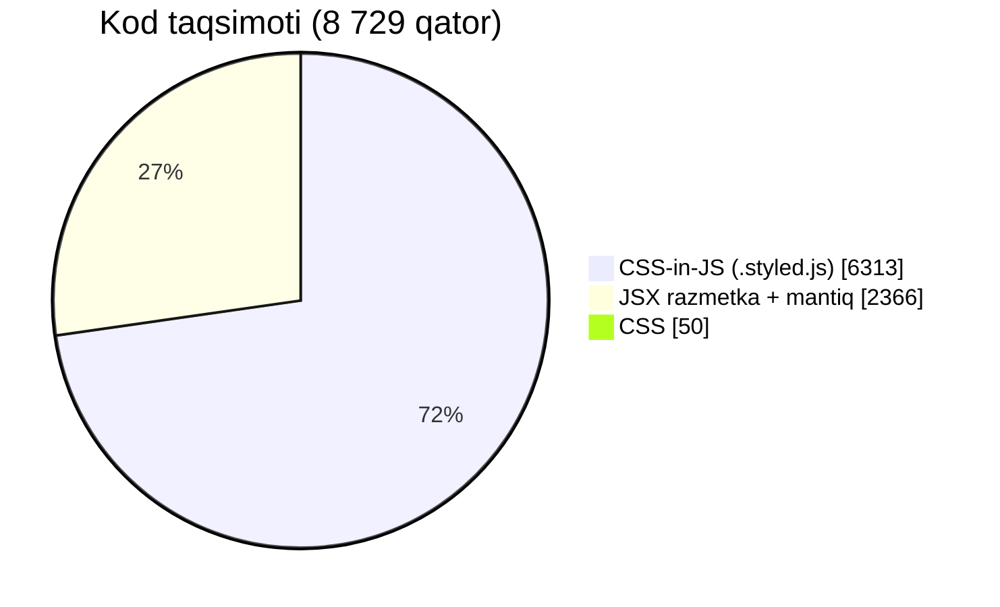
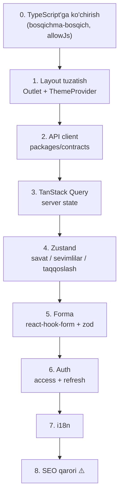
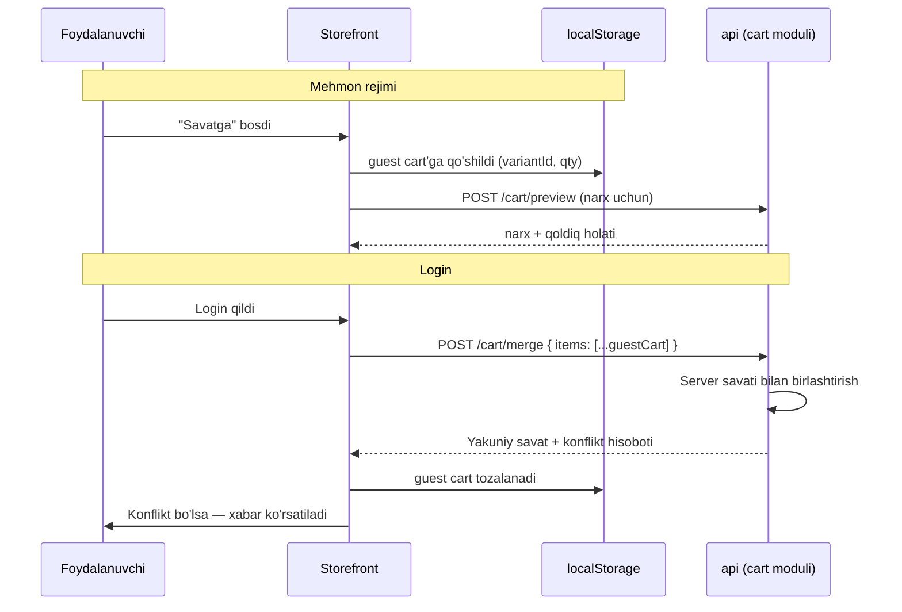
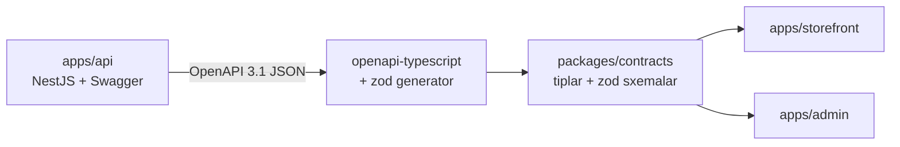
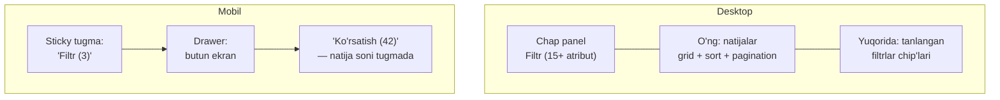
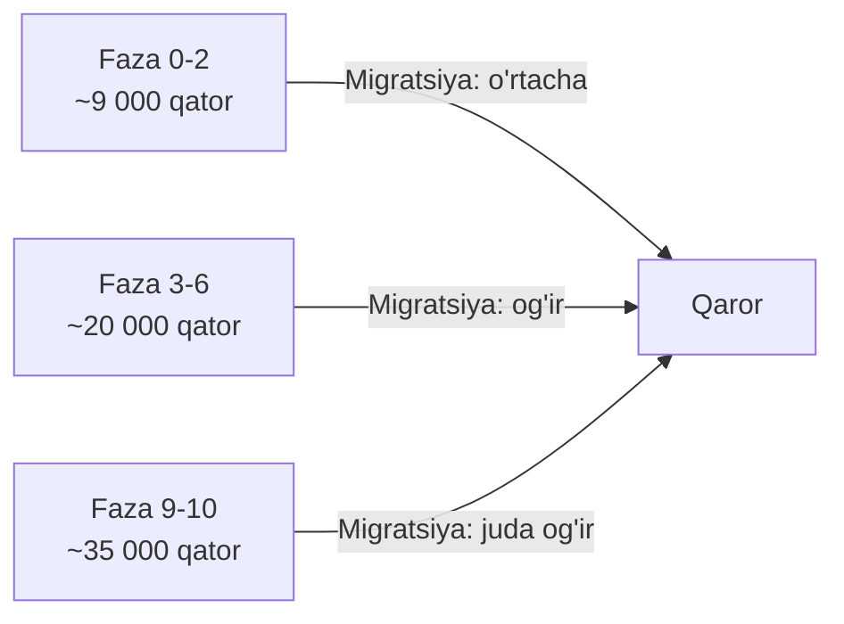
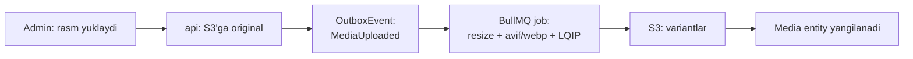

# 13. Frontend spetsifikatsiyasi

> **Status:** qoralama (v1)
> **Qamrov:** `apps/storefront` (mavjud kod) va `apps/admin` (yangi)
> **Bog'liq hujjatlar:** `docs/05-catalog-and-search.md`, `docs/06-inventory-and-reservations.md`,
> `docs/14-testing-strategy.md`, `docs/15-roadmap.md`

---

## 0. Bu hujjat nima HAQIDA EMAS

⚠️ **Dizayn qaror qilingan va o'zgarmaydi.**

Dizayn — loyiha egasining ustozi bergan Figma (kurs topshirig'i). Asl brend — **NORNLIGHT**.
O'zgaradigan yagona narsa: **brend nomi va logotip → Kelvin**.

Quyidagilar **O'ZGARMAYDI** va bu hujjatda muhokama qilinmaydi:

| Element                                                    | Holat        |
| ---------------------------------------------------------- | ------------ |
| Rang palitrasi (`#454545`, `#f2f2f2`, `#ffffff`)           | Qotib qolgan |
| Tipografika (Manrope 200..800)                             | Qotib qolgan |
| Grid va konteyner (`max-width: 1332px`, `padding: 0 16px`) | Qotib qolgan |
| Sahifa layout'lari, komponent tuzilishi                    | Qotib qolgan |
| Responsive breakpoint'lar                                  | Qotib qolgan |

Bu hujjatda **yangi dizayn taklif qilinmaydi**. Hujjatning mavzusi bitta:
**mavjud dizayn qobig'ini qanday jonlantirish** — unga state, ma'lumot, API va
biznes-mantiq qanday joylashtiriladi.

Dizaynerning Figma'sini ishlaydigan mahsulotga aylantirish — frontend dasturchining
aynan ishi. Bu uyaladigan narsa emas va README'da dizayn muallifi ko'rsatiladi.

---

## 1. Hozirgi holatning halol inventarizatsiyasi

Bu bo'lim — hujjatning eng foydali qismi. Bu yerda **hech narsa bezatilmaydi**.
Barcha raqamlar `d:/GitHubim/furniture` repozitoriysidagi kod ustida **o'lchangan**
(sanoq sanasi: hujjat yozilgan payt), taxmin emas.

### 1.1 O'lchangan raqamlar

| Ko'rsatkich                            | Qiymat                     | Qanday o'lchangan                                                                               |
| -------------------------------------- | -------------------------- | ----------------------------------------------------------------------------------------------- |
| Jami kod (`src/`, `.jsx`+`.js`+`.css`) | **8 729 qator**            | `find src -type f \( -name "*.jsx" -o -name "*.js" -o -name "*.css" \) -exec cat {} + \| wc -l` |
| Shundan `.styled.js`                   | **6 313 qator (72.3%)**    | `find src -name "*.styled.js" -exec cat {} + \| wc -l`                                          |
| Shundan `.jsx` (mantiq + razmetka)     | **2 366 qator (27.1%)**    | `find src -name "*.jsx" -exec cat {} + \| wc -l`                                                |
| `.jsx` fayllar soni                    | **48 ta**                  | `find src -name "*.jsx" \| wc -l`                                                               |
| Sahifalar                              | **12 ta**                  | `src/pages/*`                                                                                   |
| SVG ikonka komponentlari               | **~20 ta**                 | `src/components/icons/src/*`                                                                    |
| `useState` ishlatilgan fayllar         | **1 ta** (`ProductDetail`) | `grep -rln "useState\|useEffect" src/`                                                          |
| `fetch` / `axios` chaqiruvlari         | **0 ta**                   | `grep -rn "fetch(\|axios" src/`                                                                 |
| `@media` bloklari                      | **~700 ta**, 23 faylda     | `grep -rc "@media" src/ --include="*.styled.js"`                                                |
| Testlar                                | **0 ta**                   | Test runner umuman o'rnatilmagan                                                                |
| TypeScript fayllari                    | **0 ta**                   | Butun kod `.jsx` / `.js`                                                                        |

**Asosiy xulosa:** kodning ~72% — CSS-in-JS. Ya'ni bu **dizayn qobig'i**, ilova emas.
Mantiq deyarli yo'q: 48 ta komponentdan **faqat bittasida** state bor.

### 1.2 Nima BOR (va bu real qiymat)

Bu ro'yxatni kamsitmaslik kerak — bu ishning katta qismi allaqachon bajarilgan:

- ✅ **12 ta sahifaning to'liq razmetkasi:** `AboutUs`, `AllProducts`, `Basket`, `Blog`,
  `Catalog`, `Contacts`, `DeliveryPayment`, `Favorites`, `Garant`, `NotFoundPage`,
  `ProductDetail`, `Return`
- ✅ **Responsive layout** — ~700 ta `@media` bloki. Mobil versiya jiddiy ishlangan
  (masalan, `Basket` sahifasida alohida `MobileBasketItem`, `MobileQuantityControl`
  komponentlari bor — ya'ni mobil jadval alohida qayta ishlangan)
- ✅ **~20 ta SVG ikonka** React komponenti sifatida (`Cart`, `Heart`, `Search`,
  `Hamburger`, `Telegram`, `Phone`, `Delete`, `Catalog`, ...) — barrel export orqali
  (`src/components/icons/index.js`)
- ✅ **Layout tuzilishi:** `Navbar` (`NavbarTop` + `NavbarMain`), `Footer`
- ✅ **Komponent kutubxonasi kurtagi:** `Katalog`, `blog`, `brands`, `products`,
  `reasons`, `slide`, `text`
- ✅ **Routing skeleti** — `react-router-dom` 7 o'rnatilgan va 13 ta route ulangan
- ✅ **Slider** — `swiper` 12 ulangan

### 1.3 Nima YO'Q

| Yo'q narsa                                 | Isbot                                                                                                                                    |
| ------------------------------------------ | ---------------------------------------------------------------------------------------------------------------------------------------- |
| **State menejment**                        | 48 komponentdan 1 tasida `useState`. Global store yo'q                                                                                   |
| **Ma'lumot / API**                         | `fetch`/`axios` — 0 ta. Butun katalog qo'lda yozilgan                                                                                    |
| **Backend**                                | Umuman yo'q                                                                                                                              |
| **Savat**                                  | Ishlamaydi. `basketItems` — hardcode massiv                                                                                              |
| **Forma mantiqi**                          | `Basket` sahifasida `FormInput`, `FormTextarea`, `CheckboxInput` **stillari** bor, lekin `onChange` ham, state ham, validatsiya ham yo'q |
| **Auth**                                   | Yo'q. Login/registratsiya sahifasi ham yo'q                                                                                              |
| **i18n**                                   | Yo'q. Butun matn rus tilida, JSX ichiga qotirilgan                                                                                       |
| **TypeScript**                             | Yo'q (`@types/react` dev-dependency'da bor, lekin ishlatilmaydi)                                                                         |
| **Test**                                   | Yo'q                                                                                                                                     |
| **SEO meta**                               | Yo'q. `<title>lesson17</title>`                                                                                                          |
| **Error boundary / loading / empty state** | Yo'q                                                                                                                                     |

### 1.4 ⚠️ Inventarizatsiya paytida topilgan muammolar

Bu muammolar CANON'da qayd etilmagan, lekin kodda **real mavjud**. Ularni yashirish
mantiqsiz — rejalashtirishga ta'sir qiladi.

#### (a) `ProductDetail` atributlari — VELOSIPED ma'lumoti

Bu eng jiddiy topilma. `src/pages/ProductDetail/index.jsx` da sarlavha:

```
Встраиваемый светильник Novotech   ← o'rnatiladigan yoritgich
```

Lekin ostidagi "Характеристика" jadvali:

| Sarlavha           | Qiymat                               |
| ------------------ | ------------------------------------ |
| Диаметр колеса     | 27.5                                 |
| Материал рамы      | Карбон                               |
| Вилка              | Rock Shox SID RL3 Air ... ход 100mm  |
| Покрышки           | Schwalbe Rocket Ron EVO ...          |
| Седло              | Ritchey WCS Streem V3 Titanium rails |
| Подседельный Штырь | Ritchey WCS 700 Series ...           |

Tavsif matni ham: _"Профессиональный гоночный хардтейл для кросс-кантри"_ — bu
**tog' velosipedi**, yoritgich emas.

**Bu nimani anglatadi:**

1. Figma shabloni boshqa domendan (velosiped do'koni) moslashtirilgan. Atribut jadvali
   **placeholder** — hech qanday domen ma'nosiga ega emas.
2. Demak "mavjud atribut jadvalini saqlash" degan narsa yo'q — **jadval tuzilishi**
   (`StyledTable`, `TableRow`, `TableHeader`, `TableData`) saqlanadi, **mazmuni**
   to'liq CANON §4 dagi yoritish atributlariga almashtiriladi (`luminous_flux`,
   `color_temperature`, `cri`, `ip_rating`, `socket_type`, ...).
3. Bu dizaynni o'zgartirish EMAS — bu placeholder'ni real ma'lumot bilan to'ldirish.
   Jadvalning vizual ko'rinishi o'zgarmaydi.

#### (b) `MainLayout` — layout emas, bosh sahifa

Nomi `MainLayout`, lekin aslida bu **bosh sahifa**:

```jsx
// src/App.jsx
<Route path="/" element={<MainLayout></MainLayout>} /> // ← layout emas, sahifa
```

`Outlet` butun kodda **0 marta** ishlatilgan. Natijada har bir sahifa `Navbar` va
`Footer` ni **o'zi import qiladi** — 12 marta takrorlanadi:

```jsx
// src/pages/Basket/index.jsx, ProductDetail/index.jsx, ... (har birida)
import Navbar from '../../layout/Navbar';
import Footer from '../../layout/Footer';
```

**Oqibati:** har route almashganda `Navbar` va `Footer` **qayta mount bo'ladi**.
Navbar'da savat soni, qidiruv holati, foydalanuvchi menyusi paydo bo'lgach — bu
holat har navigatsiyada yo'qoladi. Bu tuzatilishi **shart** (§4.3).

Tuzatish **dizaynga tegmaydi** — vizual natija bir xil, faqat React daraxti to'g'ri
bo'ladi.

#### (c) `/product-detail` — parametrsiz route

```jsx
<Route path="/product-detail" element={<ProductDetail />} /> // ← `:slug` yo'q
```

Bitta statik URL. Ya'ni hozir "mahsulot sahifasi" bitta qotib qolgan mahsulotni
ko'rsatadi. Real katalog uchun `/product/:slug` kerak (SEO uchun `slug`, `id` emas).

#### (d) Counter — bu tugma emas, bu matn

```jsx
<Counter>
  <p>- 1 +</p> {/* bitta <p> ichida uchta belgi. Tugma yo'q. onClick yo'q */}
</Counter>
```

`Basket` sahifasida `QuantityButton` alohida komponent sifatida bor, lekin
`ProductDetail` da miqdor — oddiy matn. Ya'ni "miqdor tanlash" **umuman
implementatsiya qilinmagan**.

#### (e) Narx — string, raqam emas

```jsx
price: "6 399 ₽"        // string. Formatlash ma'lumot ichiga qotirilgan
<CurrentPrice>435 000 ₽</CurrentPrice>
```

CANON §8: **pul — `BigInt`, tiyinda, `Float` hech qachon**. Hozirgi kod pulni
formatlangan string sifatida saqlaydi. Butun narx ko'rsatish qatlami qayta
yoziladi (§3.6).

#### (f) `theme.js` — mavjud, lekin deyarli ishlatilmaydi

```js
// src/theme.js
export const textColors = { primary: '#454545', secondary: '#45454550', white: '#ffffff' };
export const bgColors = { primary: '#454545', secondary: '#45454550', lightBlue: '#f2f2f2' };
```

`ThemeProvider` — **0 marta** ishlatilgan. `theme.js` faqat **3 ta Navbar styled
faylida** oddiy JS import sifatida ishlatiladi. Qolgan 20 ta styled faylda ranglar
**qotirib yozilgan** (hardcode).

**Oqibati:** rang o'zgartirish kerak bo'lsa (masalan, brend rangi) — 20+ faylni
qo'lda tahrirlash kerak. Bu `ThemeProvider` ga ko'chirilishi kerak. ⚠️ Lekin bu
**rang qiymatlarini o'zgartirish emas** — aynan o'sha ranglar, faqat bitta manbadan.

#### (g) Boshqa mayda, lekin real narsalar

| Muammo                    | Joy             | Ta'sir                                                            |
| ------------------------- | --------------- | ----------------------------------------------------------------- |
| `<html lang="en">`        | `index.html`    | Kontent rus tilida. Screen reader noto'g'ri o'qiydi. SEO'ga zarar |
| `<title>lesson17</title>` | `index.html`    | Rebrending                                                        |
| `"name": "lesson17"`      | `package.json`  | Rebrending                                                        |
| `favicon` = `vite.svg`    | `index.html`    | Rebrending                                                        |
| Google Fonts `@import`    | `src/index.css` | Render-blocking. LCP'ga zarar (§10.4)                             |
| `<a href="/">Главная</a>` | `ProductDetail` | To'liq sahifa qayta yuklanadi — SPA buziladi. `<Link>` kerak      |
| `.DS_Store`               | `src/`          | `.gitignore` ga qo'shiladi                                        |
| `₽` belgisi               | 8 ta faylda     | `UZS` ga o'zgaradi                                                |

### 1.5 Xulosa: bu qanday loyiha



**Halol baho:** frontend'ning **vizual qismi ~70% tayyor**, **mantiqiy qismi ~2% tayyor**.

Bu yomon xabar emas — bu **aniq xabar**. Dizayn qobig'i real qiymat: uni noldan
qilish haftalar oladi. Lekin "frontend deyarli tayyor" degan taassurot **noto'g'ri**
bo'lar edi. Ilova hali yozilmagan.

---

## 2. Ikki app, ikki UI stack — ADR darajasidagi qaror

### 2.1 Qaror

| App               | Stack                                        | Sabab                    |
| ----------------- | -------------------------------------------- | ------------------------ |
| `apps/storefront` | React 19 + Vite 7 + **styled-components 6**  | Mavjud. O'zgartirilmaydi |
| `apps/admin`      | React 19 + Vite + **shadcn/ui + Tailwind 4** | Yangi. Noldan            |

### 2.2 ⚠️ Nega bitta stack emas? Bu ataylab qilingan.

Bu savol albatta beriladi ("ikki xil UI kutubxonasi — bu texnik qarz emasmi?").
Javob: **yo'q, va mana nega.**

**Variant A — hammasini styled-components'da qilish (admin ham):**

- Admin uchun dizayn **yo'q**. Ya'ni har bir tugma, jadval, modal, dropdown,
  date-picker, toast — noldan yoziladi.
- Admin panelda ~15 ta modul (CANON §7) → o'nlab CRUD ekran.
- Jadval komponenti (server-side pagination + sort + filter + column resize) —
  bu o'z-o'zidan haftalik ish.
- ❌ **Rad etildi:** dizayn bo'lmagan joyda dizayn tizimini noldan qurish — bu
  bitta odam uchun oyni yeydi va hech qanday qiymat bermaydi.

**Variant B — hammasini Tailwind + shadcn/ui ga ko'chirish (storefront ham):**

- 6 313 qator styled-components'ni Tailwind'ga qayta yozish.
- Natija: **aynan o'sha vizual ko'rinish**. Piksel-piksel bir xil.
- ❌ **Rad etildi:** bu nol biznes qiymatli, yuqori riskli ish. Ishlab turgan
  responsive layout'ni buzish ehtimoli katta. "Toza bo'lsin" — bu sabab emas.

**Variant C — ikki stack (TANLANDI):**

- `storefront`: dizayn Figma'dan keladi va **piksel aniqligi muhim**.
  styled-components bilan allaqachon yozilgan. Tegilmaydi.
- `admin`: dizayn yo'q, foydalanuvchi — 3-5 xodim, **tezlik > go'zallik**.
  shadcn/ui tayyor, accessible (Radix asosida), copy-paste qilinadigan komponent beradi.

### 2.3 Bu qarorning narxi (halol)

Bepul emas. Real narxi:

| Narx                                 | Baho                                                         |
| ------------------------------------ | ------------------------------------------------------------ |
| Ikki xil styling mental modeli       | Bitta dasturchi uchun — kontekst almashish                   |
| Dizayn token'lari ikki joyda         | Brend rangi `theme.js` da VA `tailwind.config` da            |
| Umumiy UI komponent paketi bo'lmaydi | `packages/ui` yaratish mantiqsiz — ikki stack                |
| Bundle'lar mustaqil                  | Bu aslida **afzallik**: admin bundle storefront'ga tushmaydi |

**Yumshatish:** brend token'lari (rang, shrift) `packages/config` da bitta JSON'da
saqlanadi, ikkala tomon shundan o'qiydi. Bu takrorlanishni yo'qotmaydi, lekin
**haqiqat manbaini bitta qiladi**.

**Nima ikkala app uchun umumiy bo'ladi:**

- `packages/contracts` — OpenAPI'dan generatsiya qilingan tiplar + zod sxemalar
- `packages/config` — eslint / tsconfig / prettier
- API client qatlami (fetch wrapper, auth interceptor)
- ❌ UI komponentlar — **umumiy emas** (bu ataylab)

---

## 3. Storefront'ni jonlantirish

### 3.1 Umumiy tartib



⚠️ **0-qadam (TypeScript)** CANON'da alohida aytilmagan, lekin **majburiy**:
`packages/contracts` TypeScript tiplarini generatsiya qiladi. `.jsx` fayl bu
tiplardan foyda ko'rmaydi. `allowJs: true` bilan bosqichma-bosqich ko'chiriladi:
avval yangi kod `.tsx`, keyin sahifalar birma-bir. `.styled.js` fayllar **oxirida**
(ular tip xavfsizligidan eng kam foyda ko'radi).

### 3.2 State: TanStack Query + Zustand

**Asosiy tamoyil: server state va client state — bu ikki xil narsa.**

| Turi             | Nima                                                            | Vosita                | Nega                                                                                    |
| ---------------- | --------------------------------------------------------------- | --------------------- | --------------------------------------------------------------------------------------- |
| **Server state** | Mahsulot, katalog, qidiruv natijasi, buyurtma, qoldiq           | **TanStack Query**    | Cache, invalidatsiya, refetch, stale-while-revalidate, retry — bularning hammasi tayyor |
| **Client state** | Savat (mehmon), sevimlilar, taqqoslash, UI (drawer ochiq/yopiq) | **Zustand**           | Kichik, boilerplate'siz, `persist` middleware localStorage bilan                        |
| **URL state**    | Qidiruv filtrlari, sahifa, saralash                             | **`useSearchParams`** | SEO + share + back tugmasi (§3.8)                                                       |
| **Forma state**  | Input qiymatlari                                                | **react-hook-form**   | Uncontrolled → kam re-render                                                            |

#### ⚠️ Nega Redux (Toolkit) emas?

| Mezon                                 | Redux Toolkit                                                                                | Tanlangan yechim                                 |
| ------------------------------------- | -------------------------------------------------------------------------------------------- | ------------------------------------------------ |
| Server state                          | RTK Query bor, lekin TanStack Query'dan kambag'alroq (facet, infinite query, optimistic API) | TanStack Query — bu aynan shu ish uchun qilingan |
| Boilerplate                           | slice + reducer + action + selector                                                          | Zustand: ~10 qator store                         |
| DevTools                              | Zo'r                                                                                         | TanStack Query DevTools ham zo'r                 |
| Bundle                                | ~13 KB (RTK+react-redux)                                                                     | Zustand ~1.2 KB                                  |
| Bu loyihada global client state hajmi | **Kichik**: savat, sevimlilar, taqqoslash, UI                                                | Redux — bu hajm uchun ortiqcha                   |

**Xulosa:** Redux — global client state **katta va murakkab** bo'lganda oqlanadi.
Kelvin'da global client state — 3 ta ro'yxat. Server state esa — katta. Ya'ni og'irlik
markazi server state'da, va u yerda TanStack Query yutadi.

⚠️ **Bu diniy qaror emas.** Agar keyinchalik client state kutilmaganda o'ssa
(masalan, POS offline rejimi murakkab bo'lsa) — `apps/pos` uchun alohida qaror
qayta ko'rib chiqiladi.

#### Zustand store misoli

```ts
// apps/storefront/src/store/cart.store.ts
import { create } from 'zustand';
import { persist, createJSONStorage } from 'zustand/middleware';

/** Pul — tiyinda, BigInt. CANON §8. Lekin JSON BigInt'ni serialize qilmaydi →
 *  localStorage'da string sifatida saqlanadi, o'qishda BigInt'ga qaytariladi. */
export interface GuestCartItem {
  readonly variantId: string; // ProductVariant.id (UUID v7)
  readonly sku: string;
  quantity: number;
}

interface CartState {
  readonly items: readonly GuestCartItem[];
  add(variantId: string, sku: string, qty?: number): void;
  setQuantity(variantId: string, qty: number): void;
  remove(variantId: string): void;
  clear(): void;
}

export const useGuestCart = create<CartState>()(
  persist(
    (set) => ({
      items: [],
      add: (variantId, sku, qty = 1) =>
        set((s) => {
          const existing = s.items.find((i) => i.variantId === variantId);
          if (existing) {
            return {
              items: s.items.map((i) =>
                i.variantId === variantId ? { ...i, quantity: i.quantity + qty } : i,
              ),
            };
          }
          return { items: [...s.items, { variantId, sku, quantity: qty }] };
        }),
      setQuantity: (variantId, qty) =>
        set((s) => ({
          items:
            qty <= 0
              ? s.items.filter((i) => i.variantId !== variantId)
              : s.items.map((i) => (i.variantId === variantId ? { ...i, quantity: qty } : i)),
        })),
      remove: (variantId) =>
        set((s) => ({ items: s.items.filter((i) => i.variantId !== variantId) })),
      clear: () => set({ items: [] }),
    }),
    {
      name: 'kelvin.cart.guest',
      version: 1,
      storage: createJSONStorage(() => localStorage),
    },
  ),
);
```

⚠️ **Diqqat:** mehmon savatida **narx saqlanmaydi** — faqat `variantId` va `quantity`.
Narx har doim serverdan olinadi. Sabab: localStorage'dagi narxga ishonish —
bu xavfsizlik teshigi va eskirgan ma'lumot manbai.

### 3.3 ⚠️ Layout tuzatish (Outlet) — birinchi qadam

§1.4(b) da topilgan muammo. Bu **state'dan oldin** tuzatilishi kerak, aks holda
Navbar'dagi savat soni har navigatsiyada nolga tushadi.

```tsx
// apps/storefront/src/App.tsx
import { Routes, Route } from 'react-router-dom';

export function App() {
  return (
    <Routes>
      {/* RootLayout — Navbar + <Outlet/> + Footer. Navigatsiyada qayta mount BO'LMAYDI */}
      <Route element={<RootLayout />}>
        <Route index element={<HomePage />} /> {/* eski MainLayout'ning mazmuni */}
        <Route path="catalog" element={<CatalogPage />} />
        <Route path="catalog/:categorySlug" element={<CategoryPage />} />
        <Route path="product/:slug" element={<ProductPage />} /> {/* :slug qo'shildi */}
        <Route path="cart" element={<CartPage />} />
        <Route path="checkout" element={<CheckoutPage />} />
        <Route path="favorites" element={<FavoritesPage />} />
        <Route path="compare" element={<ComparePage />} />
        <Route path="*" element={<NotFoundPage />} />
      </Route>
    </Routes>
  );
}
```

Nima o'zgaradi:

- `MainLayout` → `HomePage` (nomi to'g'rilanadi — u sahifa, layout emas)
- Yangi `RootLayout` yaratiladi: `<Navbar/> <Outlet/> <Footer/>`
- 12 ta sahifadan `import Navbar` / `import Footer` **o'chiriladi**
- `/product-detail` → `/product/:slug`

✅ **Vizual natija bir xil.** Dizaynga tegilmaydi.

### 3.4 Savat: mehmon → login → birlashtirish

Bu eng nozik oqimlardan biri, chunki **ikkala tomonda ham ma'lumot bo'lishi mumkin**.



#### ⚠️ Konflikt: ikkala joyda ham mahsulot bor

Bu yerda "to'g'ri" javob yo'q — **qaror qabul qilinishi kerak**:

| Strategiya               | Xulq                          | Muammo                                                          |
| ------------------------ | ----------------------------- | --------------------------------------------------------------- |
| **`max(guest, server)`** | 2 ta mehmon + 3 ta server → 3 | Foydalanuvchi 2 ta qo'shgan, lekin 3 ta ko'radi                 |
| **`guest + server`**     | 2 + 3 → 5                     | Ikki qurilmada bir xil narsa → miqdor sun'iy o'sadi. **Xavfli** |
| **`guest` yutadi**       | 2 + 3 → 2                     | Serverdagi eski savat yo'qoladi                                 |
| **`server` yutadi**      | 2 + 3 → 3                     | Foydalanuvchi hozirgina qo'shgani yo'qoladi. **Yomon UX**       |

**Tanlangan: `max(guest, server)`** + foydalanuvchiga ko'rsatish.

Sabab: `sum` — eng xavfli (miqdor kutilmaganda oshadi, mijoz ortiqcha to'laydi).
`max` — hech narsa yo'qolmaydi va miqdor sun'iy oshmaydi. Foydalanuvchi savatni
ko'radi va tuzatishi mumkin.

```ts
// packages/contracts dan generatsiya qilingan tip (qo'lda yozilmaydi)
export interface CartMergeResult {
  readonly cart: Cart;
  /** Miqdor o'zgargan pozitsiyalar — UI'da xabar ko'rsatish uchun */
  readonly conflicts: readonly {
    readonly variantId: string;
    readonly guestQuantity: number;
    readonly serverQuantity: number;
    readonly resolvedQuantity: number;
    readonly reason: 'MAX_APPLIED' | 'STOCK_LIMITED' | 'VARIANT_UNAVAILABLE';
  }[];
}
```

⚠️ **Uchinchi holat:** birlashtirishda qoldiq yetmasligi mumkin (`STOCK_LIMITED`).
Mehmon savatida 5 ta qandil, omborda 2 ta qoldi → 2 ga tushiriladi va **sabab
ko'rsatiladi**. Jim tushirish — mumkin emas. Batafsil:
→ `docs/06-inventory-and-reservations.md`

⚠️ **To'rtinchi holat:** `VARIANT_UNAVAILABLE` — mehmon savati localStorage'da
oylab yotishi mumkin. Variant o'chirilgan/arxivlangan bo'lishi mumkin. Savat
o'qilganda har doim **serverda validatsiya qilinadi**.

#### Optimistic update

Savatga qo'shish — darhol ko'rinishi kerak, tarmoqni kutmasdan.

```ts
// apps/storefront/src/features/cart/useAddToCart.ts
import { useMutation, useQueryClient } from '@tanstack/react-query';

export function useAddToCart() {
  const qc = useQueryClient();

  return useMutation({
    mutationFn: (input: { variantId: string; quantity: number }) => api.cart.add(input),

    onMutate: async (input) => {
      await qc.cancelQueries({ queryKey: ['cart'] });
      const previous = qc.getQueryData<Cart>(['cart']);
      qc.setQueryData<Cart>(['cart'], (old) => applyAddLocally(old, input));
      return { previous }; // rollback konteksti
    },

    onError: (_err, _input, ctx) => {
      // ⚠️ Rollback MAJBURIY. Aks holda UI yolg'on gapiradi.
      if (ctx?.previous) qc.setQueryData(['cart'], ctx.previous);
      toast.error(t('cart.addFailed'));
    },

    // ⚠️ Har doim serverdan haqiqatni so'rash: narx, chegirma, qoldiq limiti
    // faqat serverda hisoblanadi. Optimistic qiymat — vaqtinchalik yolg'on.
    onSettled: () => {
      void qc.invalidateQueries({ queryKey: ['cart'] });
    },
  });
}
```

⚠️ **Qayerda optimistic QILINMAYDI:**

- **Checkout / buyurtma yaratish** — bu yerda yolg'on ko'rsatish qabul qilinmaydi
- **To'lov** — hech qachon
- **Rezerv** — server javobisiz "band qilindi" deyish mumkin emas

### 3.5 Forma: react-hook-form + zod

**Nega:** `react-hook-form` — uncontrolled input, ya'ni har harfda butun forma
qayta render bo'lmaydi. `zod` — sxema **`packages/contracts` dan keladi**, ya'ni
frontend va backend **bir xil validatsiya qoidasini** ishlatadi.

⚠️ **Muhim:** frontend validatsiyasi — bu **UX**, xavfsizlik emas. Backend
har doim qaytadan validatsiya qiladi (`class-validator`). Frontend validatsiyasi
faqat foydalanuvchiga tez javob berish uchun.

#### Checkout formasi — eng murakkabi

```ts
// packages/contracts/src/schemas/checkout.ts — ikkala tomon uchun umumiy
import { z } from 'zod';

/** O'zbekiston telefon raqami: +998 XX XXX XX XX
 *  ⚠️ Operator kodlari ro'yxati (33/71/88/90/91/93/94/95/97/98/99) o'zgarishi mumkin —
 *  qat'iy ro'yxat o'rniga umumiy format tekshiriladi. Aniq ro'yxat — ochiq savol. */
const uzPhone = z.string().regex(/^\+998\d{9}$/, 'phone.invalid');

export const checkoutSchema = z
  .object({
    customer: z.object({
      firstName: z.string().min(2).max(64),
      lastName: z.string().min(2).max(64),
      phone: uzPhone,
      email: z.string().email().optional(),
    }),
    delivery: z.discriminatedUnion('method', [
      z.object({
        method: z.literal('PICKUP'),
        warehouseId: z.string().uuid(),
      }),
      z.object({
        method: z.literal('COURIER'),
        zoneId: z.string().uuid(),
        address: z.string().min(10).max(512),
        slotId: z.string().uuid(),
        // ⚠️ O'rnatish xizmati — CANON §4.6, upsell
        installationRequested: z.boolean().default(false),
      }),
    ]),
    payment: z.discriminatedUnion('provider', [
      z.object({ provider: z.literal('CLICK') }),
      z.object({ provider: z.literal('PAYME') }),
      z.object({ provider: z.literal('UZUM') }),
      z.object({ provider: z.literal('CASH_ON_DELIVERY') }),
      z.object({
        provider: z.literal('INSTALLMENT'),
        months: z.union([z.literal(3), z.literal(6), z.literal(9), z.literal(12)]),
        // ⚠️ Rassrochka provayderi va uning talab qiladigan maydonlari NOMA'LUM.
        // Rasmiy hujjatdan tekshirilishi kerak → ochiq savol §17.
      }),
    ]),
    agreedToTerms: z.literal(true, { errorMap: () => ({ message: 'terms.required' }) }),
  })
  .superRefine((data, ctx) => {
    // Krossmaydon qoida: o'rnatish faqat kuryer bilan
    if (data.delivery.method === 'PICKUP' && data.payment.provider === 'CASH_ON_DELIVERY') {
      ctx.addIssue({
        code: z.ZodIssueCode.custom,
        path: ['payment', 'provider'],
        message: 'payment.cashOnDeliveryRequiresCourier',
      });
    }
  });

export type CheckoutInput = z.infer<typeof checkoutSchema>;
```

⚠️ **Xato xabarlari — kalit, matn emas** (`'phone.invalid'`). Sabab: i18n (§8).
Sxema `packages/contracts` da, u tilni bilmaydi. Tarjima UI'da bo'ladi.

**Checkout nega murakkab:**

1. Ko'p bosqichli (kontakt → yetkazib berish → to'lov → tasdiq)
2. Shartli maydonlar (`discriminatedUnion` — kuryer tanlansa manzil kerak, pickup tanlansa yo'q)
3. Server bilan doimiy dialog: yetkazib berish narxi zonaga bog'liq, slot bandligi
   real vaqtda o'zgaradi
4. Rassrochka tanlansa — grafik ko'rsatiladi (server hisoblaydi, frontend **hech qachon
   o'zi hisoblamaydi** — CANON §9.6)
5. Yakunda rezerv qilinadi → oversell riski (`docs/06-...`)

### 3.6 API client: `packages/contracts` dan

⚠️ **Qat'iy qoida: frontend'da API tipi QO'LDA YOZILMAYDI.**



**Nega:** qo'lda yozilgan tip — bu **yolg'on**. U backend o'zgarganda jim eskiradi.
TypeScript "hammasi joyida" deydi, runtime'da esa `undefined`. Generatsiya qilingan
tipda bunday bo'lmaydi: backend o'zgardi → generatsiya → **CI'da kompilyatsiya sinadi**.

**CI qoidasi:** `pnpm contracts:generate` ishga tushiriladi va `git diff` bo'sh
bo'lishi kerak. Aks holda — build fail. Ya'ni eskirgan kontrakt merge bo'lmaydi.

```ts
// packages/contracts/src/client/http.ts
export class ApiError extends Error {
  constructor(
    readonly status: number,
    readonly code: string, // backend'ning mashina o'qiydigan kodi
    readonly requestId: string, // ⚠️ log bilan bog'lash uchun (Pino, OTel)
    message: string,
  ) {
    super(message);
    this.name = 'ApiError';
  }
}
```

⚠️ **`requestId`** — har javobda `X-Request-Id` header'i qaytadi va UI xato
ekranida ko'rsatiladi. Mijoz "xato chiqdi" desa — support shu ID bo'yicha logni
topadi. Bu arzon, lekin qo'llab-quvvatlashda juda qimmatli.

### 3.7 Auth: access xotirada, refresh cookie'da

**Model (CANON §6):** JWT access ~15 min + refresh ~30 kun, rotatsiya bilan.

| Token       | Qayerda                                           | Nega                                                                                  |
| ----------- | ------------------------------------------------- | ------------------------------------------------------------------------------------- |
| **access**  | **JS xotirasida** (Zustand, `persist` SIZ)        | localStorage → XSS o'qiydi. Xotira sahifa yangilanganda yo'qoladi — bu qabul qilinadi |
| **refresh** | **`httpOnly` + `Secure` + `SameSite=Lax` cookie** | JS o'qiy olmaydi → XSS o'g'irlay olmaydi                                              |

⚠️ `SameSite=Lax` — CSRF'dan asosiy himoya. Qo'shimcha: refresh endpoint faqat
`POST`, va CSRF token tekshiriladi. `SameSite=Strict` qilinmaydi, chunki Click/Payme
dan qaytishda (redirect) sessiya yo'qoladi.

#### ⚠️ Single-flight refresh — bu bo'lmasa tizim buziladi

**Muammo:** sahifada 5 ta parallel so'rov ketdi. Access token eskirdi. **Beshtasi
ham 401 qaytardi.** Sodda interceptor → **5 ta parallel refresh**.

Refresh **rotatsiya bilan** ishlaydi: har refresh eski tokenni bekor qiladi.
Demak 5 ta parallel refresh'dan 1 tasi o'tadi, qolgan 4 tasi **bekor qilingan token**
bilan keladi → server ularni **token o'g'irlash** deb qabul qiladi → butun sessiya
zanjiri bekor qilinadi → **foydalanuvchi tashqariga otiladi**.

Ya'ni: bu **nazariy muammo emas**. Bu rotatsiya yoqilgan har bir tizimda sodir bo'ladi.

**Yechim:** bir vaqtda faqat **bitta** refresh. Qolganlar o'shanga ulanib kutadi.

```ts
// packages/contracts/src/client/auth-interceptor.ts

let refreshPromise: Promise<string> | null = null;

/** Single-flight: nechta chaqirilishidan qat'i nazar, bir vaqtda bitta
 *  tarmoq so'rovi ketadi. Qolganlar shu promise'ni kutadi. */
function refreshAccessToken(): Promise<string> {
  refreshPromise ??= fetch('/api/auth/refresh', {
    method: 'POST',
    credentials: 'include', // refresh cookie yuboriladi
    headers: { 'X-CSRF-Token': readCsrfToken() },
  })
    .then(async (res) => {
      if (!res.ok) throw new ApiError(res.status, 'REFRESH_FAILED', '', 'refresh failed');
      const data = (await res.json()) as { accessToken: string };
      authStore.setAccessToken(data.accessToken);
      return data.accessToken;
    })
    .finally(() => {
      refreshPromise = null; // ⚠️ keyingi safar uchun bo'shatish
    });

  return refreshPromise;
}

export async function apiFetch(input: RequestInfo, init: RequestInit = {}): Promise<Response> {
  const withAuth = (token: string | null): RequestInit => ({
    ...init,
    credentials: 'include',
    headers: {
      ...init.headers,
      ...(token ? { Authorization: `Bearer ${token}` } : {}),
    },
  });

  let res = await fetch(input, withAuth(authStore.accessToken));

  if (res.status !== 401) return res;

  // ⚠️ Faqat BIR marta qayta urinish. Aks holda cheksiz sikl.
  try {
    const fresh = await refreshAccessToken(); // parallel chaqiruvlar shu yerda birlashadi
    res = await fetch(input, withAuth(fresh));
  } catch {
    authStore.clear();
    redirectToLogin();
  }

  return res;
}
```

⚠️ **Sinovdan o'tkazilishi shart:** 10 ta parallel 401 → **aniq 1 ta** refresh
so'rovi. Bu MSW bilan integratsiya testida tekshiriladi.
→ `docs/14-testing-strategy.md`

⚠️ **Ochiq savol:** ko'p tab. Ikki tabda ochilgan bo'lsa, har tabda alohida
`refreshPromise` bor → yana 2 ta parallel refresh. Yechim variantlari:
`BroadcastChannel` bilan tablar orasida koordinatsiya, yoki serverda qisqa
"grace period" (eski refresh token N soniya davomida qayta ishlatilsa — jarima
solinmaydi). Bu backend qarori → `docs/03-...` (auth) da hal qilinadi.

### 3.8 Routing: filtrlar URL'da

`react-router-dom` 7 allaqachon o'rnatilgan. Qo'shiladi: `:slug` parametrlari,
`Outlet` (§3.3), lazy route.

⚠️ **Qat'iy qoida: qidiruv holati URL'da, state'da emas.**

```
/catalog/lyustry?ct=2700,4000&ip=IP44&socket=E27&price=200000-800000&sort=price_asc&page=2
```

**Nega bu muhim:**

1. **SEO** — "IP44 vannaxona chirog'i" qidiruvi indekslanadigan URL'ga tushadi
2. **Share** — mijoz filtrlangan ro'yxatni Telegram'da tashlashi mumkin
3. **Back tugmasi** — brauzer tugmasi ishlaydi (state'da bo'lsa — ishlamaydi)
4. **Refresh** — sahifa yangilansa filtr yo'qolmaydi

```ts
// apps/storefront/src/features/search/useSearchFilters.ts
import { useSearchParams } from 'react-router-dom';
import { useCallback, useMemo } from 'react';

export interface SearchFilters {
  readonly colorTemperature: readonly number[]; // 2700, 4000, ...
  readonly ipRating: readonly string[]; // IP20, IP44, ...
  readonly socketType: readonly string[]; // E27, GU10, ...
  readonly dimmable: boolean | null;
  readonly priceMin: bigint | null; // tiyin. CANON §8
  readonly priceMax: bigint | null;
  readonly sort: 'relevance' | 'price_asc' | 'price_desc' | 'newest';
  readonly page: number;
}

export function useSearchFilters() {
  const [params, setParams] = useSearchParams();

  const filters = useMemo<SearchFilters>(() => parseFilters(params), [params]);

  const setFilter = useCallback(
    <K extends keyof SearchFilters>(key: K, value: SearchFilters[K]) => {
      setParams(
        (prev) => {
          const next = new URLSearchParams(prev);
          writeFilter(next, key, value);
          next.delete('page'); // ⚠️ filtr o'zgardi → 1-sahifaga qaytish
          return next;
        },
        { replace: true }, // ⚠️ har filtr history'ga yozilmaydi
      );
    },
    [setParams],
  );

  const clearAll = useCallback(() => {
    setParams(new URLSearchParams(), { replace: false }); // "tozalash" — history'ga yoziladi
  }, [setParams]);

  return { filters, setFilter, clearAll };
}
```

⚠️ **`replace: true`** — muhim tafsilot. Agar har checkbox `push` qilsa,
foydalanuvchi 10 ta filtr bosgach "orqaga" tugmasini 10 marta bosishi kerak bo'ladi.
Bu jirkanch UX. `replace` bilan — bitta qadam.

⚠️ **Kompromis:** `replace` bilan alohida filtrni "orqaga" qaytarib bo'lmaydi.
Buning o'rniga tanlangan filtrlar **chip** sifatida ko'rsatiladi va har birida
× tugmasi bo'ladi (§4.5). Bu aniqroq.

**Lazy loading:**

```ts
// Og'ir sahifalar alohida chunk'da. Checkout — faqat kerak bo'lganda yuklanadi.
const CheckoutPage = lazy(() => import('./pages/Checkout'));
const ComparePage = lazy(() => import('./pages/Compare'));
```

---

## 4. Faceted search UI — eng murakkab ekran

Bu loyihaning **texnik yuragi**. CANON §4: yoritgichda 15+ filtrlanadigan atribut bor,
va aynan shu — mahsulotning qiymati. Backend tomoni:
→ **`docs/05-catalog-and-search.md`**

### 4.1 Ekran anatomiyasi



### 4.2 Filtr turlari (CANON §4 atributlaridan)

| Atribut             | UI vidjeti                   | Izoh                                                                                |
| ------------------- | ---------------------------- | ----------------------------------------------------------------------------------- |
| `color_temperature` | Checkbox + **rang namunasi** | 2700K sariq, 4000K oq, 6500K ko'k — vizual namuna kerak. Brend nomi shundan         |
| `ip_rating`         | Checkbox, **ierarxik**       | ⚠️ IP65 tanlagan odam IP67 ni ham ko'rishi kerak (IP67 ≥ IP65). Bu "kamida" mantiqi |
| `socket_type`       | Checkbox                     | E27, E14, GU10, G9, GU5.3, G4, integrated LED                                       |
| `luminous_flux`     | Range slider                 | lm. Notekis taqsimot → logarifmik shkala                                            |
| `power`             | Range slider                 | Vatt                                                                                |
| `cri`               | Checkbox                     | 80+, 90+, 95+ — "kamida" mantiqi                                                    |
| `dimmable`          | Toggle                       |                                                                                     |
| `voltage`           | Checkbox                     | ⚠️ 12V tanlansa — "transformator kerak" ogohlantirishi (CANON §4.4)                 |
| `beam_angle`        | Range                        | Faqat spot kategoriyasida ko'rinadi                                                 |
| `bulbs_included`    | Toggle                       |                                                                                     |
| `light_source`      | Checkbox                     | LED / halogen / ...                                                                 |
| `mount_type`        | Checkbox                     | shift / devor / tortma / o'rnatiladigan                                             |
| `color`, `material` | Checkbox                     |                                                                                     |
| `price`             | Range                        | ⚠️ tiyinda saqlanadi, so'mda ko'rsatiladi                                           |
| `brand`             | Checkbox + qidiruv           | Ro'yxat uzun → ichida qidiruv                                                       |

⚠️ **Kontekstga bog'liq filtrlar:** `beam_angle` faqat spot uchun mantiqiy.
Filtr paneli **kategoriyaga qarab o'zgaradi** — bu backend'dan `facets` javobida keladi
(qaysi atribut mavjud va qaysi qiymatlar bor). Frontend qat'iy ro'yxat saqlamaydi.

### 4.3 Facet count — asosiy qiyinchilik

Har filtr yonida **nechta natija chiqishi** ko'rsatiladi:

```
☐ IP20  (128)
☑ IP44  (34)
☐ IP65  (12)
☐ IP67  (0)     ← disabled, chunki 0
```

⚠️ **Nozik joy:** `IP44` tanlangandan keyin, `IP65` yonidagi son nimani bildiradi?

| Talqin                               | Ma'nosi                         |
| ------------------------------------ | ------------------------------- |
| **"IP65 ni ham qo'shsam"** (to'g'ri) | IP44 **yoki** IP65 → 34+12 = 46 |
| "Faqat IP65 bo'lsa" (noto'g'ri)      | Foydalanuvchi kutgani bu emas   |

Ya'ni **bir xil guruh ichida OR**, guruhlar orasida AND:

```
(IP44 OR IP65) AND (E27) AND (2700K OR 4000K)
```

Va facet count hisoblanayotganda **o'sha guruhning o'z filtri hisobga olinmaydi**.
Bu Meilisearch'da `facetDistribution` bilan ishlaydi, lekin **so'rov to'g'ri
qurilishi kerak**. Batafsil: → `docs/05-catalog-and-search.md`

### 4.4 URL sinxronizatsiyasi va debounce

```ts
// Range slider — har piksel harakatida so'rov yuborilmaydi
const debouncedPrice = useDebounce(priceRange, 300);

// Checkbox — darhol (foydalanuvchi aniq harakat qildi)
// Slider — 300ms debounce
// Matn qidiruvi — 300ms debounce
```

⚠️ **Race condition:** foydalanuvchi tez-tez filtr bossa, so'rovlar **noto'g'ri
tartibda** qaytishi mumkin (2-so'rov 1-dan oldin keladi) → eski natija ko'rsatiladi.

TanStack Query buni hal qiladi (`queryKey` filtrlarni o'z ichiga oladi → har filtr
kombinatsiyasi alohida cache yozuvi, eski javob boshqa kalitga tushadi):

```ts
const { data, isPlaceholderData } = useQuery({
  queryKey: ['search', categorySlug, filters], // ⚠️ filters kalit ichida
  queryFn: () => api.search.query({ categorySlug, ...filters }),
  placeholderData: keepPreviousData, // ⚠️ eski natija ko'rinib turadi
  staleTime: 30_000,
});
```

⚠️ **`keepPreviousData`** — filtr o'zgarganda ro'yxat **oq ekranga aylanmaydi**,
eski natija xiralashtirilib turadi (`isPlaceholderData` bilan `opacity: 0.6`).
Bu skeleton'dan yaxshiroq: layout sakramaydi (CLS = 0).

### 4.5 Tanlangan filtrlar chip'lari

```
[2700K ×] [4000K ×] [IP44 ×] [E27 ×]        Hammasini tozalash
```

- Har chip'da × — o'sha bitta filtrni olib tashlaydi
- "Hammasini tozalash" — `clearAll()`
- ⚠️ Chip'lar **URL'dan o'qiladi**, alohida state'da emas (yagona haqiqat manbai)
- ⚠️ Klaviatura: har chip — `<button>`, `Tab` bilan yetib boriladi

### 4.6 Mobil: drawer

- Sticky pastki tugma: **"Filtr (3)"** — faol filtrlar soni bilan
- Bosilganda — butun ekranli drawer
- Drawer ichida filtr o'zgartirilsa — **darhol qo'llanmaydi**, pastda
  **"Ko'rsatish (42)"** tugmasi. Sabab: mobil tarmoq sekin, har checkbox'da
  so'rov yuborish — trafik va kutish
- ⚠️ Lekin **(42)** soni real vaqtda yangilanadi (yengil `count-only` so'rov)
- ⚠️ **Focus trap** majburiy: drawer ochiq bo'lsa `Tab` undan chiqmasligi kerak
- ⚠️ `Escape` — yopadi. Orqa fonda scroll bloklanadi (`overflow: hidden` on body)

### 4.7 Bo'sh natija

⚠️ "Hech narsa topilmadi" — bu **boshi berk ko'cha**. Buning o'rniga:

- Qaysi filtr eng ko'p natijani kesganini ko'rsatish: _"IP67 filtrini olib tashlasangiz — 12 ta mahsulot"_
- Eng yaqin natijalar (filtrsiz o'sha kategoriyadan)

Bu backend'dan qo'shimcha ma'lumot talab qiladi → `docs/05-...` da kelishiladi.

---

## 5. Mahsulot sahifasi

Hozirgi holat: §1.4(a) — sarlavha yoritgich, atributlar **velosiped**. Butun
ma'lumot qatlami almashtiriladi. Vizual tuzilish (`ImageGallery`, `MainImage`,
`ThumbnailContainer`, `DataContainer`, `StyledTable`) **saqlanadi**.

### 5.1 Variant tanlash — rang × o'lcham matritsasi

CANON §4.1: 1 qandil × 4 rang × 3 o'lcham × 2 lampa soni = **24 SKU**.

⚠️ **Asosiy qiyinchilik: matritsa to'liq emas.** Xrom rangda faqat kichik o'lcham
bo'lishi mumkin. Oltin + katta + 8 lampa — umuman ishlab chiqarilmagan.

```
           Kichik    O'rta    Katta
Xrom         ✓         ✓        ✗      ← ishlab chiqarilmagan
Oltin        ✓         ✓        ✓
Qora         ✓         ✗        ✓      ← qoldiq 0
Nikel        ✗         ✓        ✓
```

**Qoida:** mavjud bo'lmagan kombinatsiya **`disabled`**, yashirilmaydi.

Nega yashirilmaydi: agar "Katta" yashirilsa, foydalanuvchi u umuman yo'q deb o'ylaydi.
`disabled` + tooltip (_"Xrom rangda katta o'lcham yo'q"_) — aniqroq.

```ts
// apps/storefront/src/features/product/variant-matrix.ts

export interface VariantOption {
  readonly attributeCode: string; // 'color' | 'size' | 'bulb_count'
  readonly value: string;
  readonly label: string;
}

export interface VariantMatrixEntry {
  readonly variantId: string;
  readonly options: Readonly<Record<string, string>>; // { color: 'chrome', size: 'm' }
  readonly inStock: boolean;
  readonly priceMinor: bigint; // tiyin. CANON §8
}

export type OptionState = 'available' | 'out-of-stock' | 'nonexistent';

/**
 * Berilgan tanlov uchun har bir variantning holatini hisoblaydi.
 * ⚠️ 'nonexistent' (SKU umuman yo'q) va 'out-of-stock' (SKU bor, qoldiq 0) —
 * bu ikki HAR XIL holat va UI'da har xil ko'rsatiladi.
 */
export function resolveOptionState(
  matrix: readonly VariantMatrixEntry[],
  selected: Readonly<Record<string, string>>,
  attributeCode: string,
  candidateValue: string,
): OptionState {
  const hypothetical = { ...selected, [attributeCode]: candidateValue };

  const matching = matrix.filter((entry) =>
    Object.entries(hypothetical).every(([code, value]) => entry.options[code] === value),
  );

  if (matching.length === 0) return 'nonexistent';
  return matching.some((entry) => entry.inStock) ? 'available' : 'out-of-stock';
}
```

⚠️ **UX savoli:** foydalanuvchi "Xrom + O'rta" tanlagan, keyin "Katta" bosdi.
"Xrom + Katta" mavjud emas. Nima qilish kerak?

| Variant          | Xulq                                                |
| ---------------- | --------------------------------------------------- |
| **Bloklash**     | "Katta" `disabled` — bosib bo'lmaydi                |
| **Almashtirish** | "Katta" bosilsa, rang avtomatik "Oltin"ga o'zgaradi |

**Tanlangan: bloklash** (oxirgi tanlangan atribut hech qachon `disabled` bo'lmaydi,
lekin boshqalari bo'lishi mumkin). Sabab: avtomatik almashtirish — foydalanuvchi
so'ramagan narsani qiladi, bu chalg'itadi.

⚠️ Bu **ochiq savol**: haqiqiy katalog kelgach, matritsa qanchalik siyrak ekani
ko'rinadi. Agar juda siyrak bo'lsa — UX qayta ko'rib chiqiladi.

### 5.2 Rasm galereyasi

Hozirgi kod (`ProductDetail`) — bu **yagona `useState` ishlatadigan joy**:

```jsx
const [selectedImage, setSelectedImage] = useState(lyustra);
const productImages = [lyustra, lyustra, lyustra, lyustra]; // ⚠️ bir xil rasm 4 marta
```

Qayta yozilganda:

- Rasmlar `Media` entity'dan (CANON §8), `variantId` bo'yicha filtrlanadi
- ⚠️ **Variant o'zgarsa — rasm o'zgaradi** (xrom qandil va oltin qandil — boshqa rasm)
- Zoom (desktop: hover; mobil: pinch)
- Klaviatura: `←` / `→` — thumbnail'lar orasida
- `` ga `alt` — mahsulot nomi + variant (§9)

### 5.3 Texnik atributlar jadvali

Vizual tuzilish saqlanadi, mazmun CANON §4 dan:

```
Yorug'lik oqimi        1200 lm
Rang harorati          4000 K (neytral oq)      ← ⚠️ izoh bilan
Rang uzatish (CRI)     Ra 90
Himoya darajasi        IP44                      ← ⚠️ "namlikdan himoyalangan, vannaxona uchun mos"
Patron turi            E27
Quvvat                 12 W
Kuchlanish             220 V
Dimmerlanadi           Ha
Lampochka komplektda   Yo'q                      ← ⚠️ "alohida sotib olinadi" — upsell
```

⚠️ **Muhim:** texnik qiymat yonida **odam tilida izoh**. "IP44" — mijozga hech
narsa demaydi. "IP44 — namlikdan himoyalangan, vannaxona uchun mos" — deydi.
Bu izohlar `Attribute` entity'da saqlanadi (`AttributeValue.description`), UI'da
qotirilmaydi (i18n uchun ham shart).

⚠️ **12V ogohlantirishi** (CANON §4.4): `voltage = 12V` bo'lsa — jadval ostida
bloki: _"Bu chiroq 12V. Transformator kerak."_ + mos transformatorlar ro'yxati (upsell).
Transformator quvvati yuklamaga mos kelishi kerak — bu **hisob**, va u **serverda**
qilinadi.

### 5.4 Taqqoslash

- Zustand'da `compare` store (max 4 ta mahsulot — ko'proq ekranga sig'maydi)
- ⚠️ **Faqat bir kategoriya ichida** — qandil va LED lentani taqqoslash mantiqsiz.
  Boshqa kategoriya qo'shilsa — ogohlantirish
- Taqqoslash jadvalida **farq qiladigan atributlar ajratiladi** ("faqat farqlarni
  ko'rsatish" toggle'i) — 15+ atributdan 3 tasi farq qilsa, qolganini ko'rish shart emas
- `persist` — localStorage

### 5.5 Sharh

- Reyting (1-5), matn, foto
- ⚠️ **Faqat sotib olgan mijoz** yozishi mumkin (`Order` bilan bog'lanadi) — soxta
  sharhning oldini oladi
- Moderatsiya (CANON §7, `review` moduli) — darhol chiqmaydi
- Sahifalash — sharhlar ko'p bo'lsa `useInfiniteQuery`
- ⚠️ **SEO:** `Product` + `AggregateRating` schema.org JSON-LD → Google'da yulduzcha

---

## 6. ⚠️ SEO — bu KRITIK va hozirgi stack bilan MUAMMO

**Bu hujjatning eng muhim ochiq savoli.**

### 6.1 Muammo

E-commerce uchun **organik qidiruv — asosiy trafik manbai**. Hozirgi stack:

```
React 19 + Vite 7 → SPA → client-side rendering
```

Ya'ni Googlebot birinchi so'rovda oladi:

```html
<div id="root"></div>
<!-- bo'sh. Butun kontent JS bilan chiziladi -->
<title>lesson17</title>
```

**"Lekin Google JS'ni render qiladi-ku?"** — Ha, qiladi. Lekin:

| Muammo                          | Tafsilot                                                                                                                   |
| ------------------------------- | -------------------------------------------------------------------------------------------------------------------------- |
| **Ikki bosqichli indeksatsiya** | Googlebot avval HTML'ni oladi, render'ni **navbatga qo'yadi**. Kechikish — soatlardan kunlargacha                          |
| **Byudjet**                     | Render — qimmat. Yangi/kam obro'li sayt uchun render byudjeti cheklangan                                                   |
| **Boshqa botlar**               | Yandex (⚠️ MDH bozorida muhim), Telegram preview, Facebook/Instagram OG — **JS'ni umuman render qilmaydi yoki cheklangan** |
| **Ijtimoiy ulashish**           | Telegram'da havola tashlansa — preview bo'sh. O'zbekistonda Telegram — asosiy kanal. **Bu real yo'qotish**                 |
| **LCP**                         | JS yuklanmaguncha ekran bo'sh                                                                                              |

⚠️ **O'zbekiston konteksti:** Telegram bu yerda shunchaki messenjer emas — savdo
kanali. Mahsulot havolasi preview'siz tashlanishi — o'lchanadigan konversiya
yo'qotishi. Bu SEO'dan ham oldinroq turadigan sabab.

### 6.2 Variantlar

#### (a) Vite SPA + prerender (SSG)

Build paytida marshrutlar statik HTML'ga chiziladi (`vite-plugin-ssr`/Vike,
`react-snap`, yoki o'z Puppeteer skripti).

| ✅                                 | ❌                                                                          |
| ---------------------------------- | --------------------------------------------------------------------------- |
| Mavjud kod deyarli o'zgarmaydi     | Mahsulot sahifalari **dinamik** — katalog o'zgarsa qayta build kerak        |
| Server kerak emas (statik hosting) | 5 000 mahsulot × 4 kategoriya → build vaqti portlaydi                       |
| styled-components bilan ishlaydi   | Narx/qoldiq **eskirgan** HTML'da qoladi                                     |
| Eng arzon                          | Faceted URL'lar (filtr kombinatsiyasi) — cheksiz, prerender qilib bo'lmaydi |

**Baho:** statik sahifalar uchun (`AboutUs`, `Garant`, `Return`, `DeliveryPayment`,
`Blog`) — **yetarli va arzon**. Mahsulot/katalog uchun — **yetarli emas**.

#### (b) Vite + SSR qo'shish

`vite-plugin-ssr` (Vike) yoki qo'lda Express + `renderToPipeableStream`.

| ✅                                                                                              | ❌                                              |
| ----------------------------------------------------------------------------------------------- | ----------------------------------------------- |
| Mavjud styled-components kodi **saqlanadi** (v6 SSR'ni qo'llab-quvvatlaydi, `ServerStyleSheet`) | Node server kerak → infra murakkablashadi       |
| Dinamik ma'lumot bilan ishlaydi                                                                 | SSR hydration xatolari — og'riqli debug         |
| Next.js'ga ko'chishdan **ancha arzon**                                                          | Router, data fetching, cache — qo'lda sozlanadi |
| Vite ekotizimida qoladi                                                                         | Vike — Next.js'chalik "battle-tested" emas      |

#### (c) Next.js'ga ko'chirish

| ✅                                              | ❌                                             |
| ----------------------------------------------- | ---------------------------------------------- |
| Sanoat standarti, SSR/SSG/ISR tayyor            | ⚠️ **6 313 qator styled-components**           |
| `next/image` — rasm optimizatsiyasi tayyor (§8) | ⚠️ **App Router + styled-components = og'riq** |
| Metadata API, sitemap, robots                   | Butun routing qayta yoziladi                   |
| ISR — mahsulot sahifasi kesh + fon yangilanishi | Vite → Next migratsiyasi: build, env, asset    |

⚠️ **Styled-components + Next.js App Router muammosi — konkret:**

1. styled-components — **runtime CSS-in-JS**. App Router'ning **Server Components**
   modeliga tabiatan **zid**: styled komponent `useContext`/runtime talab qiladi.
2. Natija: styled-components ishlatadigan **har bir komponent `"use client"`**
   bo'lishi kerak. Ya'ni **butun daraxt client component**.
3. Bu holda App Router'ning asosiy afzalliklari (Server Components, kamaytirilgan
   JS) **yo'qoladi**. Faqat SSR qoladi.
4. `next/registry` (`StyledComponentsRegistry`) kerak — SSR paytida stillarni
   yig'ish uchun. Ishlaydi, lekin qo'shimcha murakkablik.
5. Pages Router ishlatilsa — muammo kichikroq (styled-components u yerda pishgan),
   lekin bu **eskirayotgan yo'l**.

**Ya'ni:** Next.js'ga ko'chib, App Router'ni **to'liq ishlata olmaymiz**, agar
styled-components qolsa. Styled-components'ni tashlash esa — 6 313 qatorni qayta
yozish, ya'ni **dizaynni qayta implementatsiya qilish** (§2.2, Variant B — allaqachon
rad etilgan).

### 6.3 Taqqoslash jadvali (halol)

| Mezon                     | (a) Prerender             | (b) Vite SSR          | (c) Next.js                   |
| ------------------------- | ------------------------- | --------------------- | ----------------------------- |
| Mavjud kodni saqlash      | ✅ To'liq                 | ✅ Deyarli to'liq     | ⚠️ Routing qayta yoziladi     |
| styled-components         | ✅ Muammosiz              | ✅ `ServerStyleSheet` | ⚠️ `"use client"` hamma joyda |
| Dinamik mahsulot sahifasi | ❌                        | ✅                    | ✅                            |
| Faceted URL SEO           | ❌                        | ✅                    | ✅                            |
| Telegram/OG preview       | ⚠️ Faqat statik sahifalar | ✅                    | ✅                            |
| ISR / kesh                | ❌                        | ⚠️ Qo'lda             | ✅ Tayyor                     |
| Rasm optimizatsiyasi      | ❌ Qo'lda                 | ❌ Qo'lda             | ✅ `next/image`               |
| Infra murakkabligi        | ✅ Statik                 | ⚠️ Node server        | ⚠️ Node server                |
| Ish hajmi                 | **Kichik**                | **O'rta**             | **Katta**                     |
| Risk                      | Past                      | O'rta                 | ⚠️ **Yuqori**                 |
| Ekotizim yetukligi        | —                         | ⚠️ Vike kichik jamoa  | ✅ Vercel + katta jamoa       |

### 6.4 Tavsiya (lekin qaror — loyiha egasining)

**Bosqichma-bosqich, riskni kechiktirmasdan:**

1. **Hozir (Faza 0):** SEO gigienasi — `<title>`, meta, `lang="uz"`, `robots.txt`,
   `sitemap.xml`, JSON-LD, OG teglar. Bu **SPA'da ham qilinadi** va **arzon**.
   ⚠️ Bu muammoni hal qilmaydi, lekin eng arzon foydani beradi.
2. **Faza 2 dan keyin:** o'lchash. Google Search Console + real indeksatsiya.
   ⚠️ **Farazga asoslanib migratsiya qilish — noto'g'ri.** Avval o'lchov.
3. **Faza 10:** o'lchov natijasiga qarab qaror.

**Shaxsiy tavsiya (bitta dasturchi konteksti uchun): (b) Vite + SSR.**

Sabab: mavjud 6 313 qator styled-components va butun dizayn qobig'i **tegilmasdan**
qoladi. SSR asosiy muammoni (bo'sh HTML) hal qiladi. Next.js'ning qo'shimcha
afzalliklari (ISR, `next/image`) — real, lekin ular **migratsiya narxini
qoplamaydi**, chunki App Router baribir to'liq ishlatilmaydi.

⚠️ **Lekin bu tavsiya, kafolat emas.** Vike — Next.js'dan kichikroq ekotizim.
Agar u loyihada muammo chiqarsa — Next.js'ga ko'chish narxi **vaqt o'tgani sari
oshadi** (ko'proq kod yoziladi).

### 6.5 ⚠️ Qarorni kechiktirish narxi

Bu **eng muhim gap**:



Har yozilgan qator — migratsiya narxini oshiradi. Shuning uchun:

⚠️ **Qaror Faza 10 da qabul qilinadi, lekin kod Faza 0 dan boshlab
"SSR-ga tayyor" yoziladi:**

| Qoida                                                           | Nega                                                                         |
| --------------------------------------------------------------- | ---------------------------------------------------------------------------- |
| `window` / `document` ga to'g'ridan-to'g'ri murojaat qilinmaydi | SSR'da ular yo'q → crash                                                     |
| localStorage faqat `useEffect` ichida                           | Server'da localStorage yo'q                                                  |
| Ma'lumot olish komponent ichida emas, **route darajasida**      | SSR/RSC ikkalasida ham ko'chiriladi                                          |
| Har komponent **props orqali** ma'lumot oladi                   | Global singleton — SSR'da so'rovlar orasida "oqadi" (**xavfsizlik teshigi**) |
| Router abstraktsiyasi ustida ishlash                            | `useNavigate` to'g'ridan-to'g'ri emas, o'z hook orqali                       |

Bu **bepul sug'urta**. Bu qoidalarga rioya qilinsa, migratsiya (b) ga ham, (c) ga
ham **sezilarli darajada arzonlashadi**. Rioya qilinmasa — har ikkalasi ham qimmat.

**→ Ochiq savol #1 (§17).**

---

## 7. Ko'p tillilik (i18n)

### 7.1 Boshlang'ich holat

Dizayn **rus tilida** yozilgan. Butun matn JSX ichiga qotirilgan:

```jsx
<InStockText>В наличии</InStockText>
<AddToCartButton>В корзину</AddToCartButton>
<BreadcrumbLink href="/">Главная {">"}</BreadcrumbLink>
<TableHeader>Материал рамы</TableHeader>       {/* ⚠️ velosiped, §1.4(a) */}
```

### 7.2 Maqsad tillar

| Kod       | Til                | Izoh                                      |
| --------- | ------------------ | ----------------------------------------- |
| `uz`      | **O'zbek (lotin)** | ⚠️ **Asosiy**. Rasmiy alifbo              |
| `uz-Cyrl` | O'zbek (kirill)    | Katta yosh auditoriya hali kirill o'qiydi |
| `ru`      | Rus                | ⚠️ Real bozorda katta ulush               |

**Vosita:** `react-i18next` + `i18next-browser-languagedetector`

⚠️ **Standart til qaysi?** — ochiq savol. Texnik javob yo'q, bu **biznes qarori**
(mijoz profili). Boshlang'ich taxmin: `uz` (rasmiy til), lekin brauzer tilidan
aniqlanadi. Agar real do'kon statistikasi `ru` ustunligini ko'rsatsa — o'zgaradi.

### 7.3 ⚠️ Lotin ↔ kirill: avtomatik transliteratsiya mumkinmi?

**Qisqa javob: qisman. UI matni uchun — ha. Kontent uchun — ehtiyotkorlik bilan.**

O'zbek lotin ↔ kirill — deyarli **bijektiv** (o'zaro bir qiymatli) moslik. Bu boshqa
tillardan (masalan, serb) farqli o'laroq — o'zbek alifbosi ataylab shunday
loyihalangan.

**Lekin muammolar bor:**

| Muammo                | Misol                                                         | Yechim                          |
| --------------------- | ------------------------------------------------------------- | ------------------------------- |
| `s + h` vs `sh`       | `Isha` → `Иша` (noto'g'ri) yoki `Исҳа`? Morfema chegarasi     | Istisno lug'ati                 |
| `ts` vs `s`           | `sement`/`tsement` — imlo o'zgargan                           | Lug'at                          |
| `e` boshda            | `Elektr` → `Электр`, lekin `Eshik` → `Эшик`                   | Qoida bor, lekin istisnolar ham |
| **Rus qarz so'zlari** | `Novotech`, `Philips`, `LED` — o'zgarmaydi                    | Belgilash kerak                 |
| **Brend nomlari**     | `Kelvin` → `Кельвин`? Yoki `Kelvin` qoladi?                   | ⚠️ **Biznes qarori**            |
| Apostrof              | `o'`, `g'` — `ў`, `ғ`. Turli Unicode belgilar (`'`, `'`, `ʻ`) | Normalizatsiya                  |

**Qaror:**

```ts
// UI matni (tugma, label, xato) — QO'LDA tarjima qilinadi
// locales/uz/common.json, locales/uz-Cyrl/common.json, locales/ru/common.json
```

UI matni **cheklangan va barqaror** (~500 kalit). Uni qo'lda yozish — bir marta
qilinadigan ish. Transliteratsiya bilan qilish — nazorat qilib bo'lmaydigan xatolar.

```ts
// Kontent (mahsulot nomi, tavsif, blog) — DB'da har til uchun alohida maydon
// Lekin: uz-Cyrl uchun avtomatik transliteratsiya + QO'LDA TASDIQLASH
```

⚠️ **Muhim nuance:** `uz` va `uz-Cyrl` — **bir xil til, boshqa yozuv**. Kontent
menejeri ikkalasini alohida yozishi — bu **ahmoqona ikki barobar ish**. Shuning
uchun: `uz` (lotin) yoziladi → avtomatik `uz-Cyrl` generatsiya qilinadi → menejer
admin panelda **tasdiqlaydi/tuzatadi**. Tuzatilgan versiya saqlanadi.

`ru` esa — **haqiqiy tarjima**, transliteratsiya emas. Uni avtomatlashtirib bo'lmaydi
(mashina tarjimasi mahsulot tavsifi uchun sifatsiz).

⚠️ **Aniq transliteratsiya kutubxonasi tanlanmagan** — mavjud npm paketlari sifati
tekshirilishi kerak. To'qib chiqarish mumkin emas. **Ochiq savol.**

### 7.4 ⚠️ Uzunlik farqi layout'ni buzadi

Bu **real risk**, chunki dizayn **rus matni ostida** chizilgan va **o'zgarmaydi**.

| Rus                       | O'zbek (lotin)             | O'zbek (kirill)           | Farq     |
| ------------------------- | -------------------------- | ------------------------- | -------- |
| `В корзину` (9)           | `Savatga qo'shish` (17)    | `Саватга қўшиш` (14)      | **+89%** |
| `В наличии` (9)           | `Mavjud` (6)               | `Мавжуд` (6)              | −33%     |
| `Главная` (7)             | `Bosh sahifa` (11)         | `Бош саҳифа` (10)         | +57%     |
| `Характеристика` (14)     | `Texnik xususiyatlar` (19) | `Техник хусусиятлар` (18) | +36%     |
| `Купить в рассрочку` (18) | `Bo'lib to'lash` (13)      | `Бўлиб тўлаш` (11)        | −28%     |

⚠️ Ya'ni farq **ikki tomonlama** — ba'zi joyda uzunroq, ba'zida qisqaroq. Uzunroq
holat **xavfli**: `AddToCartButton` rus matni uchun o'lchangan.

**Strategiya (dizaynni o'zgartirmasdan):**

1. **Qisqa muqobil tanlash:** `Savatga qo'shish` → `Savatga` (13 → 7 belgi).
   Ma'no yo'qolmaydi, dizayn buzilmaydi. Bu **tarjimon ishi**, dizayner emas.
2. **Tugmalarda `min-width`, matn `nowrap`** — allaqachon shunday bo'lsa, tekshiriladi.
3. **⚠️ Vizual regressiya testi:** har uch tilda Playwright screenshot. Bu **yagona
   ishonchli usul** — 3 til × 12 sahifa × 3 breakpoint = 108 screenshot.
   → `docs/14-testing-strategy.md`
4. **Pseudo-lokalizatsiya:** dev rejimda barcha matn sun'iy 40% uzaytiriladi
   (`Savatga` → `[Sɑvɑtgɑ~~~~]`). Layout muammolari **tarjima qilinishidan oldin**
   ko'rinadi. Bu arzon va samarali.

⚠️ **Agar biror joyda matn baribir sig'masa** — bu holatda **istisno tariqasida**
loyiha egasi bilan kelishiladi. Dizayn "o'zgarmaydi" degani "matn tashqariga
chiqib ketsin" degani emas. Lekin bu **oxirgi chora**, birinchi emas.

### 7.5 Texnik tafsilotlar

```ts
// apps/storefront/src/i18n/index.ts
import i18n from 'i18next';
import { initReactI18next } from 'react-i18next';

void i18n.use(initReactI18next).init({
  fallbackLng: 'uz',
  supportedLngs: ['uz', 'uz-Cyrl', 'ru'],
  interpolation: { escapeValue: false }, // React o'zi escape qiladi
  // ⚠️ Tarjima fayllari lazy yuklanadi — 3 til × N namespace bundle'ga tushmasin
});
```

- ⚠️ **URL'da til:** `/uz/product/...`, `/ru/product/...` — SEO uchun **majburiy**.
  Har til alohida indekslanadi. `hreflang` teglari qo'shiladi
- ⚠️ **Sana/raqam:** `Intl.DateTimeFormat`, `Intl.NumberFormat` — qo'lda formatlash yo'q
- ⚠️ **Pul:** `1 250 000 so'm` / `1 250 000 сум` / `1 250 000 сўм`. Formatlash —
  **bitta funksiya** (`formatMoney(minor: bigint, locale: string)`), 8 ta faylda
  tarqalgan `₽` emas
- ⚠️ `<html lang>` — dinamik o'rnatiladi (hozir qotib qolgan `en` — §1.4(g))

---

## 8. Rasm — e-commerce uchun kritik

### 8.1 Nega bu jiddiy

Yoritgich — **vizual mahsulot**. Mijoz rasmga qarab sotib oladi. Ya'ni:

- Rasm **sifatli** bo'lishi kerak (katta)
- Rasm **tez** yuklanishi kerak (kichik)
- Bu **zid talab**

Hozirgi holat: `src/assets/` da 20+ PNG, `import` orqali bundle'ga tushadi.
Bu **placeholder** — real katalogda rasmlar S3'dan keladi.

### 8.2 Strategiya

| Texnika         | Tafsilot                                                                                                    |
| --------------- | ----------------------------------------------------------------------------------------------------------- |
| **Format**      | AVIF → WebP → JPEG fallback (`<picture>`). ⚠️ AVIF ~50% kichik, lekin encode sekin → BullMQ job (CANON §6)  |
| **Responsive**  | `srcset` + `sizes`. Mobilga 1920px rasm yuborish — trafik isrofi                                            |
| **Lazy load**   | `loading="lazy"` ekrandan tashqaridagi rasmlarga                                                            |
| **⚠️ LCP rasm** | `loading="eager"` + `fetchpriority="high"` + `<link rel="preload">`. **Lazy QILINMAYDI** — bu LCP'ni buzadi |
| **Placeholder** | BlurHash yoki LQIP (20px inline base64)                                                                     |
| **⚠️ CLS**      | `width`/`height` **majburiy** — layout sakramaydi                                                           |

```tsx
// apps/storefront/src/components/ProductImage.tsx
interface ProductImageProps {
  readonly media: Media;
  readonly alt: string;
  readonly priority?: boolean; // ⚠️ faqat LCP rasm uchun true
  readonly sizes: string;
}

export function ProductImage({ media, alt, priority = false, sizes }: ProductImageProps) {
  return (
    <picture>
      <source type="image/avif" srcSet={buildSrcSet(media, 'avif')} sizes={sizes} />
      <source type="image/webp" srcSet={buildSrcSet(media, 'webp')} sizes={sizes} />
      
    </picture>
  );
}
```

⚠️ **Yoritishga xos muammo:** chiroq rasmi **yoqilgan holatda** suratga olinadi →
yorqin joylar. AVIF/WebP agressiv siqilganda **rang gradienti bandlashadi**
(ayniqsa issiq oq → sovuq oq o'tishida). Sifat parametri **o'lchanishi kerak** —
umumiy tavsiya berish mumkin emas.

⚠️ **Rang aniqligi:** 2700K va 4000K chiroq rasmi bir-biridan **rangi bilan**
farq qiladi. Agressiv siqish rangni buzsa — mijoz noto'g'ri mahsulot oladi va
qaytaradi. Bu **biznes xarajati**. Rang profili (sRGB) saqlanishi shart.

### 8.3 Kim qayta ishlaydi



⚠️ **Sinxron qilinmaydi** — admin 10 ta rasm yuklasa, so'rov timeout bo'ladi.
CANON §6: BullMQ aynan shu uchun.

⚠️ **Ochiq savol:** CDN kerakmi? O'zbekistonda trafik asosan ichki. S3-mos storage
(masalan, mahalliy provayder) yetarli bo'lishi mumkin. **O'lchov bilan aniqlanadi.**

---

## 9. Accessibility (a11y)

**Maqsad: WCAG 2.2 AA.**

### 9.1 ⚠️ Halol baho: hozirgi dizayn a11y hisobga olinganmi?

**Ehtimol yo'q.** Bu kurs topshirig'i uchun qilingan Figma. A11y — bunday
kontekstda kamdan-kam o'ylanadi. Kodda topilgan **konkret** dalillar:

| Muammo                                      | Joy                                | WCAG                                                       |
| ------------------------------------------- | ---------------------------------- | ---------------------------------------------------------- |
| `<html lang="en">`, kontent rus             | `index.html`                       | 3.1.1 (A) — **buzilgan**                                   |
| `<p>- 1 +</p>` miqdor tugmasi o'rniga       | `ProductDetail`                    | 4.1.2 (A) — klaviatura bilan **umuman ishlatib bo'lmaydi** |
| `<a href="/">` SPA ichida                   | `ProductDetail`                    | Buzilish emas, lekin sahifa qayta yuklanadi                |
| `#45454550` (alpha 0.31) — `secondary` matn | `theme.js`                         | ⚠️ 1.4.3 (AA) — kontrast **ehtimol yiqiladi**              |
| Focus indикator                             | Hech qayerda `:focus-visible` yo'q | 2.4.7 (AA) — **buzilgan**                                  |
| 23 ta `alt` / 22 ta rasm                    | `src/`                             | Qoplanish yaxshi, lekin mazmuni placeholder                |

⚠️ **Kontrast hisobi** (`textColors.secondary = #45454550`):
`#454545` oq fonda kontrast nisbati ≈ **9.0:1** — bu yaxshi (AA uchun 4.5:1 kerak).
Lekin `50` alpha (31% shaffoflik) qo'shilganda effektiv rang ≈ `#B7B7B7` bo'ladi →
kontrast ≈ **2.2:1** → **AA yiqiladi** (4.5:1 kerak).

⚠️ Bu **hisob**, o'lchov emas — real fon rangiga bog'liq. **Asboб bilan
tekshirilishi kerak** (axe DevTools). Lekin muammo bo'lishi ehtimoli yuqori.

### 9.2 Dizaynni o'zgartirmasdan nima qilish mumkin

**Ko'p narsa.** A11y ≠ dizayn. Quyidagilar **piksel o'zgartirmaydi**:

| Ish                                                    | Vizual ta'sir                                            |
| ------------------------------------------------------ | -------------------------------------------------------- |
| Semantik HTML: `<div onClick>` → `<button>`            | **Yo'q** (styled `<button>` ko'rinishi bir xil qilinadi) |
| `<html lang="uz">` dinamik                             | Yo'q                                                     |
| `aria-label` ikonka tugmalarga                         | Yo'q                                                     |
| Formada `<label for>`                                  | Yo'q (vizual label allaqachon bor)                       |
| `alt` matni                                            | Yo'q                                                     |
| Landmark: `<header>`, `<nav>`, `<main>`, `<footer>`    | Yo'q                                                     |
| Sarlavha ierarxiyasi: `h1` → `h2` → `h3` (sakramasdan) | Yo'q                                                     |
| `aria-live` — savatga qo'shilganda e'lon               | Yo'q                                                     |
| Drawer'da focus trap + `Escape`                        | Yo'q                                                     |
| Skip link (`Tab` → "Asosiy kontentga o'tish")          | ⚠️ Faqat fokuslanganda ko'rinadi                         |
| Filtr checkbox → `<fieldset>` + `<legend>`             | Yo'q                                                     |

### 9.3 Nima dizaynga tegadi (⚠️ kelishiladi)

| Ish                          | Muammo                                                                                                 |
| ---------------------------- | ------------------------------------------------------------------------------------------------------ |
| **`:focus-visible` konturi** | Yangi vizual element. ⚠️ Lekin **majburiy** — klaviatura foydalanuvchisi qayerda ekanini bilishi kerak |
| **Kontrastni tuzatish**      | `#45454550` → ochiqroq alpha. **Rang o'zgaradi**                                                       |

⚠️ **Bu ikkitasi loyiha egasi bilan alohida muhokama qilinadi.** Halol pozitsiya:
`:focus-visible` — bu qo'shimcha, u faqat `Tab` bosilganda ko'rinadi, sichqoncha
foydalanuvchisi umuman sezmaydi. Ya'ni "dizayn o'zgarishi" deyish qiyin.
Kontrast esa — real o'zgarish, lekin **o'qib bo'lmaydigan matn** ham dizayn emas.

### 9.4 Test

- **Avtomatik:** `axe-core` Playwright'da har sahifada. Bu ~30% muammoni topadi
- **⚠️ Qo'lda:** klaviatura bilan **butun checkout'ni** o'tish. Sichqonchasiz.
  Bu **eng qimmatli test** va avtomatlashtirib bo'lmaydi
- **Screen reader:** NVDA (Windows) bilan asosiy oqim

---

## 10. Performance byudjeti

### 10.1 ⚠️ Bu bo'lim to'liq o'lchovga bog'liq

Quyidagi raqamlar — **Google'ning Core Web Vitals chegaralari** (bu tashqi standart,
to'qilgan emas). Lekin **hozirgi loyiha hali o'lchanmagan** — build ham qilinmagan.

### 10.2 Core Web Vitals maqsadi

| Metrika  | "Good" (Google) | Kelvin maqsadi         | Izoh                                                  |
| -------- | --------------- | ---------------------- | ----------------------------------------------------- |
| **LCP**  | ≤ 2.5s          | ≤ 2.5s (p75)           | ⚠️ Mahsulot rasmi — odatda LCP elementi               |
| **INP**  | ≤ 200ms         | ≤ 200ms (p75)          | ⚠️ Filtr bosish — eng og'ir interaksiya               |
| **CLS**  | ≤ 0.1           | ≤ 0.1                  | Rasm `width`/`height` bilan 0 ga yaqin bo'lishi kerak |
| **TTFB** | ≤ 800ms         | ⚠️ SSR qaroridan keyin | SPA'da bu deyarli statik                              |

⚠️ **p75** — 75-persentil, o'rtacha emas. O'rtacha yolg'on gapiradi.

### 10.3 Bundle byudjeti

⚠️ **Hozirgi bundle o'lchanmagan.** Taxminiy hisob (paket o'lchamlaridan):

| Paket                                   | Taxminiy gzip                     |
| --------------------------------------- | --------------------------------- |
| react + react-dom 19                    | ~45 KB                            |
| react-router-dom 7                      | ~15 KB                            |
| styled-components 6                     | ~13 KB                            |
| swiper 12                               | ⚠️ ~40 KB (to'liq import qilinsa) |
| **Qo'shiladi:** TanStack Query          | ~13 KB                            |
| **Qo'shiladi:** Zustand                 | ~1.2 KB                           |
| **Qo'shiladi:** react-hook-form         | ~9 KB                             |
| **Qo'shiladi:** zod                     | ⚠️ ~14 KB                         |
| **Qo'shiladi:** i18next + react-i18next | ~20 KB                            |

**Taklif qilinadigan byudjet (birinchi yuklanish, gzip):**

| Chunk       | Byudjet                                                 |
| ----------- | ------------------------------------------------------- |
| Initial JS  | ⚠️ **≤ 180 KB** — bu **maqsad**, hozirgi holat noma'lum |
| Initial CSS | ≤ 20 KB                                                 |
| LCP rasm    | ≤ 150 KB                                                |

⚠️ **`swiper`** — tekshirilishi kerak. Agar to'liq import qilinayotgan bo'lsa,
faqat kerakli modullar import qilinadi. Bu arzon yutuq.

⚠️ **`zod`** — bundle'da katta. `zod/mini` yoki tree-shaking tekshiriladi.
Lekin `packages/contracts` dan keladi va validatsiya kerak → qoladi.

**CI'da:** `size-limit` — byudjet oshsa build **yiqiladi**. Aks holda bundle
sekin-asta shishadi va buni hech kim sezmaydi.

### 10.4 ⚠️ styled-components runtime narxi — bu real

**Halol:** CSS-in-JS **bepul emas**. Bu marketing gapi emas, o'lchanadigan narsa:

| Narx                 | Tafsilot                                                                                      |
| -------------------- | --------------------------------------------------------------------------------------------- |
| **Runtime**          | Har render'da stillar hisoblanadi, `<style>` tegiga yoziladi                                  |
| **Bundle**           | ~13 KB gzip — bu **doimiy soliq**                                                             |
| **Serialization**    | Template literal parse + hash + CSS generatsiya                                               |
| **⚠️ Dinamik props** | `styled.div\`color: ${p => p.$active ? red : gray}\`` — har prop o'zgarishida **yangi class** |
| **⚠️ SSR**           | `ServerStyleSheet` — server'da stillarni yig'ish, bu ham vaqt                                 |

**Solishtirish uchun:** Tailwind — build-time. Runtime narxi **nol**.
Vanilla-extract, Linaria — zero-runtime CSS-in-JS.

⚠️ **Lekin: bu narx MIGRATSIYANI OQLAMAYDI.**

Sabab: 13 KB va runtime hisob — bu **o'lchanadigan, lekin kichik** narx.
6 313 qatorni qayta yozish — bu **katta va riskli** ish. Nisbat noto'g'ri.

**Nima qilinadi:**

1. ⚠️ **O'lchanadi.** React DevTools Profiler + Lighthouse. Faraz qilinmaydi
2. Agar muammo topilsa — **nuqtali tuzatiladi**:
   - `styled` komponentlarni render funksiyasi **ichida** yaratmaslik
     (bu klassik xato — har render'da yangi komponent → butun daraxt qayta mount)
   - Tez-tez o'zgaradigan props → CSS custom property (`--x`), yangi class emas
   - `css` prop o'rniga oldindan yaratilgan komponent
3. ⚠️ Faqat **o'lchov muammo ko'rsatsa** va **nuqtali tuzatish yetmasa** — migratsiya
   muhokama qilinadi. Bu hozircha **kutilmaydi**.

### 10.5 O'lchov vositalari

| Vosita                     | Nima uchun                                                                                                    |
| -------------------------- | ------------------------------------------------------------------------------------------------------------- |
| Lighthouse CI              | Har PR'da, regressiya ushlash                                                                                 |
| `@vitejs/plugin-legacy` ❌ | ⚠️ **Kerak emas** — brauzer qo'llab-quvvatlash aniqlanmagan (**ochiq savol**)                                 |
| `rollup-plugin-visualizer` | Bundle nima yeb turganini ko'rish                                                                             |
| `size-limit`               | CI'da byudjet nazorati                                                                                        |
| **RUM**                    | ⚠️ **Eng muhimi.** Lab testi yolg'on gapiradi. Real foydalanuvchi — O'zbekistonda, 3G/4G'da, arzon Android'da |

⚠️ **Bu eng muhim gap:** Lighthouse MacBook'da 100 ball beradi. Real mijoz —
Toshkentda, 4G'da, 2019-yilgi Android'da. **RUM (`web-vitals` kutubxonasi) real
raqamni beradi.** Faza 2 dan boshlab ulanadi.

---

## 11. Admin panel (`apps/admin`)

### 11.1 Falsafa

**Tezlik > go'zallik.** Foydalanuvchi — 3-5 xodim, kuniga 8 soat ishlatadi.
Ular uchun muhimi: klaviatura bilan tez ishlash, ko'p ma'lumot bir ekranda,
kam bosish. Chiroyli animatsiya — **ahamiyatsiz**.

### 11.2 Ekranlar (CANON §7 modullariga mos)

| Modul         | Ekranlar                                                                                  |
| ------------- | ----------------------------------------------------------------------------------------- |
| `catalog`     | Mahsulot ro'yxati/forma, ⚠️ **variant matritsasi generatori**, kategoriya, atribut, media |
| `inventory`   | Qoldiq, rezerv, kirim, ⚠️ inventarizatsiya, ko'p ombor, harakat tarixi                    |
| `order`       | Buyurtma ro'yxati, kartochka, holat o'zgartirish, tarix                                   |
| `delivery`    | Kalendar, slot, kuryer, marshrut, o'rnatish                                               |
| `payment`     | To'lovlar, refund, ⚠️ rassrochka grafigi                                                  |
| `procurement` | Ta'minotchi, xarid buyurtmasi                                                             |
| `crm`         | Mijoz, lid, voronka, segment                                                              |
| `pricing`     | Narx, chegirma, aksiya, bundle                                                            |
| `review`      | Moderatsiya navbati                                                                       |
| `content`     | Blog, sahifa, banner                                                                      |
| `analytics`   | Dashboard, hisobot                                                                        |
| `admin`       | Foydalanuvchi, rol, ⚠️ audit log, feature flag                                            |

### 11.3 ⚠️ Jadval — admin panelning yuragi

**TanStack Table** + shadcn/ui.

⚠️ **Qat'iy: server-side hamma narsa.** Pagination, sort, filter — **serverda**.

Nega: 50 000 buyurtma bo'lsa, hammasini brauzerga yuklab, u yerda saralash —
brauzerni o'ldiradi. Bu "keyinroq optimizatsiya qilamiz" degan narsa emas — bu
**boshidan to'g'ri qilinadigan** narsa, chunki keyin qayta yozish qimmat.

```ts
// apps/admin/src/features/orders/useOrdersTable.ts
export function useOrdersTable() {
  const [pagination, setPagination] = useState<PaginationState>({ pageIndex: 0, pageSize: 50 });
  const [sorting, setSorting] = useState<SortingState>([{ id: 'createdAt', desc: true }]);
  const [filters, setFilters] = useState<ColumnFiltersState>([]);

  const query = useQuery({
    queryKey: ['admin', 'orders', pagination, sorting, filters],
    queryFn: () => api.admin.orders.list({ ...toApiParams(pagination, sorting, filters) }),
    placeholderData: keepPreviousData, // sahifa almashganda jimirlamasin
  });

  return { query, pagination, setPagination, sorting, setSorting, filters, setFilters };
}
```

⚠️ **Cursor vs offset pagination:** offset (`LIMIT/OFFSET`) katta jadvalda sekin
(`OFFSET 100000` → PostgreSQL 100 000 qatorni skanerlaydi). Lekin admin'da
"5-sahifaga o't" kerak → offset qulay. **Kompromis:** offset, lekin `page > 1000`
bo'lsa ogohlantirish. Katta eksport — CSV job orqali (BullMQ).

### 11.4 Fayl yuklash

- Drag & drop, ko'p fayl
- ⚠️ **Presigned URL** — fayl **to'g'ridan-to'g'ri S3'ga** ketadi, API orqali emas.
  Sabab: API server 50 MB fayl oqimini o'tkazishi — bu resurs isrofi va timeout riski
- Progress bar (real, soxta emas)
- ⚠️ Client'da validatsiya: format, o'lcham. **Lekin server ham tekshiradi**
  (client validatsiyasi — UX, xavfsizlik emas)
- Qayta ishlash — BullMQ (§8.3), UI "qayta ishlanmoqda" holatini ko'rsatadi

### 11.5 Variant matritsasi generatori

CANON §4.1: 4 rang × 3 o'lcham × 2 lampa = 24 SKU. **Qo'lda 24 ta forma to'ldirish —
qabul qilinmaydi.**

UI: atributlar va qiymatlar tanlanadi → matritsa **generatsiya qilinadi** → jadvalda
har SKU uchun narx/artikul/qoldiq tahrirlanadi → ⚠️ **mavjud bo'lmagan kombinatsiyalar
o'chiriladi** (§5.1 dagi `nonexistent`).

⚠️ Ommaviy tahrirlash majburiy: "barcha xrom variantlarga +10% narx".

### 11.6 Dashboard

⚠️ **Halol:** dashboard — odatda **eng ko'p vaqt yeydigan va eng kam ishlatiladigan**
ekran. Boshida **minimal**:

- Bugungi buyurtmalar (soni, summasi)
- Yangi buyurtmalar navbati
- Tugab qolgan tovarlar (⚠️ bu **real foydali** — CANON §9.2)
- Moderatsiya kutayotgan sharhlar

Murakkab analitika — **Faza 9**. Boshida grafik chizish — chalg'ish.

---

## 12. Test (frontend)

Batafsil: → **`docs/14-testing-strategy.md`**. Bu yerda faqat frontend qismi.

| Daraja    | Vosita                   | Nima                                                                                |
| --------- | ------------------------ | ----------------------------------------------------------------------------------- |
| Unit      | **Vitest**               | `formatMoney`, `resolveOptionState` (§5.1), `parseFilters` (§3.8), transliteratsiya |
| Komponent | Vitest + Testing Library | Filtr paneli, variant tanlash, savat                                                |
| API mock  | **MSW**                  | ⚠️ Tarmoq darajasida. `fetch` mock qilinmaydi                                       |
| E2E       | **Playwright**           | ⚠️ Checkout — kritik                                                                |
| A11y      | axe-core + Playwright    | Har sahifada                                                                        |
| Vizual    | Playwright screenshot    | ⚠️ 3 til × layout (§7.4)                                                            |

### 12.1 ⚠️ Storybook — kerakmi?

**Halol baho: hozircha YO'Q.**

| Foyda                                  | Bu loyihada                                |
| -------------------------------------- | ------------------------------------------ |
| Dizayner bilan komponent muhokamasi    | ❌ **Dizayner yo'q.** Figma qotib qolgan   |
| Komponent izolyatsiyada ishlab chiqish | ⚠️ Qisman foydali                          |
| Vizual regressiya (Chromatic)          | ⚠️ Playwright screenshot bilan ham bo'ladi |
| Jamoaga hujjat                         | ❌ **Jamoa yo'q** — bitta dasturchi        |
| Dizayn tizimi katalogi                 | ❌ Dizayn tizimi yo'q, Figma bor           |

**Xarajat:** sozlash + har komponent uchun story yozish + CI'da build + saqlash.

**Xulosa:** Storybook — **jamoa vositasi**. Bitta dasturchi, qotib qolgan dizayn,
dizayner yo'q → **foyda/xarajat nisbati salbiy**.

⚠️ **Qachon qayta ko'riladi:** jamoa 2+ kishi bo'lsa, yoki `apps/admin` da qayta
ishlatiladigan komponentlar ko'paysa. Bu **hozir emas**.

---

## 13. Acceptance criteria

### 13.1 Storefront

| #     | Mezon                                                             | Qanday tekshiriladi   |
| ----- | ----------------------------------------------------------------- | --------------------- |
| FE-01 | Barcha sahifalar API'dan ma'lumot oladi. Hardcode massiv **0 ta** | `grep` + code review  |
| FE-02 | ⚠️ `ProductDetail` da velosiped atributlari **yo'q**              | Manual + e2e          |
| FE-03 | Savat: qo'shish/o'chirish/miqdor ishlaydi                         | E2E                   |
| FE-04 | Mehmon savati refresh'dan keyin saqlanadi                         | E2E                   |
| FE-05 | Login'da savat birlashadi, konflikt ko'rsatiladi                  | E2E + unit            |
| FE-06 | Checkout: mehmon + login — ikkalasi ham                           | E2E                   |
| FE-07 | ⚠️ Filtrlar URL'da. Refresh/share/back ishlaydi                   | E2E                   |
| FE-08 | Facet count to'g'ri (§4.3 semantikasi)                            | Integration           |
| FE-09 | ⚠️ Mavjud bo'lmagan variant `disabled`, yashirilmagan             | Unit + e2e            |
| FE-10 | ⚠️ 10 parallel 401 → **aniq 1 refresh**                           | Integration (MSW)     |
| FE-11 | Uch til ishlaydi, layout buzilmaydi                               | Vizual regressiya     |
| FE-12 | `<html lang>` tilga mos                                           | E2E                   |
| FE-13 | ⚠️ axe-core: `serious`/`critical` — **0 ta**                      | CI                    |
| FE-14 | Klaviatura bilan checkout to'liq o'tiladi                         | ⚠️ **Qo'lda**         |
| FE-15 | CLS ≤ 0.1 barcha sahifada                                         | Lighthouse CI         |
| FE-16 | Initial JS ≤ 180 KB gzip                                          | `size-limit`          |
| FE-17 | ⚠️ Narx hech qayerda `Float` emas                                 | Code review + tip     |
| FE-18 | `₽` — **0 ta**                                                    | `grep`                |
| FE-19 | Har sahifada `<title>`, meta, OG, canonical                       | E2E                   |
| FE-20 | `Navbar` navigatsiyada qayta mount bo'lmaydi                      | React DevTools + test |

### 13.2 Admin

| #     | Mezon                                                        |
| ----- | ------------------------------------------------------------ |
| AD-01 | Jadval: server-side pagination/sort/filter                   |
| AD-02 | 50 000 yozuvli jadval sekinlashmaydi                         |
| AD-03 | Variant matritsasi generatori: 24 SKU **bir amalda**         |
| AD-04 | Fayl yuklash — presigned URL, API orqali emas                |
| AD-05 | Har mutatsiya `AuditLog` ga tushadi                          |
| AD-06 | RBAC: ruxsatsiz ekran **ko'rinmaydi** (va API ham bloklaydi) |

---

## 14. Ochiq savollar

| #     | Savol                                                                           | Kim hal qiladi                         | ⚠️ Kechiktirish narxi                                                                                                              |
| ----- | ------------------------------------------------------------------------------- | -------------------------------------- | ---------------------------------------------------------------------------------------------------------------------------------- |
| **1** | ⚠️ **SEO: SPA + prerender / Vite SSR / Next.js?** Tavsiya — Vite SSR (§6.4)     | **Loyiha egasi**                       | ⚠️ **Juda yuqori.** Har yozilgan qator narxni oshiradi. Faza 10 da hal bo'ladi, lekin kod Faza 0 dan SSR-ga tayyor yoziladi (§6.5) |
| 2     | Standart til: `uz` yoki `ru`?                                                   | Loyiha egasi (biznes)                  | Past — o'zgartirish oson                                                                                                           |
| 3     | Lotin→kirill transliteratsiya kutubxonasi? Sifati?                              | Dasturchi (o'lchov)                    | O'rta                                                                                                                              |
| 4     | Brend nomi kirillda: `Kelvin` yoki `Кельвин`?                                   | Loyiha egasi                           | Past                                                                                                                               |
| 5     | Qaysi brauzerlar qo'llab-quvvatlanadi? (`@vitejs/plugin-legacy` kerakmi)        | ⚠️ Real analitika kerak                | O'rta                                                                                                                              |
| 6     | CDN kerakmi yoki S3 yetarli?                                                    | O'lchov                                | Past                                                                                                                               |
| 7     | ⚠️ Kontrast (`#45454550`) tuzatilsinmi? Bu dizaynga tegadi                      | Loyiha egasi                           | O'rta — kech tuzatish = ko'p sahifa                                                                                                |
| 8     | ⚠️ `:focus-visible` konturi — dizayn o'zgarishi hisoblanadimi?                  | Loyiha egasi                           | Past                                                                                                                               |
| 9     | Variant to'liq bo'lmasa: bloklash yoki almashtirish? (§5.1)                     | Real katalog kelgach                   | Past                                                                                                                               |
| 10    | ⚠️ Rassrochka provayderi va uning formasi?                                      | ⚠️ **Yuridik + provayder hujjati**     | ⚠️ Yuqori — Faza 5 bloker                                                                                                          |
| 11    | Ko'p tab: refresh koordinatsiyasi? (§3.7)                                       | Backend bilan birga                    | O'rta                                                                                                                              |
| 12    | ⚠️ Rasm siqish sifati (rang bandlashuvi, §8.2)                                  | ⚠️ **O'lchov** — faraz mumkin emas     | Past                                                                                                                               |
| 13    | Storybook qachon kerak bo'ladi?                                                 | Jamoa o'sganda                         | Past                                                                                                                               |
| 14    | ⚠️ 1C integratsiyasi UI'da kerakmi?                                             | ⚠️ **Tasdiqlanmagan talab** (CANON §6) | ⚠️ Yuqori bo'lishi mumkin                                                                                                          |
| 15    | Bo'sh natijada "filtrni olib tashlang" taklifi — backend qo'llab-quvvatlaydimi? | `docs/05-...`                          | Past                                                                                                                               |

---

## 15. Xulosa

1. **Mavjud frontend — dizayn qobig'i.** 8 729 qator, shundan 6 313 (72%) — CSS-in-JS.
   48 komponentdan **1 tasida** state bor. `fetch` — **0 ta**. Bu o'lchangan, taxmin emas.
2. **Vizual qism ~70% tayyor, mantiqiy qism ~2%.** Bu real qiymat, lekin "frontend
   deyarli tayyor" — noto'g'ri taassurot bo'lar edi.
3. **Dizayn o'zgarmaydi.** Bu hujjat qobiqni jonlantirish haqida: state, API, savat,
   auth, i18n.
4. ⚠️ **Eng katta ochiq savol — SEO.** Vite SPA e-commerce uchun yetarli emas
   (ayniqsa Telegram preview). Qaror kechiktirilsa — narxi oshadi. Shuning uchun
   qaror Faza 10 da, lekin **kod Faza 0 dan SSR-ga tayyor** yoziladi.
5. ⚠️ **Topilgan kutilmagan narsa:** `ProductDetail` atributlari — **velosiped
   ma'lumoti** yoritgich sarlavhasi ostida. Shablon boshqa domendan. Bu placeholder
   ekanini bilish rejalashtirish uchun muhim.
