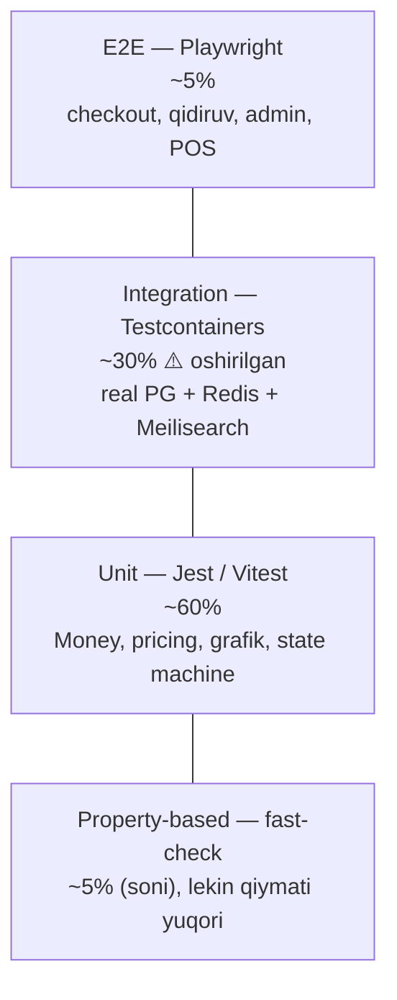
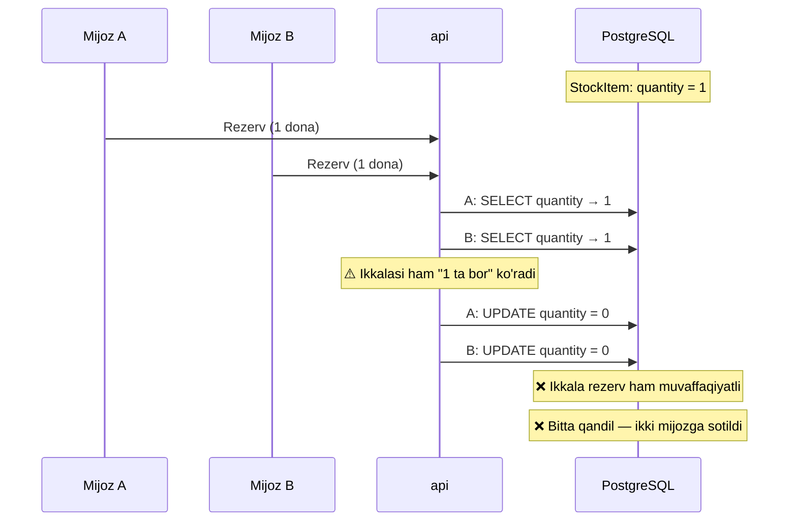
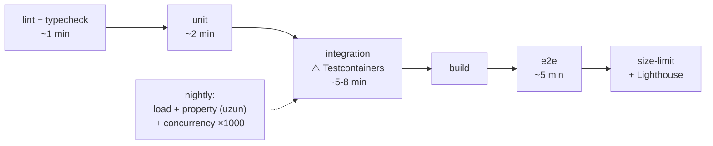

# 14. Test strategiyasi

> **Status:** qoralama (v1)
> **Qamrov:** `apps/api`, `apps/storefront`, `apps/admin`, `packages/*`
> **Bog'liq hujjatlar:** `docs/06-inventory-and-reservations.md` (oversell),
> `docs/05-catalog-and-search.md` (facet), `docs/13-frontend-spec.md`, `docs/15-roadmap.md`

---

## 0. Bu hujjatning pozitsiyasi

Test — bu "sifat uchun" yoziladigan marosim emas. Test — bu **muayyan qo'rquvlarga
qarshi sug'urta**. Har bir test turi shu yerda **qaysi qo'rquvni** yopishi bilan
oqlanadi. Qo'rquv yo'q joyda test ham yozilmaydi.

Kelvin'ning asosiy qo'rquvlari (CANON §9 dan):

| #   | Qo'rquv                                             | Oqibat                                           | Yopadigan test               |
| --- | --------------------------------------------------- | ------------------------------------------------ | ---------------------------- |
| 1   | **Oversell** — oxirgi qandil ikki mijozga sotiladi  | Mijoz pul to'ladi, tovar yo'q. Ishonch yo'qoladi | ⚠️ **Concurrency test** (§4) |
| 2   | **Pul yo'qoladi/paydo bo'ladi** — yaxlitlash xatosi | Buxgalteriya mos kelmaydi. Rassrochkada — sud    | ⚠️ **Property-based** (§5)   |
| 3   | **Narx nodeterminizmi** — bir savat, ikki xil narx  | Mijoz ishonchi, nizolar                          | Property-based (§5)          |
| 4   | **Buyurtma noto'g'ri holatga o'tadi**               | Yetkazilmagan buyurtma "yakunlangan"             | State machine test (§5)      |
| 5   | **Checkout sinadi**                                 | To'g'ridan-to'g'ri daromad yo'qotish             | E2E (§6)                     |
| 6   | **Aksiya paytida tizim yotadi**                     | Eng qimmat vaqtda                                | Load test (§7)               |

⚠️ **Halol boshlang'ich holat:** hozirgi repozitoriyada **test 0 ta**. Test runner
ham o'rnatilmagan. Ya'ni bu hujjat — mavjud narsani tavsiflash emas, **quriladigan
narsani belgilash**.

---

## 1. Test piramidasi — Kelvin uchun

### 1.1 Klassik piramida va nega u bu yerda to'liq to'g'ri emas

Klassik nisbat: **70% unit / 20% integration / 10% e2e**.

⚠️ **Kelvin uchun bu nisbat noto'g'ri.** Sabab: bu loyihaning eng katta risklari
(**oversell, saga, pul**) — bular **unit test bilan ushlanmaydi**. Ular tabiatan
integratsion: real DB, real tranzaksiya, real lock kerak.

Mock qilingan `PrismaClient` bilan yozilgan "unit test" oversell'ni **hech qachon**
topmaydi — chunki mock'da lock ham, izolyatsiya darajasi ham, race ham yo'q.

### 1.2 Kelvin nisbati



| Daraja             | Ulush                          | Nega bunday                                                                                         |
| ------------------ | ------------------------------ | --------------------------------------------------------------------------------------------------- |
| **Unit**           | ~60%                           | Sof mantiq ko'p: `Money`, narx dvigateli, rassrochka grafigi, holat mashinalari. Bular tez va arzon |
| **Integration**    | ⚠️ **~30%** (odatdagidan ko'p) | ⚠️ **Eng katta risklar shu yerda.** Oversell, saga, tranzaksiya — real DB'siz tekshirib bo'lmaydi   |
| **E2E**            | ~5%                            | Qimmat, sekin, flaky. Faqat **pul keltiradigan oqimlar**                                            |
| **Property-based** | ~5% soni bo'yicha              | ⚠️ Soni kam, **qiymati eng yuqori**. Bitta property test minglab holatni tekshiradi                 |

⚠️ **Muhim tamoyil:** bu nisbat **maqsad emas, natija**. "Integration 30% bo'lsin"
deb test yozilmaydi. Risk qayerda — test o'sha yerda.

---

## 2. Unit testlar

**Vosita:** `apps/api` → **Jest** (NestJS ekotizimi, CANON §6).
`apps/storefront`, `apps/admin`, `packages/*` → **Vitest** (Vite ekotizimi).

⚠️ **Nega ikki runner?** NestJS Jest bilan chambarchas (`@nestjs/testing`,
dekoratorlar, DI). Vite app'lari uchun Vitest tabiiy (bir xil config, transform).
Birlashtirishga urinish — ikkalasida ham og'riq. Bu **ataylab qilingan qaror**,
e'tiborsizlik emas.

### 2.1 `Money` — eng ko'p test qilinadigan sinf

CANON §8: **pul — `BigInt`, tiyinda. `Float` hech qachon.**

```ts
// packages/contracts/src/money/money.ts
export class Money {
  private constructor(
    readonly minor: bigint, // tiyin
    readonly currency: 'UZS', // ⚠️ single-tenant, bitta valyuta (CANON §1)
  ) {}

  static fromMinor(minor: bigint, currency: 'UZS' = 'UZS'): Money {
    return new Money(minor, currency);
  }

  add(other: Money): Money {
    this.assertSameCurrency(other);
    return new Money(this.minor + other.minor, this.currency);
  }

  subtract(other: Money): Money {
    this.assertSameCurrency(other);
    return new Money(this.minor - other.minor, this.currency);
  }

  /**
   * Summani n qismga bo'ladi. Qoldiq birinchi qismlarga TARQATILADI.
   * ⚠️ Bu rassrochka uchun HAYOT-MAMOT: 100 000 tiyin / 3 oy = 33 333.33...
   * Yaxlitlash → 33 333 × 3 = 99 999 → 1 tiyin YO'QOLDI.
   * allocate → [33 334, 33 333, 33 333] → yig'indi ANIQ 100 000.
   */
  allocate(parts: number): Money[] {
    if (!Number.isInteger(parts) || parts <= 0) {
      throw new RangeError('parts must be a positive integer');
    }
    const n = BigInt(parts);
    const base = this.minor / n; // BigInt bo'lish — nolga qarab kesadi
    const remainder = this.minor - base * n; // ⚠️ manfiy summa uchun ham to'g'ri

    const result: Money[] = [];
    for (let i = 0n; i < n; i++) {
      const extra =
        i < (remainder < 0n ? -remainder : remainder) ? (remainder < 0n ? -1n : 1n) : 0n;
      result.push(new Money(base + extra, this.currency));
    }
    return result;
  }

  private assertSameCurrency(other: Money): void {
    if (other.currency !== this.currency) {
      throw new TypeError(`currency mismatch: ${this.currency} vs ${other.currency}`);
    }
  }
}
```

**Nima test qilinadi:**

| Test                                             | Nega                                               |
| ------------------------------------------------ | -------------------------------------------------- |
| `add`, `subtract` — oddiy holatlar               | Asos                                               |
| ⚠️ `allocate` — qoldiq to'g'ri tarqaladi         | **Rassrochka.** §5.1 da property test              |
| ⚠️ `allocate` — **manfiy** summa (refund)        | Refund ham bo'linadi. Belgi ishlovi boshqacha      |
| `allocate(0)`, `allocate(-1)`, `allocate(1.5)`   | Xato tashlashi shart                               |
| Valyuta mos kelmasa — xato                       | Kelajakda ko'p valyuta bo'lsa                      |
| ⚠️ **Juda katta summa** (BigInt chegarasi yo'q)  | `Number` bo'lganda `MAX_SAFE_INTEGER` da sinar edi |
| Serialization: JSON'ga → string, qaytib → BigInt | ⚠️ `JSON.stringify(1n)` **xato tashlaydi**         |

### 2.2 Narx / chegirma dvigateli

CANON §9.5: qoida baholash tartibi, ustma-ust chegirma, bundle narxi.
**Determinizm majburiy.**

```ts
// apps/api/src/pricing/pricing-engine.ts
export interface PricingContext {
  readonly items: readonly CartLine[];
  readonly customerSegmentIds: readonly string[];
  readonly at: Date; // ⚠️ vaqt INJEKSIYA qilinadi
  readonly appliedPromotionCodes: readonly string[];
}

export interface PricingResult {
  readonly lines: readonly PricedLine[];
  readonly total: Money;
  /** ⚠️ Qaysi qoida qanday qo'llangani — audit va debug uchun */
  readonly trace: readonly AppliedRule[];
}
```

⚠️ **`at: Date` injeksiya qilinadi, `new Date()` ishlatilmaydi.** Sabab: aksiya
muddati bor. `new Date()` ishlatilsa — test yarim tunda sinadi, va uni takrorlab
bo'lmaydi. Bu klassik flaky manba.

⚠️ **`trace`** — bu shunchaki debug emas. Mijoz "nega bu narx?" desa, support
javob bera olishi kerak. Bu **mahsulot talabi**.

**Nima test qilinadi:**

- Qoidalar tartibi: chegirma → aksiya → bundle → segment
- ⚠️ **Ustma-ust chegirma:** 20% + 10% = 30% emas, **28%** (ketma-ket qo'llash).
  Bu klassik xato
- Chegirma **manfiy narx** bermasligi (§5.2)
- Bundle narxi alohida narxlar yig'indisidan **kam yoki teng**
- Aksiya muddati: boshlanmagan/tugagan
- ⚠️ **Determinizm** (§5.3)

### 2.3 Rassrochka grafigi

CANON §9.6. ⚠️ **Provayder API'lari noma'lum** (CANON §6) — lekin **grafik hisobi**
o'zimizniki va u test qilinadi.

```ts
export interface InstallmentSchedule {
  readonly entries: readonly {
    readonly dueDate: Date;
    readonly principal: Money;
    readonly interest: Money;
    readonly total: Money;
  }[];
  readonly totalPayable: Money;
}
```

**Nima test qilinadi:**

| Test                                      | Nega                                                                     |
| ----------------------------------------- | ------------------------------------------------------------------------ |
| ⚠️ **`sum(principal) === asl summa`**     | **ANIQ**. 1 tiyin ham farq qilmaydi (§5.1)                               |
| `sum(total) === totalPayable`             | Ichki muvofiqlik                                                         |
| To'lov sanalari: oyning 31-kuni → fevral? | ⚠️ **Klassik xato.** 31-yanvar + 1 oy = ?                                |
| 0% rassrochka                             | `interest = 0`, `principal` yig'indisi asl summa                         |
| 3/6/9/12 oy                               | Har biri uchun                                                           |
| ⚠️ Kechikish jarimasi                     | ⚠️ **Formula noma'lum** — provayder hujjatidan. **To'qib chiqarilmaydi** |

⚠️ **Halol:** foiz stavkasi, jarima formulasi, kechikish qoidalari — bularning
hech biri hozir ma'lum emas. Test **strukturasi** yoziladi, **konkret raqamlar**
provayder hujjati kelgach to'ldiriladi. → `docs/15-roadmap.md`, Faza 5 (yuridik bloker).

### 2.4 Holat mashinalari

`Order`, `Payment`, `Shipment`, `PosShift` — har birida holat mashinasi.

```ts
// apps/api/src/order/order-state-machine.ts
export type OrderStatus =
  | 'DRAFT'
  | 'PENDING_PAYMENT'
  | 'PAID'
  | 'CONFIRMED'
  | 'PICKING'
  | 'SHIPPED'
  | 'DELIVERED'
  | 'COMPLETED'
  | 'CANCELLED'
  | 'REFUNDED';

/** ⚠️ Yagona haqiqat manbai. Kodning boshqa joyida `status = 'PAID'` yozilmaydi. */
export const ORDER_TRANSITIONS: Readonly<Record<OrderStatus, readonly OrderStatus[]>> = {
  DRAFT: ['PENDING_PAYMENT', 'CANCELLED'],
  PENDING_PAYMENT: ['PAID', 'CANCELLED'],
  PAID: ['CONFIRMED', 'REFUNDED'],
  CONFIRMED: ['PICKING', 'CANCELLED'],
  PICKING: ['SHIPPED', 'CANCELLED'],
  SHIPPED: ['DELIVERED'],
  DELIVERED: ['COMPLETED', 'REFUNDED'],
  COMPLETED: ['REFUNDED'],
  CANCELLED: [], // ⚠️ terminal
  REFUNDED: [], // ⚠️ terminal
} as const;

export function canTransition(from: OrderStatus, to: OrderStatus): boolean {
  return ORDER_TRANSITIONS[from].includes(to);
}
```

**Nima test qilinadi:**

- Har ruxsat etilgan o'tish — ishlaydi
- ⚠️ Har **ruxsat etilmagan** o'tish — **bloklanadi** (§5.4)
- Terminal holatdan chiqib bo'lmaydi
- ⚠️ Har o'tish `OrderStatusHistory` ga yoziladi (CANON §8)
- ⚠️ `SHIPPED` → `CANCELLED` **mumkin emas** (tovar yo'lda). Bu biznes qoidasi

### 2.5 Frontend unit (Vitest)

→ `docs/13-frontend-spec.md` §12

| Nima                                         | Nega                                     |
| -------------------------------------------- | ---------------------------------------- |
| `resolveOptionState` — variant matritsasi    | ⚠️ `nonexistent` va `out-of-stock` farqi |
| `parseFilters` / `writeFilter` — URL ↔ state | Round-trip: parse(write(x)) === x        |
| `formatMoney(minor, locale)`                 | 3 til × chegara qiymatlar                |
| Savat merge mantiqi (`max`)                  | ⚠️ Konflikt hal qilish                   |
| Transliteratsiya (lotin↔kirill)              | ⚠️ Istisnolar lug'ati                    |

---

## 3. Integration testlar — Testcontainers bilan

### 3.1 ⚠️ Nega mock DB yolg'on ishonch beradi

Bu **hujjatning eng muhim texnik pozitsiyalaridan biri**.

Mock qilingan `PrismaClient` — bu **sizning DB haqidagi faraziyangiz**, DB emas.
U quyidagilarni **umuman modellashtirmaydi**:

| Real DB'da bor                                                               | Mock'da                                   |
| ---------------------------------------------------------------------------- | ----------------------------------------- |
| ⚠️ **Tranzaksiya izolyatsiya darajasi** (`READ COMMITTED` vs `SERIALIZABLE`) | Yo'q                                      |
| ⚠️ **Lock** (`SELECT ... FOR UPDATE`), deadlock                              | Yo'q                                      |
| ⚠️ **Race condition**                                                        | Yo'q — mock ketma-ket ishlaydi            |
| **Cheklovlar:** `UNIQUE`, `CHECK`, `FOREIGN KEY`                             | ⚠️ Yo'q — mock hamma narsani qabul qiladi |
| **Trigger, kaskad o'chirish**                                                | Yo'q                                      |
| ⚠️ **`BigInt` ↔ `numeric` konvertatsiyasi**                                  | Yo'q — JS'da qoladi                       |
| Timezone (`timestamptz`) xulqi                                               | Yo'q                                      |
| Query rejasi, indeks                                                         | Yo'q                                      |
| ⚠️ **Prisma'ning o'z xatolari**                                              | Yo'q                                      |

**Konkret misol:** oversell testi. Mock DB bilan:

```ts
// ❌ BU TEST HECH NARSANI ISBOTLAMAYDI
prismaMock.stockItem.findUnique.mockResolvedValue({ quantity: 1 });
prismaMock.stockItem.update.mockResolvedValue({ quantity: 0 });

await Promise.all([reserve(variantId), reserve(variantId)]);
// Mock'da ikkalasi ham "muvaffaqiyat" qaytaradi. Test YASHIL.
// Realda — oversell. Prod'da — mijoz pul to'lagan, tovar yo'q.
```

⚠️ **Bu test yashil bo'lgani uchun XAVFLI.** U yo'q testdan **yomonroq** — chunki
ishonch beradi. Yo'q test hech bo'lmasa halol.

**Xulosa:** DB bilan ishlaydigan har qanday kod **real DB'da** test qilinadi.
Bu muzokaraga ochiq emas.

### 3.2 Testcontainers sozlash

```ts
// apps/api/test/setup/containers.ts
import { PostgreSqlContainer, StartedPostgreSqlContainer } from '@testcontainers/postgresql';
import { RedisContainer, StartedRedisContainer } from '@testcontainers/redis';
import { GenericContainer, StartedTestContainer, Wait } from 'testcontainers';

export interface TestStack {
  readonly postgres: StartedPostgreSqlContainer;
  readonly redis: StartedRedisContainer;
  readonly meilisearch: StartedTestContainer;
}

/** ⚠️ Versiyalar prod bilan BIR XIL bo'lishi shart (CANON §6):
 *  PostgreSQL 17, Redis 7. "Latest" ishlatilmaydi — takrorlanmaydigan test. */
export async function startTestStack(): Promise<TestStack> {
  const [postgres, redis, meilisearch] = await Promise.all([
    new PostgreSqlContainer('postgres:17-alpine')
      .withDatabase('kelvin_test')
      // ⚠️ tmpfs — disk yozuvisiz. Testda durability KERAK EMAS, tezlik kerak
      .withTmpFs({ '/var/lib/postgresql/data': 'rw,size=512m' })
      .start(),
    new RedisContainer('redis:7-alpine').start(),
    new GenericContainer('getmeili/meilisearch:v1.11')
      .withExposedPorts(7700)
      .withEnvironment({ MEILI_ENV: 'development' })
      .withWaitStrategy(Wait.forHttp('/health', 7700))
      .start(),
  ]);

  return { postgres, redis, meilisearch };
}
```

⚠️ **Konteyner hayot sikli — bu tezlik masalasi:**

| Strategiya                                                 | Vaqt                          | Izolyatsiya                         |
| ---------------------------------------------------------- | ----------------------------- | ----------------------------------- |
| Har test uchun yangi konteyner                             | ⚠️ **Juda sekin** (~3-5s × N) | Mukammal                            |
| **Butun suite uchun bitta + har testdan keyin `TRUNCATE`** | ✅ Tez                        | ⚠️ Yetarli                          |
| Bitta + tranzaksiya rollback                               | Eng tez                       | ❌ ⚠️ **Concurrency testni buzadi** |

**Tanlangan: bitta konteyner + `TRUNCATE`.**

⚠️ **Nega rollback emas:** tranzaksiya ichida test yuritish — chiroyli va tez.
Lekin **oversell testi aynan tranzaksiyalar bilan ishlaydi**. Testni tranzaksiyaga
o'rash — nested tranzaksiya, lock xulqi buziladi. Ya'ni eng muhim testimizni
yolg'onga aylantiradi. **Qabul qilinmaydi.**

```ts
// Har testdan keyin
async function truncateAll(prisma: PrismaClient): Promise<void> {
  const tables = await prisma.$queryRaw<{ tablename: string }[]>`
    SELECT tablename FROM pg_tables
    WHERE schemaname = 'public' AND tablename != '_prisma_migrations'
  `;
  const list = tables.map((t) => `"public"."${t.tablename}"`).join(', ');
  // RESTART IDENTITY — ketma-ketliklar ham tozalanadi
  await prisma.$executeRawUnsafe(`TRUNCATE TABLE ${list} RESTART IDENTITY CASCADE`);
}
```

### 3.3 Nima integratsion test qilinadi

| Modul          | Nima                                                         |
| -------------- | ------------------------------------------------------------ |
| ⚠️ `inventory` | **Rezerv, oversell, TTL bo'shatish** (§4)                    |
| ⚠️ `order`     | **Saga:** to'lov ↔ rezerv ↔ yetkazib berish, kompensatsiya   |
| `payment`      | Ledger balansi, ⚠️ **idempotentlik** (webhook 2 marta kelsa) |
| `search`       | Meilisearch indeksatsiya, ⚠️ **facet count to'g'riligi**     |
| `cart`         | Mehmon savati birlashishi + konflikt                         |
| `identity`     | ⚠️ Refresh rotatsiyasi, token qayta ishlatishni aniqlash     |
| `catalog`      | Variant matritsasi, atribut merosi                           |
| Outbox         | ⚠️ Event **yo'qolmasligi** (at-least-once)                   |

⚠️ **Idempotentlik — alohida ta'kidlanadi.** Click/Payme webhook'lari **bir necha
marta kelishi mumkin** (bu ularning normal xulqi, xato emas). Bir xil webhook 2
marta kelsa → **1 ta to'lov** yozilishi kerak, 2 ta emas. Bu test **majburiy**.

---

## 4. ⚠️ Concurrency test — eng muhimi

**Bu bo'lim — butun hujjatning markazi.**

CANON §9.2: _"Oversell oldini olish — bu loyihaning eng nozik joyi."_

### 4.1 Muammo



Bu **nazariy muammo emas**. Aksiya paytida, oxirgi tovar ustida — bu **muqarrar**.

### 4.2 Test

```ts
// apps/api/test/integration/inventory/oversell.spec.ts
describe('StockReservation — concurrency', () => {
  it("⚠️ 100 parallel so'rov, 1 dona tovar → ANIQ 1 muvaffaqiyat", async () => {
    const variantId = await seedVariantWithStock({ quantity: 1 });

    // ⚠️ Promise.allSettled — Promise.all EMAS.
    // Promise.all birinchi rad etilishda to'xtaydi va biz natijani ko'rmaymiz.
    const results = await Promise.allSettled(
      Array.from({ length: 100 }, () =>
        inventoryService.reserve({
          variantId,
          quantity: 1,
          cartId: randomUUID(),
          ttlSeconds: 900,
        }),
      ),
    );

    const succeeded = results.filter((r) => r.status === 'fulfilled');
    const failed = results.filter((r) => r.status === 'rejected');

    // ⚠️ ASOSIY TASDIQ
    expect(succeeded).toHaveLength(1);
    expect(failed).toHaveLength(99);

    // ⚠️ Rad etilganlar TO'G'RI sabab bilan rad etilishi kerak.
    // Agar 99 tasi deadlock/timeout bilan yiqilsa — bu ham xato.
    for (const f of failed) {
      expect((f as PromiseRejectedResult).reason).toBeInstanceOf(InsufficientStockError);
    }

    // ⚠️ DB holati ham tekshiriladi — service javobiga ishonish yetarli emas
    const stock = await prisma.stockItem.findUniqueOrThrow({ where: { variantId } });
    expect(stock.quantity).toBe(1n); // fizik qoldiq o'zgarmaydi

    const reservations = await prisma.stockReservation.count({
      where: { variantId, status: 'ACTIVE' },
    });
    expect(reservations).toBe(1);

    // ⚠️ INVARIANT: mavjud qoldiq hech qachon manfiy emas
    const available = stock.quantity - BigInt(reservations);
    expect(available).toBeGreaterThanOrEqual(0n);
  });

  it('⚠️ 100 parallel, 10 dona → ANIQ 10 muvaffaqiyat', async () => {
    const variantId = await seedVariantWithStock({ quantity: 10 });

    const results = await Promise.allSettled(
      Array.from({ length: 100 }, () =>
        inventoryService.reserve({ variantId, quantity: 1, cartId: randomUUID(), ttlSeconds: 900 }),
      ),
    );

    expect(results.filter((r) => r.status === 'fulfilled')).toHaveLength(10);
  });

  it("⚠️ Turli miqdor: 3+3+3+3 parallel, 10 dona → 3 ta o'tadi (9), 1 rad", async () => {
    // ⚠️ Bu holat murakkabroq: qisman bajarish BO'LMASLIGI kerak.
    // 4-so'rov 1 dona qolganini ko'rib, "3 so'radim, 1 beraman" DEMASLIGI kerak.
    const variantId = await seedVariantWithStock({ quantity: 10 });

    const results = await Promise.allSettled(
      Array.from({ length: 4 }, () =>
        inventoryService.reserve({ variantId, quantity: 3, cartId: randomUUID(), ttlSeconds: 900 }),
      ),
    );

    expect(results.filter((r) => r.status === 'fulfilled')).toHaveLength(3);
    expect(results.filter((r) => r.status === 'rejected')).toHaveLength(1);
  });

  it("TTL tugagach rezerv bo'shatiladi va tovar qayta sotiladi", async () => {
    const variantId = await seedVariantWithStock({ quantity: 1 });
    await inventoryService.reserve({ variantId, quantity: 1, cartId: randomUUID(), ttlSeconds: 1 });

    await expect(
      inventoryService.reserve({ variantId, quantity: 1, cartId: randomUUID(), ttlSeconds: 900 }),
    ).rejects.toThrow(InsufficientStockError);

    // ⚠️ Vaqt "o'tkaziladi" — real sleep EMAS (flaky va sekin).
    // Rezerv muddati o'tgan qilib belgilanadi + tozalash job'i chaqiriladi.
    await expireReservationsInPast(variantId);
    await inventoryService.releaseExpiredReservations();

    await expect(
      inventoryService.reserve({ variantId, quantity: 1, cartId: randomUUID(), ttlSeconds: 900 }),
    ).resolves.toBeDefined();
  });
});
```

⚠️ **`Promise.allSettled`, `Promise.all` emas** — bu muhim tafsilot. `Promise.all`
birinchi rad etilishda to'xtaydi va qolgan 99 tasining natijasini ko'rmaymiz.
Test "o'tgandek" bo'ladi, lekin hech narsani tekshirmagan bo'ladi.

⚠️ **Real sleep ishlatilmaydi** (`await sleep(1000)`). Sabab: sekin va flaky.
Rezerv `expiresAt` maydoni o'tmishga o'rnatiladi.

### 4.3 ⚠️ Bu test nimani ISBOTLAMAYDI (halol)

Bu muhim va odatda aytilmaydi:

1. ⚠️ **100 parallel `Promise` — bu 100 parallel HTTP so'rov emas.** Bitta Node
   process, bitta event loop. Real prod'da bir necha instance bo'ladi. Bu test
   **DB darajasidagi** himoyani tekshiradi (lock/constraint) — va bu **eng muhimi**,
   chunki DB — yagona umumiy nuqta.
2. ⚠️ **Test o'tishi — kafolat emas.** Bu **regressiya tuzog'i**: agar kimdir
   keyinchalik lock'ni olib tashlasa — test qizil bo'ladi. Bu uning asosiy qiymati.
3. ⚠️ **Timing'ga bog'liqlik saqlanadi.** Test "o'tdi" — lekin race oynasi juda
   tor bo'lsa, test uni **o'tkazib yuborishi mumkin**. Shuning uchun **1000 marta**
   takrorlash `nightly` CI'da qilinadi (§10).
4. ⚠️ **Yagona haqiqiy kafolat — DB constraint.** Test emas. Masalan:
   `CHECK (quantity >= 0)` yoki rezerv jadvalida `UNIQUE` — bular **kod qanday
   yozilishidan qat'i nazar** ishlaydi. Test — bu constraint borligini tasdiqlaydi.

⚠️ **Ya'ni:** himoya **DB'da** bo'lishi kerak, test'da emas. Test — himoya
mavjudligini isbotlaydi.

Rezerv mexanizmining o'zi (lock strategiyasi, TTL, Redis vs PostgreSQL):
→ **`docs/06-inventory-and-reservations.md`**

### 4.4 Boshqa concurrency testlar

| Ssenariy                                  | Tasdiq                                      |
| ----------------------------------------- | ------------------------------------------- |
| ⚠️ Bir savat, ikki tab, parallel checkout | **1 ta buyurtma**, 2 ta emas                |
| Bir xil webhook 2 marta (Click)           | **1 ta** `Payment`                          |
| Parallel refresh token (10 ta)            | ⚠️ **1 ta** yangi token, sessiya buzilmaydi |
| Ikki admin bir mahsulotni tahrirlaydi     | Optimistic lock → 2-si xato oladi           |
| Inventarizatsiya paytida sotuv            | Qoldiq mos qoladi                           |
| Parallel POS sotuv (2 kassa, 1 tovar)     | 1 ta o'tadi                                 |

---

## 5. Property-based testing (fast-check)

### 5.1 Nega bu kerak

Odatiy test — **siz o'ylagan** holatlarni tekshiradi. Property test — **siz
o'ylamagan** holatlarni topadi.

Xato odatda siz o'ylamagan joyda. Shuning uchun property test — **aynan pul
mantiqida** eng qimmatli.

⚠️ **`fast-check` CANON §6 da ko'rsatilgan** — bu tanlov emas, kanon.

### 5.2 `Money.allocate()` — yig'indi invarianti

⚠️ **Bu — butun hujjatdagi eng muhim property.** Rassrochka shunga tayanadi.

```ts
// packages/contracts/test/money.property.spec.ts
import fc from 'fast-check';
import { Money } from '../src/money/money';

describe('Money.allocate — property', () => {
  it("⚠️ INVARIANT: qismlar yig'indisi HAR DOIM asl summaga teng", () => {
    fc.assert(
      fc.property(
        fc.bigInt({ min: -10_000_000_000n, max: 10_000_000_000n }), // ⚠️ manfiy ham (refund)
        fc.integer({ min: 1, max: 60 }), // 60 oygacha rassrochka
        (minor, parts) => {
          const money = Money.fromMinor(minor);
          const allocated = money.allocate(parts);

          const sum = allocated.reduce((acc, m) => acc + m.minor, 0n);

          // ⚠️ ANIQ TENGLIK. Tolerantlik YO'Q. 1 tiyin ham yo'qolmaydi.
          expect(sum).toBe(minor);
          expect(allocated).toHaveLength(parts);
        },
      ),
      { numRuns: 10_000 },
    );
  });

  it("INVARIANT: qismlar orasidagi farq ko'pi bilan 1 tiyin", () => {
    fc.assert(
      fc.property(
        fc.bigInt({ min: 0n, max: 10_000_000_000n }),
        fc.integer({ min: 1, max: 60 }),
        (minor, parts) => {
          const allocated = Money.fromMinor(minor)
            .allocate(parts)
            .map((m) => m.minor);
          const max = allocated.reduce((a, b) => (a > b ? a : b));
          const min = allocated.reduce((a, b) => (a < b ? a : b));

          // ⚠️ Adolat: hech kim boshqadan 1 tiyindan ko'p ko'p to'lamaydi
          expect(max - min).toBeLessThanOrEqual(1n);
        },
      ),
      { numRuns: 10_000 },
    );
  });

  it('INVARIANT: qoldiq BIRINCHI qismlarga beriladi (determinizm)', () => {
    fc.assert(
      fc.property(
        fc.bigInt({ min: 0n, max: 10_000_000_000n }),
        fc.integer({ min: 1, max: 60 }),
        (minor, parts) => {
          const allocated = Money.fromMinor(minor)
            .allocate(parts)
            .map((m) => m.minor);
          // Kamaymaydigan tartib: [34, 33, 33] — to'g'ri, [33, 34, 33] — yo'q
          for (let i = 1; i < allocated.length; i++) {
            expect(allocated[i - 1]).toBeGreaterThanOrEqual(allocated[i]!);
          }
        },
      ),
      { numRuns: 5_000 },
    );
  });
});
```

⚠️ **Nega bu shunchalik muhim:** rassrochkada 12 oylik grafik. Har oyda 1 tiyin
yo'qolsa — 12 tiyin. Bu kichik ko'rinadi. Lekin: 1 000 buyurtma × 12 tiyin = 120 so'm,
va **buxgalteriya balansi mos kelmaydi**. Balans mos kelmasa — audit yiqiladi.
Rassrochkada esa bu **shartnoma buzilishi** va sud masalasi.

### 5.3 Qoldiq hech qachon manfiy emas

```ts
it("⚠️ INVARIANT: rezerv/bo'shatish ketma-ketligidan qat'i nazar, qoldiq >= 0", () => {
  fc.assert(
    fc.asyncProperty(
      fc.integer({ min: 1, max: 50 }), // boshlang'ich qoldiq
      fc.array(
        fc.oneof(
          fc.record({
            type: fc.constant('reserve' as const),
            qty: fc.integer({ min: 1, max: 10 }),
          }),
          fc.record({
            type: fc.constant('release' as const),
            qty: fc.integer({ min: 1, max: 10 }),
          }),
          fc.record({
            type: fc.constant('confirm' as const),
            qty: fc.integer({ min: 1, max: 10 }),
          }),
        ),
        { minLength: 1, maxLength: 100 },
      ),
      async (initial, operations) => {
        const variantId = await seedVariantWithStock({ quantity: initial });

        for (const op of operations) {
          // ⚠️ Xatolar YUTILADI — biz "amal muvaffaqiyatli bo'ldimi" ni tekshirmayapmiz.
          // Biz INVARIANT hech qachon buzilmasligini tekshiryapmiz.
          try {
            await applyOperation(variantId, op);
          } catch {
            /* rad etish — to'g'ri xulq */
          }

          const available = await inventoryService.getAvailable(variantId);
          expect(available).toBeGreaterThanOrEqual(0n); // ⚠️ INVARIANT
        }
      },
    ),
    { numRuns: 200 }, // ⚠️ DB bilan — sekin, shuning uchun kamroq
  );
});
```

⚠️ **`numRuns: 200`** — bu DB'ga tegadi, ya'ni sekin. 10 000 marta yugurtirish
CI'ni o'ldiradi. Nightly'da ko'proq (§10).

### 5.4 Narx dvigateli determinizmi

⚠️ CANON §9.5: **"Determinizm majburiy."**

```ts
it('⚠️ INVARIANT: bir xil savat + bir xil vaqt → bir xil narx', () => {
  fc.assert(
    fc.property(arbitraryCart(), arbitraryDate(), (cart, at) => {
      const a = pricingEngine.calculate({ ...cart, at });
      const b = pricingEngine.calculate({ ...cart, at });

      expect(a.total.minor).toBe(b.total.minor);
      // ⚠️ Trace ham bir xil — ya'ni qoidalar BIR XIL TARTIBDA qo'llangan
      expect(a.trace).toEqual(b.trace);
    }),
    { numRuns: 5_000 },
  );
});

it("⚠️ INVARIANT: savatdagi pozitsiyalar tartibi narxga ta'sir qilmaydi", () => {
  fc.assert(
    fc.property(arbitraryCart(), arbitraryDate(), (cart, at) => {
      const forward = pricingEngine.calculate({ ...cart, at });
      const shuffled = pricingEngine.calculate({ ...cart, items: [...cart.items].reverse(), at });

      // ⚠️ Bu OSON buziladigan invariant: agar chegirma "birinchi topilgan
      // pozitsiyaga" qo'llansa — tartib narxni o'zgartiradi. Bu XATO.
      expect(forward.total.minor).toBe(shuffled.total.minor);
    }),
    { numRuns: 5_000 },
  );
});

it('INVARIANT: yakuniy narx hech qachon manfiy emas', () => {
  fc.assert(
    fc.property(arbitraryCart(), arbitraryDiscounts(), arbitraryDate(), (cart, discounts, at) => {
      const result = pricingEngine.calculate({ ...cart, discounts, at });
      // ⚠️ 90% + 20% chegirma → 110% → manfiy narx. Klassik xato.
      expect(result.total.minor).toBeGreaterThanOrEqual(0n);
    }),
    { numRuns: 10_000 },
  );
});

it('INVARIANT: chegirma summasi asl summadan oshmaydi', () => {
  fc.assert(
    fc.property(arbitraryCart(), arbitraryDiscounts(), arbitraryDate(), (cart, discounts, at) => {
      const withDiscount = pricingEngine.calculate({ ...cart, discounts, at });
      const without = pricingEngine.calculate({ ...cart, discounts: [], at });
      expect(withDiscount.total.minor).toBeLessThanOrEqual(without.total.minor);
    }),
    { numRuns: 5_000 },
  );
});
```

### 5.5 Holat mashinasi: noto'g'ri o'tish imkonsiz

```ts
const ALL_STATUSES = Object.keys(ORDER_TRANSITIONS) as OrderStatus[];

it("⚠️ INVARIANT: ruxsat etilmagan o'tish HAR DOIM rad etiladi", () => {
  fc.assert(
    fc.asyncProperty(
      fc.constantFrom(...ALL_STATUSES),
      fc.constantFrom(...ALL_STATUSES),
      async (from, to) => {
        const order = await seedOrderInStatus(from);
        const allowed = ORDER_TRANSITIONS[from].includes(to);

        if (allowed) {
          await expect(orderService.transition(order.id, to)).resolves.toBeDefined();
        } else {
          // ⚠️ Har bir mumkin bo'lgan JUFTLIK tekshiriladi — 10 × 10 = 100 ta.
          // Qo'lda yozilsa — 100 ta test. Property bilan — bitta.
          await expect(orderService.transition(order.id, to)).rejects.toThrow(
            InvalidTransitionError,
          );
        }
      },
    ),
    { numRuns: 300 },
  );
});

it("INVARIANT: terminal holatdan chiqib bo'lmaydi", () => {
  fc.assert(
    fc.asyncProperty(
      fc.constantFrom<OrderStatus>('CANCELLED', 'REFUNDED'),
      fc.constantFrom(...ALL_STATUSES),
      async (terminal, target) => {
        const order = await seedOrderInStatus(terminal);
        await expect(orderService.transition(order.id, target)).rejects.toThrow(
          InvalidTransitionError,
        );
      },
    ),
    { numRuns: 100 },
  );
});
```

### 5.6 ⚠️ Property test qayerda ARZIMAYDI (halol)

Property test — bepul emas: arbitrary yozish vaqt oladi, sekin ishlaydi, va
buzilganda **debug qilish qiyin** (fast-check shrink qiladi, lekin baribir).

**Arzimaydigan joylar:**

- CRUD — "yaratdim, o'qidim" — bu yerda invariant yo'q
- UI komponentlari
- Tashqi API adapterlari (Click/Payme) — u yerda faraz emas, kontrakt
- Konfiguratsiya

**Arziydigan joylar (qat'iy ro'yxat):** `Money`, `pricing`, `inventory`,
holat mashinalari, rassrochka grafigi, transliteratsiya. **Boshqa joyda talab
qilinmaydi.**

---

## 6. E2E — Playwright

### 6.1 Falsafa

⚠️ E2E — **qimmat, sekin, flaky**. Shuning uchun **kam**, lekin **pul keltiradigan
oqimlarda**.

⚠️ **Qoida:** E2E test **faqat** shu savolga javob beradi: _"Foydalanuvchi
pul to'lay oladimi?"_ Boshqa hamma narsa pastroq darajada tekshiriladi.

### 6.2 Kritik oqimlar

| #         | Oqim                                                | Nega kritik                                       |
| --------- | --------------------------------------------------- | ------------------------------------------------- |
| **E2E-1** | ⚠️ **Checkout — mehmon**                            | Sinsa — **to'g'ridan-to'g'ri daromad yo'qolishi** |
| **E2E-2** | ⚠️ **Checkout — login qilgan** (savat merge bilan)  | Eng ko'p bug shu yerda                            |
| **E2E-3** | Qidiruv + filtr + URL                               | Asosiy navigatsiya                                |
| **E2E-4** | Admin: mahsulot + variant matritsasi                | Kontent menejerining asosiy ishi                  |
| **E2E-5** | POS: smena ochish → sotuv → yopish                  | Offline kassa                                     |
| **E2E-6** | Buyurtma holati: admin o'zgartiradi → mijoz ko'radi | Uchdan-uchgacha                                   |

```ts
// e2e/checkout-guest.spec.ts
test('⚠️ E2E-1: mehmon checkout — Click orqali', async ({ page }) => {
  await page.goto('/uz/catalog/lyustry');

  // Filtr
  await page.getByRole('checkbox', { name: /4000\s*K/ }).check();
  await expect(page).toHaveURL(/ct=4000/); // ⚠️ URL sinxronizatsiyasi

  await page
    .getByRole('link', { name: /Novotech/ })
    .first()
    .click();

  // Variant tanlash
  await page.getByRole('radio', { name: 'Xrom' }).click();
  await page.getByRole('radio', { name: "O'rta" }).click();

  await page.getByRole('button', { name: /Savatga/ }).click();
  await expect(page.getByTestId('cart-count')).toHaveText('1');

  // ⚠️ Savat refresh'dan keyin saqlanadi (localStorage)
  await page.reload();
  await expect(page.getByTestId('cart-count')).toHaveText('1');

  await page.goto('/uz/checkout');
  await page.getByLabel('Ism').fill('Sarvarbek');
  await page.getByLabel('Familiya').fill('Sodiqov');
  await page.getByLabel('Telefon').fill('+998901234567');
  await page.getByRole('radio', { name: /Kuryer/ }).click();
  await page.getByLabel('Manzil').fill('Toshkent, Chilonzor tumani, 12-uy');
  await page.getByRole('button', { name: /Slot tanlash/ }).click();
  await page.getByRole('button', { name: /10:00/ }).first().click();
  await page.getByRole('radio', { name: 'Click' }).click();
  await page.getByRole('checkbox', { name: /shartlar/ }).check();

  await page.getByRole('button', { name: /Buyurtma berish/ }).click();

  // ⚠️ Click SANDBOX'i. Real to'lov QILINMAYDI.
  await expect(page).toHaveURL(/click\.uz|checkout\/payment/);
  await completeClickSandboxPayment(page);

  await expect(page.getByTestId('order-number')).toBeVisible();

  // ⚠️ DB tekshiruvi: rezerv confirm bo'ldimi
  const order = await fetchLatestOrderFromApi();
  expect(order.status).toBe('PAID');
  expect(order.reservations.every((r) => r.status === 'CONFIRMED')).toBe(true);
});
```

⚠️ **To'lov — sandbox.** Real Click/Payme'ga E2E'da urilmaydi. ⚠️ **Lekin:**
Click/Payme sandbox mavjudligi va xulqi **tekshirilmagan** (CANON §6: API detallari
noma'lum). Agar sandbox bo'lmasa — **o'z mock provayderimiz** yoziladi va **real
integratsiya qo'lda** tekshiriladi. Bu **ochiq savol**.

### 6.3 ⚠️ Flaky'ga qarshi qoidalar

| ❌ Qilinmaydi                 | ✅ Qilinadi                                                              |
| ----------------------------- | ------------------------------------------------------------------------ |
| `waitForTimeout(2000)`        | Auto-waiting (`expect().toBeVisible()`)                                  |
| CSS selektor (`.btn-primary`) | ⚠️ `getByRole`, `getByLabel` — **a11y bilan bir xil narsani tekshiradi** |
| Umumiy test DB                | Har test — o'z ma'lumoti (unikal prefiks)                                |
| Test tartibiga bog'liqlik     | Har test mustaqil                                                        |
| Real tashqi API               | Sandbox / mock                                                           |
| `new Date()`                  | Vaqt aniq belgilanadi                                                    |

⚠️ **`getByRole` — bu bonus:** u a11y daraxti orqali ishlaydi. Ya'ni agar tugma
`<div onClick>` bo'lsa — `getByRole('button')` **topolmaydi** va test yiqiladi.
Ya'ni E2E testlar **a11y'ni ham majburlaydi**. Bu bepul foyda
(→ `docs/13-frontend-spec.md` §9).

### 6.4 A11y va vizual regressiya

```ts
test("a11y: kritik sahifalarda serious/critical yo'q", async ({ page }) => {
  for (const path of ['/uz', '/uz/catalog/lyustry', '/uz/product/test', '/uz/checkout']) {
    await page.goto(path);
    const results = await new AxeBuilder({ page })
      .withTags(['wcag2a', 'wcag2aa', 'wcag22aa'])
      .analyze();
    const serious = results.violations.filter((v) =>
      ['serious', 'critical'].includes(v.impact ?? ''),
    );
    expect(serious, JSON.stringify(serious, null, 2)).toEqual([]);
  }
});

// ⚠️ Vizual: 3 til × layout buzilishi (docs/13 §7.4)
for (const locale of ['uz', 'uz-Cyrl', 'ru'] as const) {
  test(`vizual: ${locale} — layout buzilmaydi`, async ({ page }) => {
    await page.goto(`/${locale}/product/test`);
    await expect(page).toHaveScreenshot(`product-${locale}.png`, {
      maxDiffPixelRatio: 0.01,
      mask: [page.getByTestId('product-image')], // ⚠️ rasm o'zgarishi test buzmasin
    });
  });
}
```

⚠️ **Vizual regressiya — ehtiyotkorlik bilan.** Bu eng flaky test turi (shrift
rendering OS'ga bog'liq). **Faqat Docker ichida**, qat'iy bir xil muhitda ishlaydi.
Aks holda — foydadan ko'ra bezovtalik ko'p.

---

## 7. Load test — k6

### 7.1 ⚠️ Nima uchun va nima uchun EMAS

⚠️ **Halol:** hozircha **hech qanday raqam ma'lum emas**. Real do'kon yo'q, real
trafik yo'q, kutilayotgan yuklama noma'lum (CANON: real do'kon yo'q → talablar
farazga asoslangan).

Shuning uchun load test **maqsadi**: "10 000 RPS ni ushlash" **emas**. Maqsad:

1. ⚠️ **Tizim qayerda birinchi yiqilishini topish** (bottleneck)
2. ⚠️ **Regressiya:** o'tgan haftadan sekinlashdimi
3. ⚠️ **Yiqilish xulqini tekshirish:** ortiqcha yuklamada **to'g'ri** yiqilishi
   kerak (429 + Retry-After), **ma'lumot buzilishisiz**

### 7.2 Ssenariylar

```js
// load/search.js
import http from 'k6/http';
import { check } from 'k6';

export const options = {
  scenarios: {
    // ⚠️ Faceted search — eng og'ir so'rov (15+ atribut + facet count)
    faceted_search: {
      executor: 'ramping-vus',
      stages: [
        { duration: '2m', target: 50 },
        { duration: '5m', target: 50 },
        { duration: '2m', target: 200 }, // ⚠️ bottleneck qidirish
        { duration: '2m', target: 0 },
      ],
    },
  },
  thresholds: {
    // ⚠️ Bu chegaralar — BOSHLANG'ICH FARAZ, o'lchov emas.
    // Birinchi yugurishdan keyin real qiymatga moslanadi.
    http_req_duration: ['p(95)<500'],
    http_req_failed: ['rate<0.01'],
  },
};

export default function () {
  const filters = randomFilterCombination(); // ⚠️ har VU boshqa filtr → kesh yolg'on yordam bermasin
  const res = http.get(`${__ENV.API_URL}/search?${filters}`);

  check(res, {
    'status 200': (r) => r.status === 200,
    'facets bor': (r) => JSON.parse(r.body).facets !== undefined,
  });
}
```

⚠️ **`randomFilterCombination()`** — muhim. Agar barcha VU bir xil so'rov yuborsa,
Redis keshi 100% hit beradi va test **yolg'on natija** ko'rsatadi. Real
foydalanuvchilar har xil filtr qo'llaydi.

| Ssenariy                   | Nima tekshiriladi                                                                              |
| -------------------------- | ---------------------------------------------------------------------------------------------- |
| ⚠️ **Faceted search**      | Eng og'ir. Meilisearch vs PostgreSQL qarori shunga bog'liq (CANON §9.1)                        |
| **Checkout**               | ⚠️ Yozish yuklamasi + rezerv locklari                                                          |
| ⚠️ **Aksiya (flash sale)** | ⚠️ **Eng qattiq test:** 1000 VU bir vaqtda **bitta** mahsulotni sotib oladi. Lock nima qiladi? |
| Katalog ko'rish            | Eng ko'p trafik, lekin oson (kesh)                                                             |
| Admin jadval               | 50 000 yozuv + sort + filter                                                                   |

⚠️ **Aksiya ssenariysi — eng qimmatli:** bu **oversell + performance** ni bir
vaqtda tekshiradi. 1000 VU, 10 dona tovar → **aniq 10 ta buyurtma** bo'lishi
kerak, va tizim yiqilmasligi kerak. Bu §4 dagi unit-darajadagi concurrency
testning **real dunyodagi versiyasi**.

### 7.3 Qachon

- ⚠️ **CI'da har PR'da EMAS** — sekin va shovqinli
- Haftada bir marta (nightly, dushanba)
- Har faza yakunida
- ⚠️ Katta o'zgarishdan oldin/keyin (masalan, Meilisearch qo'shilganda)

---

## 8. Test ma'lumoti

### 8.1 Factory

```ts
// apps/api/test/factories/product.factory.ts
export const productFactory = {
  build(overrides: Partial<ProductInput> = {}): ProductInput {
    return {
      // ⚠️ CANON §4 dagi REAL yoritish atributlari — tasodifiy shovqin emas
      name: 'Novotech Scott 4000K',
      categorySlug: 'lyustry',
      attributes: {
        luminous_flux: 1200,
        color_temperature: 4000,
        cri: 90,
        ip_rating: 'IP20',
        socket_type: 'E27',
        power: 12,
        voltage: '220V',
        dimmable: true,
        light_source: 'LED',
        mount_type: 'shift',
      },
      ...overrides,
    };
  },

  /** ⚠️ CANON §4.1: 4 rang × 3 o'lcham × 2 lampa = 24 SKU */
  buildWithFullMatrix(): ProductInput {
    const colors = ['chrome', 'gold', 'black', 'nickel'];
    const sizes = ['s', 'm', 'l'];
    const bulbCounts = [3, 5];
    return {
      ...this.build(),
      variants: colors.flatMap((color) =>
        sizes.flatMap((size) =>
          bulbCounts.map((bulbs) => ({
            sku: `NOV-${color}-${size}-${bulbs}`.toUpperCase(),
            options: { color, size, bulb_count: String(bulbs) },
          })),
        ),
      ),
    };
  },

  /** ⚠️ To'liq bo'lmagan matritsa — docs/13 §5.1 dagi 'nonexistent' holati */
  buildWithSparseMatrix(): ProductInput {
    /* ... */
  },
};
```

⚠️ **Factory'da tasodifiy ma'lumot (`faker`) — ehtiyotkorlik bilan.** Tasodifiy
nom — zararsiz. Tasodifiy **narx yoki qoldiq** — testni flaky qiladi. Qoida:
**test uchun muhim maydonlar aniq**, qolganlari tasodifiy bo'lishi mumkin.

### 8.2 Seed

| Seed        | Nima uchun                                                         |
| ----------- | ------------------------------------------------------------------ |
| `minimal`   | Unit/integration — 1 kategoriya, 3 mahsulot. **Tez**               |
| `realistic` | ⚠️ E2E — 11 kategoriya (CANON §4), ~200 mahsulot, variantlar bilan |
| `large`     | ⚠️ Load test — ~10 000 mahsulot, ~50 000 SKU                       |

⚠️ **`realistic` seed — ochiq savol.** CANON §4 kategoriyalarni beradi (Люстры,
Споты, Светильники, Трековые, Бра, Уличные, Торшеры, Технические, Комплектующие,
Светодиодные ленты, Настольные лампы), lekin **real mahsulot katalogi yo'q**.

Variantlar:

1. Real do'kon katalogini olish (agar hamkorlik bo'lsa) → **anonimlashtirish**
   (narx, ta'minotchi, marja — olib tashlanadi)
2. Ochiq katalogdan (Novotech, Maytoni va h.k. sayti) — ⚠️ **yuridik savol**:
   ma'lumot va rasmlarni ko'chirish mumkinmi? **Yurist savoli**
3. Sun'iy generatsiya — ⚠️ lekin atribut taqsimoti **real bo'lmaydi** (realda
   IP20 ko'p, IP67 kam). Bu **facet count testini yolg'on qiladi**

⚠️ **Tavsiya:** (3), lekin taqsimot **real katalogdan o'lchanadi** (nusxa
ko'chirmasdan, faqat statistika). Bu yuridik jihatdan xavfsiz.

### 8.3 Anonimlashtirish

Agar real ma'lumot ishlatilsa — ⚠️ **majburiy**:

- Mijoz ismi, telefon, manzil → generatsiya qilingan
- Ta'minotchi nomi, xarid narxi → maskalanadi (**tijorat siri**)
- ⚠️ **Prod DB dumpi dev mashinaga TUSHMAYDI.** Shaxsiy ma'lumot qonuni
  (O'zbekiston "Shaxsiy ma'lumotlar to'g'risida"gi qonun) — **yurist savoli**

---

## 9. Coverage

### 9.1 ⚠️ Coverage — vosita, maqsad emas

100% coverage — **bug yo'qligini anglatmaydi**. U faqat "har qator bir marta
ishga tushdi" deydi. Assert bo'lmasa ham coverage 100% bo'ladi:

```ts
it('bad test', () => {
  calculatePrice(cart);
}); // ⚠️ Coverage +, qiymat 0
```

Shuning uchun coverage — **quyi chegara**, sifat o'lchovi emas. Sifat o'lchovi
uchun — mutation testing (§11).

### 9.2 Modul bo'yicha maqsad

| Modul                             | Chegara | Nega                                    |
| --------------------------------- | ------- | --------------------------------------- |
| ⚠️ `packages/contracts` (`Money`) | **95%** | Har qator pul bilan ishlaydi            |
| ⚠️ `pricing`                      | **90%** | Determinizm, pul                        |
| ⚠️ `inventory`                    | **90%** | Oversell                                |
| ⚠️ `payment` (ledger, rassrochka) | **90%** | Pul                                     |
| `order` (state machine, saga)     | 85%     | Murakkab, lekin qism-qism               |
| `identity`                        | 85%     | Xavfsizlik                              |
| `cart`, `search`, `catalog`       | 75%     |                                         |
| `crm`, `analytics`, `content`     | 60%     | ⚠️ Ko'p CRUD                            |
| `apps/storefront`                 | 60%     | ⚠️ Ko'p qism — styled-components (§9.3) |
| `apps/admin`                      | 50%     | ⚠️ Ko'p CRUD forma                      |

### 9.3 ⚠️ Coverage'dan chiqariladi

| Nima                               | Nega                                                                                 |
| ---------------------------------- | ------------------------------------------------------------------------------------ |
| ⚠️ `**/*.styled.js` / `.styled.ts` | **6 313 qator CSS.** Test qilinmaydi. Coverage'ga kirsa — raqam **ma'nosiz** bo'ladi |
| `**/*.dto.ts`                      | Faqat dekoratorlar                                                                   |
| `**/*.module.ts`                   | NestJS DI konfiguratsiyasi                                                           |
| `packages/contracts/generated/**`  | ⚠️ Generatsiya qilingan — o'z kodimiz emas                                           |
| `**/main.ts`, `main.jsx`           | Bootstrap                                                                            |
| `prisma/migrations/**`             |                                                                                      |

⚠️ **Bu muhim:** agar `.styled.js` fayllar coverage'ga kirsa, storefront coverage'i
sun'iy ravishda **20%** ko'rinadi (6 313 qator test qilinmagan CSS) va raqam
hech narsa demaydi. Chiqarilgandan keyin raqam **real mantiq** haqida gapiradi.

### 9.4 CI qoidasi

- Coverage **pasaysa** → PR bloklanadi (⚠️ absolyut raqam emas, **delta**)
- ⚠️ Sabab: absolyut chegara ("80% bo'lsin") — yangi modul qo'shganda
  adolatsiz bloklaydi. Delta — "yomonlashtirmang" deydi, bu adolatliroq

---

## 10. CI'da testlar

### 10.1 Bosqichlar



### 10.2 Turborepo affected

⚠️ CANON §6: Turborepo. Faqat **o'zgargan** paket va unga bog'liqlar test qilinadi:

```bash
turbo run test --filter='...[origin/main]'
```

`apps/storefront` o'zgarsa — `apps/api` testlari **ishga tushmaydi**.
Lekin `packages/contracts` o'zgarsa — **hammasi** ishga tushadi (hamma unga bog'liq).

### 10.3 Parallel

| Bosqich        | Parallelizatsiya                                                                                                       |
| -------------- | ---------------------------------------------------------------------------------------------------------------------- |
| Unit           | Jest/Vitest — CPU soniga qarab avtomatik                                                                               |
| ⚠️ Integration | ⚠️ **Ehtiyotkorlik:** har shard **o'z konteyner to'plamiga** ega bo'lishi kerak. Umumiy DB → testlar bir-birini buzadi |
| E2E            | Playwright shard (`--shard=1/4`)                                                                                       |

### 10.4 ⚠️ Flaky siyosati (quarantine)

Flaky test — **yo'q testdan yomonroq**. Sabab: jamoa qizil CI'ga ko'nikadi va
**real buzilishni ham e'tiborsiz qoldiradi**. Bu "signal o'ldi" holati.

**Siyosat:**

1. Test 2 marta ketma-ket sababsiz yiqilsa → ⚠️ **darhol `test.fixme()` bilan
   karantinga** olinadi va issue ochiladi
2. ⚠️ Karantindagi test **CI'ni bloklamaydi**, lekin **nightly'da ishlaydi**
3. ⚠️ **7 kun ichida** tuzatiladi yoki **o'chiriladi**. "Keyin ko'ramiz" — yo'q
4. ⚠️ Karantin ro'yxati **o'sib borayotgan bo'lsa** — bu test emas, **arxitektura
   muammosi** signali
5. ⚠️ **Retry — yechim emas.** `retries: 2` flaky testni yashiradi, tuzatmaydi.
   ⚠️ **Istisno:** E2E'da `retries: 1` — tarmoq real ravishda beqaror bo'lishi
   mumkin. Lekin unit/integration'da retry — **taqiqlangan**

### 10.5 Nightly

| Ish                                  | Nega nightly                               |
| ------------------------------------ | ------------------------------------------ |
| ⚠️ Concurrency test **×1000 takror** | Race oynasi tor — ko'p takror kerak (§4.3) |
| Property test `numRuns: 100_000`     | Sekin, lekin chuqurroq qidiradi            |
| Load test                            | Sekin                                      |
| ⚠️ Mutation testing                  | Juda sekin (§11)                           |
| Karantindagi testlar                 | Tuzalganini bilish uchun                   |

---

## 11. Mutation testing — Stryker

### 11.1 Nima va nega

Stryker kodni **ataylab buzadi** (`>` → `>=`, `+` → `-`, `return x` → `return null`)
va testlarni yugurtiradi.

- Test **yiqildi** → mutant **o'ldirildi** ✅ — test haqiqatan ishlayapti
- Test **o'tdi** → mutant **omon qoldi** ❌ — ⚠️ **test hech narsani tekshirmayapti**

⚠️ **Bu coverage yolg'onini fosh qiladi.** Coverage 100%, mutation score 40% —
bu "kod ishga tushadi, lekin natijasi tekshirilmaydi" degani.

### 11.2 ⚠️ Qayerda arziydi (juda tor ro'yxat)

Mutation testing **juda sekin** (har mutant uchun butun suite qayta yuriladi).
Butun kodbazaga qo'llash — **soatlar**.

⚠️ **Faqat pul va qoldiq mantiqida:**

```js
// stryker.config.mjs
export default {
  packageManager: 'pnpm',
  testRunner: 'jest',
  coverageAnalysis: 'perTest',

  // ⚠️ QAT'IY ro'yxat. Kengaytirilmaydi.
  mutate: [
    'packages/contracts/src/money/**/*.ts', // Money.allocate — eng muhim
    'apps/api/src/pricing/**/*.ts', // narx dvigateli
    'apps/api/src/inventory/**/*.ts', // qoldiq, rezerv
    'apps/api/src/payment/installment/**/*.ts', // rassrochka grafigi
    'apps/api/src/order/order-state-machine.ts', // holat o'tishlari
  ],

  thresholds: { high: 90, low: 80, break: 75 }, // ⚠️ break — CI yiqiladi
};
```

| Modul                 | Maqsad   | Nega                                       |
| --------------------- | -------- | ------------------------------------------ |
| ⚠️ `Money`            | **90%+** | 1 tiyin xatosi = buxgalteriya + sud        |
| ⚠️ `pricing`          | 85%+     | Noto'g'ri narx = yo'qotish yoki nizolar    |
| ⚠️ `inventory`        | 85%+     | Oversell                                   |
| ⚠️ `installment`      | 85%+     | Rassrochka = **yuridik hujjat**            |
| `order-state-machine` | 80%+     | Noto'g'ri o'tish = operatsion tartibsizlik |

### 11.3 ⚠️ Qayerda ARZIMAYDI

- UI komponentlari — mutantlar ma'nosiz (`display: flex` → `display: block`)
- CRUD — mutant o'ldirish oson, foyda kam
- ⚠️ **Butun kodbaza** — soatlar ketadi, qiymati past
- Generatsiya qilingan kod

### 11.4 Qachon

⚠️ **Nightly, PR'da emas.** Natija — hisobot, blokerlik emas... **istisno:**
`Money` uchun `break: 75` — bu **PR'ni bloklaydi**. Sabab: `Money` kichik, tez
mutatsiya qilinadi (~1-2 min), va u yerdagi xato **eng qimmat**.

---

## 12. Acceptance criteria (test tizimi uchun)

| #    | Mezon                                                                                     |
| ---- | ----------------------------------------------------------------------------------------- |
| T-01 | ⚠️ Concurrency test mavjud: 100 parallel, 1 tovar → aniq 1 muvaffaqiyat                   |
| T-02 | ⚠️ Integration testlar **real PostgreSQL 17** da (Testcontainers). Mock Prisma — **0 ta** |
| T-03 | ⚠️ `Money.allocate` property test: `sum === original`, `numRuns >= 10_000`                |
| T-04 | Narx dvigateli determinizm property testi mavjud                                          |
| T-05 | ⚠️ Holat mashinasi: **barcha** noto'g'ri o'tishlar bloklanadi (property)                  |
| T-06 | E2E: checkout (mehmon + login) ishlaydi                                                   |
| T-07 | ⚠️ Webhook idempotentligi tekshirilgan (2 marta → 1 to'lov)                               |
| T-08 | ⚠️ Single-flight refresh: 10 parallel 401 → 1 refresh                                     |
| T-09 | Coverage: `Money`/`pricing`/`inventory` ≥ 90%                                             |
| T-10 | ⚠️ Mutation score `Money` ≥ 90%                                                           |
| T-11 | ⚠️ `.styled.js` coverage'dan chiqarilgan                                                  |
| T-12 | CI < 15 min (unit + integration + e2e)                                                    |
| T-13 | ⚠️ Karantin ro'yxati **bo'sh yoki < 3 ta**                                                |
| T-14 | Load test bazaviy raqamlari yozib olingan                                                 |
| T-15 | axe-core: serious/critical = 0                                                            |

---

## 13. Ochiq savollar

| #   | Savol                                                               | Kim                                    | ⚠️ Izoh                                                          |
| --- | ------------------------------------------------------------------- | -------------------------------------- | ---------------------------------------------------------------- |
| 1   | ⚠️ **Click/Payme sandbox bormi?** Xulqi qanday?                     | ⚠️ **Rasmiy hujjat kerak**             | Yo'q bo'lsa — o'z mock + qo'lda test. **E2E-1 shunga bog'liq**   |
| 2   | ⚠️ **Rassrochka:** foiz, jarima, kechikish formulasi?               | ⚠️ **Provayder + yurist**              | Test strukturasi bor, **raqamlar yo'q**                          |
| 3   | ⚠️ Real katalog test ma'lumoti sifatida: yuridik jihatdan mumkinmi? | ⚠️ **Yurist**                          | §8.2                                                             |
| 4   | Kutilayotgan yuklama (RPS, VU)?                                     | ⚠️ **Real do'kon yo'q → noma'lum**     | Load threshold'lari faraz                                        |
| 5   | ⚠️ Prod DB dumpi test uchun — shaxsiy ma'lumot qonuni nima deydi?   | ⚠️ **Yurist**                          | §8.3                                                             |
| 6   | CI runner: GitHub-hosted yetarlimi? (Testcontainers og'ir)          | O'lchov                                | Self-hosted kerak bo'lishi mumkin                                |
| 7   | Vizual regressiya: Docker'da barqarormi?                            | O'lchov                                | Flaky bo'lsa — o'chiriladi                                       |
| 8   | ⚠️ 1C integratsiyasi test qilinadimi? Sandbox bormi?                | ⚠️ **Tasdiqlanmagan talab** (CANON §6) |                                                                  |
| 9   | Meilisearch vs PostgreSQL — load test qachon qaror beradi?          | Faza 2                                 | CANON §9.1                                                       |
| 10  | ⚠️ Bitta odam uchun bu test hajmi realmi?                           | ⚠️ **Loyiha egasi**                    | Halol savol: test yozish — kod yozishdan ko'p vaqt olishi mumkin |

---

## 14. Xulosa

1. ⚠️ **Boshlang'ich holat: test 0 ta.** Runner ham yo'q. Bu hujjat — quriladigan
   narsa.
2. ⚠️ **Piramida klassik emas:** integration ~30% (odatdagidan ko'p), chunki eng
   katta risklar (oversell, saga, pul) **real DB'siz tekshirilmaydi**.
3. ⚠️ **Mock DB — yolg'on ishonch.** U yashil test beradi va oversell'ni o'tkazib
   yuboradi. Testcontainers bilan real PostgreSQL 17 — **muzokaraga ochiq emas**.
4. ⚠️ **Eng muhim ikki test:** (a) concurrency — 100 parallel, 1 tovar → aniq 1;
   (b) `Money.allocate` property — yig'indi **har doim** asl summaga teng.
5. ⚠️ **Lekin halol:** concurrency testi oversell **yo'qligini isbotlamaydi** —
   u himoya **borligini** tasdiqlaydi. Haqiqiy kafolat — **DB constraint**.
