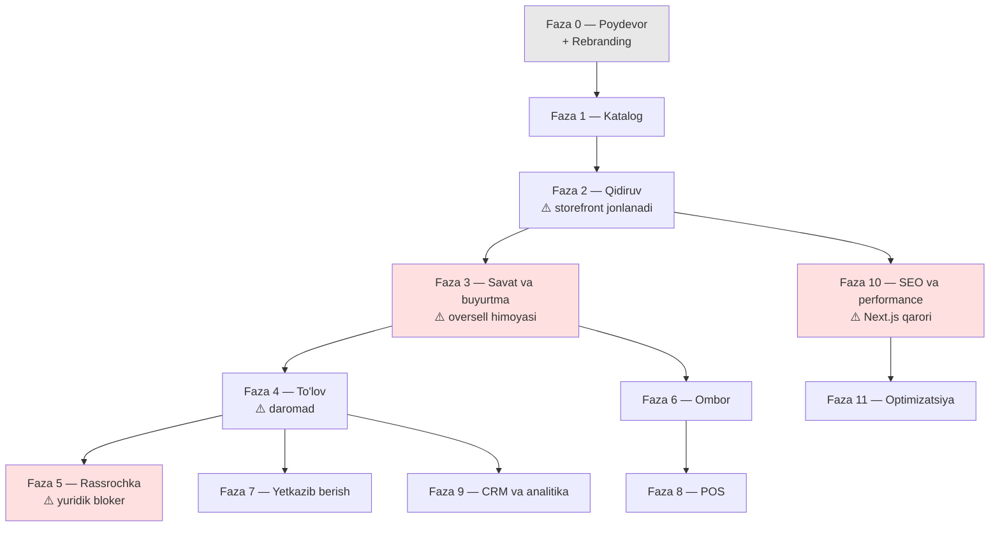

# 15. Yo'l xaritasi (roadmap)

> **Status:** qoralama (v1)
> **Bog'liq hujjatlar:** `docs/13-frontend-spec.md`, `docs/14-testing-strategy.md`,
> `docs/05-catalog-and-search.md`, `docs/06-inventory-and-reservations.md`

---

## 0. Bu hujjatning pozitsiyasi

### 0.1 ⚠️ Bu MVP emas

Loyiha maqsadi — **production darajasidagi tizim** (CANON §5: to'rt qamrov ham
tanlangan). "Tez qilib chiqaramiz, keyin tuzatamiz" — bu yerda **ishlamaydi**,
chunki:

- Oversell — bu "keyin tuzatiladigan" narsa emas. Bir marta sodir bo'lsa — mijoz
  ishonchi ketadi
- Pul mantiqi (rassrochka, ledger) — noto'g'ri bo'lsa, **yuridik oqibat**
- Ma'lumot sxemasi — keyin o'zgartirish migratsiya, migratsiya esa — real ma'lumot
  ustida qo'rqinchli

**Lekin bosqich kerak.** Sabab: hamma narsani bir vaqtda qilish — bitta odam uchun
mumkin emas, va oraliq natijasiz 6 oy ishlash — **charchash va tashlab ketish**
retsepti.

### 0.2 Bosqichlash tamoyili

Har faza quyidagi savolga javob berishi kerak: ⚠️ **"Bu faza tugagach, kim nima
qila oladi?"**

Agar javob "hech kim hech narsa" bo'lsa — bu faza noto'g'ri kesilgan.

| Faza | Tugagach kim nima qiladi                                               |
| ---- | ---------------------------------------------------------------------- |
| 0    | Dasturchi — deploy qila oladi                                          |
| 1    | ⚠️ **Kontent menejeri — katalog to'ldira oladi** (real ish boshlanadi) |
| 2    | ⚠️ **Mijoz — mahsulot topa oladi** (storefront jonlanadi)              |
| 3    | ⚠️ **Mijoz — buyurtma bera oladi**                                     |
| 4    | ⚠️ **Mijoz — pul to'lay oladi** (daromad boshlanadi)                   |
| ...  |                                                                        |

### 0.3 ⚠️ Vaqt baholari haqida — halol

⚠️ **Quyidagi barcha vaqt baholari — TAXMIN, KAFOLAT EMAS.**

Ular asosida:

- **Bir kishi**, to'liq bo'lmagan bandlik (bu asosiy ish emas)
- Real do'kon yo'q → talablar **farazga asoslangan** → qayta ishlash bo'ladi
- Yangi texnologiyalar bor (Meilisearch, Testcontainers) → o'rganish vaqti
- ⚠️ Tashqi bog'liqliklar (Click/Payme/rassrochka hujjatlari) — **nazorat qilib
  bo'lmaydi**

**Diapazon beriladi, nuqta emas.** Diapazonning yuqori chegarasi — "hammasi
yaxshi ketmasa". ⚠️ Tarixiy jihatdan dasturchilar baholarni **2-3 barobar**
past baholaydi. Bu baholarga ham shu qoida qo'llanishi mumkin.

⚠️ **Diapazon "kalendar hafta"da beriladi, "ish soati"da emas** — chunki to'liq
bo'lmagan bandlik.

---

## 1. Umumiy ko'rinish

⚠️ **Ketma-ketlik qat'iy emas.** Faza 6 (Ombor) — Faza 3 dan keyin, lekin Faza 4/5
bilan **parallel** bo'lishi mumkin (agar rassrochka yuridik bloker bo'lsa — Faza 5
kutadi, Faza 6 ketadi).

⚠️ **Faza 5 va Faza 10 — qizil.** Ular tashqi qarorga bog'liq va rejani buzishi mumkin.

---

## 2. Faza 0 — Poydevor

**Maqsad:** kod yozish mumkin bo'lgan muhit. Hech qanday biznes qiymati yo'q,
lekin busiz keyingi hamma narsa qiyin.

### 2.1 Ish doirasi

| #    | Ish                                                | Izoh                                                                  |
| ---- | -------------------------------------------------- | --------------------------------------------------------------------- |
| 0.1  | Monorepo: pnpm workspaces + Turborepo              | CANON §6 tuzilishi                                                    |
| 0.2  | ⚠️ Mavjud kodni `apps/storefront` ga ko'chirish    | Git tarixi saqlanadi (`git mv`)                                       |
| 0.3  | `packages/config` — eslint/ts/prettier             |                                                                       |
| 0.4  | `apps/api` — NestJS 11 skeleti                     |                                                                       |
| 0.5  | Docker Compose: PG 17, Redis 7, Meilisearch        | Lokal dev                                                             |
| 0.6  | ⚠️ Prisma sxema — **asosiy entity'lar** (CANON §8) | Hammasi emas, poydevor                                                |
| 0.7  | ⚠️ `Money` sinfi + property testlar                | `docs/14-...` §5.2                                                    |
| 0.8  | `identity`: auth, JWT, refresh rotatsiya           | ⚠️ Single-flight                                                      |
| 0.9  | RBAC                                               | Rol/ruxsat modeli                                                     |
| 0.10 | ⚠️ `AuditLog`                                      | ⚠️ **Boshidan.** Keyin qo'shish — barcha mutatsiyalarni qayta ko'rish |
| 0.11 | ⚠️ `OutboxEvent` + relay                           | Xuddi shunday — boshidan                                              |
| 0.12 | CI: GitHub Actions                                 | lint, typecheck, test, build                                          |
| 0.13 | Testcontainers sozlash                             | `docs/14-...` §3.2                                                    |
| 0.14 | Pino + OpenTelemetry + Prometheus                  | Kuzatuv boshidan                                                      |
| 0.15 | ⚠️ **Rebranding**                                  | Quyida alohida                                                        |

⚠️ **Nega `AuditLog` va `OutboxEvent` — Faza 0 da?** Chunki ular **kesuvchi
qatlam** (cross-cutting). Keyin qo'shilsa — 15 modulning **har bir mutatsiyasini**
qayta ko'rib chiqish kerak. Boshidan bo'lsa — har yangi kod avtomatik to'g'ri
yoziladi. Bu **arxitektura qarzini oldini olish**.

### 2.2 ⚠️ Rebranding: NORNLIGHT → Kelvin

Bu kichik, lekin **ko'rinadigan** ish. `docs/13-frontend-spec.md` §1.4(g) da
o'lchangan.

| #    | Nima                                                    | Qayerda                       | Holat                                          |
| ---- | ------------------------------------------------------- | ----------------------------- | ---------------------------------------------- |
| R-1  | `<title>lesson17</title>` → `Kelvin — Yoritish savdosi` | `index.html`                  | ⚠️ Aniqlangan                                  |
| R-2  | `"name": "lesson17"` → `@kelvin/storefront`             | `package.json`                | ⚠️ Aniqlangan                                  |
| R-3  | Favicon: `vite.svg` → Kelvin logo                       | `index.html`                  |                                                |
| R-4  | ⚠️ `<html lang="en">` → dinamik (`uz`/`uz-Cyrl`/`ru`)   | `index.html`                  | ⚠️ A11y buzilishi                              |
| R-5  | NORNLIGHT logotipi → Kelvin                             | `Navbar`, `Footer`            | ⚠️ **Faqat logo.** Layout o'zgarmaydi          |
| R-6  | ⚠️ `₽` → `UZS`                                          | ⚠️ **8 ta faylda** o'lchangan | `formatMoney()` ga markazlashtiriladi          |
| R-7  | ⚠️ Google Maps: Moskva → Toshkent                       | `Contacts`                    | Figma placeholder'i                            |
| R-8  | Kontakt: telefon, manzil → real                         | `Contacts`, `Footer`          | ⚠️ Real ma'lumot kerak                         |
| R-9  | Ijtimoiy tarmoq: VK/OK → ⚠️ **Telegram/Instagram**      | `Footer`, `ProductDetail`     | ⚠️ VK/OK — O'zbekistonda deyarli ishlatilmaydi |
| R-10 | `.DS_Store` → `.gitignore`                              |                               |                                                |
| R-11 | ⚠️ `<a href>` → `<Link>`                                | `ProductDetail`               | SPA buzilishi                                  |
| R-12 | ⚠️ README: **dizayn muallifi ko'rsatiladi**             | `README.md`                   | ⚠️ CANON §1 — majburiy                         |

⚠️ **R-9 muhim:** Figma'da `VkIcon`, `OkIcon` bor (`src/components/icons/`).
VK va Odnoklassniki — O'zbekistonda **deyarli ishlatilmaydi**. Telegram va
Instagram — asosiy kanallar. ⚠️ **Bu dizayn o'zgarishimi?** Texnik jihatdan —
ikonka almashadi, layout bir xil. **Loyiha egasi bilan kelishiladi**, lekin
Moskva xaritasini Toshkentga o'zgartirish bilan bir xil toifadagi ish.

⚠️ **Nima o'zgarmaydi:** rang, shrift, grid, layout, komponent tuzilishi.
Rebranding — **matn va logotip almashtirish**, dizayn qayta ishlash emas.

### 2.3 Tayyorlik mezoni (Definition of Done)

- [ ] `pnpm install && pnpm dev` — bitta buyruq bilan hamma ishga tushadi
- [ ] `docker compose up` — PG + Redis + Meilisearch ko'tariladi
- [ ] `apps/storefront` monorepo ichida ishlaydi (⚠️ **regressiyasiz** — barcha
      12 sahifa ochiladi)
- [ ] `apps/api` — `/health` javob beradi
- [ ] ⚠️ `Money` — property testlar yashil (`numRuns >= 10_000`)
- [ ] Login/logout/refresh ishlaydi
- [ ] ⚠️ Single-flight refresh testi yashil (10 parallel 401 → 1 refresh)
- [ ] ⚠️ Har mutatsiya `AuditLog` ga tushadi (integration test)
- [ ] ⚠️ Outbox: event yo'qolmaydi (test)
- [ ] CI yashil, < 10 min
- [ ] ⚠️ Testcontainers CI'da ishlaydi
- [ ] ⚠️ **Rebranding: R-1..R-12 bajarilgan.** `grep -r "₽"` → 0, `grep -ri "nornlight"` → 0
- [ ] README: dizayn muallifi ko'rsatilgan

### 2.4 Bog'liqliklar

Yo'q. Bu birinchi faza.

### 2.5 Xavflar

| Xavf                                            | Ta'sir                                                    |
| ----------------------------------------------- | --------------------------------------------------------- |
| ⚠️ Testcontainers CI'da sekin/beqaror           | CI vaqti oshadi. Self-hosted runner kerak bo'lishi mumkin |
| Monorepo migratsiyasi storefront'ni buzadi      | Build config, path alias                                  |
| ⚠️ Prisma sxemani boshidan to'g'ri qilish qiyin | Migratsiya keyin qimmat                                   |

### 2.6 ⚠️ Vaqt bahosi

**3–6 hafta.** ⚠️ Bu baho, kafolat emas.

Nega diapazon keng: monorepo + CI + Testcontainers + auth — bularning har biri
alohida "bir kunlik ish" ko'rinadi, lekin birlashganda konfiguratsiya do'zaxi
bo'lishi mumkin. Auth (refresh rotatsiya + single-flight) — o'zi 1 haftalik ish.

---

## 3. Faza 1 — Katalog

**Maqsad:** ⚠️ **kontent menejeri ishlay boshlaydi.** Bu birinchi real qiymat.

### 3.1 Ish doirasi

| #    | Ish                                                                                  |
| ---- | ------------------------------------------------------------------------------------ |
| 1.1  | `catalog` moduli: `Category`, `Product`, `ProductVariant`                            |
| 1.2  | ⚠️ `Attribute`, `AttributeValue`, `ProductAttribute` — **CANON §4 dagi 15+ atribut** |
| 1.3  | ⚠️ **Variant matritsasi generatori** (4×3×2 = 24 SKU)                                |
| 1.4  | `Media` + S3 yuklash (presigned URL)                                                 |
| 1.5  | BullMQ: rasm qayta ishlash (resize, avif/webp, LQIP)                                 |
| 1.6  | ⚠️ `apps/admin` skeleti: shadcn/ui + Tailwind 4, auth, RBAC, layout                  |
| 1.7  | Admin: kategoriya CRUD                                                               |
| 1.8  | ⚠️ Admin: mahsulot CRUD + variant matritsasi UI                                      |
| 1.9  | Admin: atribut boshqaruvi                                                            |
| 1.10 | Admin: media kutubxonasi                                                             |
| 1.11 | ⚠️ Kategoriyalar seed — CANON §4 dagi 11 ta (Люстры, Споты, ...)                     |
| 1.12 | ⚠️ i18n asosi: `uz` / `uz-Cyrl` / `ru` maydonlar                                     |

⚠️ **1.3 — bu fazaning eng qiymatli qismi.** 24 SKU ni qo'lda kiritish — kontent
menejeri buni **qilmaydi** (yoki qilsa — xato bilan). Generator bo'lmasa, butun
katalog to'ldirish jarayoni yiqiladi.

⚠️ **1.2 — bu loyihaning o'ziga xosligi** (CANON §4). Atributlar tizimi umumiy
bo'lishi kerak (yangi atribut qo'shish — kod yozmasdan), chunki yoritishda
atributlar ko'p va o'zgaruvchan.

### 3.2 Tayyorlik mezoni

- [ ] ⚠️ **Kontent menejeri admin panelda mahsulot qo'sha oladi** (yordamsiz)
- [ ] 24 SKU **bitta amalda** generatsiya qilinadi
- [ ] ⚠️ To'liq bo'lmagan matritsa qo'llab-quvvatlanadi (kombinatsiya o'chiriladi)
- [ ] Rasm yuklanadi → avif/webp/LQIP avtomatik generatsiya bo'ladi
- [ ] 11 ta kategoriya mavjud
- [ ] ⚠️ 15+ atribut mavjud va filtrlanadigan deb belgilangan
- [ ] Har mutatsiya `AuditLog` da
- [ ] Coverage `catalog` ≥ 75%
- [ ] ⚠️ E2E: admin mahsulot qo'shadi (E2E-4)

### 3.3 Bog'liqliklar

Faza 0.

### 3.4 Xavflar

| Xavf                                                       | Ehtimollik    | Ta'sir                           | Yumshatish                                        |
| ---------------------------------------------------------- | ------------- | -------------------------------- | ------------------------------------------------- |
| ⚠️ Atribut modeli noto'g'ri (EAV vs JSONB vs ustun)        | O'rta         | ⚠️ **Yuqori** — keyin migratsiya | ADR yoziladi, `docs/05-...` bilan kelishiladi     |
| ⚠️ Variant matritsasi UI murakkab bo'ladi                  | Yuqori        | O'rta                            | Boshida oddiy jadval                              |
| ⚠️ **Real katalog yo'q** → atributlar to'g'ri tanlanganmi? | ⚠️ **Yuqori** | O'rta                            | CANON §4 — asos. Real do'kon topilsa tekshiriladi |
| Rasm qayta ishlash sekin                                   | O'rta         | Past                             | BullMQ — async                                    |

### 3.5 ⚠️ Vaqt bahosi

**4–7 hafta.** ⚠️ Baho.

Admin panel noldan (shadcn/ui bo'lsa ham) + variant matritsasi generatori +
atribut tizimi. ⚠️ Variant matritsasi UI — eng noaniq qism, u 1 haftaga ham,
3 haftaga ham cho'zilishi mumkin.

---

## 4. Faza 2 — Qidiruv (⚠️ storefront jonlanadi)

**Maqsad:** ⚠️ **mijoz mahsulot topa oladi.** Storefront statikdan jonliga o'tadi —
bu loyihaning **eng ko'rinadigan momenti**.

### 4.1 Ish doirasi

| #    | Ish                                                                               |
| ---- | --------------------------------------------------------------------------------- |
| 2.1  | Meilisearch integratsiyasi, indeks sxemasi                                        |
| 2.2  | ⚠️ Indeksatsiya pipeline: `OutboxEvent` → BullMQ → Meilisearch                    |
| 2.3  | ⚠️ Faceted search API + **facet count**                                           |
| 2.4  | ⚠️ **ADR: Meilisearch vs PostgreSQL GIN** — o'lchov bilan (CANON §9.1)            |
| 2.5  | `packages/contracts`: OpenAPI → tiplar + zod                                      |
| 2.6  | ⚠️ **storefront: TypeScript migratsiyasi** (`allowJs`, bosqichma-bosqich)         |
| 2.7  | ⚠️ **storefront: `Outlet` tuzatish** (`docs/13-...` §3.3)                         |
| 2.8  | storefront: `ThemeProvider` (ranglar bir manbadan)                                |
| 2.9  | storefront: TanStack Query + API client                                           |
| 2.10 | ⚠️ **storefront: hardcode ma'lumotni API'ga almashtirish** — 12 sahifa            |
| 2.11 | ⚠️ **Faceted search UI** (`docs/13-...` §4) — eng murakkab ekran                  |
| 2.12 | ⚠️ URL sinxronizatsiyasi (filtrlar `useSearchParams` da)                          |
| 2.13 | ⚠️ **Mahsulot sahifasi** — variant tanlash, velosiped atributlarini olib tashlash |
| 2.14 | ⚠️ i18n: `react-i18next`, matn ajratish, 3 til                                    |
| 2.15 | Rasm: `srcset`, lazy, LQIP                                                        |
| 2.16 | ⚠️ RUM (`web-vitals`) — real o'lchov boshlanadi                                   |

⚠️ **2.10 — bu katta va zerikarli ish.** 12 sahifadagi hardcode massivlarni
API'ga ulash. Har sahifada: loading, error, empty state qo'shiladi (hozir ular
umuman yo'q).

⚠️ **2.13 — `docs/13-...` §1.4(a):** `ProductDetail` da **velosiped atributlari**
bor (Диаметр колеса 27.5, Рама Карбон, Вилка Rock Shox). Ular butunlay
almashtiriladi.

⚠️ **2.6 — TypeScript migratsiyasi.** `packages/contracts` TS tiplar beradi,
`.jsx` fayl ulardan foyda ko'rmaydi. Bosqichma-bosqich: yangi kod `.tsx`,
sahifalar birma-bir, `.styled.js` — oxirida.

### 4.2 Tayyorlik mezoni

- [ ] ⚠️ **Storefront'da hardcode massiv — 0 ta** (`grep`)
- [ ] ⚠️ `ProductDetail` da velosiped atributlari — **yo'q**
- [ ] 15+ atribut bo'yicha filtr ishlaydi
- [ ] ⚠️ Facet count to'g'ri (guruh ichida OR, guruhlar orasida AND)
- [ ] ⚠️ Filtr URL'da: refresh/share/back ishlaydi
- [ ] Mobil drawer: focus trap, `Escape`
- [ ] ⚠️ Variant tanlash: mavjud bo'lmagan kombinatsiya `disabled`
- [ ] Uch til ishlaydi, ⚠️ layout buzilmaydi (vizual regressiya)
- [ ] ⚠️ `Navbar` navigatsiyada qayta mount **bo'lmaydi**
- [ ] ⚠️ ADR yozilgan: Meilisearch vs PostgreSQL — **o'lchov raqamlari bilan**
- [ ] E2E-3 (qidiruv + filtr) yashil
- [ ] ⚠️ RUM ma'lumot yig'a boshladi
- [ ] ⚠️ Indeksatsiya lag < 5s (o'lchanadi)

### 4.3 Bog'liqliklar

Faza 1 (katalog bo'lmasa — qidiradigan narsa yo'q).

### 4.4 Xavflar

| Xavf                                           | Ehtimollik | Ta'sir | Yumshatish                                         |
| ---------------------------------------------- | ---------- | ------ | -------------------------------------------------- |
| ⚠️ **Facet count semantikasi noto'g'ri**       | ⚠️ Yuqori  | Yuqori | Integration test, `docs/05-...`                    |
| ⚠️ Meilisearch indeksatsiya lag                | O'rta      | O'rta  | Kritik o'zgarish (narx/qoldiq) → sinxron yangilash |
| ⚠️ **TypeScript migratsiyasi cho'ziladi**      | ⚠️ Yuqori  | O'rta  | `allowJs`, majburiy emas                           |
| ⚠️ **i18n layout buzadi** (`docs/13-...` §7.4) | ⚠️ Yuqori  | O'rta  | Pseudo-lokalizatsiya, qisqa muqobil matn           |
| Meilisearch yetarli emas → PG'ga qaytish       | Past       | Yuqori | ADR o'lchov bilan, abstraksiya qatlami             |

### 4.5 ⚠️ Vaqt bahosi

**6–10 hafta.** ⚠️ Baho. **Bu eng katta fazalardan biri.**

Sabab: uchta katta ish birlashadi — (a) Meilisearch + facet, (b) TypeScript
migratsiyasi, (c) 12 sahifani API'ga ulash + i18n. ⚠️ Har biri alohida 2-3 hafta.

---

## 5. Faza 3 — Savat va buyurtma (⚠️ oversell himoyasi)

**Maqsad:** ⚠️ **mijoz buyurtma bera oladi.** Bu — loyihaning **eng nozik fazasi**.

### 5.1 Ish doirasi

| #    | Ish                                                           |
| ---- | ------------------------------------------------------------- |
| 3.1  | `cart` moduli: `Cart`, `CartItem`                             |
| 3.2  | ⚠️ Mehmon savati (localStorage) + Zustand                     |
| 3.3  | ⚠️ **Savat birlashtirish + konflikt** (`max` strategiya)      |
| 3.4  | ⚠️ **`inventory`: `StockItem`, `StockReservation`**           |
| 3.5  | ⚠️ **Oversell himoyasi: lock strategiyasi** → `docs/06-...`   |
| 3.6  | ⚠️ Rezerv TTL + bo'shatish job                                |
| 3.7  | ⚠️ **Concurrency test: 100 parallel, 1 tovar → 1**            |
| 3.8  | `pricing` moduli: narx, chegirma, bundle                      |
| 3.9  | ⚠️ Narx dvigateli determinizm property testi                  |
| 3.10 | `order`: `Order`, `OrderItem`, `OrderStatusHistory`           |
| 3.11 | ⚠️ **Buyurtma holat mashinasi**                               |
| 3.12 | ⚠️ **Saga:** rezerv ↔ buyurtma ↔ kompensatsiya                |
| 3.13 | Checkout UI: react-hook-form + zod, ko'p bosqichli            |
| 3.14 | Admin: buyurtma ro'yxati, kartochka, holat o'zgartirish       |
| 3.15 | Notification: SMS (Eskiz) + Telegram — buyurtma qabul qilindi |

⚠️ **3.5 va 3.7 — bu fazaning yuragi.** CANON §9.2: _"bu loyihaning eng nozik
joyi"_. Agar bu noto'g'ri qilinsa — qolgan hamma narsa ahamiyatsiz.

⚠️ **Muhim tartib:** oldin **DB constraint** (`CHECK (quantity >= 0)`), keyin
kod. `docs/14-...` §4.3: haqiqiy kafolat — constraint, test emas.

### 5.2 Tayyorlik mezoni

- [ ] ⚠️ **Concurrency test yashil: 100 parallel, 1 tovar → aniq 1 muvaffaqiyat**
- [ ] ⚠️ Rad etilganlar **to'g'ri sabab** bilan (`InsufficientStockError`, deadlock emas)
- [ ] ⚠️ **DB constraint mavjud:** qoldiq manfiy bo'la olmaydi
- [ ] ⚠️ Property test: qoldiq hech qachon manfiy emas
- [ ] Rezerv TTL tugagach bo'shatiladi, tovar qayta sotiladi
- [ ] Mehmon savati refresh'dan keyin saqlanadi
- [ ] ⚠️ Login'da savat birlashadi, konflikt **ko'rsatiladi** (jim emas)
- [ ] ⚠️ Bir savat, ikki tab, parallel checkout → **1 ta buyurtma**
- [ ] ⚠️ Holat mashinasi: barcha noto'g'ri o'tishlar bloklanadi (property)
- [ ] ⚠️ Narx determinizmi property testi yashil
- [ ] E2E-1, E2E-2 yashil (⚠️ to'lovsiz — Faza 4 da)
- [ ] SMS + Telegram xabari yetib boradi
- [ ] ⚠️ Coverage: `inventory` ≥ 90%, `pricing` ≥ 90%
- [ ] ⚠️ Mutation score: `pricing`, `inventory` ≥ 85%

### 5.3 Bog'liqliklar

Faza 2.

### 5.4 Xavflar

| Xavf                                       | Ehtimollik | Ta'sir                                      | Yumshatish                                       |
| ------------------------------------------ | ---------- | ------------------------------------------- | ------------------------------------------------ |
| ⚠️ **Oversell prod'da sodir bo'ladi**      | O'rta      | ⚠️ **Juda yuqori** — ishonch, pul qaytarish | DB constraint + concurrency test + nightly ×1000 |
| ⚠️ Lock deadlock → checkout yiqiladi       | O'rta      | Yuqori                                      | Bir xil tartibda lock, timeout, retry            |
| ⚠️ Lock performance'ni o'ldiradi (aksiya)  | ⚠️ Yuqori  | Yuqori                                      | Load test (aksiya ssenariysi)                    |
| ⚠️ **Saga kompensatsiyasi to'liq emas**    | Yuqori     | Yuqori                                      | Har qadam uchun kompensatsiya + test             |
| Rezerv TTL noto'g'ri (juda qisqa/uzun)     | O'rta      | O'rta                                       | ⚠️ Konfiguratsiya, real ma'lumot bilan sozlanadi |
| ⚠️ Savat merge foydalanuvchini chalg'itadi | O'rta      | Past                                        | Konflikt aniq ko'rsatiladi                       |

### 5.5 ⚠️ Vaqt bahosi

**5–9 hafta.** ⚠️ Baho.

⚠️ **Diapazon keng, chunki:** oversell himoyasi — bu "yozib qo'yiladigan" kod
emas, bu **tadqiqot**. Lock strategiyasini tanlash, o'lchash, race testini
barqaror qilish. ⚠️ Bu 1 haftaga ham, 4 haftaga ham cho'zilishi mumkin — oldindan
aytib bo'lmaydi.

---

## 6. Faza 4 — To'lov (⚠️ daromad boshlanadi)

**Maqsad:** ⚠️ **mijoz pul to'lay oladi.**

### 6.1 Ish doirasi

| #    | Ish                                                                |
| ---- | ------------------------------------------------------------------ |
| 4.1  | ⚠️ `payment`: `Payment`, `PaymentAttempt`, `LedgerEntry`, `Refund` |
| 4.2  | ⚠️ **Ledger** — ikki yozuvli (double-entry)                        |
| 4.3  | ⚠️ **Click integratsiyasi** — ⚠️ rasmiy hujjatdan                  |
| 4.4  | ⚠️ **Payme integratsiyasi** — ⚠️ rasmiy hujjatdan                  |
| 4.5  | Uzum (⚠️ ehtimol Faza 4.5 ga suriladi)                             |
| 4.6  | ⚠️ **Webhook idempotentligi**                                      |
| 4.7  | ⚠️ Saga: to'lov ↔ rezerv (to'landi, tovar tugadi → kompensatsiya)  |
| 4.8  | Refund oqimi                                                       |
| 4.9  | Checkout: to'lov bosqichi UI                                       |
| 4.10 | Admin: to'lovlar, refund                                           |
| 4.11 | ⚠️ Naqd to'lov (kuryerga)                                          |

⚠️ **4.2 — Ledger.** Nega ikki yozuvli: har pul harakati ikki tomonlama yoziladi
va **balans har doim nolga teng**. Bu **invariant** — u buzilsa, xato **darhol**
ko'rinadi. Bir yozuvli tizimda xato **oylab yashirinadi**.

⚠️ **4.6 — Idempotentlik.** Click/Payme webhook'lari **bir necha marta keladi**
(bu ularning normal xulqi). Idempotentlik bo'lmasa — mijoz hisobiga **ikki marta**
yoziladi.

### 6.2 ⚠️ Ochiq bloker

⚠️ **Click/Payme API detallari NOMA'LUM** (CANON §6, §10). Ular **to'qib
chiqarilmaydi**.

**Kerak:**

- Rasmiy integratsiya hujjati
- Sandbox/test muhiti (⚠️ mavjudligi tekshirilmagan — `docs/14-...` §13 №1)
- Merchant akkaunt (⚠️ **yuridik shaxs kerak bo'lishi mumkin**)

⚠️ **Bu ish boshlanishidan oldin hal qilinishi kerak.**

### 6.3 Tayyorlik mezoni

- [ ] ⚠️ Mijoz Click orqali real to'lov qila oladi
- [ ] ⚠️ Payme ham
- [ ] ⚠️ **Webhook 2 marta kelsa → 1 ta `Payment`** (test)
- [ ] ⚠️ **Ledger balansi = 0** (invariant testi)
- [ ] ⚠️ Saga: to'lov o'tdi + tovar yo'q → **avtomatik refund** + xabar
- [ ] Refund ishlaydi va ledger'da aks etadi
- [ ] ⚠️ E2E-1, E2E-2 **to'lov bilan** (sandbox)
- [ ] Coverage `payment` ≥ 90%
- [ ] ⚠️ Barcha pul `BigInt` tiyinda (code review + tip)

### 6.4 Bog'liqliklar

Faza 3. ⚠️ **+ tashqi:** Click/Payme hujjati, merchant akkaunt.

### 6.5 Xavflar

| Xavf                                                | Ehtimollik | Ta'sir                       | Yumshatish                          |
| --------------------------------------------------- | ---------- | ---------------------------- | ----------------------------------- |
| ⚠️ **Click/Payme hujjati olinmaydi / sandbox yo'q** | ⚠️ O'rta   | ⚠️ **Bloker**                | Erta so'rash. Mock provayder        |
| ⚠️ **Merchant akkaunt yuridik shaxs talab qiladi**  | ⚠️ Yuqori  | ⚠️ **Bloker**                | ⚠️ **Yurist savoli.** Erta aniqlash |
| Webhook idempotentligi buziladi                     | O'rta      | ⚠️ Yuqori — ikki marta hisob | Test + `UNIQUE` constraint          |
| ⚠️ Ledger modeli noto'g'ri                          | O'rta      | Yuqori                       | ADR, invariant testi                |
| To'lov o'tdi, tovar yo'q                            | O'rta      | Yuqori                       | Saga + avtomatik refund             |

### 6.6 ⚠️ Vaqt bahosi

**4–8 hafta.** ⚠️ Baho.

⚠️ **Diapazon tashqi omilga bog'liq:** agar hujjat va sandbox tayyor bo'lsa —
4 hafta. Agar merchant akkaunt uchun yuridik jarayon kerak bo'lsa — ⚠️ **bu
haftalar emas, oylar** bo'lishi mumkin va **bizga bog'liq emas**.

---

## 7. Faza 5 — Rassrochka (⚠️ YURIDIK BLOKER)

**Maqsad:** mijoz bo'lib to'lay oladi. CANON §5: **O'zbekistonda kritik**.

### 7.1 ⚠️ Nega bu alohida va qizil

⚠️ **Bu faza texnik emas, birinchi navbatda yuridik.**

| Noma'lum                                              | Kim javob beradi                                                 |
| ----------------------------------------------------- | ---------------------------------------------------------------- |
| ⚠️ Qaysi provayder? (Uzum Nasiya, Alif, Intend...)    | Loyiha egasi (biznes)                                            |
| ⚠️ API detallari?                                     | ⚠️ **Provayder rasmiy hujjati** — CANON §6: to'qib chiqarilmaydi |
| ⚠️ Foiz stavkasi, jarima formulasi?                   | Provayder + shartnoma                                            |
| ⚠️ Shartnoma yuridik shaxs talab qiladimi?            | ⚠️ **Yurist**                                                    |
| ⚠️ Kredit risk kimda — do'konda yoki provayderda?     | ⚠️ **Yurist + biznes**                                           |
| ⚠️ Mijoz ma'lumotini provayderga uzatish — qonuniymi? | ⚠️ **Yurist** (shaxsiy ma'lumot qonuni)                          |
| ⚠️ Fiskal chek talabi?                                | ⚠️ **Yurist / soliq**                                            |

⚠️ **Xulosa: bu faza dasturchi qaroriga bog'liq emas.**

### 7.2 Ish doirasi (⚠️ ma'lumot kelgach)

| #   | Ish                                              |
| --- | ------------------------------------------------ |
| 5.1 | ⚠️ `Installment`, `InstallmentSchedule`          |
| 5.2 | ⚠️ **Grafik hisobi** — `Money.allocate()` ustida |
| 5.3 | ⚠️ Property test: `sum(principal) === asl summa` |
| 5.4 | ⚠️ Provayder integratsiyasi — ⚠️ hujjatdan       |
| 5.5 | Checkout: rassrochka tanlash + grafik ko'rsatish |
| 5.6 | Admin: grafik, to'lov holati, kechikish          |
| 5.7 | Kechikish xabari (SMS/Telegram)                  |
| 5.8 | ⚠️ Mutation testing (`installment` ≥ 85%)        |

⚠️ **5.2 — grafik hisobi bizniki va u HOZIR qilinishi mumkin** (provayder
noma'lum bo'lsa ham). `Money.allocate()` allaqachon Faza 0 da yozilgan.
⚠️ **Lekin foiz formulasi noma'lum** → struktura yoziladi, raqamlar keyin.

### 7.3 Tayyorlik mezoni

- [ ] ⚠️ **`sum(principal) === asl summa`** — property test, `numRuns >= 10_000`
- [ ] ⚠️ Sana chegaralari: 31-yanvar + 1 oy → to'g'ri
- [ ] Mijoz checkout'da grafikni ko'radi
- [ ] ⚠️ Grafik **serverda** hisoblanadi (frontend hech qachon o'zi hisoblamaydi)
- [ ] ⚠️ Provayder integratsiyasi ishlaydi (sandbox)
- [ ] Admin kechikishni ko'radi
- [ ] ⚠️ Mutation score ≥ 85%
- [ ] ⚠️ **Yurist tasdig'i olingan** (shartnoma, ma'lumot uzatish)

### 7.4 Bog'liqliklar

Faza 4. ⚠️ **+ yuridik: provayder shartnomasi, yurist xulosasi.**

### 7.5 Xavflar

| Xavf                                            | Ehtimollik    | Ta'sir                    | Yumshatish                                       |
| ----------------------------------------------- | ------------- | ------------------------- | ------------------------------------------------ |
| ⚠️ **Yuridik bloker: shartnoma tuzilmaydi**     | ⚠️ **Yuqori** | ⚠️ **Faza bekor bo'ladi** | ⚠️ **Erta aniqlash.** Faza 4 da so'rash          |
| ⚠️ Provayder API yopiq / hamkorlik talab qiladi | O'rta         | Yuqori                    | Boshida — **qo'lda** rassrochka (admin kiritadi) |
| ⚠️ 1 tiyin xatosi → shartnoma nizosi            | Past          | ⚠️ **Juda yuqori**        | Property test + mutation                         |
| Foiz/jarima noto'g'ri                           | O'rta         | Yuqori                    | ⚠️ Hujjatdan, taxmindan emas                     |

⚠️ **Zaxira reja:** agar provayder integratsiyasi imkonsiz bo'lsa — **qo'lda
rejim**: mijoz rassrochka so'raydi → admin qo'lda tasdiqlaydi → grafik tizimda
yuritiladi. Bu **ishlaydi**, faqat qo'lda. Bu qabul qilinadigan zaxira.

### 7.6 ⚠️ Vaqt bahosi

⚠️ **Texnik qism: 3–5 hafta.** Yuridik qism: **noma'lum**.

⚠️ **Halol:** yuridik jarayon **haftalar yoki oylar** bo'lishi mumkin va **bizga
bog'liq emas**. Reja bu fazani **bloklanadigan** deb belgilaydi.

---

## 8. Faza 6 — Ombor

**Maqsad:** ombor xodimi ishlay oladi. CANON §5.2.

### 8.1 Ish doirasi

| #   | Ish                                                             |
| --- | --------------------------------------------------------------- |
| 6.1 | `Warehouse` — ⚠️ ko'p ombor                                     |
| 6.2 | `StockMovement` — har harakat                                   |
| 6.3 | `procurement`: `Supplier`, `PurchaseOrder`, `PurchaseOrderItem` |
| 6.4 | Kirim (qabul)                                                   |
| 6.5 | ⚠️ `Inventory` — inventarizatsiya                               |
| 6.6 | Shtrix-kod (skaner)                                             |
| 6.7 | Picking (yig'ish varaqasi)                                      |
| 6.8 | ⚠️ **Ombor tanlash mantiqi** (buyurtma qaysi ombordan)          |
| 6.9 | Admin: barcha ombor ekranlari                                   |

⚠️ **6.8 — kutilmagan murakkablik:** buyurtmada 3 ta tovar, ular **turli
omborlarda**. Nima qilish kerak?

- Bitta ombordan yuborish (yetmasa — bo'lib yuborish)
- ⚠️ Bo'lib yuborish → **ikki yetkazib berish** → xarajat
- ⚠️ Yoki omborlar orasida ko'chirish → kechikish

Bu **biznes qarori**, texnik emas. ⚠️ **Ochiq savol.**

### 8.2 Tayyorlik mezoni

- [ ] Ko'p ombor: qoldiq har omborda alohida
- [ ] ⚠️ Rezerv **ombor darajasida** ishlaydi
- [ ] Kirim → qoldiq oshadi → `StockMovement`
- [ ] ⚠️ Inventarizatsiya: farq aniqlanadi, `StockMovement` yoziladi
- [ ] ⚠️ **Inventarizatsiya paytida sotuv → qoldiq mos qoladi** (concurrency test)
- [ ] Shtrix-kod bilan qidiruv
- [ ] Picking varaqasi chiqadi
- [ ] Coverage `inventory` ≥ 90% (saqlanadi)

### 8.3 Bog'liqliklar

Faza 3 (rezerv modeli). ⚠️ Faza 4/5 bilan **parallel** bo'lishi mumkin.

### 8.4 Xavflar

| Xavf                                              | Ehtimollik | Ta'sir        | Yumshatish                                           |
| ------------------------------------------------- | ---------- | ------------- | ---------------------------------------------------- |
| ⚠️ Ko'p ombor rezerv mantiqini murakkablashtiradi | ⚠️ Yuqori  | Yuqori        | Faza 3 da **boshidan** `warehouseId` bilan modellash |
| ⚠️ Inventarizatsiya + sotuv race                  | O'rta      | Yuqori        | Concurrency test                                     |
| ⚠️ **1C integratsiyasi kerak bo'ladi**            | ⚠️ O'rta   | ⚠️ **Yuqori** | ⚠️ Ochiq savol. Katta ish                            |
| Shtrix-kod skaneri apparati                       | O'rta      | Past          | Klaviatura emulyatsiyasi (odatiy)                    |

⚠️ **Muhim:** `warehouseId` **Faza 3 da** modelga kiritiladi (bitta ombor bo'lsa
ham). Keyin qo'shish — rezerv mantiqini qayta yozish demak.

### 8.5 ⚠️ Vaqt bahosi

**4–7 hafta.** ⚠️ Baho.

---

## 9. Faza 7 — Yetkazib berish

**Maqsad:** kuryer va o'rnatuvchi ishlay oladi. CANON §5.3.

### 9.1 Ish doirasi

| #   | Ish                                                               |
| --- | ----------------------------------------------------------------- |
| 7.1 | `DeliveryZone` — Toshkent zonalari                                |
| 7.2 | `DeliverySlot` — kalendar, sig'im                                 |
| 7.3 | `Shipment`, `Courier`                                             |
| 7.4 | ⚠️ `InstallationJob` — elektrik (CANON §4.6)                      |
| 7.5 | ⚠️ **Marshrut** — ⚠️ boshida **qo'lda tayinlash**                 |
| 7.6 | Mijoz: kuzatuv                                                    |
| 7.7 | SMS/Telegram: holat o'zgarishi                                    |
| 7.8 | Admin: kalendar, tayinlash                                        |
| 7.9 | ⚠️ **Mo'rtlik** (CANON §4.5): qadoqlash belgisi, sinish qaytarish |

⚠️ **7.5 — CANON §9.8:** VRP (Vehicle Routing Problem) — **NP-qiyin**.
⚠️ **Boshida optimizatsiya QILINMAYDI.** Dispetcher qo'lda tayinlaydi. Bu
**ishlaydi** (5-10 buyurtma/kun uchun qo'lda tayinlash — 10 daqiqalik ish).

⚠️ Optimizatsiya — **Faza 11**, va **faqat real ma'lumot** bo'lsa. Optimizatsiyani
erta qilish — **klassik xato**: real cheklovlar (trafik, mijoz vaqti, mashina
sig'imi) ma'lum bo'lmasdan optimallashtirish — bo'sh ish.

### 9.2 Tayyorlik mezoni

- [ ] Mijoz slot tanlaydi, band slot ko'rinmaydi
- [ ] ⚠️ Slot sig'imi: ortiqcha band qilinmaydi (concurrency)
- [ ] Yetkazib berish narxi zonaga qarab
- [ ] Kuryer tayinlanadi (qo'lda)
- [ ] O'rnatish alohida ish sifatida
- [ ] Mijoz kuzatadi, SMS keladi
- [ ] E2E-6 yashil

### 9.3 Bog'liqliklar

Faza 4.

### 9.4 Xavflar

| Xavf                                                | Ehtimollik | Ta'sir | Yumshatish                             |
| --------------------------------------------------- | ---------- | ------ | -------------------------------------- |
| ⚠️ **Zonalar/tariflar noma'lum** (real do'kon yo'q) | ⚠️ Yuqori  | O'rta  | Konfiguratsiya qilinadigan             |
| ⚠️ Marshrut optimizatsiyasiga erta kirishish        | O'rta      | O'rta  | ⚠️ **Qat'iy: qo'lda**                  |
| Kuryer mobil ilovasi kerak bo'ladi                  | O'rta      | Yuqori | ⚠️ Ochiq savol. Boshida — Telegram bot |
| ⚠️ O'rnatuvchi brigadasi jadvali murakkab           | O'rta      | O'rta  | Boshida oddiy                          |

### 9.5 ⚠️ Vaqt bahosi

**4–7 hafta.** ⚠️ Baho.

---

## 10. Faza 8 — POS

**Maqsad:** offline do'konda sotish. CANON §5.4.

### 10.1 Ish doirasi

| #   | Ish                                                            |
| --- | -------------------------------------------------------------- |
| 8.1 | `PosShift` — smena ochish/yopish                               |
| 8.2 | `PosTransaction`                                               |
| 8.3 | POS UI (⚠️ `apps/admin` ichida yoki alohida — **ochiq savol**) |
| 8.4 | Naqd, karta (UzCard/Humo)                                      |
| 8.5 | ⚠️ **Offline rejim**                                           |
| 8.6 | Sotuvchi, komissiya                                            |
| 8.7 | ⚠️ **Fiskal chek** — ⚠️ yuridik                                |

⚠️ **8.5 — offline rejim eng murakkab:** internet uzilsa, kassa **ishlashda davom
etishi** kerak. Bu:

- Lokal ma'lumot (IndexedDB)
- ⚠️ **Sinxronizatsiya konflikti** — offline sotilgan tovar onlayn ham sotilgan
- ⚠️ **Bu oversell muammosining eng qiyin versiyasi** — chunki lock qilib bo'lmaydi

⚠️ **Halol:** to'liq offline oversell himoyasi — **mumkin emas**. Yechim:
offline rejimda **faqat do'kondagi qoldiqdan** sotish, va bu qoldiq onlayn
savdodan **ajratilgan** bo'lishi (alohida "do'kon zali" ombori). Bu texnik yechim
emas — **biznes yechimi**.

⚠️ **8.7 — fiskal chek:** O'zbekistonda onlayn nazorat-kassa apparati (ONKA)
talabi bor. ⚠️ **Bu yurist va soliq savoli.** To'qib chiqarilmaydi.

### 10.2 Tayyorlik mezoni

- [ ] Smena ochiladi/yopiladi, naqd hisobi to'g'ri
- [ ] E2E-5 yashil
- [ ] ⚠️ Offline: internet uzilsa sotuv davom etadi
- [ ] ⚠️ Onlayn qaytgach sinxronizatsiya, konflikt hal qilinadi
- [ ] ⚠️ Parallel POS sotuv (2 kassa, 1 tovar) → 1 ta o'tadi
- [ ] Komissiya hisoblanadi
- [ ] ⚠️ Fiskal chek — ⚠️ **yuridik talab aniqlangan**

### 10.3 Bog'liqliklar

Faza 6 (ombor), Faza 4 (to'lov).

### 10.4 Xavflar

| Xavf                                      | Ehtimollik | Ta'sir        | Yumshatish                              |
| ----------------------------------------- | ---------- | ------------- | --------------------------------------- |
| ⚠️ **Offline sinxronizatsiya konflikti**  | ⚠️ Yuqori  | Yuqori        | ⚠️ Ajratilgan "zal" ombori              |
| ⚠️ **Fiskal chek — yuridik talab**        | ⚠️ Yuqori  | ⚠️ **Bloker** | ⚠️ **Yurist.** Erta aniqlash            |
| Apparat (kassa, printer, skaner)          | O'rta      | O'rta         | ⚠️ Real apparat kerak — test qilinmaydi |
| ⚠️ Real do'kon yo'q → POS talablari faraz | ⚠️ Yuqori  | Yuqori        | ⚠️ Ochiq                                |

### 10.5 ⚠️ Vaqt bahosi

**5–9 hafta.** ⚠️ Baho. ⚠️ Offline rejim — eng noaniq qism.

---

## 11. Faza 9 — CRM va analitika

**Maqsad:** biznes qaror qabul qila oladi. CANON §5.4.

### 11.1 Ish doirasi

| #   | Ish                                       |
| --- | ----------------------------------------- |
| 9.1 | `Customer`, `Address`, `CustomerSegment`  |
| 9.2 | `Lead` — lid, voronka                     |
| 9.3 | ⚠️ **RFM segmentatsiya**                  |
| 9.4 | `review`: sharh, savol-javob, moderatsiya |
| 9.5 | `content`: blog, sahifa, banner           |
| 9.6 | `analytics`: hisobotlar                   |
| 9.7 | ⚠️ **ABC tahlil**                         |
| 9.8 | Dashboard (⚠️ **minimal**)                |
| 9.9 | ⚠️ Hisobot eksport (BullMQ job)           |

⚠️ **9.3 — RFM** (Recency, Frequency, Monetary): mijozlarni sotib olish
xulqi bo'yicha segmentlash. Bu **standart metodika**, o'ylab topilmagan.

⚠️ **9.7 — ABC tahlil:** tovarlarni aylanma bo'yicha A/B/C ga bo'lish
(Pareto). Bu ham standart. ⚠️ **Lekin real sotuv ma'lumoti kerak** — Faza 4
dan keyin kamida bir necha oy.

⚠️ **9.8 — dashboard minimal.** `docs/13-...` §11.6: dashboard — eng ko'p vaqt
yeydigan, eng kam ishlatiladigan ekran.

### 11.2 Tayyorlik mezoni

- [ ] Mijoz bazasi, tarix
- [ ] Lid voronkasi
- [ ] RFM segmentlar hisoblanadi (⚠️ **real ma'lumot ustida**)
- [ ] Sharh: faqat sotib olgan mijoz, moderatsiya
- [ ] Blog CRUD
- [ ] Asosiy hisobotlar
- [ ] ⚠️ Og'ir hisobot — job orqali

### 11.3 Bog'liqliklar

Faza 4. ⚠️ **RFM/ABC — real sotuv tarixi kerak.**

### 11.4 Xavflar

| Xavf                                        | Ehtimollik    | Ta'sir | Yumshatish                 |
| ------------------------------------------- | ------------- | ------ | -------------------------- |
| ⚠️ **Ma'lumot yo'q → analitika ma'nosiz**   | ⚠️ **Yuqori** | O'rta  | ⚠️ Faza 4 dan keyin kutish |
| ⚠️ Dashboard cheksiz kengayadi              | Yuqori        | O'rta  | ⚠️ Minimal, keyin qo'shish |
| ⚠️ Og'ir hisobot prod DB'ni sekinlashtiradi | O'rta         | Yuqori | Read replica yoki job      |
| ⚠️ Shaxsiy ma'lumot qonuni                  | O'rta         | Yuqori | ⚠️ **Yurist**              |

### 11.5 ⚠️ Vaqt bahosi

**4–7 hafta.** ⚠️ Baho.

---

## 12. Faza 10 — SEO va performance (⚠️ NEXT.JS QARORI)

**Maqsad:** ⚠️ **organik trafik.** `docs/13-frontend-spec.md` §6 — to'liq tahlil.

### 12.1 ⚠️ Bu fazaning markazi: qaror

⚠️ **`docs/13-...` §6.4:** uch variant — (a) prerender, (b) Vite SSR,
(c) Next.js. Tavsiya — **(b) Vite SSR**. ⚠️ **Lekin qaror loyiha egasiniki.**

⚠️ **Bu faza shu qadar kech turishi — bu O'ZI XAVF** (§14, R-3).

### 12.2 Ish doirasi

| #     | Ish                                                                   |
| ----- | --------------------------------------------------------------------- |
| 10.1  | ⚠️ **Qaror: SPA+prerender / Vite SSR / Next.js**                      |
| 10.2  | Implementatsiya (qarorga qarab)                                       |
| 10.3  | ⚠️ Meta, OG, JSON-LD (`Product`, `AggregateRating`, `BreadcrumbList`) |
| 10.4  | `sitemap.xml` (dinamik), `robots.txt`                                 |
| 10.5  | ⚠️ `hreflang` — 3 til                                                 |
| 10.6  | ⚠️ Canonical — faceted URL'lar uchun                                  |
| 10.7  | Core Web Vitals optimizatsiyasi                                       |
| 10.8  | ⚠️ **styled-components runtime o'lchash** (`docs/13-...` §10.4)       |
| 10.9  | Bundle: `size-limit` byudjeti                                         |
| 10.10 | ⚠️ Google Fonts `@import` → `preload`/self-host                       |
| 10.11 | Lighthouse CI                                                         |

⚠️ **10.6 — canonical muhim:** faceted search **cheksiz URL** yaratadi
(`?ct=2700&ip=IP44&...`). Google buni **duplicate content** deb ko'radi va
**crawl byudjetini** yeydi. Qaysi filtr kombinatsiyasi indekslanadi, qaysi
`noindex` — bu **SEO strategiyasi**. ⚠️ **Ochiq savol.**

⚠️ **10.10 — arzon yutuq:** `src/index.css` da Google Fonts `@import` —
**render-blocking**. Bu LCP'ga to'g'ridan-to'g'ri zarar. Self-host yoki
`<link rel="preload">` — bir soatlik ish, o'lchanadigan foyda.

### 12.3 Tayyorlik mezoni

- [ ] ⚠️ **Qaror qabul qilingan va ADR yozilgan**
- [ ] ⚠️ Mahsulot sahifasi HTML'da kontent bilan keladi (`curl` bilan tekshiriladi)
- [ ] ⚠️ **Telegram'da havola preview ko'rsatadi**
- [ ] JSON-LD to'g'ri (Google Rich Results Test)
- [ ] Sitemap dinamik, 3 til
- [ ] ⚠️ Canonical strategiyasi belgilangan
- [ ] LCP ≤ 2.5s, INP ≤ 200ms, CLS ≤ 0.1 (⚠️ **p75, RUM'da**)
- [ ] Initial JS ≤ 180 KB gzip
- [ ] ⚠️ styled-components runtime **o'lchangan** (faraz emas)
- [ ] Google Search Console: indeksatsiya tasdiqlangan

⚠️ **"Telegram preview" — bu eng oddiy va eng aniq test.** O'zbekistonda Telegram
asosiy kanal (`docs/13-...` §6.1).

### 12.4 Bog'liqliklar

Faza 2 (storefront jonli). ⚠️ **Amalda: qanchalik kech — shunchalik qimmat.**

### 12.5 Xavflar

| Xavf                                                        | Ehtimollik    | Ta'sir        | Yumshatish                                               |
| ----------------------------------------------------------- | ------------- | ------------- | -------------------------------------------------------- |
| ⚠️ **Migratsiya kutilganidan qimmat**                       | ⚠️ **Yuqori** | ⚠️ **Yuqori** | ⚠️ **Faza 0 dan SSR-ga tayyor kod** (`docs/13-...` §6.5) |
| ⚠️ Next.js + styled-components = `"use client"` hamma joyda | ⚠️ Yuqori     | Yuqori        | ⚠️ Shuning uchun (b) tavsiya                             |
| ⚠️ SSR hydration xatolari                                   | Yuqori        | O'rta         | Erta test                                                |
| ⚠️ Vike ekotizimi kichik                                    | O'rta         | O'rta         | ⚠️ Qabul qilingan risk                                   |
| SSR infra (Node server)                                     | O'rta         | O'rta         | Docker                                                   |

### 12.6 ⚠️ Vaqt bahosi

| Variant             | Baho                                   |
| ------------------- | -------------------------------------- |
| (a) Prerender       | **1–2 hafta**                          |
| ⚠️ **(b) Vite SSR** | **3–6 hafta**                          |
| ⚠️ (c) Next.js      | ⚠️ **8–16 hafta** — ⚠️ **juda noaniq** |

⚠️ **(c) diapazoni juda keng, chunki:** 8 700+ qator (o'sha paytga ~35 000 bo'lishi
mumkin) styled-components'ni App Router'ga ko'chirish — **hech kim aniq
baholay olmaydi**. Bu halol javob.

---

## 13. Faza 11 — Optimizatsiya

**Maqsad:** ⚠️ **o'lchov ko'rsatgan muammolarni** tuzatish. Faraz emas.

### 13.1 ⚠️ Nega bu oxirida

⚠️ **Erta optimizatsiya — behuda ish.** Sabab: qayerni optimallashtirish kerakligini
**bilmaymiz** — real trafik, real ma'lumot hajmi, real xulq yo'q.

⚠️ **Bu faza — o'lchov natijasiga javob**, oldindan rejalashtirilgan ish emas.
Shuning uchun uning **ish doirasi hozir noma'lum**.

### 13.2 Ehtimoliy ish (⚠️ load test natijasiga qarab)

| Ehtimoliy ish                           | Qachon kerak bo'ladi                       |
| --------------------------------------- | ------------------------------------------ |
| DB indekslari                           | Sekin query aniqlansa                      |
| Redis kesh strategiyasi                 | Kesh hit past bo'lsa                       |
| ⚠️ Read replica                         | Hisobotlar prod'ni sekinlashtirsa          |
| ⚠️ Meilisearch tuning                   | Facet sekin bo'lsa                         |
| Rate limiting                           | Suiiste'mol bo'lsa                         |
| ⚠️ **Marshrut optimizatsiyasi (VRP)**   | ⚠️ Buyurtma soni qo'lda tayinlashdan oshsa |
| Bundle splitting                        | Byudjet oshsa                              |
| ⚠️ styled-components → nuqtali tuzatish | ⚠️ **Profiler ko'rsatsa**                  |
| N+1 query                               | APM ko'rsatsa                              |
| Connection pool                         | O'lchov                                    |

⚠️ **VRP haqida (CANON §9.8):** marshrut optimizatsiyasi — NP-qiyin. Bu yerga
**faqat kerak bo'lsa** kelinadi. Kuniga 20 buyurtma — dispetcher qo'lda 15
daqiqada tayinlaydi. Kuniga 200 — u holda optimizatsiya arziydi. ⚠️ **Bu chegara
qachon kelishi — noma'lum.**

### 13.3 Tayyorlik mezoni

- [ ] ⚠️ Load test bazaviy raqamlari **yozib olingan**
- [ ] ⚠️ Bottleneck'lar **aniqlangan va ro'yxatlangan**
- [ ] ⚠️ Har optimizatsiya **oldin/keyin o'lchovi** bilan hujjatlashtirilgan
- [ ] ⚠️ **Optimizatsiya testlarni buzmagan** (regressiya yo'q)

### 13.4 ⚠️ Vaqt bahosi

⚠️ **Noma'lum.** Bu faza o'lchov natijasiga bog'liq. Baho berish — **to'qib
chiqarish** bo'lar edi.

⚠️ Shartli: **2–6 hafta**, lekin bu **shart emas** — muammo topilmasa, faza
qisqa bo'ladi.

---

## 14. ⚠️ Xavflar registri

### 14.1 Baholash shkalasi

- **Ehtimollik:** Past (<25%) / O'rta (25-60%) / Yuqori (>60%)
- **Ta'sir:** Past (kechikish) / O'rta (qayta ishlash) / Yuqori (faza bloklanadi) /
  ⚠️ **Kritik** (loyiha yiqiladi)

### 14.2 ⚠️ Biznes va yuridik xavflar

| #        | Xavf                                                                           | Ehtimollik         | Ta'sir                        | Yumshatish                                     |
| -------- | ------------------------------------------------------------------------------ | ------------------ | ----------------------------- | ---------------------------------------------- |
| **R-1**  | ⚠️ **Rassrochka: yuridik bloker.** Shartnoma, litsenziya, provayder hamkorligi | ⚠️ **Yuqori**      | ⚠️ **Yuqori** — Faza 5 bekor  | ⚠️ **Faza 4 da so'rash.** Zaxira: qo'lda rejim |
| **R-2**  | ⚠️ **Bitta odam — bus factor 1**                                               | ⚠️ **Aniq** (100%) | ⚠️ **Kritik**                 | Quyida alohida (§14.5)                         |
| **R-3**  | ⚠️ **SEO/Next.js qarori kechiktiriladi**                                       | ⚠️ Yuqori          | ⚠️ Yuqori                     | ⚠️ Faza 0 dan SSR-ga tayyor kod. Erta prototip |
| **R-4**  | ⚠️ **Real do'kon yo'q → talablar faraz**                                       | ⚠️ **Aniq** (100%) | ⚠️ **Yuqori**                 | Quyida (§14.4)                                 |
| **R-5**  | ⚠️ **1C integratsiyasi kerak bo'lib qoladi**                                   | ⚠️ O'rta           | ⚠️ **Yuqori**                 | Quyida (§14.6)                                 |
| **R-6**  | ⚠️ **Shaxsiy ma'lumot qonuni** (saqlash, uzatish, lokalizatsiya)               | O'rta              | Yuqori                        | ⚠️ **Yurist.** Boshidan minimal ma'lumot       |
| **R-7**  | ⚠️ **Fiskal chek (ONKA)** talabi                                               | ⚠️ Yuqori          | Yuqori                        | ⚠️ **Yurist/soliq.** Faza 8 dan oldin          |
| **R-8**  | ⚠️ Merchant akkaunt yuridik shaxs talab qiladi                                 | Yuqori             | ⚠️ **Yuqori** — Faza 4 bloker | ⚠️ Erta aniqlash                               |
| **R-9**  | Click/Payme sandbox yo'q                                                       | O'rta              | O'rta                         | Mock provayder + qo'lda test                   |
| **R-10** | ⚠️ **Loyiha egasi qiziqishini yo'qotadi**                                      | O'rta              | ⚠️ **Kritik**                 | Har faza — ko'rinadigan natija                 |
| **R-11** | ⚠️ Katalog ma'lumoti (rasm, tavsif) — mualliflik huquqi                        | O'rta              | O'rta                         | ⚠️ **Yurist**, `docs/14-...` §8.2              |

### 14.3 Texnik xavflar

| #        | Xavf                                        | Ehtimollik | Ta'sir                  | Yumshatish                                       |
| -------- | ------------------------------------------- | ---------- | ----------------------- | ------------------------------------------------ |
| **T-1**  | ⚠️ **Oversell prod'da**                     | O'rta      | ⚠️ **Yuqori**           | DB constraint + concurrency test + nightly ×1000 |
| **T-2**  | ⚠️ **Pul xatosi** (yaxlitlash, ledger)      | Past       | ⚠️ **Kritik** — yuridik | `BigInt` + property + mutation testing           |
| **T-3**  | ⚠️ Atribut modeli noto'g'ri (Faza 1)        | O'rta      | Yuqori                  | ADR, erta qaror                                  |
| **T-4**  | ⚠️ Saga kompensatsiyasi to'liq emas         | Yuqori     | Yuqori                  | Har qadam uchun test                             |
| **T-5**  | ⚠️ Meilisearch yetarli emas → PG'ga qaytish | Past       | Yuqori                  | ADR o'lchov bilan, abstraksiya                   |
| **T-6**  | ⚠️ **TypeScript migratsiyasi cho'ziladi**   | Yuqori     | O'rta                   | `allowJs`, majburiy emas                         |
| **T-7**  | ⚠️ **i18n layout buzadi**                   | Yuqori     | O'rta                   | Pseudo-lokalizatsiya, vizual regressiya          |
| **T-8**  | ⚠️ **POS offline sinxronizatsiya**          | Yuqori     | Yuqori                  | ⚠️ Ajratilgan "zal" ombori                       |
| **T-9**  | ⚠️ Testcontainers CI'da sekin               | O'rta      | O'rta                   | Self-hosted runner                               |
| **T-10** | ⚠️ Flaky testlar CI signalini o'ldiradi     | Yuqori     | O'rta                   | ⚠️ Karantin siyosati (`docs/14-...` §10.4)       |
| **T-11** | ⚠️ Prisma migratsiya real ma'lumot ustida   | O'rta      | Yuqori                  | Zaxira, ⚠️ **expand/contract** pattern           |
| **T-12** | ⚠️ Ko'p ombor rezervni murakkablashtiradi   | Yuqori     | Yuqori                  | ⚠️ `warehouseId` Faza 3 dan                      |
| **T-13** | ⚠️ styled-components SSR bilan muammo       | O'rta      | O'rta                   | ⚠️ Erta prototip (Faza 2 da sinab ko'rish)       |

### 14.4 ⚠️ R-4 batafsil: real do'kon yo'q

⚠️ **Bu — eng kam gapiriladigan, lekin eng ta'sirli xavf.**

Loyiha **faraz qilingan do'kon** uchun qilinmoqda. Ya'ni:

| Noma'lum                      | Ta'siri                                       |
| ----------------------------- | --------------------------------------------- |
| Real assortiment              | Atribut modeli to'g'rimi?                     |
| Real narx diapazoni           | Filtr shkalasi to'g'rimi?                     |
| ⚠️ Real jarayonlar            | Buyurtma holat mashinasi realga mos keladimi? |
| Real yuklama                  | Load test threshold'lari — faraz              |
| ⚠️ Real xodimlar              | Admin UI ular uchun qulaymi?                  |
| Real yetkazib berish zonalari | Tariflar                                      |
| ⚠️ **1C ishlatiladimi?**      | R-5                                           |

⚠️ **Oqibat:** loyiha texnik jihatdan mukammal bo'lib, **biznesga mos kelmasligi**
mumkin. Bu — "to'g'ri qurilgan, noto'g'ri narsa" holati.

**Yumshatish (halol — bular to'liq yechim emas):**

1. ⚠️ **Real do'kon topish** — hatto konsultatsiya darajasida ham. **Eng samarali**
2. Konfiguratsiya qilinadigan qilib qurish (zona, tarif, TTL — kodda emas)
3. ⚠️ Har fazada "bu farazmi yoki bilimmi?" savolini berish
4. ⚠️ Hujjatlarda faraz **belgilanadi** (bu hujjatlarda ⚠️ bilan)

⚠️ **Halol tan olish:** bu xavfni **to'liq yopib bo'lmaydi**. Portfolio loyihasi
sifatida bu qabul qilinadi. Real biznes sifatida — **yo'q**.

### 14.5 ⚠️ R-2 batafsil: bus factor 1

⚠️ **Ehtimollik: 100%.** Bu xavf emas, bu **fakt**. Savol — oqibatini
yumshatishda.

| Muammo                     | Yumshatish                                      |
| -------------------------- | ----------------------------------------------- |
| ⚠️ **Charchash (burnout)** | ⚠️ Quyida alohida                               |
| Kasallik/tanaffus          | Loyiha to'xtaydi. ⚠️ **Yumshatish yo'q**        |
| Bilim faqat boshda         | ⚠️ **ADR yoziladi** — nega shunday qilingan     |
| Code review yo'q           | ⚠️ CI + testlar + linter — avtomatik "reviewer" |
| Kontekst yo'qoladi         | ⚠️ Hujjatlar (bu TZ shuning uchun)              |

⚠️ **Charchash — eng real xavf.** 11 ta faza, umumiy baho **~45–85 hafta**
(§15). ⚠️ **Bu 1-2 yil.** Bitta odam uchun, to'liq bo'lmagan bandlikda.

**Yumshatish:**

1. ⚠️ **Har faza — ko'rinadigan natija.** "Katalog to'ldirilyapti" — bu motivatsiya.
   6 oy natijasiz ishlash — **tashlab ketish**
2. ⚠️ **Faza kesilishi qat'iy emas.** Faza 6-9 — **ixtiyoriy**. Faza 0-4
   tugagach, tizim **allaqachon ishlaydi**
3. ⚠️ **Halol savol:** hamma 11 faza **kerakmi**? CANON §5 to'rt qamrovni beradi,
   lekin ⚠️ **hajm bitta odam uchun juda katta**. → Ochiq savol
4. Tanaffus — reja qismi, muvaffaqiyatsizlik emas

### 14.6 ⚠️ R-5 batafsil: 1C integratsiyasi

⚠️ CANON §6: _"O'zbekistonda do'konlar 1C ishlatadi. Bu ehtimoliy talab, lekin
TASDIQLANMAGAN."_

⚠️ **Nega bu jiddiy:** agar do'kon 1C'da buxgalteriya yuritsa, u **ikki tizimga
ma'lumot kiritmaydi**. Ya'ni:

| Ssenariy                                 | Oqibat                                                            |
| ---------------------------------------- | ----------------------------------------------------------------- |
| ⚠️ 1C — **asosiy** tizim, Kelvin — front | ⚠️ **Butun `procurement`/`inventory` qayta ko'riladi.** Katta ish |
| ⚠️ Kelvin — asosiy, 1C — buxgalteriya    | Bir tomonlama eksport. O'rta ish                                  |
| 1C ishlatilmaydi                         | Ish yo'q                                                          |

⚠️ **Ta'sir:** birinchi ssenariyda — bu **haftalar emas, oylar**. Va u Faza 6
ni to'liq qayta loyihalashni talab qiladi.

**Yumshatish:**

1. ⚠️ **Faza 1 dan oldin aniqlash.** Bu **eng arzon** vaqt
2. ⚠️ `OutboxEvent` (Faza 0) — integratsiya uchun **poydevor allaqachon bor**.
   Bu bejiz emas
3. Boshida — CSV eksport/import (⚠️ qo'pol, lekin ishlaydi)
4. ⚠️ **1C API'si to'qib chiqarilmaydi** — hujjat kerak

---

## 15. ⚠️ Umumiy vaqt bahosi

⚠️ **DIQQAT: bu baho, kafolat emas. Bir kishi, to'liq bo'lmagan bandlik.**

| Faza                      | Baho (kalendar hafta)        | Bloker riski             |
| ------------------------- | ---------------------------- | ------------------------ |
| 0 — Poydevor + Rebranding | 3–6                          | Past                     |
| 1 — Katalog               | 4–7                          | ⚠️ 1C (R-5)              |
| 2 — Qidiruv               | ⚠️ **6–10**                  | Past                     |
| 3 — Savat va buyurtma     | ⚠️ **5–9**                   | Past                     |
| 4 — To'lov                | 4–8                          | ⚠️ **Yuqori** (R-8, R-9) |
| 5 — Rassrochka            | 3–5 + ⚠️ **yuridik: ?**      | ⚠️ **Juda yuqori** (R-1) |
| 6 — Ombor                 | 4–7                          | ⚠️ O'rta (R-5)           |
| 7 — Yetkazib berish       | 4–7                          | Past                     |
| 8 — POS                   | ⚠️ **5–9**                   | ⚠️ Yuqori (R-7)          |
| 9 — CRM va analitika      | 4–7                          | Past                     |
| 10 — SEO                  | 1–16 ⚠️ (variantga bog'liq)  | ⚠️ O'rta                 |
| 11 — Optimizatsiya        | ⚠️ **?** (o'lchovga bog'liq) | —                        |
| **JAMI**                  | ⚠️ **~45–85+ hafta**         |                          |

### 15.1 ⚠️ Bu raqam nimani anglatadi

⚠️ **~45–85 hafta = ~1–2 yil.** Bitta odam uchun, to'liq bo'lmagan bandlikda.

⚠️ **Halol o'qish:**

- **45 hafta** — hamma narsa yaxshi ketsa, yuridik bloker bo'lmasa, texnik
  kutilmagan narsa chiqmasa. ⚠️ **Bu kamdan-kam sodir bo'ladi**
- **85 hafta** — realistik-pessimistik
- ⚠️ **85+ hafta** — 1C kerak bo'lsa, yoki Next.js migratsiyasi tanlansa

⚠️ **Bu baholar dasturchi tomonidan berilgan. Tarixiy jihatdan dasturchilar
2-3 barobar past baholaydi.** Ya'ni real raqam **yuqori chegaraga yaqinroq**
bo'lishi ehtimoli katta.

### 15.2 ⚠️ Muhim: qisqartirilgan yo'l

⚠️ **Faza 0–4 = ~22–40 hafta.** Bu nuqtada tizim:

- ✅ Katalog to'la
- ✅ Qidiruv ishlaydi
- ✅ Mijoz buyurtma beradi
- ✅ ⚠️ **Mijoz pul to'laydi**
- ✅ Admin buyurtmani boshqaradi

⚠️ **Ya'ni Faza 4 dan keyin — bu ishlaydigan e-commerce.** Faza 5-9 — **kengaytma**.

⚠️ **Tavsiya:** Faza 4 ni **birinchi haqiqiy maqsad** deb belgilash. Undan
keyingi fazalar — **ehtiyojga qarab**, reja bo'yicha emas.

---

## 16. Ochiq savollar

| #      | Savol                                                            | Kim                           | ⚠️ Qachon                                 |
| ------ | ---------------------------------------------------------------- | ----------------------------- | ----------------------------------------- |
| **1**  | ⚠️ **11 faza bitta odam uchun realmi? Qamrov qisqartirilsinmi?** | ⚠️ **Loyiha egasi**           | ⚠️ **Hozir**                              |
| **2**  | ⚠️ **1C ishlatiladimi?** (R-5)                                   | ⚠️ Loyiha egasi / real do'kon | ⚠️ **Faza 1 dan oldin**                   |
| **3**  | ⚠️ **Rassrochka: qaysi provayder? Shartnoma mumkinmi?** (R-1)    | ⚠️ **Biznes + yurist**        | ⚠️ **Faza 4 da**                          |
| **4**  | ⚠️ **Merchant akkaunt: yuridik shaxs kerakmi?** (R-8)            | ⚠️ **Yurist**                 | ⚠️ **Faza 3 da**                          |
| **5**  | ⚠️ **Fiskal chek (ONKA) talabi?** (R-7)                          | ⚠️ **Yurist / soliq**         | Faza 7 da                                 |
| **6**  | ⚠️ **SEO: qaysi variant?** (`docs/13-...` §6)                    | ⚠️ **Loyiha egasi**           | ⚠️ Faza 10, lekin **erta prototip**       |
| **7**  | ⚠️ **Real do'kon topilishi mumkinmi?** (R-4)                     | ⚠️ Loyiha egasi               | ⚠️ **Qanchalik erta — shunchalik yaxshi** |
| **8**  | ⚠️ Shaxsiy ma'lumot: saqlash/uzatish/lokalizatsiya (R-6)         | ⚠️ **Yurist**                 | Faza 3 dan oldin                          |
| **9**  | ⚠️ Katalog ma'lumoti: mualliflik huquqi (R-11)                   | ⚠️ **Yurist**                 | Faza 1                                    |
| **10** | Ko'p ombor: buyurtma bo'linadimi? (§8.1)                         | Biznes                        | Faza 6                                    |
| **11** | Kuryer mobil ilovasi kerakmi?                                    | Biznes                        | Faza 7                                    |
| **12** | POS: `apps/admin` ichida yoki alohida app?                       | Dasturchi                     | Faza 8                                    |
| **13** | ⚠️ VK/OK → Telegram/Instagram: dizayn o'zgarishimi? (R-9)        | Loyiha egasi                  | Faza 0                                    |
| **14** | ⚠️ Faceted URL: qaysi indekslanadi, qaysi `noindex`?             | SEO strategiyasi              | Faza 10                                   |
| **15** | ⚠️ Marshrut optimizatsiyasi qachon kerak bo'ladi?                | O'lchov                       | Faza 11                                   |
| **16** | Deploy: qayerda hosting? O'zbekistonda serverr kerakmi?          | ⚠️ Biznes + yurist            | Faza 4 dan oldin                          |

---

## 17. Xulosa

1. ⚠️ **11 faza, ~45–85+ hafta bir kishi uchun.** Bu **baho, kafolat emas** —
   va dasturchilar odatda past baholaydi.
2. ⚠️ **Faza 4 (To'lov) — birinchi haqiqiy maqsad** (~22–40 hafta). Undan keyin
   tizim **ishlaydigan e-commerce**. Faza 5-9 — kengaytma, majburiy emas.
3. ⚠️ **Uchta qizil faza:** Faza 3 (oversell — texnik nozik), Faza 5 (rassrochka —
   ⚠️ **yuridik bloker**), Faza 10 (⚠️ **SEO qarori — kechiktirilsa qimmatlashadi**).
4. ⚠️ **Eng katta xavflar dasturlash emas:** bus factor 1 (R-2, ehtimollik **100%**),
   real do'kon yo'qligi (R-4, ehtimollik **100%**), yuridik blokerlar (R-1, R-7, R-8).
5. ⚠️ **Eng muhim ochiq savol — №1:** hamma 11 faza **kerakmi**? CANON §5 to'rt
   qamrovni beradi, lekin hajm bitta odam uchun **juda katta**. Bu savolga javob
   berilmasa — R-2 (charchash) **eng ehtimoliy loyiha tugash sababi** bo'ladi.
